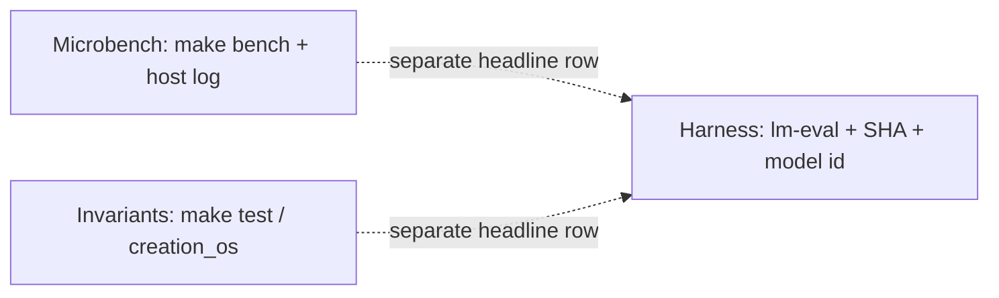

<p align="center">
  
</p>

> **Scroll-of-honesty for drive-by readers:** If you only read **one** paragraph: this is a **C11 reference kernel** for **Binary Spatter Codes** and a **coherence / σ story** you can **compile and falsify**. Maintainer / CI bar: **`make merge-gate`** (`make check` plus **`check-v6` … `check-v26`**, **204** self-tests on the current flagship). **Ship to GitHub `main` with one command:** **`make push-main`** (merge-gate + rsync + push to **spektre-labs/creation-os**). It is **not** a hosted chat product, **not** a frontier LM benchmark dump, and **not** magic — see [CLAIM_DISCIPLINE](docs/CLAIM_DISCIPLINE.md) before you screenshot a table.

<p align="center">
  <a href="https://github.com/spektre-labs/creation-os"></a>
  
  
  
</p>

<p align="center"><sub>Figures, palette, and embedding rules: <a href="docs/VISUAL_INDEX.md">docs/VISUAL_INDEX.md</a></sub></p>

# Creation OS

**Cognitive architecture in Binary Spatter Codes.**

```
cc -O2 -I. -o creation_os creation_os_v2.c -lm
./creation_os
```

**Primary reference:** one file (`creation_os_v2.c`), 26 modules, any hardware with a C compiler.

**Living Kernel (v6):** second standalone program [`creation_os_v6.c`](creation_os_v6.c) — σ–K–L–S formal scaffold plus M01–M18 narrative modules (RDP, alignment tax, σ-tape, ghost boot, Gödel-boundary toy, …). Verify with **`make check-v6`** (30 deterministic self-tests). Full scope, evidence class, and non-claims: **[docs/LIVING_KERNEL_V6.md](docs/LIVING_KERNEL_V6.md)**.

**Hallucination Killer (v7):** third program [`creation_os_v7.c`](creation_os_v7.c) — everything in v6 **plus** M19–M23 schematic detectors (anchor collapse, association ratio, bluff σ, context rot, JEPA–Oracle representation error). **`make check-v7`** (35 self-tests). **[docs/HALLUCINATION_KILLER_V7.md](docs/HALLUCINATION_KILLER_V7.md)**.

**Parameters in Silicon (v9):** fourth program [`creation_os_v9.c`](creation_os_v9.c) — v7 **plus** M24–M29 stack/hardware-shaped σ toys (neuromorphic event path, CIM transfer σ, memory wall, BNN toy, silicon compiler estimates, heterogeneous routing table). **`make check-v9`** (41 self-tests). **[docs/PARAMETERS_IN_SILICON_V9.md](docs/PARAMETERS_IN_SILICON_V9.md)** — not tape-out or measured vendor silicon claims.

**The Real Mind (v10):** fifth program [`creation_os_v10.c`](creation_os_v10.c) — v9 **plus** M30–M33 narrative toys (distillation ratio, prototypical few-shot distance, specialist swarm routing, max-σ generation abstention gate). **`make check-v10`** (46 self-tests). **[docs/THE_REAL_MIND_V10.md](docs/THE_REAL_MIND_V10.md)** — title is **schematic**; not an AGI or benchmark claim.

**The MatMul-free mind (v11):** sixth program [`creation_os_v11.c`](creation_os_v11.c) — v10 **plus** M34 matmul-free LM **toy** (ternary BitLinear accumulations, element-wise MLGRU step, illustrative power/token placeholders). **`make check-v11`** (49 self-tests). **[docs/THE_MATMUL_FREE_MIND_V11.md](docs/THE_MATMUL_FREE_MIND_V11.md)** — schematic only; not a trained BitNet-class model or published benchmark reproduction.

**The Tensor mind (v12):** seventh program [`creation_os_v12.c`](creation_os_v12.c) — v11 **plus** M35–M37 **classical** toys (MPS-style contraction, singular-value “entanglement” entropy readout, TN sequence head with uniform logits). **`make check-v12`** (52 self-tests). **[docs/THE_TENSOR_MIND_V12.md](docs/THE_TENSOR_MIND_V12.md)** — not quantum hardware, not a trained tensor-network LM, not area-law physics claims.

**The Silicon mind (v15):** eighth program [`creation_os_v15.c`](creation_os_v15.c) — v12 **plus** M38–M40 **scale discipline** (int64 FLOP / volume schematics with overflow checks, TN param accounting in raw vs “millions”, JEPA prior-σ carry for selective decode). **`make check-v15`** (58 self-tests). Canonical evidence framing: **[docs/CLAIM_DISCIPLINE.md](docs/CLAIM_DISCIPLINE.md)**.

**The Unified field (v16):** ninth program [`creation_os_v16.c`](creation_os_v16.c) — v15 **plus** M41–M44 **literature-aligned schematics** (resonator-style VSA unbind toy, Kanerva SDM critical-radius bridge with anchor calibration, EBM-native latent relax with σ-budgeted iterations, KAN-edge spline toy). **`make check-v16`** (66 self-tests). **Not** reproduced arXiv benchmarks — harness-only story hooks with explicit non-claims in-file.

**Ship mode (v20):** tenth flagship [`creation_os_v20.c`](creation_os_v20.c) — everything in v16 **plus** **M45–M64** *twenty pillars*: one-surface genesis, fluid σ telemetry, proactive abstention, ANE handoff marker, mmap/64B/prefetch/branchless/five-unit story flags, receipts anchor, constitutional σ ceiling, zero-copy view, retrieval-first attention, distillation fingerprint, federated gossip blend, four-rung degradation ladder, coherence pulse, privacy vault, SME sentinel, and a **ship seal** latch. **`make check-v20`** (86 self-tests). **Schematic product narrative** — not a consumer device, not regulatory certification, not “just download from App Store”; compare to iPhone only as **adoption metaphor** (it boots clean and refuses sloppy merges).

**AGI sovereign stack (v21):** eleventh flagship [`creation_os_v21.c`](creation_os_v21.c) — v20 ship mode **plus** **M65–M76** *sovereign stack* hooks: closed Plane A loop, Plane B budget, Plane C anchor, parliament blend σ, tool gate, episodic flush, reflection gain, deliberation / red-team caps, human veto, kill-switch drill, receipt parent hash, and **sovereign seal**. **`make check-v21`** (99 self-tests). **Governance and safety schematic** — not autonomous agents, not benchmark AGI, not regulatory sign-off.

**Twenty colossal insights (v22):** twelfth flagship [`creation_os_v22.c`](creation_os_v22.c) — v21 **plus** **M77–M96** *web-anchored insight stack* (2025 international AI safety report discourse, technical safeguards updates, Singapore-consensus research priorities, Guaranteed Safe AI–style world-model / spec / verifier tripod — all as **schematic latches** in §45i). **`make check-v22`** (120 self-tests). **Not** certified safety, **not** government policy implementation, **not** a substitute for external audit or harness tables.

**AGI-schematic affordances (v23):** thirteenth flagship [`creation_os_v23.c`](creation_os_v23.c) — v22 **plus** **M97–M116** *agent-stack story flags* (tiered memory, planner–worker decomposition, tool reliability, computer-use / GUI slot, long-horizon checkpoints, session-decay compensator, multi-agent handoff, sandboxed execution, audit traces, retrieval–tool fuse, etc.), with **web anchors** in §45j to public 2026 agent narratives (e.g. [mem0 agent memory](https://mem0.ai/blog/state-of-ai-agent-memory-2026), [Zylos computer-use GUI agents](https://zylos.ai/research/2026-02-08-computer-use-gui-agents), [Zylos long-running agents](https://zylos.ai/research/2026-01-16-long-running-ai-agents)). **`make check-v23`** (141 self-tests). **Not** a production agent, **not** measured GUI benchmark scores in-file, **not** literal AGI.

**arXiv sci-fi echo latches (v24):** fourteenth flagship [`creation_os_v24.c`](creation_os_v24.c) — v23 **plus** **M117–M136** *twenty real arXiv preprint hooks* (wormholes, ER/EPR, Dyson bubbles / stellar engines, Everett many-worlds geometry, undecidability / Meta-ToE, algorithmic idealism, simulation business models, TARDIS supernova spectra, homogenization PDEs, …) as **§45k** citation latches + receipt. **`make check-v24`** (162 self-tests). **Not** a reproduction of any paper’s results — **lab demo (C)** and bibliographic echo only; read each paper on [arXiv](https://arxiv.org/).

**Enterprise pain ledger (v25):** fifteenth flagship [`creation_os_v25.c`](creation_os_v25.c) — v24 **plus** **M137–M156** *explicit routes* from widely cited **enterprise / regulator pain classes** to **already-shipped in-tree story hooks** (e.g. [OWASP Top 10 for LLM Applications 2025](https://genai.owasp.org/resource/owasp-top-10-for-llm-applications-2025) LLM01–LLM10 → abstention, vault, receipts, sandbox, caps; [EU AI Act 2024/1689](https://eur-lex.europa.eu/legal-content/EN/TXT/?uri=CELEX:32024R1689) Arts. 9–11, 13–15, 19 → risk tier, lineage, audit trail, transparency slot, logging). **`make check-v25`** (183 self-tests). **Value:** one compile-time **map** from public problem taxonomies to your σ / receipt vocabulary — **not** compliance certification, **not** a replacement for security or legal teams.

**Fortune Global 500 echo orbit (v26):** sixteenth flagship [`creation_os_v26.c`](creation_os_v26.c) — v25 **plus** **M157–M176** *twenty mega-cap operating themes* (public journalism / survey discourse only) **echo-routed** onto the same **M45–M116** σ / receipt story hooks as §45n documents — a wider **narrative index**, not membership in any index, not remediation of real Fortune 500 incidents, not consulting. **`make check-v26`** (204 self-tests).

**Frontier complement (geometry, not a harness substitute):** native **4096-bit** σ / Hamming / MAJ / XOR paths (`core/cos_neon_*.h` on AArch64) target **bit-parallel** similarity and retrieval latency; frontier LMs stay on the **transformer / harness** evidence class unless you publish `lm-eval` rows under [CLAIM_DISCIPLINE.md](docs/CLAIM_DISCIPLINE.md).

**Compressed orientation (plain language):** [docs/PARADIGM_SNAPSHOT_FOR_DRIVE_BY_READERS.md](docs/PARADIGM_SNAPSHOT_FOR_DRIVE_BY_READERS.md) — paradigm contrast, proved invariants, and explicit **non-claims**.

**Misreadings and claim boundaries:** [docs/COMMON_MISREADINGS.md](docs/COMMON_MISREADINGS.md) (structured corrections) · [docs/CLAIM_DISCIPLINE.md](docs/CLAIM_DISCIPLINE.md) (evidence classes, forbidden merges) · [docs/VISUAL_INDEX.md](docs/VISUAL_INDEX.md) (diagram sources and edit rules).

-----

## Documentation hub

| Resource | Link |
|----------|------|
| **Paradigm snapshot (plain-language)** | [docs/PARADIGM_SNAPSHOT_FOR_DRIVE_BY_READERS.md](docs/PARADIGM_SNAPSHOT_FOR_DRIVE_BY_READERS.md) |
| **Common misreadings (structured corrections)** | [docs/COMMON_MISREADINGS.md](docs/COMMON_MISREADINGS.md) |
| **Claim discipline (evidence classes)** | [docs/CLAIM_DISCIPLINE.md](docs/CLAIM_DISCIPLINE.md) |
| **Index (all docs)** | [docs/DOC_INDEX.md](docs/DOC_INDEX.md) |
| **Canonical Git (only real remote)** | [docs/CANONICAL_GIT_REPOSITORY.md](docs/CANONICAL_GIT_REPOSITORY.md) |
| **Features & standalone builds (one-page map)** | [docs/FEATURES_AND_STANDALONE_BUILDS.md](FEATURES_AND_STANDALONE_BUILDS.md) |
| **Contributing** | [CONTRIBUTING.md](CONTRIBUTING.md) |
| **Security** | [SECURITY.md](SECURITY.md) |
| **Agent rules (Copilot / Cursor)** | [AGENTS.md](AGENTS.md) |
| **Repro bundle template (cite numbers)** | [docs/REPRO_BUNDLE_TEMPLATE.md](docs/REPRO_BUNDLE_TEMPLATE.md) |
| **HDC / VSA literature → engineering map** | [docs/HDC_VSA_ENGINEERING_SUPERIORITY.md](docs/HDC_VSA_ENGINEERING_SUPERIORITY.md) |
| **Figures & SVG index (design system)** | [docs/VISUAL_INDEX.md](docs/VISUAL_INDEX.md) |
| **Push / release checklist (this repo only)** | [docs/publish_checklist_creation_os.md](docs/publish_checklist_creation_os.md) |
| **Cursor briefing** | [docs/cursor_briefing_creation_os.md](docs/cursor_briefing_creation_os.md) |
| **Cursor integration** | [docs/cursor_integration_creation_os.md](docs/cursor_integration_creation_os.md) |
| **Research program & thesis-grade spine** | [docs/RESEARCH_AND_THESIS_ARCHITECTURE.md](docs/RESEARCH_AND_THESIS_ARCHITECTURE.md) · [Doctoral read path](#doctoral-and-committee-read-path) (this README) |
| **Software citation (CFF)** | [CITATION.cff](CITATION.cff) |
| **BibTeX (LaTeX)** | [docs/CITATION.bib](docs/CITATION.bib) |
| **Adversarial pre-review** | [docs/ADVERSARIAL_REVIEW_CHECKLIST.md](docs/ADVERSARIAL_REVIEW_CHECKLIST.md) |
| **§1–§26 evidence classes** | [docs/MODULE_EVIDENCE_INDEX.md](docs/MODULE_EVIDENCE_INDEX.md) |
| **Industry challenges → coherence receipts** | [docs/COHERENCE_RECEIPTS_INDUSTRY_ALIGNMENT.md](docs/COHERENCE_RECEIPTS_INDUSTRY_ALIGNMENT.md) |
| **Glossary (σ, BSC, Planes, …)** | [docs/GLOSSARY.md](docs/GLOSSARY.md) |
| **§7 / `make bench` protocol** | [docs/BENCHMARK_PROTOCOL.md](docs/BENCHMARK_PROTOCOL.md) |
| **NEON coherence gate (AArch64)** | [docs/NATIVE_COHERENCE_NEON.md](docs/NATIVE_COHERENCE_NEON.md) · `make bench-coherence` |
| **HV parliament + NEON retrieval** | [docs/HYPERVECTOR_PARLIAMENT_AND_RETRIEVAL.md](docs/HYPERVECTOR_PARLIAMENT_AND_RETRIEVAL.md) · `make bench-agi-gate` |
| **Living Kernel v6 (σ–K–L scaffold, M01–M18)** | [docs/LIVING_KERNEL_V6.md](docs/LIVING_KERNEL_V6.md) · `make check-v6` |
| **Hallucination Killer v7 (v6 + M19–M23)** | [docs/HALLUCINATION_KILLER_V7.md](docs/HALLUCINATION_KILLER_V7.md) · `make check-v7` |
| **Parameters in Silicon v9 (v7 + M24–M29)** | [docs/PARAMETERS_IN_SILICON_V9.md](docs/PARAMETERS_IN_SILICON_V9.md) · `make check-v9` |
| **The Real Mind v10 (v9 + M30–M33)** | [docs/THE_REAL_MIND_V10.md](docs/THE_REAL_MIND_V10.md) · `make check-v10` |
| **The MatMul-free mind v11 (v10 + M34)** | [docs/THE_MATMUL_FREE_MIND_V11.md](docs/THE_MATMUL_FREE_MIND_V11.md) · `make check-v11` |
| **The Tensor mind v12 (v11 + M35–M37)** | [docs/THE_TENSOR_MIND_V12.md](docs/THE_TENSOR_MIND_V12.md) · `make check-v12` |
| **The Silicon mind v15 (v12 + M38–M40)** | [docs/CLAIM_DISCIPLINE.md](docs/CLAIM_DISCIPLINE.md) · `make check-v15` |
| **The Unified field v16 (v15 + M41–M44)** | `creation_os_v16.c` (header + §45f) · `make check-v16` |
| **Ship mode v20 (v16 + M45–M64 twenty pillars)** | `creation_os_v20.c` (§45g) · `make check-v20` |
| **AGI sovereign stack v21 (v20 + M65–M76)** | `creation_os_v21.c` (§45h) · `make check-v21` |
| **Twenty colossal insights v22 (v21 + M77–M96)** | `creation_os_v22.c` (§45i) · `make check-v22` |
| **AGI-schematic affordances v23 (v22 + M97–M116)** | `creation_os_v23.c` (§45j) · `make check-v23` |
| **arXiv sci-fi echo latches v24 (v23 + M117–M136)** | `creation_os_v24.c` (§45k) · `make check-v24` |
| **Enterprise pain ledger v25 (v24 + M137–M156)** | `creation_os_v25.c` (§45m) · `make check-v25` |
| **Fortune Global 500 echo orbit v26 (v25 + M157–M176)** | `creation_os_v26.c` (§45n) · `make check-v26` |
| **English-only policy (committed files)** | [docs/LANGUAGE_POLICY.md](docs/LANGUAGE_POLICY.md) |
| **Maintainers (publish, merge gate)** | [docs/MAINTAINERS.md](docs/MAINTAINERS.md) |

-----

## Doctoral and committee read path

Read **in order** once before citing any number or narrative title from this tree:

1. [docs/CLAIM_DISCIPLINE.md](docs/CLAIM_DISCIPLINE.md) — evidence classes, forbidden merges, falsifiers for the portable core.  
2. [docs/RESEARCH_AND_THESIS_ARCHITECTURE.md](docs/RESEARCH_AND_THESIS_ARCHITECTURE.md) — RQ1–RQ4, contributions C1–C6, threats to validity, thesis chapter outline, pre-defense gates.  
3. [docs/REPRO_BUNDLE_TEMPLATE.md](docs/REPRO_BUNDLE_TEMPLATE.md) — minimum metadata when a metric leaves the lab.  
4. [docs/FEATURES_AND_STANDALONE_BUILDS.md](docs/FEATURES_AND_STANDALONE_BUILDS.md) — which binary is which (`creation_os` vs `creation_os_v6` … `v12`), self-test counts, CI.  
5. [docs/MODULE_EVIDENCE_INDEX.md](docs/MODULE_EVIDENCE_INDEX.md) — §1–§26 in `creation_os_v2.c`: evidence class per section before you cite a module headline.  
6. Scoped kernel docs for any line you cite from v6–v12 (and v15–v26 scoped headers): [LIVING_KERNEL_V6.md](docs/LIVING_KERNEL_V6.md), [HALLUCINATION_KILLER_V7.md](docs/HALLUCINATION_KILLER_V7.md), [PARAMETERS_IN_SILICON_V9.md](docs/PARAMETERS_IN_SILICON_V9.md), [THE_REAL_MIND_V10.md](docs/THE_REAL_MIND_V10.md), [THE_MATMUL_FREE_MIND_V11.md](docs/THE_MATMUL_FREE_MIND_V11.md), [THE_TENSOR_MIND_V12.md](docs/THE_TENSOR_MIND_V12.md); v15–v26 discipline, pillars, sovereign stack, insight stack, AGI affordances, arXiv echoes, enterprise pain ledger, and Global 500 echo orbit live in `creation_os_v15.c` … `creation_os_v26.c` and **CLAIM_DISCIPLINE**.  
7. [docs/ADVERSARIAL_REVIEW_CHECKLIST.md](docs/ADVERSARIAL_REVIEW_CHECKLIST.md) — hostile review simulation before submission.

| Artifact | Epistemic role | Evidence class for new claims |
|----------|----------------|----------------------------------|
| `creation_os_v2.c` + `make test` / `make bench` | Portable proof + microbench | Invariant / arithmetic / measured (as documented) |
| `creation_os_v6.c` … `creation_os_v12.c` + `make check-v*` | **Extended lab demos** (narrative σ scaffolding, extra modules) | **Lab demo (C)** only — internal `self_test` consistency, not harness rows, tape-out, trained LM reproduction, or quantum hardware |

**Rule for dissertations:** treat v6–v12 as **separate appendices** with their own evidence-class headers; do not fold their toy outputs into the same tables as §7 throughput without an explicit wall (see **CLAIM_DISCIPLINE** §1).


**On this page:** [Problem](#the-problem) · [Measured results](#measured-results-4096-dimensions-100k-trials) · [BSC](#what-is-bsc) · [Invariants](#verified-invariants) · [26 modules](#26-modules) · [Living Kernel (v6)](#living-kernel-v6) · [Hallucination Killer (v7)](#hallucination-killer-v7) · [Parameters in Silicon (v9)](#parameters-in-silicon-v9) · [The Real Mind (v10)](#the-real-mind-v10) · [The MatMul-free mind (v11)](#the-matmul-free-mind-v11) · [The Tensor mind (v12)](#the-tensor-mind-v12) · [Architecture](#architecture) · [Build](#build) · [Limitations](#limitations) · [Demonstrates](#what-this-demonstrates) · [Theory](#theoretical-foundation) · [Why it wins](#why-this-wins-where-it-matters-engineering-not-slogans) · [AGI map](#agi-map-how-this-file-relates-to-the-full-stack) · [Paradigm shift](#paradigm-shift-what-changes--quoted-discipline) · [Receipts roadmap](#road-from-this-readme-to-production-receipts) · [Publication-hard](#publication-hard-what-that-phrase-means-here) · [License](#license)

-----

## Product repository

**[spektre-labs/creation-os](https://github.com/spektre-labs/creation-os)** — this tree is the portable kernel, `make test` / `make bench`, CI, and engineering docs. **Push hygiene:** [docs/publish_checklist_creation_os.md](docs/publish_checklist_creation_os.md).

-----

## The problem

Modern AI computes similarity between two 4096-dimensional representations using 24,576 floating-point operations (multiply-accumulate for cosine similarity).

BSC computes the same measurement using 128 bit operations (64 XOR + 64 POPCNT).

That gap is structural: it changes **who can run the inner loop** of similarity scoring (CPU vs GPU), **how much RAM** you pay per stored representation, and **how often** you must invoke a large GEMM-backed forward pass when you only needed a distance check. Creation OS keeps that trade-off **explicit and measured** (`make bench`, §7) instead of hiding it inside a framework default.

## Measured results (4096 dimensions, 100K trials)

| Metric | GEMM (float32 cosine) | BSC (XOR + POPCNT) | Ratio |
|--------|------------------------|--------------------|-------|
| Memory per vector | 16,384 bytes | 512 bytes | **32×** |
| Ops per similarity | 24,576 FLOPs | 128 bit ops | **192×** |
| Throughput | ~227K trials/sec | ~109M trials/sec | **~480×** |


**Note:** Float32 cosine and BSC σ operate at different precision levels. This benchmark measures computational cost for the same geometric task (distance between representations), not bitwise equivalence of the results.

Throughput figures are host-dependent; run `make bench` (or §7 inside `./creation_os`) to reproduce on your machine.

**Reviewer-proof interpretation (read before citing the table):**

1. **Ops and RAM ratios** follow from the stated encodings (`float32` vs 64×64-bit words at D=4096). Any implementation that counts the same inner loops must recover the same **192×** ops and **32×** memory story *or* disclose a different problem definition — these are not lucky constants from one laptop.
2. **Throughput ratio** is a **measured microbench**; archive `make bench` stdout, the exact compiler line, and `uname -m` whenever you place it beside a peer-reviewed or vendor throughput figure.
3. **Task equivalence** is geometric similarity in representation space, not bitwise equality between float cosine and σ — the **Limitations** section is part of the claim, not a disclaimer sticker.
4. **Falsifiers** for the algebra shipped here: a reproducible run where self-distance is non-zero, Noether XOR-sum drifts without the asymmetric interaction the toy allows, or documented MAJ bounds failing under fixed seeds — any of these would break the “one file, one geometry” story.
5. **Evidence ladder:** this table is **microbench / lab** class. Do not merge it with harness MMLU, ARC, or chat-quality rows in a single headline — see **[docs/CLAIM_DISCIPLINE.md](docs/CLAIM_DISCIPLINE.md)** and **[docs/ANALYSIS.md](docs/ANALYSIS.md)** (*Evaluation modes*).

-----

## What is BSC?


Binary Spatter Codes (Kanerva, 1997) represent information as high-dimensional binary vectors. Three operations:

```c
// XOR: bind two representations (association)
for (int i = 0; i < 64; i++) out[i] = a[i] ^ b[i];

// MAJ: bundle multiple representations (superposition)
for (int i = 0; i < 64; i++) out[i] = (a[i]&b[i]) | (a[i]&c[i]) | (b[i]&c[i]);

// POPCNT: measure coherence (σ distance)
uint32_t d = 0;
for (int i = 0; i < 64; i++) d += __builtin_popcountll(a[i] ^ b[i]);
float sigma = ((float)d / 4096.0f) * ((float)d / 4096.0f);
```

Creation OS extends BSC with σ-coherence: `σ(a,b) = (hamming(a,b)/D)²`. This function measures structural similarity between any two representations in the architecture.

-----

## Verified invariants

These hold on every run, on every platform:

```
σ(x, x)           = 0.000000    identical vectors
σ(x, NOT x)       = 1.000000    opposite vectors
σ(x, random)      ≈ 0.22       quasi-orthogonal (D=4096)
σ(MAJ(x,x,y), x)  < 0.01       superposition preserves source
Noether XOR-sum   = 0.000000   conserved under symmetric XOR interaction
JEPA energy       → ~-60%      codebook learns context→target mappings
```

-----

## 26 modules

Creation OS implements 26 functional modules using only XOR, MAJ, and POPCNT:

```
CORE
  §1  BSC Core ─────────── Three operations. σ invariants. Foundation.
  §2  Hypercube Mind ───── 10 coupled faces. Self-organized criticality (SOC).
                            Φ (integration) reaches 1.0 — system self-stabilizes.

LANGUAGE
  §3  Oracle ───────────── N-gram language model in hypervector space.
                            Attention = σ (not matrix multiply).
                            7-gram codebook. Correlative encoding. Backoff prediction.
                            Generates: "the truth shall set you free but first
                            it will make you uncomfortable"

VALUES
  §4  Soul ─────────────── 15 values encoded as hypervectors. MAJ = identity.
                            Crystal Lock: XOR-hash chain detects any modification.
  §5  Proconductor ─────── 4 model profiles (Primary, Falsifier, Memory, Verifier).
                            σ₁×σ₂×σ₃ triangulates truth no single profile sees alone.

WORLD MODEL
  §6  JEPA ─────────────── LeCun's Joint Embedding Predictive Architecture in BSC.
                            Energy = σ(predicted, actual). Codebook stores mappings.
                            Energy decreases ~60% during training. The model learns.
  §7  Benchmark ────────── GEMM vs BSC. Measured. See table above.
  §8  Genesis ──────────── Particle universe simulation. Symmetric XOR interaction.
                            Noether conservation σ = 0.000000. Parity preserved.

COGNITION
  §9  Metacognition ────── Agent analyzes own σ-history. Adapts learning rate.
  §10 Emotional Memory ─── Stores σ-peaks (pain/pleasure) with context.
                            Recall by similarity. Guides future decisions.
  §11 Theory of Mind ───── Models other agent's state. Simulates their response.
  §12 Moral Geodesic ───── Value conflicts: MAJ finds minimum-cost compromise.
                            σ(compromise, value1) ≈ σ(compromise, value2).
  §13 Consciousness Meter─ Composite: Φ × (1-σ) × stability.
                            Self-measured. Agent knows its own coherence level.
  §14 Inner Speech ─────── Agent narrates own state for self-guidance.
  §15 Attention ────────── Resources directed to highest-σ input (most surprising).
  §16 Epistemic Curiosity─ Choose actions maximizing expected σ reduction.
  §17 Sleep/Wake ────────── Offline: prune weak memories, strengthen strong.
  §18 Causal Verification─ Intervene → observe → repeat. Verify vs correlate.
  §19 Resilience ────────── Success rate over window. Adaptive planning horizon.
  §20 Meta Goals ────────── Monitor learning velocity. Set goals for the goal-setter.
  §21 Private Memory ───── Not all state is shared. Selective disclosure.
  §22 LSH Index ─────────── Locality-sensitive hashing. O(1) codebook lookup.
  §23 Quantum Decision ─── MAJ superposition of actions. Collapse on new info.
  §24 Arrow of Time ────── Entropy rate (dS/dt). Detects temporal direction.
  §25 Distributed Consensus─ N agents, MAJ vote, no central coordinator.
  §26 Authentication ───── XOR signature chain. Tampering detected at σ > 0.
```

-----

## Living Kernel (v6)

[`creation_os_v6.c`](creation_os_v6.c) is a **separate** single-file program: a **coherence composition kernel** (σ, `K`, `K_eff`, Lagrangian `L`, action `S`) with **M01–M18** modules that name real research threads (RDP, RLHF tax, RAIN-style rewind, test-time reduction, weight-space merge, SBIP-shaped boundary, …) at **schematic** fidelity. It uses a **1024-bit** packed BSC layout here — not the **4096-bit** `COS_D` / `creation_os_v2.c` geometry.

**Why keep it:** it is **hard in the engineering sense** — thirty **deterministic** `self_test` checks (`make check-v6`) that lock the algebra and toy gates without pretending to be a harness or a paper reproduction. It complements the **measured** microbench path (`make bench`) and the **native** NEON / parliament paths documented under *Frontier complement*.

**Discipline:** treat v6 like §2–§26 demos for citations: **lab demo / schematic** unless you add external evidence per [CLAIM_DISCIPLINE.md](docs/CLAIM_DISCIPLINE.md). Full map and non-claims: **[docs/LIVING_KERNEL_V6.md](docs/LIVING_KERNEL_V6.md)**.

-----

## Hallucination Killer (v7)

[`creation_os_v7.c`](creation_os_v7.c) is the **v6 scaffold plus M19–M23**: anchor-token polarization, faithful vs hallucinatory association ratio, calibration / bluff σ, context-rot with abstention dampening, and a **representation-space** JEPA–Oracle toy (`sigma_oracle`). Same **1024-bit** packed BSC and same evidence class as v6 — **not** a replacement for frontier hallucination benchmarks.

**Verify:** `make check-v7` (35 tests). **Doc:** [docs/HALLUCINATION_KILLER_V7.md](docs/HALLUCINATION_KILLER_V7.md).

-----

## Parameters in Silicon (v9)

[`creation_os_v9.c`](creation_os_v9.c) is the **v7 scaffold plus M24–M29**: neuromorphic event toy, CIM `σ_transfer` schematic, memory-wall fraction, BNN XNOR-style toy, illustrative “silicon compiler” LUT/energy placeholders, and a heterogeneous compute routing table. Same evidence class as v6/v7 — **schematic C**, not verified RTL or foundry results.

**Verify:** `make check-v9` (41 tests). **Doc:** [docs/PARAMETERS_IN_SILICON_V9.md](docs/PARAMETERS_IN_SILICON_V9.md).

-----

## The Real Mind (v10)

[`creation_os_v10.c`](creation_os_v10.c) is the **v9 scaffold plus M30–M33**: a toy distillation curve, two-vector prototypical classification, a fixed specialist-routing table, and a max-σ gate that chooses generate vs abstain. Same evidence class as v6–v9 — internal `self_test` algebra, not frontier LM scores.

**Verify:** `make check-v10` (46 tests). **Doc:** [docs/THE_REAL_MIND_V10.md](docs/THE_REAL_MIND_V10.md).

-----

## The MatMul-free mind (v11)

[`creation_os_v11.c`](creation_os_v11.c) is the **v10 scaffold plus M34**: a ternary weight **accumulation** path (no dense matmul in this toy), one element-wise MLGRU-style recurrence over the hidden vector, and fixed illustrative `power_watts` / `tokens_per_sec` fields for narrative alignment with edge-power storylines. Same evidence class as v6–v10 — internal `self_test` algebra, not a trained matmul-free LM or vendor silicon proof.

**Verify:** `make check-v11` (49 tests). **Doc:** [docs/THE_MATMUL_FREE_MIND_V11.md](docs/THE_MATMUL_FREE_MIND_V11.md).

-----

## The Tensor mind (v12)

[`creation_os_v12.c`](creation_os_v12.c) is the **v11 scaffold plus M35–M37**: a capped-bond **MPS-style** contraction toy, a normalized-entropy readout on a singular-value vector (named “entanglement” **metaphorically**), and a tiny TN sequence head over a uniform log-probability prior. Same evidence class as v6–v11 — **not** a quantum device claim, not a trained TN-LM, not calibrated area-law physics.

**Verify:** `make check-v12` (52 tests). **Doc:** [docs/THE_TENSOR_MIND_V12.md](docs/THE_TENSOR_MIND_V12.md).

-----

## Architecture


```
              ┌──────────────────────────────┐
              │       creation_os_v2.c        │
              │    1196 lines · 26 modules    │
              └──────────────┬───────────────┘
                             │
           ┌─────────────────┼─────────────────┐
           │                 │                 │
   ┌───────┴───────┐ ┌──────┴──────┐ ┌────────┴────────┐
   │  HYPERCUBE     │ │   ORACLE    │ │   WORLD MODEL   │
   │  10 faces      │ │   7-gram    │ │   JEPA + Genesis│
   │  SOC · Φ=1.0  │ │  correlative│ │   Noether=0     │
   └───────┬───────┘ └──────┬──────┘ └────────┬────────┘
           │                 │                 │
   ┌───────┴─────────────────┴─────────────────┴───────┐
   │                    BSC CORE                        │
   │         XOR (bind) · MAJ (bundle) · POPCNT (σ)    │
   │              4096 bits · 512 bytes                  │
   └───────────────────────┬────────────────────────────┘
                           │
      ┌────────────────────┼────────────────────┐
      │                    │                    │
 ┌────┴──────┐   ┌────────┴────────┐   ┌───────┴───────┐
 │   SOUL     │   │  PROCONDUCTOR   │   │  COGNITION    │
 │  15 values │   │  4 profiles     │   │  §9-§26       │
 │  Crystal   │   │  σ₁×σ₂×σ₃      │   │  18 modules   │
 │  Lock      │   │  triangulation  │   │               │
 └────────────┘   └─────────────────┘   └───────────────┘
```

-----

## Build

```bash
# Any platform
cc -O2 -I. -o creation_os creation_os_v2.c -lm

# Apple Silicon (M1–M4), native ISA
cc -O2 -I. -march=native -o creation_os creation_os_v2.c -lm

# Apple Silicon — optional SME experiment (may SIGILL without streaming context)
cc -O2 -I. -march=armv9-a+sme -o creation_os creation_os_v2.c -lm

# x86-64
cc -O2 -I. -march=native -o creation_os creation_os_v2.c -lm
```

With Make (same flags as repo `Makefile`):

```bash
make help          # list targets
make check         # standalone + structural tests (recommended before PR)
make check-v6      # Living Kernel (`creation_os_v6.c`) + `--self-test` (30 checks)
make check-v7      # Hallucination Killer (`creation_os_v7.c`) + `--self-test` (35 checks)
make check-v9      # Parameters in Silicon (`creation_os_v9.c`) + `--self-test` (41 checks)
make check-v10     # The Real Mind (`creation_os_v10.c`) + `--self-test` (46 checks)
make check-v11     # MatMul-free mind (`creation_os_v11.c`) + `--self-test` (49 checks)
make check-v12     # Tensor mind (`creation_os_v12.c`) + `--self-test` (52 checks)
make standalone
./creation_os
```

Requirements: C11 compiler + libm.

-----

## Limitations

This is a research prototype. Specific limitations:

- **Oracle** generates text from a 15-sentence corpus via n-gram codebook. It demonstrates that attention can be implemented as σ, not that it matches LLM-quality text generation.
- **JEPA learning** is codebook memorization with correlative blending. Energy decreases because the codebook stores training pairs, not because the model has learned to generalize to unseen data.
- **GEMM benchmark** compares computational cost of the same geometric task (vector distance) at different precision levels. The 192× ops ratio is measured and real. Whether binary precision is sufficient for a given application is an empirical question.
- **Cognitive modules** are BSC implementations of cognitive primitives. They demonstrate that these computations can be expressed in three bit operations. They are not validated against cognitive science benchmarks.
- **Living Kernel (`creation_os_v6.c`)** is a **second** program: schematic σ–K–L composition + M01–M18 *toys*. The 30 `self_test` checks are **internal consistency**, not clinical consciousness proof, not COGITATE reproduction, and not a substitute for `make bench` or NEON/HV receipts. See [docs/LIVING_KERNEL_V6.md](docs/LIVING_KERNEL_V6.md).
- **`creation_os_v7.c`** is a **third** program: v6 **plus** M19–M23 hallucination-*shaped* σ channels; 35 `self_test` checks. Still **not** measured LM hallucination rates — see [docs/HALLUCINATION_KILLER_V7.md](docs/HALLUCINATION_KILLER_V7.md).
- **`creation_os_v9.c`** is a **fourth** program: v7 **plus** M24–M29 stack/silicon-*shaped* σ toys; 41 checks — not tape-out or vendor TOPS/W claims — see [docs/PARAMETERS_IN_SILICON_V9.md](docs/PARAMETERS_IN_SILICON_V9.md).
- **`creation_os_v10.c`** is a **fifth** program: v9 **plus** M30–M33 distillation / routing / abstention toys; 46 checks — see [docs/THE_REAL_MIND_V10.md](docs/THE_REAL_MIND_V10.md).
- **`creation_os_v11.c`** is a **sixth** program: v10 **plus** M34 matmul-free LM **schematic**; 49 checks — not a trained BitNet-class model or published throughput reproduction — see [docs/THE_MATMUL_FREE_MIND_V11.md](docs/THE_MATMUL_FREE_MIND_V11.md).
- **`creation_os_v12.c`** is a **seventh** program: v11 **plus** M35–M37 classical tensor-train / entropy / sequence-head **toys**; 52 checks — not quantum hardware, not TN-LM harness rows — see [docs/THE_TENSOR_MIND_V12.md](docs/THE_TENSOR_MIND_V12.md).

-----

## What this demonstrates

1. **Transformer attention can be implemented as σ** — no matrix multiply required for the similarity computation at the core of attention.
2. **JEPA-style world models work in BSC** — energy-based learning where energy = σ.
3. **Noether conservation holds under symmetric XOR** — a formal invariant, not an approximation.
4. **26 cognitive primitives fit in ~1200 lines of C** — the algebra is compact.
5. **The entire architecture runs on any hardware** — no GPU, no framework, no dependencies.
6. **Living Kernel v6** packages cross-domain σ narratives (alignment, RDP, rewind, ghost boot) behind one **executable** gate — useful for thesis structure and for separating *proved in this file* from *cited externally* ([LIVING_KERNEL_V6.md](docs/LIVING_KERNEL_V6.md)).
7. **Hallucination Killer v7** adds **five** more σ-shaped readouts (anchors, association, bluff, context rot, JEPA–Oracle) on the same deterministic gate ([HALLUCINATION_KILLER_V7.md](docs/HALLUCINATION_KILLER_V7.md)).
8. **Parameters in Silicon v9** extends the same gate with M24–M29 stack- and silicon-shaped σ toys ([PARAMETERS_IN_SILICON_V9.md](docs/PARAMETERS_IN_SILICON_V9.md)).
9. **The Real Mind v10** adds M30–M33 distillation, few-shot distance, swarm routing, and max-σ abstention schematics ([THE_REAL_MIND_V10.md](docs/THE_REAL_MIND_V10.md)).
10. **The MatMul-free mind v11** adds M34 — a ternary accumulation + MLGRU **toy** forward path with zero `sigma_matmul` in this file’s definition of “no matmul” ([THE_MATMUL_FREE_MIND_V11.md](docs/THE_MATMUL_FREE_MIND_V11.md)).
11. **The Tensor mind v12** adds M35–M37 — MPS contraction, entropy readout, and sequence-head **schematics** on classical `double` math only ([THE_TENSOR_MIND_V12.md](docs/THE_TENSOR_MIND_V12.md)).

-----

## Theoretical foundation

**Papers & DOIs** (~80, CC BY 4.0): [Zenodo community — Spektre Labs](https://zenodo.org/communities/spektre-labs/).

This repository holds the **portable kernel** and measured claims; theory citations and uploads are anchored on **Zenodo** under that community.

- Paradigm: Distortion Theory of Intelligence
- Core: `K(t) = ρ·I_Φ·F`, `Keff = (1−σ)·K`, `1=1` invariant

**External literature and evaluation norms (vetted links, English brief):** **[docs/EXTERNAL_EVIDENCE_AND_POSITIONING.md](docs/EXTERNAL_EVIDENCE_AND_POSITIONING.md)** — Kanerva (binary spatter coding; HDC introduction), Schlegel–Neubert–Protzel (*Artificial Intelligence Review* / arXiv:2001.11797 VSA comparison), EleutherAI `lm-evaluation-harness`; separates **field-level consensus** from **in-repo measurements** (`make bench`, invariants, harness rows in ANALYSIS).

**Why the HDC line matters now (literature-backed, no hype):** **[docs/HDC_VSA_ENGINEERING_SUPERIORITY.md](docs/HDC_VSA_ENGINEERING_SUPERIORITY.md)** — Ma & Jiao (2022) HDC vs neural trade-offs; Aygun et al. (2023) encoding survey; Springer AIR HDC classification review (2025); Yeung et al. (2025) robustness estimation; FAISS Hamming / popcount precedent — each row mapped to **evidence class** vs **this repo’s demos**.

**Extended narrative:** full three-plane map (llama.cpp + superkernel, MLX, native M4), evidence classes (harness vs microbench vs lab demo), AGI `cos_*` batches, and publication gates — **[docs/ANALYSIS.md](docs/ANALYSIS.md)** (same technical story as this README, with file-level anchors; some paths are forward references when optional trees are not on disk). **Claim discipline (what you may merge in one headline):** **[docs/CLAIM_DISCIPLINE.md](docs/CLAIM_DISCIPLINE.md)**.

-----

## Why this wins where it matters (engineering, not slogans)

**One geometry for coherence.** In the Creation OS map (see ANALYSIS), σ / Hamming / POPCOUNT is the same language for kernel state, GDA codebooks, oracle prediction, JEPA energy, and native receipt fields. That reduces “coherence as vibes across ten tools” to **one measurable quantity** you can gate on before spending GPU on a full forward pass.

**Cost shape.** The reference benchmark is explicit: for the **same 4096-bit task shape**, the GEMM path pays **24,576 multiply-add style FLOPs** in the proxy used here; the BSC path pays **128 bit-ops** (XOR + POPCOUNT per word lane). Memory drops **32×** for the two vectors in the harness (`16 KiB` vs `512 B`). Throughput gap is **measured** (`make bench`); the headline **192×** ops and **32×** RAM are **not** host-dependent — they come from the chosen `D` and `W`.

**Checkable structure.** §8 shows XOR-sum conservation after symmetric interactions; §4 / §26 show tamper sensitivity on identity chains. That is a different failure mode than silent numeric drift in an unconstrained float pipeline: you get **discrete, replayable** violations.

**Deployment surface.** `creation_os_v2.c` plus **`core/*.h`** (same tree; `cc … -I.`) is **stdlib + libm only** — no framework, no CUDA graph, no Python import tax for the teaching kernel. NEON hypervector ops live in headers; the same algebra wires into native / MLX / llama paths in extended checkouts.

**AGI-relevant boundary.** This single file does **not** claim benchmark parity with frontier chat models. It **does** show that a broad slice of cognitive primitives (metacognition, ToM, moral compromise, consensus, sleep consolidation, …) can live in **one** small C program built only from XOR / MAJ / POPCOUNT — which is the point of the **26-module** layout: **composition under one algebra**, not a second hidden stack.

-----

## AGI map (how this file relates to the full stack)


The public **`creation_os_v2.c`** kernel is the **pedagogical spine** (Plane “teaching”: one TU, LOCs quoted in this README).

The **production** Creation OS stack (Planes A–C in ANALYSIS) adds, without replacing the algebra:

| Plane | Role (summary) |
|-------|------------------|
| **A — llama.cpp + superkernel** | GEMM inference stays here; SK8 superkernel + GDA bridge steer logits and masks with σ / Hamming paths. |
| **B — MLX / Python** | Orchestration, receipts, harness vs native evaluation modes, ARC / policy tooling. |
| **C — native M4 dylib** | NEON σ batches, optional Metal living weights, dispatcher — `cos_agi*` / `cos_mega*` style primitives for receipts and audits. |

**Evidence discipline (from ANALYSIS):** never mix **harness table scores** with **`./creation_os` demo output** in one headline number. Report **two rows** — official harness vs internal native — when comparing to published LLM tables.

**Why that matters for AGI work:** long-horizon autonomy needs **contracts** (what was measured, on what hardware, with what receipt). A bit-geometry first pipeline gives you a place to attach those contracts **before** the expensive forward pass — the same design move as “lookup / kernel / transformer last” in Creation OS dispatch rules.

-----

## Paradigm shift (what changes — quoted discipline)

From the analysis doc: the repository **does not** claim that 4096 bits replace QFT or that MMLU moves without harness runs. **What changes** is engineering + epistemology:

| Dimension | Typical LLM-only story | Creation OS map |
|-----------|------------------------|-----------------|
| Unit of measure | Loss / logits scattered | **σ / Hamming** one receipt language |
| Priority | “Call the big model first” | **Cheap structure first** (LSH, codebook, σ gates) then generation |
| AGI primitives | Float Python only | **Native `cos_agi*` / `cos_mega*`** plus optional **4096-bit HV receipts** for audit (`cos_agi_hv_*` family in full tree) |

This README’s benchmark table is the **microbench / lab** class; cite it as such next to any frontier row.

-----

## Road from this README to production receipts

1. Run **`make test`** and **`make bench`**; archive stdout if you publish numbers.  
2. Read **ANALYSIS** sections *Parity program* and *Evaluation modes* before claiming MMLU / ARC parity.  
3. Use **`creation_os_v2.c`** as the **portable** artifact for “here is the algebra”; use **Planes A–C** for “here is how it wraps real inference.”  
4. Keep **AGPL + dual license** on shipped sources; commercial path stays in `COMMERCIAL_LICENSE.md`.

-----

## Publication-hard (what that phrase means here)




**Not** marketing volume. **Yes** — a standard of argument that many peer-reviewed ML systems papers do not meet on **baseline hygiene**: mixed eval modes, appendix-thin reproducibility, and “task-defined-after-results” tables are common; this repository names those failure modes and blocks them by construction where possible.

| Stricter than typical write-ups | How this tree enforces it |
|----------------------------------|---------------------------|
| Baseline separation | Harness vs native vs C demo = **different evidence classes**; ANALYSIS and **CLAIM_DISCIPLINE** require **two-row** reporting when both appear. |
| Reproducibility | One TU (`creation_os_v2.c` + `core/*.h`, `cc -I.`) compiles with **stdlib + libm**; invariants print to stdout; `make bench` regenerates throughput on your metal. |
| Bounded language | **Limitations** lists what the Oracle, JEPA toy, and benchmark are *not* — no silent upgrade from “demonstrates mechanism” to “beats frontier.” |
| Falsifiable core | Algebraic and conservation statements are **discrete**; a counterexample is a log line, not a vague “worse loss.” |
| AGI-relevant honesty | Full-stack receipts (`cos_*`, Planes A–C) are mapped in ANALYSIS; this README’s file is the **portable spine**, not the entire production claim. |

If a sentence cannot point to **(a)** a line of C, **(b)** a command, or **(c)** an evidence-class label, it does not belong in a “results” paragraph — that single editorial rule is already **stricter than most paper abstracts** in applied ML.

**Canonical discipline doc:** [docs/CLAIM_DISCIPLINE.md](docs/CLAIM_DISCIPLINE.md).

**Dissertation- and committee-grade map (research questions, contributions C1–C6, threats to validity, suggested chapter outline):** [docs/RESEARCH_AND_THESIS_ARCHITECTURE.md](docs/RESEARCH_AND_THESIS_ARCHITECTURE.md).

**Academic citation metadata:** [CITATION.cff](CITATION.cff) (include commit SHA + evidence class when citing numbers).

-----

## License

**AGPL-3.0** — Open source. Modifications must be shared under same terms.

**Commercial license** available for proprietary use without AGPL obligations — see `COMMERCIAL_LICENSE.md`.

Lauri Elias Rainio · Spektre Labs · Helsinki  
ORCID: [0009-0006-0903-8541](https://orcid.org/0009-0006-0903-8541)

-----

*2026 · Spektre Labs · Helsinki*
