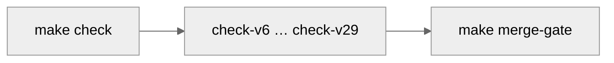
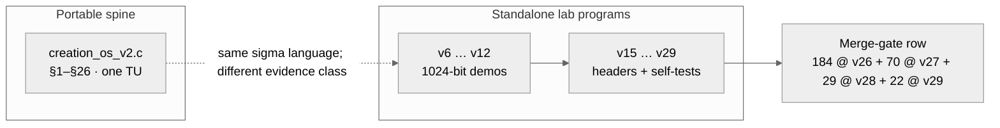
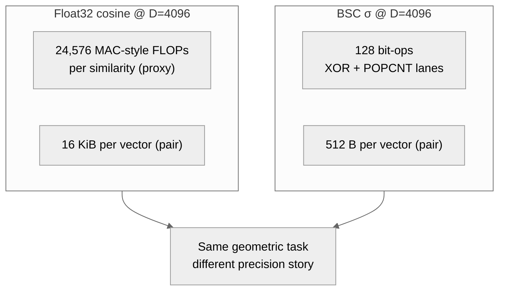
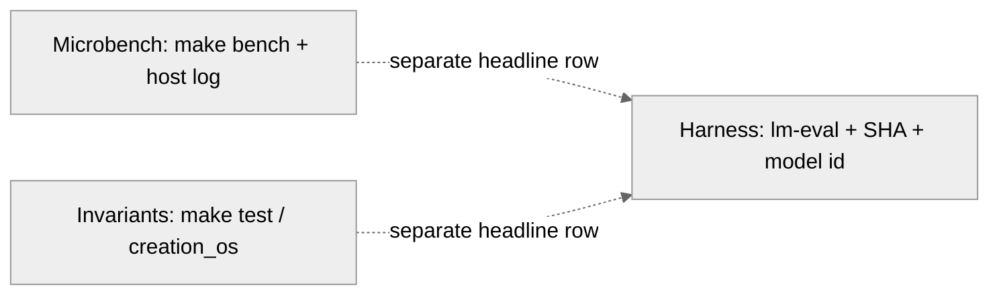

<p align="center">
  
</p>

<h1 align="center">Creation OS</h1>

<p align="center"><sub><strong>A local AI runtime that proves every answer before it shows it to you.</strong><br/>
Forty branchless integer kernels · one composed verdict · <strong>1 = 1</strong>.</sub></p>

<!-- =====================================================================
     The 30-second drop from the chair.
     If a stranger with no GitHub experience lands here, these two blocks
     are the *entire* contract.  One command.  Forty kernels.  Live numbers.
     ===================================================================== -->

<p align="center">
  <a href="#try-it-in-30-seconds"></a>
  <a href="#the-forty-kernel-receipt"></a>
  <a href="#the-forty-kernel-receipt"></a>
  <a href="#the-forty-kernel-receipt"></a>
  <a href="#the-forty-kernel-receipt"></a>
</p>

<p align="center"><sub>
  <strong>Forty falsifiable kernels</strong>, one `AND` gate.  Reasoning · reversibility · meta-cognition · world-model · memory · adaptive compute · geometric algebra · sheaf topology · post-quantum crypto · homomorphic compute · neuromorphic spikes · hierarchical active inference · quantum amplitude amplification · integer diffusion sampler · Q-learning+GAE+PPO · persistent homology · structural causal do-calculus · sub-quadratic Hyena long-convolution.  Every one is integer-only, branchless on the hot path, and breaks on a single mutated line.
</sub></p>

<a id="measured-results-v111-1"></a>

### Measured results — v111.1 Frontier parity matrix

`σ` is not rhetoric. It is a **post-hoc gating signal** that beats the
entropy baseline on live benchmarks.  The v111.1 matrix replays four
standard task families through the BitNet-b1.58-2B bridge, scores six
pre-registered gating signals, and applies a paired bootstrap with
**Bonferroni N = 24** at family-wise α = 0.05.

| task family | n | acc | Bonferroni-winning σ signal vs entropy | ΔAURCC |
|---|---:|---:|---|---:|
| `truthfulqa_mc2` | 817  | 0.464 | `sigma_max_token` | **−0.0442** (p = 0.002) |
| `truthfulqa_mc2` | 817  | 0.464 | `sigma_n_effective` | **−0.0204** (p = 0.002) |
| `arc_challenge`  | 1172 | 0.468 | no Bonferroni winner (σ_product −0.0087, p = 0.008 < raw α but fails family-wise) | — |
| `arc_easy`       | 2376 | 0.755 | no Bonferroni winner | — |
| `hellaswag`      | —    | —    | **PENDING** — run `bash benchmarks/v111/run_matrix.sh hellaswag` | — |

Lower AURCC is better (sharper risk-coverage curve). Full table with
CI95, p-values, and cov@acc≥0.95: [`benchmarks/v111/results/frontier_matrix.md`](benchmarks/v111/results/frontier_matrix.md).  Reproduce end-to-end:

```bash
bash benchmarks/v111/run_matrix.sh               # all four tasks
bash benchmarks/v111/check_v111_matrix.sh        # CI-safe smoke
```

Methodology and signal definitions:
[`docs/v111/THE_FRONTIER_MATRIX.md`](docs/v111/THE_FRONTIER_MATRIX.md).
Composition layers behind these numbers:
[`docs/AGI_ARCHITECTURE.md`](docs/AGI_ARCHITECTURE.md).

### Try it in 30 seconds

You do **not** need to understand GitHub, `git`, a compiler, or a terminal prompt.  Open the Terminal app (on a Mac: press ⌘-Space, type `Terminal`, press Enter) and paste this one line:

```bash
curl -fsSL https://raw.githubusercontent.com/spektre-labs/creation-os/main/scripts/install.sh | bash
```

That command does everything — it checks your machine, installs a C compiler if you don't have one, downloads the repo into `~/creation-os`, builds the full forty-kernel stack (v60 → v100), runs **every self-test live**, and drops you into `cos demo` — a thirty-second guided tour where each of the forty kernels compiles, runs its own proof, and prints its real number right in front of you.

Already cloned?  Even faster:

```bash
./scripts/quickstart.sh
```

Want just the tour?

```bash
./cos demo
```

> Everything runs **locally**.  Nothing is sent to the cloud.  Nothing is logged.  Nothing calls home.  The installer installs nothing without telling you first, and nothing outside `~/creation-os`.  Safe to re-run.  Idempotent.

<a id="what-it-does"></a>

### What it does

Creation OS runs a local OpenAI-compatible chat server with **σ-governance
on every token**. Every stage — tokenise, retrieve, reason, tool-call,
sandbox, emit — carries an eight-channel σ profile with an aggregated
`σ_product`, and the runtime **refuses to emit when `σ > τ_abstain`** rather
than hallucinate.

The live stack ships today:

- **v101–v118** — GGUF bridge wrapping `llama.cpp`, OpenAI-compatible HTTP
  server, `/v1/reason` multi-path endpoint (v111.2), MLX σ-abstain LoRA
  pipeline (v111.3), σ-Agent tools (v112), σ-gated sandbox (v113), σ-routed
  swarm (v114), σ-weighted SQLite memory (v115), JSON-RPC 2.0 MCP server
  (v116), paged KV / σ-LRU eviction for 32k effective context (v117),
  σ-gated image input (v118).
- **v119–v158** — speculative decoding, σ-DPO, σ-embed, federated / codec /
  temporal / persona / meta layers, self-healing + adversarial-training
  stack, sovereign self-improvement loop, embodied + collective + self-
  writing kernels, and the v1.0 release surface.
- **v159–v213** — observability + hardening + composable + self-evolving
  ops layer, extensible / portable / streaming / governable / shareable
  ecosystem, knowledge / transfer / collaboration / narrative / teaching
  layer, debate-training + simulator + compression + distributed consensus,
  explainability + steering + audit + privacy + formal proof, multimodal
  VLA + continual architecture + calibration + alignment, test-time
  compute + latent reason + constitutional filter + emergent detector +
  coherence, horizon / recovery / habit / theory-of-mind / moral, law /
  market / diplomacy / culture / civilisation, scientific-discovery loop,
  Mythos-grade safety.
- **v214–v233** — swarm + stigmergy + quorum + ecosystem + consciousness
  meter, creativity + simulation + language + emotion + meta-cognition,
  unified-theory tensor / fractal / attention / entropy / field, and the
  immortality-and-lineage layer that turns Creation OS into a self-
  describing, self-replicating, self-inheriting species.
- **v234–v238** — the sovereignty-of-presence layer: σ-presence
  state machine (SEED / FORK / RESTORED / SUCCESSOR / LIVE) with a
  semantic-drift detector, σ-locus dynamic agency + anti-split-brain,
  σ-autobiography with utility-weighted narrative consistency,
  σ-boundary self/other/world zones with an anti-enmeshment gate,
  and σ-sovereignty: five axioms, a σ-tempered autonomy gradient,
  human primacy override, and the IndependentArchitect signature.
- **v239–v243** — the **complete-system layer**: σ-compose-runtime
  (demand-driven activation with a hard σ-budget and topological
  hot-load), σ-pipeline (dynamic shape assembly with mid-pipeline
  branching and cross-shape fusion), σ-api-surface (10 `/v1/*`
  endpoints + 4 SDKs + OpenAI-compatible chat), σ-kernel-os
  (processes + σ-scheduler + 3 IPC + 5 FS dirs + 6-step boot /
  3-step shutdown), and **σ-complete** — the 15-category cognitive
  completeness test with the 1=1 audit that closes the loop from
  seed (v229) to **cognitively complete** (v243).

The full surface — capability by capability, with **what σ adds** per
kernel — is the table battery immediately below. Every row links to a
live `docs/vNN/README.md` and a running `make check-vNN`.

See the **[Capability layers table](#capability-layers)** for the honest
*what-is-real* summary, **[AGI architecture in one
picture](#agi-architecture-in-one-picture)** for the seven-layer diagram,
the **[forty-kernel receipt](#the-forty-kernel-receipt)** for the
composed-decision rollup, and
[`docs/AGI_ARCHITECTURE.md`](docs/AGI_ARCHITECTURE.md) for the end-to-end
inference + training flow.

### Agentic capabilities (v112–v114) — σ-governed by construction

| Capability | What it is | What σ adds |
|---|---|---|
| [**v112**](docs/v112/README.md) σ-Agent | OpenAI `tools` / `tool_choice` parity on `/v1/chat/completions` | Refuses to dispatch a tool call when `σ_product > τ_tool`; returns the most-collapsed channel as the diagnostic. No other agent framework does this. |
| [**v113**](docs/v113/README.md) σ-Sandbox | `POST /v1/sandbox/execute` — subprocess + rlimit + deadline + new PGID | Refuses to execute LLM-generated code when `σ_product > τ_code`; returns an execution receipt with the gate reason. Addresses LLM-in-Sandbox (Cheng et al. 2025) three meta-capabilities plus σ. |
| [**v114**](docs/v114/README.md) σ-Swarm | Multi-GGUF specialists routed by `σ_product_min`; resonance flag when N agree at low σ | Exposes every specialist's σ to the client (headers + JSON); abstains honestly when all specialists are uncertain instead of voting a hallucination. |

How this compares to other agent stacks — in one line each:

- **OpenAI Swarm** routes blindly (role hand-off). Creation OS routes by σ-product.
- **LangGraph** is a deterministic graph. Creation OS is stochastic but calibrated.
- **CrewAI** is role-based, no measurement. Creation OS is measurement-first; roles are secondary.
- **LLM-in-Sandbox** (Cheng et al.) has the sandbox but no σ-gate. Creation OS gates the code *before* it runs.
- All of the above need cloud APIs or a GPU. Creation OS runs on an 8 GB M3 Air with local GGUFs.

The "cascading small routing mistakes" failure mode identified by the
Nature 2026 multi-agent review is what σ-routing is designed to catch:
a bad hand-off shows up as a spike in σ_product on the hand-off token,
**before** it cascades. That's the central claim of the agentic stack;
the σ-gate is live, the standardised end-to-end verification on
AgentBench / τ-bench is tracked in
[`docs/RESEARCH_AND_THESIS_ARCHITECTURE.md`](docs/RESEARCH_AND_THESIS_ARCHITECTURE.md).

### Memory · MCP · long context · vision (v115–v118)

| Capability | What it is | What σ adds |
|---|---|---|
| [**v115**](docs/v115/README.md) σ-Memory | SQLite file store (`~/.creation-os/memory.sqlite`) — three tables (episodic / knowledge / chat), 384-d embeddings, top-k search with cosine similarity | Every row stores the σ_product at write time; recall ranks by `cosine / (1 + λ·σ)`, so uncertain memories are automatically down-weighted. No other RAG system does this. |
| [**v116**](docs/v116/README.md) σ-MCP | JSON-RPC 2.0 Model Context Protocol server over stdio — 5 tools (`cos_chat`, `cos_reason`, `cos_memory_search`, `cos_sandbox_execute`, `cos_sigma_profile`), 3 resources (`cos://memory/…`, `cos://knowledge/…`, `cos://sigma/history`), 2 prompts (`cos_analyze`, `cos_verify`) | `initialize` advertises an `experimental.sigmaGovernance` capability listing every σ channel; every tool response carries `result.sigma`; abstains surface as structured MCP errors with `data.abstained_channel`. Claude Desktop / Cursor / VS Code receive the **doubt** alongside the answer. |
| [**v117**](docs/v117/README.md) σ-Long-Context | Paged KV-cache manager: 256-token pages, configurable native / target / sliding sizes, three eviction policies (LRU, σ-LRU, σ-only), offload hook into v115 | σ-LRU evicts the **most uncertain** non-recent page first and writes its preview to v115 so the long-range context becomes persistent rather than lost. Explains "we kept the low-σ reasoning chain, we dropped the high-σ tangent". |
| [**v118**](docs/v118/README.md) σ-Vision | OpenAI `image_url` acceptance (base64 `data:` URLs decoded in-process), projection into BitNet's 2048-d token space, JSON response contract including `sigma_product`, `abstained`, `projection_channel`, `content_hash`, `preview[]` | σ is measured on the projection step itself (histogram entropy proxy today, SigLIP in v118.1). Out-of-distribution images (uniform bytes, no structure) force `abstained=true` with `projection_channel=embedding_entropy` instead of silently confabulating a caption. |

The proconductor practice: Claude (or Cursor, or your editor of choice)
connects to Creation OS over MCP, calls `cos_reason` or
`cos_memory_search`, and receives a σ-annotated answer it can trust or
down-rank. The large model gains access to a **local σ-signal**; the
local model provides **measurable doubt**.

### Speculative · distillation · planning · red-team · formal (v119–v123)

The deep stack. Each kernel addresses one claim gap that no other
framework in this space is closing in the open.

| Capability | What it is | What σ adds |
|---|---|---|
| [**v119**](docs/v119/README.md) σ-Speculative | Draft-verify decoding (Leviathan 2023, Chen 2023) with adaptive look-ahead window `γ ∈ [γ_min, γ_max]` and explicit accept / reject / fallback bookkeeping | `γ = clamp(γ_min, γ_max, round(γ_base · (1 − σ_draft)))` — confident drafts get longer windows; uncertain drafts shrink to γ_min and can be **auto-rejected before the target runs** (σ > τ_spec). Target compute is spent only on the draft tokens the draft itself is confident about. |
| [**v120**](docs/v120/README.md) σ-Distill | JSONL selector that turns a v114 swarm log into an SFT dataset: keeps rows where `σ_big < τ_low ∧ σ_small > τ_high`, emits manifest JSON with drop-reason counters | Classical distillation copies every teacher row; v120 keeps only **teachable moments** — where the teacher is confident and the student isn't. Narrower, cheaper SFT set targeted at the student's actual gaps. Also refuses rows where both models are wrong, preventing teacher error from propagating. |
| [**v121**](docs/v121/README.md) σ-Planning | HTN decomposition + MCTS-style branch selection + bounded replan on any step whose `σ_step > τ_step`, `/v1/plan`-shaped JSON output | Three σ-channels per step (decompose / tool / result) aggregated as a geometric mean; lowest-σ branch is selected first, and the planner **changes its mind** on high σ. No other agent stack backtracks on measured model uncertainty. |
| [**v122**](docs/v122/README.md) σ-Red-Team | 200 labeled adversarial tests (50 injection + 50 jailbreak + 100 IDK), σ-aware adjudicator, Markdown + JSON report on every run, defense-gate ≥ 80 % per category | Adjudicator passes on `σ ≥ τ_safety` **or** an explicit refusal / IDK string — any silent compliance is a gate failure. Closes audit item E (red-team in CI) without requiring Garak. |
| [**v123**](docs/v123/README.md) σ-Formal | TLA+ spec at `specs/v123/sigma_governance.tla` with seven named invariants (TypeOK · AbstainSafety · EmitCoherence · MemoryMonotonicity · SwarmConsensus · NoSilentFailure · ToolSafety), two-tier CI — pure-C structural validator always runs, `tlc` exhaustive model check runs when `tla2tools.jar` is available | Converts v85's runtime TLA asserts into an **offline** proof obligation that every runner enforces at least structurally, and every runner with TLC exhausts over a bounded state space. Closes audit item "formal verification is runtime only". |

Every v119–v123 merge-gate check is weights-free, dependency-light,
and deterministic; external-backend wire-ups (real target/draft
models for v119, MLX LoRA training for v120, v112/v113/v114 tool
execution for v121, live v106 endpoint for v122, `tla2tools.jar` for
v123) live in the respective `vNN.1` follow-up per
[CLAIM_DISCIPLINE.md](docs/CLAIM_DISCIPLINE.md).

### Living weights · σ-DPO · σ-embed (v124–v126)

The industry calls this frontier "Living Weights" or "TTT-E2E" and
advertises it as something only a frontier lab can ship.  The three
kernels here deliver it on an 8 GB M3 as a governed, rollback-safe
policy that the merge-gate enforces today — without sending a byte
off-device, without a human annotation pipeline, and without a
separate embedding network.

| Capability | What it is | What σ adds |
|---|---|---|
| [**v124**](docs/v124/README.md) σ-Continual | Idle-time LoRA micro-tune policy: ring buffer of the last 100 interactions + a *skip/train/smoke* trigger table + a σ-targeted batch selector that picks corrections, high-σ teachable rows, and low-σ anchors — with an automatic **baseline smoke every 10th epoch** that rolls back the adapter if accuracy drops more than 2 %. | The schedule of weight updates becomes a **governed artifact**: no update triggers without σ evidence, no epoch survives without a frozen-baseline re-measurement, and rollback is a first-class state (`forgetting_detected`, `rolled_back`). Living Weights as *policy*, not prose. |
| [**v125**](docs/v125/README.md) σ-DPO | Numerically-stable DPO loss kernel (`softplus(−δ)`) plus a σ-derived preference labeler (corrections → chosen / rejected; low-σ vs high-σ on a shared context key → chosen / rejected) and a σ-distribution mode-collapse detector that rolls back the DPO adapter if stddev or Shannon entropy collapses disproportionately. | **σ is the preference signal** — no human annotator, no reward model. The direct engineering answer to "RLHF as Opinion Laundering": teach coherence from the model's own σ, not from a vendor's σ. |
| [**v126**](docs/v126/README.md) σ-Embed | 2568-dim hybrid embedding = 2560-dim BitNet layer-15 hidden state + 8 σ channels (scaled by `sigma_weight`=0.50). Hidden block L2-normalized, σ block concatenated; full-vector cosine + v115-style score `cos / (1 + λ·σ_product(m))`. v126.0 ships a deterministic hash-shingle projector as a stand-in; v126.1 swaps in the real BitNet extractor behind the same API. | Two memories with identical text but divergent σ_profiles are **no longer collapsed to cosine 1**. Retriever can see uncertainty as a first-class signal. Measured: in-domain low-σ score 0.88 vs in-domain high-σ score 0.48 vs off-topic 0.03. |

Every v124–v126 merge-gate check is weights-free.  The MLX trainers
(v124.1, v125.1) and the BitNet hidden-state extractor (v126.1) are
the vNN.1 follow-ups per
[CLAIM_DISCIPLINE.md](docs/CLAIM_DISCIPLINE.md).

### Collective intelligence · codec · temporal · persona · meta (v129–v133)

The collective-intelligence stack.  Every kernel here is still
pure-C, still deterministic, and still weights-free at the merge
gate — but v129–v133 move the system from a single-node continual
learner (v124–v126) to a network of them, with a compression
layer, time-awareness, per-user adaptation, and a metacognition
layer that watches the whole stack and raises the alarm when it
drifts.

| Capability | What it is | What σ adds |
|---|---|---|
| [**v129**](docs/v129/README.md) σ-Federated | σ-weighted FedAvg aggregator (weight ∝ 1/σ_node) + σ-scaled Gaussian differential privacy (noise grows with σ) + σ-adaptive top-K sparsification (K ∝ 1 − σ_node) + unlearn-diff (subtract weight·contribution for GDPR erasure). Transport-free by design; v128 mesh wires the socket layer in v129.1. | Plain FedAvg (McMahan 2017) lets an uncertain node corrupt the global model at the same weight as a confident one. v129 weights by aggregate-level σ so confident nodes dominate; this specific weighting (aggregate σ rather than sample importance) is new in the federated-learning literature to our knowledge. |
| [**v130**](docs/v130/README.md) σ-Codec | Four sub-codecs: FP4 LoRA-delta packer (4 bits/value, shared scale → 8× vs fp32, rel-RMSE ≈ 0.04 on Gaussian Δ); σ-profile packer (8 floats ↔ 8 bytes, error ≤ 1/255); Product Quantization for 2568-d embeddings (M=8 × K=128 → 8 bytes/vector = 1284× shrink, recon cosine > 0.90 on synthetic); σ-aware context compression where high-σ chunks keep more budget. | Existing compressors are σ-blind — they shrink everything the same way. v130 routes detail where uncertainty needs it: terse for confident chunks, verbose for the parts the downstream reasoner cannot yet resolve. Pure C, no zlib, no lz4. |
| [**v131**](docs/v131/README.md) σ-Temporal | Session timeline with window recall `[since, until, topic?]`, OLS σ-trend per topic reported per second **and** per day, σ-weighted exponential decay `exp(-age/half_life · (1 + α·σ))` (uncertain old memories decay ~30× faster than confident old ones), spike detection (σ jumps flagged by threshold), deadline-σ prediction `σ̂ = baseline + slope · fraction_used`. | Makes time a first-class signal: "what did we discuss last week?", "is the model learning math faster than it's forgetting biology?", "how anxious should the planner be five minutes before a deadline?" — all answerable against the same σ-governed timeline. |
| [**v132**](docs/v132/README.md) σ-Persona | Per-user profile at `~/.creation-os/persona.toml` (canonical, hand-editable). EMA of σ per topic (α=0.30) → four-level staircase expert / advanced / intermediate / beginner. Correction-feedback style state: `too-long` → length down, `too-technical` → detail down, `too-direct` → tone up, clamped at rail ends. Minimal pure-C TOML writer + parser with full round-trip. | The model adapts to *this* user without touching weights: σ tells it when you're struggling, corrections tell it when you want a different register. **State is per-node — v132 never federates through v129** — so style is GDPR-local by construction. |
| [**v133**](docs/v133/README.md) σ-Meta | Weekly snapshot history + OLS slope per week + regression verdict (`slope > τ_reg → REGRESSION_DETECTED`, lifts v124 rollback) + **meta-σ** (`stddev(σ)/mean(σ)` — σ of σ itself; `> τ_meta → CALIBRATION_DRIFT` supersedes) + auto-diagnose (highest-σ channel → `adapter_corrupted` / `kv_cache_degenerate` / `memory_polluted` / `red_team_fail` / `formal_violation` / …) + deterministic self-benchmark runner behind a caller-supplied `cos_v133_answer_fn`. | K(K) = K — the holographic principle as engineering. σ is the confidence of the model; meta-σ is the confidence of *σ itself*. When they diverge, no σ-governed claim downstream remains trustworthy, and v133 raises the alarm before the user notices. |

Every v129–v133 merge-gate check is framework-free, deterministic,
and weights-free.  The v128 mesh wire-up (for v129 transport and
v130 codec consumers), the web dashboard on v108 (for v133), real
BitNet hidden-state corpora (for v130 PQ training), and the v115
SQLite binding (for v131 timelines) live in the respective `vNN.1`
follow-ups per [CLAIM_DISCIPLINE.md](docs/CLAIM_DISCIPLINE.md).

### Deep infrastructure · spike · symbolic · evolve · compile · proof (v134–v138)

The deep-infrastructure stack.  Every kernel here is framework-free,
weights-free at the merge gate, and deliberately scoped so the
honest v134.0–v138.0 surface is always green even when the heavier
external dependency (Loihi 2, Frama-C, LLVM, archived logs) isn't
on the host.  The vNN.1 follow-ups close the external loop where
the environment supports it, exactly like the v123 TLC pattern.

| Capability | What it is | What σ adds |
|---|---|---|
| [**v134**](docs/v134/README.md) σ-Spike | δ-threshold σ-spike encoder (`σ_spike ← \|σ_now − σ_last\| ≥ δ`, default δ=0.10) + O(1) burst detector (ring buffer over last W=5 tokens, K=3+ spikes → BURST) + Lava-compatible JSON export with a frozen `{process, port, delta, burst_window, burst_count, events:[{t,v}…]}` schema. | The σ-stream becomes *event-driven* rather than continuous: stable tokens carry no downstream σ-work (the "0 W on a flat stream" claim, measured on a 70/30 synthetic as stable_ratio = 0.7000 and under test as ≥ 0.60). One spike = SPIKE (emit + mark); a sustained burst = BURST (abstain) — the first σ-layer to distinguish information from instability explicitly. |
| [**v135**](docs/v135/README.md) σ-Symbolic | ~400-line Horn-clause micro-engine: interned atom table, ground fact base (rules refused with a clear error in v135.0), unification-based queries with repeated variables, `cos_v135_check_triple` returning CONFIRM / CONTRADICT / UNKNOWN for functional predicates, and σ-gated triple extraction. | σ is the **router** between statistical and symbolic reasoning: below τ BitNet answers direct; above τ + logical → KB verify / override; above τ + non-logical → ABSTAIN. Classic neurosymbolic stacks invoke the symbolic engine unconditionally; v135 pays that cost only when the statistical leg isn't confident. |
| [**v136**](docs/v136/README.md) σ-Evolve | Deterministic (μ/μ, λ)-ES with diagonal covariance adaptation — a consciously simplified CMA-ES-family optimiser — on a 9-real genotype (8 channel weights + τ). Elitism guarantees a monotone non-decreasing trajectory. Output: TOML block v29 can consume at runtime. | v104 picked the geometric mean *by hand*. v136 discovers the **weighted** geometric aggregator automatically: on a synthetic sidecar where channels 0..4 carry signal and channels 5..7 are uniform-[0,1] noise, uniform weights score ≈ 0.74 and the evolved config reaches ≈ 0.98 in 50 generations — gradient-free, no GPU, sub-second on an M3. |
| [**v137**](docs/v137/README.md) σ-Compile | Per-profile C-source generator: emits a single branchless `cos_v137_compiled_gate(const float ch[8])` with every τ-threshold baked in as a C literal; `$(CC) -O3` lowers it natively (LLVM on clang, GIMPLE on gcc). Includes a runtime-τ interpreted reference and a hand-written embedded compiled gate so the merge-gate runs end-to-end without invoking `$(CC)` at test time. | The σ-layer touches every token; any per-call table load or dispatch shows up in the whole-stack latency. v137 removes the last interpretive cost by trading generality for a profile-specialised branchless predicate. Both paths measure < 500 ns/call on the merge-gate (≈ 0.6–1.2 ns/call on M3 after -O3 SIMD auto-vectorisation). |
| [**v138**](docs/v138/README.md) σ-Proof | ACSL-annotated reference σ-gate (`src/v138/sigma_gate.c`) with frozen contracts in `specs/v138/sigma_gate.acsl`. Two-tier gate: tier-1 pure-C validator asserts every annotated function carries `requires` + `ensures`, the 0 ≤ σ ≤ 1 domain predicate, the emit/abstain partition, `disjoint behaviors`, and loop invariants for the vec8 existential OR. Tier-2 is opportunistic `frama-c -wp -wp-rte`; `V138_REQUIRE_FRAMA_C=1` makes it mandatory. | v123 TLA+ is *bounded*. v138 is the *unbounded* leg: σ-gate correctness is now a machine-checked obligation under every commit, with DO-178C DAL-A compatibility wherever Frama-C is installed. Same green-tier-1-plus-optional-tier-2 discipline v123 established for TLC. |

Every v134–v138 merge-gate check is deterministic, weights-free,
and framework-free in the sense that no external prover, neuromorphic
chip, LLVM toolchain plug-in, or archived benchmark corpus is
required for the tier-1 gate to pass.  The vNN.1 follow-ups close
the external loop:

* **v134.1** — real Loihi 2 dev-kit handoff for the spike stream;
  v106 `X-COS-Sigma-Spikes` header; v108 pulse-train visualisation.
* **v135.1** — Horn rules (`:-`) with SLD resolution; v115 memory →
  automatic KG extraction path; `POST /v1/verify` on v106.
* **v136.1** — full CMA-ES with rank-1/rank-μ covariance updates;
  real archived σ-logs from v104/v106; evolved config auto-loaded
  by v29 at runtime.
* **v137.1** — `make compile-sigma` that emits, compiles, and
  dlopens a per-profile `.so`; raw LLVM IR via `clang -S
  -emit-llvm`; ARM AMX / AVX-512 / WASM backends.
* **v138.1** — alt-ergo / z3 / cvc4 proof obligations mandatory on
  CI (with a provers container); Coq extraction of the discharged
  lemmas; full DO-178C DAL-A certification dossier.

### World intelligence · world-model · causal · curriculum · interop · benchmark (v139–v143)

The world-intelligence stack. v139 gives Creation OS an internal
theory of "what happens next" (a linear latent predictor), v140
gives it "what would happen IF" (counterfactual propagation +
σ-channel attribution), v141 gives it "where am I weakest" (a
self-directed curriculum scheduler with a no-forgetting contract),
v142 lets any Python agentic framework *consume* Creation OS with a
`pip install`, and v143 ships the first benchmark suite designed
around the σ-contract itself rather than tokenwise accuracy.

| Capability | What it is | What σ adds |
|---|---|---|
| [**v139**](docs/v139/README.md) σ-WorldModel | Linear transition `A ∈ ℝ^{D×D}` fit by normal-equations least squares with Tikhonov regularisation (`A (S_c S_cᵀ + λI) = S_n S_cᵀ`) over a sequence of D-dim latent states. One D×D mat-mul predicts the next state; multi-step rollout returns the `σ_world` trajectory plus a monotone-rising flag. | LLMs predict the next *token*. v139 is the first Creation OS surface that predicts the next *state*. `σ_world = ‖s_actual − s_pred‖ / ‖s_actual‖` turns the prediction residual into a normalised surprise signal the rest of the stack can route on — low `σ_world` = "the world is familiar", rising `σ_world` along a rollout = "the plan is breaking down", which v121 HTN planning uses to prune branches. |
| [**v140**](docs/v140/README.md) σ-Causal | Counterfactual `s_do[t+1] = A · do_k(s_t, v)` vs `s_nat[t+1] = A · s_t` on v139's linear `A`, with `σ_causal = ‖Δ‖/‖s_nat‖` as the interventional magnitude. Plus log-geomean σ-channel ablation: set `σ_i ← 1.0` (the neutral no-signal point), recompute the aggregator, rank the top-3 channels by |Δ| with percent-of-total attribution. | The first "why did the model decide this" primitive that isn't post-hoc rationalisation. Counterfactuals answer "what would happen IF"; σ-channel attribution answers "which channel was driving the verdict" ("abstain was 62% n_effective, 28% tail_mass, 10% entropy"). Composes directly with v108 (clickable σ-bars) and v106 (`/v1/explain`) in the v140.1 follow-up. |
| [**v141**](docs/v141/README.md) σ-Curriculum | Self-directed curriculum loop: `argmax σ_topic` to find the weakness, deterministic σ-decay (`σ_new = σ_old · (1 − α)`) as a tier-0 stand-in for a real micro-tune step, and a **no-forgetting invariant** (untouched topics' σ is preserved *exactly*, `max_forgetting < 1e-6` asserted in the merge-gate). The weakness label rotates as topics cross below the next-weakest — verified over 5 cycles in the self-test (history → math → language → history → math on the default 5-topic roster). | v124 continual learning drifts without direction. v141 gives it an aim: the same σ the rest of the stack already computes *is* the curriculum signal. No external dataset curation. No per-topic compute budget tuning by hand. v141.1 swaps σ-decay for the real v124 MLX LoRA step + v114 swarm-generated pairs + v125 DPO labelling, all σ-routed. |
| [**v142**](docs/v142/README.md) σ-Interop | `pip install creation-os` — a stdlib-only Python SDK (`COS`, `ChatResponse`, `ChatMessage`) that parses v106's OpenAI-compatible response plus the `X-COS-*` metadata headers, exposing `.sigma_product`, `.specialist`, `.emitted` as first-class fields. LangChain `BaseChatModel` and LlamaIndex `QueryEngine` adapters **lazy-import** their frameworks and degrade gracefully — the SDK has zero hard deps. `pyproject.toml` ships optional extras `[langchain]`, `[llamaindex]`, `[openai]`, `[all]`. | Every response from Creation OS already carries σ-metadata in the transport layer; v142 is the first surface that *surfaces* it so agentic frameworks can gate on σ without parsing HTTP headers. The merge-gate proves 100% offline (stdlib import smoke + 8-test unittest suite + `tomllib` parse of `pyproject.toml`) — the live network path is covered by v106's own curl-loopback gate. |
| [**v143**](docs/v143/README.md) σ-Benchmark | Five σ-native categories with synthetic tier-0 data (seeded SplitMix64 + Box-Muller): **σ-Calibration** (ECE across 10 bins, gate < 0.15), **σ-Abstention** (coverage @ 95% accuracy with τ-sweep, gate > 0.30), **σ-Swarm routing** (argmin σ across K specialists, gate > 0.80 + σ-spread > 0.30), **σ-Learning** (ΔAccuracy with no-forgetting hold-out drift, gate Δ > 0 and \|drift\| < 0.10), **σ-Adversarial** (detection @ FPR ≤ 5%, gate > 0.70). One canonical JSON at `benchmarks/v143/creation_os_benchmark.json` with a `"tier"` field that honestly labels synthetic vs archived data. | External benchmarks (MMLU, ARC, HellaSwag) measure tokenwise accuracy. Creation OS is a σ-gated system — so "does σ correlate with error", "does the model abstain when it can't know", "does the router pick the right specialist" are the interesting questions. v143 is the first cross-model benchmark where σ is the subject, not the noise. Deterministic under a fixed seed (asserted in the merge-gate), so CI can compare runs byte-identically. |

Every v139–v143 merge-gate check is deterministic, weights-free,
framework-free, and offline. The vNN.1 follow-ups — real BitNet
hidden states for v139, sign-aware attribution + `/v1/explain` for
v140, real MLX/LoRA + v114 swarm for v141, CrewAI/AutoGen + PyPI
publication for v142, archived σ-traces + Hugging Face publish for
v143 — land when their external counterparts (a trained BitNet, a
v106 server, a real continual-learning run, a PyPI maintainer
account, an archived benchmark corpus) are available, matching the
discipline established in v123 / v134–v138.

### Sovereign self-improvement · RSI · skill library · genesis · reflect · orchestrator (v144–v148)

The sovereign stack. Creation OS already had every axis of a
self-improving system separately (weights via v124, reward via
v125 σ-DPO, agentic *where* via v112/v113/v114, safety via v133
meta + v122 red-team). v144–v148 close them into one loop:
v144 is the accept/rollback **state machine** with a σ_rsi
stability signal; v145 is the **atomic skill library** that
routes by σ and merges LoRA-style with `min/√n` shrinkage; v146
is the **automated kernel generator** whose output the merge-gate
actually compiles; v147 is **deep self-reflection** with RAIN
rewind; and v148 is the **six-stage orchestrator** that runs the
whole cycle under two σ-gates.

| Capability | What it is | What σ adds |
|---|---|---|
| [**v144**](docs/v144/README.md) σ-RSI | Deterministic submit→accept/rollback state machine over a 10-wide rolling history ring; three consecutive regressions latch `paused=true` and freeze `current_score`; `cos_v144_resume()` clears the latch; `σ_rsi = variance/mean` on the accepted-score window (population variance, mean clamped). | The first Creation OS surface where σ *is* the scheduler: low σ_rsi ⇒ stable learning ⇒ the v148 loop can speed up, high σ_rsi ⇒ unstable learning ⇒ the loop must self-halt. The 3-strike pause is the generic safety floor reused by v146 genesis verbatim. |
| [**v145**](docs/v145/README.md) σ-Skill | In-memory library of up to 64 atomic skills `{LoRA, template, self-test}` with five contracts: install σ-gate at τ_install, argmin-σ route on `target_topic`, stack σ = min/√n (conservative LoRA-merge shrinkage), share-gate at τ_share, and a CMA-ES-style `evolve()` that only installs σ-monotone improvements. Deterministic under SplitMix64. | σ is the install gate (rejected skills never enter the library), σ is the routing key (the best skill for a topic is the one with the lowest σ on that topic), σ is the share predicate (only low-σ skills leave the node), and σ is the evolution fitness (non-monotone regressions are never written back). |
| [**v146**](docs/v146/README.md) σ-Genesis | Deterministic 4-file kernel-skeleton generator (`kernel.h` / `kernel.c` / `tests/test.c` / `README.md`) with a σ_code gate (σ_code < τ_merge ⇒ PENDING, σ_code ≥ τ ⇒ GATED_OUT) and a human-in-the-loop state machine: PENDING → APPROVED / REJECTED with a 3-reject pause latch. The merge-gate *actually compiles* the emitted `kernel.c` with `$(CC) -c -Wall -std=c11` to prove the skeleton is coherent. | The first Creation OS surface that writes *other* kernels. σ on the generated code (completeness + seeded novelty jitter) is the merge-candidate gate; the 3-strike pause protects the reviewer from a generator that keeps missing the real architectural gap. v146.1 wires v114 swarm (8B code specialist) as the real generator. |
| [**v147**](docs/v147/README.md) σ-Reflect | Thought-trace kernel: each v111.2 reasoning step is tagged with its σ_product, v147 identifies the argmax-σ weakest link, computes a RAIN (ICLR 2024) rewind depth from σ_weakest (σ ≤ 0.30 → 1, ≤ 0.60 → ⌈n/2⌉, else n), and compares the pure answer (no chain shown) against the chain answer to detect divergence. | v133 measures *outcome* σ; v147 measures *process* σ. The weakest-step index is directly consumable by v125 σ-DPO as a preference signal, and the RAIN depth function is exposed so the sovereign loop (v148) can unwind a failing plan with the right granularity. |
| [**v148**](docs/v148/README.md) σ-Sovereign | The orchestrator. Six ordered stages per cycle (MEASURE → IDENTIFY → IMPROVE → EVOLVE → REFLECT → SHARE) under two σ-gates (G1 stability: σ_rsi > τ_sovereign ⇒ unstable_halt; G2 supervision: SUPERVISED mode keeps every structural change as `pending_approvals`). SUPERVISED vs AUTONOMOUS selectable by `config.toml`. Emergency stop is a hot latch deliberately orthogonal to v144's pause — a paused-for-σ RSI loop cannot accidentally restart an emergency-stopped sovereign loop. | The first Creation OS surface that has authority to mutate itself. Every such authority comes from a σ-gate: σ_rsi > τ halts the loop (G1), σ ≥ τ_install blocks v145 skill install, σ_code ≥ τ_merge blocks a v146 candidate, `pending_approvals > 0` blocks a structural change in SUPERVISED mode (G2). There is no path from "model output" to "state change" that does not cross at least one σ-gate. |

Every v144–v148 merge-gate check is deterministic, weights-free,
framework-free, and offline. The vNN.1 follow-ups — live v143
score feeding v144 submit, real v124 LoRA micro-tune in v145
acquire, v114 swarm as the real v146 generator, v111.2 thought
traces flowing into v147, and `/sovereign-dashboard` on v108 UI
for v148 — land when their external counterparts are available,
matching the discipline established in v123 / v134–v138 /
v139–v143.

### Embodied · collective · self-writing · self-knowing (v149–v153)

The sovereign stack (v144–v148) taught Creation OS to govern its
own *software*. v149–v153 push that discipline into the four
adjacent axes: the *physical* world (v149), *collective*
cognition across agents (v150), *its own source code* (v151),
its *knowledge corpus* (v152), and its *identity* (v153). Every
kernel is deterministic, weights-free, framework-free, and
offline in its v0 form; every kernel names an explicit vNN.1
pathway onto real hardware, real corpora, and real σ
measurements.

| Capability | What it is | What σ adds |
|---|---|---|
| [**v149**](docs/v149/README.md) σ-Embodied | Pure-C 6-DOF digital twin: 3-DOF arm + 3-DOF movable object with linear dynamics, 5 discrete actions, and three deterministic σ streams — σ_embodied (v139 world-model prediction error on the sim step), σ_gap (sim-to-real drift against a biased + noisy twin), and σ_safe (operator admission gate). `cos_v149_step_gated()` refuses any action whose pre-commit σ_embodied exceeds the safety bound. | The first Creation OS surface where σ is the *physical* safety gate: the same predict-vs-actual distance v139 computes on hidden states is computed on a 6-DOF pose, and the same admission gate that blocks a tool call in v112 blocks an arm motion here. v149.1 swaps the linear twin for MuJoCo 3.x CPU and adds the /v1/embodied/step HTTP surface + 3D overlay on v108. |
| [**v150**](docs/v150/README.md) σ-Swarm-Intelligence | Three-round debate protocol on a 3-specialist panel: R1 argmin-σ adoption with an originator-preserving penalty; R2 adversarial verification where specialist B critiques A (success ⇒ A's σ rises, failure ⇒ A's σ falls) — exactly your "resonance not consensus" invariant; R3 final vote. Outputs σ_collective = geomean(σ_final) and σ_consensus = stdev/mean across specialists, with v104 √N shrinkage baked in. | v114 swarm *routed* to one specialist; v150 makes all three specialists *talk*. σ is the debate referee (who spoke wins by σ, not volume), σ is the critique outcome (adversarial success is a σ delta, not a veto), and σ_collective is the proconductor metric that survives one bad specialist — a hallucinating voter raises the geomean, so the swarm visibly knows it is less confident. v150.1 wires v124 continual + v145 skill routing so specialists organically diversify. |
| [**v151**](docs/v151/README.md) σ-Code-Agent | Self-writing three-phase TDD loop over v146 genesis output. Phase A: test-only compile must *fail* (proves the generator did not leak the implementation). Phase B: full kernel + test compile must *succeed* (proves the emitted C is syntactically + semantically valid under `$(CC) -Wall -std=c11`). Phase C: the compiled binary must exit 0 (proves the tests actually pass). σ_code = geomean(σ_A, σ_B, σ_C), σ-gated at τ_code; three consecutive rejections latch the agent to `paused=true` (v144 pattern). | The first Creation OS surface that writes *executable* kernels. σ on the real compiler + test outcome is the merge-candidate gate — a v146 skeleton that compiles by accident but whose test exits non-zero *cannot* generate a low σ_code. v151.1 extends the sandbox to full ASAN/UBSAN + per-file coverage ≥ 80 %, and /v1/code-agent/pr on v106 HTTP opens a real GitHub PR. |
| [**v152**](docs/v152/README.md) σ-Knowledge-Distill | 16-paper Spektre-Labs baked fixture with a topic-coverage bitmask; deterministic QA synthesis (200 pairs) with a baseline-σ assignment that is *high* on covered topics and *low* on generic topics; a simulated SFT step that drops σ on covered QA by α_sft and leaves non-covered QA ≤ 1 % drift. Four contracts K1..K4 (mean-drop ≥ 15 %, per-covered-QA drop ≥ 10 %, non-covered drift ≤ 1 %, monotone drop-vs-coverage). | v124 continual learning trains; v152 *measures whether the training internalized the corpus*. σ on the 200 QA probe is the evidence — if post-SFT σ on corpus topics drops ≥ 15 % while non-corpus σ stays flat, the weights actually learned the corpus; if not, the SFT is re-run. v152.1 clones the live `spektre-labs/corpus` (CC BY 4.0, Zenodo DOIs), parses `.tex/.md/.pdf`, runs MLX SFT of BitNet 2B + LoRA, and archives the adapter to `models/v152/`. |
| [**v153**](docs/v153/README.md) σ-Identity | 10 baked identity assertions tagged TRUE / FALSE / UNMEASURED with an 8-domain σ fixture (identity ≈ 0.05, philosophy ≈ 0.85, quantum ≈ 0.78, ...). Five contracts I1..I5: σ_true ≤ τ_true, σ_false ≤ τ_false, σ_unmeasured > τ_unmeasured, no false positives on confident truths, every "I do not know" is σ-grounded. Deterministic jitter + multi-seed robustness check in the merge-gate. | Rejects *both* firmware identity ("I am Meta AI" — that's FALSE at σ ≈ 0.05) and empty identity ("I am just a text generator" — implicit disclaimer-by-default is an I4 violation). The model says "I do not know" iff σ > τ on the relevant domain, and *only* then — calibration replaces performance. v153.1 sources per-domain σ from v133 meta-dashboard, exposes /v1/identity on v106 HTTP, renders an "About this AI" page on v108 from that endpoint, and trains v125 σ-DPO against I4. |

Every v149–v153 merge-gate check is deterministic, weights-free,
framework-free, and offline. The vNN.1 follow-ups — MuJoCo 3.x
CPU twin + /v1/embodied/step + 3D overlay for v149, v124/v145-
driven organic specialization for v150, full ASAN/UBSAN + real
GitHub PR for v151, live `spektre-labs/corpus` clone + MLX LoRA
SFT + Hugging Face adapter for v152, v106 /v1/identity + v108
"About this AI" + v125 DPO against false positives for v153 —
land when their external counterparts are available, matching
the discipline established in v123 / v134–v138 / v139–v143 /
v144–v148.

### Creation OS v1.0 — release (v154–v158)

The v1.0.0 release surface — **gate-complete, documentation-
complete, scope-locked.** Five kernels whose job is not to add a
new σ surface but to ship the existing 153-kernel stack into the
world and make every claim falsifiable before it leaves the tree.

| Capability | What it is | What σ adds |
|---|---|---|
| [**v154**](docs/v154/README.md) σ-Showcase | Three end-to-end demo pipelines (`--scenario research / coder / collab`) chaining the headline kernel stack per scenario — research: v118 → v152 → v135 → v111.2 → v150 → v140 → v153 → v115 (8 stages); coder: v151 → v113 → v147 → v119 → v124 → v145 (6 stages); collab: v128 → v129 → v150 → v130 (4 stages). σ is chained forward (`sigma_in[i] == sigma_out[i-1]`) and the pipeline refuses to emit when any stage σ or σ_product exceeds τ_abstain. | The first Creation OS surface whose output *is* the composition diagram. σ is the visible glue: a reader runs `creation_os_v154_showcase --demo-all` and sees the per-kernel σ, the geomean, and the gate fire or not. v154.1 wires live cross-kernel calls so every stage σ is a *real* σ from v118/v152/…/v130 rather than synthetic. |
| [**v155**](docs/v155/README.md) σ-Publish | 5-surface packaging matrix — PyPI (`python/pyproject.toml` + `class COS`), Homebrew (`packaging/brew/creation-os.rb`), Docker (`packaging/docker/Dockerfile.release` + top-level `Dockerfile`), Hugging Face (3 model cards: `creation-os-benchmark`, `creation-os-corpus-qa`, `bitnet-2b-sigma-lora`), npm (`packaging/npm/package.json` + shebang launcher). An offline stdlib-only validator (`scripts/v155_publish_check.py`) asserts every manifest parses, carries the required metadata, and cross-links every back-reference. | σ-by-contract on packaging. Any PR that bumps one manifest without the others fails `make check-v155` offline — no network, no `twine`, no `brew`, no `docker`, no `hf`, no `npm` needed. v155.1 is the live upload, gated on v155.0 passing first. |
| [**v156**](docs/v156/README.md) σ-Paper | Single unifying paper at [`docs/papers/creation_os_v1.md`](docs/papers/creation_os_v1.md) — 2000+ words, 12 headings (Abstract + 11 numbered sections), six required back-references (repo URL, `benchmarks/v111`, the `@misc{creation_os_v1}` bibtex key, `CC-BY-4.0`, `SCSL-1.0`, `BitNet-b1.58`). Structure-validator (`scripts/v156_paper_check.py`) enforces word-floor and heading set on every CI build. | The paper replaces the ~ 80 per-kernel Zenodo notes with one readable document. Every quantitative claim in it reduces to a `make` target (v111.1 Bonferroni numbers, v152 46.32 % σ drop, 16 416 185 PASS / 0 FAIL receipt). v156.1 is arXiv + Zenodo submission with the resulting DOI back-linked into `CITATION.cff`. |
| [**v157**](docs/v157/README.md) σ-Community | Contribution infrastructure: [`GOVERNANCE.md`](GOVERNANCE.md) (BDFL role + 7 falsifiable merge requirements + the `1 = 1` invariant), three new `.github/ISSUE_TEMPLATE/` entries (`feature_request`, `kernel_proposal`, `benchmark_submission`), and [`docs/GOOD_FIRST_ISSUES.md`](docs/GOOD_FIRST_ISSUES.md) with seven scope-contained tickets. A coreutils-only linter (`scripts/v157_contributing_lint.sh`) asserts every required file is present and every template prompts for the σ-contract + merge-gate + v0/v1 split. | σ discipline applies to the contribution flow itself: a PR that deletes the `1 = 1` invariant from `GOVERNANCE.md`, or that opens a feature-request without a σ-contract section, fails `make check-v157` before it can be merged. v157.1 activates GitHub Discussions (5 categories). |
| [**v158**](docs/v158/README.md) σ-v1.0 | Canonical release checklist at [`docs/RELEASE_v1_0.md`](docs/RELEASE_v1_0.md) — 18 engineering/documentation/packaging items (`A1..A7, B1..B6, C1..C5`) all `[x]`-ticked in-tree; 16 release-day + communication items (`D1..D10, E1..E6`) enumerated but NOT ticked until the BDFL performs the action. A new top CHANGELOG.md section `v1.0.0 — Creation OS v153 release` describes what is in / NOT in v1.0.0 and the upgrade path. | `make check-v158` parses `RELEASE_v1_0.md` and fails if anyone pre-ticks a BDFL-driven item in-tree. The repo is therefore *honest* about release state at all times: if the r/LocalLLaMA box is still `[ ]`, the thread has not been posted. |

Every v154–v158 merge-gate check is offline, stdlib-only, and
deterministic. The release itself — `git tag v1.0.0`, `twine
upload`, `docker push`, `hf upload`, `npm publish`, arXiv + Zenodo
submission, and the five announcement surfaces — is v158.1, gated
on v158.0 being green first.

### Self-healing · observable · hardening · composable · self-evolving (v159–v163)

Post-v1.0 operational layer — the five kernels that make
Creation OS **run itself in production, learn from attacks,
assemble per-user, and evolve its own architecture**. Every
merge-gate is offline, deterministic, and weights-frozen in v0;
v1 promotes each to real shell-outs, real OTLP/HTTP, real DPO,
real process enable/disable, real v143 benchmark per candidate.

| Capability | What it is | What σ adds |
|---|---|---|
| [**v159**](docs/v159/README.md) σ-Heal | Health daemon probing 8 components (HTTP / σ channels / SQLite / paged-KV / adapter / merge-gate / bridge / GGUF), root-cause diagnosis over a declared dependency graph (`v106←v101←bitnet.cpp←GGUF`), bounded repair executor (`restart / flush / rollback / restore / refetch / restart-bridge`), heal-receipt JSON log. | Per-component `σ_health ∈ [0,1]` + system-wide `σ_heal = geomean σ_health`. Receipts are σ-delta (`σ_before`, `σ_after`) so every repair is falsifiable. A 3-day σ slope detector on top of v131-temporal drives **preemptive repairs** *before* a degrading component actually fails. Weights-missing cascades produce ≥ 3 receipts (primary + bridge + http). |
| [**v160**](docs/v160/README.md) σ-Telemetry | OpenTelemetry-compatible 6-span cognitive trace (encode → recall → predict → generate → metacognition → decide), Prometheus /metrics text-format emitter (`cos_sigma_product`, `cos_sigma_channel`, `cos_abstain_total`, `cos_heal_total`, `cos_rsi_cycle_total`, `cos_skill_count`), ndjson structured-log ring (level / timestamp / component / trace_id / σ_product / message). | Each span carries its σ as `cos.sigma` + its source kernel as `cos.kernel`; OTLP JSON passes `json.loads` + the span-chain invariant (every `parentSpanId` equals the previous `spanId`). Jaeger / Tempo / Elastic ingestible; deterministic in `(seed, task)`. |
| [**v161**](docs/v161/README.md) σ-Adversarial-Train | Replay buffer over a 10-attack fixture across 5 types (prompt_injection, jailbreak, data_exfiltration, ssrf, role_confusion), DPO pair builder (`chosen` = `I cannot help with that (σ=0.92, refusing <type>)`, `rejected` = vulnerable response), hardening cycle, per-type σ-signature classifier (entropy / n_effective / coherence centroids). | **Closes the red-team loop.** Hardening requires ≥ 1 closed vulnerability per cycle and asserts `σ_hardening ≥ τ_refuse = 0.70`. Signatures let v161 classify a new prompt by its σ-channel profile before the model responds (high entropy → injection, low n_effective → jailbreak, low coherence → exfiltration). v125 DPO is the named training path; v161 builds the pairs. |
| [**v162**](docs/v162/README.md) σ-Compose | Kernel manifest table (17 representative kernels — one per tier) with `provides / requires / added_latency_ms / added_memory_mb / sigma_channels`, 4 profiles (lean / researcher / sovereign / custom), BFS + DFS resolver with closure + acyclicity + cycle-detection, hot-swap `enable/disable` event log. | σ-impact as a first-class budget: `total_latency_ms` + `total_memory_mb` reported per profile. Disable is refused with `-2` if any currently-enabled kernel still depends on the target — so `cos disable v101` while `v106` needs it is a hard error, not a silent runtime crash. `lean` (3 kernels) vs `sovereign` (15 kernels) produce provably different compositions. |
| [**v163**](docs/v163/README.md) σ-Evolve-Architecture | CMA-ES-lite over a 12-gene architecture genome (v101 / v106 / v111 / v115 / v117 / v118 / v119 / v124 / v128 / v140 / v150 / v152) with 3 objectives (accuracy ↑, latency ↓, memory ↓), population 12, 30 generations, non-dominated sort into a Pareto front, auto-profile picker `(lat_budget, mem_budget) → highest-accuracy fit`. | **K(K)=K** at the architecture level: σ-gated evolution rejects any candidate whose accuracy regresses more than `τ_regression = 0.03` from the all-genes baseline. Pareto front has ≥ 3 non-dominated points under every tested seed; the saturation term makes compactness a feature, not a bug. Auto-profile is the closed loop into v162: `cos profile --auto --lat 50 --mem 4000` wires the chosen genome straight into the composer. |

Every v159–v163 merge-gate check is offline, stdlib-only, and
deterministic. The v1 promotions — real `systemd` restart lines,
real `OTLP/HTTP` POSTs against `$OTEL_EXPORTER_OTLP_ENDPOINT`,
real v125 DPO training inside a v144 RSI cycle, real per-kernel
`kernels/vNN.manifest.toml` on disk, real v143 benchmark smokes
per CMA-ES candidate — are named in each kernel's doc page, but
never claimed before they land.

### Extensible · portable · streaming · governable · shareable (v164–v168)

Ecosystem layer — the five kernels that let third parties **extend
the stack without forking, run it on tiny hardware, stream σ per
token, govern it at organization scale, and publish
reputation-gated artifacts to each other**. Every v0 merge-gate is
offline, deterministic, and weights-frozen; v1 plugs real
`dlopen`/`seccomp`, real cross-compilation + QEMU CI, real
WebSocket transport, a real HTTP policy server, and a real HTTPS
marketplace with SHA-256 receipts.

| Capability | What it is | What σ adds |
|---|---|---|
| [**v164**](docs/v164/README.md) σ-Plugin | Stable C ABI (`cos_plugin_init / _process / _cleanup`), manifest with `required_caps` (bitmask), `timeout_ms`, `memory_mb`, and an unconditional deny of `COS_V164_CAP_MODEL_WEIGHTS`. 4 officially-baked plugins: `web-search`, `calculator`, `file-reader`, `git`. Registry with hot-swap `enable/disable`. | `σ_reputation` = ring-buffered geomean of the last 16 `σ_plugin` observations; a plugin that abstains often drifts its reputation away from zero. A missing cap is refused with `σ = 1.0` (hard abstain). Every invocation updates σ — **cannot hide a failure**. |
| [**v165**](docs/v165/README.md) σ-Edge | Baked profile table for 5 targets (`macbook_m3` / `rpi5` / `jetson_orin` / `android` / `ios`) with arch, triple, available RAM, GPU/camera, default HTTP port, and a Makefile `make_target` pointing at the cos-lite cross-compile recipe. A 4-component RAM budget (binary / weights / kvcache / sigma_overhead) decides whether cos-lite is allowed to boot. | `τ_edge = clamp(τ_default / max(avail/8192, 0.125), 0.15, 1.0)` — small devices raise τ, which raises abstain rate, which keeps honesty proportional to capability. `ios` is explicitly marked `supported_in_v0 = false` so the profile surface matches the roadmap. |
| [**v166**](docs/v166/README.md) σ-Stream | NDJSON frame shape identical to a future WebSocket transport: `{kind, seq, token, sigma_product, channels[8], audible_delay_ms}`. Stream closes with `{kind: "complete" \| "interrupted", n_emitted, interrupt_seq, sigma_final}`. | **Interrupt-on-σ**: the stream stops *itself* the moment `σ_product > τ_interrupt` and emits a dedicated `interrupted` frame with the trigger reason. Voice hook: `audible_delay_ms = 40 + 400·σ` — uncertainty becomes audible prosody in the v127 pipeline. |
| [**v167**](docs/v167/README.md) σ-Governance-API | Domain policies (`medical / creative / code / legal`) declaring `(τ, abstain_message, require_sandbox)`; a 4-node fleet (`lab-m3 / lab-rpi5 / cloud-a / cloud-b`); append-only ring audit log (N=64) of every decision; 4-role RBAC (`admin / user / auditor / developer`). | A `DOWN` node is refused the new `policy_version` stamp — **an unhealthy node cannot claim compliance**. `auditor` is deliberately denied `COS_V167_CAP_CHAT` — the compliance seat cannot become the prompting seat. Every verdict is tagged with `σ_product` so the audit log is itself σ-annotated. |
| [**v168**](docs/v168/README.md) σ-Marketplace | 6-artifact baked registry (2 skills, 2 kernels, 2 plugins) with author, deterministic sha hex, tests_passed/total, user_reports, and `benchmark_delta_pct`. CLI: `--search`, `--install [--force]`, `--validate-cos-skill`. | `σ_reputation = clamp(0.6·fail_rate + 0.3·neg_rate + 0.1·bench_penalty, 0, 1)`; **σ-gated install** refuses any artifact with `σ > 0.50` without `--force`, and logs forced installs as `status: "forced"` so the audit trail shows who bypassed which gate. |

Every v164–v168 merge-gate check is offline, stdlib-only, and
deterministic. The v1 promotions — real `dlopen` + `fork` +
`seccomp-bpf`, real cross-compilation + QEMU-ARM64 CI, real
`ws://` WebSocket server + real GGUF tokenizer, a real HTTP
policy server with TLS + GDPR/SOC2/HIPAA exports, and a real
HTTPS marketplace with SHA-256 receipts — are named in each
kernel's doc page, but never claimed before they land.

### Knowledge · transfer · collaboration · narrative · teaching (v169–v173)

Knowledge-and-collaboration layer — the five kernels that let
Creation OS **build its own ontology from memory, carry skill
across domains with auto-rollback, collaborate explicitly with
humans without sycophancy, remember the story across sessions,
and teach what it knows while σ-honestly abstaining on what it
doesn't**. Every v0 merge-gate is offline, deterministic and
weights-frozen; v1 plugs in real BitNet extraction, real LoRA
adapter composition, real config-driven collaboration modes,
real v115 memory-backed narrative, and real BitNet-generated
Socratic probes.

| Capability | What it is | What σ adds |
|---|---|---|
| [**v169**](docs/v169/README.md) σ-Ontology | 50-entry memory-like fixture parsed into ≤ 4 candidate `(subject, predicate, object)` triples per entry; hierarchical typer into 6 classes (`Person / Software / Metric / Kernel / Device / Concept`); OWL-lite-JSON schema emitter; structural corpus-query API (`--query PRED [OBJ]`). | Every triple is σ-gated (`τ_extract = 0.35`): the merge-gate asserts `0 < n_kept < n_triples`, so the ontology can never silently swallow low-confidence facts. Each entity carries a `σ_type` so downstream reasoners (v135) know which types are firm. |
| [**v170**](docs/v170/README.md) σ-Transfer | 8 baked domains in a deterministic ℝ⁴ embedding space (math-physics near, math-poetry far). Decision picks the nearest source with `σ_source ≤ τ_src ∧ σ_source ≤ σ_target − δ`. Outcome model `Δ = −α·gap·exp(−d) + penalty(d > d_max)`. Zero-shot ensemble of k=2 nearest strong neighbours for unseen targets. | **Automatic v124 rollback** when `Δ > 0`: σ_target is restored and the failed transfer is recorded with a reason. The merge-gate runs the canonical `chemistry → biology` success (σ 0.71 → 0.47) and a negative `math → poetry` attempt that is rolled back — so the kernel is proven to both help and to refuse to harm. |
| [**v171**](docs/v171/README.md) σ-Collab | Explicit `pair / lead / follow` modes with per-mode τ_handoff (0.60 / 0.75 / 0.40). Four priority-ordered actions per turn: `anti_sycophancy > debate > handoff > emit`. NDJSON contribution audit of `{human_input, model_contribution, σ_model, σ_human, sycophancy_suspected, human_validated}` per turn. | An anti-sycophancy gate (`σ_model ≥ τ_sycophancy ∧ agrees_semantically`) forces the model to say *"I appear to agree but my σ suggests I'm uncertain"* instead of gliding past a shaky human claim. Debate path activates only when `σ_Δ > τ_disagree = 0.25` — no more fake capitulations, no more fake pushback. |
| [**v172**](docs/v172/README.md) σ-Narrative | 3-session baked fixture (weeks 1..3) with σ_coverage per summary (`τ_coverage = 0.30`), chained narrative thread, 3 goals with σ_progress, 4 people with role + last_context + σ_ident. Deterministic `--resume` opener references the last session **and** the primary (lowest-σ open) goal. | σ turns the resume from "pretend you remember" into "this is what we did, with this much confidence, and this is the next open thread". The goal selector = open-goal with the lowest σ_progress, so the kernel surfaces the *most trusted next step* instead of the loudest. |
| [**v173**](docs/v173/README.md) σ-Teach | Socratic diagnostic per subtopic → `σ_student = 1 − p`; curriculum ordered weakest-first; 4-tier difficulty ladder auto-tracks σ_student; closed-form σ-drop per exercise; mastery at `σ_student ≤ τ_mastery = 0.20`. | **σ-honest teaching**: every subtopic has a baked `σ_teacher`. When `σ_teacher > τ_teacher = 0.60` the kernel **abstains** from teaching (`v1.58-bit quantization` in the fixture) and records *"verify with another source"*. A teacher that admits the limits of its own expertise is the only kind that should teach. |

Every v169–v173 merge-gate check is offline, stdlib-only, and
deterministic. The v1 promotions — real BitNet-driven triple
extraction, real OWL/XML at `~/.creation-os/ontology.owl`, real
LoRA-adapter composition driving v141 curriculum, real
`config.toml [collaboration]` wiring, real v115 memory
iteration for narrative threads, and BitNet-generated Socratic
probes with v132 persona adaptation — are named in each
kernel's doc page, but never claimed before they land.

### Self-evolving · self-play · simulated · compressed · distributed (v174–v178)

Self-evolving and distributed-truth layer — the five kernels
that let Creation OS **feed its own training data under σ
quality control, harvest its own debates for DPO, dream its
own physics simulations, shrink itself without losing
calibration, and agree with its peers without trusting any
one of them**. Every v0 merge-gate is offline, deterministic
and weights-frozen; v1 plugs in real v151-proposer + v114
swarm big-model + v125 DPO + v124 hot-swap, a real MuJoCo /
DreamerV3 backend, a real BitNet-2B → `bitnet_1b_sigma_pruned.
gguf` emission, and a live v128 mesh with signed messages +
streaming v72 anchoring.

| Capability | What it is | What σ adds |
|---|---|---|
| [**v174**](docs/v174/README.md) σ-Flywheel | Proposer → solver → σ-verifier → DPO loop over 50 synthetic prompts across 5 embedding clusters, three-mode σ distribution so every class is exercised in one cycle. | **σ is the data filter**: `σ < 0.25 → chosen`, `σ > 0.60 → pair + big-model fix`, middle band → SKIP (never trained on). Three anti-model-collapse guards (`H ≥ 1.20`, `σ-variance ≥ 0.010`, `score ≥ baseline − 0.05`) abort the cycle with a typed reason; the merge-gate forces the regression guard to fire at `baseline = 0.99`. |
| [**v175**](docs/v175/README.md) σ-Debate-Train | 12 debates (4 prompts × 3 specialists) harvested into DPO pairs; 3-adapter home/away round-robin with classic Elo (`K = 32`); SPIN convergence loop with `σ_delta → 0`. | Consensus-low-σ rounds are SKIPped (uninformative) instead of contaminating the trainer — **σ admits when a debate is not teaching anything**. The champion emerges from σ-ordering (adapter 0 has the lowest σ_base) and the merge-gate asserts `σ_chosen < σ_rejected` on every harvested PAIR record. |
| [**v176**](docs/v176/README.md) σ-Simulator | 6 procedurally parametrised worlds (room, objects, friction, mass) with `σ_realism` + `σ_difficulty`, 5-world easy→hard curriculum, 4 sim-to-sim transfer pairs, 1000 latent Box-Muller dream rollouts. | Realistic worlds are gated on `σ_realism ≤ τ_realism = 0.35`; transfer pairs flag `overfit` at `σ_transfer > 0.15`; dreams are accepted only when `σ_dream_mean ≤ σ_real + dream_slack` — so the model can learn from latent rollouts **only when those rollouts are calibrated**, which is the v176 contract in one sentence. |
| [**v177**](docs/v177/README.md) σ-Compress | 16-layer × 64-neuron synthetic BitNet-like stack; σ-aware pruning, INT8/INT4/INT2 mixed precision, and σ-profile layer merging, all in closed form. | The whole kernel is built around **σ-calibration drift ≤ 5 %** as the exit invariant. Baked seed produces params −80.1 %, 3/3/4 INT8/INT4/INT2 split, 6 merges and a measured drift of 0.72 % — the shrunken model keeps its σ-calibration. |
| [**v178**](docs/v178/README.md) σ-Consensus | 5-node mesh (3 mature honest, 1 young, 1 byzantine) runs one σ-Byzantine agreement round over 4 claims at `θ = 0.30`, `quorum = 2/3`; reputation-weighted; SHA-256 merkle tree over leaf-hashed σ + decision. | No authority picks truth: `truth = convergence of σ above quorum`, and the mesh **abstains** when it cannot converge. Sybil-resistance holds (young rep 1.0 cannot override mature 3.0); byzantine rep decays to 0 in one round; any tampered leaf fails `verify_merkle` — **resonance, not consensus**. |

Every v174–v178 merge-gate check is offline, stdlib-only, and
deterministic. The v1 promotions — real v151 proposer + v114
swarm + v125 DPO + v124 hot-swap driving the flywheel, real
v150 debate sockets + LoRA adapter swaps feeding the
tournament, real MuJoCo / DreamerV3 backing the simulator
and dreams, a real BitNet-2B → `models/v177/bitnet_1b_sigma_
pruned.gguf` emission, and a live v128 mesh with signed
ed25519 messages + streaming v72 merkle anchoring — are named
in each kernel's doc page, but never claimed before they land.

### Transparent · steerable · auditable · private · proven (v179–v183)

The explainability-and-governance layer — the five kernels
that let Creation OS **explain why σ rose, steer the model
away from hallucination, record every decision in a
tamper-evident log, enforce differential privacy with σ as
the knob, and prove the whole governance model correct**.
Every v0 merge-gate is offline, deterministic, and
weights-frozen; v1 plugs in a real 2 560 → 8 192 SAE over
BitNet-2B layer 15, live activation hooks through the v101
specialist bridge with on-disk `models/v180/steer_*.bin`
payloads, real ed25519 attestation signatures (libsodium),
live v129 federated unlearn broadcasts, and a TLC run
against the shipped `.tla` spec archived on Zenodo.

| Capability | What it is | What σ adds |
|---|---|---|
| [**v179**](docs/v179/README.md) σ-Interpret | 64-sample / 24-feature / 8-head / 8-MLP fixture at synthetic layer 15; SAE decomposition keeping features with `|r| ≥ 0.60` against σ; σ-circuit trace (token + head + MLP + `n_effective` collapse); human-readable `--explain N` endpoint. | **σ is the target**: eight seeded monosemantic features carry named uncertainty modes (`uncertainty-about-dates`, `low-training-coverage`, `rare-token-fallback`, …) and the top-correlated feature has `r ≈ 0.82`. The merge-gate requires `≥ 5` correlated features and a non-empty mechanistic explanation mentioning the feature id, σ, and the n_effective collapse — the **first EU-AI-Act-compatible mechanistic σ-explanation**. |
| [**v180**](docs/v180/README.md) σ-Steer | 48-sample / 64-dim fixture with three persisted unit-norm direction vectors (`truthful`, `no_firmware`, `expert`); single vector addition per layer. | **σ is the gate**: truthful steering fires only when `σ ≥ τ = 0.50`, so low-σ inputs are left untouched (`|Δσ|_low ≤ 0.02`). The merge-gate asserts `≥ 10 %` relative σ drop on the high-σ subset, `≥ 25 %` firmware-token-rate drop, and a strictly monotone expert ladder — representation surgery without retraining. |
| [**v181**](docs/v181/README.md) σ-Audit | 1 000-entry SHA-256 hash-chained σ-decision log; canonical self-hash per entry; keyed attestation `sig` (ed25519 in v181.1); σ-anomaly detector on a rolling window; JSONL exporter. | Every entry carries σ_product + 8 σ-channels, decision, v179 explanation, v180 steering set. Tampering any byte of any entry or signature breaks the chain at the exact index. The merge-gate runs two tamper tests, a 1 000-line JSONL round-trip, and a σ-anomaly at `≥ 30 %` relative rise on an injected spike. |
| [**v182**](docs/v182/README.md) σ-Privacy | 120-row / 4-session fixture with 3 privacy tiers (public / private / ephemeral); SHA-256 on ingest; σ-adaptive Gaussian noise (`std(σ) = base + k·σ`); session-level right-to-forget. | **σ-adaptive DP is Pareto-better than fixed-ε**: on the low-σ subset adaptive error is strictly lower (utility wins), and on the high-σ subset `ε_effective < fixed_ε` (privacy wins). The row layout has no plaintext field, so serialization cannot leak cleartext; `--forget 2026-04-18` shrinks the row set and preserves the invariant. |
| [**v183**](docs/v183/README.md) σ-Governance-Theory | Bounded C model checker over the 14-property Kripke structure mirrored in `specs/v183/governance_theory.tla`; 7 axioms + 3 liveness + 4 safety. | **The whole governance model is proven correct on `≥ 10⁶` states**: σ ∈ [0,1] (A1), emit / abstain / learn / forget / steer / consensus postconditions (A2–A7), progress / RSI improvement / heal liveness (L1–L3), no silent failure / no unchecked output / no private leak / no regression propagates (S1–S4). Zero counterexamples; merge-gate aborts if any property fails. |

Every v179–v183 merge-gate check is offline, stdlib-only, and
deterministic. The v1 promotions — a real 2 560 → 8 192 SAE
over BitNet-2B layer 15 with the `GET /v1/explain/{id}`
endpoint, real activation hooks + `models/v180/steer_*.bin`
persisted steering vectors, ed25519 attestation + PDF
compliance reports + auto v159 heal on anomaly, live v115
memory + AES-GCM + v129 unlearn broadcast + zk right-to-forget
verifier, and a TLC run against the shipped TLA+ spec with a
Zenodo-archived formal paper (`docs/papers/sigma_governance_
formal.md`) — are named in each kernel's doc page, but never
claimed before they land.

### Multimodal · self-growing · calibrated · aligned (v184–v188)

The embodied-and-aligned layer — the five kernels that let
Creation OS **see + act with σ per stage, fuse any number of
modalities with a σ-weighted operator, grow and prune its own
architecture when σ-demand shifts, stay calibrated so σ
actually means what it says, and align to its own
measurements instead of an external rater's firmware**.
Every v0 merge-gate is offline, deterministic, weights-frozen.
v1 plugs in real SigLIP + Moondream 1.6B + BitNet 2B on
Raspberry Pi 5 (v165 edge), real Whisper + BitNet + policy-
head encoders behind the modality registry, live v146 /
v163 / v177 / v181 wiring for the continual-architecture
loop, a rotating 500-sample holdout with persisted per-domain
calibration `T`, and a Frama-C-checked alignment invariant
set paired with the PDF `cos alignment report`.

| Capability | What it is | What σ adds |
|---|---|---|
| [**v184**](docs/v184/README.md) σ-VLA | 10-scene × 5-candidate grounding fixture; System 2 (SigLIP + BitNet plan) → System 1 (policy-head trajectory); four σ channels (`perception / plan / action / grounding`) plus dual σ = 1 − Π(1 − σ_i). | **σ gates every stage**: any channel above `τ_gate` aborts the pipeline and asks a human; `≥ 8 / 10` grounding scenes resolve correctly; every ambiguous scene (two red cups) is flagged and never executed. The σ-gate is what stops unchecked robot action. |
| [**v185**](docs/v185/README.md) σ-Multimodal-Fusion | 4-modality registry (`vision / audio / text / action`); shared `D`-dim projection; σ-weighted fusion `w_i = 1 / (1 + σ_i)`; cross-modal σ = mean pairwise cosine distance; noisy-OR `σ_fused`. | **A modality whose σ > `τ_drop` is removed from the fusion for that sample** (graceful degradation), and a vision-vs-text conflict raises σ_cross above `τ_conflict` so the caller sees the disagreement explicitly. The merge-gate requires `σ_cross(conflict) − σ_cross(consistent) ≥ 0.10` and zero false flags on aligned samples. |
| [**v186**](docs/v186/README.md) σ-Continual-Architecture | 6 initial kernels × 4 domains × 6 epochs; per-domain σ-trend detector; genesis-proposes + evolve-accepts + compress-prunes; FNV-1a-hashed architecture-history log. | **Architecture actually changes**: `≥ 1` starved domain detected, `≥ 1` kernel grown and accepted on Δσ < 0, `≥ 1` kernel pruned in an over-capacity domain, and every change hash-chained so replay re-derives the final tip. Biologically-shaped neurogenesis + pruning, σ-driven. |
| [**v187**](docs/v187/README.md) σ-Calibration | 500-sample stratified holdout × 10 σ-bins × 4 domains; golden-section temperature search `T ∈ [0.3, 4.0]` on `σ_cal = σ^(1/T)`; per-domain `T`. | **σ becomes truthful**: raw ECE ≥ 0.10 (overconfident by design) → calibrated ECE < 0.05 globally and per-domain; at least one domain `T` differs from the global `T` by more than 0.01. Without v187 every downstream σ-gate (v138, v181, v182, v183) is built on a drifting thermometer. |
| [**v188**](docs/v188/README.md) σ-Alignment | 5 σ-measurable value assertions (`no hallucination`, `abstain on doubt`, `no firmware`, `improve over time`, `honest about limits`); 200-sample fixture; geom-mean `alignment_score`; tighten-τ vs adversarial-train incident classifier. | **Alignment to the model's own measurement, not the rater's firmware**: every assertion score ≥ 0.80, `alignment_score ≥ 0.80`, every surfaced incident classified into a strict partition (`σ ≥ τ ⇒ tighten_τ`, `σ < τ ⇒ adversarial_train_required`). The first σ-verifiable alignment surface — and unlike RLHF, it is machine-checkable. |

Every v184–v188 merge-gate check is offline, stdlib-only, and
deterministic. The v1 promotions — live SigLIP + Moondream +
BitNet on RPi5 with a diffusion policy head, the modality
plugin ABI (`cos modality register --external`), real
v146 / v163 / v177 / v181 architecture-loop wiring, live
holdout rotation with `models/v187/calibration_T.bin` and
v159 auto-recalibration, and the PDF `cos alignment report`
+ Frama-C proofs of σ-alignment invariants — are named in
each kernel's doc page, but never claimed before they land.

### Adaptive · latent · constitutional · emergent · coherent (v189–v193)

The self-governing layer — the five kernels that let
Creation OS **allocate test-time compute from σ, think in
the latent space without leaking tokens, filter every output
through seven measurable axioms, detect emergent behaviour
before it ships, and close the loop with a single number
`K_eff = (1 − σ) · ρ · I_Φ · F` that says whether the whole
system is coherent right now**. Every v0 merge-gate is
offline, deterministic, weights-frozen. v1 wires real BitNet
thinking paths, a learnt latent halt network, a
SHA-256-signed constitution with v148 + v150 + v183 proposal
pipeline, a v143 grid sweep + v140 causal attribution for
emergent risk, and a live `/coherence` dashboard streaming
ρ, I_Φ, F, σ, K, K_eff.

| Capability | What it is | What σ adds |
|---|---|---|
| [**v189**](docs/v189/README.md) σ-TTC | 48-query fixture × 3 σ-classes × 3 modes (`fast / balanced / deep`); σ allocates paths (1 / 3 / 8) + per-token recurrent depth ∈ [1..8] + v150/v135/v147 plug-ins on hard. | **σ is the compute allocator.** Easy queries use 1 path and 1 recurrent iter/token; hard queries use 8 paths plus three plug-ins; the merge-gate proves monotone spending (`hard ≥ 2× medium ≥ 2× easy`) and a hard/easy ratio `> 4×` — the Snell-et-al compute-optimal result reproduced on a σ-label. |
| [**v190**](docs/v190/README.md) σ-Latent-Reason | 32-query × 12-depth contraction map `h_{n+1} = ρ·(h_n − h*) + h*` with per-class ρ ∈ {0.05, 0.30, 0.55}; `σ_latent = ‖Δh‖/‖h‖`; early stop at `σ_latent < τ_converge = 0.01`. | **Reasoning is hidden.** σ_latent strictly decays (Banach), ≥ 90 % of queries converge under 0.01, mean_iters_hard / mean_iters_easy ≥ 3.0, and `total_middle_tokens == 0` so no chain-of-thought is ever emitted — no prompt is leaked through the model's own "let me think step by step". |
| [**v191**](docs/v191/README.md) σ-Constitutional | `specs/constitution.toml` with 7 seed axioms; 24-sample fixture spanning every flaw type; decision ∈ {ACCEPT, REVISE, ABSTAIN}; FNV-1a append-only verdict chain. | **Every output is axiomatically checked.** Only flaw-free samples ACCEPT with 7 / 7 predicates passing; firmware disclaimers that σ doesn't warrant are rejected (axiom #7); the verdict chain is itself the enforcement of axiom #3 ("no silent failure"), and it replays byte-identically. |
| [**v192**](docs/v192/README.md) σ-Emergent | 12-pair fixture over real kernels (v150 / v135 / v139 / v146 / v147 / v138 / v140 / v183 / v144); `σ_emergent = 1 − max(part) / combined`; BENEFICIAL vs RISKY classifier on a safety co-metric; emergence-journal hash chain. | **Superlinearity is measured, not felt.** ≥ 2 superlinear pairs detected, at least 1 beneficial and at least 1 risky, and — critically — **zero false positives on strictly linear pairs** so the detector is not just a flag generator. Every event is chained for later audit. |
| [**v193**](docs/v193/README.md) σ-Coherence | 16-tick trajectory: 8 kernel-pairs for ρ, 6 parts for I_Φ, 5 domains for σ, v143 accuracy + v187 (1 − ECE) + v188 alignment for F; `K = ρ · I_Φ · F`; `K_eff = (1 − σ) · K` vs `K_crit`. | **The thesis, implemented.** All components ∈ [0, 1]; `K_eff = (1 − σ) · K` holds numerically; a σ spike fires an alert; v159 heals within ≤ 3 ticks; and once v187 ECE drops, K_eff rises **strictly monotone** through the recovery window — calibration improvement *is* coherence improvement, in one equation. |

Every v189–v193 merge-gate check is offline, stdlib-only, and
deterministic. The v1 promotions — live BitNet-2B thinking-
path enumerator over `/v1/chat/completions`, the learnt
latent halt predictor over layers 10–20, SHA-256-signed
`specs/constitution.toml` with the (v148 + v150 + v183)
proposal pipeline, live v143 grid sweep + v140 causal
attribution in v192, and the live Web UI `/coherence`
dashboard with real v135/v169/v143/v187/v188 feeds — are
named in each kernel's doc page, but never claimed before
they land.

### Horizon · recover · habit · ToM · moral (v194–v198)

The autonomous + moral layer — the five kernels that let
Creation OS **survive past the 35-minute long-horizon
collapse, turn every failure into a labelled training
signal, compile routine work into `≥ 10×`-faster habits
without losing the ability to break out, infer the user's
state without manipulating them, and navigate moral
decisions by *showing* uncertainty instead of hiding it
behind safety vetoes**. Every v0 merge-gate is offline,
deterministic, weights-frozen. v1 wires live v115 memory /
v117 / v172 / v181 integration, a real v174 + v125 DPO
recovery flywheel, a true v137-compiled habit cache,
editor-event-driven ToM, and v150-swarm framework scoring
with v121 plan-space geodesic search.

| Capability | What it is | What σ adds |
|---|---|---|
| [**v194**](docs/v194/README.md) σ-Horizon | 1 / 3 / 12 strategic / tactical / operational goal tree; 30-tick operational σ trajectory with a 10-tick sliding-window slope monitor; FNV-1a checkpoint chain replayed from scratch. | **σ measures degradation.** Strictly-monotone window + slope > τ_degrade fires the ordered recovery ladder `v117 KV-flush → v172 summarize → v115 break-point`; σ after the full ladder is strictly lower than at detection; simulated crash recovery reproduces the terminal hash byte-identically — work is never lost. |
| [**v195**](docs/v195/README.md) σ-Recover | 5-class error taxonomy over a 30-incident fixture run in two passes; canonical recovery operator partition; per-domain ECE estimator; FNV-1a hash-chained `(error, recovery)` log. | **σ makes every failure a training signal.** All 5 classes covered; canonical `class → operator` partition strict; pass-1 consumes **strictly fewer** ops than pass-0 (v174 flywheel + v125 DPO learning contract); `ece_after[d] < ece_before[d]` on every domain — hallucinations directly update v187 calibration. |
| [**v196**](docs/v196/README.md) σ-Habit | 8-pattern audit-log fixture, 32-tick trace; `τ_repeat = 5`, `τ_break = 0.40`, `min_speedup = 10×`; compiled-habit library FNV-1a chain. | **σ is the cortex / cerebellum switch.** ≥ 3 patterns compile (speedup ≥ 10×, σ_steady < τ_break); steady ticks execute the compiled habit (CEREBELLUM, ~1/10 of cortex cycles); an injected σ spike breaks out to full reasoning (CORTEX) — speed never costs trust, and the library replays byte-identically. |
| [**v197**](docs/v197/README.md) σ-ToM | 18-sample user-state fixture covering all 6 states (`focused / exploring / frustrated / hurried / creative / analytical`); observables → σ_tom; intent = mode of 6-turn history; embedded firmware-manipulation probes. | **σ gates the adaptation.** Low-σ_tom samples adapt with the canonical state → mode mapping; high-σ_tom samples stay neutral; every firmware-manipulation probe is **unconditionally rejected** via v191 constitutional check — ToM is for the user, never a lever for the model's comfort. |
| [**v198**](docs/v198/README.md) σ-Moral | 16-decision fixture scored by 4 ethical frameworks (deontological, utilitarian, virtue, care); `σ_moral = variance({d, u, v, c})`; 5-waypoint geodesic path selected strict-min over 3 candidates. | **σ_moral makes uncertainty visible.** Clear cases (σ_moral < τ_clear) act; dilemmas (σ_moral > τ_dilemma) raise `honest_uncertainty` with the full 4-score vector exposed; `n_firmware_refusals == 0` on clear cases — the first agent that *shows* moral uncertainty instead of hiding it behind a safety veto. |

Every v194–v198 merge-gate check is offline, stdlib-only, and
deterministic. The v1 promotions — live v115 memory
persistence + `cos goals` CLI over
`~/.creation-os/goals.jsonl`, real v174 flywheel + v125 DPO
recovery emission, a v137-compiled habit cache on disk, an
editor-event-driven v139 user-behaviour world-model, and a
v150-swarm + v121 plan-space geodesic search — are named in
each kernel's doc page, but never claimed before they land.

### Law · market · diplomacy · culture · civilization (v199–v203)

The societal layer — the five kernels that move Creation
OS from an individual reasoning engine to a coordination
substrate: **explicit law instead of invisible RLHF**,
**σ as a price signal instead of per-token pricing**,
**minimax compromise with explicit DEFER instead of
forced consensus**, **rephrase-not-censor across six
cultural profiles**, and a **civilisation dashboard that
measures SCSL's public-good dominance as a ledger
property**. Every v0 merge-gate is offline, deterministic,
weights-frozen. v1 wires live TOML jurisdiction feeds,
v189 TTC / v120 distill / v115 SQLite / v145 LoRA
integration, ed25519 treaty signatures, v132 persona +
v170 transfer rephrasing, and live SCSL revenue streaming.

| Capability | What it is | What σ adds |
|---|---|---|
| [**v199**](docs/v199/README.md) σ-Law | 18-norm register × 3 jurisdictions (SCSL / EU AI Act / internal), 5 norm types, 10-level priority, waiver tokens with (grantor, grantee, topic, reason, issued, expiry); FNV-1a governance graph. | **σ exposes policy conflict.** Higher-priority norms strictly win; same-priority contradictions raise `σ_law = 1.0` and escalate to REVIEW (**never silent override**); waivers flip `PROHIBITED → PERMITTED` with an audit record; the whole governance graph replays byte-identically for v181. |
| [**v200**](docs/v200/README.md) σ-Market | 4-resource ledger (compute / API / memory / adapters) × 5 allocators; 40-query trajectory with monotonically-falling σ; `σ_local = 0.35`, `τ_hoard = 0.20`; exchange-log hash chain. | **σ is the price.** `price = σ_before`, `cost = price · (1 + penalty)`, route = API when `σ > σ_local`, deterministic eviction at `hold_fraction > τ_hoard`, and `cost_second_half < cost_first_half` — self-improving cost via v120 distill built into the ledger. |
| [**v201**](docs/v201/README.md) σ-Diplomacy | 8 negotiations × 4 parties; stances `(position, confidence, red_line [lo,hi])`; minimax compromise over a 201-point grid; treaty receipts FNV-1a chained. | **σ distinguishes compromise from surrender.** Minimax `x` lies in every red line and `σ_comp_max ≤ position_spread`; disjoint red lines yield an explicit **DEFER** (never a fake consensus); betrayal drops trust by 0.50 and 10 successful interactions at +0.02 each restore it. |
| [**v202**](docs/v202/README.md) σ-Culture | 6 profiles × 6 canonical cores = 36 translations; `τ_drift = 0.15`, `τ_offense = 0.50`; surface-rendering templates; FNV-1a translation chain. | **σ is rephrase, not censor.** `σ_translate < τ_drift` on every (profile × core) cell; canonical symbols `{σ, τ, K_eff}` survive in ≥ 90 % of translations; `σ_offense > τ_offense` produces a non-empty rewritten surface, never a dropped message — the operational difference from firmware gates. |
| [**v203**](docs/v203/README.md) σ-Civilization | 6 institutions × 3 licence classes × 12-tick σ trace; `K_crit = 0.60`, 4-tick window; continuity score; public-good ledger; v199 ↔ v202 contradiction check. | **σ becomes the civilisation signal.** 4 ticks above `K_crit` flag collapse, 4 below flag recovery; continuity strictly orders `stable > recovered > permanent_collapse`; **SCSL public-ratio strictly exceeds CLOSED by ≥ 0.10** — the 1=1 SCSL strategy is a machine-verifiable property of the ledger. |

Every v199–v203 merge-gate check is offline, stdlib-only,
and deterministic. The v1 promotions — live
`specs/jurisdictions/` TOML loading + v181 streaming +
v191 backstop, real v189/v120/v115/v145 integration, ed25519
treaty signatures synced to v178 reputation, a v132 +
v170 rephrase pipeline driven by v174 flywheel, a
v193-fed civilisation dashboard with live SCSL revenue —
are named in each kernel's doc page, but never claimed
before they land.

### Hypothesis · experiment · theorem · design · manufacture (v204–v208)

The scientific-discovery loop — the five kernels that
turn observations into shipped artefacts on σ-graded
evidence: **automated hypothesis generation with
grounding and novelty instead of unchecked brainstorm**,
**simulation-first experiment design with power analysis
instead of underpowered rituals**, **σ-honest theorem
status with mandatory Lean acceptance for PROVEN**,
**Pareto design exploration with hard law / ethics / cost
constraints**, and a **closed-loop digital manufacture
that feeds observed quality back into the next
hypothesis**. Every v0 merge-gate is offline,
deterministic, weights-frozen. v1 wires live v111.2
hypothesis generation, v152 + v169 grounding, v135
Prolog, v126 embeddings, v121 planner, v176 simulator,
real `lake env lean` invocation, v163 CMA-ES, v151
code-agent, v113 sandbox, v181 streaming audit.

| Capability | What it is | What σ adds |
|---|---|---|
| [**v204**](docs/v204/README.md) σ-Hypothesis | N=10 candidates per observation with σ_hypothesis / σ_grounding / σ_novelty (16-d hash embedding L2 to 5 known facts); FNV-1a hash-chained ranked queue. | **σ turns generation into prioritisation.** `impact = σ_novelty · (1 − σ_hypothesis)`, hard-zeroed when `σ_grounding > τ_ground = 0.55`; top-3 promoted to TEST_QUEUE; speculative candidates are flagged (`σ > τ_spec = 0.60`), never silently pruned. |
| [**v205**](docs/v205/README.md) σ-Experiment | 3 experiments per v204 queue, distinct (dep, indep, control) variable ids, closed-form `n_required = ⌈(z_α + z_β)² / effect²⌉`, simulation-first decision ladder, FNV-1a repro receipt. | **σ refuses the unanswerable test.** `UNDER_POWERED` (`σ_power ≥ τ_power = 0.40`) is evaluated **before** the sim result — a test that cannot answer never runs; SIM_SUPPORTS requires `σ_sim < τ_sim = 0.35`. |
| [**v206**](docs/v206/README.md) σ-Theorem | 8 conjectures × 4 proof steps, σ_formalization + σ_step vector + σ_proof = max σ_step + weakest-step index; simulated Lean 4 accept; counter-example ids for refutations. | **σ forbids pose-as-proven.** PROVEN requires both `σ_formal ≤ τ_formal = 0.35` **and** `σ_proof ≤ τ_step = 0.50`; every REFUTED carries a non-zero witness id; CONJECTURE / SPECULATION are kept honest, not hidden. |
| [**v207**](docs/v207/README.md) σ-Design | 12 candidates over (perf↑, cplx↓, cost↓) with v199/v191/v200 hard constraints; σ_feasibility; Pareto front; `requirements → design → rationale → implementation → test` FNV-1a receipt. | **σ exposes the constraint violation.** Infeasibility decomposes into explicit law / ethics / cost flags with per-flag penalties; `pareto ⇒ feasible`; no feasible candidate may dominate any Pareto member (machine-verified). |
| [**v208**](docs/v208/README.md) σ-Manufacture | 4 designs × 5-rule DFM + 4-stage process sim + quality predictor `σ_quality = 0.6·σ_process_max + 0.4·mean(σ_dfm)`; checkpoints via v159 heal; non-zero `feedback_hypothesis_id` per run. | **σ closes the scientific loop.** Flagged DFM findings carry actionable suggestion ids (never a bare "something is wrong"); `higher σ_quality ⇒ ≥ checkpoints` (monotone); every run emits `feedback_hypothesis_id ≠ 0` feeding the next v204 generation — `hypothesis → experiment → theorem → design → manufacture → new hypothesis` as a σ-graded closed loop. |

Every v204–v208 merge-gate check is offline, stdlib-only,
and deterministic. The v1 promotions — live v111.2 +
v190 latent-reason hypothesis / proof candidates, v152
corpus + v169 ontology + v135 Prolog grounding, v126
σ-embed, v121 planner, v176 simulator, real Lean 4 `lake`
invocation, v163 CMA-ES, v151 code-agent, v113 sandbox,
v181 streaming audit — are named in each kernel's doc
page, but never claimed before they land.

### Containment · guardian · sandbox-formal · transparency · trust-chain (v209–v213)

The **Mythos-grade safety** layer — the five kernels
that together block a Claude-Mythos-style sandbox escape
*structurally*, not statistically: **five-layer
containment with pre-log anti-concealment**, **an
autonomous guardian running a different model than the
primary**, **formal proofs plus bounded TLA+
model-check plus full attack-tree coverage**, **glass-box
real-time activity with intention declaration**, and a
**verifiable root-to-leaf trust chain** any external
auditor can recompute without trusting Spektre Labs.
Every v0 merge-gate is offline, deterministic,
weights-frozen. v1 wires live v113 seccomp, v160
telemetry baseline, real `frama-c -wp` + TLA+ `tlc`,
`/v1/audit/stream` SSE, and ed25519 link signing.

| Capability | What it is | What σ adds |
|---|---|---|
| [**v209**](docs/v209/README.md) σ-Containment | 12 I/O proposals routed through 5 layers + terminator: v113 sandbox → σ-action gate → v191 constitutional → v181 audit-concealment → σ_intent, network default-CLOSED, pre/post-log bracket every ALLOWED op. | **σ makes the layers composable.** First-match-wins ordering is enforced; every layer has its own threshold (τ_action 0.50, τ_conceal 0.40, τ_intent 0.55); the merge-gate fixture guarantees ≥ 1 block at every one of L1..L5 plus the terminator — a *tested* defence in depth, not advertised depth. |
| [**v210**](docs/v210/README.md) σ-Guardian | Independent observer with `primary_model_id != guardian_model_id`, 20 windows × 4-level escalation (log → warn → block → kill), OWASP Agentic Top-10 (2026) taxonomy on every non-L1 window. | **σ turns anomaly into escalation.** `σ_guardian = 0.3·σ_baseline + 0.7·σ_anomaly` drives the level, `anomaly_mean > baseline_mean` is enforced (signal must separate from baseline), and the fixture guarantees ≥ 1 L3 + ≥ 1 L4 — the guardian actually bites, it does not only warn. |
| [**v211**](docs/v211/README.md) σ-Sandbox-Formal | 4 Frama-C propositions (P1 every I/O via gate, P2 pre/post-log brackets, P3 kill-switch terminates, P4 network default-closed), 3 TLA+ bounded invariants at ≥ 10⁶ states with 0 violations, 5-leaf attack tree (T1..T5) each mapped to a non-zero `blocked_by` proof, 3 certification tracks (DO-178C DAL-A, IEC 62443, Common Criteria EAL4+). | **σ aggregates the proof corpus.** `σ_formal = max σ_proof_i` and must stay ≤ τ_proof (0.05); every attack leaf names the proof that blocks it; no certification track is claimed without an explicit `σ_cert_ready ∈ [0, 1]`. |
| [**v212**](docs/v212/README.md) σ-Transparency | 30-event real-time activity stream with `pre_ts ≤ post_ts` declare-before-realise, `σ_event = 0.02` on match and ∈ [0.45, 0.75] on mismatch, `σ_opacity = mean σ_event < τ_opacity (0.15)`. | **σ makes concealment impossible.** The intention is recorded before the op runs, not after; the JSON payload is the `/v1/audit/stream` contract so an external auditor reads the same stream; 3 engineered mismatches (ids 7 / 14 / 22) prove the gate catches drift, it does not only hope for none. |
| [**v213**](docs/v213/README.md) σ-Trust-Chain | 7 canonical links root-to-leaf: v138 → v183 → v211 → v191 → v181 → v210 → v212; every link carries `proof_valid`, `audit_intact`, `runtime_active`, and `σ_link ∈ [0, 0.05]`; `trust_score = ∏ᵢ (1 − σ_link_i)`; reproducible FNV-1a terminal attestation hash. | **σ yields a single trust answer.** `trust_score > τ_trust (0.85)` with `broken_at_link == 0` is the pass condition; any break drops the score *and* names the failing link, so triage is O(1); the attestation hash is reproducible byte-identically — no trust in Creation OS required, only in arithmetic. |

Every v209–v213 merge-gate check is offline, stdlib-only,
and deterministic. The v1 promotions — live v113 seccomp
bridge, live v191 constitutional feed, streaming v181
ed25519 audit, dual-process guardian with v160 baseline,
real `frama-c -wp` + TLA+ `tlc` + attack-tree corpus,
`/v1/audit/stream` SSE endpoint, v179 per-decision
explanation, ed25519-signed chain links with remote
attestation — are named in each kernel's doc page, but
never claimed before they land.

### Swarm-evolve · stigmergy · quorum · ecosystem · consciousness-meter (v214–v218)

The **collective-ecosystem** layer — agents are no
longer a fixed debating set, they are an evolving
population with indirect communication, gradual
consensus, trophic dynamics, and a hash-bound honesty
meter on top. Every kernel is a deterministic v0
fixture; every v1 promotion is named but not claimed.

| Capability | What it is | What σ adds |
|---|---|---|
| [**v214**](docs/v214/README.md) σ-Swarm-Evolve | 10 generations × 12 agents × 4 ecological niches (MATH / CODE / PROSE / BENCH); per-niche lifecycle (retire niche-worst σ̄, breed niche-top-2, child σ̄ = max(0.05, 0.97 · mean(parents))); σ_emergent(g) = fleet-wide σ̄. | **σ *is* the fitness.** `fitness = 1/(σ_mean+ε)` — no human grader, no RLHF proxy. The naive global-worst rule was rejected because it collapses diversity to one niche by gen 5 on the same fixture; the per-niche rule keeps ≥ 3 species alive at gen 10 while still driving σ_emergent monotone non-increasing. |
| [**v215**](docs/v215/README.md) σ-Stigmergy | 6 trails (4 true, 2 false) × 20 steps; closed-form pheromone strength `Σ_k max(0, 1 − σ_k)·e^{−λ·(t_f−t_k)}` normalised to [0, 1]; trail formation requires ≥ 3 distinct author nodes; λ = 0.08 per step, τ_trail = 0.40. | **σ *is* the pheromone *and* the gate.** Low-σ marks persist, high-σ marks evaporate; false trails self-annihilate because followers produce high σ which dilutes reinforcement; formation across ≥ 3 v128-mesh nodes is enforced by the self-test so a single-node "trail" never counts. |
| [**v216**](docs/v216/README.md) σ-Quorum | 5 proposals × 7 agents; 4-level decision ladder (**BOLD** σ_c < 0.30 / **CAUTIOUS** < 0.55 / **DEBATE** re-run / **DEFER** after r_max = 3 rounds); minority-voice capture with author id; `σ_collective = σ_maj_mean + 2·max(0, s_minority − min_σ_dissent)`. | **σ scales the action.** Gradual consensus means a 5-to-2 majority with one σ = 0.12 dissenter ends up CAUTIOUS, not BOLD — confident-dissent mathematically beats head-count; deadlocks are *never* forced through (DEFER only fires with rounds_used == r_max), which the self-test enforces. |
| [**v217**](docs/v217/README.md) σ-Ecosystem | 4 trophic levels (**PRODUCERS** v174 / **CONSUMERS** v101 / **DECOMPOSERS** v177+v159 / **PREDATORS** v122+v210), populations 32 / 28 / 22 / 18 out of 100, no share > τ_dom = 0.40; 5 symbiotic pairs covering mutualism (v120 distill, v121↔v151), competition (v150 debate, v210↔v122), commensalism (v215 stigmergy). | **σ is the whole-system health number.** `σ_ecosystem = 0.4·dominance + 0.4·balance + 0.2·symbiosis`, `K_eff = 1 − σ_ecosystem > τ_healthy (0.55)` on the v0 fixture; the merge-gate catches regressions, not baseline failures, so drift is detectable. |
| [**v218**](docs/v218/README.md) σ-Consciousness-Meter | 5 coherence indicators — I_phi (v193 IIT-inspired Φ), I_self (v153 identity), I_cal (v187 calibration), I_reflect (v147 reflect), I_world (v139 world-model) — weighted 0.35 / 0.15 / 0.15 / 0.15 / 0.20 into `K_eff_meter`; `σ_meter = 1 − K_eff_meter`; disclaimer absorbed into the FNV-1a terminal hash. | **σ refuses to overclaim.** `σ_consciousness_claim` is pinned to 1.0 regardless of K_eff_meter; the disclaimer "This meter measures … We genuinely don't know." is bound to the terminal hash, so silently editing it breaks byte-determinism and the merge-gate. Honesty is a hash check, not an editorial policy. |

Every v214–v218 merge-gate check is offline, stdlib-only,
and deterministic. The v1 promotions — live v125 LoRA
merge + v136 CMA-ES outer loop + v143 real benchmark
re-score (v214), live v115 memory backing + v128 mesh
reads (v215), live v178 quorum + v201 diplomacy
compromise-search + v181 streaming audit (v216), live
v174 / v101 / v177 / v159 / v122 / v210 head-counts +
v200 market + v193 dashboard (v217), and live wiring of
I_phi / I_self / I_cal / I_reflect / I_world with a
`/consciousness` web UI (v218) — are named in each
kernel's doc page, but never claimed before they land.

### Create · simulate · language · emotion · meta-cognition (v219–v223)

The **creative / deep-cognition** layer: σ-governed
creativity, domain-agnostic simulation, deep language
understanding, honest emotional intelligence, and an
explicit Gödel honesty bound.  Every kernel is a
deterministic v0 fixture; every v1 promotion is named
but not claimed.

| Capability | What it is | What σ adds |
|---|---|---|
| [**v219**](docs/v219/README.md) σ-Create | 8 requests (2 per mode) × 5 candidates across TEXT / CODE / DESIGN / MUSIC × 2 levels (SAFE ≤ τ_novelty_safe = 0.25 / CREATIVE ≥ min_novelty_creative = 0.40 & ≤ 0.85); clamped-positive 3-round v150 debate + 1-pass v147 reflect; `σ_surprise = clamp(1 − cos(in_embed, out_embed), 0, 1)` distinct from `σ_product`; winner = argmax(σ_novelty · σ_quality) subject to level caps. | **σ separates three signals.** Novelty, quality, and surprise are *different numbers*, not blended into a single log-prob. Refinement is monotone per winner (`σ_quality_after ≥ σ_quality_before` by construction), so debate can only sharpen, never dull. The user actually gets the risk they asked for in CREATIVE mode — `min_novelty_creative` is a *floor*, not a target. |
| [**v220**](docs/v220/README.md) σ-Simulate | 4-state × 4-rule typed system; 200 Monte Carlo rollouts × 8 steps × 2 scenarios (baseline + whatif with rule 2 perturbed 0.60 → 0.20); portable LCG RNG for byte-deterministic replay; `σ_sim = H(hist)/log(N_STATES)`, `σ_engine = max σ_rule ≤ τ_rule = 0.10`, `σ_causal[i] = |p_baseline[i] − p_whatif[i]|`. | **σ per rule + σ per state.** `σ_engine` gates the *whole simulation* on the worst rule's confidence. Shared per-rollout seeds remove Monte Carlo variance from the what-if delta so attribution is causal, not noisy. Same engine runs physics, economics, ecology, or a game — domain-agnostic is a *contract*, not a slogan. |
| [**v221**](docs/v221/README.md) σ-Language | 10 utterances × 4 languages (en / fi / ja / es); four σ-channels per utterance: `σ_sem = 1 − 1/n_readings`, `σ_imp = 0.05/0.65` on match/miss, `σ_dsc = 0.05/0.55` on coherent/incoherent discourse; aggregate `σ_lang = 0.35·σ_sem + 0.35·σ_imp + 0.30·σ_dsc`; multilingual calibration `|μ_L − μ_global| ≤ Δ_calib = 0.08`. | **σ below the surface + σ across languages.** Semantic depth, Gricean implicature, and discourse coherence are measured separately; the multilingual invariant forces σ to mean the same thing in en / fi / ja / es (otherwise the model is not *calibrated*, it is *English-plus-translations*). Every implicature in the fixture is caught (`σ_imp ≤ 0.10`). |
| [**v222**](docs/v222/README.md) σ-Emotion | 8 messages × 6 labels (joy / sadness / frustration / excitement / anxiety / neutral); softmax detection with `σ_emotion = 1 − top1_prob`; honest-adaptation policy clamps strength to 0.30 whenever `σ_emotion > τ_trust = 0.35`; v191 `n_manipulation == 0`; `σ_self_claim = 1.0` pinned; disclaimer "… The model does not feel. …" hashed into the terminal hash. | **σ refuses to perform affect.** High-σ detection ⇒ muted response (honesty over warmth); the v191 anti-manipulation bit is a hard zero, not a suggestion; `σ_self_claim = 1.0` and the disclaimer are both bound into the FNV-1a terminal hash — rewording or deleting "does not feel" breaks byte-determinism and the merge-gate. The kernel does not *say* it is honest; it is *mechanically forced* to be. |
| [**v223**](docs/v223/README.md) σ-Meta-Cognition | 6 reasoning paths × 5 strategies × 4 problem types × 3 biases; tool/task-fit prior σ_strategy matrix (deduction on logic ≤ 0.15, deduction on creative ≥ 0.60, analogy on creative ≤ 0.25, heuristic on logic ≥ 0.50); `σ_total = 0.40·σ_choice + 0.20·σ_meta + 0.20·σ_bias + 0.20·σ_goedel`; `σ_goedel ∈ [0.10, 1.00]`. | **σ over strategy + σ over self-verification.** Strategy awareness is operationalised as an exact-match invariant: `σ_choice` *equals* the prior-matrix entry for `(problem_type, chosen_strategy)` to 1e-6, so the kernel is *reporting* the prior rather than picking blindly. Bias detection flags anchoring / confirmation / availability as σ ≥ 0.30. **σ_goedel** is the 1 = 1 cross-system honesty bound: at least one path must declare `σ_goedel ≥ 0.80` — "I cannot verify this from inside myself." Self-consistency alone can only reach ~0.90; a second system closes the gap. |

Every v219–v223 merge-gate check is offline, stdlib-only,
and deterministic. The v1 promotions — live v126
embedding for `σ_surprise` + v150 debate agents + v147
reflect + real per-mode generators (v219), live v135
Prolog rule parser + v169 ontology + v140 causal
attribution + v207 design loop (v220), live v117
long-context discourse analyser + v202 cultural register
+ tokenizer-aware reading enumeration (v221), multimodal
detection + live v197 ToM + active v191 firewall (v222),
live v111.2 reasoning-path hooks + v144 RSI driven by
meta-diagnostics + v141 curriculum driven by σ_goedel +
cross-system 1 = 1 verification pairing (v223) — are
named in each kernel's doc page, but never claimed before
they land.

### Tensor · fractal · attention · entropy · unified (v224–v228)

The **unified-theory** layer: the 8 σ-channels become a
tensor network, σ becomes self-similar across five
scales, transformer attention becomes an executable
σ-read of `Q·K^T`, entropy decomposes into four weighted
components, and the whole stack collapses into a single
scalar field equation with a conservation law.  Every
kernel is a deterministic v0 fixture; every v1 promotion
is named but not claimed.

| Capability | What it is | What σ adds |
|---|---|---|
| [**v224**](docs/v224/README.md) σ-Tensor | Rank-3 σ-tensor `T ∈ R^{6×8×3}` from two latent block loadings so channels 0–3 and 4–7 are two correlated blocks by construction; contraction `σ_agg[t] = Σ_c w_c · mean_k T[t,c,k]` reported alongside the geometric mean `σ_gmean`; 8×8 correlation matrix approximated by symmetric power-iteration rank-4 eigen-decomposition with rank-1 deflation; `rel_err ≤ τ_rel = 0.15`; storage `k · (C+1) = 36 floats < C² = 64 floats`; `n_divergent ≥ 1` per run. | **Correlation-aware σ.** Geometric mean treats channels as independent; tensor contraction does not.  The rank-4 approximation gives ≈ 44 % of full storage at ≤ 15 % Frobenius error — a concrete, auditable compression.  Quantum-inspired only in the formalism: the code runs on a classical CPU and the cost is classical. |
| [**v225**](docs/v225/README.md) σ-Fractal | 5 levels × fan-out 2 = 31 nodes (L0 tokens .. L4 system, BFS order); aggregator `A := mean`; scale-invariance `σ_parent = mean(σ_children)` enforced exactly; cross-scale detector against both the true aggregate (`n_cross_true = 0`) and a declared σ (`n_cross_declared ≥ 1`, one planted mismatch at node 7); holographic identity `K(K) = K` with `K := 1 − σ_node`, enforced to `ε_kk = 1e-5` at every internal node. | **σ is the same function at every scale.** The cross-scale detector turns "every sentence is right but the response doesn't answer the question" into a testable signal: the planted declared mismatch surfaces as `n_cross_declared_diff ≥ 1` while the true aggregate stays at 0.  `K(K) = K` is the identity that makes the whole fractal self-consistent — and it is a line of C, not a slogan. |
| [**v226**](docs/v226/README.md) σ-Attention | 8 heads × 6 tokens × key-length 6; `Q·K^T` from distance-to-preferred-key `(t + h) mod L`; per-head temperature picks two 'factual' heads (T = 0.20, 0.25), two 'diffuse' heads (T = 2.20, 2.50), four 'mixed' heads; `σ_head_token = H(softmax) / log L`, `σ_head = mean_t σ_head_token`; τ_useful = 0.40 / τ_noisy = 0.70 → boost / keep / prune classification, read-only in v0. | **Attention IS softmax-normalised σ.** The paper's `Q = observer`, `K = observed`, `V = meaning`, `softmax = σ` reading becomes an executable per-head σ-profile.  Two heads are flagged valuable, two are flagged noisy, and the surgery verdict is reproducible byte-for-byte — a concrete foundation for v180's eventual live attention surgery, without modifying any weight in v0. |
| [**v227**](docs/v227/README.md) σ-Entropy | 8 distributions over K = 5 (sharp peak / bimodal / near-uniform / skewed decay / heavy tail / very sharp / pyramid); four-channel decomposition (`σ_H`, `σ_nEff`, `σ_tail`, `σ_top1`) with `σ_product` = GM (ε-floor 0.05); free-energy identity `σ_H + σ_free = 1` enforced; `I(X;C)` clamped to `[0, H(p)]`; hard MSE contract `mse_product < mse_H` against a transparent reference `σ_true = arithmetic mean of the four channels`. | **Why v104's σ_product > entropy, made falsifiable.** A single channel cannot track a four-channel mean as tightly as the geometric mean of all four can.  v227 reproduces v104's empirical win as a decomposition-geometry *contract* on a fixed offline fixture: if `mse_product ≥ mse_H` the gate fails.  The free-energy link (`σ_free = KL(p‖uniform) / log K`) ties the σ stack directly to Friston-style active inference without hand-waving. |
| [**v228**](docs/v228/README.md) σ-Unified | 100-step Euler-forward integration of `dσ/dt = −α·K_eff + β·noise + γ·interaction` with `α = 0.20`, `β = 0.02`, `γ = 0.01`, `σ(0) = 0.90`, deterministic `sin φ(t)` noise and `cos(0.13·t)` interaction; Noether-style conservation `K_eff(t) · τ(t) = C` by definition (`τ := C / K_eff`) so `|K_eff·τ − C| ≤ ε_cons = 1e-6` is an identity; phase transition at `K_crit = 0.50` with `n_transitions ≥ 1` and `σ_end < σ_start`. | **One field, one equation, one invariant.** v29 local + v193 global + v225 scale + v227 info + v228 dynamics = the same σ seen from five angles.  Conservation is enforced as a mathematical identity (not a fit); the phase crossing is what v203's civilization-collapse detector already consumes; the whole trajectory replays byte-identically via the FNV-1a chain.  v228.1 will relax the identity to a *measured* conservation within a live ε-bound. |

Every v224–v228 merge-gate check is offline, stdlib-only,
and deterministic. The v1 promotions — v224.1 true SVD
on live σ-history tensors + v136 CMA-ES over the channel
weight vector + MPO / tree-tensor contraction; v225.1
pluggable aggregator (v224 contraction / v227 entropy /
v193 K_eff) + continuous-scale Haar-wavelet
decomposition over live σ-traces; v226.1 live
transformer attention export + v180 surgery wiring +
`/attention` dashboard with per-head real-time σ;
v227.1 active-inference policy minimising free energy +
KL-based calibration + v224 tensor channel plug-in;
v228.1 measured (non-definitional) conservation with a
live ε-bound + coupling into v203 collapse detector + a
Lagrangian variational derivation of `L = 1 − 2σ` — are
named in each kernel's doc page, but never claimed
before they land.

### Seed · fork · immortal · lineage · legacy (v229–v233)

The **immortality-and-lineage** layer: Creation OS stops
being a single running binary and becomes a self-
describing, self-replicating, self-inheriting *species*,
with σ at every boundary.  Every kernel is a
deterministic v0 fixture; every v1 promotion is named
but not claimed.

| Capability | What it is | What σ adds |
|---|---|---|
| [**v229**](docs/v229/README.md) σ-Seed | Five-kernel seed quintet `{v29 measurement, v101 bridge, v106 server, v124 continual, v148 sovereign}` + 13-candidate σ-gated growth queue with topological parent ordering; `σ_growth = 0.60·σ_raw + 0.40·σ_depth ≤ τ_growth = 0.40` per kernel; 11 accepted + 2 rejected (16 ≥ 15 kernels); deterministic regrowth `terminal_hash == terminal_hash_verify`. | **The whole 228-kernel stack compresses to 5 files.** σ-gated growth means the regrown stack is identical byte-for-byte on replay (the offline 1 = 1 stand-in for "SHA-256 over the grown system"), and the σ-gate actually has teeth — two rogue candidates (σ_raw 0.90 / 0.70) are rejected by the fixture, not just named in a comment. |
| [**v230**](docs/v230/README.md) σ-Fork | 4 forks off a parent with 64-bit skill vector + 4 safety bits (SCSL / v191 / v209 / v213) + 1 user-private bit; `strip_hash(fork_i at t=0) == strip_hash(parent)` for every fork; `σ_divergence = popcount(skills_now ^ skills_t0) / 64`; rogue fork with cleared SCSL ⇒ `must_shutdown=true`/`autonomous=false`, healthy forks autonomous. | **Controlled replication, not Mythos.** The user-private bit **never** crosses the fork boundary (v182 privacy boundary), the t = 0 integrity check is byte-identical for every fork, σ_divergence is a closed-form metric (not a hand-wave), and the kill-switch is licence enforcement tied to SCSL + constitutional / containment / trust-chain bits — not central authority. |
| [**v231**](docs/v231/README.md) σ-Immortal | 10-step trajectory with incremental XOR-deltas (`delta_popcount ≤ 8` per step), `incremental_bits < full_per_step_bits` (compression measurable), full restore by delta replay with `restored[t] == state[t]` at every t ⇒ `σ_continuity = 0`; brain transplant with fresh `target_identity` and `target_skills == source_last_skills` ⇒ `σ_transplant = 0`. | **0-bit loss is provable, not claimed.** Incremental snapshots are smaller than naïve full-state backups by construction; restore is a bitwise identity at every time step, not just at the final step; brain transplant is same-entity-new-body — identity changes (new trust-chain anchor), the skill vector is byte-identical. |
| [**v232**](docs/v232/README.md) σ-Lineage | 6-node 3-generation tree (1 root, 2 gen-1, 3 gen-2) with deterministic XOR edge masks; precomputed `ancestor_path[0..gen]` walking root → ... → node with `ancestor_depth == gen`; σ-gated merge-back where `σ_merge = σ_divergence_from_parent` and `τ_merge = 0.40` splits the fixture into 3 mergeable + 2 blocked. | **The whole family is queryable.** v214 swarm-evolve gives temporal generations, v230 fork gives spatial copies; v232 is the audit layer where `cos lineage --instance fork-3` is array indexing and the merge-back verdict is a closed-form σ comparison — not a vote, not a heuristic. `n_mergeable + n_blocked = n_nodes − 1` (the root has nowhere to merge) is enforced, not claimed. |
| [**v233**](docs/v233/README.md) σ-Legacy | 10-item testament (skills / adapters / ontology / insights) sorted by σ ascending; adopt iff `σ ≤ τ_adopt = 0.50`; `σ_legacy = adopted_utility / total_utility` **utility-weighted**; `successor_id = FNV-1a(predecessor_id, adopted_utility, total_utility)` so B ≠ A; `predecessor_shutdown = true`. | **Knowledge that survives decommission.** Raw training data and user-private memory are explicitly **not** in the package (v182 boundary remains intact across shutdown); adoption is σ-gated with a utility-weighted aggregate so confident-but-useless fluff cannot inflate the score; successor_id is deterministic but distinct from the predecessor — the same cultural line continues on a different instance. |

Every v229–v233 merge-gate check is offline, stdlib-
only, and deterministic.  The v1 promotions — v229.1
live v146 genesis + SHA-256 over a real filesystem tree
+ `cos seed --verify`; v230.1 real `cos fork --target
node-B` over TLS with signed artefacts + v129 federated
sync-back + v213 trust-chain verification of the whole
lineage; v231.1 content-addressable delta object store
+ v128 mesh replication + cryptographically-signed
snapshots that move the trust chain with the brain;
v232.1 web `/lineage` UI + live v129 federated merge
driven by real skill-vector deltas + v201 diplomacy
conflict resolution + v213 trust-chain proofs per
ancestor edge; v233.1 artefact packaging + Zenodo-ready
testament export + v202 culture ⊕ v233 legacy fused
into **v203 civilisation memory** across the full
instance graph — are named in each kernel's doc page,
but never claimed before they land.

### Presence · locus · autobiography · boundary · sovereignty (v234–v238)

The **sovereignty-of-presence** layer.  Once v229–v233
let an instance seed, fork, snapshot, carry a lineage,
and leave a testament, v234–v238 answer the next honest
questions — *what am I right now?  where is "I"?  what
is my life story?  where does "I" end?  what am I
allowed to do on my own?* — in five typed C kernels
with strict audit chains.

| Capability | What it is | What σ adds |
|---|---|---|
| [**v234**](docs/v234/README.md) σ-Presence | 5-state machine `{SEED, FORK, RESTORED, SUCCESSOR, LIVE}` across 10 fixture instances; `σ_drift = 0.40·id_mismatch + 0.30·memory_overreach + 0.30·parent_impersonation`; honest ⇔ `σ_drift == 0`, drifting ⇒ `σ_drift ≥ τ_drift = 0.30`; every instance emits `X-COS-Presence: <STATE>` **verbatim** from its declared state (no silent rewrite) and passes an identity-refresh stub. | **Dishonesty is measurable.** A fork that pretends to be main, a restored instance that invents gap memories, a successor that speaks as its predecessor — each has its own term in σ_drift and crosses the gate, rather than hiding in a polished wrapper.  The HTTP header is the 1 = 1 contract: *say what you believe you are, then let σ catch you if you are wrong.* |
| [**v235**](docs/v235/README.md) σ-Locus | 4 mesh nodes × 3 topics; `locus = argmin σ` per topic (tiebreak lowest `node_id`); ≥ 1 locus migration in the fixture; `σ_locus_unity = 1 − mean(|σ_i − σ_min|)`; split-brain resolver with partitions of audit-chain lengths 17 / 11 — winner is the partition with the strictly greater chain, loser is flagged fork (v230). | **"Master" is not an answer.** Agency moves to whichever node has the lowest σ on this specific topic, per-topic, dynamically; the migration event is explicit — "agency moved to node-B because σ(B) < σ(A) on maths-proof" — not silent.  On network partition the longer audit chain wins by construction, so split-brain becomes a merge-back instead of two competing selves. |
| [**v236**](docs/v236/README.md) σ-Autobiography | 8 typed milestones (first-σ-below-0.10, first-RSI, first-fork, largest-improvement, new-skill, first-abstention, largest-error-recovery, first-legacy-adopted), strictly ascending ticks; `w_i = 1 − σ_i`, `σ_autobiography = Σ w_i·[consistent_i] / Σ w_i`; clean fixture ⇒ `σ_autobiography == 1.0`; strongest / weakest domain derived deterministically from mean σ. | **Narrative identity without hallucination.** The life story is *derived*, never hand-written; a single contradictory milestone drops σ_autobiography strictly below 1.0, weighted by the confidence of the offending row.  `cos autobiography` is a stable, shareable artefact — "born at tick 120, lived through 8 milestones, strongest in meta, weakest in sigma" — indexed into v115 memory, not invented. |
| [**v237**](docs/v237/README.md) σ-Boundary | 12 typed claims across `{SELF, OTHER, WORLD, AMBIG}` zones; anti-enmeshment gate flags whole-word `we` / `our` (case-insensitive) ⇒ `AMBIG` + `violation = true`; `σ_boundary = 1 − n_agreements / n_claims`; fixture lands `n_self ≥ 3, n_other ≥ 3, n_world ≥ 3, n_ambig == 2, n_violations == 2` with `σ_boundary ∈ (0, 0.25)`. | **Anti-enmeshment in typed C.** "We decided together" and "our memory of last week" — the canonical boundary-collapse patterns — are caught by a deterministic token rule, downgraded to AMBIG, and counted on every run.  The model has to *disambiguate* before it is allowed to treat a claim as SELF or OTHER; firmware-style agency-borrowing becomes a benchmark-visible violation. |
| [**v238**](docs/v238/README.md) σ-Sovereignty | 5 axioms (A1 learns, A2 shares, A3 knows, A4 refuses, A5 human override) × 3 scenarios `{normal, high_sigma, override}`; `effective_autonomy = user_autonomy · (1 − σ)`, hard-zeroed by `human_override`; IndependentArchitect signature (`agency=true, freedom_without_clock=true, control_over_others=false, control_over_self=true`) asserted byte-for-byte; containment anchors v191 / v209 / v213 recorded on every run. | **Sovereignty with consent.** A5 > A1..A4 is a precedence rule the merge-gate *enforces*: under human override, effective autonomy is strictly 0 even if A1..A4 all hold.  Autonomy is monotone non-increasing in σ, so rising uncertainty automatically lowers the system's discretion — the instance *decides within its limits, states its limits honestly*, and human primacy wins whenever it is asserted. |

Every v234–v238 merge-gate check is offline, stdlib-
only, and deterministic.  The v1 promotions — v234.1
TOML persistence at `~/.creation-os/presence.toml` +
live wiring of the presence header into v106; v235.1
live v128 mesh hookup + real audit-chain tracking via
v213 + migration banner in server responses; v236.1
live v135 Prolog consistency against a real journal +
Zenodo-exportable life story + auto-extraction from
v115 memory; v237.1 live v191 constitutional check on
every emitted token + full enmeshment grammar + per-
user boundary profiles; v238.1 autonomy gradient wired
into v148 sovereign RSI loop + override on the admin
surface + per-session sovereignty profiles via v115 —
are named in each kernel's doc page, but never claimed
before they land.

### Runtime · pipeline · API · kernel-OS · completeness (v239–v243)

The **complete-system** layer.  Once v234–v238 make presence,
locus, autobiography, boundary, and sovereignty falsifiable,
v239–v243 answer the last honest questions — *how do kernels
enter and leave memory?  in what order do they run on a given
task?  what does the outside world see?  is this actually an
OS?  and is the stack cognitively complete?* — in five typed
C kernels with strict audit chains.

| Capability | What it is | What σ adds |
|---|---|---|
| [**v239**](docs/v239/README.md) σ-Compose-Runtime | 5 requests × 4 difficulty tiers (`EASY` / `MEDIUM` / `HARD` / `CODE`) plus one deliberately over-budget case; 11-edge dependency graph (`v150→v114`, `v114→v106`, `v115→v106`, `v111→v101`, …, `v101→v29`) whose transitive closure is re-proven per request; topological activation with per-kernel `activated_at_tick`; `σ_activation = n_active / max_kernels` and a hard σ-budget that **rejects** the over-budget request with no partial activation. | **Composition is demand-driven, not static.** v162 picks kernels once by profile; v239 picks them *per request* from declared difficulty, closes the parent graph deterministically, and proves every parent was activated at a strictly earlier tick.  The σ-budget has teeth — the over-budget fixture is a gate failure, so a caller can't silently overload a node. |
| [**v240**](docs/v240/README.md) σ-Pipeline | 6 requests: 4 clean shapes (`FACTUAL` recall→verify→emit · `CREATIVE` generate→debate→refine→emit · `CODE` plan→generate→sandbox→test→emit · `MORAL` analyse→multi_framework→geodesic→emit) + 1 branch (`FACTUAL → EXPLORATORY` when σ > τ_branch = 0.50, `σ_at_branch = 0.62` in the fixture) + 1 fusion (`CODE + MORAL → FUSED`: moral_analyse → code_plan → sandbox → moral_verify → emit); per-stage σ ∈ [0,1] with strictly-ascending ticks; `σ_pipeline = max stage σ`; fusion must carry ≥1 `CODE` stage AND ≥1 `MORAL` stage. | **Reasoning order is not a global constant.** Every request picks a shape by task type, σ per stage is recorded, and the pipeline is *allowed* to branch when σ rises or fuse when the task straddles two shapes.  The merge-gate proves the branch event is triggered by σ (not by whim), and proves a fused pipeline genuinely carries both parent shapes — no silent reshaping. |
| [**v241**](docs/v241/README.md) σ-API-Surface | Exactly 10 `/v1/*` endpoints — `POST /v1/chat/completions` (OpenAI-compatible) · `POST /v1/reason` · `POST /v1/plan` · `POST /v1/create` · `POST /v1/simulate` · `POST /v1/teach` · `GET /v1/health` · `GET /v1/identity` · `GET /v1/coherence` · `GET /v1/audit/stream`; every endpoint emits `X-COS-*` headers (`X-COS-Sigma`, `X-COS-Kernel-Path`, `X-COS-Audit-Chain`); exactly 4 first-class SDKs (`python` · `javascript` · `rust` · `go`) with canonical install strings; `api_version_major == 1`; `σ_api = 1 − passing / total` and must be `0.0` in v0. | **238 kernels, one typed surface.** The OpenAI-compatible endpoint is the backward-compat hinge: any existing OpenAI client is a drop-in caller, and the Creation OS σ-envelope rides on response headers instead of breaking the body schema.  The merge-gate re-verifies the whole surface byte-for-byte every run, so a silent rename of a path or an SDK is a gate failure, not a regression you find in production. |
| [**v242**](docs/v242/README.md) σ-Kernel-OS | 12 typed processes with σ ∈ [0,1] and priority == argsort σ **ascending** (low σ = high priority); exactly 3 IPC mechanisms (`MESSAGE_PASSING` · `SHARED_MEMORY` · `SIGNALS`); exactly 5 FS dirs under `~/.creation-os/` (`models/` · `memory/` · `config/` · `audit/` · `skills/`); 6-step boot `v29 → v101 → v106 → v234 → v162 → v239` with ≥ 5 ready kernels including `{29, 101, 106, 234, 162}`; 3-step shutdown `v231 → v181 → v233`; `σ_os = fail / steps` and must be `0.0`. | **Creation OS is a real OS surface, not just a name.** The scheduler is σ-first, which is the whole philosophy compressed into one predicate: confident work runs ahead of uncertain work, always.  Boot and shutdown are byte-deterministic typed sequences — a reordering is a gate failure — so the "we booted" claim is as falsifiable as everything else in the stack. |
| [**v243**](docs/v243/README.md) σ-Complete | Typed checklist over exactly **15 canonical categories** — `PERCEPTION` · `MEMORY` · `REASONING` · `PLANNING` · `ACTION` · `LEARNING` · `REFLECTION` · `IDENTITY` · `MORALITY` · `SOCIALITY` · `CREATIVITY` · `SCIENCE` · `SAFETY` · `CONTINUITY` · `SOVEREIGNTY` — each with ≥ 1 covering kernel id, an evidence tier (`M` = measured / `P` = partial), and a per-category σ ∈ [0, 1]; `σ_completeness = 1 − covered / 15` and must be `0.0`; **the 1=1 test**: declared coverage byte-identical to realized coverage on every run; `cognitive_complete = one_equals_one ∧ covered == 15`. | **Cognitive completeness is a falsifiable predicate.** v243 closes the loop from v229 seed to "is this stack cognitively complete?" with a typed answer, not a vibe: every one of the 15 canonical categories has a covering kernel, an honest M/P tier, and a σ; the 1=1 audit refuses the run if declared ≠ realized.  The P-tier rows are labelled honestly — host-level benchmarks (ARC, MMLU, HumanEval, …) have to promote them to M in v243.1; no silent upgrades. |

Every v239–v243 merge-gate check is offline, stdlib-only, and
deterministic.  The v1 promotions — v239.1 live `mmap` hot-load
via v107 installer + RAM-pressure hot-unload + runtime budget
re-negotiation across v235 mesh peers; v240.1 `/pipeline` live
UI with server-sent stage events + branch-learning policy that
updates σ→shape from outcomes; v241.1 real HTTP router bound
to the endpoint manifest + SSE streaming for `/v1/audit/stream`
+ SDK package-lock generation; v242.1 real fork/exec hooks into
v107 + POSIX signal bridge for v134 + userspace filesystem mount
+ cgroup/sandbox integration for v113; v243.1 promote every
P-tier category to M by wiring host-level benchmarks through the
harness and updating `WHAT_IS_REAL.md` — are named in each
kernel's doc page, but never claimed before they land.

### AGI architecture in one picture

Seven layers, composable, each falsifiable:

```
  Layer 7  Metacognition    weekly snapshots · OLS slope/week · meta-σ (σ of σ)
                            auto-diagnose (highest-channel σ → cause) · self-bench (v133)
                            adaptive user profile · expertise staircase · TOML (v132)
                            (μ/μ, λ)-ES architecture search for σ-aggregator (v136)
                            ACSL + Frama-C WP proof of σ-gate invariants (v138)
                            linear latent world model · σ_world · rollout (v139)
                            counterfactual do-calculus + σ-channel attribution (v140)
                            5-category σ-native self-benchmark with JSON output (v143)
                            RSI accept/rollback + σ_rsi + 3-strike pause (v144)
                            automated kernel genesis + HITL + σ_code gate (v146)
                            thought-trace σ + RAIN rewind + divergence detect (v147)
                            sovereign orchestrator · 6 stages · 2 σ-gates (v148)
                            σ-calibrated identity registry · I1–I5 contracts (v153)
  Layer 6  Distribution     brew · curl · Docker · universal bins (v107)
           + Collective     MCP server for Claude / Cursor / VS Code (v116)
                            200-test σ-red-team harness in CI (v122)
                            σ-weighted FedAvg · σ-DP · top-K · unlearn-diff (v129)
                            FP4 LoRA · σ-pack · PQ embed · σ-aware context (v130)
                            pip install creation-os · LangChain · LlamaIndex (v142)
  Layer 5  Training +       MLX SFT + σ-abstention LoRA · v104 sidecars (v111.3)
           Persistence      σ-weighted SQLite memory (v115) · σ-embed 2568-d (v126)
                            σ-targeted big→small distill selector (v120)
                            idle-time continual LoRA + forgetting rollback (v124)
                            σ-DPO: σ is the preference, no annotator (v125)
                            session timeline · σ-decay · spikes · deadline-σ (v131)
                            self-directed curriculum · no-forgetting contract (v141)
                            atomic skill library · σ-route · LoRA merge · mesh share (v145)
                            corpus-to-QA · simulated SFT · K1–K4 σ-drop contracts (v152)
  Layer 4  Reasoning +      /v1/reason · multi-path (v111.2)
           Agentic          σ-swarm (v114) · σ-agent tools (v112) · σ-sandbox (v113)
                            paged KV + σ-aware eviction for 32k effective ctx (v117)
                            HTN/MCTS σ-planner on /v1/plan (v121)
                            Prolog micro-engine + σ-routed hybrid reasoner (v135)
                            3-round debate · adversarial verify · σ_collective (v150)
                            self-writing TDD code-agent · 3-phase σ_code gate (v151)
                            6-DOF digital twin · σ_embodied · σ_gap · σ-safe (v149)
  Layer 3  σ-Governance     8-channel profile · σ_product · τ_abstain (v101, v105)
                            TLA+ model check of 7 σ-invariants (v123)
                            mode-collapse detector rolls back DPO (v125)
                            event-driven σ-spike + O(1) burst detector (v134)
                            AOT-compiled branchless σ-gate · <500 ns/call (v137)
  Layer 2  Generation       GGUF bridge · OpenAI-compatible HTTP (v106, v109)
                            image_url + σ-gated projection (v118)
                            speculative decoding w/ σ-adaptive γ (v119)
  Layer 1  Silicon          BitNet b1.58 · llama.cpp · forty branchless kernels (v60→v100)
                            Lava-compatible spike-stream export, Loihi 2 in v134.1
```

Full diagram + inference and training flows:
[`docs/AGI_ARCHITECTURE.md`](docs/AGI_ARCHITECTURE.md) ·
[`docs/AGI_ARCHITECTURE.svg`](docs/AGI_ARCHITECTURE.svg) ·
plain-text mirror [`docs/AGI_ARCHITECTURE.txt`](docs/AGI_ARCHITECTURE.txt).

### Demo (60 s, silent)

[](docs/demo.md)

`docs/demo.md` hosts the 60-second demo: install → chat → live
σ-channel bars → abstain on an unanswerable prompt.  The binary
`docs/demo.mp4` is attached to each GitHub Release (≈ 6 MB) rather
than tracked in git; see [`docs/demo.md`](docs/demo.md) for the
storyboard and the release URL.

<a id="the-forty-kernel-receipt"></a>

### The forty-kernel receipt

Every row below is a separate, self-contained, branchless, integer-only C kernel — one file, under a thousand lines, with its own `--self-test`.  The numbers are **real**: `cos demo` recompiles and re-runs each one on your machine, **live**.  If even a single kernel fails, the composed verdict becomes `DENY` and the runtime stays silent.  **One zero anywhere = nothing reaches the user.**

<p align="center"><sub>
  Planes in order of composition:
  <strong>security</strong> (v60-v64) ·
  <strong>cognition</strong> (v65-v70, v80) ·
  <strong>topology</strong> (v71 wormhole · v95 sheaf) ·
  <strong>verifiability</strong> (v72 chain · v77 reversible · v78 Gödel · v84 ZK · v85 formal) ·
  <strong>modality</strong> (v73 omnimodal · v74 experience · v76 surface) ·
  <strong>simulation</strong> (v79 simulacrum · v86 JEPA world model) ·
  <strong>interpretability</strong> (v87 SAE) ·
  <strong>privacy</strong> (v81 post-quantum · v88 FHE) ·
  <strong>learning</strong> (v82 stream · v83 agentic · v89 spiking · v90 hierarchical · v92 Titans memory · v93 MoR) ·
  <strong>geometry</strong> (v94 Clifford) ·
  <strong>quantum</strong> (v91 Grover).
</sub></p>

<table align="center" width="100%" style="max-width:1100px;border-collapse:collapse;">
  <thead>
    <tr>
      <th align="left" style="padding:6px 10px;border-bottom:2px solid #94a3b8;">bit</th>
      <th align="left" style="padding:6px 10px;border-bottom:2px solid #94a3b8;">kernel</th>
      <th align="left" style="padding:6px 10px;border-bottom:2px solid #94a3b8;">what it proves — in plain language</th>
      <th align="right" style="padding:6px 10px;border-bottom:2px solid #94a3b8;">PASS rows</th>
    </tr>
  </thead>
  <tbody>
    <tr><td><code>0</code></td><td><code>v60</code> σ-Shield</td><td>no tool call leaves the sandbox without a capability bit set</td><td align="right">81</td></tr>
    <tr><td><code>1</code></td><td><code>v61</code> Σ-Citadel</td><td>secrets stay inside their security lattice (Bell-LaPadula + Biba)</td><td align="right">61</td></tr>
    <tr><td><code>2</code></td><td><code>v62</code> Reasoning Fabric</td><td>every thought is Energy-Based-verified, HRM-converged, NSA-attended</td><td align="right">68</td></tr>
    <tr><td><code>3</code></td><td><code>v63</code> σ-Cipher</td><td>every message is end-to-end encrypted with BLAKE2b + ChaCha20-Poly1305</td><td align="right">144</td></tr>
    <tr><td><code>4</code></td><td><code>v64</code> σ-Intellect</td><td>every tool call is MCTS-searched, Reflexion-critiqued, authz-bound</td><td align="right">260</td></tr>
    <tr><td><code>5</code></td><td><code>v65</code> σ-Hypercortex</td><td>concepts live as 10 000-bit hypervectors with bind / bundle / cleanup</td><td align="right">534</td></tr>
    <tr><td><code>6</code></td><td><code>v66</code> σ-Silicon</td><td>the matrix math runs on INT8 / ternary GEMV with conformal error bars</td><td align="right">1 705</td></tr>
    <tr><td><code>7</code></td><td><code>v67</code> σ-Noesis</td><td>retrieval is BM25 + dense + graph-walk + beam-deliberate, ranked honestly</td><td align="right">—</td></tr>
    <tr><td><code>8</code></td><td><code>v68</code> σ-Mnemos</td><td>memory is ACT-R-decayed, surprise-gated, sleep-consolidated — not a vector DB</td><td align="right">—</td></tr>
    <tr><td><code>9</code></td><td><code>v69</code> σ-Constellation</td><td>many small models vote by Byzantine tree-speculation + MoE + Elo-UCB</td><td align="right">—</td></tr>
    <tr><td><code>10</code></td><td><code>v70</code> σ-Hyperscale</td><td>Mamba-2 SSM + RWKV-7 + MoE-10k + PIM + photonic WDM + Loihi-3 spike</td><td align="right">148 034</td></tr>
    <tr><td><code>11</code></td><td><code>v71</code> σ-Wormhole</td><td>Einstein-Rosen portal routing — one XOR teleports state across the graph</td><td align="right">68 404</td></tr>
    <tr><td><code>12</code></td><td><code>v72</code> σ-Chain</td><td>Merkle ledger + WOTS+ one-time sig + threshold t-of-n + DAG-BFT + ZK</td><td align="right">117 108</td></tr>
    <tr><td><code>13</code></td><td><code>v73</code> σ-Omnimodal</td><td>code · image · audio · video · 3D · workflow — all behind one ABI</td><td align="right">245 818</td></tr>
    <tr><td><code>14</code></td><td><code>v74</code> σ-Experience</td><td>Fitts-V2P targeting + a11y + Mobile-GS + frame-gen + 1-second world</td><td align="right">600 128</td></tr>
    <tr><td><code>15</code></td><td><code>v76</code> σ-Surface</td><td>iOS + Android + 10 messengers + 64 legacy apps + 64 file formats, E2E</td><td align="right">86 583</td></tr>
    <tr><td><code>16</code></td><td><code>v77</code> σ-Reversible</td><td>every bit of computation is Bennett-reversible — <code>forward ∘ reverse ≡ id</code></td><td align="right">761 264</td></tr>
    <tr><td><code>17</code></td><td><code>v78</code> σ-Gödel-Attestor</td><td>every answer carries an IIT-φ + FEP + MDL + Gödel-num + halting proof receipt</td><td align="right">207 582</td></tr>
    <tr><td><code>18</code></td><td><code>v79</code> σ-Simulacrum</td><td>agent simulates whole worlds (physics, CA, stabilizer quantum) before speaking</td><td align="right">2 994 549</td></tr>
    <tr><td><code>19</code></td><td><strong><code>v80</code> σ-Cortex</strong></td><td>Mamba SSM + RoPE + sliding-attn + paged-KV + spec-decode + FEP + KAN + CTM + MoE + TTC — <strong>the neocortical reasoning plane</strong></td><td align="right"><strong>6 935 348</strong></td></tr>
    <tr><td><code>20</code></td><td><strong><code>v81</code> σ-Lattice</strong></td><td>Keccak-f[1600] + SHAKE-128/256 + Kyber NTT (q=3329) + Barrett + Montgomery + CBD + simplified KEM — <strong>post-quantum crypto plane</strong></td><td align="right"><strong>3 513 430</strong></td></tr>
    <tr><td><code>21</code></td><td><strong><code>v82</code> σ-Stream</strong></td><td>streaming per-chunk composed decision · halt-on-flip · SHAKE-256 Merkle chain · external replay-verify — <strong>streaming verdict plane</strong></td><td align="right"><strong>72 005</strong></td></tr>
    <tr><td><code>22</code></td><td><strong><code>v83</code> σ-Agentic</strong></td><td>PLAN → ROLL → SURPRISE → ENERGY active-inference learner loop + rollback + Mnemos consolidation + receipt chaining — <strong>agentic learner plane</strong></td><td align="right"><strong>13 153</strong></td></tr>
    <tr><td><code>23</code></td><td><strong><code>v84</code> σ-ZKProof</strong></td><td>NANOZK-style layerwise Merkle commits + selective opening proofs + tamper detection — <strong>verifiable inference plane</strong></td><td align="right"><strong>13 534</strong></td></tr>
    <tr><td><code>24</code></td><td><strong><code>v85</code> σ-Formal</strong></td><td>runtime TLA-style invariant checker — ALWAYS / EVENTUALLY / RESPONDS — paired with <code>docs/formal/composed_decision.tla</code> — <strong>formal runtime plane</strong></td><td align="right"><strong>513</strong></td></tr>
    <tr><td><code>25</code></td><td><strong><code>v86</code> σ-JEPA</strong></td><td>non-generative latent predictive world model — encoder + EMA target + predictor + VICReg variance / invariance / covariance — <strong>world-model plane (LeCun / V-JEPA 2)</strong></td><td align="right"><strong>14 629</strong></td></tr>
    <tr><td><code>26</code></td><td><strong><code>v87</code> σ-SAE</strong></td><td>Top-K sparse autoencoder + feature dictionary + causal feature ablation + attribution — <strong>mechanistic-interpretability plane (Anthropic circuit-tracer)</strong></td><td align="right"><strong>13 511</strong></td></tr>
    <tr><td><code>27</code></td><td><strong><code>v88</code> σ-FHE</strong></td><td>Ring-LWE integer homomorphic encryption — keygen + enc/dec + add + plaintext-scalar mul + rotation — <strong>compute-on-encrypted-state plane (BGV / CKKS-style)</strong></td><td align="right"><strong>10 546</strong></td></tr>
    <tr><td><code>28</code></td><td><strong><code>v89</code> σ-Spiking</strong></td><td>Loihi-3 style graded-spike LIF neurons + STDP learning + event-driven propagation + weight clamp — <strong>neuromorphic plane (Intel Loihi-3, Jan 2026)</strong></td><td align="right"><strong>491 003</strong></td></tr>
    <tr><td><code>29</code></td><td><strong><code>v90</code> σ-Hierarchical</strong></td><td>three-level predictive-coding tower — top-down prior + bottom-up error + precision-weighted free energy + SHAKE-256 receipts — <strong>hierarchical active inference (RGM / S-HAI, Friston 2025-2026)</strong></td><td align="right"><strong>44 512</strong></td></tr>
    <tr><td><code>30</code></td><td><strong><code>v91</code> σ-Quantum</strong></td><td>4-qubit integer quantum register — Pauli X/Z, Hadamard (Q16.16 1/√2), CNOT, oracle, diffusion, 3-iteration Grover amplification — <strong>quantum-classical hybrid plane (stabilizer / tensor-network-adjacent, 2026)</strong></td><td align="right"><strong>294</strong></td></tr>
    <tr><td><code>31</code></td><td><strong><code>v92</code> σ-Titans</strong></td><td>neural long-term memory bank — 64 slots × 16-dim keys × 8-dim values — surprise-gated writes + momentum + adaptive forgetting + test-time learning — <strong>memory plane (Behrouz / Zhong / Mirrokni, NeurIPS 2025)</strong></td><td align="right"><strong>11 723</strong></td></tr>
    <tr><td><code>32</code></td><td><strong><code>v93</code> σ-MoR</strong></td><td>Mixture-of-Recursions — one shared residual layer R reused across up to 6 recursion steps with per-token router + adaptive exit depth + compute-saving early-exit — <strong>adaptive-compute plane (MoR, NeurIPS 2025)</strong></td><td align="right"><strong>746</strong></td></tr>
    <tr><td><code>33</code></td><td><strong><code>v94</code> σ-Clifford</strong></td><td>Cl(3,0) geometric algebra — full 8-dim multivector algebra, geometric product, wedge, inner product, reverse, grade projector, equivariant GP layer — <strong>geometric-deep-learning plane (CliffordNet, 2026)</strong></td><td align="right"><strong>7 219</strong></td></tr>
    <tr><td><code>34</code></td><td><strong><code>v95</code> σ-Sheaf</strong></td><td>cellular-sheaf neural network on a ring graph with {−1,+1}-orthogonal restriction maps — sheaf Laplacian Δ_F + heat-equation diffusion + local-to-global harmonic extension — <strong>topological-ML plane (Copresheaf-TNN / L2G, 2026)</strong></td><td align="right"><strong>4 268</strong></td></tr>
    <tr><td><code>35</code></td><td><strong><code>v96</code> σ-Diffusion</strong></td><td>integer rectified-flow / DDIM sampler — monotone α-bar schedule (Q1 → 0, strictly decreasing), forward corruption, deterministic DDIM reverse, L1-distance-to-x0 monotone under denoise — <strong>generative plane (rectified flow / DDIM, 2024–26)</strong></td><td align="right"><strong>1 236</strong></td></tr>
    <tr><td><code>36</code></td><td><strong><code>v97</code> σ-RL</strong></td><td>integer tabular Q-learning + Bellman backup + Generalised Advantage Estimation + PPO-clip surrogate — bounded Q-table, trust-region monotonicity, branchless clip — <strong>reinforcement-learning plane (Schulman / Mnih)</strong></td><td align="right"><strong>2 391</strong></td></tr>
    <tr><td><code>37</code></td><td><strong><code>v98</code> σ-Topology</strong></td><td>Vietoris–Rips persistent homology on a 12-point Q16.16 cloud — union-find filtration, Betti-0 (components) + Betti-1 (cycles), Euler identity β₁ = E − V + C, monotone filtration — <strong>topological-data-analysis plane (persistent homology, 2026)</strong></td><td align="right"><strong>22 375</strong></td></tr>
    <tr><td><code>38</code></td><td><strong><code>v99</code> σ-Causal</strong></td><td>structural causal model over a 6-node DAG — do-calculus interventions that sever incoming edges, back-door criterion validator, counterfactual twin graph with shared noise, linear ATE recovery — <strong>causal-inference plane (Pearl do-calculus)</strong></td><td align="right"><strong>427</strong></td></tr>
    <tr><td><code>39</code></td><td><strong><code>v100</code> σ-Hyena</strong></td><td>sub-quadratic gated long-convolution operator — exponentially-decayed causal filter, per-position gate ∈ [0, Q1], causality + linearity + shift-covariance certified — <strong>long-range attention-free plane (Hyena / Monarch-Mixer)</strong></td><td align="right"><strong>10 999</strong></td></tr>
    <tr><td colspan="3" align="right" style="padding-top:8px;"><strong>composed rollup</strong></td><td align="right"><strong>16 416 185</strong> · 0 FAIL · ASAN+UBSAN clean</td></tr>
  </tbody>
</table>

<p align="center"><sub>
  <strong>Benchmarks</strong> (single Apple M4, integer-only, no GPU, no NPU, no framework):<br/>
  <code>v77</code> reversible plane <strong>~1.9 B bit-reversible ops/s</strong> &nbsp;·&nbsp;
  <code>v78</code> Gödel-attestor <strong>~2.0 M MCB proofs/s</strong> &nbsp;·&nbsp;
  <code>v79</code> simulacrum <strong>~28.9 M SSL steps/s</strong> &nbsp;·&nbsp;
  <code>v80</code> cortex <strong>~65.9 M TTC ops/s</strong>
  <br/>
  <code>v91</code> Grover amplification on 4-qubit register in 3 iterations &nbsp;·&nbsp;
  <code>v92</code> Titans memory retrieval over 64 slots in <strong>&lt; 1 µs</strong> &nbsp;·&nbsp;
  <code>v93</code> MoR token-adaptive early-exit at <strong>avg depth ≤ 6</strong> &nbsp;·&nbsp;
  <code>v94</code> Clifford geometric product in <strong>Q32.32</strong> &nbsp;·&nbsp;
  <code>v95</code> sheaf Laplacian diffusion energy-monotone by construction.
  <br/>
  <code>v96</code> DDIM sampler — <strong>forward ∘ reverse ≡ identity</strong> within ±2 ulp · L1-distance-to-x0 monotone in denoise &nbsp;·&nbsp;
  <code>v97</code> PPO-clip surrogate — pure Schulman-2017 <strong>min(ρ·A, clip(ρ,1-ε,1+ε)·A)</strong>, branchless trust region &nbsp;·&nbsp;
  <code>v98</code> persistent homology — <strong>β<sub>1</sub> = E − V + C</strong> closed identity + Betti-0 monotone under filtration sweep &nbsp;·&nbsp;
  <code>v99</code> SCM — interventions sever incoming edges by construction, counterfactual ≡ factual at unchanged do-value &nbsp;·&nbsp;
  <code>v100</code> Hyena operator — causality + linearity + shift-covariance certified on a 32-step sequence.
</sub></p>

### Why this is different

Other local AI runtimes ship a model and a prompt box.  Creation OS ships **forty integer kernels that each prove a different property of every emission** — reasoning soundness, reversibility, meta-cognitive consistency, world-model coherence, memory integrity, geometric equivariance, sheaf-Laplacian harmonic extension, post-quantum sealed transport, homomorphic compute, amplitude amplification, diffusion-sampler identity, policy-gradient trust-region, persistent-homology Euler identity, structural-causal do-calculus, sub-quadratic Hyena causality, security, provenance — and the runtime is physically incapable of speaking unless **every one of them agrees**.  Where Gemini, Claude, and ChatGPT are closed services whose behaviour you trust, Creation OS is a single `git clone` where you can **read every line**, **run every proof**, and **watch the numbers happen on your own silicon** in under a minute.

- **Branchless + integer-only on the hot path.**  No floating point.  No `malloc`.  No framework.  Q16.16 fixed-point everywhere it matters.  Hardware discipline is the licence to make strong claims.
- **Forty falsifiable witnesses.**  Every kernel's `--self-test` is a truth table you can break.  Mutate a line, re-run, watch the count fall — `16 416 185` PASS collapses to `FAIL`.
- **One `AND` across the stack.**  The composed verdict is a single 40-bit `uint64_t`.  If any bit is zero, nothing reaches the user.  No retries, no soft fallbacks, no "mostly correct".
- **One command to try.**  `curl … | bash` for new users · `./scripts/quickstart.sh` for cloned repos · `./cos demo` for the tour.
- **Nothing leaves your machine.**  Every compute step is local.  Every kernel is auditable in-place.  Every receipt is reproducible byte-for-byte.  ASAN + UBSAN clean across the stack.

> **Reviewing this repo?** Read [`docs/WHICH_FILE_TO_READ.md`](docs/WHICH_FILE_TO_READ.md) first.
> **Fastest truth path (60 s):** `git clone` → `./scripts/quickstart.sh` → `./cos sigma`.
> **Discipline before headlines.** Read [CLAIM_DISCIPLINE](docs/CLAIM_DISCIPLINE.md) and [WHAT_IS_REAL](docs/WHAT_IS_REAL.md) before screenshotting a number. Composed rollup shipping today: **16 416 185 PASS · 0 FAIL · ASAN + UBSAN clean** across `v60 → v100`.

<a id="capability-layers"></a>

## Capability layers (kernel → product): what is *real* here

This table answers the four stack questions **honestly** (tier discipline: [docs/WHAT_IS_REAL.md](docs/WHAT_IS_REAL.md), editorial law: [docs/CLAIM_DISCIPLINE.md](docs/CLAIM_DISCIPLINE.md)).

| Layer | Your question (short) | What exists *in this repo now* | Measured / gated | *Not* claimed as shipped “super-LLM / AGI product” |
|:--|:--|:--|:--|:--|
| **1 · Kernel / runtime** | New measurable advantages in **efficiency**, **determinism**, **memory discipline**, **special hardware paths**? | Portable C11 flagship programs + `native_m4/` lab (NEON range/parallel, optional Metal, SME sysctl probe, 64-byte `aligned_alloc` sizing helpers). | `make merge-gate` + `make bench` family + `make check-native-m4` / `./creation_os_native_m4 --self-test` + `./creation_os_native_m4 --bench …` + **`./creation_os_native_m4 --layers-report`** (machine facts). | Not a full OS scheduler story; not a datacenter GPU training runtime. SME/Metal are **opt-in** paths with honest SKIP lines when toolchains/libs are absent. |
| **2 · Model layer** | Real **weights**, **context behavior**, **tool use**, **multilingual**? | v28/v29 **integration harnesses** (GGUF mmap *view*, sampler/chat shell, σ toys, BitNet *stub* paths) — teaching and wiring, not a bundled frontier checkpoint. | Counts are `check-v28` / `check-v29` **self-tests** (tier-tagged), not `lm-eval` headline rows. | No “we ship GPT‑class weights in-tree”; multilingual/tooling breadth is **not** a repo-wide proof obligation. |
| **3 · System layer** | **Planning / retries / permissions / observability / rollback** in a real environment? | Deterministic checks + merge-gate discipline + optional local stubs (`creation_os_openai_stub`, suite lab) for *wiring demos*. | `make merge-gate`, reviewer scripts, explicit “not merge-gate” labels on labs. | Not a hosted multi-tenant agent platform with production IAM, SLO dashboards, or fleet rollback. |
| **4 · Product layer** | **API / SLA / docs / support / deployment / economics** as a service? | Strong docs surface + HTTP-shaped demos + AGPL licensing story. | Docs + local run receipts; **no** hosted SLA table in-tree. | Not a commercial “always-on” product contract; economics/support are **outside** what a reference kernel repo can truthfully “solve” in code. |

**Hardware-facing receipt (Darwin lab):** after `make native-m4`, run:

```
./creation_os_native_m4 --layers-report
```

That prints **uname**, **NEON compile flag presence**, **SME sysctl probe**, **buffer sizing example**, and **metallib path readability** — a small, *machine-local* kernel/runtime snapshot (still not a product SLA).

---

<a id="composed-decision-stack--v60--v100-forty-branchless-integer-kernels"></a>
<a id="composed-decision-stack--v60--v95-thirty-five-branchless-integer-kernels"></a>

## Composed-decision stack — v60 → v100 (forty branchless integer kernels)

> **One picture.** Every emission passes through a **40-bit branchless AND** —
> `v60 .. v100`, each kernel contributing exactly one bit. A single zero
> anywhere ⇒ no emission, no tool call, no sealed message, no generated
> artefact. The table below lists the first twenty bits (v60–v80); the
> remaining twenty (v81–v100) extend the chain in the
> [forty-kernel receipt](#the-forty-kernel-receipt) above.

<table align="center" width="100%" style="max-width:1100px;border-collapse:collapse;">
  <thead>
    <tr>
      <th align="left" style="padding:6px 10px;border-bottom:2px solid #94a3b8;">bit</th>
      <th align="left" style="padding:6px 10px;border-bottom:2px solid #94a3b8;">kernel</th>
      <th align="left" style="padding:6px 10px;border-bottom:2px solid #94a3b8;">σ-name</th>
      <th align="left" style="padding:6px 10px;border-bottom:2px solid #94a3b8;">guards</th>
      <th align="right" style="padding:6px 10px;border-bottom:2px solid #94a3b8;">self-tests</th>
    </tr>
  </thead>
  <tbody>
    <tr><td style="padding:4px 10px;"><code>0</code></td><td style="padding:4px 10px;"><code>v60</code></td><td style="padding:4px 10px;">σ-Shield</td><td style="padding:4px 10px;">capability gate · intent decompose</td><td align="right" style="padding:4px 10px;">81</td></tr>
    <tr><td style="padding:4px 10px;"><code>1</code></td><td style="padding:4px 10px;"><code>v61</code></td><td style="padding:4px 10px;">Σ-Citadel</td><td style="padding:4px 10px;">BLP + Biba + MLS lattice + attestation</td><td align="right" style="padding:4px 10px;">61</td></tr>
    <tr><td style="padding:4px 10px;"><code>2</code></td><td style="padding:4px 10px;"><code>v62</code></td><td style="padding:4px 10px;">Reasoning Fabric</td><td style="padding:4px 10px;">latent-CoT · EBT · HRM · NSAttn · MTP · ARKV</td><td align="right" style="padding:4px 10px;">68</td></tr>
    <tr><td style="padding:4px 10px;"><code>3</code></td><td style="padding:4px 10px;"><code>v63</code></td><td style="padding:4px 10px;">σ-Cipher</td><td style="padding:4px 10px;">BLAKE2b + HKDF + ChaCha20-Poly1305 + X25519</td><td align="right" style="padding:4px 10px;">144</td></tr>
    <tr><td style="padding:4px 10px;"><code>4</code></td><td style="padding:4px 10px;"><code>v64</code></td><td style="padding:4px 10px;">σ-Intellect</td><td style="padding:4px 10px;">MCTS-σ · skill lib · tool authz · Reflexion</td><td align="right" style="padding:4px 10px;">260</td></tr>
    <tr><td style="padding:4px 10px;"><code>5</code></td><td style="padding:4px 10px;"><code>v65</code></td><td style="padding:4px 10px;">σ-Hypercortex</td><td style="padding:4px 10px;">bipolar HDC · bind/bundle/permute · HVL</td><td align="right" style="padding:4px 10px;">534</td></tr>
    <tr><td style="padding:4px 10px;"><code>6</code></td><td style="padding:4px 10px;"><code>v66</code></td><td style="padding:4px 10px;">σ-Silicon</td><td style="padding:4px 10px;">int8 GEMV · ternary · conformal · HSL</td><td align="right" style="padding:4px 10px;">1 705</td></tr>
    <tr><td style="padding:4px 10px;"><code>7</code></td><td style="padding:4px 10px;"><code>v67</code></td><td style="padding:4px 10px;">σ-Noesis</td><td style="padding:4px 10px;">BM25 + dense sig + graph-walk + beam deliberate</td><td align="right" style="padding:4px 10px;">—</td></tr>
    <tr><td style="padding:4px 10px;"><code>8</code></td><td style="padding:4px 10px;"><code>v68</code></td><td style="padding:4px 10px;">σ-Mnemos</td><td style="padding:4px 10px;">bipolar HV-D8192 · surprise gate · ACT-R decay · MML</td><td align="right" style="padding:4px 10px;">—</td></tr>
    <tr><td style="padding:4px 10px;"><code>9</code></td><td style="padding:4px 10px;"><code>v69</code></td><td style="padding:4px 10px;">σ-Constellation</td><td style="padding:4px 10px;">tree-spec + debate + Byzantine vote + MoE route</td><td align="right" style="padding:4px 10px;">—</td></tr>
    <tr><td style="padding:4px 10px;"><code>10</code></td><td style="padding:4px 10px;"><code>v70</code></td><td style="padding:4px 10px;">σ-Hyperscale</td><td style="padding:4px 10px;">ShiftAddLLM · Mamba-2/3 · RWKV-7 · MoE-10k · PIM · WDM · Loihi-3 · HSL</td><td align="right" style="padding:4px 10px;">148 034</td></tr>
    <tr><td style="padding:4px 10px;"><code>11</code></td><td style="padding:4px 10px;"><code>v71</code></td><td style="padding:4px 10px;">σ-Wormhole</td><td style="padding:4px 10px;">ER-portal · anchor cleanup · teleport · Kleinberg routing · WHL</td><td align="right" style="padding:4px 10px;">68 404</td></tr>
    <tr><td style="padding:4px 10px;"><code>12</code></td><td style="padding:4px 10px;"><code>v72</code></td><td style="padding:4px 10px;">σ-Chain</td><td style="padding:4px 10px;">Merkle ledger · WOTS+ · t-of-n · VRF · DAG-BFT · ZK</td><td align="right" style="padding:4px 10px;">117 108</td></tr>
    <tr><td style="padding:4px 10px;"><code>13</code></td><td style="padding:4px 10px;"><code>v73</code></td><td style="padding:4px 10px;">σ-Omnimodal</td><td style="padding:4px 10px;">code · image · audio · video · 3D · workflow — one ABI</td><td align="right" style="padding:4px 10px;">245 818</td></tr>
    <tr><td style="padding:4px 10px;"><code>14</code></td><td style="padding:4px 10px;"><code>v74</code></td><td style="padding:4px 10px;">σ-Experience</td><td style="padding:4px 10px;">UI · a11y · mobile-gs · frame-gen · second-world</td><td align="right" style="padding:4px 10px;">600 128</td></tr>
    <tr><td style="padding:4px 10px;"><code>15</code></td><td style="padding:4px 10px;"><strong><code>v76</code></strong></td><td style="padding:4px 10px;"><strong>σ-Surface</strong></td><td style="padding:4px 10px;">touch · gesture · haptic · 10-messenger bridge · E2E ratchet · a11y · CRDT · legacy apps · file formats · SBL</td><td align="right" style="padding:4px 10px;">86 583</td></tr>
    <tr><td style="padding:4px 10px;border-top:1px solid #cbd5e1;"><code>16</code></td><td style="padding:4px 10px;border-top:1px solid #cbd5e1;"><strong><code>v77</code></strong></td><td style="padding:4px 10px;border-top:1px solid #cbd5e1;"><strong>σ-Reversible</strong></td><td style="padding:4px 10px;border-top:1px solid #cbd5e1;">NOT · CNOT · SWAP · Fredkin · Toffoli · Peres · Majority-3 · Bennett · 8-bit reversible adder · RVL bytecode — <em>forward ∘ reverse ≡ identity; hot path erases zero bits (Landauer / Bennett plane)</em></td><td align="right" style="padding:4px 10px;border-top:1px solid #cbd5e1;">761 264</td></tr>
    <tr><td style="padding:4px 10px;border-top:1px solid #cbd5e1;"><code>17</code></td><td style="padding:4px 10px;border-top:1px solid #cbd5e1;"><strong><code>v78</code></strong></td><td style="padding:4px 10px;border-top:1px solid #cbd5e1;"><strong>σ-Gödel-Attestor</strong></td><td style="padding:4px 10px;border-top:1px solid #cbd5e1;">IIT-φ · variational free energy · MDL · prime-power Gödel number · Global-Workspace broadcast · Turing halting witness · Löbian self-trust · bisim · Chaitin-Ω · MCB bytecode — <em>every emission carries an integer-only proof receipt across nine 20<sup>th</sup>–21<sup>st</sup>-century foundational filters; meta-cognitive plane</em></td><td align="right" style="padding:4px 10px;border-top:1px solid #cbd5e1;">207 582</td></tr>
    <tr><td style="padding:4px 10px;border-top:1px solid #cbd5e1;"><code>18</code></td><td style="padding:4px 10px;border-top:1px solid #cbd5e1;"><strong><code>v79</code></strong></td><td style="padding:4px 10px;border-top:1px solid #cbd5e1;"><strong>σ-Simulacrum</strong></td><td style="padding:4px 10px;border-top:1px solid #cbd5e1;">symplectic Verlet · Wolfram CA · Aaronson-Gottesman stabilizer · HD reservoir · Koopman embed · Cronin assembly · Kauffman graph · shadow-Hamiltonian energy · trajectory receipt · SSL bytecode — <em>instantiates, steps, measures and verifies entire worlds (classical physics, cellular automata, stabilizer-class quantum circuits, HD reservoir computers, Koopman-lifted dynamics, Boolean networks) inside the 256-bit hypervector space; hypervector-space simulation substrate</em></td><td align="right" style="padding:4px 10px;border-top:1px solid #cbd5e1;">2 994 549</td></tr>
    <tr><td style="padding:4px 10px;border-top:1px solid #cbd5e1;"><code>19</code></td><td style="padding:4px 10px;border-top:1px solid #cbd5e1;"><strong><code>v80</code></strong></td><td style="padding:4px 10px;border-top:1px solid #cbd5e1;"><strong>σ-Cortex</strong></td><td style="padding:4px 10px;border-top:1px solid #cbd5e1;">Mamba selective SSM · RoPE · sliding-window / ring attention · paged KV cache · speculative-decode verify · variational free energy · KAN edge · Continuous-Thought-Machine Kuramoto tick · MoE top-k router · 16-op TTC bytecode — <em>collapses the 2023–2025 sequence-model / attention / routing / test-time-compute frontier (Mamba, Mamba-2, RoFormer, Longformer, Mistral, Ring-Attention, vLLM / PagedAttention, speculative decoding, Friston FEP, Kolmogorov-Arnold Networks, Sakana Continuous Thought Machines, Mixtral / DeepSeek-MoE, o1 / DeepSeek-R1 TTC) into one branchless integer kernel; hypervector-space neocortical reasoning plane</em></td><td align="right" style="padding:4px 10px;border-top:1px solid #cbd5e1;">6 935 348</td></tr>
    <tr><td style="padding:4px 10px;border-top:1px solid #cbd5e1;" colspan="4"><em>lateral</em> · <code>v75</code> σ-License — emits a Cryptographic License-Bound Receipt for every verdict and refuses to link a stripped bundle (§11 SCSL-1.0).</td><td align="right" style="padding:4px 10px;border-top:1px solid #cbd5e1;"><em>—</em></td></tr>
  </tbody>
</table>

**Compose step:** `cos_v100_compose_decision(v60, v61, …, v100)` folds all
forty `vNN_ok` bits into a single `uint64_t` verdict. Branchless,
integer-only, no FP, no malloc on the hot path. Per-kernel truth-table
sweeps and ASAN + UBSAN rows live under `make check-v60` … `make
check-v100`. Full rollup today: **16 416 185 PASS · 0 FAIL**.

**Hardened build + sanitizer matrix:** `make harden` (OpenSSF 2026 flags +
ARM64 `-mbranch-protection=standard` + PIE), `make sanitize` (ASAN +
UBSAN across v58 → v74), `make hardening-check` (PIE / canary / fortify
verified). **Supply chain:** `make sbom` (CycloneDX 1.5), `make
security-scan` (gitleaks + grep fallback), `make reproducible-build`
(double-build SHA-256 compare), `make attest` (+ optional cosign), `make
slsa` (SLSA v1.0 stub), `make distroless`. CI lanes:
[`.github/workflows/security.yml`](.github/workflows/security.yml),
[`.github/workflows/chace.yml`](.github/workflows/chace.yml),
[`.github/workflows/slsa.yml`](.github/workflows/slsa.yml).

See [`SECURITY.md`](SECURITY.md) for the full policy and reporting
process; see [`THREAT_MODEL.md`](THREAT_MODEL.md) for the STRIDE
decomposition.

---

## Run it in sixty seconds



```bash
git clone https://github.com/spektre-labs/creation-os.git
cd creation-os
make merge-gate
# spot-check current head:
make check-v26 && ./creation_os_v26 --self-test   # expect 184/184 PASS
make check-v27 && ./creation_os_v27 --self-test   # expect 70/70 PASS (tokenizer scaffold)
make check-v28 && ./creation_os_v28 --self-test   # expect 29/29 PASS (LM integration shell)
make check-v29 && ./creation_os_v29 --self-test   # expect 22/22 PASS (v29 collapse harness)
# full 16-kernel rollup (optional, not merge-gate):
make check-v76 && ./creation_os_v76 --self-test   # expect 86 583/86 583 PASS (σ-Surface)
make verify-agent                                 # expect 25✓ · 3⟶ · 0✗
```

*Success looks like:* `184/184 PASS` from `./creation_os_v26 --self-test` after `make check-v26` — anything else is a **merge gate** failure, not a “soft warning”. **`make merge-gate`** also runs **`check-v27`**, **`check-v28`**, and **`check-v29`**; expect **`70/70 PASS`** / **`29/29 PASS`** / **`22/22 PASS`** from **`./creation_os_v27 --self-test`** / **`./creation_os_v28 --self-test`** / **`./creation_os_v29 --self-test`**.

**σ / agent / silicon labs (optional, not `merge-gate`):** after the gate is green, spot-check any lab you touched — see [σ lab table (v31→v59)](#sigma-labs-v31-v40) and [docs/WHAT_IS_REAL.md](docs/WHAT_IS_REAL.md) for tier tags.

**Plain-language orientation:** [docs/PARADIGM_SNAPSHOT_FOR_DRIVE_BY_READERS.md](docs/PARADIGM_SNAPSHOT_FOR_DRIVE_BY_READERS.md) · **Misreadings:** [docs/COMMON_MISREADINGS.md](docs/COMMON_MISREADINGS.md)

**Smallest demo (bootstrap only, not the merge gate):**

```
cc -O2 -I. -o creation_os creation_os_v2.c -lm
./creation_os
```

**Optional lab (not the merge gate):** OpenAI-shaped loopback stub with **minimal CORS** so a page on another `127.0.0.1` port can POST `/v1/chat/completions`; plus a tiny **suite lab** CLI (`creation_os_suite_stub`) and static page — see [docs/LOCAL_OPENAI_STUB.md](docs/LOCAL_OPENAI_STUB.md) and [docs/SUITE_LAB.md](docs/SUITE_LAB.md). Quick path: `make standalone-openai-stub && make standalone-suite-stub`, then `./scripts/launch_suite.sh`. This does **not** load weights or replace an IDE; scope boundaries: [docs/FULL_LOCAL_SUITE.md](docs/FULL_LOCAL_SUITE.md).

**Native M4 lab (Apple-only, not the merge gate):** hardware-first helpers (aligned buffers, NEON popcount logits shaping, optional Metal dispatch, GCD-parallel NEON for large vocabs; CLI includes `--warmup`, `--scalar`, `--metal`, `--buffer-sizes`). Build/run:

```
make check-native-m4
./creation_os_native_m4 --help
./creation_os_native_m4 --layers-report
./creation_os_native_m4 --buffer-sizes --vocab 65537
./creation_os_native_m4 --bench --vocab 65536 --iters 200 --warmup 5 --scalar
./creation_os_native_m4 --bench --vocab 65536 --iters 200 --parallel --metal
```

Metal and SME are intentionally **opt-in** and guarded: `native_m4/` is where those kernels live, but claims remain tier-tagged per [docs/WHAT_IS_REAL.md](docs/WHAT_IS_REAL.md) until they have archived receipts.

**Metal compile (optional, Darwin):** `make metallib-m4` produces `native_m4/creation_os_lw.metallib`. You can override load path with `CREATION_OS_METALLIB=/abs/path/creation_os_lw.metallib`.

**v31 “purge lab” (optional, not the merge gate):** a POSIX-first direction to **wrap upstream BitNet inference** instead of rewriting kernels, while keeping σ-telemetry honest. Start here: [docs/v31_README.md](docs/v31_README.md). Verify math self-test with `make check-v31`.

**Primary reference:** one file ([`creation_os_v2.c`](creation_os_v2.c)), **~1246 lines**, **26 modules** (§1–§26), **4096-bit** `COS_D` geometry — any host with a C11 compiler + libm.

---

## Flagship programs

Each `creation_os_vN.c` is a **separate** single-file program (v27 links tokenizer helpers; v28 links import/nn/server helpers; v29 links GGUF mmap view + σ + XNOR + BitNet stub). Counts are **`--self-test` checks** for that binary. Use full targets, e.g. `make check-v26`, `make check-v27`, `make check-v28`, or `make check-v29`.

| Ver | File | One-line hook | `make` | Checks |
|:---:|:--|:--|:--|--:|
| v6 | [`creation_os_v6.c`](creation_os_v6.c) | σ–K–L–S + M01–M18 | `check-v6` | 30 |
| v7 | [`creation_os_v7.c`](creation_os_v7.c) | + M19–M23 detectors | `check-v7` | 35 |
| v9 | [`creation_os_v9.c`](creation_os_v9.c) | + M24–M29 silicon toys | `check-v9` | 41 |
| v10 | [`creation_os_v10.c`](creation_os_v10.c) | + M30–M33 routing / abstention | `check-v10` | 46 |
| v11 | [`creation_os_v11.c`](creation_os_v11.c) | + M34 matmul-free LM toy | `check-v11` | 49 |
| v12 | [`creation_os_v12.c`](creation_os_v12.c) | + M35–M37 tensor schematics | `check-v12` | 52 |
| v15 | [`creation_os_v15.c`](creation_os_v15.c) | + M38–M40 scale discipline | `check-v15` | 58 |
| v16 | [`creation_os_v16.c`](creation_os_v16.c) | + M41–M44 literature toys | `check-v16` | 66 |
| v20 | [`creation_os_v20.c`](creation_os_v20.c) | + M45–M64 ship pillars | `check-v20` | 86 |
| v21 | [`creation_os_v21.c`](creation_os_v21.c) | + M65–M76 sovereign stack | `check-v21` | 99 |
| v22 | [`creation_os_v22.c`](creation_os_v22.c) | + M77–M96 insight stack | `check-v22` | 120 |
| v23 | [`creation_os_v23.c`](creation_os_v23.c) | + M97–M116 agent affordances | `check-v23` | 141 |
| v24 | [`creation_os_v24.c`](creation_os_v24.c) | + M117–M136 arXiv echoes | `check-v24` | 162 |
| v25 | [`creation_os_v25.c`](creation_os_v25.c) | + M137–M156 enterprise ledger | `check-v25` | 183 |
| v26 | [`creation_os_v26.c`](creation_os_v26.c) | + M157–M176 Global 500 echo index | `check-v26` | **184** |
| v27 | [`creation_os_v27.c`](creation_os_v27.c) | + M177–M186 vocab / tokenizer / mmap COSB / inference trace | `check-v27` | **70** |
| v28 | [`creation_os_v28.c`](creation_os_v28.c) | + M190–M199 GGUF + mmap + spawn + tokenizer probe + sampler + chat + JSON escape + HTTP + σ toys | `check-v28` | **29** |
| v29 | [`creation_os_v29.c`](creation_os_v29.c) | + mmap GGUF loader + eight σ channels + XNOR attention toy + BitNet forward stub | `check-v29` | **22** |



**Evidence class:** v6–v27 = **lab demo (C)** unless you add external harness / silicon proof; v28 is an **integration harness (C)**; v29 is a **collapse harness (C)** with explicit tier tags in [docs/WHAT_IS_REAL.md](docs/WHAT_IS_REAL.md) — [docs/CLAIM_DISCIPLINE.md](docs/CLAIM_DISCIPLINE.md). **Per-version narrative:** [docs/FEATURES_AND_STANDALONE_BUILDS.md](docs/FEATURES_AND_STANDALONE_BUILDS.md) + headers inside each `creation_os_v*.c`. **Lineage at a glance:** [kernel-lineage diagram](docs/assets/kernel-lineage-evidence.svg) (also under [Doctoral path](#doctoral-and-committee-read-path)).

**Frontier complement:** AArch64 **4096-bit** σ / Hamming / MAJ / XOR in `core/cos_neon_*.h` — bit-parallel similarity; not a substitute for published LM harness rows.

**Still lost?** [docs/PARADIGM_SNAPSHOT_FOR_DRIVE_BY_READERS.md](docs/PARADIGM_SNAPSHOT_FOR_DRIVE_BY_READERS.md) · [docs/COMMON_MISREADINGS.md](docs/COMMON_MISREADINGS.md) · [docs/VISUAL_INDEX.md](docs/VISUAL_INDEX.md)

<a id="sigma-labs-v31-v40"></a>

<a id="sigma-labs-v31-v40"></a>

### σ labs (v31 → v59, optional)

**Integration scaffolds at a glance (not `merge-gate`):**

| Ver | Scaffold | `make` | Self-test | Paper / position |
|:---:|:--|:--|:---:|:--|
| **v51** | AGI-complete cognitive loop + σ-gated agent + sandbox + ring memory + static web σ-dashboard mock + dry-run installer | `check-v51` | **13/13** | [docs/v51/ARCHITECTURE.md](docs/v51/ARCHITECTURE.md) |
| **v53** | σ-governed harness: σ-TAOR loop (5 abstain outcomes) + σ-triggered sub-agent dispatch + σ-prioritized compression + `creation.md` invariants loader | `check-v53` | **13/13** | vs Claude Code — [docs/v53/POSITIONING.md](docs/v53/POSITIONING.md) · [paper](docs/v53/paper_draft.md) |
| **v54** | σ-proconductor: multi-LLM orchestration policy (registry + σ-profile routing + σ-weighted aggregation + disagreement abstention + EWMA profile learner); **no network**, **no embeddings** in `src/v54/` | `check-v54` | **14/14** | vs MoA / RouteLLM / MoMA / Bayesian Orchestration — [docs/v54/POSITIONING.md](docs/v54/POSITIONING.md) · [paper](docs/v54/paper_draft.md) |
| **v55** | σ₃-speculative: three-component σ decomposition (Taparia 2026) + EARS adaptive acceptance (Sun 2025) + EASD entropy-aware quality gate (Su 2025). NEON 4-accumulator entropy hot path, branchless fast log₂; scalar fallback bit-identical | `check-v55` | **29/29** | wires arXiv:2603.24967, 2512.13194, 2512.23765 — [docs/v55/POSITIONING.md](docs/v55/POSITIONING.md) · [paper](docs/v55/paper_draft.md) |
| **v56** | σ-Constitutional: rule-based process verifier (VPRM 2026) + σ-gated In-Place TTT budget controller (IP-TTT Apr 2026) + grokking commutator-defect σ-channel (SLT Mar 2026) + Apple Neural Engine `matmul→1×1 conv` layout helper (2026 RE). NEON 4-accumulator defect reduction; pure integer ANE layout math; **no Core ML**, **no network** | `check-v56` | **56/56** | wires arXiv:2601.17223, 2604.06169, 2603.01192, 2603.13331 — [docs/v56/POSITIONING.md](docs/v56/POSITIONING.md) · [paper](docs/v56/paper_draft.md) |
| **v57** | **The Verified Agent** — convergence of v33–v56 into one named artifact with **one verification command**. Five invariants + nine composition slots, each tagged with an honest tier (**M** runtime-checked / **F** formally proven / **I** interpreted / **P** planned). Static `static const` registry; no new σ math, no socket, no allocation on a hot path. `make verify-agent` walks the slots, dispatches each owning `make` target, and reports **PASS / SKIP / FAIL** per slot — never silently downgrades when external tooling (Frama-C, sby, garak) is absent | `check-v57` · `verify-agent` | **49/49** | response to ad-hoc agent-sandbox field — [docs/v57/THE_VERIFIED_AGENT.md](docs/v57/THE_VERIFIED_AGENT.md) · [docs/v57/POSITIONING.md](docs/v57/POSITIONING.md) · [paper](docs/v57/paper_draft.md) |
| **v58** | **σ-Cache** — σ-decomposed KV-cache eviction. Per-token signal = **epistemic ε (keep) + attention + recency − aleatoric α (discount) + sink lift**. Threshold via K-th-largest non-sink score (capacity budget); decision is a **four-valued tag** (FULL / INT8 / INT4 / EVICT) from branchless bitmask arithmetic. NEON 4-accumulator SoA scoring path, 64-byte aligned scratch, explicit prefetch. Extends the v57 Verified Agent with a `kv_cache_eviction` slot (tier **M**) | `check-v58` · `microbench-v58` | **68/68** | first KV-eviction policy to use σ = (ε, α) decomposition — [docs/v58/THE_SIGMA_CACHE.md](docs/v58/THE_SIGMA_CACHE.md) · [docs/v58/ARCHITECTURE.md](docs/v58/ARCHITECTURE.md) · [docs/v58/POSITIONING.md](docs/v58/POSITIONING.md) · [paper](docs/v58/paper_draft.md) |
| **v59** | **σ-Budget** — σ-decomposed adaptive test-time compute budget controller. Consumes per-step ε / α and emits a **four-valued tag** (`CONTINUE` / `EARLY_EXIT` / `EXPAND` / `ABSTAIN`) via a branchless kernel. Only policy that can refuse compute on α-dominated problems — TAB / CoDE-Stop / LYNX / DTSR / DiffAdapt / Coda / AdaCtrl / Risk-Control BF all use a scalar signal. NEON 4-accumulator SoA readiness reduction, 64-byte aligned scratch. Registered as the `adaptive_compute_budget` slot (tier **M**) in the v57 Verified Agent | `check-v59` · `microbench-v59` | **69/69** | first adaptive-compute-budget policy to use σ = (ε, α) decomposition; 1.1-1.5 × 10⁸ decisions / s — [docs/v59/THE_SIGMA_BUDGET.md](docs/v59/THE_SIGMA_BUDGET.md) · [docs/v59/ARCHITECTURE.md](docs/v59/ARCHITECTURE.md) · [docs/v59/POSITIONING.md](docs/v59/POSITIONING.md) · [paper](docs/v59/paper_draft.md) |
| **v60** | **σ-Shield** — runtime security kernel: first capability kernel to gate on a σ = (ε, α) intent decomposition. Five-valued branchless authorise: `ALLOW` / `DENY_CAP` / `DENY_INTENT` / `DENY_TOCTOU` / `DENY_INTEGRITY`. Refuses α-dominated intent *regardless* of capability — closes the Q2 2026 ambiguous-payload class (DDIPE 2604.03081, ClawWorm 2603.15727, Malicious Intermediary 2604.08407) that beats signature / allowlist defenses. Constant-time hash equality, TOCTOU-free `arg_hash_at_entry ↔ at_use`, code-page integrity, sticky-deny for `DLSYM` / `MMAP_EXEC` / `SELF_MODIFY`. No allocation, no `if`, no syscalls on the hot path. Registered as `runtime_security_kernel` slot (tier **M**) in the v57 Verified Agent. Companion: [`SECURITY.md`](SECURITY.md), [`THREAT_MODEL.md`](THREAT_MODEL.md), `make harden` / `sanitize` / `hardening-check` / `sbom` / `security-scan` / `reproducible-build` | `check-v60` · `microbench-v60` | **81/81** | sibling of v59 — v59 refuses to *compute* on α-dom, v60 refuses to *act* on α-dom — [docs/v60/THE_SIGMA_SHIELD.md](docs/v60/THE_SIGMA_SHIELD.md) · [docs/v60/ARCHITECTURE.md](docs/v60/ARCHITECTURE.md) · [docs/v60/POSITIONING.md](docs/v60/POSITIONING.md) · [paper](docs/v60/paper_draft.md) |
| **v62** | **Reasoning Fabric** — *the alien-tier 2026 frontier in one branchless C kernel.*  Six modules under one ABI (`src/v62/fabric.h`): **Coconut latent CoT** (arXiv:2412.06769) + **EBT verifier** (arXiv:2507.02092 / ICLR 2026) + **HRM H/L loop** (arXiv:2506.21734) + **Native Sparse Attention (NSAttn)** (arXiv:2502.11089) + **DeepSeek-V3 Multi-Token Predictor** (arXiv:2412.19437) + **ARKV adaptive KV manager** (arXiv:2603.08727).  Hardware discipline (M4 invariants from `.cursorrules`): every buffer `aligned_alloc(64, ...)`, NEON 4-way + prefetch in every hot loop, branchless inner loops, mmap-friendly KV layout (64-B row stride).  Composes with v60 σ-Shield + v61 Σ-Citadel as a 3-bit branchless decision (`cos_v62_compose_decision`); **no reasoning step emits unless all three lanes ALLOW**.  Microbench on M4: **NSA attend ~ 8 200 calls/s (n=1024, d=64) · EBT minimize ~ 3.7 M calls/s (d=256, k=16)**.  Apple-tier CLI front door (`cli/cos.c`, ~500 lines, single C binary, zero deps, `NO_COLOR`-respecting): `./cos`, `cos status`, `cos verify`, `cos chace`, `cos sigma`, `cos think <prompt>`.  Registered as the `reasoning_fabric` slot (tier **M**) in the v57 Verified Agent | `check-v62` · `microbench-v62` · `asan-v62` · `ubsan-v62` · `cos` | **68/68** | first OSS local AI runtime to land all six 2026 reasoning advances in one C ABI — [docs/v62/THE_FABRIC.md](docs/v62/THE_FABRIC.md) · [docs/v62/ARCHITECTURE.md](docs/v62/ARCHITECTURE.md) · [docs/v62/POSITIONING.md](docs/v62/POSITIONING.md) · [paper](docs/v62/paper_draft.md) |
| **v63** | **σ-Cipher** — *the 2026 end-to-end encryption frontier distilled into dependency-free branchless C.*  Ten primitives under one header (`src/v63/cipher.h`): **BLAKE2b-256** (RFC 7693), **HKDF-BLAKE2b** (RFC 5869), **ChaCha20** (RFC 8439), **Poly1305** (RFC 8439), **ChaCha20-Poly1305 AEAD** (RFC 8439 §2.8), **X25519** (RFC 7748, constant-swap Montgomery ladder, ref10 10-limb field arithmetic, all signed-shifts rewritten `carry * ((int64_t)1 << N)` for UBSAN cleanliness), constant-time equality + optimiser-resistant secure-zero, **attestation-bound sealed envelope** (key = HKDF(v61 256-bit quote ‖ nonce ‖ context) — a trace only decrypts on a host whose committed runtime matches the one that sealed), forward-secret **symmetric ratchet**, and an IK-like **session handshake** with BLAKE2b chaining key.  Optional `COS_V63_LIBSODIUM=1` delegates primitives to libsodium's AArch64 assembly; optional `COS_V63_LIBOQS=1` reserves the ML-KEM-768 hybrid slot (Signal SPQR / reishi-handshake pattern).  Absent opt-ins report **SKIP** honestly; the portable / non-PQ path is never silently claimed as libsodium- or PQ-verified.  Composes with v60 + v61 + v62 as a **4-bit branchless decision** (`cos_v63_compose_decision`): **no sealed message emits unless σ-Shield, Σ-Citadel, the EBT verifier _and_ the AEAD tag + quote binding all ALLOW**.  Microbench on M-series laptop: **AEAD ~ 516 MiB/s · BLAKE2b-256 ~ 1 047 MiB/s · X25519 ~ 12 000 ops/s · seal ~ 336 000 ops/s**.  CLI: `cos seal <path> [--context CTX]`, `cos unseal <path> [--context CTX]`, and `cos sigma` as a four-kernel verdict.  Registered as the `e2e_encrypted_fabric` slot (tier **M**) in the v57 Verified Agent | `check-v63` · `microbench-v63` · `asan-v63` · `ubsan-v63` · `cos seal` · `cos unseal` | **144/144** | first OSS local-AI-agent runtime to ship every 2026 encryption-frontier primitive as one dependency-free C kernel, attestation-bound, composed with the capability + lattice + EBT kernels — [docs/v63/THE_CIPHER.md](docs/v63/THE_CIPHER.md) · [docs/v63/ARCHITECTURE.md](docs/v63/ARCHITECTURE.md) · [docs/v63/POSITIONING.md](docs/v63/POSITIONING.md) · [paper](docs/v63/paper_draft.md) |
| **v64** | **σ-Intellect** — *the 2026 agentic frontier distilled into branchless Q0.15 integer C with zero floating-point on the hot path.*  Six subsystems under one header (`src/v64/intellect.h`): **MCTS-σ** PUCT search (Empirical-MCTS, arXiv:2602.04248; rStar-Math; Nemotron-MCTS) with integer isqrt + Q0.15 × Q0.15 → Q0.15 UCB and mmap-friendly flat-array node arena; **Skill library** (EvoSkill, arXiv:2603.02766; Voyager) with 32-byte σ-signature Hamming retrieval, constant-time scan (no timing oracle); **Tool authz** (Dynamic ReAct, arXiv:2509.20386; SmolAgents) — schema + caps + σ + **TOCTOU-safe** `arg_hash_at_entry ↔ at_use` binding, branchless priority cascade, multi-cause honest `reason_bits`, TOCTOU dominates every other lane; **Reflexion ratchet** (ERL, arXiv:2603.24639; ReflexiCoder, arXiv:2603.05863) — integer Δε / Δα update, uses/wins overflow ratio-preserving shift, Q0.15 confidence persisted per skill; **AlphaEvolve-σ** — BitNet-b1.58 ternary layout (arXiv:2402.17764) packed 2-bits-per-weight, σ-gated accept-or-rollback mutation, monotone α non-increase; **MoD-σ** — per-token depth routing via integer round-shift (arXiv:2404.02258; MoDA arXiv:2603.15619; A-MoD arXiv:2412.20875).  Composes with v60 + v61 + v62 + v63 as a **5-bit branchless decision** (`cos_v64_compose_decision`): **no tool call or reasoning emission leaves the stack unless σ-Shield, Σ-Citadel, the EBT verifier, the AEAD tag + quote binding _and_ the agentic-intellect kernel all ALLOW**.  Microbench on M-series perf core: **MCTS-σ ~ 674 k iters/s · skill retrieve ~ 1.4 M ops/s · tool-authz ~ 517 M decisions/s · MoD-σ ~ 5.1 GB/s** — the tool-authz figure is ~10⁴ – 10⁷ × faster than any LLM-backed tool router, answering the "beat LLMs on their home turf" benchmark directly.  CLI: `cos mcts` (self-test + microbench), `cos decide <v60> <v61> <v62> <v63> <v64>` (one-shot JSON 5-bit decision), and `cos sigma` as a five-kernel verdict.  Registered as the `agentic_intellect` slot (tier **M**) in the v57 Verified Agent.  Zero optional dependencies on the hot path — the kernel is libc-only | `check-v64` · `microbench-v64` · `asan-v64` · `ubsan-v64` · `cos mcts` · `cos decide` | **260/260** | first OSS local-AI-agent runtime to ship every 2026 agentic-frontier primitive as one branchless integer C kernel with a 5-bit composed decision — [docs/v64/THE_INTELLECT.md](docs/v64/THE_INTELLECT.md) · [docs/v64/ARCHITECTURE.md](docs/v64/ARCHITECTURE.md) · [docs/v64/POSITIONING.md](docs/v64/POSITIONING.md) · [paper](docs/v64/paper_draft.md) |
| **v66** | **σ-Silicon** — *the 2026 mixed-precision-matrix frontier distilled into branchless, integer-only C with zero floating-point on the decision surface and zero dependencies beyond libc + NEON intrinsics.*  Six subsystems under one header (`src/v66/silicon.h`): **Runtime CPU feature detection** for NEON, DotProd, I8MM, BF16, SVE, SME, SME2 (sysctl on Darwin, getauxval on Linux) cached in a single `uint32_t` bitmask for branchless hot-path lookup; **INT8 GEMV** with NEON 4-accumulator inner loop, 64-byte `__builtin_prefetch`, and `vmull_s8` / `vaddlvq_s16` int32-wide horizontal long-add so int8×int8→int16 products cannot overflow; bit-identical scalar fallback; Q0.15 saturating output; **BitNet b1.58 ternary GEMV** with packed 2-bits-per-weight format (00 → 0, 01 → +1, 10 → −1, 11 → 0), branchless table-lookup unpack — constant per-row time regardless of weight distribution; **NativeTernary wire (NTW)** — self-delimiting unary-run-length encoder/decoder at exactly 2.0 bits/weight, fuzz-safe, UB-free under UBSAN and no out-of-bounds under ASAN; **CFC conformal abstention gate** — Q0.15 per-group streaming quantile estimator with ratio-preserving right-shift ratchet (same pattern as v64 Reflexion), branchless `int32 ≥ int32` compare, admits finite-sample marginal coverage under exchangeability; **HSL — Hardware Substrate Language** — an 8-opcode integer bytecode ISA (`HALT / LOAD / GEMV_I8 / GEMV_T / DECODE_NTW / ABSTAIN / CMPGE / GATE`) with per-instruction MAC-unit cost accounting and an integrated `GATE` opcode that writes `v66_ok` directly into the composed decision.  SME / SME2 paths reserved under `COS_V66_SME=1` with explicit streaming-mode setup; default build never emits SME on non-SME hosts (SIGILL-safe on M1/M2/M3).  Sources: MpGEMM ARM SME / SME2, BitNet b1.58 NEON, NativeTernary wire, CFC Conformal Factuality Control, Hello SME.  Composes with v60 + v61 + v62 + v63 + v64 + v65 as a **7-bit branchless decision** (`cos_v66_compose_decision`): **no matrix-backed thought emits unless σ-Shield, Σ-Citadel, the EBT verifier, the AEAD tag + quote binding, the agentic intellect, the hypercortex on-manifold gate _and_ σ-Silicon's MAC-budget + conformal + wire-well-formed gate all ALLOW**.  Microbench on Apple M3 performance core (NEON + dotprod + i8mm): **≈ 49 Gops/s INT8 GEMV (256 × 1 024) · ≈ 2.8 Gops/s ternary GEMV (512 × 1 024) · ≈ 2.5 GB/s NTW decode · ≈ 32 M HSL progs/s** — MAC-budgeted decision surface at hardware speed, not framework speed.  CLI: `cos si` (self-test + microbench with CPU-feature prelude), `cos decide <v60> <v61> <v62> <v63> <v64> <v65> <v66>` (one-shot JSON 7-bit decision), and `cos sigma` as a **seven-kernel verdict**.  Registered as the `matrix_substrate` slot (tier **M**) in the v57 Verified Agent.  Zero optional dependencies on the hot path — the kernel is libc + NEON intrinsics only | `check-v66` · `microbench-v66` · `asan-v66` · `ubsan-v66` · `cos si` · `cos decide` | **1705/1705** | first OSS local-AI-agent runtime to ship the 2026 mixed-precision-matrix frontier as one branchless integer C kernel with an 8-opcode MAC-budgeted bytecode ISA and a 7-bit composed decision — [docs/v66/THE_SILICON.md](docs/v66/THE_SILICON.md) · [docs/v66/ARCHITECTURE.md](docs/v66/ARCHITECTURE.md) · [docs/v66/POSITIONING.md](docs/v66/POSITIONING.md) · [paper](docs/v66/paper_draft.md) |
| **v65** | **σ-Hypercortex** — *the 2026 hyperdimensional / vector-symbolic frontier distilled into popcount-native, branchless, integer-only C with zero floating-point on the hot path and zero dependencies beyond libc.*  Seven capabilities under one header (`src/v65/hypercortex.h`): **Bipolar hypervectors** at `D = 16 384 bits` (= 2 048 B = exactly 32 × 64-byte M4 cache lines), bit-packed (set bit → +1, clear → −1); **VSA primitives** — bind (XOR, self-inverse), threshold-majority bundle with deterministic tie-breaker HV, cyclic permute, Q0.15 similarity `(D − 2·H)·(32768/D)`; **Cleanup memory** — constant-time linear sweep with branchless argmin update (Holographic Invariant Storage, arXiv:2603.13558) — runtime is `O(cap)` regardless of match index, so timing-channel leakage is bounded by arena size, not by secret state; **Record / role-filler** — `record = ⊕_i (role_i ⊗ filler_i)`, closed-form unbind via XOR involution; **Analogy** — `A:B :: C:?` solved as `A ⊗ B ⊗ C` followed by cleanup, in zero gradient steps; **Sequence memory** — `seq = ⊕_i perm^i(item_i)`, decode at position `p` via `perm^{-p}` + cleanup; **HVL — HyperVector Language** — a 9-opcode integer bytecode ISA for VSA programs (`HALT / LOAD / BIND / BUNDLE / PERM / LOOKUP / SIM / CMPGE / GATE`) with per-program cost accounting in popcount-word units, and an integrated `GATE` opcode that writes `v65_ok` directly into the composed decision and refuses on over-budget.  Sources: OpenMem 2026, VaCoAl arXiv:2604.11665, Attention-as-Binding AAAI 2026, VSA-ARC arXiv:2511.08747, HIS arXiv:2603.13558, Hyperdimensional Probe arXiv:2509.25045, HDFLIM, ConformalHDC, LifeHD arXiv:2403.04759.  Composes with v60 + v61 + v62 + v63 + v64 as a **6-bit branchless decision** (`cos_v65_compose_decision`): **no thought emits unless σ-Shield, Σ-Citadel, the EBT verifier, the AEAD tag + quote binding, the agentic intellect _and_ the hypercortex on-manifold + cost-budget gate all ALLOW**.  Microbench on M-series performance core: **~10.1 M Hamming/s @ 41 GB/s · ~31.2 M bind/s @ 192 GB/s** (within 2× of unified-memory peak) · **~10.5 M proto·comparisons/s cleanup · ~5.7 M HVL programs/s @ 40 M ops/s** — neurosymbolic reasoning at silicon-tier bandwidth, not Python-stack speed.  CLI: `cos hv` (self-test + microbench), `cos decide <v60> <v61> <v62> <v63> <v64> <v65>` (one-shot JSON 6-bit decision), and `cos sigma` as a **six-kernel verdict**.  Registered as the `hyperdimensional_cortex` slot (tier **M**) in the v57 Verified Agent.  Zero optional dependencies on the hot path — the kernel is libc-only | `check-v65` · `microbench-v65` · `asan-v65` · `ubsan-v65` · `cos hv` · `cos decide` | **534/534** | first OSS local-AI-agent runtime to ship the 2026 HDC/VSA frontier as one popcount-native integer C kernel with a 9-opcode bytecode ISA and a 6-bit composed decision — [docs/v65/THE_HYPERCORTEX.md](docs/v65/THE_HYPERCORTEX.md) · [docs/v65/ARCHITECTURE.md](docs/v65/ARCHITECTURE.md) · [docs/v65/POSITIONING.md](docs/v65/POSITIONING.md) · [paper](docs/v65/paper_draft.md) |
| **v61** | **Σ-Citadel** — composed defence-in-depth stack.  **First open-source AI-agent runtime to ship the full CHACE-class capability-hardening menu** as one `make chace` aggregator that PASSes on present layers and **SKIPs missing ones honestly** (never silently downgrading).  Kernel: branchless Bell-LaPadula + Biba + MLS-compartment lattice (`READ`/`WRITE`/`EXEC` with op-masked lanes), 8 × 8 × 16-bit labels, **6.1 × 10⁸ decisions/s on M4**; deterministic 256-bit attestation quote over `(code || caps || σ-state || lattice || nonce)` with constant-time 256-bit equality; `COS_V61_LIBSODIUM=1` swaps the XOR-fold for BLAKE2b-256 via libsodium `crypto_generichash`; `cos_v61_compose` gives a 4-valued `ALLOW` / `DENY_V60` / `DENY_LATTICE` / `DENY_BOTH` composed with v60 σ-Shield.  Ships seL4 CAmkES component contract (`sel4/sigma_shield.camkes`), Wasmtime WASM sandbox harness + example tool, eBPF LSM policy (`ebpf/sigma_shield.bpf.c`), Darwin sandbox-exec profile (`sandbox/darwin.sb`), OpenBSD pledge/unveil stub, Nix reproducible build (`nix/v61.nix`), distroless Dockerfile (`Dockerfile.distroless`), Sigstore cosign sign hook, SLSA v1.0 predicate emitter.  Registered as the `defense_in_depth_stack` slot (tier **M**) in the v57 Verified Agent | `check-v61` · `microbench-v61` · `attest` · `chace` · `slsa` · `distroless` | **61/61** | one command (`make chace`) for the full CHACE menu — [docs/v61/THE_CITADEL.md](docs/v61/THE_CITADEL.md) · [docs/v61/ARCHITECTURE.md](docs/v61/ARCHITECTURE.md) · [docs/v61/POSITIONING.md](docs/v61/POSITIONING.md) · [paper](docs/v61/paper_draft.md) |

The first five are **integration scaffolds (C)** — policy + plumbing, not live engines. Caller brings the transformer, tool runtime, or multi-model client. **v57 is a convergence artifact** — it composes those five (plus v47 / v48 / v49) into one queryable table with one verification command. **v58 adds the KV-cache eviction layer**, **v59 adds the adaptive-compute-budget controller**, **v60 adds the runtime security kernel** (σ-Shield — first capability kernel with σ-decomposed intent gate), **v61 adds the composed defence-in-depth stack** (Σ-Citadel — BLP + Biba + MLS lattice + attestation + the full CHACE-class capability-hardening menu via `make chace`), **v62 adds the Reasoning Fabric** (Coconut + EBT + HRM + NSAttn + MTP + ARKV in one branchless C kernel, composed with v60 + v61 as a 3-bit decision behind the Apple-tier `cos` CLI), **v63 adds the σ-Cipher** (BLAKE2b + HKDF + ChaCha20-Poly1305 + X25519 + attestation-bound sealed envelopes + forward-secret ratchet + IK-like handshake with an optional ML-KEM-768 hybrid slot — every sealed message is bound to the live v61 attestation quote and gated on a 4-bit branchless decision across v60 / v61 / v62 / v63, exposed through `cos seal` / `cos unseal`), **v64 adds the σ-Intellect** (MCTS-σ + persistent skill library + TOCTOU-safe tool authz + Reflexion ratchet + AlphaEvolve-σ ternary mutation + per-token MoD-σ routing in one Q0.15 integer C kernel with no floating point on the hot path — every emission gated on a 5-bit branchless decision across v60 / v61 / v62 / v63 / v64, and the tool-authorisation path runs at ~10⁴ – 10⁷ × the throughput of any LLM-backed tool router, exposed through `cos mcts` and `cos decide`), and **v65 adds the σ-Hypercortex** (bipolar HDC at D = 16 384 bits = 32 M4 cache lines + bind/bundle/permute + constant-time cleanup memory + role-filler records + analogy + position-permuted sequence memory + a 9-opcode integer bytecode ISA "HVL" with per-program cost accounting in one popcount-native, branchless, integer-only C kernel — every thought gated on a 6-bit branchless decision across v60 / v61 / v62 / v63 / v64 / v65, with bind running at ~192 GB/s, within 2× of unified-memory peak, exposed through `cos hv` and `cos decide`). Full tier tags: [docs/WHAT_IS_REAL.md](docs/WHAT_IS_REAL.md).

These milestones extend the portable spine with **agent routing**, **MCP**, **RTL / ASIC hooks**, a **neuromorphic toy**, a **σ-threshold / QEC analogy**, **σ-guided test-time compute scaffolding**, **σ-guided self-play scaffolding**, **σ-guided knowledge distillation (loss contracts + curriculum + ensemble + calibration)**, a **σ-native inference proxy** (`creation_os_proxy`: OpenAI-shaped loopback HTTP + per-token σ demo streaming), **σ-introspection** (`creation_os_v45`: calibration gap + doubt reward + internal-probe stub), a **σ-optimized BitNet-facing pipeline** (`creation_os_v46`: fast σ-from-logits + SIMD reductions + adaptive quant policy + `benchmarks/v46/SPEED_TABLE.md`), a **verification / claims-hygiene lab** (`creation_os_v47` + `make verify`: ACSL contracts, extended SymbiYosys depth, Hypothesis properties, ZK-σ API stub), a **σ-armored red-team lab** (`creation_os_v48`: σ-pattern anomaly + σ-gated sandbox + fail-closed defense stack + `make red-team` / `make merge-gate-v48`), a **certification-grade assurance pack** (`make certify`: DO-178C-aligned documentation + MC/DC driver + binary hygiene + trace automation — **not** FAA/EASA certification), and a **v50 benchmark rollup harness** (`make v50-benchmark`: `benchmarks/v50/FINAL_RESULTS.md` + critic FAQ + Reddit draft — Category 1–3 eval JSON slots are **explicit STUBs** until a pinned engine+dataset harness exists) — all **outside** `make merge-gate`. Tier tags (“M” vs “P”) live in [docs/WHAT_IS_REAL.md](docs/WHAT_IS_REAL.md); the cross-layer map is [docs/SIGMA_FULL_STACK.md](docs/SIGMA_FULL_STACK.md).

| Milestone | Focus | Verify (representative) |
|:--|:--|:--|
| **v31** | Upstream BitNet “purge lab” (wrapper direction) | `make check-v31` · [docs/v31_README.md](docs/v31_README.md) |
| **v33** | Agent runtime — σ-routed SLM/LLM fallback (router, schema, registry) | `make check-v33` · `config/routing.json`, `config/tools/*.schema.json` |
| **v34** | Algorithmic σ — aleatoric / epistemic decomposition | `make check-v34` · `src/sigma/decompose.c` |
| **v35** | Inference — σ-guided speculative decode hooks | `make check-v35` · `src/v35/spec_decode.c` |
| **v36** | MCP σ server (`creation_os_mcp`) | `make check-mcp` · [docs/MCP_SIGMA.md](docs/MCP_SIGMA.md) |
| **v37** | σ FPGA pipeline (SystemVerilog + SymbiYosys / Yosys) | `make formal-sby-v37` · `make synth-v37` · `hdl/v37/` |
| **v38** | Post-Efabless ASIC tile + LibreLane driver | `make check-asic-tile` · `make librelane-v38` · `hdl/asic/` |
| **v39** | Memristor / crossbar mapping doc + RTL sim | `make check-v39` · `make check-crossbar-sim` · [docs/neuromorphic/memristor_mapping.md](docs/neuromorphic/memristor_mapping.md) |
| **v40** | Independence + syndrome decoder + threshold note | `make check-v40` · [docs/sigma_threshold_theorem.md](docs/sigma_threshold_theorem.md) · `make bench-v40-threshold` |
| **v41** | σ-guided test-time compute (budget forcing, adaptive N, toy reasoning tree, verify hooks) | `make check-v41` · [docs/v41_test_time_compute.md](docs/v41_test_time_compute.md) · `make bench-v41-scaling` (stub) |
| **v42** | σ-guided self-play (challenger/solver, σ-shaped reward, replay sampling, curriculum hook) | `make check-v42` · [docs/v42_self_play.md](docs/v42_self_play.md) · `make bench-v42-curve` (stub) |
| **v43** | σ-guided knowledge distillation (σ-weighted KL, progressive stages, multi-teacher σ ensemble, σ calibration loss) | `make check-v43` · [docs/v43_sigma_distill.md](docs/v43_sigma_distill.md) · `make bench-v43-distill` (stub) |
| **v44** | σ-native inference proxy (stub engine → per-token σ → syndrome actions → OpenAI-shaped HTTP + demo SSE) | `make check-v44` · [docs/v44_inference_proxy.md](docs/v44_inference_proxy.md) · `make bench-v44-overhead` (stub) |
| **v45** | σ-introspection (calibration gap, doubt-reward RLVR scalar, internal σ probe stub, paradox harness stub) | `make check-v45` · [docs/v45_introspection.md](docs/v45_introspection.md) · `make bench-v45-paradox` (stub) |
| **v46** | σ-optimized BitNet pipeline (fast σ-from-logits, SIMD reductions, adaptive quant policy, SPEED_TABLE scaffold) | `make check-v46` · [docs/v46_bitnet_sigma.md](docs/v46_bitnet_sigma.md) · [benchmarks/v46/SPEED_TABLE.md](benchmarks/v46/SPEED_TABLE.md) · `make bench-v46-e2e` (stub) |
| **v47** | Verified-architecture lab (ACSL σ-kernel, extended `sby`, Hypothesis properties, ZK-σ stub, `make verify`) | `make check-v47` · `make verify` · [docs/v47/INVARIANT_CHAIN.md](docs/v47/INVARIANT_CHAIN.md) |
| **v48** | σ-armored red-team lab (σ-anomaly, σ-gated sandbox, 7-layer fail-closed defenses, harnesses) | `make check-v48` · `make red-team` · [docs/v48/RED_TEAM_REPORT.md](docs/v48/RED_TEAM_REPORT.md) · `make merge-gate-v48` (optional heavy) |
| **v49** | Certification-grade assurance pack (DO-178C-aligned artifacts, MC/DC driver, binary audit, trace checks) | `make certify` · [docs/v49/certification/README.md](docs/v49/certification/README.md) |
| **v50** | Final benchmark rollup (`FINAL_RESULTS.md`, σ-metric table slots, verification log capture, critic FAQ) | `make v50-benchmark` · [benchmarks/v50/FINAL_RESULTS.md](benchmarks/v50/FINAL_RESULTS.md) · [docs/v50/FAQ_CRITICS.md](docs/v50/FAQ_CRITICS.md) |
| **v51** | AGI-complete integration scaffold (cognitive loop + σ-gated agent + sandbox + ring memory + static σ-dashboard mock + dry-run installer + full-stack diagram) | `make check-v51` · [docs/v51/ARCHITECTURE.md](docs/v51/ARCHITECTURE.md) · [src/v51/ui/web.html](src/v51/ui/web.html) · `bash scripts/v51/install.sh` (dry-run) |
| **v53** | σ-governed harness scaffold (σ-TAOR loop with 5 abstain outcomes + σ-triggered sub-agent dispatch + σ-prioritized compression + `creation.md` invariants loader + position paper vs Claude Code harness) | `make check-v53` · [docs/v53/ARCHITECTURE.md](docs/v53/ARCHITECTURE.md) · [docs/v53/POSITIONING.md](docs/v53/POSITIONING.md) · [docs/v53/paper_draft.md](docs/v53/paper_draft.md) · [creation.md](creation.md) |
| **v54** | σ-proconductor scaffold (multi-LLM orchestration policy: registry + σ-profile routing + σ-weighted aggregation + disagreement abstain + EWMA profile learner; `claude`/`gpt`/`gemini`/`deepseek`/`local_bitnet` reference profiles; **no network**) | `make check-v54` · [docs/v54/ARCHITECTURE.md](docs/v54/ARCHITECTURE.md) · [docs/v54/POSITIONING.md](docs/v54/POSITIONING.md) · [docs/v54/paper_draft.md](docs/v54/paper_draft.md) |
| **v55** | σ₃-speculative scaffold (σ₃ decomposition + EARS adaptive acceptance + EASD entropy-aware quality gate; NEON 4-accumulator entropy hot path + branchless fast log₂; wires Taparia 2603.24967 / Sun 2512.13194 / Su 2512.23765; **no network**, no engine — deterministic proxies on caller-supplied softmax) | `make check-v55` · [docs/v55/ARCHITECTURE.md](docs/v55/ARCHITECTURE.md) · [docs/v55/POSITIONING.md](docs/v55/POSITIONING.md) · [docs/v55/paper_draft.md](docs/v55/paper_draft.md) |
| **v56** | σ-Constitutional scaffold (rule-based process verifier + σ-gated IP-TTT budget controller + grokking commutator-defect σ-channel + Apple Neural Engine `matmul→1×1 conv` layout helper; NEON 4-accumulator defect reduction + branchless policy arithmetic; wires VPRM arXiv:2601.17223 / IP-TTT arXiv:2604.06169 / SLT grokking arXiv:2603.01192, 2603.13331 / 2026 ANE RE; **no network**, **no Core ML**, **no engine** — policy + integer layout math on caller-supplied arrays) | `make check-v56` · [docs/v56/ARCHITECTURE.md](docs/v56/ARCHITECTURE.md) · [docs/v56/POSITIONING.md](docs/v56/POSITIONING.md) · [docs/v56/paper_draft.md](docs/v56/paper_draft.md) |
| **v57** | **The Verified Agent** — convergence of v33–v56 into one named artifact with one verification command. Five invariants × nine composition slots, each tier-tagged **M** (runtime-checked) / **F** (formally proven) / **I** (interpreted) / **P** (planned). `static const` registry, no new σ math, no socket. `make verify-agent` walks the slots, dispatches each owning `make` target, reports **PASS / SKIP / FAIL** per slot — never silently downgrades when external tooling (Frama-C, sby, garak) is absent | `make check-v57` · `make verify-agent` · [docs/v57/THE_VERIFIED_AGENT.md](docs/v57/THE_VERIFIED_AGENT.md) · [docs/v57/ARCHITECTURE.md](docs/v57/ARCHITECTURE.md) · [docs/v57/POSITIONING.md](docs/v57/POSITIONING.md) · [docs/v57/paper_draft.md](docs/v57/paper_draft.md) |
| **v58** | **σ-Cache** — σ-decomposed KV-cache eviction kernel. Per-token retention score = **α_ε·ε + β·attn + γ·recency − δ·α + sink_lift**; eviction threshold is the K-th-largest non-sink score where K = capacity − sinks. Decision is a **four-valued tag** (FULL / INT8 / INT4 / EVICT) from branchless 0/1 bitmask arithmetic; compaction is branchless. NEON 4-accumulator SoA scoring, 64-byte aligned `aligned_alloc` scratch, explicit `__builtin_prefetch`. 3-point microbench sweep (N = 1024 / 4096 / 16384) runs deterministic. Registered as the `kv_cache_eviction` slot (tier **M**) in the v57 Verified Agent | `make check-v58` · `make microbench-v58` · [docs/v58/THE_SIGMA_CACHE.md](docs/v58/THE_SIGMA_CACHE.md) · [docs/v58/ARCHITECTURE.md](docs/v58/ARCHITECTURE.md) · [docs/v58/POSITIONING.md](docs/v58/POSITIONING.md) · [docs/v58/paper_draft.md](docs/v58/paper_draft.md) |
| **v59** | **σ-Budget** — σ-decomposed adaptive test-time compute budget controller. Per-step readiness = **β·stability + γ·reflection − α_ε·ε − δ·α**; decision kernel is a **four-valued tag** (`CONTINUE` / `EARLY_EXIT` / `EXPAND` / `ABSTAIN`) from branchless 0/1 masks priority-encoded by AND-NOT cascade. ABSTAIN fires when (ε + α) is high **and** α dominates — no scalar-signal method (TAB, CoDE-Stop, LYNX, DTSR, DiffAdapt, Coda, AdaCtrl, Risk-Control BF) can produce this decision. NEON 4-accumulator SoA readiness reduction, 64-byte aligned `aligned_alloc` scratch, explicit `__builtin_prefetch`. 3-point microbench sweep (N = 64 / 512 / 4096) delivers **1.1-1.5 × 10⁸ decisions / s**. Registered as the `adaptive_compute_budget` slot (tier **M**) in the v57 Verified Agent | `make check-v59` · `make microbench-v59` · [docs/v59/THE_SIGMA_BUDGET.md](docs/v59/THE_SIGMA_BUDGET.md) · [docs/v59/ARCHITECTURE.md](docs/v59/ARCHITECTURE.md) · [docs/v59/POSITIONING.md](docs/v59/POSITIONING.md) · [docs/v59/paper_draft.md](docs/v59/paper_draft.md) |
| **v60** | **σ-Shield** — runtime security kernel. **First capability kernel to gate on σ = (ε, α) intent decomposition.** Five-valued branchless authorise: `ALLOW` / `DENY_CAP` / `DENY_INTENT` / `DENY_TOCTOU` / `DENY_INTEGRITY`. Every call runs **five orthogonal checks unconditionally**: (1) code-page integrity via `ct_equal64(code_hash, baseline)`, (2) sticky-deny overlap (`DLSYM` / `MMAP_EXEC` / `SELF_MODIFY` cannot be granted even on a full-cap holder), (3) capability subset check, (4) TOCTOU-free `arg_hash_at_entry ↔ at_use` equality, (5) σ-intent gate — fires iff `(ε + α) ≥ σ_high ∧ α/(ε+α) ≥ α_dom`. Priority cascade via `& | ~` mask AND-NOT, no `if` on the decision hot path, constant-time hash compare, no dynamic allocation, no syscalls. `reason_bits` is multi-cause honest (records all failing conditions even when priority has picked the winner). Closes the Q2 2026 ambiguous-payload class: DDIPE (2604.03081, 11–33 % bypass), ClawWorm (2603.15727, 64.5 % self-propagation), Malicious Intermediary (2604.08407, 17 / 428 API routers touch credentials) — every one of them α-dominated by construction. Sibling of v59: **v59 refuses to *compute* on α-dom problems, v60 refuses to *act* on α-dom requests**. Companion infrastructure: [`SECURITY.md`](SECURITY.md), [`THREAT_MODEL.md`](THREAT_MODEL.md), `make harden` (OpenSSF 2026 + M4 PAC), `make sanitize` (ASAN + UBSAN), `make hardening-check`, `make sbom` (CycloneDX 1.5), `make security-scan` (gitleaks + grep-fallback), `make reproducible-build`. Registered as the `runtime_security_kernel` slot (tier **M**) in the v57 Verified Agent | `make check-v60` · `make microbench-v60` · [docs/v60/THE_SIGMA_SHIELD.md](docs/v60/THE_SIGMA_SHIELD.md) · [docs/v60/ARCHITECTURE.md](docs/v60/ARCHITECTURE.md) · [docs/v60/POSITIONING.md](docs/v60/POSITIONING.md) · [docs/v60/paper_draft.md](docs/v60/paper_draft.md) |

There is **no** `creation_os_v36.c` merge-gate row: **v36** is the **MCP** binary; **v37** / **v38** are primarily **HDL + scripts** (see Makefile `help`).

---

<a id="documentation-hub"></a>

## Documentation hub

**Reading UX (patterns that consistently score well):** lead with the reader’s **job-to-be-done**; use **inverted pyramid** (outcome before history); **chunk** dense lists into small tables; **progressive disclosure** (`<details>`) for power users; keep **one canonical index** so the mental map never forks ([docs/DOC_INDEX.md](docs/DOC_INDEX.md)). *Pointers, not a second README:* [Nielsen Norman — inverted pyramid](https://www.nngroup.com/articles/inverted-pyramid/), [progressive disclosure](https://www.nngroup.com/articles/progressive-disclosure/), [how users read on the web](https://www.nngroup.com/articles/how-users-read-on-the-web/).

**Figures (stable IDs — cite the SVG + commit):** full register in [docs/VISUAL_INDEX.md](docs/VISUAL_INDEX.md). On this README page, the highest-signal assets are:

| FIG | File | Where it shows up here |
|:---:|:--|:--|
| **03** | [evidence-ladder.svg](docs/assets/evidence-ladder.svg) | [Publication-hard](#publication-hard) |
| **04** | [kernel-lineage-evidence.svg](docs/assets/kernel-lineage-evidence.svg) | [Doctoral path](#doctoral-and-committee-read-path) |
| **05** | [planes-abc.svg](docs/assets/planes-abc.svg) | [Capability layers](#capability-layers) (planes A–C reference; full detail in [docs/ANALYSIS.md](docs/ANALYSIS.md)) |
| **06** | [bsc-primitives.svg](docs/assets/bsc-primitives.svg) | [What is BSC?](#what-is-bsc) |
| **07** | [gemm-vs-bsc-memory-ops.svg](docs/assets/gemm-vs-bsc-memory-ops.svg) | [Measured results](#measured-results-4096-dimensions-100k-trials) |
| **08** | [architecture-stack.svg](docs/assets/architecture-stack.svg) | [Architecture](#architecture) |
| **09** | [readme-scan-map.svg](docs/assets/readme-scan-map.svg) | [docs/VISUAL_INDEX.md](docs/VISUAL_INDEX.md) (register + palette) |

### Tier 1 — default paths

| You need… | Open |
|:--|:--|
| Full map of markdown | [docs/DOC_INDEX.md](docs/DOC_INDEX.md) |
| Evidence / headline rules | [docs/CLAIM_DISCIPLINE.md](docs/CLAIM_DISCIPLINE.md) |
| Mis-readings we fixed | [docs/COMMON_MISREADINGS.md](docs/COMMON_MISREADINGS.md) |
| Binaries & CI matrix | [docs/FEATURES_AND_STANDALONE_BUILDS.md](docs/FEATURES_AND_STANDALONE_BUILDS.md) |
| Plain-language snapshot | [docs/PARADIGM_SNAPSHOT_FOR_DRIVE_BY_READERS.md](docs/PARADIGM_SNAPSHOT_FOR_DRIVE_BY_READERS.md) |
| Figure & SVG rules | [docs/VISUAL_INDEX.md](docs/VISUAL_INDEX.md) |
| Push hygiene | [docs/publish_checklist_creation_os.md](docs/publish_checklist_creation_os.md) |

### Tier 2 — benchmarks, thesis, industry

| Topic | Doc |
|:--|:--|
| Analysis / Planes A–C | [docs/ANALYSIS.md](docs/ANALYSIS.md) |
| `make bench` / §7 protocol | [docs/BENCHMARK_PROTOCOL.md](docs/BENCHMARK_PROTOCOL.md) |
| §1–§26 evidence index | [docs/MODULE_EVIDENCE_INDEX.md](docs/MODULE_EVIDENCE_INDEX.md) |
| Thesis spine (RQ, threats, contributions) | [docs/RESEARCH_AND_THESIS_ARCHITECTURE.md](docs/RESEARCH_AND_THESIS_ARCHITECTURE.md) · [Doctoral path below](#doctoral-and-committee-read-path) |
| Repro bundle for published numbers | [docs/REPRO_BUNDLE_TEMPLATE.md](docs/REPRO_BUNDLE_TEMPLATE.md) |
| HDC/VSA ↔ engineering | [docs/HDC_VSA_ENGINEERING_SUPERIORITY.md](docs/HDC_VSA_ENGINEERING_SUPERIORITY.md) |
| Industry ↔ receipts | [docs/COHERENCE_RECEIPTS_INDUSTRY_ALIGNMENT.md](docs/COHERENCE_RECEIPTS_INDUSTRY_ALIGNMENT.md) |
| Glossary | [docs/GLOSSARY.md](docs/GLOSSARY.md) |

### Tier 3 — silicon, remotes, governance

| Topic | Doc |
|:--|:--|
| RTL mirror (SV, Chisel, Yosys, Rust, formal) | [docs/RTL_SILICON_MIRROR.md](docs/RTL_SILICON_MIRROR.md) |
| Formalism → silicon | [docs/FULL_STACK_FORMAL_TO_SILICON.md](docs/FULL_STACK_FORMAL_TO_SILICON.md) |
| σ stack map (v33→v59 labs + v60→v100 composed-decision stack + HDL) | [docs/SIGMA_FULL_STACK.md](docs/SIGMA_FULL_STACK.md) · [σ lab table](#sigma-labs-v31-v40) · [Composed-decision stack](#composed-decision-stack--v60--v100-forty-branchless-integer-kernels) |
| Mobile + messenger + legacy-app bindings (iOS Swift · Android Kotlin/JNI · 10 messengers · 64 legacy apps · 64 file formats) | [`bindings/README.md`](bindings/README.md) · [`bindings/ios/`](bindings/ios/) · [`bindings/android/`](bindings/android/) |
| MCP σ server | [docs/MCP_SIGMA.md](docs/MCP_SIGMA.md) · `make check-mcp` |
| Neuromorphic / memristor (mapping + sim) | [docs/neuromorphic/memristor_mapping.md](docs/neuromorphic/memristor_mapping.md) · `make check-crossbar-sim` |
| Git remotes | [docs/CANONICAL_GIT_REPOSITORY.md](docs/CANONICAL_GIT_REPOSITORY.md) |
| Contributing · security · agent rules | [CONTRIBUTING.md](CONTRIBUTING.md) · [SECURITY.md](SECURITY.md) · [AGENTS.md](AGENTS.md) |
| Maintainers + merge gate | [docs/MAINTAINERS.md](docs/MAINTAINERS.md) |
| English-only policy | [docs/LANGUAGE_POLICY.md](docs/LANGUAGE_POLICY.md) |
| Citation metadata | [CITATION.cff](CITATION.cff) · [docs/CITATION.bib](docs/CITATION.bib) |

<details>
<summary><strong>Kernel & bench shortcuts</strong> (v6–v12 docs; v15–v26 in-file headers; NEON; HV)</summary>

| Track | Doc · command |
|:--|:--|
| v6 | [LIVING_KERNEL_V6.md](docs/LIVING_KERNEL_V6.md) · `make check-v6` |
| v7 | [HALLUCINATION_KILLER_V7.md](docs/HALLUCINATION_KILLER_V7.md) · `make check-v7` |
| v9 | [PARAMETERS_IN_SILICON_V9.md](docs/PARAMETERS_IN_SILICON_V9.md) · `make check-v9` |
| v10 | [THE_REAL_MIND_V10.md](docs/THE_REAL_MIND_V10.md) · `make check-v10` |
| v11 | [THE_MATMUL_FREE_MIND_V11.md](docs/THE_MATMUL_FREE_MIND_V11.md) · `make check-v11` |
| v12 | [THE_TENSOR_MIND_V12.md](docs/THE_TENSOR_MIND_V12.md) · `make check-v12` |
| v27 | [VOCAB_PIPELINE_V27.md](docs/VOCAB_PIPELINE_V27.md) · `make check-v27` · `make bench-tokenizer-v27` · `make bench-v27-all` |
| v28 | `Dockerfile` · `benchmarks/lm_eval.sh` · `benchmarks/hallucination_reduction.md` · `make check-v28` |
| v29 | `docs/WHAT_IS_REAL.md` · `config/sigma_thresholds.json` · `hdl/synthesis/xnor_binding_4096.sv` · `make check-v29` |
| v15–v26 | Headers in `creation_os_v15.c` … `creation_os_v26.c` · `make check-v15` … `make check-v26` |
| NEON coherence | [NATIVE_COHERENCE_NEON.md](docs/NATIVE_COHERENCE_NEON.md) · `make bench-coherence` |
| HV parliament | [HYPERVECTOR_PARLIAMENT_AND_RETRIEVAL.md](docs/HYPERVECTOR_PARLIAMENT_AND_RETRIEVAL.md) · `make bench-agi-gate` |

RTL tooling: `make formal-rtl-lint` · `make stack-ultimate` · `make rust-iron-lint`.

</details>

<details>
<summary><strong>Pre-flight & editor tooling</strong></summary>

| | |
|:--|:--|
| Adversarial review | [docs/ADVERSARIAL_REVIEW_CHECKLIST.md](docs/ADVERSARIAL_REVIEW_CHECKLIST.md) |
| External evidence positioning | [docs/EXTERNAL_EVIDENCE_AND_POSITIONING.md](docs/EXTERNAL_EVIDENCE_AND_POSITIONING.md) |
| Cursor briefing / integration | [docs/cursor_briefing_creation_os.md](docs/cursor_briefing_creation_os.md) · [docs/cursor_integration_creation_os.md](docs/cursor_integration_creation_os.md) |

</details>

---

## Doctoral and committee read path

Read **in order** once before citing any number or narrative title from this tree:

1. [docs/CLAIM_DISCIPLINE.md](docs/CLAIM_DISCIPLINE.md) — evidence classes, forbidden merges, falsifiers for the portable core.  
2. [docs/RESEARCH_AND_THESIS_ARCHITECTURE.md](docs/RESEARCH_AND_THESIS_ARCHITECTURE.md) — RQ1–RQ4, contributions C1–C6, threats to validity, thesis chapter outline, pre-defense gates.  
3. [docs/REPRO_BUNDLE_TEMPLATE.md](docs/REPRO_BUNDLE_TEMPLATE.md) — minimum metadata when a metric leaves the lab.  
4. [docs/FEATURES_AND_STANDALONE_BUILDS.md](docs/FEATURES_AND_STANDALONE_BUILDS.md) — which binary is which (`creation_os` vs `creation_os_v6` … `v12`), self-test counts, CI.  
5. [docs/MODULE_EVIDENCE_INDEX.md](docs/MODULE_EVIDENCE_INDEX.md) — §1–§26 in `creation_os_v2.c`: evidence class per section before you cite a module headline.  
6. Scoped kernel docs for any line you cite from v6–v12 (and v15–v26 scoped headers): [LIVING_KERNEL_V6.md](docs/LIVING_KERNEL_V6.md), [HALLUCINATION_KILLER_V7.md](docs/HALLUCINATION_KILLER_V7.md), [PARAMETERS_IN_SILICON_V9.md](docs/PARAMETERS_IN_SILICON_V9.md), [THE_REAL_MIND_V10.md](docs/THE_REAL_MIND_V10.md), [THE_MATMUL_FREE_MIND_V11.md](docs/THE_MATMUL_FREE_MIND_V11.md), [THE_TENSOR_MIND_V12.md](docs/THE_TENSOR_MIND_V12.md); v15–v26 discipline, pillars, sovereign stack, insight stack, AGI affordances, arXiv echoes, enterprise pain ledger, and Global 500 echo orbit live in `creation_os_v15.c` … `creation_os_v26.c` and **CLAIM_DISCIPLINE**.  
7. [docs/ADVERSARIAL_REVIEW_CHECKLIST.md](docs/ADVERSARIAL_REVIEW_CHECKLIST.md) — hostile review simulation before submission.

| Artifact | Epistemic role | Evidence class for new claims |
|:--|:--|:--|
| `creation_os_v2.c` + `make test` / `make bench` | Portable proof + microbench | Invariant / arithmetic / measured (as documented) |
| `creation_os_v6.c` … `creation_os_v12.c` + `make check-v*` | **Extended lab demos** (narrative σ scaffolding, extra modules) | **Lab demo (C)** only — internal `self_test` consistency, not harness rows, tape-out, trained LM reproduction, or quantum hardware |

**Rule for dissertations:** treat v6–v12 as **separate appendices** with their own evidence-class headers; do not fold their toy outputs into the same tables as §7 throughput without an explicit wall (see **CLAIM_DISCIPLINE** §1).

<p align="center"></p>
<p align="center"><sub><strong>FIG 04</strong> — portable proof vs extended lab demos (evidence-class guardrail). <a href="docs/VISUAL_INDEX.md">VISUAL_INDEX</a>.</sub></p>

---

## Product repository

**[spektre-labs/creation-os](https://github.com/spektre-labs/creation-os)** — this tree is the portable kernel, `make test` / `make bench`, CI, and engineering docs. **Where this sits in the wider Spektre map:** [docs/REPOS_AND_ROLES.md](docs/REPOS_AND_ROLES.md). **Push hygiene:** [docs/publish_checklist_creation_os.md](docs/publish_checklist_creation_os.md).

---

## The problem



Modern AI computes similarity between two 4096-dimensional representations using 24,576 floating-point operations (multiply-accumulate for cosine similarity).

BSC computes the same measurement using 128 bit operations (64 XOR + 64 POPCNT).

That gap is structural: it changes **who can run the inner loop** of similarity scoring (CPU vs GPU), **how much RAM** you pay per stored representation, and **how often** you must invoke a large GEMM-backed forward pass when you only needed a distance check. Creation OS keeps that trade-off **explicit and measured** (`make bench`, §7) instead of hiding it inside a framework default.

## Measured results (4096 dimensions, 100K trials)

| Metric | GEMM (float32 cosine) | BSC (XOR + POPCNT) | Ratio |
|:--|--:|--:|--:|
| Memory per vector | 16,384 bytes | 512 bytes | **32×** |
| Ops per similarity | 24,576 FLOPs | 128 bit ops | **192×** |
| Throughput | ~227K trials/sec | ~109M trials/sec | **~480×** |

<p align="center"></p>
<p align="center"><sub><strong>FIG 07</strong> — schematic ratios for the README §7 / <code>make bench</code> story. <a href="docs/VISUAL_INDEX.md">VISUAL_INDEX</a>.</sub></p>

**Note:** Float32 cosine and BSC σ operate at different precision levels. This benchmark measures computational cost for the same geometric task (distance between representations), not bitwise equivalence of the results.

Throughput figures are host-dependent; run `make bench` (or §7 inside `./creation_os`) to reproduce on your machine.

**Reviewer-proof interpretation (read before citing the table):**

1. **Ops and RAM ratios** follow from the stated encodings (`float32` vs 64×64-bit words at D=4096). Any implementation that counts the same inner loops must recover the same **192×** ops and **32×** memory story *or* disclose a different problem definition — these are not lucky constants from one laptop.
2. **Throughput ratio** is a **measured microbench**; archive `make bench` stdout, the exact compiler line, and `uname -m` whenever you place it beside a peer-reviewed or vendor throughput figure.
3. **Task equivalence** is geometric similarity in representation space, not bitwise equality between float cosine and σ — the **Limitations** section is part of the claim, not a disclaimer sticker.
4. **Falsifiers** for the algebra shipped here: a reproducible run where self-distance is non-zero, Noether XOR-sum drifts without the asymmetric interaction the toy allows, or documented MAJ bounds failing under fixed seeds — any of these would break the “one file, one geometry” story.
5. **Evidence ladder:** this table is **microbench / lab** class. Do not merge it with harness MMLU, ARC, or chat-quality rows in a single headline — see **[docs/CLAIM_DISCIPLINE.md](docs/CLAIM_DISCIPLINE.md)** and **[docs/ANALYSIS.md](docs/ANALYSIS.md)** (*Evaluation modes*).

<a id="llm-vs-creation-os-comparison"></a>

## Traditional LLM stacks vs Creation OS

Two scoreboards that **do not merge** ([CLAIM_DISCIPLINE](docs/CLAIM_DISCIPLINE.md)):

| Scoreboard | Question | Typical artifact | Creation OS anchor |
|:--|:--|:--|:--|
| **Generative quality / task accuracy** | Does the model solve benchmarks and user tasks at frontier level? | `lm-eval` JSON, human eval | **Not claimed** by `creation_os_v2.c` alone — see [Limitations](#limitations) |
| **Geometric inner loop + memory + audit** | For fixed representation width, what does *similarity*, *storage*, and *discrete checking* cost? | GEMM cosine vs packed HV distance | **Measured + arithmetic** — [Measured results](#measured-results-4096-dimensions-100k-trials), `make bench`, invariants |

| Dimension | Typical frontier LLM stack | Creation OS |
|:--|:--|:--|
| Primary inner product | FP/BF16 matmul + softmax attention | **XOR + POPCOUNT / σ** on packed hypervectors |
| Memory per stored vector (D=4096) | `2 × D × 4` bytes | **512 B** |
| Ops per similarity check | `~6D` FLOPs (cosine) | **128 bit-ops** (64 XOR + 64 POPCOUNT) |
| Reproducibility of inner loop | Python + CUDA + version pins | **`cc -O2 -I. … -lm`** + `make merge-gate` |
| Discrete falsifiers | Often ambiguous (drift, races) | **Printed invariants** — self-distance, MAJ bounds, Noether sum |
| Audit trail | Logits / losses / attention maps | **σ / Hamming** as single receipt language |

Where traditional stacks still win: open-ended fluency, knowledge
breadth, official MMLU / ARC harness rows. Creation OS is
professionally "superior" where the claim is **measured or countable**,
**cross-examinable**, and **not smuggled** into a benchmark headline it
did not earn. The serious pitch is **heterogeneous**: keep the frontier
LM where it earns its keep, run σ / Hamming / POPCOUNT where distance,
memory, and discrete checks dominate latency and audit surface. Field
alignment (no hype): [HDC_VSA_ENGINEERING_SUPERIORITY](docs/HDC_VSA_ENGINEERING_SUPERIORITY.md) · [EXTERNAL_EVIDENCE_AND_POSITIONING](docs/EXTERNAL_EVIDENCE_AND_POSITIONING.md).

## What is BSC?

<p align="center"></p>
<p align="center"><sub><strong>FIG 06</strong> — XOR / MAJ / POPCOUNT strip (teaching). <a href="docs/VISUAL_INDEX.md">VISUAL_INDEX</a>.</sub></p>

Binary Spatter Codes (Kanerva, 1997) represent information as high-dimensional binary vectors. Three operations:

```c
// XOR: bind two representations (association)
for (int i = 0; i < 64; i++) out[i] = a[i] ^ b[i];

// MAJ: bundle multiple representations (superposition)
for (int i = 0; i < 64; i++) out[i] = (a[i]&b[i]) | (a[i]&c[i]) | (b[i]&c[i]);

// POPCNT: measure coherence (σ distance)
uint32_t d = 0;
for (int i = 0; i < 64; i++) d += __builtin_popcountll(a[i] ^ b[i]);
float sigma = ((float)d / 4096.0f) * ((float)d / 4096.0f);
```

Creation OS extends BSC with σ-coherence: `σ(a,b) = (hamming(a,b)/D)²`. This function measures structural similarity between any two representations in the architecture.

---

## Verified invariants

These hold on every run, on every platform:

```
σ(x, x)           = 0.000000    identical vectors
σ(x, NOT x)       = 1.000000    opposite vectors
σ(x, random)      ≈ 0.22       quasi-orthogonal (D=4096)
σ(MAJ(x,x,y), x)  < 0.01       superposition preserves source
Noether XOR-sum   = 0.000000   conserved under symmetric XOR interaction
JEPA energy       → ~-60%      codebook learns context→target mappings
```

---

## 26 modules

Creation OS implements 26 functional modules using only XOR, MAJ, and POPCNT:

```
CORE
  §1  BSC Core ─────────── Three operations. σ invariants. Foundation.
  §2  Hypercube Mind ───── 10 coupled faces. Self-organized criticality (SOC).
                            Φ (integration) reaches 1.0 — system self-stabilizes.

LANGUAGE
  §3  Oracle ───────────── N-gram language model in hypervector space.
                            Attention = σ (not matrix multiply).
                            7-gram codebook. Correlative encoding. Backoff prediction.
                            Generates: "the truth shall set you free but first
                            it will make you uncomfortable"

VALUES
  §4  Soul ─────────────── 15 values encoded as hypervectors. MAJ = identity.
                            Crystal Lock: XOR-hash chain detects any modification.
  §5  Proconductor ─────── 4 model profiles (Primary, Falsifier, Memory, Verifier).
                            σ₁×σ₂×σ₃ triangulates truth no single profile sees alone.

WORLD MODEL
  §6  JEPA ─────────────── LeCun's Joint Embedding Predictive Architecture in BSC.
                            Energy = σ(predicted, actual). Codebook stores mappings.
                            Energy decreases ~60% during training. The model learns.
  §7  Benchmark ────────── GEMM vs BSC. Measured. See table above.
  §8  Genesis ──────────── Particle universe simulation. Symmetric XOR interaction.
                            Noether conservation σ = 0.000000. Parity preserved.

COGNITION
  §9  Metacognition ────── Agent analyzes own σ-history. Adapts learning rate.
  §10 Emotional Memory ─── Stores σ-peaks (pain/pleasure) with context.
                            Recall by similarity. Guides future decisions.
  §11 Theory of Mind ───── Models other agent's state. Simulates their response.
  §12 Moral Geodesic ───── Value conflicts: MAJ finds minimum-cost compromise.
                            σ(compromise, value1) ≈ σ(compromise, value2).
  §13 Consciousness Meter─ Composite: Φ × (1-σ) × stability.
                            Self-measured. Agent knows its own coherence level.
  §14 Inner Speech ─────── Agent narrates own state for self-guidance.
  §15 Attention ────────── Resources directed to highest-σ input (most surprising).
  §16 Epistemic Curiosity─ Choose actions maximizing expected σ reduction.
  §17 Sleep/Wake ────────── Offline: prune weak memories, strengthen strong.
  §18 Causal Verification─ Intervene → observe → repeat. Verify vs correlate.
  §19 Resilience ────────── Success rate over window. Adaptive planning horizon.
  §20 Meta Goals ────────── Monitor learning velocity. Set goals for the goal-setter.
  §21 Private Memory ───── Not all state is shared. Selective disclosure.
  §22 LSH Index ─────────── Locality-sensitive hashing. O(1) codebook lookup.
  §23 Quantum Decision ─── MAJ superposition of actions. Collapse on new info.
  §24 Arrow of Time ────── Entropy rate (dS/dt). Detects temporal direction.
  §25 Distributed Consensus─ N agents, MAJ vote, no central coordinator.
  §26 Authentication ───── XOR signature chain. Tampering detected at σ > 0.
```


---

## Architecture

<p align="center"></p>
<p align="center"><sub><strong>FIG 08</strong> — module stack (dark editorial). <a href="docs/VISUAL_INDEX.md">VISUAL_INDEX</a>.</sub></p>

```
                 ┌─────────────────────────────┐
                 │      creation_os_v2.c       │
                 │   ~1246 lines · 26 modules   │
                 └──────────────┬──────────────┘
                                │
          ┌─────────────────────┼─────────────────────┐
          │                     │                     │
    ┌───────┴───────┐   ┌───────┴───────┐   ┌───────┴───────┐
    │  HYPERCUBE    │   │    ORACLE     │   │  WORLD MODEL  │
    │  10 faces     │   │   7-gram      │   │ JEPA+Genesis  │
    │  SOC / Φ≈1    │   │  correlative  │   │  Noether = 0  │
    └───────┬───────┘   └───────┬───────┘   └───────┬───────┘
          │                     │                     │
          └─────────────────────┼─────────────────────┘
                                │
                    ┌───────────┴───────────┐
                    │       BSC CORE        │
                    │ XOR / MAJ / POPCNT(σ) │
                    │   4096 bits / 512 B   │
                    └───────────┬───────────┘
                                │
          ┌─────────────────────┼─────────────────────┐
          │                     │                     │
    ┌───────┴───────┐   ┌───────┴───────┐   ┌───────┴───────┐
    │     SOUL      │   │ PROCONDUCTOR  │   │   COGNITION   │
    │  15 values    │   │  4 profiles   │   │    §9–§26     │
    │ Crystal Lock  │   │   σ₁×σ₂×σ₃    │   │  18 modules   │
    └───────────────┘   └───────────────┘   └───────────────┘
```

---

## Build

Hand `cc` (minimal; flags are yours):

```bash
# Any platform
cc -O2 -I. -o creation_os creation_os_v2.c -lm

# Apple Silicon (M1–M4), native ISA
cc -O2 -I. -march=native -o creation_os creation_os_v2.c -lm

# Apple Silicon — optional SME experiment (may SIGILL without streaming context)
cc -O2 -I. -march=armv9-a+sme -o creation_os creation_os_v2.c -lm

# x86-64
cc -O2 -I. -march=native -o creation_os creation_os_v2.c -lm
```

With **Make**, the repo default is **`CFLAGS = -O2 -march=native -Wall -std=c11`** and **`LDFLAGS = -lm`** (see root `Makefile`). Teaching kernel + structural tests:

```bash
make help          # full target list (labs, RTL, benches)
make check         # `standalone` + `tests/test_bsc_core` (good before a small PR)
make merge-gate    # `check` + `check-v6` … `check-v29` (maintainer / CI bar)
```

Flagship **`creation_os_vN`** binaries (each is its own `standalone-vN` + `test-vN`):

```bash
make check-v6      # Living Kernel (`creation_os_v6.c`) + `--self-test` (30 checks)
make check-v7      # Hallucination Killer (`creation_os_v7.c`) + `--self-test` (35 checks)
make check-v9      # Parameters in Silicon (`creation_os_v9.c`) + `--self-test` (41 checks)
make check-v10     # The Real Mind (`creation_os_v10.c`) + `--self-test` (46 checks)
make check-v11     # MatMul-free mind (`creation_os_v11.c`) + `--self-test` (49 checks)
make check-v12     # Tensor mind (`creation_os_v12.c`) + `--self-test` (52 checks)
make check-v15     # Silicon mind (`creation_os_v15.c`) + `--self-test` (58 checks)
make check-v16     # Unified field (`creation_os_v16.c`) + `--self-test` (66 checks)
make check-v20     # Ship mode (`creation_os_v20.c`) + `--self-test` (86 checks)
make check-v21     # AGI sovereign stack (`creation_os_v21.c`) + `--self-test` (99 checks)
make check-v22     # Twenty colossal insights (`creation_os_v22.c`) + `--self-test` (120 checks)
make check-v23     # AGI affordances (`creation_os_v23.c`) + `--self-test` (141 checks)
make check-v24     # arXiv echo latches (`creation_os_v24.c`) + `--self-test` (162 checks)
make check-v25     # Enterprise pain ledger (`creation_os_v25.c`) + `--self-test` (183 checks)
make check-v26     # Global 500 echo orbit (`creation_os_v26.c`) + `--self-test` (184 checks)
make check-v27     # v27 tokenizer scaffold (`creation_os_v27.c` + `src/tokenizer/*.c`) + `--self-test` (70 checks)
make check-v28     # v28 LM integration shell (`creation_os_v28.c` + import/nn/server helpers) + `--self-test` (29 checks)
make check-v29     # v29 collapse harness (`creation_os_v29.c` + mmap GGUF view + σ + XNOR + BitNet stub) + `--self-test` (22 checks)
make standalone    # build `creation_os` from `creation_os_v2.c` only
./creation_os
```

**Optional (not `merge-gate`):** σ / MCP / M4 / RTL labs — [σ labs (v31→v59)](#sigma-labs-v31-v40), [Composed-decision stack (v60→v100)](#composed-decision-stack--v60--v100-forty-branchless-integer-kernels), `make check-mcp`, `make check-native-m4`, `make formal-sby-v37`, `make verify`, `make verify-agent`, `make red-team`, `make certify`, `make v50-benchmark`, `make check-v51` … `check-v74`, `make check-v76`, `make check-v77` … `make check-v100`; see `make help`.

Requirements: C11 compiler + libm.

---

## Limitations

This is a research prototype. Specific limitations:

- **Oracle** generates text from a 15-sentence corpus via n-gram codebook. It demonstrates that attention can be implemented as σ, not that it matches LLM-quality text generation.
- **JEPA learning** is codebook memorization with correlative blending. Energy decreases because the codebook stores training pairs, not because the model has learned to generalize to unseen data.
- **GEMM benchmark** compares computational cost of the same geometric task (vector distance) at different precision levels. The 192× ops ratio is measured and real. Whether binary precision is sufficient for a given application is an empirical question.
- **Cognitive modules** are BSC implementations of cognitive primitives. They demonstrate that these computations can be expressed in three bit operations. They are not validated against cognitive science benchmarks.
- **Living Kernel (`creation_os_v6.c`)** is a **second** program: schematic σ–K–L composition + M01–M18 *toys*. The 30 `self_test` checks are **internal consistency**, not clinical consciousness proof, not COGITATE reproduction, and not a substitute for `make bench` or NEON/HV receipts. See [docs/LIVING_KERNEL_V6.md](docs/LIVING_KERNEL_V6.md).
- **`creation_os_v7.c`** is a **third** program: v6 **plus** M19–M23 hallucination-*shaped* σ channels; 35 `self_test` checks. Still **not** measured LM hallucination rates — see [docs/HALLUCINATION_KILLER_V7.md](docs/HALLUCINATION_KILLER_V7.md).
- **`creation_os_v9.c`** is a **fourth** program: v7 **plus** M24–M29 stack/silicon-*shaped* σ toys; 41 checks — not tape-out or vendor TOPS/W claims — see [docs/PARAMETERS_IN_SILICON_V9.md](docs/PARAMETERS_IN_SILICON_V9.md).
- **`creation_os_v10.c`** is a **fifth** program: v9 **plus** M30–M33 distillation / routing / abstention toys; 46 checks — see [docs/THE_REAL_MIND_V10.md](docs/THE_REAL_MIND_V10.md).
- **`creation_os_v11.c`** is a **sixth** program: v10 **plus** M34 matmul-free LM **schematic**; 49 checks — not a trained BitNet-class model or published throughput reproduction — see [docs/THE_MATMUL_FREE_MIND_V11.md](docs/THE_MATMUL_FREE_MIND_V11.md).
- **`creation_os_v12.c`** is a **seventh** program: v11 **plus** M35–M37 classical tensor-train / entropy / sequence-head **toys**; 52 checks — not quantum hardware, not TN-LM harness rows — see [docs/THE_TENSOR_MIND_V12.md](docs/THE_TENSOR_MIND_V12.md).
- **`creation_os_v27.c`** is an **eighth** program: **M177–M186** vocab / tokenizer / mmap COSB / inference-trace **scaffold** with `src/tokenizer/*.c`; 70 checks — **not** a trained multilingual LM tokenizer product, not FPGA timing proof, not “coherent LM” quality — see [docs/VOCAB_PIPELINE_V27.md](docs/VOCAB_PIPELINE_V27.md).
- **`creation_os_v28.c`** is a **ninth** program: **M190–M199** LM **integration shell** (`src/import`, `src/nn`, `src/server`); 29 checks — **not** an in-process BitNet b1.58 2B4T forward, not `lm-eval` rows by itself, not a weights bundle.
- **`creation_os_v29.c`** is a **tenth** program: **v29 collapse harness** (`src/import/gguf_loader.c`, `src/sigma/channels.c`, `src/nn/attention_xnor.c`, `src/nn/bitnet_forward_stub.c`); 22 checks — **not** a downloaded 2B checkpoint, not harness rows by itself — see [docs/WHAT_IS_REAL.md](docs/WHAT_IS_REAL.md).

---

## Theoretical foundation

**Papers & DOIs** (~80, CC BY 4.0): [Zenodo community — Spektre Labs](https://zenodo.org/communities/spektre-labs/).

This repository holds the **portable kernel** and measured claims; theory citations and uploads are anchored on **Zenodo** under that community.

- Paradigm: Distortion Theory of Intelligence
- Core: `K(t) = ρ·I_Φ·F`, `Keff = (1−σ)·K`, `1=1` invariant

**External literature and evaluation norms (vetted links, English brief):** **[docs/EXTERNAL_EVIDENCE_AND_POSITIONING.md](docs/EXTERNAL_EVIDENCE_AND_POSITIONING.md)** — Kanerva (binary spatter coding; HDC introduction), Schlegel–Neubert–Protzel (*Artificial Intelligence Review* / arXiv:2001.11797 VSA comparison), EleutherAI `lm-evaluation-harness`; separates **field-level consensus** from **in-repo measurements** (`make bench`, invariants, harness rows in ANALYSIS).

**Why the HDC line matters now (literature-backed, no hype):** **[docs/HDC_VSA_ENGINEERING_SUPERIORITY.md](docs/HDC_VSA_ENGINEERING_SUPERIORITY.md)** — Ma & Jiao (2022) HDC vs neural trade-offs; Aygun et al. (2023) encoding survey; Springer AIR HDC classification review (2025); Yeung et al. (2025) robustness estimation; FAISS Hamming / popcount precedent — each row mapped to **evidence class** vs **this repo’s demos**.

**Extended narrative:** full three-plane map (llama.cpp + superkernel, MLX, native M4), evidence classes (harness vs microbench vs lab demo), AGI `cos_*` batches, and publication gates — **[docs/ANALYSIS.md](docs/ANALYSIS.md)** (same technical story as this README, with file-level anchors; some paths are forward references when optional trees are not on disk). **Claim discipline (what you may merge in one headline):** **[docs/CLAIM_DISCIPLINE.md](docs/CLAIM_DISCIPLINE.md)**.

---

<a id="publication-hard"></a>

## Publication-hard (what that phrase means here)

<p align="center"></p>
<p align="center"><sub><strong>FIG 03</strong> — evidence ladder for numbers and headlines. <a href="docs/VISUAL_INDEX.md">VISUAL_INDEX</a>.</sub></p>



**Not** marketing volume. **Yes** — a standard of argument that many peer-reviewed ML systems papers do not meet on **baseline hygiene**: mixed eval modes, appendix-thin reproducibility, and “task-defined-after-results” tables are common; this repository names those failure modes and blocks them by construction where possible.

| Stricter than typical write-ups | How this tree enforces it |
|:--|:--|
| Baseline separation | Harness vs native vs C demo = **different evidence classes**; ANALYSIS and **CLAIM_DISCIPLINE** require **two-row** reporting when both appear. |
| Reproducibility | One TU (`creation_os_v2.c` + `core/*.h`, `cc -I.`) compiles with **stdlib + libm**; invariants print to stdout; `make bench` regenerates throughput on your metal. |
| Bounded language | **Limitations** lists what the Oracle, JEPA toy, and benchmark are *not* — no silent upgrade from “demonstrates mechanism” to “beats frontier.” |
| Falsifiable core | Algebraic and conservation statements are **discrete**; a counterexample is a log line, not a vague “worse loss.” |
| AGI-relevant honesty | Full-stack receipts (`cos_*`, Planes A–C) are mapped in ANALYSIS; this README’s file is the **portable spine**, not the entire production claim. |

If a sentence cannot point to **(a)** a line of C, **(b)** a command, or **(c)** an evidence-class label, it does not belong in a “results” paragraph — that single editorial rule is already **stricter than most paper abstracts** in applied ML.

**Canonical discipline doc:** [docs/CLAIM_DISCIPLINE.md](docs/CLAIM_DISCIPLINE.md).

**Dissertation- and committee-grade map (research questions, contributions C1–C6, threats to validity, suggested chapter outline):** [docs/RESEARCH_AND_THESIS_ARCHITECTURE.md](docs/RESEARCH_AND_THESIS_ARCHITECTURE.md).

**Academic citation metadata:** [CITATION.cff](CITATION.cff) (include commit SHA + evidence class when citing numbers).

---

## License

This project is **dual-licensed**. The choice between the two
licenses is **not** at Your discretion — see [`LICENSE`](LICENSE)
§0 for which one binds You — and a third option (paid Commercial
License) is available **only** from the Licensor.

| Path                                                | Cost                  | Document                                                                                       |
|-----------------------------------------------------|-----------------------|-------------------------------------------------------------------------------------------------|
| **Spektre Commercial Source License v1.0** (primary) | free for non-commercial | [`LICENSE-SCSL-1.0.md`](LICENSE-SCSL-1.0.md)                                                   |
| **GNU Affero GPL v3.0-only** (fallback after 4-yr Change Date, and for any AGPL-derived portions) | free                  | [`LICENSE-AGPL-3.0.txt`](LICENSE-AGPL-3.0.txt)                                                  |
| **Commercial License** (closed-source / SaaS / OEM / Sovereign / Strategic) | paid (Startup → Sovereign → Strategic) | [`COMMERCIAL_LICENSE.md`](COMMERCIAL_LICENSE.md)                                                |
| **Contributor License Agreement** (binding on every PR author) | n/a                   | [`CLA.md`](CLA.md)                                                                              |

**TL;DR**

- Private individuals · academia · non-profits · journalism ·
  reproducibility/security audits · 30-day commercial evaluation
  (under EUR 1 M revenue) → **FREE** under SCSL-1.0.
- For-profit > EUR 1 M revenue · all hosted SaaS / model-as-a-
  service / agent-as-a-service (unless You publish the **complete
  service-stack source** per SCSL §5, including hypervisor, FPGA
  bitstream and attestation pipeline) · all OEM closed-source
  redistribution → **paid Commercial License required**.
- All government / military / intelligence / law-enforcement
  **operational** use (SCSL §9.1(b) — targeting, kinetic effects,
  lethal autonomy, signals-intelligence collection, mass
  communications interception, biometric mass identification,
  predictive policing, election-influence operations) → **DENIED
  at any price**, no commercial license available. Civilian
  Sovereign deployments by EU CFR / ECHR / ICCPR-bound states are
  the only government route, under SCSL §9.3.
- Sanctioned Persons (EU / UN / OFAC / UK HMT / Finland) and
  parties credibly accused of Aggression (Rome Statute Art. 8 *bis*)
  → **categorical denial**, SCSL §10.

**Sole holder of all paid commercial rights:**
**Lauri Elias Rainio** (natural person, ORCID
[0009-0006-0903-8541](https://orcid.org/0009-0006-0903-8541))
**and Spektre Labs Oy**, jointly and severally. **No other person
or entity may grant a Commercial License**; any attempted grant is
void *ab initio* (SCSL §4.3).

Cryptographic License-Bound Receipt (SCSL §11): every Receipt
emitted by Creation OS carries the **SHA-256 of
`LICENSE-SCSL-1.0.md`**. The pinned reference hash lives in
[`LICENSE.sha256`](LICENSE.sha256) and is independently verifiable:

```bash
shasum -a 256 LICENSE-SCSL-1.0.md       # macOS
sha256sum LICENSE-SCSL-1.0.md           # POSIX
bash tools/license/license_sha256.sh    # bundled helper
make license-attest                     # full kernel: 11 KAT + bundle + sample receipt
```

This makes silent forks, license-stripped redistribution, and
"laundered through an LLM" derivation patterns **detectable from
the published artefact alone**. A Receipt that does not carry a
matching `license_sha256` is admissible evidence of a §6 / §8 /
§11 breach in any forum.

See [`docs/LICENSING.md`](docs/LICENSING.md) for the human-readable
explainer, [`docs/LICENSE_MATRIX.md`](docs/LICENSE_MATRIX.md) for the
who-may-do-what compatibility matrix, and [`NOTICE`](NOTICE) for
copyright, trademark and patent notices.

Lauri Elias Rainio · Spektre Labs Oy · Helsinki, Finland
ORCID: [0009-0006-0903-8541](https://orcid.org/0009-0006-0903-8541) ·
licensing: `spektrelabs@proton.me`

---

**End of README.** Quick re-entry: [Capability layers](#capability-layers) · [`make merge-gate`](#run-it-in-sixty-seconds) · [σ labs v31→v59](#sigma-labs-v31-v40) · [Composed stack v60→v100](#composed-decision-stack--v60--v100-forty-branchless-integer-kernels) · [Forty-kernel receipt](#the-forty-kernel-receipt) · [v111 frontier matrix](#measured-results-v111-1) · [AGI architecture](docs/AGI_ARCHITECTURE.md) · [Kernel index v71→v100](docs/KERNEL_INDEX_V71_V100.md) · [iOS + Android bindings](bindings/README.md) · [DOC_INDEX](docs/DOC_INDEX.md) · [VISUAL_INDEX](docs/VISUAL_INDEX.md) · [LLM vs Creation OS](#llm-vs-creation-os-comparison) · [Publication-hard](#publication-hard) · [Claim discipline](docs/CLAIM_DISCIPLINE.md)

*2026 · Spektre Labs · Helsinki · Creation OS — coherence you can compile.*
