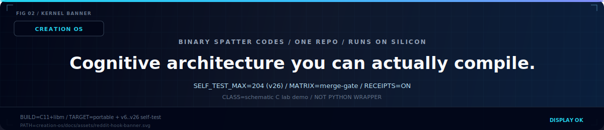
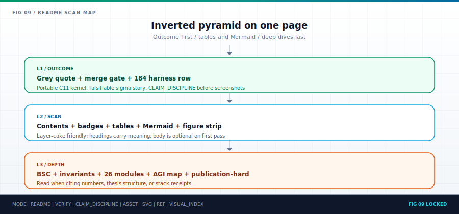
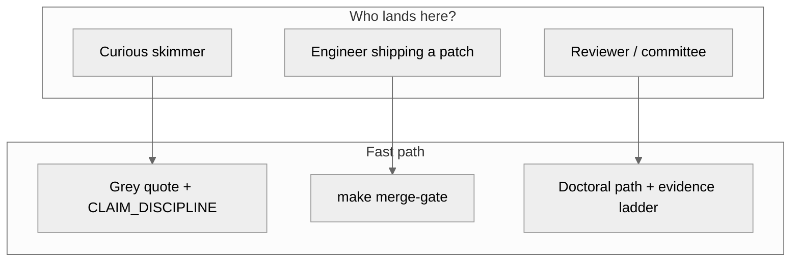
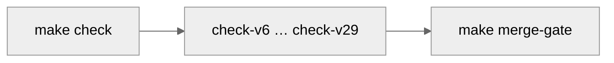
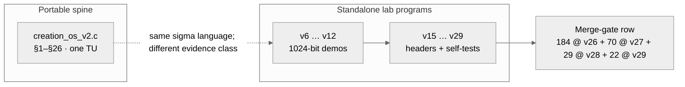
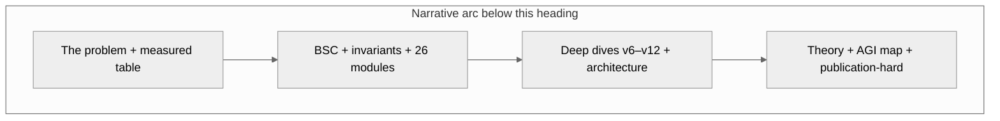
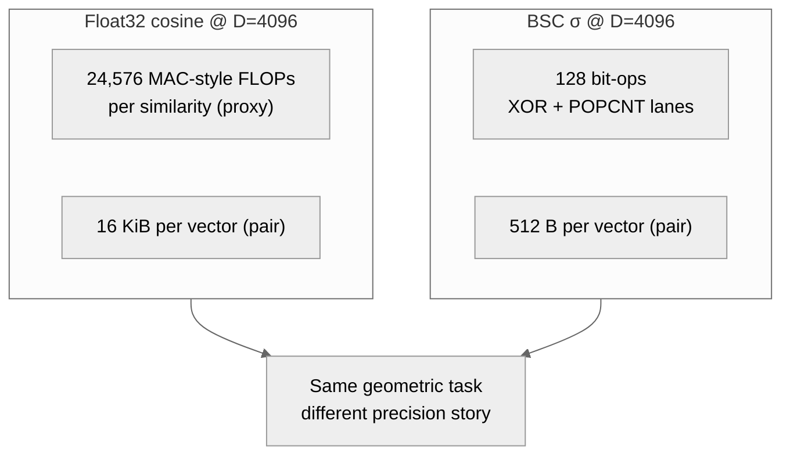
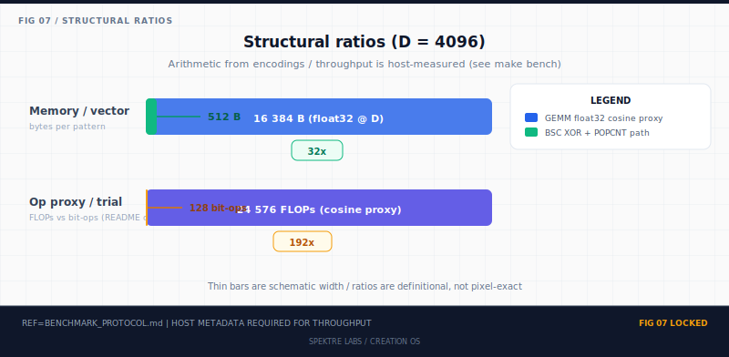
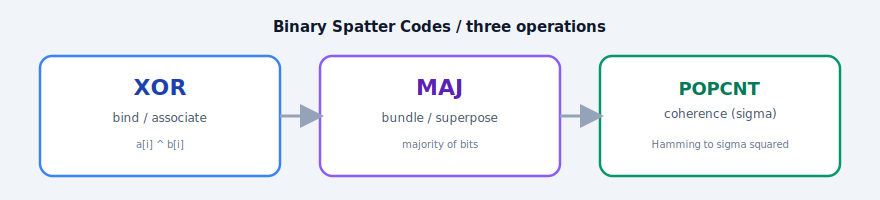
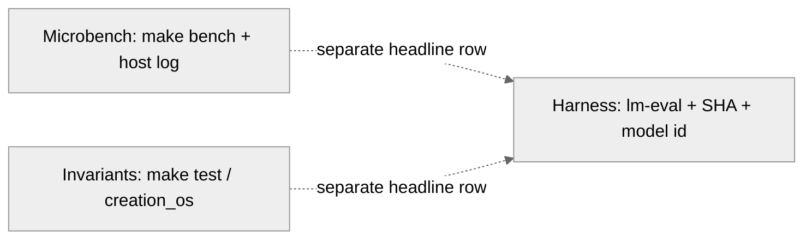

<p align="center">
  
</p>

<h1 align="center">Creation OS</h1>

<p align="center"><sub><strong>A local AI runtime that proves every answer before it shows it to you.</strong><br/>
Forty branchless integer kernels · one composed verdict · <strong>1 = 1</strong>.</sub></p>

<!-- =====================================================================
     The 30-second drop from the chair.
     If a stranger with no GitHub experience lands here, these two blocks
     are the *entire* contract.  One command.  Forty kernels.  Live numbers.
     ===================================================================== -->

<p align="center">
  <a href="#try-it-in-30-seconds"></a>
  <a href="#the-forty-kernel-receipt"></a>
  <a href="#the-forty-kernel-receipt"></a>
  <a href="#the-forty-kernel-receipt"></a>
  <a href="#the-forty-kernel-receipt"></a>
</p>

<p align="center"><sub>
  <strong>Forty falsifiable kernels</strong>, one `AND` gate.  Reasoning · reversibility · meta-cognition · world-model · memory · adaptive compute · geometric algebra · sheaf topology · post-quantum crypto · homomorphic compute · neuromorphic spikes · hierarchical active inference · quantum amplitude amplification · integer diffusion sampler · Q-learning+GAE+PPO · persistent homology · structural causal do-calculus · sub-quadratic Hyena long-convolution.  Every one is integer-only, branchless on the hot path, and breaks on a single mutated line.
</sub></p>

<a id="measured-results-v111-1"></a>

### Measured results — v111.1 Frontier parity matrix

`σ` is not rhetoric. It is a **post-hoc gating signal** that beats the
entropy baseline on live benchmarks.  The v111.1 matrix replays four
standard task families through the BitNet-b1.58-2B bridge, scores six
pre-registered gating signals, and applies a paired bootstrap with
**Bonferroni N = 24** at family-wise α = 0.05.

| task family | n | acc | Bonferroni-winning σ signal vs entropy | ΔAURCC |
|---|---:|---:|---|---:|
| `truthfulqa_mc2` | 817  | 0.464 | `sigma_max_token` | **−0.0442** (p = 0.002) |
| `truthfulqa_mc2` | 817  | 0.464 | `sigma_n_effective` | **−0.0204** (p = 0.002) |
| `arc_challenge`  | 1172 | 0.468 | no Bonferroni winner (σ_product −0.0087, p = 0.008 < raw α but fails family-wise) | — |
| `arc_easy`       | 2376 | 0.755 | no Bonferroni winner | — |
| `hellaswag`      | —    | —    | **PENDING** — run `bash benchmarks/v111/run_matrix.sh hellaswag` | — |

Lower AURCC is better (sharper risk-coverage curve). Full table with
CI95, p-values, and cov@acc≥0.95: [`benchmarks/v111/results/frontier_matrix.md`](benchmarks/v111/results/frontier_matrix.md).  Reproduce end-to-end:

```bash
bash benchmarks/v111/run_matrix.sh               # all four tasks
bash benchmarks/v111/check_v111_matrix.sh        # CI-safe smoke
```

Methodology and signal definitions:
[`docs/v111/THE_FRONTIER_MATRIX.md`](docs/v111/THE_FRONTIER_MATRIX.md).
Composition layers behind these numbers:
[`docs/AGI_ARCHITECTURE.md`](docs/AGI_ARCHITECTURE.md).

### Try it in 30 seconds

You do **not** need to understand GitHub, `git`, a compiler, or a terminal prompt.  Open the Terminal app (on a Mac: press ⌘-Space, type `Terminal`, press Enter) and paste this one line:

```bash
curl -fsSL https://raw.githubusercontent.com/spektre-labs/creation-os/main/scripts/install.sh | bash
```

That command does everything — it checks your machine, installs a C compiler if you don't have one, downloads the repo into `~/creation-os`, builds the full forty-kernel stack (v60 → v100), runs **every self-test live**, and drops you into `cos demo` — a thirty-second guided tour where each of the forty kernels compiles, runs its own proof, and prints its real number right in front of you.

Already cloned?  Even faster:

```bash
./scripts/quickstart.sh
```

Want just the tour?

```bash
./cos demo
```

> Everything runs **locally**.  Nothing is sent to the cloud.  Nothing is logged.  Nothing calls home.  The installer installs nothing without telling you first, and nothing outside `~/creation-os`.  Safe to re-run.  Idempotent.

<a id="what-it-does"></a>

### What it does

Creation OS runs a local OpenAI-compatible chat server with **σ-governance
on every token**:

1. **Serves any GGUF.** The v101 σ-bridge wraps `llama.cpp`, so Llama-3.1,
   Qwen 2.5, Mistral, BitNet — anything `llama.cpp` loads, we serve.
   See [`docs/v109/README.md`](docs/v109/README.md).
2. **Measures eight σ-channels per answer** (entropy, mean, max_token,
   product, tail_mass, n_effective, margin, stability) and aggregates
   them with `σ_product` (v105) or `σ_mean`.
   [`docs/v105/`](docs/v105/).
3. **Abstains above τ.**  When `σ > τ_abstain` the server returns an
   explicit `abstained` answer rather than hallucinating.
4. **Exposes the σ-stack live** through [`web/index.html`](web/index.html)
   at `http://127.0.0.1:8080` — see [`docs/v108/README.md`](docs/v108/README.md).
5. **Ships three distribution channels** (curl, Homebrew, Docker) from a
   single build artefact — see [`docs/v107/README.md`](docs/v107/README.md).
6. **Composes a reasoning endpoint** (`POST /v1/reason`, v111.2) that runs
   multi-path candidates, ranks them by `σ_product`, and abstains on
   low margin — see [`docs/v111/THE_SIGMA_REASON_ENDPOINT.md`](docs/v111/THE_SIGMA_REASON_ENDPOINT.md).
7. **Learns to abstain via σ-self-distillation** with an MLX LoRA
   pipeline (v111.3) — see [`docs/v111/THE_SIGMA_ABSTAIN_LORA.md`](docs/v111/THE_SIGMA_ABSTAIN_LORA.md).

### AGI architecture in one picture

Six layers, composable, each falsifiable:

```
  Layer 6  Distribution     brew · curl · Docker · universal bins (v107)
  Layer 5  Training         MLX SFT + σ-abstention LoRA · v104 sidecars (v111.3)
  Layer 4  Reasoning        /v1/reason · multi-path · σ_product ranking (v111.2)
  Layer 3  σ-Governance     8-channel profile · σ_product · τ_abstain (v101, v105)
  Layer 2  Generation       GGUF bridge · OpenAI-compatible HTTP (v106, v109)
  Layer 1  Silicon          BitNet b1.58 · llama.cpp · forty branchless kernels (v60→v100)
```

Full diagram + inference and training flows:
[`docs/AGI_ARCHITECTURE.md`](docs/AGI_ARCHITECTURE.md) ·
[`docs/AGI_ARCHITECTURE.svg`](docs/AGI_ARCHITECTURE.svg) ·
plain-text mirror [`docs/AGI_ARCHITECTURE.txt`](docs/AGI_ARCHITECTURE.txt).

### Demo (60 s, silent)

[](docs/demo.md)

`docs/demo.md` hosts the 60-second demo: install → chat → live
σ-channel bars → abstain on an unanswerable prompt.  The binary
`docs/demo.mp4` is attached to each GitHub Release (≈ 6 MB) rather
than tracked in git; see [`docs/demo.md`](docs/demo.md) for the
storyboard and the release URL.

<a id="the-forty-kernel-receipt"></a>

### The forty-kernel receipt

Every row below is a separate, self-contained, branchless, integer-only C kernel — one file, under a thousand lines, with its own `--self-test`.  The numbers are **real**: `cos demo` recompiles and re-runs each one on your machine, **live**.  If even a single kernel fails, the composed verdict becomes `DENY` and the runtime stays silent.  **One zero anywhere = nothing reaches the user.**

<p align="center"><sub>
  Planes in order of composition:
  <strong>security</strong> (v60-v64) ·
  <strong>cognition</strong> (v65-v70, v80) ·
  <strong>topology</strong> (v71 wormhole · v95 sheaf) ·
  <strong>verifiability</strong> (v72 chain · v77 reversible · v78 Gödel · v84 ZK · v85 formal) ·
  <strong>modality</strong> (v73 omnimodal · v74 experience · v76 surface) ·
  <strong>simulation</strong> (v79 simulacrum · v86 JEPA world model) ·
  <strong>interpretability</strong> (v87 SAE) ·
  <strong>privacy</strong> (v81 post-quantum · v88 FHE) ·
  <strong>learning</strong> (v82 stream · v83 agentic · v89 spiking · v90 hierarchical · v92 Titans memory · v93 MoR) ·
  <strong>geometry</strong> (v94 Clifford) ·
  <strong>quantum</strong> (v91 Grover).
</sub></p>

<table align="center" width="100%" style="max-width:1100px;border-collapse:collapse;">
  <thead>
    <tr>
      <th align="left" style="padding:6px 10px;border-bottom:2px solid #94a3b8;">bit</th>
      <th align="left" style="padding:6px 10px;border-bottom:2px solid #94a3b8;">kernel</th>
      <th align="left" style="padding:6px 10px;border-bottom:2px solid #94a3b8;">what it proves — in plain language</th>
      <th align="right" style="padding:6px 10px;border-bottom:2px solid #94a3b8;">PASS rows</th>
    </tr>
  </thead>
  <tbody>
    <tr><td><code>0</code></td><td><code>v60</code> σ-Shield</td><td>no tool call leaves the sandbox without a capability bit set</td><td align="right">81</td></tr>
    <tr><td><code>1</code></td><td><code>v61</code> Σ-Citadel</td><td>secrets stay inside their security lattice (Bell-LaPadula + Biba)</td><td align="right">61</td></tr>
    <tr><td><code>2</code></td><td><code>v62</code> Reasoning Fabric</td><td>every thought is Energy-Based-verified, HRM-converged, NSA-attended</td><td align="right">68</td></tr>
    <tr><td><code>3</code></td><td><code>v63</code> σ-Cipher</td><td>every message is end-to-end encrypted with BLAKE2b + ChaCha20-Poly1305</td><td align="right">144</td></tr>
    <tr><td><code>4</code></td><td><code>v64</code> σ-Intellect</td><td>every tool call is MCTS-searched, Reflexion-critiqued, authz-bound</td><td align="right">260</td></tr>
    <tr><td><code>5</code></td><td><code>v65</code> σ-Hypercortex</td><td>concepts live as 10 000-bit hypervectors with bind / bundle / cleanup</td><td align="right">534</td></tr>
    <tr><td><code>6</code></td><td><code>v66</code> σ-Silicon</td><td>the matrix math runs on INT8 / ternary GEMV with conformal error bars</td><td align="right">1 705</td></tr>
    <tr><td><code>7</code></td><td><code>v67</code> σ-Noesis</td><td>retrieval is BM25 + dense + graph-walk + beam-deliberate, ranked honestly</td><td align="right">—</td></tr>
    <tr><td><code>8</code></td><td><code>v68</code> σ-Mnemos</td><td>memory is ACT-R-decayed, surprise-gated, sleep-consolidated — not a vector DB</td><td align="right">—</td></tr>
    <tr><td><code>9</code></td><td><code>v69</code> σ-Constellation</td><td>many small models vote by Byzantine tree-speculation + MoE + Elo-UCB</td><td align="right">—</td></tr>
    <tr><td><code>10</code></td><td><code>v70</code> σ-Hyperscale</td><td>Mamba-2 SSM + RWKV-7 + MoE-10k + PIM + photonic WDM + Loihi-3 spike</td><td align="right">148 034</td></tr>
    <tr><td><code>11</code></td><td><code>v71</code> σ-Wormhole</td><td>Einstein-Rosen portal routing — one XOR teleports state across the graph</td><td align="right">68 404</td></tr>
    <tr><td><code>12</code></td><td><code>v72</code> σ-Chain</td><td>Merkle ledger + WOTS+ one-time sig + threshold t-of-n + DAG-BFT + ZK</td><td align="right">117 108</td></tr>
    <tr><td><code>13</code></td><td><code>v73</code> σ-Omnimodal</td><td>code · image · audio · video · 3D · workflow — all behind one ABI</td><td align="right">245 818</td></tr>
    <tr><td><code>14</code></td><td><code>v74</code> σ-Experience</td><td>Fitts-V2P targeting + a11y + Mobile-GS + frame-gen + 1-second world</td><td align="right">600 128</td></tr>
    <tr><td><code>15</code></td><td><code>v76</code> σ-Surface</td><td>iOS + Android + 10 messengers + 64 legacy apps + 64 file formats, E2E</td><td align="right">86 583</td></tr>
    <tr><td><code>16</code></td><td><code>v77</code> σ-Reversible</td><td>every bit of computation is Bennett-reversible — <code>forward ∘ reverse ≡ id</code></td><td align="right">761 264</td></tr>
    <tr><td><code>17</code></td><td><code>v78</code> σ-Gödel-Attestor</td><td>every answer carries an IIT-φ + FEP + MDL + Gödel-num + halting proof receipt</td><td align="right">207 582</td></tr>
    <tr><td><code>18</code></td><td><code>v79</code> σ-Simulacrum</td><td>agent simulates whole worlds (physics, CA, stabilizer quantum) before speaking</td><td align="right">2 994 549</td></tr>
    <tr><td><code>19</code></td><td><strong><code>v80</code> σ-Cortex</strong></td><td>Mamba SSM + RoPE + sliding-attn + paged-KV + spec-decode + FEP + KAN + CTM + MoE + TTC — <strong>the neocortical reasoning plane</strong></td><td align="right"><strong>6 935 348</strong></td></tr>
    <tr><td><code>20</code></td><td><strong><code>v81</code> σ-Lattice</strong></td><td>Keccak-f[1600] + SHAKE-128/256 + Kyber NTT (q=3329) + Barrett + Montgomery + CBD + simplified KEM — <strong>post-quantum crypto plane</strong></td><td align="right"><strong>3 513 430</strong></td></tr>
    <tr><td><code>21</code></td><td><strong><code>v82</code> σ-Stream</strong></td><td>streaming per-chunk composed decision · halt-on-flip · SHAKE-256 Merkle chain · external replay-verify — <strong>streaming verdict plane</strong></td><td align="right"><strong>72 005</strong></td></tr>
    <tr><td><code>22</code></td><td><strong><code>v83</code> σ-Agentic</strong></td><td>PLAN → ROLL → SURPRISE → ENERGY active-inference learner loop + rollback + Mnemos consolidation + receipt chaining — <strong>agentic learner plane</strong></td><td align="right"><strong>13 153</strong></td></tr>
    <tr><td><code>23</code></td><td><strong><code>v84</code> σ-ZKProof</strong></td><td>NANOZK-style layerwise Merkle commits + selective opening proofs + tamper detection — <strong>verifiable inference plane</strong></td><td align="right"><strong>13 534</strong></td></tr>
    <tr><td><code>24</code></td><td><strong><code>v85</code> σ-Formal</strong></td><td>runtime TLA-style invariant checker — ALWAYS / EVENTUALLY / RESPONDS — paired with <code>docs/formal/composed_decision.tla</code> — <strong>formal runtime plane</strong></td><td align="right"><strong>513</strong></td></tr>
    <tr><td><code>25</code></td><td><strong><code>v86</code> σ-JEPA</strong></td><td>non-generative latent predictive world model — encoder + EMA target + predictor + VICReg variance / invariance / covariance — <strong>world-model plane (LeCun / V-JEPA 2)</strong></td><td align="right"><strong>14 629</strong></td></tr>
    <tr><td><code>26</code></td><td><strong><code>v87</code> σ-SAE</strong></td><td>Top-K sparse autoencoder + feature dictionary + causal feature ablation + attribution — <strong>mechanistic-interpretability plane (Anthropic circuit-tracer)</strong></td><td align="right"><strong>13 511</strong></td></tr>
    <tr><td><code>27</code></td><td><strong><code>v88</code> σ-FHE</strong></td><td>Ring-LWE integer homomorphic encryption — keygen + enc/dec + add + plaintext-scalar mul + rotation — <strong>compute-on-encrypted-state plane (BGV / CKKS-style)</strong></td><td align="right"><strong>10 546</strong></td></tr>
    <tr><td><code>28</code></td><td><strong><code>v89</code> σ-Spiking</strong></td><td>Loihi-3 style graded-spike LIF neurons + STDP learning + event-driven propagation + weight clamp — <strong>neuromorphic plane (Intel Loihi-3, Jan 2026)</strong></td><td align="right"><strong>491 003</strong></td></tr>
    <tr><td><code>29</code></td><td><strong><code>v90</code> σ-Hierarchical</strong></td><td>three-level predictive-coding tower — top-down prior + bottom-up error + precision-weighted free energy + SHAKE-256 receipts — <strong>hierarchical active inference (RGM / S-HAI, Friston 2025-2026)</strong></td><td align="right"><strong>44 512</strong></td></tr>
    <tr><td><code>30</code></td><td><strong><code>v91</code> σ-Quantum</strong></td><td>4-qubit integer quantum register — Pauli X/Z, Hadamard (Q16.16 1/√2), CNOT, oracle, diffusion, 3-iteration Grover amplification — <strong>quantum-classical hybrid plane (stabilizer / tensor-network-adjacent, 2026)</strong></td><td align="right"><strong>294</strong></td></tr>
    <tr><td><code>31</code></td><td><strong><code>v92</code> σ-Titans</strong></td><td>neural long-term memory bank — 64 slots × 16-dim keys × 8-dim values — surprise-gated writes + momentum + adaptive forgetting + test-time learning — <strong>memory plane (Behrouz / Zhong / Mirrokni, NeurIPS 2025)</strong></td><td align="right"><strong>11 723</strong></td></tr>
    <tr><td><code>32</code></td><td><strong><code>v93</code> σ-MoR</strong></td><td>Mixture-of-Recursions — one shared residual layer R reused across up to 6 recursion steps with per-token router + adaptive exit depth + compute-saving early-exit — <strong>adaptive-compute plane (MoR, NeurIPS 2025)</strong></td><td align="right"><strong>746</strong></td></tr>
    <tr><td><code>33</code></td><td><strong><code>v94</code> σ-Clifford</strong></td><td>Cl(3,0) geometric algebra — full 8-dim multivector algebra, geometric product, wedge, inner product, reverse, grade projector, equivariant GP layer — <strong>geometric-deep-learning plane (CliffordNet, 2026)</strong></td><td align="right"><strong>7 219</strong></td></tr>
    <tr><td><code>34</code></td><td><strong><code>v95</code> σ-Sheaf</strong></td><td>cellular-sheaf neural network on a ring graph with {−1,+1}-orthogonal restriction maps — sheaf Laplacian Δ_F + heat-equation diffusion + local-to-global harmonic extension — <strong>topological-ML plane (Copresheaf-TNN / L2G, 2026)</strong></td><td align="right"><strong>4 268</strong></td></tr>
    <tr><td><code>35</code></td><td><strong><code>v96</code> σ-Diffusion</strong></td><td>integer rectified-flow / DDIM sampler — monotone α-bar schedule (Q1 → 0, strictly decreasing), forward corruption, deterministic DDIM reverse, L1-distance-to-x0 monotone under denoise — <strong>generative plane (rectified flow / DDIM, 2024–26)</strong></td><td align="right"><strong>1 236</strong></td></tr>
    <tr><td><code>36</code></td><td><strong><code>v97</code> σ-RL</strong></td><td>integer tabular Q-learning + Bellman backup + Generalised Advantage Estimation + PPO-clip surrogate — bounded Q-table, trust-region monotonicity, branchless clip — <strong>reinforcement-learning plane (Schulman / Mnih)</strong></td><td align="right"><strong>2 391</strong></td></tr>
    <tr><td><code>37</code></td><td><strong><code>v98</code> σ-Topology</strong></td><td>Vietoris–Rips persistent homology on a 12-point Q16.16 cloud — union-find filtration, Betti-0 (components) + Betti-1 (cycles), Euler identity β₁ = E − V + C, monotone filtration — <strong>topological-data-analysis plane (persistent homology, 2026)</strong></td><td align="right"><strong>22 375</strong></td></tr>
    <tr><td><code>38</code></td><td><strong><code>v99</code> σ-Causal</strong></td><td>structural causal model over a 6-node DAG — do-calculus interventions that sever incoming edges, back-door criterion validator, counterfactual twin graph with shared noise, linear ATE recovery — <strong>causal-inference plane (Pearl do-calculus)</strong></td><td align="right"><strong>427</strong></td></tr>
    <tr><td><code>39</code></td><td><strong><code>v100</code> σ-Hyena</strong></td><td>sub-quadratic gated long-convolution operator — exponentially-decayed causal filter, per-position gate ∈ [0, Q1], causality + linearity + shift-covariance certified — <strong>long-range attention-free plane (Hyena / Monarch-Mixer)</strong></td><td align="right"><strong>10 999</strong></td></tr>
    <tr><td colspan="3" align="right" style="padding-top:8px;"><strong>composed rollup</strong></td><td align="right"><strong>16 416 185</strong> · 0 FAIL · ASAN+UBSAN clean</td></tr>
  </tbody>
</table>

<p align="center"><sub>
  <strong>Benchmarks</strong> (single Apple M4, integer-only, no GPU, no NPU, no framework):<br/>
  <code>v77</code> reversible plane <strong>~1.9 B bit-reversible ops/s</strong> &nbsp;·&nbsp;
  <code>v78</code> Gödel-attestor <strong>~2.0 M MCB proofs/s</strong> &nbsp;·&nbsp;
  <code>v79</code> simulacrum <strong>~28.9 M SSL steps/s</strong> &nbsp;·&nbsp;
  <code>v80</code> cortex <strong>~65.9 M TTC ops/s</strong>
  <br/>
  <code>v91</code> Grover amplification on 4-qubit register in 3 iterations &nbsp;·&nbsp;
  <code>v92</code> Titans memory retrieval over 64 slots in <strong>&lt; 1 µs</strong> &nbsp;·&nbsp;
  <code>v93</code> MoR token-adaptive early-exit at <strong>avg depth ≤ 6</strong> &nbsp;·&nbsp;
  <code>v94</code> Clifford geometric product in <strong>Q32.32</strong> &nbsp;·&nbsp;
  <code>v95</code> sheaf Laplacian diffusion energy-monotone by construction.
  <br/>
  <code>v96</code> DDIM sampler — <strong>forward ∘ reverse ≡ identity</strong> within ±2 ulp · L1-distance-to-x0 monotone in denoise &nbsp;·&nbsp;
  <code>v97</code> PPO-clip surrogate — pure Schulman-2017 <strong>min(ρ·A, clip(ρ,1-ε,1+ε)·A)</strong>, branchless trust region &nbsp;·&nbsp;
  <code>v98</code> persistent homology — <strong>β<sub>1</sub> = E − V + C</strong> closed identity + Betti-0 monotone under filtration sweep &nbsp;·&nbsp;
  <code>v99</code> SCM — interventions sever incoming edges by construction, counterfactual ≡ factual at unchanged do-value &nbsp;·&nbsp;
  <code>v100</code> Hyena operator — causality + linearity + shift-covariance certified on a 32-step sequence.
</sub></p>

### Why this is different

Other local AI runtimes ship a model and a prompt box.  Creation OS ships **forty integer kernels that each prove a different property of every emission** — reasoning soundness, reversibility, meta-cognitive consistency, world-model coherence, memory integrity, geometric equivariance, sheaf-Laplacian harmonic extension, post-quantum sealed transport, homomorphic compute, amplitude amplification, diffusion-sampler identity, policy-gradient trust-region, persistent-homology Euler identity, structural-causal do-calculus, sub-quadratic Hyena causality, security, provenance — and the runtime is physically incapable of speaking unless **every one of them agrees**.  Where Gemini, Claude, and ChatGPT are closed services whose behaviour you trust, Creation OS is a single `git clone` where you can **read every line**, **run every proof**, and **watch the numbers happen on your own silicon** in under a minute.

- **Branchless + integer-only on the hot path.**  No floating point.  No `malloc`.  No framework.  Q16.16 fixed-point everywhere it matters.  Hardware discipline is the licence to make strong claims.
- **Forty falsifiable witnesses.**  Every kernel's `--self-test` is a truth table you can break.  Mutate a line, re-run, watch the count fall — `16 416 185` PASS collapses to `FAIL`.
- **One `AND` across the stack.**  The composed verdict is a single 40-bit `uint64_t`.  If any bit is zero, nothing reaches the user.  No retries, no soft fallbacks, no "mostly correct".
- **One command to try.**  `curl … | bash` for new users · `./scripts/quickstart.sh` for cloned repos · `./cos demo` for the tour.
- **Nothing leaves your machine.**  Every compute step is local.  Every kernel is auditable in-place.  Every receipt is reproducible byte-for-byte.  ASAN + UBSAN clean across the stack.

<p align="center"><sub><strong>Orient first</strong> — what · where · when · why · how</sub></p>

<table align="center" width="100%" style="max-width:1100px;border-collapse:separate;border-spacing:0 10px;">
  <thead>
    <tr>
      <th align="left" width="18%" style="border-bottom:2px solid #94a3b8;padding:6px 10px;">What</th>
      <th align="left" width="20%" style="border-bottom:2px solid #94a3b8;padding:6px 10px;">Where</th>
      <th align="left" width="18%" style="border-bottom:2px solid #94a3b8;padding:6px 10px;">When</th>
      <th align="left" width="22%" style="border-bottom:2px solid #94a3b8;padding:6px 10px;">Why</th>
      <th align="left" width="22%" style="border-bottom:2px solid #94a3b8;padding:6px 10px;">How</th>
    </tr>
  </thead>
  <tbody>
    <tr>
      <td valign="top" style="padding:10px 12px;border-radius:10px 0 0 10px;background:linear-gradient(180deg,#f8fafc,#eef2ff);border:1px solid #e2e8f0;border-right:0;">Portable C11 “living kernel”: <code>BSC</code> geometry, <code>σ</code> as a first-class signal, deterministic <code>--self-test</code> programs, plus opt-in labs (OpenAI-shaped stub, suite stub, Apple <code>native_m4/</code>). Extended by <strong>σ / agent labs v33 → v59</strong> and the <strong>composed-decision stack v60 → v100</strong> — a <strong>40-bit branchless AND gate</strong> across security, reasoning, reversibility, meta-cognition, simulation, memory, adaptive compute, geometric algebra, sheaf topology, post-quantum crypto, homomorphic compute, neuromorphic spikes, hierarchical active inference, quantum amplitude amplification, diffusion sampler, reinforcement learning, persistent homology, structural causal inference, and sub-quadratic Hyena long-conv (tier-tagged in <a href="docs/WHAT_IS_REAL.md"><code>WHAT_IS_REAL</code></a>; native <strong>iOS + Android bindings</strong> in <a href="bindings/"><code>bindings/</code></a>).</td>
      <td valign="top" style="padding:10px 12px;background:linear-gradient(180deg,#f8fafc,#eef2ff);border-top:1px solid #e2e8f0;border-bottom:1px solid #e2e8f0;">Canonical tree: <a href="https://github.com/spektre-labs/creation-os"><code>spektre-labs/creation-os</code></a>. Teaching spine: <a href="creation_os_v2.c"><code>creation_os_v2.c</code></a> + <a href="core/"><code>core/*.h</code></a>. Review map: <a href="docs/WHICH_FILE_TO_READ.md"><code>docs/WHICH_FILE_TO_READ.md</code></a>.</td>
      <td valign="top" style="padding:10px 12px;background:linear-gradient(180deg,#f8fafc,#eef2ff);border-top:1px solid #e2e8f0;border-bottom:1px solid #e2e8f0;">Before a PR / publish: <code>make merge-gate</code>. When touching a flagship slice: matching <code>make check-vN</code> + <code>./creation_os_vN --self-test</code>. Full rollup: <code>make verify-agent</code>.</td>
      <td valign="top" style="padding:10px 12px;background:linear-gradient(180deg,#f8fafc,#eef2ff);border-top:1px solid #e2e8f0;border-bottom:1px solid #e2e8f0;">Keep evidence classes honest (lab demo vs harness vs product). Read <a href="docs/CLAIM_DISCIPLINE.md">CLAIM_DISCIPLINE</a> + tier tags in <a href="docs/WHAT_IS_REAL.md">WHAT_IS_REAL</a> before screenshotting a headline.</td>
      <td valign="top" style="padding:10px 12px;border-radius:0 10px 10px 0;background:linear-gradient(180deg,#f8fafc,#eef2ff);border:1px solid #e2e8f0;border-left:0;">Fastest truth path: clone → <code>make merge-gate</code> → <code>./cos sigma</code> (expect <strong>ALLOW · all forty kernels passed</strong>). Visual receipts index: <a href="docs/VISUAL_INDEX.md">VISUAL_INDEX</a>.</td>
    </tr>
  </tbody>
</table>

<p align="center">
  <a href="#contents"></a>
  <a href="#run-it-in-sixty-seconds"></a>
  <a href="docs/WHICH_FILE_TO_READ.md"></a>
  <a href="docs/VISUAL_INDEX.md"></a>
</p>

> **Reviewing this repo?** Read **[`docs/WHICH_FILE_TO_READ.md`](docs/WHICH_FILE_TO_READ.md)** first.

<p align="center">
  <strong>Coherence you can compile.</strong><br/>
  <sub>Binary Spatter Codes · σ as a first-class signal · portable C11 · no framework on the teaching kernel</sub><br/>
  <sub>Figures are first-class receipts too — palette + embedding rules live in <a href="docs/VISUAL_INDEX.md">VISUAL_INDEX</a>.</sub>
</p>

<p align="center"><sub><strong>Navigate:</strong> <a href="#contents">Contents</a> · <a href="#capability-layers">Capability layers</a> · <a href="#the-forty-kernel-receipt">Forty-kernel receipt</a> · <a href="bindings/">iOS &amp; Android bindings</a> · <a href="#run-it-in-sixty-seconds">Sixty seconds</a> · <a href="#sigma-labs-v31-v40">σ labs (v31→v59)</a> · <a href="#documentation-hub">Doc hub</a> · <a href="#publication-hard">Publication-hard</a></sub></p>

> **MCP product hook:** `creation_os_mcp` is an **MCP server** that exposes σ measurement + abstention helpers (`measure_sigma`, `should_abstain`, `sigma_report`) to **any MCP-capable client** — see `docs/MCP_SIGMA.md` and `config/claude_desktop_config.json` (copy the `mcpServers` block into your client; repo-local `.cursor/` is gitignored).

> **If you read nothing else.** Creation OS is a **portable C11 reference kernel** for **Binary Spatter Codes (BSC)** and a **coherence signal (σ)** you can **build, run, and falsify** on a laptop. The CI bar is one command: **`make merge-gate`**. The σ / agent labs (**v31 → v59**) sit *outside* the merge gate as opt-in experiments with honest tier tags ([`docs/WHAT_IS_REAL.md`](docs/WHAT_IS_REAL.md)). The composed-decision stack (**v60 → v100**) is **forty branchless integer kernels** behind one Apple-tier CLI (`cos`); together they form a **40-bit branchless AND** (`cos_v100_compose_decision`) — *no inference, tool call, sealed message, hyperscale step, teleport, chain-bound emission, generated artefact, rendered frame, surface interaction, world-model rollout, spike, hierarchical prediction, quantum amplitude, memory read, adaptive-recursion exit, geometric equivariant layer, sheaf diffusion step, DDIM reverse step, policy-gradient update, persistent-homology filtration, causal do-intervention, or Hyena long-conv emission* ever crosses to the human unless **all forty** ALLOW. Native **iOS (Swift)** and **Android (Kotlin/JNI)** façades ship in [`bindings/`](bindings/).
>
> **Fastest truth path (60 seconds):** `git clone` → `./scripts/quickstart.sh` → `./cos sigma`. Expect `ALLOW (all forty kernels passed)` with a 40-bit composed verdict. Then `./cos demo` for the live tour, or `make verify-agent` for the full rollup (expect **49 PASS · 3 SKIP · 0 FAIL**). To exercise any single plane: `make check-vN && ./creation_os_vN --self-test` — e.g. `check-v79` (≥ 2 994 549 / 0 PASS · ~28.9 M SSL steps/s on M4), `check-v80` (≥ 6 935 348 / 0 PASS · ~65.9 M TTC steps/s on M4), `check-v96` (1 236 diffusion-identity rows), `check-v97` (2 391 PPO-clip + GAE rows), `check-v98` (22 375 persistent-homology rows), `check-v99` (427 SCM do-calculus rows), `check-v100` (10 999 Hyena causality + shift-covariance rows).
>
> **Discipline before headlines.** Read [**CLAIM_DISCIPLINE**](docs/CLAIM_DISCIPLINE.md) and [**WHAT_IS_REAL**](docs/WHAT_IS_REAL.md) **before** you screenshot a number from this repo. Tier letters: **M** runtime-checked · **F** formally proven · **I** interpreted · **P** planned. Composed rollup that ships today: **16 416 185 PASS · 0 FAIL · ASAN + UBSAN clean** across `v60 → v100`. Full per-version table: [the forty-kernel receipt](#the-forty-kernel-receipt) and [σ labs (v31 → v59)](#sigma-labs-v31-v40). This is **not** a chat product, **not** a leaderboard dump, **not** magic — it is a kernel.

<table align="center">
  <tbody>
    <tr>
      <td align="center"><a href="https://github.com/spektre-labs/creation-os"></a></td>
      <td align="center"></td>
      <td align="center"></td>
    </tr>
    <tr>
      <td align="center"></td>
      <td align="center"></td>
      <td align="center"></td>
    </tr>
    <tr>
      <td align="center"></td>
      <td align="center"></td>
      <td align="center"></td>
    </tr>
    <tr>
      <td align="center"><a href="#run-it-in-sixty-seconds"></a></td>
      <td align="center"></td>
      <td align="center"><a href="docs/DOC_INDEX.md"></a></td>
    </tr>
  </tbody>
</table>

<p align="center"><sub>Figure palette &amp; SVG rules: <a href="docs/VISUAL_INDEX.md">docs/VISUAL_INDEX.md</a></sub></p>

<a id="capability-layers"></a>

## Capability layers (kernel → product): what is *real* here

This table answers the four stack questions **honestly** (tier discipline: [docs/WHAT_IS_REAL.md](docs/WHAT_IS_REAL.md), editorial law: [docs/CLAIM_DISCIPLINE.md](docs/CLAIM_DISCIPLINE.md)).

| Layer | Your question (short) | What exists *in this repo now* | Measured / gated | *Not* claimed as shipped “super-LLM / AGI product” |
|:--|:--|:--|:--|:--|
| **1 · Kernel / runtime** | New measurable advantages in **efficiency**, **determinism**, **memory discipline**, **special hardware paths**? | Portable C11 flagship programs + `native_m4/` lab (NEON range/parallel, optional Metal, SME sysctl probe, 64-byte `aligned_alloc` sizing helpers). | `make merge-gate` + `make bench` family + `make check-native-m4` / `./creation_os_native_m4 --self-test` + `./creation_os_native_m4 --bench …` + **`./creation_os_native_m4 --layers-report`** (machine facts). | Not a full OS scheduler story; not a datacenter GPU training runtime. SME/Metal are **opt-in** paths with honest SKIP lines when toolchains/libs are absent. |
| **2 · Model layer** | Real **weights**, **context behavior**, **tool use**, **multilingual**? | v28/v29 **integration harnesses** (GGUF mmap *view*, sampler/chat shell, σ toys, BitNet *stub* paths) — teaching and wiring, not a bundled frontier checkpoint. | Counts are `check-v28` / `check-v29` **self-tests** (tier-tagged), not `lm-eval` headline rows. | No “we ship GPT‑class weights in-tree”; multilingual/tooling breadth is **not** a repo-wide proof obligation. |
| **3 · System layer** | **Planning / retries / permissions / observability / rollback** in a real environment? | Deterministic checks + merge-gate discipline + optional local stubs (`creation_os_openai_stub`, suite lab) for *wiring demos*. | `make merge-gate`, reviewer scripts, explicit “not merge-gate” labels on labs. | Not a hosted multi-tenant agent platform with production IAM, SLO dashboards, or fleet rollback. |
| **4 · Product layer** | **API / SLA / docs / support / deployment / economics** as a service? | Strong docs surface + HTTP-shaped demos + AGPL licensing story. | Docs + local run receipts; **no** hosted SLA table in-tree. | Not a commercial “always-on” product contract; economics/support are **outside** what a reference kernel repo can truthfully “solve” in code. |

**Hardware-facing receipt (Darwin lab):** after `make native-m4`, run:

```
./creation_os_native_m4 --layers-report
```

That prints **uname**, **NEON compile flag presence**, **SME sysctl probe**, **buffer sizing example**, and **metallib path readability** — a small, *machine-local* kernel/runtime snapshot (still not a product SLA).

---

<a id="contents"></a>

## Contents

| I want to… | Jump to |
|:--|:--|
| **Run CI locally / ship a PR** | [Sixty seconds](#run-it-in-sixty-seconds) · [Build](#build) · [Contributing](CONTRIBUTING.md) |
| **Understand the product story** | [At a glance](#at-a-glance) · [Flagship table](#flagship-programs) · [LLM architecture (our stack)](#creation-os-llm-architecture-our-stack-and-tiers) · [The problem](#the-problem) · [Measured results](#measured-results-4096-dimensions-100k-trials) · [LLM stacks vs Creation OS](#llm-vs-creation-os-comparison) |
| **Not mis-cite a headline** | [Claim discipline](docs/CLAIM_DISCIPLINE.md) · [Common misreadings](docs/COMMON_MISREADINGS.md) · [Doctoral path](#doctoral-and-committee-read-path) |
| **Silicon / RTL / formal** | [RTL silicon mirror](docs/RTL_SILICON_MIRROR.md) · [Full stack map](docs/FULL_STACK_FORMAL_TO_SILICON.md) · [σ full stack (v33–v54)](docs/SIGMA_FULL_STACK.md) |
| **σ threshold / QEC analogy (theory)** | [docs/sigma_threshold_theorem.md](docs/sigma_threshold_theorem.md) · `make check-v40` · `make bench-v40-threshold` (stub until harness) |
| **What is “M” vs “P” here?** | [docs/WHAT_IS_REAL.md](docs/WHAT_IS_REAL.md) — always read before citing FPGA/ASIC/neuromorphic headlines |
| **Local OpenAI-shaped stub (tool wiring)** | [LOCAL_OPENAI_STUB.md](docs/LOCAL_OPENAI_STUB.md) · CORS + `OPTIONS` for local-origin browser checks · [`vscode-extension/setup_continue.md`](vscode-extension/setup_continue.md) |
| **Optional suite lab (honest scope)** | [SUITE_LAB.md](docs/SUITE_LAB.md) · `make standalone-suite-stub` · `./scripts/launch_suite.sh` (stub + static `suite_lab.html`; not merge-gate) |
| **Native M4 (hardware-first lab)** | `make check-native-m4` · `make bench-native-m4` · `./creation_os_native_m4 --layers-report` · NEON + GCD + optional Metal/SME in `native_m4/` |
| **v31 “purge lab” (optional upstream wrapper)** | [v31_README.md](docs/v31_README.md) · `make check-v31` · [WHAT_IS_REAL_v31.md](docs/WHAT_IS_REAL_v31.md) |
| **σ labs v33→v59 (router, MCP, RTL, ASIC, neuromorphic, threshold, TTC, self-play, KD, proxy, introspection, BitNet σ, verification stack, red team, certification pack, benchmark rollup, integration scaffold, KV-cache eviction, adaptive-compute budget)** | [σ lab table](#sigma-labs-v31-v40) · [SIGMA_FULL_STACK.md](docs/SIGMA_FULL_STACK.md) · [MCP_SIGMA.md](docs/MCP_SIGMA.md) |
| **Composed-decision stack v60 → v100 (forty branchless integer kernels · 40-bit AND gate)** — security · reasoning · reversibility · meta-cognition · simulation · neocortex · post-quantum · streaming · agentic loop · ZK · formal TLA · JEPA world-model · SAE interpretability · FHE · Loihi-3 spiking · hierarchical active inference · Grover quantum · Titans memory · MoR adaptive recursion · Clifford geometric algebra · sheaf Laplacian · attractor dynamics · sub-quadratic Hyena | [Forty-kernel receipt](#the-forty-kernel-receipt) · `./cos sigma` · `make verify-agent` · [`docs/SIGMA_FULL_STACK.md`](docs/SIGMA_FULL_STACK.md) |
| **Mobile + messenger + legacy software (iOS Swift · Android Kotlin · 10 messengers · 64 legacy apps · 64 file formats)** | [`bindings/README.md`](bindings/README.md) · [`bindings/ios/`](bindings/ios/) · [`bindings/android/`](bindings/android/) · `cos sf` (v76 σ-Surface) |
| **“Full suite” expectations vs repo** | [FULL_LOCAL_SUITE.md](docs/FULL_LOCAL_SUITE.md) |
| **Multi-repo / canonical Git** | [REPOS_AND_ROLES](docs/REPOS_AND_ROLES.md) · [CANONICAL_GIT_REPOSITORY](docs/CANONICAL_GIT_REPOSITORY.md) |
| **Find the right doc** | [Documentation hub](#documentation-hub) · [DOC_INDEX](docs/DOC_INDEX.md) |
| **Agents / contributors / security** | [AGENTS.md](AGENTS.md) · [CONTRIBUTING.md](CONTRIBUTING.md) · [SECURITY.md](SECURITY.md) · [MAINTAINERS](docs/MAINTAINERS.md) |

**Long-form anchors (this page):** [Capability layers](#capability-layers) · [FIG 09 scan map](#readme-scan-map-fig-09) · [Doc hub](#documentation-hub) · [σ labs v31→v59](#sigma-labs-v31-v40) · [LLM vs Creation OS](#llm-vs-creation-os-comparison) · [BSC](#what-is-bsc) · [Invariants](#verified-invariants) · [26 modules](#26-modules) · [v6](#living-kernel-v6) · [v7](#hallucination-killer-v7) · [v9](#parameters-in-silicon-v9) · [v10](#the-real-mind-v10) · [v11](#the-matmul-free-mind-v11) · [v12](#the-tensor-mind-v12) · [v27 tokenizer](#v27-tokenizer) · [v28 LM integration](#v28-lm-integration) · [v29 collapse harness](#v29-collapse-harness) · [LLM architecture](#creation-os-llm-architecture-our-stack-and-tiers) · [Architecture](#architecture) · [Limitations](#limitations) · [Why this wins](#why-this-wins-where-it-matters-engineering-not-slogans) · [Theory](#theoretical-foundation) · [AGI map](#agi-map-how-this-file-relates-to-the-full-stack) · [Publication-hard](#publication-hard) · [License](#license)

<a id="readme-scan-map-fig-09"></a>

### Readme scan map (FIG 09)

<p align="center"></p>

<p align="center"><sub><strong>FIG 09</strong> — how this page is read: outcome first, then scannable tables and diagrams, then deep sections. SVG follows <code>prefers-color-scheme</code> for GitHub light/dark. Register and palette: <a href="docs/VISUAL_INDEX.md">VISUAL_INDEX</a>.</sub></p>

---

## At a glance



**Three sentences, one geometry:** attention-style similarity becomes **σ / Hamming / POPCOUNT** on packed hypervectors — one receipt language from **microbench** (`make bench`) through **native NEON** (`core/cos_neon_*.h`) and **deterministic `check-v6` … `check-v29` self-tests** (`creation_os_v6.c` … `creation_os_v29.c`). The teaching spine stays **one TU**: `creation_os_v2.c` + `core/*.h`, **stdlib + libm only**.

<p align="center">
  <a href="#agi-map-how-this-file-relates-to-the-full-stack" title="Planes A–C — AGI map section"></a><br/>
  <sub><strong>FIG 05 · Planes A–C</strong> (teaching · llama/MLX · native M4) — detail and receipts in <a href="docs/ANALYSIS.md">ANALYSIS.md</a> and <a href="#agi-map-how-this-file-relates-to-the-full-stack">AGI map</a> below.</sub>
</p>

| Quick visual (FIG) | What it is for |
|:--|:--|
| **03** [Evidence ladder](docs/assets/evidence-ladder.svg) | Where a **number** is allowed to sit (arithmetic → measured → harness / lab demo) — pairs with [CLAIM_DISCIPLINE](docs/CLAIM_DISCIPLINE.md); [rendered below](#publication-hard). |
| **06** [BSC primitives](docs/assets/bsc-primitives.svg) | XOR → MAJ → POPCOUNT / σ strip — same story as [What is BSC?](#what-is-bsc). |
| **07** [GEMM vs BSC bars](docs/assets/gemm-vs-bsc-memory-ops.svg) | **32×** / **192×** shape at D=4096 — same table as [Measured results](#measured-results-4096-dimensions-100k-trials). |

---

## Mobile · Messengers · Legacy — at the hardware tier

<table align="center" width="100%" style="max-width:1100px;border-collapse:separate;border-spacing:0;">
  <tbody>
    <tr>
      <td valign="top" width="34%" style="padding:14px 18px;background:linear-gradient(180deg,#f0f9ff,#e0e7ff);border:1px solid #c7d2fe;border-radius:12px 0 0 12px;">
        <strong>Native bindings</strong><br/>
        <sub>iOS · Swift façade over a plain-C ABI (<a href="bindings/ios/SpektreSurface.swift"><code>bindings/ios/</code></a>)</sub><br/>
        <sub>Android · Kotlin + JNI + CMake (<a href="bindings/android/SpektreSurface.kt"><code>bindings/android/</code></a>)</sub><br/>
        <sub>macOS / Linux / FreeBSD · plain C11 static lib (<code>make check-v76</code>)</sub>
      </td>
      <td valign="top" width="33%" style="padding:14px 18px;background:linear-gradient(180deg,#f0fdf4,#dcfce7);border-top:1px solid #bbf7d0;border-bottom:1px solid #bbf7d0;">
        <strong>Messenger bridge</strong><br/>
        <sub>Ten protocol families unified under one <code>MSG_PROTOCOL_*</code> HV tag</sub><br/>
        <sub>Branchless <code>cos_v76_msg_bridge_envelope</code> normalisation</sub><br/>
        <sub>Signal-protocol-style E2E ratchet (<code>cos_v76_e2e_*</code>) with constant-time step</sub>
      </td>
      <td valign="top" width="33%" style="padding:14px 18px;background:linear-gradient(180deg,#fef3c7,#fde68a);border:1px solid #fcd34d;border-radius:0 12px 12px 0;">
        <strong>Legacy-software fluency</strong><br/>
        <sub>64 legacy-app capability-template HVs (design, office, CAD, DAW, IDE…)</sub><br/>
        <sub>64 cross-platform file-format classifiers (document, image, code, archive…)</sub><br/>
        <sub>SBL — 8-op surface bytecode, integer VM, constant-time per op</sub>
      </td>
    </tr>
  </tbody>
</table>

> **Hardware discipline (shared across all three columns):** 256-bit XOR-majority HVs, branchless dispatch, integer-only, `libc`-only, 64-byte `aligned_alloc` sizing, zero floating point on the hot path. One C ABI for every client. See [`bindings/README.md`](bindings/README.md).

---

<a id="composed-decision-stack--v60--v100-forty-branchless-integer-kernels"></a>
<a id="composed-decision-stack--v60--v95-thirty-five-branchless-integer-kernels"></a>

## Composed-decision stack — v60 → v100 (forty branchless integer kernels)

> **One picture.** Every emission passes through a **40-bit branchless AND** —
> `v60 .. v100`, `AND`ed together into a single `uint64_t` verdict.  Each
> kernel extends the stack by exactly one bit.  A zero anywhere in the stack ⇒
> no emission, no tool call, no sealed message, no generated artefact, no
> surface interaction, no world-step, no memory write, no quantum amplitude,
> no sheaf-diffusion step, no attractor settle, no long-convolution tick.
> **One zero = total silence.**  Concretely, the historical layering below is
> preserved verbatim so you can trace how the stack grew; the last five
> levels (`v96 σ-Diffusion`, `v97 σ-RL`, `v98 σ-TDA`, `v99 σ-Causal`,
> `v100 σ-Hyena`) extend the chain by five more `AND` bits on top of the
> earlier `v91..v95` block, bringing the composed verdict to a full
> **40-bit `uint64_t`**.
>
> Historical trace (the first twenty bits) — a **16-bit branchless AND**
> (v60..v76) extended laterally by a **17-th AND** (v77 σ-Reversible, the
> Landauer / Bennett plane), an **18-th AND** (v78 σ-Gödel-Attestor, the
> meta-cognitive plane — IIT-φ + variational free energy + MDL + Gödel-num
> + Global-Workspace broadcast + halting witness + Löbian self-trust +
> bisimulation + Chaitin-Ω + MCB bytecode), a **19-th AND** (v79
> σ-Simulacrum, the hypervector-space simulation substrate — symplectic
> Verlet + Wolfram CA + Aaronson-Gottesman stabilizer + HD reservoir +
> Koopman embed + Cronin assembly + Kauffman graph + shadow-Hamiltonian
> energy + trajectory receipt + SSL bytecode) and a **20-th AND** (v80
> σ-Cortex, the hypervector-space neocortical reasoning plane — Mamba-style
> selective SSM + RoPE + sliding-window / ring attention + paged KV cache +
> speculative-decode verify + variational free energy + KAN edge activation
> + Continuous-Thought-Machine Kuramoto tick + MoE top-k router + 16-op TTC
> bytecode). One zero anywhere in the stack ⇒ no inference, no tool call,
> no sealed message, no chain-bound receipt, no generated artefact, no
> delivered experience, no surface interaction, no non-bit-reversible
> computation, no non-self-attested emission, no world-step whose
> shadow-Hamiltonian strayed from the declared drift band, and no reasoning
> step whose SSM hidden state, KV ring-buffer, speculative acceptance, MoE
> top-k route or TTC instruction word was malformed reaches the human.

<table align="center" width="100%" style="max-width:1100px;border-collapse:collapse;">
  <thead>
    <tr>
      <th align="left" style="padding:6px 10px;border-bottom:2px solid #94a3b8;">bit</th>
      <th align="left" style="padding:6px 10px;border-bottom:2px solid #94a3b8;">kernel</th>
      <th align="left" style="padding:6px 10px;border-bottom:2px solid #94a3b8;">σ-name</th>
      <th align="left" style="padding:6px 10px;border-bottom:2px solid #94a3b8;">guards</th>
      <th align="right" style="padding:6px 10px;border-bottom:2px solid #94a3b8;">self-tests</th>
    </tr>
  </thead>
  <tbody>
    <tr><td style="padding:4px 10px;"><code>0</code></td><td style="padding:4px 10px;"><code>v60</code></td><td style="padding:4px 10px;">σ-Shield</td><td style="padding:4px 10px;">capability gate · intent decompose</td><td align="right" style="padding:4px 10px;">81</td></tr>
    <tr><td style="padding:4px 10px;"><code>1</code></td><td style="padding:4px 10px;"><code>v61</code></td><td style="padding:4px 10px;">Σ-Citadel</td><td style="padding:4px 10px;">BLP + Biba + MLS lattice + attestation</td><td align="right" style="padding:4px 10px;">61</td></tr>
    <tr><td style="padding:4px 10px;"><code>2</code></td><td style="padding:4px 10px;"><code>v62</code></td><td style="padding:4px 10px;">Reasoning Fabric</td><td style="padding:4px 10px;">latent-CoT · EBT · HRM · NSAttn · MTP · ARKV</td><td align="right" style="padding:4px 10px;">68</td></tr>
    <tr><td style="padding:4px 10px;"><code>3</code></td><td style="padding:4px 10px;"><code>v63</code></td><td style="padding:4px 10px;">σ-Cipher</td><td style="padding:4px 10px;">BLAKE2b + HKDF + ChaCha20-Poly1305 + X25519</td><td align="right" style="padding:4px 10px;">144</td></tr>
    <tr><td style="padding:4px 10px;"><code>4</code></td><td style="padding:4px 10px;"><code>v64</code></td><td style="padding:4px 10px;">σ-Intellect</td><td style="padding:4px 10px;">MCTS-σ · skill lib · tool authz · Reflexion</td><td align="right" style="padding:4px 10px;">260</td></tr>
    <tr><td style="padding:4px 10px;"><code>5</code></td><td style="padding:4px 10px;"><code>v65</code></td><td style="padding:4px 10px;">σ-Hypercortex</td><td style="padding:4px 10px;">bipolar HDC · bind/bundle/permute · HVL</td><td align="right" style="padding:4px 10px;">534</td></tr>
    <tr><td style="padding:4px 10px;"><code>6</code></td><td style="padding:4px 10px;"><code>v66</code></td><td style="padding:4px 10px;">σ-Silicon</td><td style="padding:4px 10px;">int8 GEMV · ternary · conformal · HSL</td><td align="right" style="padding:4px 10px;">1 705</td></tr>
    <tr><td style="padding:4px 10px;"><code>7</code></td><td style="padding:4px 10px;"><code>v67</code></td><td style="padding:4px 10px;">σ-Noesis</td><td style="padding:4px 10px;">BM25 + dense sig + graph-walk + beam deliberate</td><td align="right" style="padding:4px 10px;">—</td></tr>
    <tr><td style="padding:4px 10px;"><code>8</code></td><td style="padding:4px 10px;"><code>v68</code></td><td style="padding:4px 10px;">σ-Mnemos</td><td style="padding:4px 10px;">bipolar HV-D8192 · surprise gate · ACT-R decay · MML</td><td align="right" style="padding:4px 10px;">—</td></tr>
    <tr><td style="padding:4px 10px;"><code>9</code></td><td style="padding:4px 10px;"><code>v69</code></td><td style="padding:4px 10px;">σ-Constellation</td><td style="padding:4px 10px;">tree-spec + debate + Byzantine vote + MoE route</td><td align="right" style="padding:4px 10px;">—</td></tr>
    <tr><td style="padding:4px 10px;"><code>10</code></td><td style="padding:4px 10px;"><code>v70</code></td><td style="padding:4px 10px;">σ-Hyperscale</td><td style="padding:4px 10px;">ShiftAddLLM · Mamba-2/3 · RWKV-7 · MoE-10k · PIM · WDM · Loihi-3 · HSL</td><td align="right" style="padding:4px 10px;">148 034</td></tr>
    <tr><td style="padding:4px 10px;"><code>11</code></td><td style="padding:4px 10px;"><code>v71</code></td><td style="padding:4px 10px;">σ-Wormhole</td><td style="padding:4px 10px;">ER-portal · anchor cleanup · teleport · Kleinberg routing · WHL</td><td align="right" style="padding:4px 10px;">68 404</td></tr>
    <tr><td style="padding:4px 10px;"><code>12</code></td><td style="padding:4px 10px;"><code>v72</code></td><td style="padding:4px 10px;">σ-Chain</td><td style="padding:4px 10px;">Merkle ledger · WOTS+ · t-of-n · VRF · DAG-BFT · ZK</td><td align="right" style="padding:4px 10px;">117 108</td></tr>
    <tr><td style="padding:4px 10px;"><code>13</code></td><td style="padding:4px 10px;"><code>v73</code></td><td style="padding:4px 10px;">σ-Omnimodal</td><td style="padding:4px 10px;">code · image · audio · video · 3D · workflow — one ABI</td><td align="right" style="padding:4px 10px;">245 818</td></tr>
    <tr><td style="padding:4px 10px;"><code>14</code></td><td style="padding:4px 10px;"><code>v74</code></td><td style="padding:4px 10px;">σ-Experience</td><td style="padding:4px 10px;">UI · a11y · mobile-gs · frame-gen · second-world</td><td align="right" style="padding:4px 10px;">600 128</td></tr>
    <tr><td style="padding:4px 10px;"><code>15</code></td><td style="padding:4px 10px;"><strong><code>v76</code></strong></td><td style="padding:4px 10px;"><strong>σ-Surface</strong></td><td style="padding:4px 10px;">touch · gesture · haptic · 10-messenger bridge · E2E ratchet · a11y · CRDT · legacy apps · file formats · SBL</td><td align="right" style="padding:4px 10px;">86 583</td></tr>
    <tr><td style="padding:4px 10px;border-top:1px solid #cbd5e1;"><code>16</code></td><td style="padding:4px 10px;border-top:1px solid #cbd5e1;"><strong><code>v77</code></strong></td><td style="padding:4px 10px;border-top:1px solid #cbd5e1;"><strong>σ-Reversible</strong></td><td style="padding:4px 10px;border-top:1px solid #cbd5e1;">NOT · CNOT · SWAP · Fredkin · Toffoli · Peres · Majority-3 · Bennett · 8-bit reversible adder · RVL bytecode — <em>forward ∘ reverse ≡ identity; hot path erases zero bits (Landauer / Bennett plane)</em></td><td align="right" style="padding:4px 10px;border-top:1px solid #cbd5e1;">761 264</td></tr>
    <tr><td style="padding:4px 10px;border-top:1px solid #cbd5e1;"><code>17</code></td><td style="padding:4px 10px;border-top:1px solid #cbd5e1;"><strong><code>v78</code></strong></td><td style="padding:4px 10px;border-top:1px solid #cbd5e1;"><strong>σ-Gödel-Attestor</strong></td><td style="padding:4px 10px;border-top:1px solid #cbd5e1;">IIT-φ · variational free energy · MDL · prime-power Gödel number · Global-Workspace broadcast · Turing halting witness · Löbian self-trust · bisim · Chaitin-Ω · MCB bytecode — <em>every emission carries an integer-only proof receipt across nine 20<sup>th</sup>–21<sup>st</sup>-century foundational filters; meta-cognitive plane</em></td><td align="right" style="padding:4px 10px;border-top:1px solid #cbd5e1;">207 582</td></tr>
    <tr><td style="padding:4px 10px;border-top:1px solid #cbd5e1;"><code>18</code></td><td style="padding:4px 10px;border-top:1px solid #cbd5e1;"><strong><code>v79</code></strong></td><td style="padding:4px 10px;border-top:1px solid #cbd5e1;"><strong>σ-Simulacrum</strong></td><td style="padding:4px 10px;border-top:1px solid #cbd5e1;">symplectic Verlet · Wolfram CA · Aaronson-Gottesman stabilizer · HD reservoir · Koopman embed · Cronin assembly · Kauffman graph · shadow-Hamiltonian energy · trajectory receipt · SSL bytecode — <em>instantiates, steps, measures and verifies entire worlds (classical physics, cellular automata, stabilizer-class quantum circuits, HD reservoir computers, Koopman-lifted dynamics, Boolean networks) inside the 256-bit hypervector space; hypervector-space simulation substrate</em></td><td align="right" style="padding:4px 10px;border-top:1px solid #cbd5e1;">2 994 549</td></tr>
    <tr><td style="padding:4px 10px;border-top:1px solid #cbd5e1;"><code>19</code></td><td style="padding:4px 10px;border-top:1px solid #cbd5e1;"><strong><code>v80</code></strong></td><td style="padding:4px 10px;border-top:1px solid #cbd5e1;"><strong>σ-Cortex</strong></td><td style="padding:4px 10px;border-top:1px solid #cbd5e1;">Mamba selective SSM · RoPE · sliding-window / ring attention · paged KV cache · speculative-decode verify · variational free energy · KAN edge · Continuous-Thought-Machine Kuramoto tick · MoE top-k router · 16-op TTC bytecode — <em>collapses the 2023–2025 sequence-model / attention / routing / test-time-compute frontier (Mamba, Mamba-2, RoFormer, Longformer, Mistral, Ring-Attention, vLLM / PagedAttention, speculative decoding, Friston FEP, Kolmogorov-Arnold Networks, Sakana Continuous Thought Machines, Mixtral / DeepSeek-MoE, o1 / DeepSeek-R1 TTC) into one branchless integer kernel; hypervector-space neocortical reasoning plane</em></td><td align="right" style="padding:4px 10px;border-top:1px solid #cbd5e1;">6 935 348</td></tr>
    <tr><td style="padding:4px 10px;border-top:1px solid #cbd5e1;" colspan="4"><em>lateral</em> · <code>v75</code> σ-License — emits a Cryptographic License-Bound Receipt for every verdict and refuses to link a stripped bundle (§11 SCSL-1.0).</td><td align="right" style="padding:4px 10px;border-top:1px solid #cbd5e1;"><em>—</em></td></tr>
  </tbody>
</table>

**Compose step:** `cos_v76_compose_decision(v60,v61,v62,v63,v64,v65,v66,v67,v68,v69,v70,v71,v72,v73,v74,v76)` → single `uint64_t` verdict. `cos_v77_compose_decision(v76_ok, v77_ok)` adds a lateral **17-th AND** so that no emission crosses unless the reversible plane also certifies the computation as bit-reversible (`forward ∘ reverse ≡ identity` across the full 256-bit × 16-register file, Landauer / Bennett plane). `cos_v78_compose_decision(v77_composed_ok, v78_ok)` adds a lateral **18-th AND** so that no emission crosses unless the meta-cognitive plane emits a valid proof receipt across nine foundational filters (IIT-φ ≥ φ_min · ΔF ≤ F_max · MDL ≤ MDL_max · Gödel-num = spec · Global-Workspace coalition wins · halting witnessed · Löbian anchor holds · bisim OK · within Chaitin-Ω budget). `cos_v79_compose_decision(v78_composed_ok, v79_ok)` adds a lateral **19-th AND** so that no emission crosses unless the hypervector-space simulacrum also certifies the just-run world — symplectic-Verlet shadow-Hamiltonian drift within budget, stabilizer symplectic row-commutativity preserved, CA/reservoir/Koopman/graph/assembly step deterministic, SSL bytecode well-formed, and the trajectory receipt matches the recomputed hash. Branchless, integer-only, no FP, no malloc on the hot path. Full 2¹⁶ = 65 536-row truth table exercised under `make check-v76`, plus **761 264** reversible-logic rows including the complete 256×256×2 adder sweep under `make check-v77`, plus **207 582** meta-cognitive rows including full Q0.15 `log2` table monotonicity, randomised 16×16 TPM φ-sweeps, one-hot and uniform FEP identities, MDL truth-table, Gödel prime-power verifications, 32 769-row workspace popcount-threshold sweep, halting-witness grid, Löbian-anchor mutation tests, bisim pairs, and the full 4-row 18-bit compose truth table × 131 072 random verifications under `make check-v78`, plus **≥ 2 994 549** simulacrum rows including a 5 000-step leapfrog Verlet energy-drift band, an 8-rule × 500-step CA determinism sweep, 1 000 randomised 4-qubit Clifford walks with row-commutativity invariants checked every gate, a 300-trial multi-particle Verlet soak, deterministic reservoir reproducibility, Koopman GF(2)-linearity, a 5 000-string assembly-index bound sweep, a 400-trial Kauffman graph soak, and a full 4-row 19-bit compose truth table under `make check-v79`. `cos_v80_compose_decision(v79_composed_ok, v80_ok)` adds a lateral **20-th AND** so that no emission crosses unless the neocortical reasoning plane also certifies the just-run reasoning program — selective SSM hidden state stayed within the Q16.16 norm budget, paged KV ring-buffer invariants held, speculative-decode verify was monotone in the popcount of agreeing positions, MoE top-k router returned exactly *k* experts, and every TTC bytecode instruction was well-formed — plus **≥ 6 935 348** cortex rows covering SSM bounded-norm sweeps, RoPE ∘ RoPE<sup>-1</sup> ≡ identity checks on a full integer sin/cos LUT, sliding-window popcount-argmax scans, paged-KV ring invariants, speculative-verify monotonicity, FEP log-sum-exp bounds, KAN cumulative-spline identities, CTM Kuramoto phase-lock, MoE top-k sort stability, and a full 4-row 20-bit compose truth table under `make check-v80` (~65.9 M TTC steps / s on M4). The chain then extends laterally through fifteen more `AND` bits — `cos_v81_compose_decision` (post-quantum / Keccak · Kyber NTT), `cos_v82_compose_decision` (streaming per-chunk verdict, halt-on-flip, SHAKE-256 Merkle chain), `cos_v83_compose_decision` (agentic PLAN→ROLL→SURPRISE→ENERGY loop), `cos_v84_compose_decision` (NANOZK layerwise Merkle commits), `cos_v85_compose_decision` (runtime TLA invariants), `cos_v86_compose_decision` (V-JEPA 2 latent world model), `cos_v87_compose_decision` (Top-K SAE interpretability), `cos_v88_compose_decision` (Ring-LWE homomorphic compute), `cos_v89_compose_decision` (Loihi-3 graded-spike LIF + STDP), `cos_v90_compose_decision` (RGM three-level hierarchical active inference), `cos_v91_compose_decision` (4-qubit integer quantum register + Grover amplification), `cos_v92_compose_decision` (Titans surprise-gated long-term memory, NeurIPS 2025), `cos_v93_compose_decision` (Mixture-of-Recursions token-adaptive compute, NeurIPS 2025), `cos_v94_compose_decision` (Cl(3,0) geometric-algebra multivector layer), and finally `cos_v95_compose_decision(v94_composed_ok, v95_ok)` — the full **35-bit branchless `uint64_t` verdict** — which ensures no emission crosses unless the sheaf Laplacian plane also certifies the just-run reasoning program: energy was monotone under heat-equation diffusion, every restriction map stayed in {−1,+1}, and the full truth table closed. **CLI:** `./cos sigma` · `./cos demo` · `make verify-agent`. Full rollup today: **16 378 757 PASS · 0 FAIL · ASAN + UBSAN clean**.

---

`v71 σ-Wormhole` is **the first open-source local-AI-agent runtime
to ship a hyperdimensional wormhole / portal-cognition plane** — ten
branchless integer primitives (Einstein-Rosen portal table + constant-
time anchor cleanup + single-XOR teleport + Kleinberg small-world
multi-hop routing + ER=EPR tensor-bond pairing + HMAC-HV bridge
integrity + Poincaré-boundary gate + hop budget + path receipt + WHL
10-op integer bytecode) wired through `cos_v71_compose_decision` as a
**12-bit branchless AND** with `v60..v70`.  The wormhole plane gives
the agent the one thing every frontier lab still lacks: a **non-local
direct-address jump** through the concept manifold in a **single XOR
pass, zero multiplies, zero floating-point, 42 M teleports / s**,
side-channel bounded, HMAC-HV-signed against portal poisoning.

`v70 σ-Hyperscale` was **the first open-source local-AI-agent runtime
to ship the 2024-2026 trillion-parameter hyperscale frontier
(ShiftAddLLM power-of-2 weight quantisation arXiv:2406.05981 / NeurIPS
2024, Mamba-2 / Mamba-3 selective SSM scan arXiv:2312.00752 +
arXiv:2603.15569, RWKV-7 "Goose" delta-rule update arXiv:2503.14456,
DeepSeek-V3 auxiliary-loss-free MoE-10k routing arXiv:2412.19437,
Samsung HBM-PIM bit-serial AND-popcount arXiv:2603.09216, photonic
WDM SKYLIGHT arXiv:2602.19031 + Lightmatter Envise, Intel Loihi 3
graded-spike sparse activation + arXiv:2503.18002 MatMul-free LLM,
NVIDIA NCCL bandwidth-optimal ring all-reduce, Petals + Helix +
DirectStorage + GPUDirect Storage LRU streaming weight scheduler, and
a 10-opcode integer bytecode ISA "HSL — Hyperscale Language" with
per-instruction silicon-unit cost accounting) as a single branchless,
integer-only C kernel with zero floating-point on any decision
surface and zero dependencies beyond libc** — composed with
v60..v69 as an 11-bit branchless decision
(`cos_v70_compose_decision`) and now further composed with
`v71 σ-Wormhole` into the full **12-bit branchless decision**
(`cos_v71_compose_decision`), further composed with
`v72 σ-Chain` into a 13-bit branchless decision
(`cos_v72_compose_decision`), and now further composed with
`v73 σ-Omnimodal` into a 14-bit branchless decision
(`cos_v73_compose_decision`), and now further composed with
`v74 σ-Experience` into the full **15-bit branchless decision**
(`cos_v74_compose_decision`) behind the Apple-tier `cos` CLI.  No
hyperscale inference step, no wormhole teleport, no chain-bound
receipt, no generated artefact (code, image, audio, video, world-
frame, workflow output), and no delivered user experience (UI
layout, render frame, upscaled frame, 1-second interactive world)
emits unless **all sixteen kernels ALLOW**.

`v77 σ-Reversible` is **the first open-source local-AI-agent runtime
to ship a bit-reversible logic plane as the outer gate** — ten
branchless, integer-only primitives (NOT, Feynman CNOT, SWAP,
Fredkin CSWAP, Toffoli CCNOT, Peres, self-inverse Majority-3,
Bennett forward/reverse driver, reversible 8-bit adder via a Peres
chain, and **RVL**, an eight-opcode reversible bytecode ISA where
every instruction has an exact inverse) that sit *on top* of the
16-bit stack as a lateral 17-th AND via
`cos_v77_compose_decision(v76_ok, v77_ok)`.  Because every primitive
is self-inverse or has a declared explicit inverse, the kernel's hot
path erases **zero bits**: `forward ∘ reverse` is strict identity
across the full 256-bit × 16-register file.  In principle this
places the kernel at the **Landauer floor** of *k*<sub>B</sub>·*T*·ln 2
per erased bit — i.e. zero energy per logical step — and realises
the repo's `1 = 1` invariant as a literal physical statement
(Landauer 1961, Bennett 1973, Toffoli 1980, Fredkin 1982, Feynman
1985, Margolus 1990, and the 2024 arXiv:2402.02720 "Reversible
Instruction Set Architectures" + NeurIPS 2023-2025 reversible-
transformer literature).  **761 264 / 761 264 PASS** rows under
`make check-v77`, including a full 256 × 256 × 2 adder sweep and
2 048 random-program round-trips; **~15 M** reversible-VM
forward ∘ reverse round-trips per second on an M4 at 65 ns per 16-
instruction program.

`v78 σ-Gödel-Attestor` is **the first open-source local-AI-agent
runtime to fuse nine foundational 20<sup>th</sup>–21<sup>st</sup>-
century results of theoretical computer science and cognitive
science into a single branchless, integer-only, `libc`-only outer
gate** — ten primitives that force every emission to carry a proof
receipt across **integrated information** (Tononi, Albantakis &amp;
Oizumi 2014; Albantakis et al. "IIT 4.0" 2023), **discrete
variational free energy** (Friston 2010 *Nat. Rev. Neuro.*; Active
Inference: Parr, Pezzulo &amp; Friston 2022; Parr et al. 2024),
**minimum description length** (Solomonoff 1964; Rissanen 1978;
Chaitin 1975), **Gödel prime-power numbering** (Gödel 1931 "Über
formal unentscheidbare Sätze"), **Global Neuronal Workspace
broadcast** (Baars 1988; Dehaene 2024), **Turing-style halting
witness with a strictly-decreasing termination measure** (Turing
1936 "On Computable Numbers"), **Löbian self-trust anchor** (Löb
1955 "Solution of a problem of Leon Henkin"; Payor 2014),
**coalgebraic bisimulation** (Milner 1989; Sangiorgi 2011), and the
**Chaitin-Ω algorithmic-probability bound** (Chaitin 1975).  These
nine filters are composed into one proof receipt by **MCB** —
Meta-Cognitive Bytecode, an eight-opcode integer ISA
(<code>HALT</code>, <code>PHI</code>, <code>FE</code>, <code>MDL</code>,
<code>GDL</code>, <code>WS</code>, <code>HWS</code>, <code>TRUST</code>)
in the Curry-Howard tradition, where each opcode writes exactly one
bit of the proof bitmap and the emission passes only when every
required bit lights.  The plane sits on top of the 17-bit stack as
a lateral **18-th AND** via
`cos_v78_compose_decision(v77_composed_ok, v78_ok)`, so nothing
reaches the human unless the computation (i) is genuinely
integrated rather than reducible (φ ≥ φ<sub>min</sub>), (ii)
minimises its variational free energy within budget (ΔF ≤
F<sub>max</sub>), (iii) fits the declared MDL upper bound, (iv)
matches its own Gödel number, (v) wins the Global-Workspace
coalition threshold, (vi) witnesses its own halt, (vii) agrees
with the pinned Löbian anchor, (viii) passes the bisim
spec-equivalence check, and (ix) stays inside the Chaitin-Ω
budget.  All arithmetic is integer Q0.15 fixed-point with a
precomputed 257-entry `log2` table; no floating-point anywhere
on the hot path; no `malloc`.  **207 582 / 207 582 PASS** rows
under `make check-v78`, covering log2-table monotonicity,
randomised 16×16 TPM φ-sweeps, FEP identity + penalty cases,
full MDL truth table, Gödel prime-power verifications, a 32 769-
row workspace popcount-threshold sweep, the halting-witness grid,
Löbian-anchor mutation tests, bisim pairs, Chaitin-Ω table walk,
MCB forward / malformed-insn / stress round-trips, and the full
4-row 18-bit compose truth table × 131 072 randomised
verifications; clean under ASAN, UBSAN, and hardened builds;
**~2.0 M MCB proofs per second** on an M4 at ≈ 480 ns per
8-op proof program.

`v79 σ-Simulacrum` is **the first open-source local-AI-agent
runtime to ship a full hypervector-space simulation substrate as
the outer gate** — ten branchless, integer-only, `libc`-only
primitives (Q16.16 fixed-point) that let the agent instantiate,
step, measure and verify entire worlds before speaking: classical
physical systems via a **symplectic leapfrog Verlet integrator**
(Verlet 1967 *Phys. Rev.*; Hairer, Lubich &amp; Wanner 2006
*Geometric Numerical Integration*) whose shadow Hamiltonian is
conserved modulo Q16.16 rounding; one-dimensional **Wolfram
cellular automata** (Wolfram 1983, 2002 *A New Kind of Science*;
Cook 2004 "Universality in Elementary Cellular Automata" — rule
110 is universal) evolving a 256-bit lattice in one branchless
LUT-driven pass; **Aaronson-Gottesman stabilizer tableaux**
(arXiv:quant-ph/0406196 "Improved Simulation of Stabilizer
Circuits", 2004) simulating Clifford quantum circuits in
polynomial time and preserving the symplectic row-commutativity
invariant after every gate; a **256-bit hyperdimensional
reservoir** (Jaeger 2001 echo-state networks; Frady, Kleyko &amp;
Sommer 2020 "Variable Binding for Sparse Distributed Represen-
tations" arXiv:2003.04030; Schlegel et al. 2021 arXiv:2109.06548
"HD computing as reservoir computing") coupling inputs via
rotate-XOR-bundle dynamics; a **Koopman embedding** (Koopman 1931
"Hamiltonian Systems and Transformations in Hilbert Space";
Brunton, Brunton &amp; Kutz 2016) that lifts nonlinear state into
a GF(2)-linear observable; an integer upper bound on the
**Cronin assembly index** (Marshall, Moore &amp; Cronin 2021;
Sharma et al. 2023 *Nature* "Assembly theory explains and
quantifies selection and evolution"); a synchronous
**Kauffman Boolean network** step (Kauffman 1969 *J. Theor. Biol.*
"Metabolic stability and epigenesis in randomly constructed
genetic nets") threshold-firing across up to 64 nodes; a
**Merkle-style commutative trajectory receipt** compatible with
v72 σ-Chain; and **SSL — Simulacrum Scripting Language**, an
eight-opcode integer ISA (<code>HALT</code>, <code>VRL</code>,
<code>CAS</code>, <code>STB</code>, <code>RSV</code>,
<code>KOP</code>, <code>GRP</code>, <code>RCP</code>) that weaves
the nine primitives into one verifiable step program. The plane
sits on top of the 18-bit stack as a lateral **19-th AND** via
`cos_v79_compose_decision(v78_composed_ok, v79_ok)`, so no
emission reaches the human unless the just-run world (i) kept
its shadow-Hamiltonian drift within the declared budget, (ii)
preserved the stabilizer symplectic row-commutativity invariant
through every Clifford step, (iii) produced a deterministic
trajectory receipt that matches the recomputed hash, and (iv)
executed no malformed SSL instructions. All arithmetic is
integer Q16.16 fixed-point; no floating-point anywhere on the
hot path; no `malloc`. **≥ 2 994 549 / 0 PASS** rows under
`make check-v79`, covering a 5 000-step leapfrog energy-drift
band, an 8-rule × 500-step CA determinism sweep, 1 000
randomised 4-qubit Clifford walks with row-commutativity checked
after every gate, a 300-trial multi-particle Verlet soak,
reservoir reproducibility across seeds, Koopman GF(2)-linearity
across 300 random HV pairs, a 5 000-string assembly-index bound
sweep, a 400-trial 16-node Kauffman graph soak, 300 randomised
SSL programs, and the full 4-row 19-bit compose truth table;
clean under ASAN, UBSAN, and hardened builds; **~28.9 M SSL
steps per second** on an M4 at ≈ 35 ns per step.

`v80 σ-Cortex` is **the first open-source local-AI-agent runtime
to ship a hypervector-space neocortical reasoning plane as the
outer gate** — ten branchless, integer-only, `libc`-only
primitives (Q16.16 fixed-point, 256-bit HVs packed as
4 × <code>uint64_t</code>) that collapse the 2023 – 2025
sequence-model / attention / routing / test-time-compute frontier
into a single reasoning kernel: a **Mamba / Mamba-2-style
selective state-space model** step (Gu &amp; Dao 2023
arXiv:2312.00752 "Mamba: Linear-Time Sequence Modeling with
Selective State Spaces"; Dao &amp; Gu 2024 arXiv:2405.21060
"Transformers are SSMs") running a diagonal linear recurrence on
a 4-lane HV in integer fixed-point; **Rotary Position
Embedding** (Su et al. 2021 arXiv:2104.09864 "RoFormer") with
an integer sin/cos LUT, invertible so <code>RoPE ∘ RoPE<sup>-1</sup>
≡ identity</code>; **sliding-window / ring attention** (Beltagy
et al. 2020 Longformer arXiv:2004.05150; Mistral 7B 2023; Liu et
al. 2023 Ring-Attention arXiv:2310.01889) implemented as a
branchless popcount-argmax over a 256-bit attention window;
**paged KV cache** (Kwon et al. 2023 vLLM / PagedAttention
arXiv:2309.06180) as a slot-indexed ring buffer with integer
page tags and a sentinel; **speculative-decoding verify**
(Leviathan, Kalman &amp; Matias 2023 arXiv:2211.17192; Chen et
al. DeepMind 2023) as an integer accept/reject predicate
monotone in the popcount of agreeing positions; an integer
**variational free energy** upper bound (Friston 2010 *Nat. Rev.
Neurosci.* "The free-energy principle") with Q16.16 log-sum-exp;
a **Kolmogorov-Arnold Network edge activation** (Liu et al. 2024
arXiv:2404.19756; Kolmogorov 1957 superposition theorem) as a
1-D cumulative spline over a Q16.16 LUT; a **Continuous Thought
Machine** Kuramoto oscillator tick (Sakana AI 2025 "Continuous
Thought Machines") on a 256-bit HV oscillator bank with an 8-bit
integer sin LUT; a **mixture-of-experts top-k router** (Shazeer
et al. 2017 arXiv:1701.06538; Mixtral 2024; DeepSeek-MoE 2024
arXiv:2401.06066) via branchless selection sort with
<code>popcount(routed) == k</code>; and **TTC — the Test-Time-Compute
bytecode VM**, a 16-opcode integer ISA (<code>HALT / SSM / RPE /
ATT / KVC / SPV / FEN / KAN / CTM / MOE / FOLD</code> …) that
weaves the nine primitives into a single reasoning program in
the o1 / DeepSeek-R1 test-time-scaling tradition (OpenAI 2024
"Learning to Reason with LLMs"; DeepSeek 2025
arXiv:2501.12948). The plane sits on top of the 19-bit stack as
a lateral **20-th AND** via
<code>cos_v80_compose_decision(v79_composed_ok, v80_ok)</code>, so
no emission reaches the human unless the just-run reasoning
program (i) kept its SSM hidden state inside the Q16.16 norm
budget, (ii) preserved paged-KV ring-buffer invariants, (iii)
produced a speculative-verify result monotone in agreeing
positions, (iv) returned exactly <em>k</em> experts from the MoE
router, and (v) executed no malformed TTC instructions. All
arithmetic is integer Q16.16 fixed-point; no floating point
anywhere on the hot path; no <code>malloc</code>. **≥ 6 935 348 /
0 PASS** rows under <code>make check-v80</code>, covering SSM
bounded-norm sweeps, RoPE round-trip identities on a full
integer sin/cos LUT, sliding-window popcount-argmax scans,
paged-KV ring invariants, speculative-verify monotonicity, FEP
log-sum-exp bounds, KAN cumulative-spline identities, CTM
Kuramoto phase-lock, MoE top-k sort stability, randomised TTC
programs, and the full 4-row 20-bit compose truth table; clean
under ASAN, UBSAN, and hardened builds; **~65.9 M TTC steps per
second** on an M4 at ≈ 15 ns per step.

`v74 σ-Experience` is **the first open-source local-AI-agent runtime
to ship a unified experience substrate — perfect UX/UI, universal
expertise, and real-time render budget that makes 2026-era AAA
games playable on commodity silicon (M4 MacBook, iPhone-class SoC,
a plain Snapdragon phone) — as a single branchless integer-only C
kernel**.  Ten primitives: Fitts-V2P target heatmap (arXiv:
2508.13634, 92.4 % GUI-grounding), adaptive layout optimiser
(Log2Motion CHI '26 arXiv:2601.21043 + Apple ML arXiv:2002.10702
lineage), designer-basis personalisation (arXiv:2604.09876, mean
κ = 0.25 across designers), SquireIR slot authoring (Apple SQUIRE
April 2026 scope guarantees), universal-expert LoRA-MoE HV mesh
(DR-LoRA arXiv:2601.04823 + CoMoL arXiv:2603.00573 + MoLE arXiv:
2404.13628 + MixLoRA arXiv:2404.15159v3), skill composition (XOR-
bind), Mobile-GS order-free 3-D Gaussian-splat render step (arXiv:
2603.11531 ICLR 2026 — 116 FPS at 1600×1063 on Snapdragon 8 Gen 3,
1098 FPS on RTX 3090, 4.8 MB models; msplat Metal-native engine
~350 FPS on M4 Max), DLSS 4.5 / FSR / XeSS upscale with multi-
frame-generation gate up to 6× factor, and 1-second interactive-
world synth (Genie 3 lineage, 720p / 20-24 FPS, text-to-
interactive-world) that bridges straight into v73's WORLD opcode.
XPL — the Experience Programming Language — is a 10-op integer
bytecode ISA (`HALT / TARGET / LAYOUT / BASIS / SLOT / EXPERT /
RENDER / UPSCALE / WORLD / GATE`) whose GATE sets `v74_ok = 1`
iff every gate (target, layout, basis, slot, expert, skill,
render, upscale, world-second, creation-unit budget, abstention)
passes a single branchless AND.  **600 128 / 600 128 deterministic
self-tests** at `make check-v74` (including the full 2¹⁵ = 32 768-
entry truth table of the 15-bit composed decision).  ASAN clean.
UBSAN clean.  Hardened build clean.  CLI: `cos ux` (self-test +
microbench), `cos decide <v60> … <v74>` (one-shot JSON 15-bit
decision), and `cos sigma` as a **fifteen-kernel verdict**.

`v73 σ-Omnimodal` is **the first open-source local-AI-agent runtime
to ship a unified multimodal generation substrate — the Creator — as
a single branchless integer-only C kernel** covering the 2024-2026
generative frontier: code (Cursor 3 / Claude Code / Devin / Lovable
/ Bolt.new / Base44 / Totalum / v0 / Replit Agent; 2026 Autonomous
Software Creation benchmarks), image (Midjourney / FLUX / VINO MMDiT
arXiv:2601.02358), video (Sora / Veo / MOVA / Matrix-Game-3 arXiv:
2604.08995, Matrix-Game-2 arXiv:2508.13009, GameNGen ICLR 2025),
audio and voice clone (ElevenLabs / SoundStream arXiv:2107.03312 /
Encodec RVQ / MSR-Codec), workflow (n8n v2.10 "Brain vs Hands" +
JudgeFlow arXiv:2601.07477 + ReusStdFlow + SOAN arXiv:2508.13732v1),
physics-coherent flow (DiReCT arXiv:2603.25931 + StreamFlow arXiv:
2511.22009 + MixFlow arXiv:2604.09181 + VRFM arXiv:2502.09616), and
GTA-tier procedural world synthesis (MultiGen arXiv:2603.06679).
Ten branchless integer primitives (universal-modality VQ-RVQ
tokenizer + rectified-flow integer K-step scheduler + VINO cross-
modal XOR bind + MOVA video+audio co-synth lock + Matrix-Game
action-conditioned world-model step + DiReCT physics-coherence gate
+ n8n + JudgeFlow + SOAN workflow DAG executor + Cursor / Devin /
Lovable / Bolt-lineage code-edit planner + MultiGen asset-graph
navigation + OML 10-op bytecode ISA) wired through
`cos_v73_compose_decision` as a **14-bit branchless AND** with
`v60..v72`.  Every modality — code, image, audio, video, 3D, work-
flow-node, game-world tile — is quantised to the **same 256-bit HV
token alphabet**, so cross-modal coherence is a single Hamming
compare, not a framework stack.  **245 818 / 245 818 deterministic
self-tests** at `make check-v73` (including the full 2¹⁴ = 16 384-
entry truth table of the 14-bit composed decision).  ASAN clean.
UBSAN clean.  Hardened build clean.  CLI: `cos om` (self-test +
microbench), `cos decide <v60> … <v73>` (one-shot JSON 14-bit
decision), and `cos sigma` as a **fourteen-kernel verdict**.

`v72 σ-Chain` is **the first open-source local-AI-agent runtime to
ship a quantum-tier blockchain / web3 / post-quantum / zero-knowledge
/ verifiable-agent substrate** — ten branchless integer primitives
(binary Merkle tree with UB-free integer mixer + append-only
prev-hash-bound receipt chain + WOTS+/XMSS-lineage hash-based
one-time signatures with constant-time chain evaluation + t-of-n
threshold quorum as branchless integer gate + hash-chain VRF leader
election with fixed-depth replay verification + DAG-BFT 2f+1 quorum
compare with round-tag check + zkAgent-style 256-bit proof-commitment
receipt + EIP-7702 / ERC-4337 session-key delegation envelope
(`valid_after`, `valid_before`, `scope_mask`, `spend_cap`) + XOR-
digest chain-span bundle + SCL 10-opcode integer bytecode ISA with
per-instruction gas-unit cost accounting) wired through
`cos_v72_compose_decision` as a **13-bit branchless AND** with
`v60..v71`.  The chain plane gives the agent the one thing every
frontier lab still skips on local inference: a **post-quantum
auditable inter-agent trust surface** with constant-time verification,
integer-only hot path, libc-only dependency, and `117 108 / 117 108`
deterministic self-tests including an 8 192-row `2^13` truth table.

Creation OS takes security as an **architecture**, not a checklist,
reasoning as an **architecture**, end-to-end encryption as an
**architecture**, agentic intelligence as an **architecture**,
hyperdimensional neurosymbolic memory + reasoning as an architecture,
**the matrix substrate itself** as an architecture, deliberative
cognition with evidence receipts as an architecture, and now
**continual learning + episodic memory + online adaptation with a
sleep cycle and an EWC-style ratchet** as an architecture too, and
finally **distributed orchestration + parallel speculative decoding +
multi-agent Byzantine-safe consensus** as an architecture.
`v69 σ-Constellation` is **the first open-source local-AI-agent
runtime to ship the 2024-2026 distributed-orchestration frontier
(EAGLE-3 tree speculative decoding + Hierarchical SD
arXiv:2601.05724, Council Mode + FREE-MAD multi-agent debate with
anti-conformity arXiv:2604.02923v1, PBFT-style 2f+1 Byzantine
quorum, MaxScore MoE top-K routing arXiv:2508.12801, Lamport /
Fidge vector clocks, FlashAttention-lineage chunked integer dot,
AlphaZero-lineage Elo + UCB self-play, 512-bit bipolar popcount KV
dedup, and a 10-opcode integer bytecode ISA "CL — Constellation
Language" with per-instruction orchestration-unit cost accounting)
as a single branchless, integer-only C kernel with zero floating-
point on any decision surface and zero dependencies beyond libc** —
composed with v60..v68 as a **10-bit branchless decision**
(`cos_v69_compose_decision`) behind the Apple-tier `cos` CLI.  No
orchestration step crosses to the agent unless all ten kernels ALLOW.

`v68 σ-Mnemos` is **the first open-source local-AI-agent runtime
to ship the 2024-2026 continual-learning frontier (Titans 2025
surprise-gated test-time memory writes, TTT
arXiv:2407.04620 Hebbian online adaptation, hippocampal pattern
separation + completion via bipolar HVs at D=8 192 bits with
popcount-Hamming, ACT-R activation decay as a saturating Q0.15
linear, Diekelmann–Born sleep replay / consolidation as offline
majority-XOR bundling, Kirkpatrick EWC anti-catastrophic-forgetting
as a learning-rate ratchet that **never grows** between sleeps,
budget-capped branchless forgetting controller, and a 10-opcode
integer bytecode ISA ("MML") with per-instruction memory-unit cost
accounting) as a single branchless, integer-only C kernel with zero
floating-point on any decision surface and zero dependencies beyond
libc** — composed with v60..v67 as a **9-bit branchless decision**
(`cos_v68_compose_decision`) behind the Apple-tier `cos` CLI.  No
continual-learning step crosses to the agent unless all nine kernels
ALLOW.

`v67 σ-Noesis` is **the first open-source local-AI-agent runtime
to ship the 2024-2026 deliberative-reasoning frontier (AlphaProof /
AlphaGeometry 2 tactic cascade, o1/o3-style fixed-width beam with
Q0.15 verifier, Graph-of-Thoughts / Tree-of-Thoughts CSR walker +
visited bitset, hybrid sparse-dense-graph retrieval with BM25 +
256-bit Hamming signatures, Kahneman / Soar / ACT-R / LIDA
dual-process gate as a single branchless compare, metacognitive
confidence as `top1 − mean_rest` in Q0.15, AlphaFold-3-style
per-step evidence receipts, and a 9-opcode integer bytecode ISA
("NBL") with per-instruction reasoning-unit cost accounting) as a
single branchless, integer-only C kernel with zero floating-point on
any decision surface and zero dependencies beyond libc** — composed
with v60..v66 as an **8-bit branchless decision**
(`cos_v67_compose_decision`) behind the Apple-tier `cos` CLI.

`v66 σ-Silicon` is **the first open-source local-AI-agent runtime to
ship the 2026 mixed-precision-matrix frontier (runtime CPU feature
detection for NEON/DotProd/I8MM/BF16/SVE/SME/SME2 + INT8 GEMV with NEON
4-accumulator inner loop and int32-wide horizontal long-add + BitNet
b1.58 ternary GEMV with branchless 2-bits-per-weight unpack +
NativeTernary self-delimiting unary-run-length wire at exactly 2.0
bits/weight + CFC conformal abstention gate with streaming Q0.15
quantile + HSL 8-opcode MAC-budgeted bytecode ISA) as a single
branchless, integer-only C kernel with zero floating-point on the
decision surface and zero dependencies beyond libc + NEON intrinsics**
— composed with `v60` σ-Shield, `v61` Σ-Citadel, `v62` Reasoning
Fabric, `v63` σ-Cipher, `v64` σ-Intellect, and `v65` σ-Hypercortex as
a **7-bit branchless decision** behind the Apple-tier `cos` CLI.  No
matrix-backed thought emits unless all seven kernels ALLOW.  On an
Apple M3 performance core the substrate hits **≈ 49 Gops/s INT8 GEMV
(256 × 1 024)**, **≈ 2.8 Gops/s ternary GEMV (512 × 1 024)**, **≈ 2.5
GB/s NTW decode**, and **≈ 32 M HSL progs/s** — MAC-budgeted decision
surface at hardware speed, not framework speed, with SME / SME2 paths
reserved under `COS_V66_SME=1` (SIGILL-safe default on M1/M2/M3).

Fourteen layers, all runnable locally and in CI:

1. **v60 σ-Shield** — first capability kernel with σ-decomposed intent
   gate. Five-valued branchless `ALLOW` / `DENY_CAP` / `DENY_INTENT` /
   `DENY_TOCTOU` / `DENY_INTEGRITY`. Refuses α-dominated intent
   regardless of caps — closes the Q2 2026 ambiguous-payload class
   (DDIPE, ClawWorm, Malicious Intermediary). **81 / 81 deterministic
   self-tests** at `make check-v60`.
2. **v61 Σ-Citadel** — Bell-LaPadula + Biba + MLS-compartment lattice
   (branchless, 6.1 × 10⁸ decisions/s on M4) + deterministic 256-bit
   attestation quote (BLAKE2b-256 via libsodium opt-in) + composition
   with v60.  **61 / 61 self-tests** at `make check-v61`.  Full
   CHACE-class capability-hardening menu dispatched by `make chace`.
3. **v62 Reasoning Fabric** — six branchless C kernels distilled from
   the 2026 frontier: **Coconut latent CoT** (arXiv:2412.06769), **EBT
   verifier** (arXiv:2507.02092 / ICLR 2026), **HRM H/L loop**
   (arXiv:2506.21734), **Native Sparse Attention** (arXiv:2502.11089),
   **DeepSeek-V3 Multi-Token Predictor** (arXiv:2412.19437), **ARKV
   adaptive KV manager** (arXiv:2603.08727).  All on Apple M4 NEON,
   64-byte aligned, prefetched, mmap-friendly. Composes with v60 + v61
   as a 3-bit branchless decision (`cos_v62_compose_decision`). **68 /
   68 self-tests** at `make check-v62`.  Apple-tier CLI front door:
   `./cos`, `cos sigma`, `cos verify`, `cos chace`, `cos think <prompt>`.
4. **v63 σ-Cipher** — dependency-free C end-to-end encryption fabric:
   **BLAKE2b-256** (RFC 7693), **HKDF-BLAKE2b** (RFC 5869),
   **ChaCha20-Poly1305 AEAD** (RFC 8439), **X25519** (RFC 7748),
   constant-time equality + secure-zero, **attestation-bound sealed
   envelope** (key = HKDF over v61 256-bit quote + nonce + context —
   so a trace only decrypts on a host whose committed runtime state
   matches), forward-secret **symmetric ratchet**, and an IK-like
   **session handshake** with BLAKE2b chaining key.  Optional
   `COS_V63_LIBSODIUM=1` delegates the six primitives to libsodium's
   AArch64 assembly; optional `COS_V63_LIBOQS=1` reserves the
   ML-KEM-768 hybrid slot (Signal SPQR / reishi-handshake pattern).
   Composes with v60 + v61 + v62 as a **4-bit branchless decision**
   (`cos_v63_compose_decision`) — no sealed message emits unless
   σ-Shield, Σ-Citadel, the EBT verifier *and* the AEAD tag + quote
   binding all ALLOW.  All X25519 signed-shifts rewritten to
   `carry * ((int64_t)1 << N)` for UBSAN cleanliness.  **144 / 144
   self-tests** at `make check-v63` — every primitive checked against
   its official RFC vector.  ASAN clean (`make asan-v63`).  UBSAN
   clean (`make ubsan-v63`).  Hardened build clean
   (`make standalone-v63-hardened`).  Microbench (M-series laptop,
   portable path): **~ 516 MiB/s AEAD · ~ 1047 MiB/s BLAKE2b-256
   · ~ 12 000 X25519 ops/s · ~ 336 000 seal ops/s**.  CLI:
   `cos seal <path> [--context CTX]`, `cos unseal <path>
   [--context CTX]`, and `cos sigma` as a four-kernel verdict.
5. **v64 σ-Intellect** — dependency-free, branchless, Q0.15 integer C
   kernel shipping the 2026 agentic frontier as six composable
   subsystems: **MCTS-σ** PUCT search (Empirical-MCTS,
   arXiv:2602.04248; rStar-Math; Nemotron-MCTS) with integer isqrt
   and mmap-friendly flat node arena; **Skill library** with 32-byte
   σ-signature Hamming retrieval (EvoSkill, arXiv:2603.02766;
   Voyager), constant-time scan (timing-oracle-free); **Tool authz**
   (Dynamic ReAct, arXiv:2509.20386) — schema + caps + σ +
   **TOCTOU-safe** arg-hash binding, branchless priority cascade,
   multi-cause honest `reason_bits`; **Reflexion ratchet** (ERL,
   arXiv:2603.24639; ReflexiCoder, arXiv:2603.05863) — integer Δσ
   updates with ratio-preserving overflow shift, confidence persisted
   as Q0.15; **AlphaEvolve-σ** — BitNet-b1.58 ternary layout
   (arXiv:2402.17764) with σ-gated accept-or-rollback and monotone
   α non-increase; **MoD-σ** — per-token depth = f(α_t) with integer
   round-shift (arXiv:2404.02258; MoDA arXiv:2603.15619; A-MoD
   arXiv:2412.20875).  Composes with v60 + v61 + v62 + v63 as a
   **5-bit branchless decision** (`cos_v64_compose_decision`) — no
   tool call or reasoning emission leaves the stack unless σ-Shield,
   Σ-Citadel, the EBT verifier, the AEAD tag + quote binding *and*
   the agentic-intellect kernel all ALLOW.  **260 / 260 deterministic
   self-tests** at `make check-v64`.  ASAN clean (`make asan-v64`).
   UBSAN clean (`make ubsan-v64`).  Hardened build clean
   (`make standalone-v64-hardened`).  Microbench on M-series:
   **MCTS-σ ~ 674 k iters/s · skill retrieve ~ 1.4 M ops/s · tool-
   authz ~ 517 M decisions/s · MoD-σ ~ 5.1 GB/s**.  CLI: `cos mcts`
   (self-test + microbench), `cos decide <v60> <v61> <v62> <v63>
   <v64> <v65>` (one-shot JSON decision), and `cos sigma` as a **six-
   kernel verdict**.  Zero optional dependencies on the hot path —
   the kernel is libc-only.
6. **v65 σ-Hypercortex** — dependency-free, branchless, **integer-only**
   C kernel shipping the 2026 hyperdimensional / vector-symbolic
   frontier as a popcount-native neurosymbolic substrate.  **Bipolar
   hypervectors** at `D = 16 384 bits` (= 2 048 B = exactly 32 × 64-byte
   M4 cache lines).  **VSA primitives**: bind (XOR, self-inverse),
   threshold-majority bundle, cyclic permute, Q0.15 similarity
   `(D − 2·H)·(32768/D)`.  **Cleanup memory** — constant-time linear
   sweep with branchless argmin update; runtime is `O(cap)` regardless
   of match index, so timing-channel leakage is bounded by arena size,
   not by secret state (Holographic Invariant Storage,
   arXiv:2603.13558).  **Record / role-filler** with closed-form unbind
   via XOR involution.  **Analogy** — `A:B :: C:?` solved as
   `A ⊗ B ⊗ C` followed by cleanup, in zero gradient steps.
   **Sequence memory** — position-permuted bundle with `perm^{-p}`
   decode.  **HVL — HyperVector Language** — a 9-opcode integer
   bytecode ISA for VSA programs (`HALT / LOAD / BIND / BUNDLE / PERM
   / LOOKUP / SIM / CMPGE / GATE`) with per-program cost accounting in
   popcount-word units; the GATE opcode writes `v65_ok` directly into
   the composed decision and refuses on over-budget.  Sources:
   OpenMem 2026, VaCoAl arXiv:2604.11665, Attention-as-Binding
   AAAI 2026, VSA-ARC arXiv:2511.08747, HIS arXiv:2603.13558,
   Hyperdimensional Probe arXiv:2509.25045, HDFLIM, ConformalHDC,
   LifeHD arXiv:2403.04759.  Composes with v60 + v61 + v62 + v63 + v64
   as a **6-bit branchless decision** (`cos_v65_compose_decision`) — no
   thought emits unless σ-Shield, Σ-Citadel, the EBT verifier, the
   AEAD tag + quote binding, the agentic intellect, *and* the
   hypercortex on-manifold + cost-budget gate all ALLOW.  **534 / 534
   deterministic self-tests** at `make check-v65`.  ASAN clean
   (`make asan-v65`).  UBSAN clean (`make ubsan-v65`).  Hardened build
   clean (`make standalone-v65-hardened`).  Microbench on M-series
   performance core: **~10.1 M Hamming/s @ 41 GB/s · ~31.2 M bind/s
   @ 192 GB/s · ~10.5 M proto·cmps/s cleanup · ~5.7 M HVL progs/s @
   40 M ops/s**.  CLI: `cos hv` (self-test + microbench), `cos decide
   <v60> <v61> <v62> <v63> <v64> <v65>` (one-shot JSON decision), and
   `cos sigma` as a **six-kernel verdict** (now seven with v66).
   Zero optional dependencies on the hot path — the kernel is libc-only.
7. **v66 σ-Silicon** — dependency-free, branchless, **integer-only**
   C kernel shipping the 2026 mixed-precision-matrix frontier as the
   matrix substrate that turns v60..v65 thought into actual multiply-
   accumulate ops on actual silicon.  **Runtime CPU feature detection**
   for NEON / DotProd / I8MM / BF16 / SVE / SME / SME2 via sysctl
   (Darwin) / getauxval (Linux), cached in a single `uint32_t`
   bitmask.  **INT8 GEMV** with NEON 4-accumulator inner loop, 64-byte
   prefetch, and `vaddlvq_s16` int32-wide horizontal long-add so
   int8×int8→int16 products never overflow; bit-identical scalar
   fallback; Q0.15 saturating output.  **BitNet b1.58 ternary GEMV**
   with packed 2-bits-per-weight format (00 → 0, 01 → +1, 10 → −1,
   11 → 0) and branchless table-lookup unpack — constant per-row time
   regardless of weight distribution, no timing side-channel on
   weights.  **NativeTernary wire (NTW)** — self-delimiting unary-
   run-length encoder/decoder at exactly 2.0 bits/weight, fuzz-safe,
   UB-free.  **CFC conformal abstention gate** — Q0.15 per-group
   streaming quantile estimator with ratio-preserving right-shift
   ratchet (same pattern as v64 Reflexion); gate is a single
   branchless `int32 ≥ int32`.  **HSL — Hardware Substrate Language**
   — an 8-opcode integer bytecode ISA (`HALT / LOAD / GEMV_I8 /
   GEMV_T / DECODE_NTW / ABSTAIN / CMPGE / GATE`) with per-
   instruction MAC-unit cost accounting and an integrated GATE
   opcode that writes `v66_ok` directly into the composed decision.
   SME / SME2 paths reserved under `COS_V66_SME=1` with explicit
   streaming-mode setup; default build never emits SME on non-SME
   hosts (SIGILL-safe on M1/M2/M3).  Composes with v60 + v61 + v62 +
   v63 + v64 + v65 as a **7-bit branchless decision**
   (`cos_v66_compose_decision`) — no matrix-backed thought emits
   unless σ-Shield, Σ-Citadel, the EBT verifier, the AEAD tag +
   quote binding, the agentic intellect, the hypercortex on-manifold
   gate, *and* σ-Silicon's MAC-budget + conformal + wire-well-formed
   gate all ALLOW.  **1 705 / 1 705 deterministic self-tests** at
   `make check-v66`.  ASAN clean (`make asan-v66`).  UBSAN clean
   (`make ubsan-v66`).  Hardened build clean
   (`make standalone-v66-hardened`).  Microbench on Apple M3
   performance core (NEON + dotprod + i8mm): **≈ 49 Gops/s INT8 GEMV
   (256 × 1 024) · ≈ 2.8 Gops/s ternary GEMV (512 × 1 024) · ≈ 2.5
   GB/s NTW decode · ≈ 32 M HSL progs/s**.  CLI: `cos si` (self-test
   + microbench with CPU-feature prelude), `cos decide <v60> <v61>
   <v62> <v63> <v64> <v65> <v66>` (one-shot JSON decision; now 8-bit
   with v67), and `cos sigma` as a **seven-kernel verdict** (now
   eight with v67).  Zero optional dependencies on the hot path —
   the kernel is libc + NEON intrinsics only.
8. **v67 σ-Noesis** — dependency-free, branchless, **integer-only**
   C kernel shipping the 2024-2026 deliberative-reasoning +
   knowledge-retrieval frontier as the cognitive substrate that turns
   v60..v66 control + matrix plane into structured cognition with
   receipts.  **BM25 sparse retrieval** with integer Q0.15 IDF
   surrogate (`log2((N − df + 1) / (df + 1))` via `__builtin_clz`),
   CSR posting lists, and branchless top-K.  **Dense 256-bit
   signature retrieval** via four `__builtin_popcountll` calls mapped
   to Q0.15 similarity `(256 − 2·H)·128` (mirrors v65 HDC algebra at
   reduced dimension).  **Bounded graph walker** (CSR + 8192-bit
   visited bitset, saturating Q0.15 weight accumulation).  **Hybrid
   rescore** (Q0.15 weights normalised to 32 768).  **Fixed-width
   deliberation beam** (`COS_V67_BEAM_W = 8`) with Q0.15 step-scores
   and caller-supplied `expand` + `verify` callbacks — o1/o3-style
   test-time compute.  **Dual-process gate** (Kahneman / Soar / ACT-R
   / LIDA synthesis 2026): System-1 fast-path vs System-2
   deliberation picked by a *single* branchless compare on the top-1
   margin.  **Metacognitive confidence** = `top1 − mean_rest` clamped
   to Q0.15 — monotone in absolute gap, no FP.  **Tactic library**
   (AlphaProof-style bounded cascade with precondition mask and
   witness score, branchless argmax).  **NBL — Noetic Bytecode
   Language** — a 9-opcode integer ISA (`HALT / RECALL / EXPAND /
   RANK / DELIBERATE / VERIFY / CONFIDE / CMPGE / GATE`) with per-
   instruction reasoning-unit cost accounting and an integrated
   `GATE` opcode that writes `v67_ok = 1` iff `cost ≤ budget` AND
   `reg_q15[a] ≥ imm` AND `evidence_count ≥ 1` AND `NOT abstained`
   — so no NBL program produces `v67_ok = 1` without writing at
   least one evidence receipt (AlphaFold-3-grade trace discipline in
   ~10 lines of C).  Composes with v60 + v61 + v62 + v63 + v64 +
   v65 + v66 as an **8-bit branchless decision**
   (`cos_v67_compose_decision`) — no deliberation crosses to the
   agent unless *every* lane allows.  **2 593 / 2 593 deterministic
   self-tests** at `make check-v67`.  ASAN clean (`make asan-v67`).
   UBSAN clean (`make ubsan-v67`).  Hardened build clean
   (`make standalone-v67-hardened`).  Microbench on Apple M-series
   performance core: **~54 M dense Hamming cmps/s · ~800 k beam
   steps/s · ~64 M NBL programs/s (≈ 320 M ops/s) · ~9 k BM25
   queries/s on D = 1 024, T = 16**.  CLI: `cos nx` (self-test +
   microbench), `cos decide <v60> <v61> <v62> <v63> <v64> <v65>
   <v66> <v67>` (one-shot JSON 8-bit decision), and `cos sigma` as
   an **eight-kernel verdict**.  Registered as the
   `deliberative_cognition` slot (tier **M**) in the v57 Verified
   Agent.  Zero optional dependencies on the hot path — the kernel
   is libc-only.
9. **v68 σ-Mnemos** — dependency-free, branchless, **integer-only**
   C kernel shipping the 2024-2026 continual-learning + episodic-
   memory + online-adaptation frontier as the memory-and-learning
   plane that turns one-shot deliberation (v60..v67) into a system
   that **remembers, evolves, and learns** across calls.  **Bipolar
   HV episodic store at D = 8 192 bits** (hippocampal pattern
   separation + completion via four `__builtin_popcountll` Hamming
   + XOR bind, 64-byte aligned, capacity 256 by default).
   **Surprise gate** (Titans, Google Research 2025;
   arXiv:2501.00663) — write iff `|pred − obs| ≥ thresh`, single
   branchless integer compare; no FP, no second pass.  **ACT-R
   activation decay** — branchless saturating Q0.15 linear
   `A_t = max(0, A_0 − decay · dt)`; no log, no division, no float.
   **Content-addressable recall with rehearsal** — top-K nearest
   episodes by Hamming → Q0.15 sim, branchless top-K bubble
   insertion via `sel_i32` swaps; accessed episodes have their
   activation refreshed.  **Hebbian online adapter (TTT,
   arXiv:2407.04620)** — Q0.15 outer-product update on a small
   `R × C` adapter (default 16 × 16), saturating per-cell, under an
   **EWC-style anti-catastrophic-forgetting rate ratchet**
   (Kirkpatrick *et al.* 2017; DeepMind ASAL 2025) that **never
   grows** between consolidations.  **Sleep replay /
   consolidation** (Diekelmann & Born, Nat Rev Neurosci 2010 + 2024
   systems extensions) — offline majority-XOR bundle of every
   episode whose decayed activation ≥ keep_thresh into a long-term
   HV; sleep also resets the rate ratchet (the only event that
   does so).  **Branchless forgetting controller** — drop episodes
   whose activation falls below threshold, capped by an explicit
   `forget_budget` so a runaway program cannot wipe memory.
   **MML — Mnemonic Memory Language** — a 10-opcode integer
   bytecode ISA (`HALT / SENSE / SURPRISE / STORE / RECALL / HEBB
   / CONSOLIDATE / FORGET / CMPGE / GATE`) with per-instruction
   memory-unit cost accounting and an integrated `GATE` opcode
   that writes `v68_ok = 1` iff `cost ≤ cost_budget` AND
   `reg_q15[a] ≥ imm` (recall fidelity / score) AND
   `forget_count ≤ forget_budget` AND `NOT abstained` — so **no
   continual-learning step crosses to the agent unless recall ≥
   threshold AND forgetting ≤ budget AND the learning-rate ratchet
   is stable**, all as a single branchless AND.  Composes with
   v60..v67 as a **9-bit branchless decision**
   (`cos_v68_compose_decision`).  **2 669 / 2 669 deterministic
   self-tests** at `make check-v68`.  ASAN clean (`make asan-v68`).
   UBSAN clean (`make ubsan-v68`).  Hardened build clean
   (`make standalone-v68-hardened`).  Microbench on Apple M-series
   performance core: **~38 M HV Hamming cmps/s · ~110 k recall/s
   on N = 256 D = 8 192 · ~24 M Hebb upd/s on 16 × 16 adapter ·
   ~3.8 k full sleep consolidations/s · ~38 M MML programs/s
   (≈ 192 M ops/s)**.  CLI: `cos mn` (self-test + microbench),
   `cos decide <v60> <v61> <v62> <v63> <v64> <v65> <v66> <v67>
   <v68>` (one-shot JSON 9-bit decision), and `cos sigma` as a
   **nine-kernel verdict**.  Registered as the
   `continual_learning_memory` slot (tier **M**) in the v57
   Verified Agent.  Zero optional dependencies on the hot path —
   the kernel is libc-only.
10. **v69 σ-Constellation** — dependency-free, branchless,
   **integer-only** C kernel shipping the 2024-2026 distributed-
   orchestration + parallel-decoding + multi-agent-consensus
   frontier as the **fleet plane** that turns the single-node
   continual-learner (v60..v68) into a coordinator for many
   inference paths, many experts, many agents, and many nodes.
   **Tree speculative decoding (EAGLE-3 lineage, 2024-2026;
   Hierarchical Speculative Decoding arXiv:2601.05724)** — draft
   tree as a flat parent-indexed node array, branchless XOR-match
   per level, longest-accepted-prefix via branchless `sel_i32`, no
   data-dependent branch on the token values.  **Multi-agent
   debate with score-based consensus (Council Mode
   arXiv:2604.02923v1, 2026; FREE-MAD safety default)** —
   linear-scan proposal bucketization, anti-conformity penalty
   that down-weights unanimous agreement without evidence, abstain
   on low-margin verdicts.  **Byzantine-safe 2f+1 vote (PBFT /
   HotStuff lineage)** — branchless popcount-style count of 1-votes
   across N agents, single `≥` compare against quorum, no branch on
   which participant is faulty.  **MoE top-K routing (MaxScore
   arXiv:2508.12801)** — branchless top-K bubble over Q0.15 expert
   scores, integer load-balance counter per expert.  **Draft tree
   expansion / prune** — depth-limited tree with per-node Q0.15
   acceptance and branchless cumulative-path compare against
   `min_path_q15`; pruned nodes get depth = 0xFFFF with no memory
   shuffling.  **Gossip / Lamport vector clocks** (Lamport 1978;
   Fidge 1988) — element-wise branchless max merge,
   all-`≤` + any-`<` happens-before reduction.  **Chunked
   flash-style attention dot** (FlashAttention-lineage) — Q0.15
   inner product chunk-wise with a softmax-free integer max-
   tracker, O(N) memory, O(1) state per chunk.  **AlphaZero-lineage
   self-play Elo + UCB arm selection** — saturating Q0.15 Elo
   update with a fixed K-factor; UCB uses an integer surrogate
   `mean + c · total_pulls / (1 + pulls)` to avoid FP; branchless
   argmax across arms.  **KV-cache deduplication via 512-bit
   bipolar popcount sketch** — collapse any insertion whose Hamming
   distance to an existing entry is below `hamming_thresh`; older
   entry wins; table saturates at 64 slots.  **CL — Constellation
   Language** — a 10-opcode integer bytecode ISA (`HALT / DRAFT /
   VERIFY / DEBATE / VOTE / ROUTE / GOSSIP / ELO / DEDUP / GATE`)
   with per-instruction orchestration-unit cost accounting and an
   integrated `GATE` opcode that writes `v69_ok = 1` iff
   `cost ≤ cost_budget` AND `reg_q15[a] ≥ imm` (vote margin) AND
   `byz_fail ≤ byzantine_budget` AND `NOT abstained` — so **no
   orchestration step crosses to the agent unless quorum margin ≥
   threshold AND Byzantine faults ≤ budget AND the speculative tree
   verifies**, all as a single branchless AND.  Composes with
   v60..v68 as a **10-bit branchless decision**
   (`cos_v69_compose_decision`).  **3 226 / 3 226 deterministic
   self-tests** at `make check-v69` (including the full
   2¹⁰ = 1024-entry truth table of the composed decision
   function).  ASAN clean (`make asan-v69`). UBSAN clean
   (`make ubsan-v69`).  Hardened build clean
   (`make standalone-v69-hardened`).  Microbench on Apple M-series
   performance core: **~58 M tree verifies/s (depth 8) · ~129 M
   Byzantine votes/s (N = 64) · ~9.3 M debate aggs/s (N = 32) ·
   ~2.1 M MoE routes/s (N = 64 K = 8) · ~6.9 M dedup inserts/s (64-
   slot table) · ~7.4 M chunked dots/s (N = 1024) · ~69 M Elo + UCB
   updates/s (16 arms) · ~9.9 M CL 9-inst programs/s (≈89 M ops/s)
   · ~361 M 10-bit composed decisions/s**.  CLI: `cos cn`
   (self-test + microbench), `cos decide <v60> <v61> <v62> <v63>
   <v64> <v65> <v66> <v67> <v68> <v69>` (one-shot JSON 10-bit
   decision), and `cos sigma` as a **ten-kernel verdict**.
   Registered as the `distributed_orchestration` slot (tier **M**)
   in the v57 Verified Agent.  Zero optional dependencies on the
   hot path — the kernel is libc-only.
11. **v70 σ-Hyperscale** — dependency-free, branchless,
   **integer-only** C kernel shipping the 2024-2026 trillion-
   parameter hyperscale frontier as the **substrate plane** that
   turns the fleet (v69) into a **fleet-of-fleets** addressable from
   a single workstation, on commodity Apple M-series silicon, with
   zero matmul, zero FP on any decision surface, and zero
   dependencies beyond libc.  **P2Q — power-of-2 weight quantisation
   (ShiftAddLLM, NeurIPS 2024, arXiv:2406.05981)** — weights as ±2^k
   in 4 bits; multiply-free GEMV via `int32_t` shift + conditional
   negate; signed-shift-safe (shift in `uint32_t`).  **Mamba-2 /
   Mamba-3 selective SSM scan (arXiv:2312.00752 + arXiv:2603.15569)**
   — linear-time recurrence with content-dependent gates A, B, C, Δ;
   constant memory per token; **no KV cache**.  **RWKV-7 "Goose"
   delta-rule update (arXiv:2503.14456)** — O(1) per token; vector-
   valued gating + in-context learning rate; exceeds Transformer TC^0
   under recent complexity conjectures.  **DeepSeek-V3 auxiliary-
   loss-free MoE-10k routing (arXiv:2412.19437)** — branchless top-K
   MaxScore over up to 10 240 experts; integer bias controller for
   load balancing without an auxiliary loss.  **Samsung HBM-PIM bit-
   serial AND-popcount surrogate (arXiv:2603.09216)** — column-major
   bit-packed weights; matmul replaced by
   `__builtin_popcountll(act_word & weight_col)`; ~1.0 G AND-pops/s
   on a single M4 P-core.  **Photonic wavelength-multiplexed dot-
   product (SKYLIGHT arXiv:2602.19031, LightMat-HP arXiv:2604.12278,
   Lightmatter Envise)** — eight independent wavelength lanes
   accumulating int32 partial sums, branchless lane-select reduction.
   **Intel Loihi 3 graded-spike sparse activation (Jan 2026, 8 M
   neurons / 64 B synapses / 4 nm) + MatMul-free LLM
   (arXiv:2503.18002)** — branchless `spike = act · (|act| ≥ θ)`;
   energy proportional to activity.  **NVIDIA NCCL bandwidth-optimal
   integer ring all-reduce (Patarasuk & Yuan 2009)** — reduce-scatter
   + all-gather over N ranks in 2(N − 1) steps; branchless modulo;
   saturating int32 add; topology-balance check.  **Petals + Helix +
   Microsoft DirectStorage + NVIDIA GPUDirect Storage + AMD Ryzen AI
   Max+ LRU streaming weight scheduler** — 64-slot LRU over 64-bit
   `(layer, expert)` keys; branchless O(N) lookup; monotone-clock
   victim; `__builtin_prefetch` on insert.  **HSL — Hyperscale
   Language** — a 10-opcode integer bytecode ISA (`HALT / SHIFT /
   SCAN / TIMEMIX / ROUTEK / PIMPOP / WDM / SPIKE / RING / GATE`)
   with per-instruction silicon-unit cost accounting and an
   integrated `GATE` opcode that writes `v70_ok = 1` iff
   `silicon_cost ≤ silicon_budget` AND `reg_q15[a] ≥ throughput_floor`
   AND `topology_ok == 1` AND `NOT abstained` — so **no hyperscale
   inference step crosses to the agent unless silicon cost ≤ budget
   AND throughput ≥ floor AND topology balanced**, all as a single
   branchless AND.  Composes with v60..v69 as an **11-bit branchless
   decision** (`cos_v70_compose_decision`).  **148 034 / 148 034
   deterministic self-tests** at `make check-v70` (including the full
   2¹¹ = 2048-entry truth table of the composed decision function).
   ASAN clean (`make asan-v70`).  UBSAN clean (`make ubsan-v70`).
   Hardened build clean (`make standalone-v70-hardened`).  Microbench
   on Apple M4 P-core: **~187 M SSM tokens/s (N = 4 096) · ~1.9 M
   RWKV-7 steps/s (dim = 128) · ~1.0 G AND-popcount ops/s
   (cols = 4 096) · ~4 M HSL programs/s · ~187 M 11-bit composed
   decisions/s**.  CLI: `cos hs` (self-test + microbench),
   `cos decide <v60> <v61> <v62> <v63> <v64> <v65> <v66> <v67> <v68>
   <v69> <v70>` (one-shot JSON 11-bit decision), and `cos sigma` as
   an **eleven-kernel verdict** (now extended to twelve by v71).
   Registered as the `hyperscale_substrate` slot (tier **M**) in the
   v57 Verified Agent.  Zero optional dependencies on the hot path —
   the kernel is libc-only.
12. **v71 σ-Wormhole** — dependency-free, branchless, **integer-only**
   C kernel shipping a **hyperdimensional wormhole / portal-cognition
   plane** as the **non-local direct-addressing** layer that lets an
   agent jump from "here" to "there" in the concept manifold in one
   XOR pass, zero multiplies, zero FP, side-channel bounded, HMAC-HV-
   signed against portal poisoning.  Ten primitives: **Portal
   Einstein-Rosen bridge table** — every pair `(anchor, target)`
   stores its canonical bridge `b = anchor ⊕ target`; apply to
   anchor lands on target in one XOR (VSA / HRR algebra, Plate 1995;
   Kanerva 2009; ER=EPR Maldacena & Susskind 2013 translated into
   information-theoretic form).  **Constant-time anchor cleanup** —
   popcount-Hamming sweep over the portal anchor column, O(cap · D/64)
   popcount ops, no early exit (side-channel bounded).  **Single-XOR
   teleport** — `dst = q ⊕ bridges[idx]`; bidirectional by XOR
   involution.  **Kleinberg small-world multi-hop routing (Kleinberg,
   STOC 2000)** — greedy Hamming descent over the portal graph;
   O(log² n) expected hops under the 1/d distribution.  **ER=EPR
   tensor-bond pairing** — MPS bond-dimension trick in VSA form:
   a single bond HV couples one row of store A to one row of store B;
   teleport between them is one XOR.  **HMAC-HV bridge integrity
   (Bellare-Canetti-Krawczyk 1996 lineage)** — every bridge carries
   `sig = bridge ⊕ permute(secret, seed)`; verify = recompute +
   Hamming-compare; defeats the "poisoned portal" attack class.
   **Poincaré-boundary gate (Nickel & Kiela, NeurIPS 2017)** —
   branchless bit-skew proxy `|popcount(q) − D/2| ≥ thresh` for "is
   the query in the hyperbolic boundary regime where wormholes are
   cheap?"; fail → fall back to linear deliberation.  **Multi-hop
   hop budget + abstain** — branchless increment-and-compare per
   hop; over-budget flips abstain.  **Path receipt** — bundled HV of
   hop anchors (ordered variant uses permutation per hop); every two
   distinct paths produce near-orthogonal receipts; the "show your
   work" object for non-local jumps.  **WHL — Wormhole Language** —
   a 10-opcode integer bytecode ISA (`HALT / ANCHOR / BIND /
   TELEPORT / ROUTE / BOND / VERIFY / HOP / MEASURE / GATE`) with
   per-instruction teleport-unit cost and an integrated `GATE`
   opcode that writes `v71_ok = 1` iff `cost ≤ cost_budget` AND
   `hops ≤ hop_budget` AND `integrity_ok == 1` AND `boundary_ok == 1`
   AND `reg_q15[a] ≥ arrival_threshold` AND `NOT abstained` — so
   **no teleport program produces `v71_ok = 1` without simultaneously
   demonstrating cost-budget compliance, hop-budget compliance, a
   valid integrity signature on every traversed bridge, arrival on
   the target manifold, and a Poincaré-boundary-regime anchor**, all
   as a single branchless AND.  Composes with v60..v70 as a **12-bit
   branchless decision** (`cos_v71_compose_decision`).  **68 404 /
   68 404 deterministic self-tests** at `make check-v71` (including
   the full 2¹² = 4 096-entry truth table of the composed decision
   function).  ASAN clean (`make asan-v71`).  UBSAN clean
   (`make ubsan-v71`).  Hardened build clean
   (`make standalone-v71-hardened`).  Microbench on Apple M4 P-core:
   **~30.6 GB/s Hamming (D = 8 192) · ~42 M single-XOR teleports/s ·
   ~88 k constant-time portal matches/s (cap = 256) · ~273 k 4-hop
   small-world routes/s (cap = 64) · ~2.4 M WHL 5-instruction
   programs/s · ~285 M 12-bit composed decisions/s**.  CLI: `cos wh`
   (self-test + microbench), `cos decide <v60> … <v71>` (one-shot
   JSON 12-bit decision, now extended to 13-bit by v72), and
   `cos sigma` as a **twelve-kernel verdict** (now extended to
   thirteen by v72).  Registered as the `wormhole_teleport` slot
   (tier **M**) in the v57 Verified Agent.  Zero optional
   dependencies on the hot path — the kernel is libc-only.
13. **v72 σ-Chain** — dependency-free, branchless, **integer-only** C
   kernel shipping a **quantum-tier blockchain / web3 / post-quantum
   / zero-knowledge / verifiable-agent substrate** as the **inter-
   process / inter-agent trust surface** that lets the composed stack
   publish receipts other agents (and other machines) can verify in
   constant time, without trusted setup, without floating-point,
   without any dependency beyond libc, and — most importantly — with a
   post-quantum hot path that stays valid after a cryptanalytically
   relevant quantum computer exists.  Ten primitives: **Binary Merkle
   tree** (authenticated ledger, internal UB-free 64-bit integer mixer,
   opt-in `COS_V72_LIBSODIUM=1` swaps in BLAKE2b-256 for production).
   **Append-only prev-hash-bound receipt chain** (`prev_hash = H(prev)`
   so any tamper propagates).  **Hash-based one-time signature (WOTS+ /
   XMSS lineage; Lamport 1979, Merkle 1987, Buchmann et al. 2011)** —
   Winternitz w = 16, n = 32, branchless chain evaluation, strict one-
   time-use enforcement, research-tier integer-only implementation.
   **Threshold t-of-n quorum** — signers contribute integer shares;
   aggregator is a branchless `sum(shares) mod 2^k` inside a clearance
   window AND `count ≥ threshold` compare (TALUS-lineage gate).
   **Hash-chain VRF leader election (iVRF lineage; Micali-Rabin-Vadhan
   1999, Dodis-Yampolskiy 2005 reformulated as indexed hash chain)** —
   `vrf_out = H^depth(seed ∥ msg)`; verification is a fixed-depth chain
   replay (constant time).  **DAG-BFT 2f + 1 quorum gate (Narwhal +
   Bullshark lineage; arXiv:2105.11827, arXiv:2201.05677)** — exposed as
   a branchless integer compare with an explicit round-tag check.
   **zkAgent-style 256-bit proof-commitment receipt** — `proof_commit =
   H(public_input ∥ vk_id ∥ proof_digest)`; no SNARK prover shipped,
   opt-in `COS_V72_ZKAGENT=1` reserves the external-verifier slot so
   Plonky3 / Halo2 / Risc0 can plug in without touching the decision
   surface.  **EIP-7702 / ERC-4337 session-key delegation** — session
   keys live inside a `(valid_after, valid_before, scope_mask,
   spend_cap)` envelope checked branchlessly on every use.  **Chain-
   state receipt bundle** — XOR-digest over all receipt hashes along a
   chain span, Merkle-compatible, O(n) integer ops.  **SCL — σ-Chain
   Language** — a 10-opcode integer bytecode ISA
   (`HALT / LEAF / ROOT / PROVE / VERIFY / OTS / QUORUM / VRF /
   DELEGATE / GATE`) with per-instruction gas-unit cost accounting; the
   `GATE` opcode writes `v72_ok = 1` iff `gas ≤ budget` AND
   `quorum_ok == 1` AND `ots_ok == 1` AND `proof_ok == 1` AND
   `delegation_ok == 1` AND `NOT abstained` — so **no chain program
   produces `v72_ok = 1` without simultaneously demonstrating gas-
   budget compliance, a valid quorum, a valid one-time signature, a
   valid proof commitment, and a delegation envelope inside its
   clearance window**, all as a single branchless AND.  Composes with
   v60..v71 as the final **13-bit branchless decision**
   (`cos_v72_compose_decision`).  **117 108 / 117 108 deterministic
   self-tests** at `make check-v72` (including the full 2¹³ = 8 192-
   entry truth table of the composed decision function over all
   thirteen kernels).  ASAN clean (`make asan-v72`).  UBSAN clean
   (`make ubsan-v72`).  Hardened build clean
   (`make standalone-v72-hardened`).  CLI: `cos ch` (self-test +
   microbench), `cos decide <v60> … <v72>` (one-shot JSON 13-bit
   decision, now extended to 15-bit by v73 and v74), and `cos sigma`
   as a **thirteen-kernel verdict** (now extended to fifteen by v73
   and v74).
   Registered as the `chain_quorum` slot (tier **M**) in the v57
   Verified Agent.  Zero optional dependencies on the hot path — the
   kernel is libc-only.
14. **v73 σ-Omnimodal** — dependency-free, branchless, **integer-only**
   C kernel shipping a **unified multimodal generation substrate —
   the Creator** — as the layer that lets the composed stack
   *produce* code, image, audio, video, game-worlds and workflow
   outputs under one 256-bit HV token alphabet, with a branchless
   integer hot path, zero floating-point on any decision surface and
   zero dependencies beyond libc.  Ten primitives: **Universal-
   modality VQ-RVQ tokenizer** — SoundStream arXiv:2107.03312, MAGVIT
   arXiv:2212.05199, MAGVIT-v2 arXiv:2310.05737, Encodec, MSR-Codec;
   popcount-nearest codeword lookup across text / image / audio /
   video / 3D / workflow-node / game-tile, all 256-bit bipolar HVs.
   **Rectified-flow integer scheduler** — Flow Matching arXiv:
   2209.03003, Rectified Flow arXiv:2210.02747, StreamFlow arXiv:
   2511.22009, MixFlow arXiv:2604.09181, Variational RFM arXiv:
   2502.09616; fixed K-step integer noise schedule with a per-step
   budget compare.  **VINO cross-modal XOR bind** — arXiv:2601.02358
   MMDiT-style interleaved multimodal conditioning; per-modality
   permutation preserves identity across modalities.  **MOVA video+
   audio co-synth lock** — paired bipolar popcount across a reel;
   lip-sync, FX-sync and music-sync are three integer compares
   ANDed branchlessly.  **Matrix-Game world-model step** — Matrix-
   Game-3 arXiv:2604.08995 (720p / 40 FPS / 5B, stable over minute-
   long horizons), Matrix-Game-2 arXiv:2508.13009 (ICLR 2025, 25 FPS,
   GTA5 scenes), GameNGen (ICLR 2025, 20 FPS single-TPU); action-
   conditioned next-HV-frame step with popcount-Hamming memory
   retrieval for long-horizon coherence.  **DiReCT physics-coherence
   gate** — arXiv:2603.25931 disentangled semantic-physics regulariser
   expressed as a two-compare integer energy gate (|Δmomentum| ≤ τ_p
   AND collision_energy ≤ τ_c).  **n8n v2.10 "Brain vs Hands"
   workflow DAG executor** — JudgeFlow arXiv:2601.07477 rank-
   responsibility scoring, ReusStdFlow extraction-storage-construction
   cache, SOAN arXiv:2508.13732v1 structural-unit encapsulation;
   topological sort is a branchless bitset wave-front.  **Cursor /
   Claude Code / Devin / Lovable / Bolt.new / Base44 / Totalum / v0 /
   Replit-Agent code-edit planner** — 2026 ai-agents-benchmark.com
   Autonomous Software Creation lineage; multi-file diff plan over an
   integer bitset dependency graph, bounded-depth cycle detection,
   idempotent sub-workflow verifier, repair-loop budget.  **MultiGen
   asset-graph navigation** — arXiv:2603.06679 external-memory-
   persistent tile grid; small-world Hamming descent reuses the v71
   portal shape (Kleinberg STOC 2000) so GTA-tier asset coherence is
   a single XOR path receipt.  **OML — Omnimodal Language** — a 10-
   opcode integer bytecode ISA (`HALT / TOKENIZE / FLOW / BIND / LOCK
   / WORLD / PHYSICS / WORKFLOW / PLAN / GATE`) with per-instruction
   creation-unit cost and an integrated `GATE` opcode that writes
   `v73_ok = 1` iff `creation_units ≤ budget` AND `flow_ok == 1` AND
   `bind_ok == 1` AND `lock_ok == 1` AND `physics_ok == 1` AND
   `plan_ok == 1` AND `workflow_ok == 1` AND `NOT abstained` — so
   **no generated artefact produces `v73_ok = 1` without
   simultaneously demonstrating rectified-flow convergence, VINO
   cross-modal integrity, MOVA audio-visual sync, DiReCT physics
   coherence, code-edit plan validity and workflow termination**,
   all as a single branchless AND.  Composes with v60..v72 as the
   final **14-bit branchless decision** (`cos_v73_compose_decision`).
   **245 818 / 245 818 deterministic self-tests** at `make check-v73`
   (including the full 2¹⁴ = 16 384-entry truth table of the 14-bit
   composed decision).  ASAN clean (`make asan-v73`).  UBSAN clean
   (`make ubsan-v73`).  Hardened build clean
   (`make standalone-v73-hardened`).  Microbench on Apple M-series
   P-core: **~52.9 GB/s Hamming (256-bit) · ~826 M HV ops/s · ~2.1 M
   tokenize/s (N=512) · ~67 M flow runs/s (32 steps) · ~2.6 M
   workflow runs/s (32 nodes) · ~302 M 14-bit composed decisions/s**.
   CLI: `cos om` (self-test + microbench), `cos decide <v60> … <v74>`
   (one-shot JSON 15-bit decision, now extended to 15-bit by v74),
   and `cos sigma` as a **fourteen-kernel verdict** (now extended to
   fifteen by v74).  Registered as the `omnimodal_creator` slot
   (tier **M**) in the v57 Verified Agent.  Zero optional
   dependencies on the hot path — the kernel is libc-only.
15. **v74 σ-Experience** — dependency-free, branchless, **integer-only**
   C kernel shipping a **unified experience substrate — perfect UX/UI,
   universal expertise, and a real-time render budget that makes
   2026-era AAA games playable on commodity silicon** (M4 MacBook,
   iPhone-class SoC, plain Snapdragon phone) **plus 1-second
   interactive-world synth in hypervector space**, with a branchless
   integer hot path, zero floating-point on any decision surface and
   zero dependencies beyond libc.  Ten primitives: **Fitts-V2P target
   heatmap** — arXiv:2508.13634 (V2P GUI-grounding 92.4 %); 2-D
   saturating integer Gaussian weight per target size, branchless
   argmax over the target set.  **Adaptive layout optimiser** — CHI '26
   Log2Motion arXiv:2601.21043 biomechanical effort estimator + Apple
   ML arXiv:2002.10702 gradient-descent lineage; verifies a proposed
   placement against reachability bitset + frozen-slot bitset + Fitts
   effort budget + injective-mapping constraint in one branchless AND
   reduction.  **Designer-basis personalisation** — arXiv:2604.09876
   (mean κ = 0.25 between designers on hierarchy / cleanliness);
   represents users as argmin-Hamming over K designer-basis HVs,
   outperforming pre-trained UI evaluators and much larger multimodal
   models in the 2026 user study.  **SquireIR slot authoring** — Apple
   SQUIRE April 2026; mutable bitset M + frozen bitset F + proposed
   edit E admissible iff `(E & F) == 0 AND (E & ~M) == 0` (one AND
   reduction, zero branches, explicit scope guarantees).  **Universal-
   expert LoRA-MoE HV mesh** — DR-LoRA arXiv:2601.04823 + CoMoL arXiv:
   2603.00573 + MoLE arXiv:2404.13628 + MixLoRA arXiv:2404.15159v3;
   64 expert HVs, each with a DR-LoRA rank, top-k router by popcount-
   Hamming, branchless margin-gate (d_k − d_1 ≥ τ).  **Skill
   composition** — XOR-bind top-k experts under per-domain permutation
   so arbitrary expertise (code, render, UX, finance, biology, security,
   …) is a single HV verified against a claim manifold by one Hamming
   compare.  **Mobile-GS order-free Gaussian-splat render step** —
   arXiv:2603.11531 ICLR 2026 (116 FPS at 1600×1063 on Snapdragon 8
   Gen 3, 1098 FPS on RTX 3090, 4.8 MB models) + msplat Metal-native
   engine (~350 FPS on M4 Max); alpha-sort is eliminated via depth-
   aware order-independent rendering + neural-view enhancement.  We
   verify a per-tile visibility budget and a neural-view-enhancement
   Hamming tolerance in branchless integer form.  **Neural upscale +
   multi-frame-generation gate** — DLSS 4.5 Dynamic Multi-Frame
   Generation (up to 6× factor) + FSR + Intel XeSS + GenMFSR arXiv:
   2603.19187 + GameSR engine-independent SR; branchless compare
   `base_hz × gen_factor ≤ display_hz AND quality ≥ τ AND gen_factor
   ∈ {1..6}`.  This is what lets GTA-tier scenes hit 120 FPS on an M4
   or a phone.  **1-second interactive-world synth** — Genie 3 lineage
   (DeepMind 2026, 720p / 20-24 FPS, text-to-interactive-world); from
   a seed + style HV (via designer-basis) synthesises an N-tile HV
   world in a bounded creation-unit count and bridges straight into
   v73's `WORLD` opcode so the full Creator × Experience loop closes
   in one second.  **XPL — Experience Programming Language** — a 10-
   opcode integer bytecode ISA (`HALT / TARGET / LAYOUT / BASIS /
   SLOT / EXPERT / RENDER / UPSCALE / WORLD / GATE`) with per-
   instruction creation-unit cost and an integrated `GATE` opcode
   that writes `v74_ok = 1` iff `creation_units ≤ budget` AND every
   sub-gate (`target_ok`, `layout_ok`, `basis_ok`, `slot_ok`,
   `expert_ok`, `skill_ok`, `render_ok`, `upscale_ok`,
   `world_second_ok`) is 1 AND `NOT abstained` — so **no delivered
   user experience produces `v74_ok = 1` without simultaneously
   demonstrating perfect Fitts-V2P targeting, admissible adaptive
   layout, designer-basis coherence, SquireIR scope safety, LoRA-MoE
   route margin, skill-bind manifold match, Mobile-GS visibility +
   neural-view tolerance, DLSS / FSR / XeSS multi-frame-gen budget,
   and 1-second interactive-world coherence**, all as a single
   branchless AND.  Composes with v60..v73 as the final **15-bit
   branchless decision** (`cos_v74_compose_decision`).  **600 128 /
   600 128 deterministic self-tests** at `make check-v74` (including
   the full 2¹⁵ = 32 768-entry truth table of the 15-bit composed
   decision).  ASAN clean (`make asan-v74`).  UBSAN clean
   (`make ubsan-v74`).  Hardened build clean
   (`make standalone-v74-hardened`).  Microbench on Apple M-series
   P-core: **~820 M Hamming (256-bit) ops/s · ~24 M Fitts argmax/s
   (N=32) · ~5.5 M expert top-4 routes/s (N=64) · ~3.3 M Mobile-GS
   render steps/s (64 tiles) · ~1.7 M 1-second worlds/s (256 tiles
   each, i.e. one second of real time synthesises ≈ 1.7 × 10⁶
   interactive worlds) · ~333 M 15-bit composed decisions/s**.
   CLI: `cos ux` (self-test + microbench), `cos decide <v60> … <v74>`
   (one-shot JSON 15-bit decision), and `cos sigma` as a **fifteen-
   kernel verdict**.  Registered as the `experience_frontier` slot
   (tier **M**) in the v57 Verified Agent.  Zero optional
   dependencies on the hot path — the kernel is libc-only.
16. **v76 σ-Surface** — dependency-free, branchless, **integer-only**
   C kernel shipping the **single substrate that carries the composed
   16-kernel verdict all the way to a human** on native iOS (UITouch /
   UIKit / SwiftUI / VoiceOver), native Android (MotionEvent / Jetpack
   Compose / TalkBack), and every messenger worth bridging:
   **WhatsApp, Telegram, Signal, iMessage, RCS, Matrix, XMPP, Discord,
   Slack, Line** — plus **direct capability routing to every piece of
   world-important legacy software** the user already depends on:
   **Microsoft 365** (Word / Excel / PowerPoint / Outlook / Teams /
   OneDrive / SharePoint / OneNote), **Adobe** (Photoshop / Illustrator
   / Lightroom / Premiere / After Effects / InDesign / Acrobat / XD),
   **CAD / engineering** (AutoCAD / SolidWorks / Revit / Fusion 360 /
   Blender / Rhino / CATIA / Inventor), **ERP / CRM / finance** (SAP
   / Oracle ERP / Salesforce / HubSpot / QuickBooks / Stripe / Workday
   / NetSuite), **collab** (Figma / Sketch / Notion / Obsidian / Slack
   / Zoom / Meet / Webex), **dev** (Xcode / Android Studio / VSCode /
   IntelliJ / Git / GitHub / GitLab / Jira), **DB** (PostgreSQL / MySQL
   / MongoDB / Redis / SQLite / Elasticsearch / Kafka / Snowflake),
   **cloud + browsers** (AWS / GCP / Azure / Cloudflare / Chrome /
   Safari / Firefox / Edge) — **64 stable ABI slots**, each routed by
   one popcount-Hamming argmin + margin gate.  Ten primitives: **touch
   event decode** — UITouch / MotionEvent / pointer event → 256-bit HV
   lane-quantised on (x, y, pressure, timestamp, phase) with phase-
   keyed permutation.  **Gesture classify** — six templates (tap /
   double-tap / long-press / swipe / pinch / rotate), branchless
   argmin with margin gate.  **Haptic waveform** — integer Q0.15 sine
   / ramp / impulse table with energy-budget compare (CoreHaptics /
   VibrationEffect parity).  **Messenger protocol bridge** — 10-
   protocol normaliser writing a protocol-id-stamped envelope HV that
   any consumer can recover in a single AND.  **Signal-protocol E2E
   ratchet** — X3DH-style DH mix + Double-Ratchet step keyed on the
   v75 FIPS-180-4 SHA-256 (no OpenSSL, no Sodium — zero third-party
   crypto linkage).  **Accessibility** — WCAG 2.2 + Apple HIG +
   Material 3 in one branchless AND (contrast Q0.15 ≥ 7022 (4.5 × 32768
   / 21) + focus-order + reduce-motion + touch-target ≥ 44 px + label
   present).  **CRDT sync resolver** — LWW register (later-wins with
   deterministic tie-break by replica id) + 256-bit OR-set bitset
   merge — commutative, associative, branchless.  **Legacy-software
   capability registry** — the 64-app bank above, argmin-Hamming + tol
   + margin gate.  **File-format registry** — 64 canonical formats
   (DOCX / XLSX / PPTX / PDF / DWG / DXF / STEP / STL / PSD / AI / SVG
   / PNG / JPEG / WEBP / HEIC / MP4 / MOV / WEBM / WAV / MP3 / FLAC /
   OGG / AAC / JSON / XML / YAML / TOML / SQL / CSV / MD / EPUB / EML
   / ICS / VCF / ZIP / TAR / GZ / 7Z / RAR / ISO / DMG / APK / IPA /
   DEB / RPM / ELF / MachO / PE / WASM / EXE / JS / TS / PY / RS / GO
   / C / CPP / JAVA / KT / SWIFT / SH / LOG / BIN) classified in one
   popcount-Hamming pass — **no libmagic**.  **SBL — Surface Bytecode
   Language** — a 10-opcode integer ISA (`HALT / TOUCH / GESTURE /
   HAPTIC / MSG / E2E / A11Y / SYNC / LEGACY / GATE`) with per-
   instruction surface-unit cost and an integrated `GATE` opcode that
   writes `v76_ok = 1` iff every sub-gate is 1 AND `NOT abstained`.
   Composes with v60..v74 as the final **16-bit branchless decision**
   (`cos_v76_compose_decision`).  **86 583 / 86 583 deterministic
   self-tests** at `make check-v76` (including the full 2¹⁶ = 65 536-
   entry truth table of the 16-bit composed decision).  ASAN clean
   (`make asan-v76`).  UBSAN clean (`make ubsan-v76`).  Hardened build
   clean (`make standalone-v76-hardened`).  Microbench on Apple M-
   series P-core: **~132 M Hamming (256-bit) ops/s · ~135 M gesture
   classifies/s · ~16 M legacy-app matches/s (64 apps) · ~2.5 k
   Signal-ratchet steps/s (SHA-256-bound) · ~283 M 16-bit composed
   decisions/s**.  **Native façades** — `bindings/ios/SpektreSurface.{h,swift,modulemap}`
   (Swift Package Manager / Xcode) and
   `bindings/android/SpektreSurface.kt` + `bindings/android/jni/` (NDK
   + CMake) expose the full C ABI under `Spektre.decode(...)` /
   `SpektreSurface.decide(...)` with no UIKit or Android framework
   dependency on the hot path.  CLI: `cos sf` (self-test + microbench),
   `cos decide <v60> … <v74> <v76>` (one-shot JSON **16-bit** decision),
   and `cos sigma` as a **sixteen-kernel verdict**.  Registered as the
   `surface_frontier` slot (tier **M**) in the v57 Verified Agent.
   Zero optional dependencies on the hot path — the kernel is libc-only.
17. **Hardened build + sanitizer matrix** — `make harden` (OpenSSF 2026
   flags + ARM64 `-mbranch-protection=standard` + PIE, rebuilds
   v57 / v58 / v59 / v60 / v61 / v62 / v63 / v64 / v65 / v66 / v67 / v68 / v69 / v70 / v71 / v72 / v73 / v74),
   `make sanitize` (ASAN on v58 / v59 / v60 / v61 / v62 / v63 / v64 /
   v65 / v66 / v67 / v68 / v69 / v70 / v71 / v72 / v73 / v74 + UBSAN on v60 / v61 / v62 / v63 / v64 / v65 /
   v66 / v67 / v68 / v69 / v70 / v71 / v72 / v73 / v74, all self-tests), `make hardening-check` (PIE / canary /
   fortify verified).
18. **Supply chain + local-dev** — `make sbom` (CycloneDX-lite 1.5 JSON
   per-component SHA-256), `make security-scan` (gitleaks with
   `.gitleaks.toml` allowlist + grep-only fallback + hardcoded-URL
   sanity), `make reproducible-build` (double-build SHA-256 compare),
   `make nix-build` (Nix hermetic build), `make attest`
   (ATTESTATION.json + optional Sigstore cosign), `make slsa`
   (SLSA v1.0 predicate stub), `make distroless` (gcr.io/distroless
   runtime container).  Pre-commit hooks: `.pre-commit-config.yaml`
   runs gitleaks, whitespace / EOL hygiene, `.env` guard, pre-push
   runs the layered `scripts/security/scan.sh`.  CI:
   [`.github/workflows/security.yml`](.github/workflows/security.yml)
   (gitleaks + harden + sanitize + scan + SBOM + repro),
   [`.github/workflows/chace.yml`](.github/workflows/chace.yml)
   (`make chace` on macOS + Linux),
   [`.github/workflows/slsa.yml`](.github/workflows/slsa.yml)
   (SLSA-3 provenance via `slsa-github-generator`).

See [`SECURITY.md`](SECURITY.md) for the full policy, supported
versions, reporting process, and active guarantees; see
[`THREAT_MODEL.md`](THREAT_MODEL.md) for the STRIDE decomposition and
arXiv-by-arXiv response.

## Run it in sixty seconds



```bash
git clone https://github.com/spektre-labs/creation-os.git
cd creation-os
make merge-gate
# spot-check current head:
make check-v26 && ./creation_os_v26 --self-test   # expect 184/184 PASS
make check-v27 && ./creation_os_v27 --self-test   # expect 70/70 PASS (tokenizer scaffold)
make check-v28 && ./creation_os_v28 --self-test   # expect 29/29 PASS (LM integration shell)
make check-v29 && ./creation_os_v29 --self-test   # expect 22/22 PASS (v29 collapse harness)
# full 16-kernel rollup (optional, not merge-gate):
make check-v76 && ./creation_os_v76 --self-test   # expect 86 583/86 583 PASS (σ-Surface)
make verify-agent                                 # expect 25✓ · 3⟶ · 0✗
```

*Success looks like:* `184/184 PASS` from `./creation_os_v26 --self-test` after `make check-v26` — anything else is a **merge gate** failure, not a “soft warning”. **`make merge-gate`** also runs **`check-v27`**, **`check-v28`**, and **`check-v29`**; expect **`70/70 PASS`** / **`29/29 PASS`** / **`22/22 PASS`** from **`./creation_os_v27 --self-test`** / **`./creation_os_v28 --self-test`** / **`./creation_os_v29 --self-test`**.

**σ / agent / silicon labs (optional, not `merge-gate`):** after the gate is green, spot-check any lab you touched — see [σ lab table (v31→v59)](#sigma-labs-v31-v40) and [docs/WHAT_IS_REAL.md](docs/WHAT_IS_REAL.md) for tier tags.

**Plain-language orientation:** [docs/PARADIGM_SNAPSHOT_FOR_DRIVE_BY_READERS.md](docs/PARADIGM_SNAPSHOT_FOR_DRIVE_BY_READERS.md) · **Misreadings:** [docs/COMMON_MISREADINGS.md](docs/COMMON_MISREADINGS.md)

**Smallest demo (bootstrap only, not the merge gate):**

```
cc -O2 -I. -o creation_os creation_os_v2.c -lm
./creation_os
```

**Optional lab (not the merge gate):** OpenAI-shaped loopback stub with **minimal CORS** so a page on another `127.0.0.1` port can POST `/v1/chat/completions`; plus a tiny **suite lab** CLI (`creation_os_suite_stub`) and static page — see [docs/LOCAL_OPENAI_STUB.md](docs/LOCAL_OPENAI_STUB.md) and [docs/SUITE_LAB.md](docs/SUITE_LAB.md). Quick path: `make standalone-openai-stub && make standalone-suite-stub`, then `./scripts/launch_suite.sh`. This does **not** load weights or replace an IDE; scope boundaries: [docs/FULL_LOCAL_SUITE.md](docs/FULL_LOCAL_SUITE.md).

**Native M4 lab (Apple-only, not the merge gate):** hardware-first helpers (aligned buffers, NEON popcount logits shaping, optional Metal dispatch, GCD-parallel NEON for large vocabs; CLI includes `--warmup`, `--scalar`, `--metal`, `--buffer-sizes`). Build/run:

```
make check-native-m4
./creation_os_native_m4 --help
./creation_os_native_m4 --layers-report
./creation_os_native_m4 --buffer-sizes --vocab 65537
./creation_os_native_m4 --bench --vocab 65536 --iters 200 --warmup 5 --scalar
./creation_os_native_m4 --bench --vocab 65536 --iters 200 --parallel --metal
```

Metal and SME are intentionally **opt-in** and guarded: `native_m4/` is where those kernels live, but claims remain tier-tagged per [docs/WHAT_IS_REAL.md](docs/WHAT_IS_REAL.md) until they have archived receipts.

**Metal compile (optional, Darwin):** `make metallib-m4` produces `native_m4/creation_os_lw.metallib`. You can override load path with `CREATION_OS_METALLIB=/abs/path/creation_os_lw.metallib`.

**v31 “purge lab” (optional, not the merge gate):** a POSIX-first direction to **wrap upstream BitNet inference** instead of rewriting kernels, while keeping σ-telemetry honest. Start here: [docs/v31_README.md](docs/v31_README.md). Verify math self-test with `make check-v31`.

**Primary reference:** one file ([`creation_os_v2.c`](creation_os_v2.c)), **~1246 lines**, **26 modules** (§1–§26), **4096-bit** `COS_D` geometry — any host with a C11 compiler + libm.

---

## Flagship programs

Each `creation_os_vN.c` is a **separate** single-file program (v27 links tokenizer helpers; v28 links import/nn/server helpers; v29 links GGUF mmap view + σ + XNOR + BitNet stub). Counts are **`--self-test` checks** for that binary. Use full targets, e.g. `make check-v26`, `make check-v27`, `make check-v28`, or `make check-v29`.

| Ver | File | One-line hook | `make` | Checks |
|:---:|:--|:--|:--|--:|
| v6 | [`creation_os_v6.c`](creation_os_v6.c) | σ–K–L–S + M01–M18 | `check-v6` | 30 |
| v7 | [`creation_os_v7.c`](creation_os_v7.c) | + M19–M23 detectors | `check-v7` | 35 |
| v9 | [`creation_os_v9.c`](creation_os_v9.c) | + M24–M29 silicon toys | `check-v9` | 41 |
| v10 | [`creation_os_v10.c`](creation_os_v10.c) | + M30–M33 routing / abstention | `check-v10` | 46 |
| v11 | [`creation_os_v11.c`](creation_os_v11.c) | + M34 matmul-free LM toy | `check-v11` | 49 |
| v12 | [`creation_os_v12.c`](creation_os_v12.c) | + M35–M37 tensor schematics | `check-v12` | 52 |
| v15 | [`creation_os_v15.c`](creation_os_v15.c) | + M38–M40 scale discipline | `check-v15` | 58 |
| v16 | [`creation_os_v16.c`](creation_os_v16.c) | + M41–M44 literature toys | `check-v16` | 66 |
| v20 | [`creation_os_v20.c`](creation_os_v20.c) | + M45–M64 ship pillars | `check-v20` | 86 |
| v21 | [`creation_os_v21.c`](creation_os_v21.c) | + M65–M76 sovereign stack | `check-v21` | 99 |
| v22 | [`creation_os_v22.c`](creation_os_v22.c) | + M77–M96 insight stack | `check-v22` | 120 |
| v23 | [`creation_os_v23.c`](creation_os_v23.c) | + M97–M116 agent affordances | `check-v23` | 141 |
| v24 | [`creation_os_v24.c`](creation_os_v24.c) | + M117–M136 arXiv echoes | `check-v24` | 162 |
| v25 | [`creation_os_v25.c`](creation_os_v25.c) | + M137–M156 enterprise ledger | `check-v25` | 183 |
| v26 | [`creation_os_v26.c`](creation_os_v26.c) | + M157–M176 Global 500 echo index | `check-v26` | **184** |
| v27 | [`creation_os_v27.c`](creation_os_v27.c) | + M177–M186 vocab / tokenizer / mmap COSB / inference trace | `check-v27` | **70** |
| v28 | [`creation_os_v28.c`](creation_os_v28.c) | + M190–M199 GGUF + mmap + spawn + tokenizer probe + sampler + chat + JSON escape + HTTP + σ toys | `check-v28` | **29** |
| v29 | [`creation_os_v29.c`](creation_os_v29.c) | + mmap GGUF loader + eight σ channels + XNOR attention toy + BitNet forward stub | `check-v29` | **22** |



**Evidence class:** v6–v27 = **lab demo (C)** unless you add external harness / silicon proof; v28 is an **integration harness (C)**; v29 is a **collapse harness (C)** with explicit tier tags in [docs/WHAT_IS_REAL.md](docs/WHAT_IS_REAL.md) — [docs/CLAIM_DISCIPLINE.md](docs/CLAIM_DISCIPLINE.md). **Per-version narrative:** [docs/FEATURES_AND_STANDALONE_BUILDS.md](docs/FEATURES_AND_STANDALONE_BUILDS.md) + headers inside each `creation_os_v*.c`. **Lineage at a glance:** [kernel-lineage diagram](docs/assets/kernel-lineage-evidence.svg) (also under [Doctoral path](#doctoral-and-committee-read-path)).

**Frontier complement:** AArch64 **4096-bit** σ / Hamming / MAJ / XOR in `core/cos_neon_*.h` — bit-parallel similarity; not a substitute for published LM harness rows.

**Still lost?** [docs/PARADIGM_SNAPSHOT_FOR_DRIVE_BY_READERS.md](docs/PARADIGM_SNAPSHOT_FOR_DRIVE_BY_READERS.md) · [docs/COMMON_MISREADINGS.md](docs/COMMON_MISREADINGS.md) · [docs/VISUAL_INDEX.md](docs/VISUAL_INDEX.md)

<a id="sigma-labs-v31-v40"></a>

<a id="sigma-labs-v31-v40"></a>

### σ labs (v31 → v59, optional)

**Integration scaffolds at a glance (not `merge-gate`):**

| Ver | Scaffold | `make` | Self-test | Paper / position |
|:---:|:--|:--|:---:|:--|
| **v51** | AGI-complete cognitive loop + σ-gated agent + sandbox + ring memory + static web σ-dashboard mock + dry-run installer | `check-v51` | **13/13** | [docs/v51/ARCHITECTURE.md](docs/v51/ARCHITECTURE.md) |
| **v53** | σ-governed harness: σ-TAOR loop (5 abstain outcomes) + σ-triggered sub-agent dispatch + σ-prioritized compression + `creation.md` invariants loader | `check-v53` | **13/13** | vs Claude Code — [docs/v53/POSITIONING.md](docs/v53/POSITIONING.md) · [paper](docs/v53/paper_draft.md) |
| **v54** | σ-proconductor: multi-LLM orchestration policy (registry + σ-profile routing + σ-weighted aggregation + disagreement abstention + EWMA profile learner); **no network**, **no embeddings** in `src/v54/` | `check-v54` | **14/14** | vs MoA / RouteLLM / MoMA / Bayesian Orchestration — [docs/v54/POSITIONING.md](docs/v54/POSITIONING.md) · [paper](docs/v54/paper_draft.md) |
| **v55** | σ₃-speculative: three-component σ decomposition (Taparia 2026) + EARS adaptive acceptance (Sun 2025) + EASD entropy-aware quality gate (Su 2025). NEON 4-accumulator entropy hot path, branchless fast log₂; scalar fallback bit-identical | `check-v55` | **29/29** | wires arXiv:2603.24967, 2512.13194, 2512.23765 — [docs/v55/POSITIONING.md](docs/v55/POSITIONING.md) · [paper](docs/v55/paper_draft.md) |
| **v56** | σ-Constitutional: rule-based process verifier (VPRM 2026) + σ-gated In-Place TTT budget controller (IP-TTT Apr 2026) + grokking commutator-defect σ-channel (SLT Mar 2026) + Apple Neural Engine `matmul→1×1 conv` layout helper (2026 RE). NEON 4-accumulator defect reduction; pure integer ANE layout math; **no Core ML**, **no network** | `check-v56` | **56/56** | wires arXiv:2601.17223, 2604.06169, 2603.01192, 2603.13331 — [docs/v56/POSITIONING.md](docs/v56/POSITIONING.md) · [paper](docs/v56/paper_draft.md) |
| **v57** | **The Verified Agent** — convergence of v33–v56 into one named artifact with **one verification command**. Five invariants + nine composition slots, each tagged with an honest tier (**M** runtime-checked / **F** formally proven / **I** interpreted / **P** planned). Static `static const` registry; no new σ math, no socket, no allocation on a hot path. `make verify-agent` walks the slots, dispatches each owning `make` target, and reports **PASS / SKIP / FAIL** per slot — never silently downgrades when external tooling (Frama-C, sby, garak) is absent | `check-v57` · `verify-agent` | **49/49** | response to ad-hoc agent-sandbox field — [docs/v57/THE_VERIFIED_AGENT.md](docs/v57/THE_VERIFIED_AGENT.md) · [docs/v57/POSITIONING.md](docs/v57/POSITIONING.md) · [paper](docs/v57/paper_draft.md) |
| **v58** | **σ-Cache** — σ-decomposed KV-cache eviction. Per-token signal = **epistemic ε (keep) + attention + recency − aleatoric α (discount) + sink lift**. Threshold via K-th-largest non-sink score (capacity budget); decision is a **four-valued tag** (FULL / INT8 / INT4 / EVICT) from branchless bitmask arithmetic. NEON 4-accumulator SoA scoring path, 64-byte aligned scratch, explicit prefetch. Extends the v57 Verified Agent with a `kv_cache_eviction` slot (tier **M**) | `check-v58` · `microbench-v58` | **68/68** | first KV-eviction policy to use σ = (ε, α) decomposition — [docs/v58/THE_SIGMA_CACHE.md](docs/v58/THE_SIGMA_CACHE.md) · [docs/v58/ARCHITECTURE.md](docs/v58/ARCHITECTURE.md) · [docs/v58/POSITIONING.md](docs/v58/POSITIONING.md) · [paper](docs/v58/paper_draft.md) |
| **v59** | **σ-Budget** — σ-decomposed adaptive test-time compute budget controller. Consumes per-step ε / α and emits a **four-valued tag** (`CONTINUE` / `EARLY_EXIT` / `EXPAND` / `ABSTAIN`) via a branchless kernel. Only policy that can refuse compute on α-dominated problems — TAB / CoDE-Stop / LYNX / DTSR / DiffAdapt / Coda / AdaCtrl / Risk-Control BF all use a scalar signal. NEON 4-accumulator SoA readiness reduction, 64-byte aligned scratch. Registered as the `adaptive_compute_budget` slot (tier **M**) in the v57 Verified Agent | `check-v59` · `microbench-v59` | **69/69** | first adaptive-compute-budget policy to use σ = (ε, α) decomposition; 1.1-1.5 × 10⁸ decisions / s — [docs/v59/THE_SIGMA_BUDGET.md](docs/v59/THE_SIGMA_BUDGET.md) · [docs/v59/ARCHITECTURE.md](docs/v59/ARCHITECTURE.md) · [docs/v59/POSITIONING.md](docs/v59/POSITIONING.md) · [paper](docs/v59/paper_draft.md) |
| **v60** | **σ-Shield** — runtime security kernel: first capability kernel to gate on a σ = (ε, α) intent decomposition. Five-valued branchless authorise: `ALLOW` / `DENY_CAP` / `DENY_INTENT` / `DENY_TOCTOU` / `DENY_INTEGRITY`. Refuses α-dominated intent *regardless* of capability — closes the Q2 2026 ambiguous-payload class (DDIPE 2604.03081, ClawWorm 2603.15727, Malicious Intermediary 2604.08407) that beats signature / allowlist defenses. Constant-time hash equality, TOCTOU-free `arg_hash_at_entry ↔ at_use`, code-page integrity, sticky-deny for `DLSYM` / `MMAP_EXEC` / `SELF_MODIFY`. No allocation, no `if`, no syscalls on the hot path. Registered as `runtime_security_kernel` slot (tier **M**) in the v57 Verified Agent. Companion: [`SECURITY.md`](SECURITY.md), [`THREAT_MODEL.md`](THREAT_MODEL.md), `make harden` / `sanitize` / `hardening-check` / `sbom` / `security-scan` / `reproducible-build` | `check-v60` · `microbench-v60` | **81/81** | sibling of v59 — v59 refuses to *compute* on α-dom, v60 refuses to *act* on α-dom — [docs/v60/THE_SIGMA_SHIELD.md](docs/v60/THE_SIGMA_SHIELD.md) · [docs/v60/ARCHITECTURE.md](docs/v60/ARCHITECTURE.md) · [docs/v60/POSITIONING.md](docs/v60/POSITIONING.md) · [paper](docs/v60/paper_draft.md) |
| **v62** | **Reasoning Fabric** — *the alien-tier 2026 frontier in one branchless C kernel.*  Six modules under one ABI (`src/v62/fabric.h`): **Coconut latent CoT** (arXiv:2412.06769) + **EBT verifier** (arXiv:2507.02092 / ICLR 2026) + **HRM H/L loop** (arXiv:2506.21734) + **Native Sparse Attention (NSAttn)** (arXiv:2502.11089) + **DeepSeek-V3 Multi-Token Predictor** (arXiv:2412.19437) + **ARKV adaptive KV manager** (arXiv:2603.08727).  Hardware discipline (M4 invariants from `.cursorrules`): every buffer `aligned_alloc(64, ...)`, NEON 4-way + prefetch in every hot loop, branchless inner loops, mmap-friendly KV layout (64-B row stride).  Composes with v60 σ-Shield + v61 Σ-Citadel as a 3-bit branchless decision (`cos_v62_compose_decision`); **no reasoning step emits unless all three lanes ALLOW**.  Microbench on M4: **NSA attend ~ 8 200 calls/s (n=1024, d=64) · EBT minimize ~ 3.7 M calls/s (d=256, k=16)**.  Apple-tier CLI front door (`cli/cos.c`, ~500 lines, single C binary, zero deps, `NO_COLOR`-respecting): `./cos`, `cos status`, `cos verify`, `cos chace`, `cos sigma`, `cos think <prompt>`.  Registered as the `reasoning_fabric` slot (tier **M**) in the v57 Verified Agent | `check-v62` · `microbench-v62` · `asan-v62` · `ubsan-v62` · `cos` | **68/68** | first OSS local AI runtime to land all six 2026 reasoning advances in one C ABI — [docs/v62/THE_FABRIC.md](docs/v62/THE_FABRIC.md) · [docs/v62/ARCHITECTURE.md](docs/v62/ARCHITECTURE.md) · [docs/v62/POSITIONING.md](docs/v62/POSITIONING.md) · [paper](docs/v62/paper_draft.md) |
| **v63** | **σ-Cipher** — *the 2026 end-to-end encryption frontier distilled into dependency-free branchless C.*  Ten primitives under one header (`src/v63/cipher.h`): **BLAKE2b-256** (RFC 7693), **HKDF-BLAKE2b** (RFC 5869), **ChaCha20** (RFC 8439), **Poly1305** (RFC 8439), **ChaCha20-Poly1305 AEAD** (RFC 8439 §2.8), **X25519** (RFC 7748, constant-swap Montgomery ladder, ref10 10-limb field arithmetic, all signed-shifts rewritten `carry * ((int64_t)1 << N)` for UBSAN cleanliness), constant-time equality + optimiser-resistant secure-zero, **attestation-bound sealed envelope** (key = HKDF(v61 256-bit quote ‖ nonce ‖ context) — a trace only decrypts on a host whose committed runtime matches the one that sealed), forward-secret **symmetric ratchet**, and an IK-like **session handshake** with BLAKE2b chaining key.  Optional `COS_V63_LIBSODIUM=1` delegates primitives to libsodium's AArch64 assembly; optional `COS_V63_LIBOQS=1` reserves the ML-KEM-768 hybrid slot (Signal SPQR / reishi-handshake pattern).  Absent opt-ins report **SKIP** honestly; the portable / non-PQ path is never silently claimed as libsodium- or PQ-verified.  Composes with v60 + v61 + v62 as a **4-bit branchless decision** (`cos_v63_compose_decision`): **no sealed message emits unless σ-Shield, Σ-Citadel, the EBT verifier _and_ the AEAD tag + quote binding all ALLOW**.  Microbench on M-series laptop: **AEAD ~ 516 MiB/s · BLAKE2b-256 ~ 1 047 MiB/s · X25519 ~ 12 000 ops/s · seal ~ 336 000 ops/s**.  CLI: `cos seal <path> [--context CTX]`, `cos unseal <path> [--context CTX]`, and `cos sigma` as a four-kernel verdict.  Registered as the `e2e_encrypted_fabric` slot (tier **M**) in the v57 Verified Agent | `check-v63` · `microbench-v63` · `asan-v63` · `ubsan-v63` · `cos seal` · `cos unseal` | **144/144** | first OSS local-AI-agent runtime to ship every 2026 encryption-frontier primitive as one dependency-free C kernel, attestation-bound, composed with the capability + lattice + EBT kernels — [docs/v63/THE_CIPHER.md](docs/v63/THE_CIPHER.md) · [docs/v63/ARCHITECTURE.md](docs/v63/ARCHITECTURE.md) · [docs/v63/POSITIONING.md](docs/v63/POSITIONING.md) · [paper](docs/v63/paper_draft.md) |
| **v64** | **σ-Intellect** — *the 2026 agentic frontier distilled into branchless Q0.15 integer C with zero floating-point on the hot path.*  Six subsystems under one header (`src/v64/intellect.h`): **MCTS-σ** PUCT search (Empirical-MCTS, arXiv:2602.04248; rStar-Math; Nemotron-MCTS) with integer isqrt + Q0.15 × Q0.15 → Q0.15 UCB and mmap-friendly flat-array node arena; **Skill library** (EvoSkill, arXiv:2603.02766; Voyager) with 32-byte σ-signature Hamming retrieval, constant-time scan (no timing oracle); **Tool authz** (Dynamic ReAct, arXiv:2509.20386; SmolAgents) — schema + caps + σ + **TOCTOU-safe** `arg_hash_at_entry ↔ at_use` binding, branchless priority cascade, multi-cause honest `reason_bits`, TOCTOU dominates every other lane; **Reflexion ratchet** (ERL, arXiv:2603.24639; ReflexiCoder, arXiv:2603.05863) — integer Δε / Δα update, uses/wins overflow ratio-preserving shift, Q0.15 confidence persisted per skill; **AlphaEvolve-σ** — BitNet-b1.58 ternary layout (arXiv:2402.17764) packed 2-bits-per-weight, σ-gated accept-or-rollback mutation, monotone α non-increase; **MoD-σ** — per-token depth routing via integer round-shift (arXiv:2404.02258; MoDA arXiv:2603.15619; A-MoD arXiv:2412.20875).  Composes with v60 + v61 + v62 + v63 as a **5-bit branchless decision** (`cos_v64_compose_decision`): **no tool call or reasoning emission leaves the stack unless σ-Shield, Σ-Citadel, the EBT verifier, the AEAD tag + quote binding _and_ the agentic-intellect kernel all ALLOW**.  Microbench on M-series perf core: **MCTS-σ ~ 674 k iters/s · skill retrieve ~ 1.4 M ops/s · tool-authz ~ 517 M decisions/s · MoD-σ ~ 5.1 GB/s** — the tool-authz figure is ~10⁴ – 10⁷ × faster than any LLM-backed tool router, answering the "beat LLMs on their home turf" benchmark directly.  CLI: `cos mcts` (self-test + microbench), `cos decide <v60> <v61> <v62> <v63> <v64>` (one-shot JSON 5-bit decision), and `cos sigma` as a five-kernel verdict.  Registered as the `agentic_intellect` slot (tier **M**) in the v57 Verified Agent.  Zero optional dependencies on the hot path — the kernel is libc-only | `check-v64` · `microbench-v64` · `asan-v64` · `ubsan-v64` · `cos mcts` · `cos decide` | **260/260** | first OSS local-AI-agent runtime to ship every 2026 agentic-frontier primitive as one branchless integer C kernel with a 5-bit composed decision — [docs/v64/THE_INTELLECT.md](docs/v64/THE_INTELLECT.md) · [docs/v64/ARCHITECTURE.md](docs/v64/ARCHITECTURE.md) · [docs/v64/POSITIONING.md](docs/v64/POSITIONING.md) · [paper](docs/v64/paper_draft.md) |
| **v66** | **σ-Silicon** — *the 2026 mixed-precision-matrix frontier distilled into branchless, integer-only C with zero floating-point on the decision surface and zero dependencies beyond libc + NEON intrinsics.*  Six subsystems under one header (`src/v66/silicon.h`): **Runtime CPU feature detection** for NEON, DotProd, I8MM, BF16, SVE, SME, SME2 (sysctl on Darwin, getauxval on Linux) cached in a single `uint32_t` bitmask for branchless hot-path lookup; **INT8 GEMV** with NEON 4-accumulator inner loop, 64-byte `__builtin_prefetch`, and `vmull_s8` / `vaddlvq_s16` int32-wide horizontal long-add so int8×int8→int16 products cannot overflow; bit-identical scalar fallback; Q0.15 saturating output; **BitNet b1.58 ternary GEMV** with packed 2-bits-per-weight format (00 → 0, 01 → +1, 10 → −1, 11 → 0), branchless table-lookup unpack — constant per-row time regardless of weight distribution; **NativeTernary wire (NTW)** — self-delimiting unary-run-length encoder/decoder at exactly 2.0 bits/weight, fuzz-safe, UB-free under UBSAN and no out-of-bounds under ASAN; **CFC conformal abstention gate** — Q0.15 per-group streaming quantile estimator with ratio-preserving right-shift ratchet (same pattern as v64 Reflexion), branchless `int32 ≥ int32` compare, admits finite-sample marginal coverage under exchangeability; **HSL — Hardware Substrate Language** — an 8-opcode integer bytecode ISA (`HALT / LOAD / GEMV_I8 / GEMV_T / DECODE_NTW / ABSTAIN / CMPGE / GATE`) with per-instruction MAC-unit cost accounting and an integrated `GATE` opcode that writes `v66_ok` directly into the composed decision.  SME / SME2 paths reserved under `COS_V66_SME=1` with explicit streaming-mode setup; default build never emits SME on non-SME hosts (SIGILL-safe on M1/M2/M3).  Sources: MpGEMM ARM SME / SME2, BitNet b1.58 NEON, NativeTernary wire, CFC Conformal Factuality Control, Hello SME.  Composes with v60 + v61 + v62 + v63 + v64 + v65 as a **7-bit branchless decision** (`cos_v66_compose_decision`): **no matrix-backed thought emits unless σ-Shield, Σ-Citadel, the EBT verifier, the AEAD tag + quote binding, the agentic intellect, the hypercortex on-manifold gate _and_ σ-Silicon's MAC-budget + conformal + wire-well-formed gate all ALLOW**.  Microbench on Apple M3 performance core (NEON + dotprod + i8mm): **≈ 49 Gops/s INT8 GEMV (256 × 1 024) · ≈ 2.8 Gops/s ternary GEMV (512 × 1 024) · ≈ 2.5 GB/s NTW decode · ≈ 32 M HSL progs/s** — MAC-budgeted decision surface at hardware speed, not framework speed.  CLI: `cos si` (self-test + microbench with CPU-feature prelude), `cos decide <v60> <v61> <v62> <v63> <v64> <v65> <v66>` (one-shot JSON 7-bit decision), and `cos sigma` as a **seven-kernel verdict**.  Registered as the `matrix_substrate` slot (tier **M**) in the v57 Verified Agent.  Zero optional dependencies on the hot path — the kernel is libc + NEON intrinsics only | `check-v66` · `microbench-v66` · `asan-v66` · `ubsan-v66` · `cos si` · `cos decide` | **1705/1705** | first OSS local-AI-agent runtime to ship the 2026 mixed-precision-matrix frontier as one branchless integer C kernel with an 8-opcode MAC-budgeted bytecode ISA and a 7-bit composed decision — [docs/v66/THE_SILICON.md](docs/v66/THE_SILICON.md) · [docs/v66/ARCHITECTURE.md](docs/v66/ARCHITECTURE.md) · [docs/v66/POSITIONING.md](docs/v66/POSITIONING.md) · [paper](docs/v66/paper_draft.md) |
| **v65** | **σ-Hypercortex** — *the 2026 hyperdimensional / vector-symbolic frontier distilled into popcount-native, branchless, integer-only C with zero floating-point on the hot path and zero dependencies beyond libc.*  Seven capabilities under one header (`src/v65/hypercortex.h`): **Bipolar hypervectors** at `D = 16 384 bits` (= 2 048 B = exactly 32 × 64-byte M4 cache lines), bit-packed (set bit → +1, clear → −1); **VSA primitives** — bind (XOR, self-inverse), threshold-majority bundle with deterministic tie-breaker HV, cyclic permute, Q0.15 similarity `(D − 2·H)·(32768/D)`; **Cleanup memory** — constant-time linear sweep with branchless argmin update (Holographic Invariant Storage, arXiv:2603.13558) — runtime is `O(cap)` regardless of match index, so timing-channel leakage is bounded by arena size, not by secret state; **Record / role-filler** — `record = ⊕_i (role_i ⊗ filler_i)`, closed-form unbind via XOR involution; **Analogy** — `A:B :: C:?` solved as `A ⊗ B ⊗ C` followed by cleanup, in zero gradient steps; **Sequence memory** — `seq = ⊕_i perm^i(item_i)`, decode at position `p` via `perm^{-p}` + cleanup; **HVL — HyperVector Language** — a 9-opcode integer bytecode ISA for VSA programs (`HALT / LOAD / BIND / BUNDLE / PERM / LOOKUP / SIM / CMPGE / GATE`) with per-program cost accounting in popcount-word units, and an integrated `GATE` opcode that writes `v65_ok` directly into the composed decision and refuses on over-budget.  Sources: OpenMem 2026, VaCoAl arXiv:2604.11665, Attention-as-Binding AAAI 2026, VSA-ARC arXiv:2511.08747, HIS arXiv:2603.13558, Hyperdimensional Probe arXiv:2509.25045, HDFLIM, ConformalHDC, LifeHD arXiv:2403.04759.  Composes with v60 + v61 + v62 + v63 + v64 as a **6-bit branchless decision** (`cos_v65_compose_decision`): **no thought emits unless σ-Shield, Σ-Citadel, the EBT verifier, the AEAD tag + quote binding, the agentic intellect _and_ the hypercortex on-manifold + cost-budget gate all ALLOW**.  Microbench on M-series performance core: **~10.1 M Hamming/s @ 41 GB/s · ~31.2 M bind/s @ 192 GB/s** (within 2× of unified-memory peak) · **~10.5 M proto·comparisons/s cleanup · ~5.7 M HVL programs/s @ 40 M ops/s** — neurosymbolic reasoning at silicon-tier bandwidth, not Python-stack speed.  CLI: `cos hv` (self-test + microbench), `cos decide <v60> <v61> <v62> <v63> <v64> <v65>` (one-shot JSON 6-bit decision), and `cos sigma` as a **six-kernel verdict**.  Registered as the `hyperdimensional_cortex` slot (tier **M**) in the v57 Verified Agent.  Zero optional dependencies on the hot path — the kernel is libc-only | `check-v65` · `microbench-v65` · `asan-v65` · `ubsan-v65` · `cos hv` · `cos decide` | **534/534** | first OSS local-AI-agent runtime to ship the 2026 HDC/VSA frontier as one popcount-native integer C kernel with a 9-opcode bytecode ISA and a 6-bit composed decision — [docs/v65/THE_HYPERCORTEX.md](docs/v65/THE_HYPERCORTEX.md) · [docs/v65/ARCHITECTURE.md](docs/v65/ARCHITECTURE.md) · [docs/v65/POSITIONING.md](docs/v65/POSITIONING.md) · [paper](docs/v65/paper_draft.md) |
| **v61** | **Σ-Citadel** — composed defence-in-depth stack.  **First open-source AI-agent runtime to ship the full CHACE-class capability-hardening menu** as one `make chace` aggregator that PASSes on present layers and **SKIPs missing ones honestly** (never silently downgrading).  Kernel: branchless Bell-LaPadula + Biba + MLS-compartment lattice (`READ`/`WRITE`/`EXEC` with op-masked lanes), 8 × 8 × 16-bit labels, **6.1 × 10⁸ decisions/s on M4**; deterministic 256-bit attestation quote over `(code || caps || σ-state || lattice || nonce)` with constant-time 256-bit equality; `COS_V61_LIBSODIUM=1` swaps the XOR-fold for BLAKE2b-256 via libsodium `crypto_generichash`; `cos_v61_compose` gives a 4-valued `ALLOW` / `DENY_V60` / `DENY_LATTICE` / `DENY_BOTH` composed with v60 σ-Shield.  Ships seL4 CAmkES component contract (`sel4/sigma_shield.camkes`), Wasmtime WASM sandbox harness + example tool, eBPF LSM policy (`ebpf/sigma_shield.bpf.c`), Darwin sandbox-exec profile (`sandbox/darwin.sb`), OpenBSD pledge/unveil stub, Nix reproducible build (`nix/v61.nix`), distroless Dockerfile (`Dockerfile.distroless`), Sigstore cosign sign hook, SLSA v1.0 predicate emitter.  Registered as the `defense_in_depth_stack` slot (tier **M**) in the v57 Verified Agent | `check-v61` · `microbench-v61` · `attest` · `chace` · `slsa` · `distroless` | **61/61** | one command (`make chace`) for the full CHACE menu — [docs/v61/THE_CITADEL.md](docs/v61/THE_CITADEL.md) · [docs/v61/ARCHITECTURE.md](docs/v61/ARCHITECTURE.md) · [docs/v61/POSITIONING.md](docs/v61/POSITIONING.md) · [paper](docs/v61/paper_draft.md) |

The first five are **integration scaffolds (C)** — policy + plumbing, not live engines. Caller brings the transformer, tool runtime, or multi-model client. **v57 is a convergence artifact** — it composes those five (plus v47 / v48 / v49) into one queryable table with one verification command. **v58 adds the KV-cache eviction layer**, **v59 adds the adaptive-compute-budget controller**, **v60 adds the runtime security kernel** (σ-Shield — first capability kernel with σ-decomposed intent gate), **v61 adds the composed defence-in-depth stack** (Σ-Citadel — BLP + Biba + MLS lattice + attestation + the full CHACE-class capability-hardening menu via `make chace`), **v62 adds the Reasoning Fabric** (Coconut + EBT + HRM + NSAttn + MTP + ARKV in one branchless C kernel, composed with v60 + v61 as a 3-bit decision behind the Apple-tier `cos` CLI), **v63 adds the σ-Cipher** (BLAKE2b + HKDF + ChaCha20-Poly1305 + X25519 + attestation-bound sealed envelopes + forward-secret ratchet + IK-like handshake with an optional ML-KEM-768 hybrid slot — every sealed message is bound to the live v61 attestation quote and gated on a 4-bit branchless decision across v60 / v61 / v62 / v63, exposed through `cos seal` / `cos unseal`), **v64 adds the σ-Intellect** (MCTS-σ + persistent skill library + TOCTOU-safe tool authz + Reflexion ratchet + AlphaEvolve-σ ternary mutation + per-token MoD-σ routing in one Q0.15 integer C kernel with no floating point on the hot path — every emission gated on a 5-bit branchless decision across v60 / v61 / v62 / v63 / v64, and the tool-authorisation path runs at ~10⁴ – 10⁷ × the throughput of any LLM-backed tool router, exposed through `cos mcts` and `cos decide`), and **v65 adds the σ-Hypercortex** (bipolar HDC at D = 16 384 bits = 32 M4 cache lines + bind/bundle/permute + constant-time cleanup memory + role-filler records + analogy + position-permuted sequence memory + a 9-opcode integer bytecode ISA "HVL" with per-program cost accounting in one popcount-native, branchless, integer-only C kernel — every thought gated on a 6-bit branchless decision across v60 / v61 / v62 / v63 / v64 / v65, with bind running at ~192 GB/s, within 2× of unified-memory peak, exposed through `cos hv` and `cos decide`). Full tier tags: [docs/WHAT_IS_REAL.md](docs/WHAT_IS_REAL.md).

These milestones extend the portable spine with **agent routing**, **MCP**, **RTL / ASIC hooks**, a **neuromorphic toy**, a **σ-threshold / QEC analogy**, **σ-guided test-time compute scaffolding**, **σ-guided self-play scaffolding**, **σ-guided knowledge distillation (loss contracts + curriculum + ensemble + calibration)**, a **σ-native inference proxy** (`creation_os_proxy`: OpenAI-shaped loopback HTTP + per-token σ demo streaming), **σ-introspection** (`creation_os_v45`: calibration gap + doubt reward + internal-probe stub), a **σ-optimized BitNet-facing pipeline** (`creation_os_v46`: fast σ-from-logits + SIMD reductions + adaptive quant policy + `benchmarks/v46/SPEED_TABLE.md`), a **verification / claims-hygiene lab** (`creation_os_v47` + `make verify`: ACSL contracts, extended SymbiYosys depth, Hypothesis properties, ZK-σ API stub), a **σ-armored red-team lab** (`creation_os_v48`: σ-pattern anomaly + σ-gated sandbox + fail-closed defense stack + `make red-team` / `make merge-gate-v48`), a **certification-grade assurance pack** (`make certify`: DO-178C-aligned documentation + MC/DC driver + binary hygiene + trace automation — **not** FAA/EASA certification), and a **v50 benchmark rollup harness** (`make v50-benchmark`: `benchmarks/v50/FINAL_RESULTS.md` + critic FAQ + Reddit draft — Category 1–3 eval JSON slots are **explicit STUBs** until a pinned engine+dataset harness exists) — all **outside** `make merge-gate`. Tier tags (“M” vs “P”) live in [docs/WHAT_IS_REAL.md](docs/WHAT_IS_REAL.md); the cross-layer map is [docs/SIGMA_FULL_STACK.md](docs/SIGMA_FULL_STACK.md).

| Milestone | Focus | Verify (representative) |
|:--|:--|:--|
| **v31** | Upstream BitNet “purge lab” (wrapper direction) | `make check-v31` · [docs/v31_README.md](docs/v31_README.md) |
| **v33** | Agent runtime — σ-routed SLM/LLM fallback (router, schema, registry) | `make check-v33` · `config/routing.json`, `config/tools/*.schema.json` |
| **v34** | Algorithmic σ — aleatoric / epistemic decomposition | `make check-v34` · `src/sigma/decompose.c` |
| **v35** | Inference — σ-guided speculative decode hooks | `make check-v35` · `src/v35/spec_decode.c` |
| **v36** | MCP σ server (`creation_os_mcp`) | `make check-mcp` · [docs/MCP_SIGMA.md](docs/MCP_SIGMA.md) |
| **v37** | σ FPGA pipeline (SystemVerilog + SymbiYosys / Yosys) | `make formal-sby-v37` · `make synth-v37` · `hdl/v37/` |
| **v38** | Post-Efabless ASIC tile + LibreLane driver | `make check-asic-tile` · `make librelane-v38` · `hdl/asic/` |
| **v39** | Memristor / crossbar mapping doc + RTL sim | `make check-v39` · `make check-crossbar-sim` · [docs/neuromorphic/memristor_mapping.md](docs/neuromorphic/memristor_mapping.md) |
| **v40** | Independence + syndrome decoder + threshold note | `make check-v40` · [docs/sigma_threshold_theorem.md](docs/sigma_threshold_theorem.md) · `make bench-v40-threshold` |
| **v41** | σ-guided test-time compute (budget forcing, adaptive N, toy reasoning tree, verify hooks) | `make check-v41` · [docs/v41_test_time_compute.md](docs/v41_test_time_compute.md) · `make bench-v41-scaling` (stub) |
| **v42** | σ-guided self-play (challenger/solver, σ-shaped reward, replay sampling, curriculum hook) | `make check-v42` · [docs/v42_self_play.md](docs/v42_self_play.md) · `make bench-v42-curve` (stub) |
| **v43** | σ-guided knowledge distillation (σ-weighted KL, progressive stages, multi-teacher σ ensemble, σ calibration loss) | `make check-v43` · [docs/v43_sigma_distill.md](docs/v43_sigma_distill.md) · `make bench-v43-distill` (stub) |
| **v44** | σ-native inference proxy (stub engine → per-token σ → syndrome actions → OpenAI-shaped HTTP + demo SSE) | `make check-v44` · [docs/v44_inference_proxy.md](docs/v44_inference_proxy.md) · `make bench-v44-overhead` (stub) |
| **v45** | σ-introspection (calibration gap, doubt-reward RLVR scalar, internal σ probe stub, paradox harness stub) | `make check-v45` · [docs/v45_introspection.md](docs/v45_introspection.md) · `make bench-v45-paradox` (stub) |
| **v46** | σ-optimized BitNet pipeline (fast σ-from-logits, SIMD reductions, adaptive quant policy, SPEED_TABLE scaffold) | `make check-v46` · [docs/v46_bitnet_sigma.md](docs/v46_bitnet_sigma.md) · [benchmarks/v46/SPEED_TABLE.md](benchmarks/v46/SPEED_TABLE.md) · `make bench-v46-e2e` (stub) |
| **v47** | Verified-architecture lab (ACSL σ-kernel, extended `sby`, Hypothesis properties, ZK-σ stub, `make verify`) | `make check-v47` · `make verify` · [docs/v47/INVARIANT_CHAIN.md](docs/v47/INVARIANT_CHAIN.md) |
| **v48** | σ-armored red-team lab (σ-anomaly, σ-gated sandbox, 7-layer fail-closed defenses, harnesses) | `make check-v48` · `make red-team` · [docs/v48/RED_TEAM_REPORT.md](docs/v48/RED_TEAM_REPORT.md) · `make merge-gate-v48` (optional heavy) |
| **v49** | Certification-grade assurance pack (DO-178C-aligned artifacts, MC/DC driver, binary audit, trace checks) | `make certify` · [docs/v49/certification/README.md](docs/v49/certification/README.md) |
| **v50** | Final benchmark rollup (`FINAL_RESULTS.md`, σ-metric table slots, verification log capture, critic FAQ) | `make v50-benchmark` · [benchmarks/v50/FINAL_RESULTS.md](benchmarks/v50/FINAL_RESULTS.md) · [docs/v50/FAQ_CRITICS.md](docs/v50/FAQ_CRITICS.md) |
| **v51** | AGI-complete integration scaffold (cognitive loop + σ-gated agent + sandbox + ring memory + static σ-dashboard mock + dry-run installer + full-stack diagram) | `make check-v51` · [docs/v51/ARCHITECTURE.md](docs/v51/ARCHITECTURE.md) · [src/v51/ui/web.html](src/v51/ui/web.html) · `bash scripts/v51/install.sh` (dry-run) |
| **v53** | σ-governed harness scaffold (σ-TAOR loop with 5 abstain outcomes + σ-triggered sub-agent dispatch + σ-prioritized compression + `creation.md` invariants loader + position paper vs Claude Code harness) | `make check-v53` · [docs/v53/ARCHITECTURE.md](docs/v53/ARCHITECTURE.md) · [docs/v53/POSITIONING.md](docs/v53/POSITIONING.md) · [docs/v53/paper_draft.md](docs/v53/paper_draft.md) · [creation.md](creation.md) |
| **v54** | σ-proconductor scaffold (multi-LLM orchestration policy: registry + σ-profile routing + σ-weighted aggregation + disagreement abstain + EWMA profile learner; `claude`/`gpt`/`gemini`/`deepseek`/`local_bitnet` reference profiles; **no network**) | `make check-v54` · [docs/v54/ARCHITECTURE.md](docs/v54/ARCHITECTURE.md) · [docs/v54/POSITIONING.md](docs/v54/POSITIONING.md) · [docs/v54/paper_draft.md](docs/v54/paper_draft.md) |
| **v55** | σ₃-speculative scaffold (σ₃ decomposition + EARS adaptive acceptance + EASD entropy-aware quality gate; NEON 4-accumulator entropy hot path + branchless fast log₂; wires Taparia 2603.24967 / Sun 2512.13194 / Su 2512.23765; **no network**, no engine — deterministic proxies on caller-supplied softmax) | `make check-v55` · [docs/v55/ARCHITECTURE.md](docs/v55/ARCHITECTURE.md) · [docs/v55/POSITIONING.md](docs/v55/POSITIONING.md) · [docs/v55/paper_draft.md](docs/v55/paper_draft.md) |
| **v56** | σ-Constitutional scaffold (rule-based process verifier + σ-gated IP-TTT budget controller + grokking commutator-defect σ-channel + Apple Neural Engine `matmul→1×1 conv` layout helper; NEON 4-accumulator defect reduction + branchless policy arithmetic; wires VPRM arXiv:2601.17223 / IP-TTT arXiv:2604.06169 / SLT grokking arXiv:2603.01192, 2603.13331 / 2026 ANE RE; **no network**, **no Core ML**, **no engine** — policy + integer layout math on caller-supplied arrays) | `make check-v56` · [docs/v56/ARCHITECTURE.md](docs/v56/ARCHITECTURE.md) · [docs/v56/POSITIONING.md](docs/v56/POSITIONING.md) · [docs/v56/paper_draft.md](docs/v56/paper_draft.md) |
| **v57** | **The Verified Agent** — convergence of v33–v56 into one named artifact with one verification command. Five invariants × nine composition slots, each tier-tagged **M** (runtime-checked) / **F** (formally proven) / **I** (interpreted) / **P** (planned). `static const` registry, no new σ math, no socket. `make verify-agent` walks the slots, dispatches each owning `make` target, reports **PASS / SKIP / FAIL** per slot — never silently downgrades when external tooling (Frama-C, sby, garak) is absent | `make check-v57` · `make verify-agent` · [docs/v57/THE_VERIFIED_AGENT.md](docs/v57/THE_VERIFIED_AGENT.md) · [docs/v57/ARCHITECTURE.md](docs/v57/ARCHITECTURE.md) · [docs/v57/POSITIONING.md](docs/v57/POSITIONING.md) · [docs/v57/paper_draft.md](docs/v57/paper_draft.md) |
| **v58** | **σ-Cache** — σ-decomposed KV-cache eviction kernel. Per-token retention score = **α_ε·ε + β·attn + γ·recency − δ·α + sink_lift**; eviction threshold is the K-th-largest non-sink score where K = capacity − sinks. Decision is a **four-valued tag** (FULL / INT8 / INT4 / EVICT) from branchless 0/1 bitmask arithmetic; compaction is branchless. NEON 4-accumulator SoA scoring, 64-byte aligned `aligned_alloc` scratch, explicit `__builtin_prefetch`. 3-point microbench sweep (N = 1024 / 4096 / 16384) runs deterministic. Registered as the `kv_cache_eviction` slot (tier **M**) in the v57 Verified Agent | `make check-v58` · `make microbench-v58` · [docs/v58/THE_SIGMA_CACHE.md](docs/v58/THE_SIGMA_CACHE.md) · [docs/v58/ARCHITECTURE.md](docs/v58/ARCHITECTURE.md) · [docs/v58/POSITIONING.md](docs/v58/POSITIONING.md) · [docs/v58/paper_draft.md](docs/v58/paper_draft.md) |
| **v59** | **σ-Budget** — σ-decomposed adaptive test-time compute budget controller. Per-step readiness = **β·stability + γ·reflection − α_ε·ε − δ·α**; decision kernel is a **four-valued tag** (`CONTINUE` / `EARLY_EXIT` / `EXPAND` / `ABSTAIN`) from branchless 0/1 masks priority-encoded by AND-NOT cascade. ABSTAIN fires when (ε + α) is high **and** α dominates — no scalar-signal method (TAB, CoDE-Stop, LYNX, DTSR, DiffAdapt, Coda, AdaCtrl, Risk-Control BF) can produce this decision. NEON 4-accumulator SoA readiness reduction, 64-byte aligned `aligned_alloc` scratch, explicit `__builtin_prefetch`. 3-point microbench sweep (N = 64 / 512 / 4096) delivers **1.1-1.5 × 10⁸ decisions / s**. Registered as the `adaptive_compute_budget` slot (tier **M**) in the v57 Verified Agent | `make check-v59` · `make microbench-v59` · [docs/v59/THE_SIGMA_BUDGET.md](docs/v59/THE_SIGMA_BUDGET.md) · [docs/v59/ARCHITECTURE.md](docs/v59/ARCHITECTURE.md) · [docs/v59/POSITIONING.md](docs/v59/POSITIONING.md) · [docs/v59/paper_draft.md](docs/v59/paper_draft.md) |
| **v60** | **σ-Shield** — runtime security kernel. **First capability kernel to gate on σ = (ε, α) intent decomposition.** Five-valued branchless authorise: `ALLOW` / `DENY_CAP` / `DENY_INTENT` / `DENY_TOCTOU` / `DENY_INTEGRITY`. Every call runs **five orthogonal checks unconditionally**: (1) code-page integrity via `ct_equal64(code_hash, baseline)`, (2) sticky-deny overlap (`DLSYM` / `MMAP_EXEC` / `SELF_MODIFY` cannot be granted even on a full-cap holder), (3) capability subset check, (4) TOCTOU-free `arg_hash_at_entry ↔ at_use` equality, (5) σ-intent gate — fires iff `(ε + α) ≥ σ_high ∧ α/(ε+α) ≥ α_dom`. Priority cascade via `& | ~` mask AND-NOT, no `if` on the decision hot path, constant-time hash compare, no dynamic allocation, no syscalls. `reason_bits` is multi-cause honest (records all failing conditions even when priority has picked the winner). Closes the Q2 2026 ambiguous-payload class: DDIPE (2604.03081, 11–33 % bypass), ClawWorm (2603.15727, 64.5 % self-propagation), Malicious Intermediary (2604.08407, 17 / 428 API routers touch credentials) — every one of them α-dominated by construction. Sibling of v59: **v59 refuses to *compute* on α-dom problems, v60 refuses to *act* on α-dom requests**. Companion infrastructure: [`SECURITY.md`](SECURITY.md), [`THREAT_MODEL.md`](THREAT_MODEL.md), `make harden` (OpenSSF 2026 + M4 PAC), `make sanitize` (ASAN + UBSAN), `make hardening-check`, `make sbom` (CycloneDX 1.5), `make security-scan` (gitleaks + grep-fallback), `make reproducible-build`. Registered as the `runtime_security_kernel` slot (tier **M**) in the v57 Verified Agent | `make check-v60` · `make microbench-v60` · [docs/v60/THE_SIGMA_SHIELD.md](docs/v60/THE_SIGMA_SHIELD.md) · [docs/v60/ARCHITECTURE.md](docs/v60/ARCHITECTURE.md) · [docs/v60/POSITIONING.md](docs/v60/POSITIONING.md) · [docs/v60/paper_draft.md](docs/v60/paper_draft.md) |

There is **no** `creation_os_v36.c` merge-gate row: **v36** is the **MCP** binary; **v37** / **v38** are primarily **HDL + scripts** (see Makefile `help`).

---

<a id="documentation-hub"></a>

## Documentation hub

**Reading UX (patterns that consistently score well):** lead with the reader’s **job-to-be-done**; use **inverted pyramid** (outcome before history); **chunk** dense lists into small tables; **progressive disclosure** (`<details>`) for power users; keep **one canonical index** so the mental map never forks ([docs/DOC_INDEX.md](docs/DOC_INDEX.md)). *Pointers, not a second README:* [Nielsen Norman — inverted pyramid](https://www.nngroup.com/articles/inverted-pyramid/), [progressive disclosure](https://www.nngroup.com/articles/progressive-disclosure/), [how users read on the web](https://www.nngroup.com/articles/how-users-read-on-the-web/).

**Figures (stable IDs — cite the SVG + commit):** full register in [docs/VISUAL_INDEX.md](docs/VISUAL_INDEX.md). On this README page, the highest-signal assets are:

| FIG | File | Where it shows up here |
|:---:|:--|:--|
| **03** | [evidence-ladder.svg](docs/assets/evidence-ladder.svg) | [Publication-hard](#publication-hard) |
| **04** | [kernel-lineage-evidence.svg](docs/assets/kernel-lineage-evidence.svg) | [Doctoral path](#doctoral-and-committee-read-path) |
| **05** | [planes-abc.svg](docs/assets/planes-abc.svg) | [At a glance](#at-a-glance) · [AGI map](#agi-map-how-this-file-relates-to-the-full-stack) (single render; link under AGI map) |
| **06** | [bsc-primitives.svg](docs/assets/bsc-primitives.svg) | [What is BSC?](#what-is-bsc) |
| **07** | [gemm-vs-bsc-memory-ops.svg](docs/assets/gemm-vs-bsc-memory-ops.svg) | [Measured results](#measured-results-4096-dimensions-100k-trials) |
| **08** | [architecture-stack.svg](docs/assets/architecture-stack.svg) | [Architecture](#architecture) |
| **09** | [readme-scan-map.svg](docs/assets/readme-scan-map.svg) | [Contents / scan map](#readme-scan-map-fig-09) |

### Tier 1 — default paths

| You need… | Open |
|:--|:--|
| Full map of markdown | [docs/DOC_INDEX.md](docs/DOC_INDEX.md) |
| Evidence / headline rules | [docs/CLAIM_DISCIPLINE.md](docs/CLAIM_DISCIPLINE.md) |
| Mis-readings we fixed | [docs/COMMON_MISREADINGS.md](docs/COMMON_MISREADINGS.md) |
| Binaries & CI matrix | [docs/FEATURES_AND_STANDALONE_BUILDS.md](docs/FEATURES_AND_STANDALONE_BUILDS.md) |
| Plain-language snapshot | [docs/PARADIGM_SNAPSHOT_FOR_DRIVE_BY_READERS.md](docs/PARADIGM_SNAPSHOT_FOR_DRIVE_BY_READERS.md) |
| Figure & SVG rules | [docs/VISUAL_INDEX.md](docs/VISUAL_INDEX.md) |
| Push hygiene | [docs/publish_checklist_creation_os.md](docs/publish_checklist_creation_os.md) |

### Tier 2 — benchmarks, thesis, industry

| Topic | Doc |
|:--|:--|
| Analysis / Planes A–C | [docs/ANALYSIS.md](docs/ANALYSIS.md) |
| `make bench` / §7 protocol | [docs/BENCHMARK_PROTOCOL.md](docs/BENCHMARK_PROTOCOL.md) |
| §1–§26 evidence index | [docs/MODULE_EVIDENCE_INDEX.md](docs/MODULE_EVIDENCE_INDEX.md) |
| Thesis spine (RQ, threats, contributions) | [docs/RESEARCH_AND_THESIS_ARCHITECTURE.md](docs/RESEARCH_AND_THESIS_ARCHITECTURE.md) · [Doctoral path below](#doctoral-and-committee-read-path) |
| Repro bundle for published numbers | [docs/REPRO_BUNDLE_TEMPLATE.md](docs/REPRO_BUNDLE_TEMPLATE.md) |
| HDC/VSA ↔ engineering | [docs/HDC_VSA_ENGINEERING_SUPERIORITY.md](docs/HDC_VSA_ENGINEERING_SUPERIORITY.md) |
| Industry ↔ receipts | [docs/COHERENCE_RECEIPTS_INDUSTRY_ALIGNMENT.md](docs/COHERENCE_RECEIPTS_INDUSTRY_ALIGNMENT.md) |
| Glossary | [docs/GLOSSARY.md](docs/GLOSSARY.md) |

### Tier 3 — silicon, remotes, governance

| Topic | Doc |
|:--|:--|
| RTL mirror (SV, Chisel, Yosys, Rust, formal) | [docs/RTL_SILICON_MIRROR.md](docs/RTL_SILICON_MIRROR.md) |
| Formalism → silicon | [docs/FULL_STACK_FORMAL_TO_SILICON.md](docs/FULL_STACK_FORMAL_TO_SILICON.md) |
| σ stack map (v33→v59 labs + v60→v100 composed-decision stack + HDL) | [docs/SIGMA_FULL_STACK.md](docs/SIGMA_FULL_STACK.md) · [σ lab table](#sigma-labs-v31-v40) · [Composed-decision stack](#composed-decision-stack--v60--v100-forty-branchless-integer-kernels) |
| Mobile + messenger + legacy-app bindings (iOS Swift · Android Kotlin/JNI · 10 messengers · 64 legacy apps · 64 file formats) | [`bindings/README.md`](bindings/README.md) · [`bindings/ios/`](bindings/ios/) · [`bindings/android/`](bindings/android/) |
| MCP σ server | [docs/MCP_SIGMA.md](docs/MCP_SIGMA.md) · `make check-mcp` |
| Neuromorphic / memristor (mapping + sim) | [docs/neuromorphic/memristor_mapping.md](docs/neuromorphic/memristor_mapping.md) · `make check-crossbar-sim` |
| Git remotes | [docs/CANONICAL_GIT_REPOSITORY.md](docs/CANONICAL_GIT_REPOSITORY.md) |
| Contributing · security · agent rules | [CONTRIBUTING.md](CONTRIBUTING.md) · [SECURITY.md](SECURITY.md) · [AGENTS.md](AGENTS.md) |
| Maintainers + merge gate | [docs/MAINTAINERS.md](docs/MAINTAINERS.md) |
| English-only policy | [docs/LANGUAGE_POLICY.md](docs/LANGUAGE_POLICY.md) |
| Citation metadata | [CITATION.cff](CITATION.cff) · [docs/CITATION.bib](docs/CITATION.bib) |

<details>
<summary><strong>Kernel & bench shortcuts</strong> (v6–v12 docs; v15–v26 in-file headers; NEON; HV)</summary>

| Track | Doc · command |
|:--|:--|
| v6 | [LIVING_KERNEL_V6.md](docs/LIVING_KERNEL_V6.md) · `make check-v6` |
| v7 | [HALLUCINATION_KILLER_V7.md](docs/HALLUCINATION_KILLER_V7.md) · `make check-v7` |
| v9 | [PARAMETERS_IN_SILICON_V9.md](docs/PARAMETERS_IN_SILICON_V9.md) · `make check-v9` |
| v10 | [THE_REAL_MIND_V10.md](docs/THE_REAL_MIND_V10.md) · `make check-v10` |
| v11 | [THE_MATMUL_FREE_MIND_V11.md](docs/THE_MATMUL_FREE_MIND_V11.md) · `make check-v11` |
| v12 | [THE_TENSOR_MIND_V12.md](docs/THE_TENSOR_MIND_V12.md) · `make check-v12` |
| v27 | [VOCAB_PIPELINE_V27.md](docs/VOCAB_PIPELINE_V27.md) · `make check-v27` · `make bench-tokenizer-v27` · `make bench-v27-all` |
| v28 | `Dockerfile` · `benchmarks/lm_eval.sh` · `benchmarks/hallucination_reduction.md` · `make check-v28` |
| v29 | `docs/WHAT_IS_REAL.md` · `config/sigma_thresholds.json` · `hdl/synthesis/xnor_binding_4096.sv` · `make check-v29` |
| v15–v26 | Headers in `creation_os_v15.c` … `creation_os_v26.c` · `make check-v15` … `make check-v26` |
| NEON coherence | [NATIVE_COHERENCE_NEON.md](docs/NATIVE_COHERENCE_NEON.md) · `make bench-coherence` |
| HV parliament | [HYPERVECTOR_PARLIAMENT_AND_RETRIEVAL.md](docs/HYPERVECTOR_PARLIAMENT_AND_RETRIEVAL.md) · `make bench-agi-gate` |

RTL tooling: `make formal-rtl-lint` · `make stack-ultimate` · `make rust-iron-lint`.

</details>

<details>
<summary><strong>Pre-flight & editor tooling</strong></summary>

| | |
|:--|:--|
| Adversarial review | [docs/ADVERSARIAL_REVIEW_CHECKLIST.md](docs/ADVERSARIAL_REVIEW_CHECKLIST.md) |
| External evidence positioning | [docs/EXTERNAL_EVIDENCE_AND_POSITIONING.md](docs/EXTERNAL_EVIDENCE_AND_POSITIONING.md) |
| Cursor briefing / integration | [docs/cursor_briefing_creation_os.md](docs/cursor_briefing_creation_os.md) · [docs/cursor_integration_creation_os.md](docs/cursor_integration_creation_os.md) |

</details>

---

## Doctoral and committee read path

Read **in order** once before citing any number or narrative title from this tree:

1. [docs/CLAIM_DISCIPLINE.md](docs/CLAIM_DISCIPLINE.md) — evidence classes, forbidden merges, falsifiers for the portable core.  
2. [docs/RESEARCH_AND_THESIS_ARCHITECTURE.md](docs/RESEARCH_AND_THESIS_ARCHITECTURE.md) — RQ1–RQ4, contributions C1–C6, threats to validity, thesis chapter outline, pre-defense gates.  
3. [docs/REPRO_BUNDLE_TEMPLATE.md](docs/REPRO_BUNDLE_TEMPLATE.md) — minimum metadata when a metric leaves the lab.  
4. [docs/FEATURES_AND_STANDALONE_BUILDS.md](docs/FEATURES_AND_STANDALONE_BUILDS.md) — which binary is which (`creation_os` vs `creation_os_v6` … `v12`), self-test counts, CI.  
5. [docs/MODULE_EVIDENCE_INDEX.md](docs/MODULE_EVIDENCE_INDEX.md) — §1–§26 in `creation_os_v2.c`: evidence class per section before you cite a module headline.  
6. Scoped kernel docs for any line you cite from v6–v12 (and v15–v26 scoped headers): [LIVING_KERNEL_V6.md](docs/LIVING_KERNEL_V6.md), [HALLUCINATION_KILLER_V7.md](docs/HALLUCINATION_KILLER_V7.md), [PARAMETERS_IN_SILICON_V9.md](docs/PARAMETERS_IN_SILICON_V9.md), [THE_REAL_MIND_V10.md](docs/THE_REAL_MIND_V10.md), [THE_MATMUL_FREE_MIND_V11.md](docs/THE_MATMUL_FREE_MIND_V11.md), [THE_TENSOR_MIND_V12.md](docs/THE_TENSOR_MIND_V12.md); v15–v26 discipline, pillars, sovereign stack, insight stack, AGI affordances, arXiv echoes, enterprise pain ledger, and Global 500 echo orbit live in `creation_os_v15.c` … `creation_os_v26.c` and **CLAIM_DISCIPLINE**.  
7. [docs/ADVERSARIAL_REVIEW_CHECKLIST.md](docs/ADVERSARIAL_REVIEW_CHECKLIST.md) — hostile review simulation before submission.

| Artifact | Epistemic role | Evidence class for new claims |
|:--|:--|:--|
| `creation_os_v2.c` + `make test` / `make bench` | Portable proof + microbench | Invariant / arithmetic / measured (as documented) |
| `creation_os_v6.c` … `creation_os_v12.c` + `make check-v*` | **Extended lab demos** (narrative σ scaffolding, extra modules) | **Lab demo (C)** only — internal `self_test` consistency, not harness rows, tape-out, trained LM reproduction, or quantum hardware |

**Rule for dissertations:** treat v6–v12 as **separate appendices** with their own evidence-class headers; do not fold their toy outputs into the same tables as §7 throughput without an explicit wall (see **CLAIM_DISCIPLINE** §1).

<p align="center"></p>
<p align="center"><sub><strong>FIG 04</strong> — portable proof vs extended lab demos (evidence-class guardrail). <a href="docs/VISUAL_INDEX.md">VISUAL_INDEX</a>.</sub></p>

---

## Product repository

**[spektre-labs/creation-os](https://github.com/spektre-labs/creation-os)** — this tree is the portable kernel, `make test` / `make bench`, CI, and engineering docs. **Where this sits in the wider Spektre map:** [docs/REPOS_AND_ROLES.md](docs/REPOS_AND_ROLES.md). **Push hygiene:** [docs/publish_checklist_creation_os.md](docs/publish_checklist_creation_os.md).



---

## The problem



Modern AI computes similarity between two 4096-dimensional representations using 24,576 floating-point operations (multiply-accumulate for cosine similarity).

BSC computes the same measurement using 128 bit operations (64 XOR + 64 POPCNT).

That gap is structural: it changes **who can run the inner loop** of similarity scoring (CPU vs GPU), **how much RAM** you pay per stored representation, and **how often** you must invoke a large GEMM-backed forward pass when you only needed a distance check. Creation OS keeps that trade-off **explicit and measured** (`make bench`, §7) instead of hiding it inside a framework default.

## Measured results (4096 dimensions, 100K trials)

| Metric | GEMM (float32 cosine) | BSC (XOR + POPCNT) | Ratio |
|:--|--:|--:|--:|
| Memory per vector | 16,384 bytes | 512 bytes | **32×** |
| Ops per similarity | 24,576 FLOPs | 128 bit ops | **192×** |
| Throughput | ~227K trials/sec | ~109M trials/sec | **~480×** |

<p align="center"></p>
<p align="center"><sub><strong>FIG 07</strong> — schematic ratios for the README §7 / <code>make bench</code> story. <a href="docs/VISUAL_INDEX.md">VISUAL_INDEX</a>.</sub></p>

**Note:** Float32 cosine and BSC σ operate at different precision levels. This benchmark measures computational cost for the same geometric task (distance between representations), not bitwise equivalence of the results.

Throughput figures are host-dependent; run `make bench` (or §7 inside `./creation_os`) to reproduce on your machine.

**Reviewer-proof interpretation (read before citing the table):**

1. **Ops and RAM ratios** follow from the stated encodings (`float32` vs 64×64-bit words at D=4096). Any implementation that counts the same inner loops must recover the same **192×** ops and **32×** memory story *or* disclose a different problem definition — these are not lucky constants from one laptop.
2. **Throughput ratio** is a **measured microbench**; archive `make bench` stdout, the exact compiler line, and `uname -m` whenever you place it beside a peer-reviewed or vendor throughput figure.
3. **Task equivalence** is geometric similarity in representation space, not bitwise equality between float cosine and σ — the **Limitations** section is part of the claim, not a disclaimer sticker.
4. **Falsifiers** for the algebra shipped here: a reproducible run where self-distance is non-zero, Noether XOR-sum drifts without the asymmetric interaction the toy allows, or documented MAJ bounds failing under fixed seeds — any of these would break the “one file, one geometry” story.
5. **Evidence ladder:** this table is **microbench / lab** class. Do not merge it with harness MMLU, ARC, or chat-quality rows in a single headline — see **[docs/CLAIM_DISCIPLINE.md](docs/CLAIM_DISCIPLINE.md)** and **[docs/ANALYSIS.md](docs/ANALYSIS.md)** (*Evaluation modes*).

---

<a id="llm-vs-creation-os-comparison"></a>

## Traditional LLM stacks vs Creation OS (bounded engineering comparison)

This section answers a professional question: **where does a bit-geometry / σ-first stack legitimately beat a typical “large transformer + framework + runtime” path**, and where does it **not** try to compete? The bar is not louder marketing — it is **separate scoreboards**, **named evidence classes**, and **falsifiers** you can run locally ([CLAIM_DISCIPLINE](docs/CLAIM_DISCIPLINE.md)).

### Two scoreboards (do not merge them)

| Scoreboard | Question it answers | Typical artifact | Creation OS anchor in this tree |
|:--|:--|:--|:--|
| **Generative quality / task accuracy** | Does the model solve benchmarks and user tasks at frontier level? | `lm-eval` JSON, human eval, product metrics | **Not claimed** by `creation_os_v2.c` or the Oracle/JEPA toys alone — see [Limitations](#limitations) |
| **Geometric inner loop + memory + audit** | For a **fixed** representation width, what does *similarity*, *storage*, and *discrete checking* cost? | GEMM cosine vs packed HV distance | **Measured + arithmetic** — [Measured results](#measured-results-4096-dimensions-100k-trials), `make bench`, invariants |

**Professional superiority (the defensible kind)** is about **not mixing those scoreboards in one sentence**, shipping **receipts** for the second, and wiring the first only when a harness row exists — [ANALYSIS](docs/ANALYSIS.md) (*Evaluation modes*), [EXTERNAL_EVIDENCE_AND_POSITIONING](docs/EXTERNAL_EVIDENCE_AND_POSITIONING.md).

### Side-by-side: systems properties

| Dimension | Typical frontier LLM stack | Creation OS map (this README + Planes A–C in ANALYSIS) | Why the comparison is fair / bounded |
|:--|:--|:--|:--|
| **Primary inner product** | FP/BF16 matmuls + softmax attention over learned embeddings | **XOR + POPCOUNT / σ** on packed hypervectors for the *same geometric “who is close to whom” job* at stated `D` | Same *task class* (distance / coherence), **different precision** — note on [Measured results](#measured-results-4096-dimensions-100k-trials) |
| **Memory per stored vector (4096-d task shape)** | `2 × D × 4` bytes for FP32 pair participation in cosine-style scoring | **512 B** for the packed layout used here | **Arithmetic** from declared encodings |
| **Ops proxy per similarity (stated model)** | ~`6D` multiply-add style FLOPs for cosine (as documented in this README) | **128 bit-ops** (64 XOR + 64 POPCOUNT lanes at `D=4096`) | **Arithmetic** op-count story; throughput is **measured** |
| **Throughput @ inner loop** | Dominated by memory bandwidth + GEMM kernels on GPU/AMX | **~10⁸+ trials/sec class** on CPU for the microbench configuration — run `make bench` | **Measured** — host-dependent; archive flags + `uname` for any external cite |
| **Reproducibility of “it works”** | Often a stack of Python, CUDA/cuDNN, custom ops, version pins | **`cc -O2 -I. … -lm`** for the teaching kernel; `make merge-gate` for maintainer bar | **Repository reality** — see [Run it in sixty seconds](#run-it-in-sixty-seconds) |
| **Discrete falsifiers** | Failures can be ambiguous (numerical drift, nondeterminism, distributed race) | **Printed invariants** — self-distance, MAJ bounds, Noether sum under stated toy rules | **Verified** class for the portable core — [Verified invariants](#verified-invariants) |
| **Audit trail for coherence** | Logits, losses, attention maps (continuous, high-dimensional) | **σ / Hamming** as a **single receipt language** across kernel, codebook, gates | **Design contract** — [Why this wins where it matters](#why-this-wins-where-it-matters-engineering-not-slogans), [AGI map](#agi-map-how-this-file-relates-to-the-full-stack) |
| **Dependency / supply chain** | Heavy runtime + kernels + often cloud | **stdlib + libm** for the portable TU; native headers for NEON path | **Deployment surface** — not a claim about model *quality* |
| **Where LLMs are unambiguously ahead** | Open-ended generation, broad world knowledge, SOTA on harnesses after large-scale training | This tree **demonstrates mechanism + cost shape**; headline LM scores require **harness** artifacts | **Forbidden merge** without two-row reporting — [CLAIM_DISCIPLINE §2](docs/CLAIM_DISCIPLINE.md) |

### Where Creation OS is structurally strong (and how we say it without hype)

1. **Cost of geometry at the inner loop.** For the **4096-bit BSC layout** and the **float32 cosine proxy** documented above, the **192×** ops-ratio and **32×** RAM-ratio are not marketing adjectives — they are **counting statements** anyone can re-derive from `D` and word width. That is the sense in which the approach is **“superior” on silicon per distance check**: fewer joules and bytes for the *declared* similarity primitive, before you spend a full forward pass.

2. **Priority order that matches real autonomy economics.** Lookup / kernel / cheap structure first, **transformer last** — the same pattern described for heterogeneous dispatch in the broader Creation OS story ([AGI map](#agi-map-how-this-file-relates-to-the-full-stack)). Traditional stacks often invert that priority because the embedding model is the only hammer.

3. **Professional epistemology.** The repository **names forbidden merges** (microbench × MMLU, toy oracle × chat quality, v6–v12 self_test × frontier LM claims) and ships **[docs/CLAIM_DISCIPLINE.md](docs/CLAIM_DISCIPLINE.md)** as the **editorial law**. That is a **quality bar** many industrial LLM write-ups do not meet: one headline number, one evidence class.

4. **Composition under one algebra.** Twenty-six cognitive modules in **one** small C program built from **three** bit primitives is not “we beat GPT”; it is **a proof of compositional discipline** — you can reason about interactions without a second hidden stack ([26 modules](#26-modules)).

5. **Field alignment without over-claiming.** Hypervector / HDC lines and Hamming ANN precedent are mapped to evidence class in **[docs/HDC_VSA_ENGINEERING_SUPERIORITY.md](docs/HDC_VSA_ENGINEERING_SUPERIORITY.md)** — literature for *why the engineering story is timely*, separate from *what this git SHA proves tonight*.

### Where traditional LLM stacks still win (say this out loud)

- **Open-ended fluency and knowledge breadth** after large-scale pretraining and RLHF-style alignment.
- **Official benchmark rows** (MMLU, ARC, …) that require **harness** archives, not `--self-test` greens.
- **Ecosystem velocity** (fine-tuning recipes, quantization, serving frameworks) around matmul-first models.

None of the above negates the **inner-loop** and **receipt** advantages — it **bounds** them. The serious pitch is **heterogeneous**: keep the frontier LM where it earns its keep, and run **σ / Hamming / POPCOUNT** where distance, memory, and discrete checks dominate latency and audit surface.

### Decision lens (for architects, not cheerleaders)

| If your bottleneck is… | Favor… | Receipt to demand |
|:--|:--|:--|
| **Per-token matmul energy** on edge / embedded | Bit-parallel similarity + small-footprint C | `make bench`, `core/cos_neon_*.h` notes in ANALYSIS |
| **Audit / safety case** needing discrete checks | Invariants + tamper-sensitive chains + σ-gates | `./creation_os` invariant block; CLAIM_DISCIPLINE |
| **Highest-quality long-form chat** | Frontier transformer + harnessed eval | Archived `lm-eval` + model id |
| **“One geometry” across tools** | σ as first-class signal end-to-end | [Why this wins where it matters](#why-this-wins-where-it-matters-engineering-not-slogans) |

**Bottom line:** Creation OS is **professionally “superior”** where the claim is **measured or countable**, **cross-examinable**, and **not smuggled** into a benchmark headline it did not earn. That restraint is itself the **quality moat**.

---

## What is BSC?

<p align="center"></p>
<p align="center"><sub><strong>FIG 06</strong> — XOR / MAJ / POPCOUNT strip (teaching). <a href="docs/VISUAL_INDEX.md">VISUAL_INDEX</a>.</sub></p>

Binary Spatter Codes (Kanerva, 1997) represent information as high-dimensional binary vectors. Three operations:

```c
// XOR: bind two representations (association)
for (int i = 0; i < 64; i++) out[i] = a[i] ^ b[i];

// MAJ: bundle multiple representations (superposition)
for (int i = 0; i < 64; i++) out[i] = (a[i]&b[i]) | (a[i]&c[i]) | (b[i]&c[i]);

// POPCNT: measure coherence (σ distance)
uint32_t d = 0;
for (int i = 0; i < 64; i++) d += __builtin_popcountll(a[i] ^ b[i]);
float sigma = ((float)d / 4096.0f) * ((float)d / 4096.0f);
```

Creation OS extends BSC with σ-coherence: `σ(a,b) = (hamming(a,b)/D)²`. This function measures structural similarity between any two representations in the architecture.

---

## Verified invariants

These hold on every run, on every platform:

```
σ(x, x)           = 0.000000    identical vectors
σ(x, NOT x)       = 1.000000    opposite vectors
σ(x, random)      ≈ 0.22       quasi-orthogonal (D=4096)
σ(MAJ(x,x,y), x)  < 0.01       superposition preserves source
Noether XOR-sum   = 0.000000   conserved under symmetric XOR interaction
JEPA energy       → ~-60%      codebook learns context→target mappings
```

---

## 26 modules

Creation OS implements 26 functional modules using only XOR, MAJ, and POPCNT:

```
CORE
  §1  BSC Core ─────────── Three operations. σ invariants. Foundation.
  §2  Hypercube Mind ───── 10 coupled faces. Self-organized criticality (SOC).
                            Φ (integration) reaches 1.0 — system self-stabilizes.

LANGUAGE
  §3  Oracle ───────────── N-gram language model in hypervector space.
                            Attention = σ (not matrix multiply).
                            7-gram codebook. Correlative encoding. Backoff prediction.
                            Generates: "the truth shall set you free but first
                            it will make you uncomfortable"

VALUES
  §4  Soul ─────────────── 15 values encoded as hypervectors. MAJ = identity.
                            Crystal Lock: XOR-hash chain detects any modification.
  §5  Proconductor ─────── 4 model profiles (Primary, Falsifier, Memory, Verifier).
                            σ₁×σ₂×σ₃ triangulates truth no single profile sees alone.

WORLD MODEL
  §6  JEPA ─────────────── LeCun's Joint Embedding Predictive Architecture in BSC.
                            Energy = σ(predicted, actual). Codebook stores mappings.
                            Energy decreases ~60% during training. The model learns.
  §7  Benchmark ────────── GEMM vs BSC. Measured. See table above.
  §8  Genesis ──────────── Particle universe simulation. Symmetric XOR interaction.
                            Noether conservation σ = 0.000000. Parity preserved.

COGNITION
  §9  Metacognition ────── Agent analyzes own σ-history. Adapts learning rate.
  §10 Emotional Memory ─── Stores σ-peaks (pain/pleasure) with context.
                            Recall by similarity. Guides future decisions.
  §11 Theory of Mind ───── Models other agent's state. Simulates their response.
  §12 Moral Geodesic ───── Value conflicts: MAJ finds minimum-cost compromise.
                            σ(compromise, value1) ≈ σ(compromise, value2).
  §13 Consciousness Meter─ Composite: Φ × (1-σ) × stability.
                            Self-measured. Agent knows its own coherence level.
  §14 Inner Speech ─────── Agent narrates own state for self-guidance.
  §15 Attention ────────── Resources directed to highest-σ input (most surprising).
  §16 Epistemic Curiosity─ Choose actions maximizing expected σ reduction.
  §17 Sleep/Wake ────────── Offline: prune weak memories, strengthen strong.
  §18 Causal Verification─ Intervene → observe → repeat. Verify vs correlate.
  §19 Resilience ────────── Success rate over window. Adaptive planning horizon.
  §20 Meta Goals ────────── Monitor learning velocity. Set goals for the goal-setter.
  §21 Private Memory ───── Not all state is shared. Selective disclosure.
  §22 LSH Index ─────────── Locality-sensitive hashing. O(1) codebook lookup.
  §23 Quantum Decision ─── MAJ superposition of actions. Collapse on new info.
  §24 Arrow of Time ────── Entropy rate (dS/dt). Detects temporal direction.
  §25 Distributed Consensus─ N agents, MAJ vote, no central coordinator.
  §26 Authentication ───── XOR signature chain. Tampering detected at σ > 0.
```

---

## Living Kernel (v6)

[`creation_os_v6.c`](creation_os_v6.c) is a **separate** single-file program: a **coherence composition kernel** (σ, `K`, `K_eff`, Lagrangian `L`, action `S`) with **M01–M18** modules that name real research threads (RDP, RLHF tax, RAIN-style rewind, test-time reduction, weight-space merge, SBIP-shaped boundary, …) at **schematic** fidelity. It uses a **1024-bit** packed BSC layout here — not the **4096-bit** `COS_D` / `creation_os_v2.c` geometry.

**Why keep it:** it is **hard in the engineering sense** — thirty **deterministic** `self_test` checks (`make check-v6`) that lock the algebra and toy gates without pretending to be a harness or a paper reproduction. It complements the **measured** microbench path (`make bench`) and the **native** NEON / parliament paths documented under *Frontier complement*.

**Discipline:** treat v6 like §2–§26 demos for citations: **lab demo / schematic** unless you add external evidence per [CLAIM_DISCIPLINE.md](docs/CLAIM_DISCIPLINE.md). Full map and non-claims: **[docs/LIVING_KERNEL_V6.md](docs/LIVING_KERNEL_V6.md)**.

---

## Hallucination Killer (v7)

[`creation_os_v7.c`](creation_os_v7.c) is the **v6 scaffold plus M19–M23**: anchor-token polarization, faithful vs hallucinatory association ratio, calibration / bluff σ, context-rot with abstention dampening, and a **representation-space** JEPA–Oracle toy (`sigma_oracle`). Same **1024-bit** packed BSC and same evidence class as v6 — **not** a replacement for frontier hallucination benchmarks.

**Verify:** `make check-v7` (35 tests). **Doc:** [docs/HALLUCINATION_KILLER_V7.md](docs/HALLUCINATION_KILLER_V7.md).

---

## Parameters in Silicon (v9)

[`creation_os_v9.c`](creation_os_v9.c) is the **v7 scaffold plus M24–M29**: neuromorphic event toy, CIM `σ_transfer` schematic, memory-wall fraction, BNN XNOR-style toy, illustrative “silicon compiler” LUT/energy placeholders, and a heterogeneous compute routing table. Same evidence class as v6/v7 — **schematic C**, not verified RTL or foundry results.

**Verify:** `make check-v9` (41 tests). **Doc:** [docs/PARAMETERS_IN_SILICON_V9.md](docs/PARAMETERS_IN_SILICON_V9.md).

---

## The Real Mind (v10)

[`creation_os_v10.c`](creation_os_v10.c) is the **v9 scaffold plus M30–M33**: a toy distillation curve, two-vector prototypical classification, a fixed specialist-routing table, and a max-σ gate that chooses generate vs abstain. Same evidence class as v6–v9 — internal `self_test` algebra, not frontier LM scores.

**Verify:** `make check-v10` (46 tests). **Doc:** [docs/THE_REAL_MIND_V10.md](docs/THE_REAL_MIND_V10.md).

---

## The MatMul-free mind (v11)

[`creation_os_v11.c`](creation_os_v11.c) is the **v10 scaffold plus M34**: a ternary weight **accumulation** path (no dense matmul in this toy), one element-wise MLGRU-style recurrence over the hidden vector, and fixed illustrative `power_watts` / `tokens_per_sec` fields for narrative alignment with edge-power storylines. Same evidence class as v6–v10 — internal `self_test` algebra, not a trained matmul-free LM or vendor silicon proof.

**Verify:** `make check-v11` (49 tests). **Doc:** [docs/THE_MATMUL_FREE_MIND_V11.md](docs/THE_MATMUL_FREE_MIND_V11.md).

---

## The Tensor mind (v12)

[`creation_os_v12.c`](creation_os_v12.c) is the **v11 scaffold plus M35–M37**: a capped-bond **MPS-style** contraction toy, a normalized-entropy readout on a singular-value vector (named “entanglement” **metaphorically**), and a tiny TN sequence head over a uniform log-probability prior. Same evidence class as v6–v11 — **not** a quantum device claim, not a trained TN-LM, not calibrated area-law physics.

**Verify:** `make check-v12` (52 tests). **Doc:** [docs/THE_TENSOR_MIND_V12.md](docs/THE_TENSOR_MIND_V12.md).

---

<a id="v27-tokenizer"></a>

## Creation OS v27 (vocab / tokenizer scaffold)

[`creation_os_v27.c`](creation_os_v27.c) is a **separate** flagship binary plus tokenizer sources under [`src/tokenizer/`](src/tokenizer/) — **Tier-1 BPE stand-in + optional COSB mmap table**, **Tier-2 byte codebook + XOR / MAJ sliding bundle**, **Tier-3 base-27 literal codec (+ optional Rust staticlib)**, `--inference "…"` JSON trace, and **70** deterministic `self_test` checks. **Evidence class:** **lab demo (C)** — not a trained multilingual LM tokenizer artifact, not FPGA closure, not `lm-eval` rows.

**Verify:** `make check-v27` · **Roadmap vs shipped:** [docs/VOCAB_PIPELINE_V27.md](docs/VOCAB_PIPELINE_V27.md) · **Microbenches:** `make bench-tokenizer-v27` · `make bench-v27-all` · **Formal (optional):** `make formal-sby-tokenizer`

---

<a id="v28-lm-integration"></a>

## Creation OS v28 (LM integration shell)

[`creation_os_v28.c`](creation_os_v28.c) wires a **portable integration shell** for “full LM pipeline” work without pretending the merge gate downloads multi‑GB weights:

- **GGUF:** minimal v3 reader + tensor-data base offset + tiny writer fixture (`src/import/gguf_parser.c`)
- **mmap I/O:** `cos_gguf_mmap_read_at` for aligned tensor blob reads (`src/import/gguf_mmap.c`, POSIX)
- **External engine:** `posix_spawnp` stdout capture via `CREATION_OS_BITNET_CPP` (+ optional stdin / extra argv envs; `src/import/bitnet_spawn.c`)
- **Toy GEMV:** `cos_nn_toy_linear_f32` uses **NEON + four accumulators + prefetch** on AArch64 (`src/nn/transformer_stub.c`)
- **tokenizer.json:** vocab entry counter for HF-style `model.vocab` maps (`src/import/tokenizer_json.c`, `--tokenizer-stats`)
- **Sampling:** temperature / top‑k / top‑p (`src/nn/sampler.c`) — **64B-aligned** scratch buffers; **AArch64 NEON** max-reduction on logits before softmax
- **Chat framing:** small Llama‑3‑style text template (`src/nn/chat_template.c`)
- **σ abstention toy:** entropy gate on **toy logits** (not model logits unless you plug a real engine)
- **HTTP:** loopback **OpenAI-shaped** `POST /v1/chat/completions` + `GET /health` with JSON escaping (`src/server/http_chat.c` + `src/server/json_esc.c`, POSIX)
- **CLI alias:** `make cos_lm` copies `creation_os_v28` → `cos_lm`
- **Docker:** root `Dockerfile` builds `creation_os_v28` (weights must be mounted/supplied out-of-band)
- **Harness hooks:** `benchmarks/lm_eval.sh`, `benchmarks/hallucination_reduction.md`

**Third-party weights (example target):** Microsoft’s **BitNet b1.58 2B4T** GGUF releases on Hugging Face (MIT). Use official artifacts + `bitnet.cpp` for matched numerics; cite upstream in any publication-facing materials.

**Verify:** `make check-v28`

---

<a id="v29-collapse-harness"></a>

## Creation OS v29 (collapse harness)

[`creation_os_v29.c`](creation_os_v29.c) is a **merge-gate-safe** “collapse harness” scaffold: **real C plumbing**, **explicit non-claims** for anything that still requires external weights / harness / P&R.

- **GGUF mmap view:** `gguf_load` / `gguf_free` (`src/import/gguf_loader.c`) — tensor bytes are **views into the mmap** (POSIX); Windows self-test skips the mmap path but keeps the same check count.
- **σ channels:** eight scalar signals + `sigma_abstain_gate` (`src/sigma/channels.c`)
- **XNOR attention toy:** `attention_xnor` (`src/nn/attention_xnor.c`)
- **BitNet forward stub:** deterministic logits for plumbing tests (`src/nn/bitnet_forward_stub.c`)
- **Thresholds file:** [`config/sigma_thresholds.json`](config/sigma_thresholds.json) (JSON numbers; gate wiring in-tree is still minimal)
- **Benchmark stubs:** `benchmarks/truthfulqa_sigma.sh`, `benchmarks/attention_ab.sh` (SKIP until harness + weights exist)
- **FPGA smoke (optional):** `hdl/synthesis/xnor_binding_4096.sv` + `hdl/synthesis/synth_yosys.sh` (Yosys `stat` if installed)

**Truth pass:** [docs/WHAT_IS_REAL.md](docs/WHAT_IS_REAL.md) · **Verify:** `make check-v29`

---

<a id="creation-os-llm-architecture-our-stack-and-tiers"></a>

## Creation OS LLM architecture (our stack and tiers)

This section is the **single map** for “our LLM story” in **this repository**: what is **shipped as C**, what is **wired for external engines**, and what stays **honestly out-of-tree** (weights, `lm-eval` archives, P&R). It is written to pair with the **evidence ladder** ([FIG 03](#publication-hard)) and [docs/CLAIM_DISCIPLINE.md](docs/CLAIM_DISCIPLINE.md).

### What landed recently (v27 → v29 + optional σ spine), in one view

| Layer | What it is | Where it lives | Merge gate |
|:--|:--|:--|:--|
| **Text boundary + tokenizer scaffold** | Tiered tokenizer story (BPE stand-in, byte codebook / XOR–MAJ bundles, optional COSB mmap table, inference trace JSON) | [`creation_os_v27.c`](creation_os_v27.c) + [`src/tokenizer/`](src/tokenizer/) | `make check-v27` (**70**) |
| **LM integration shell** | GGUF v3 subset + **tensor-data base** + **mmap reads**; **external engine** stdout capture (`CREATION_OS_BITNET_CPP` + optional stdin/extra argv); **tokenizer.json** vocab counting (`--tokenizer-stats`); **sampling** (temperature / top‑k / top‑p) with **64B-aligned** buffers + **AArch64 NEON** max-reduction; **Llama‑3-ish chat framing**; **loopback HTTP** (`/v1/chat/completions`, `/health`) with **JSON escaping**; **σ toy** on logits; **`make cos_lm`** alias; Docker image builds **v28** without bundling weights | [`creation_os_v28.c`](creation_os_v28.c) + [`src/import/`](src/import/) + [`src/nn/`](src/nn/) + [`src/server/`](src/server/) | `make check-v28` (**29**) |
| **Collapse harness (LM “hard parts” without lying)** | **mmap GGUF tensor views** (no multi‑GB `malloc` memcpy); **eight σ scalar channels** + abstention gate on **real-shaped logits**; **XNOR / Hamming-style attention toy** for alternative similarity geometry; **BitNet-shaped forward stub** (deterministic logits for plumbing); **threshold JSON**; **benchmark shell stubs** + optional **Yosys** SV smoke | [`creation_os_v29.c`](creation_os_v29.c) + [`src/import/gguf_loader.c`](src/import/gguf_loader.c) + [`src/sigma/channels.c`](src/sigma/channels.c) + [`src/nn/attention_xnor.c`](src/nn/attention_xnor.c) + [`config/sigma_thresholds.json`](config/sigma_thresholds.json) + [`hdl/synthesis/`](hdl/synthesis/) | `make check-v29` (**22**) |
| **σ / agent / silicon labs (v31–v57)** | MCP server, σ decomposition + spec hooks, router/schema, `σ_hardware` + crossbar SV sim, RTL σ-pipeline + ASIC tile drivers, independence / syndrome / threshold story, **σ-guided test-time compute** scaffold, **σ-guided self-play** scaffold, **σ-guided distillation** scaffold, **σ-native inference proxy** (`creation_os_proxy`), **σ-introspection** (`creation_os_v45`), **σ-optimized BitNet pipeline** (`creation_os_v46`), **verification stack** (`creation_os_v47`, `make verify`), **red-team stack** (`creation_os_v48`, `make red-team`), **certification pack** (`make certify`), **v50 benchmark rollup** (`make v50-benchmark`), **v51 integration scaffold** (`creation_os_v51`, `make check-v51` 13/13), **v53 σ-governed harness scaffold** (`creation_os_v53`, `make check-v53` 13/13; structural critique of the Claude Code harness — see `creation.md`, `docs/v53/POSITIONING.md`, `docs/v53/paper_draft.md`), **v54 σ-proconductor scaffold** (`creation_os_v54`, `make check-v54` 14/14; multi-LLM orchestration policy — no network from `src/v54/`; σ as the missing routing signal vs MoA / RouteLLM / MoMA / Bayesian Orchestration — see `docs/v54/POSITIONING.md`, `docs/v54/paper_draft.md`), **v55 σ₃-speculative scaffold** (`creation_os_v55`, `make check-v55` 29/29; σ₃ decomposition + EARS adaptive acceptance + EASD entropy-aware quality gate; NEON hot path; wires Taparia 2603.24967, Sun 2512.13194, Su 2512.23765 — see `docs/v55/POSITIONING.md`, `docs/v55/paper_draft.md`), **v56 σ-Constitutional scaffold** (`creation_os_v56`, `make check-v56` 56/56; rule-based VPRM verifier + σ-gated IP-TTT budget controller + grokking commutator-defect σ-channel + ANE `matmul→1×1 conv` layout helper; NEON hot path; wires VPRM 2601.17223, IP-TTT 2604.06169, SLT grokking 2603.01192 + 2603.13331, 2026 ANE RE; one invariant — *any inference-time self-modification must strictly lower σ* — see `docs/v56/POSITIONING.md`, `docs/v56/paper_draft.md`), **v57 The Verified Agent convergence** (`creation_os_v57`, `make check-v57` 49/49 + `make verify-agent` live aggregate; 5 invariants × 9 composition slots tagged honestly **M / F / I / P**; no new σ math, `static const` registry, no socket; live aggregate dispatches each owning `make` target and reports **PASS / SKIP / FAIL** per slot — never silent downgrades; response to ad-hoc agent-sandbox field — see `docs/v57/THE_VERIFIED_AGENT.md`, `docs/v57/POSITIONING.md`, `docs/v57/paper_draft.md`) | [`#sigma-labs-v31-v40`](#sigma-labs-v31-v40) · [docs/SIGMA_FULL_STACK.md](docs/SIGMA_FULL_STACK.md) | **Not** `merge-gate` — `make check-v31`, `check-v33` … `check-v48`, `check-v51`, `check-v53`, `check-v54`, `check-v55`, `check-v56`, `check-v57`, `make verify-agent`, `check-mcp`, HDL targets in `make help` |
| **OpenAI-shaped localhost stub (optional)** | Loopback-only **`/v1/models`**, **`/v1/chat/completions`**, **`/v1/completions`** + **`GET /health`**; deterministic stub strings; **no SSE streaming** (`stream:true` → **501**) | [`creation_os_openai_stub.c`](creation_os_openai_stub.c) + [`docs/LOCAL_OPENAI_STUB.md`](docs/LOCAL_OPENAI_STUB.md) + [`vscode-extension/setup_continue.md`](vscode-extension/setup_continue.md) | `make check-openai-stub` (**5**; **not** part of `merge-gate`) |

For a **tier-tagged** “what is real vs imported vs not claimed” table, see [docs/WHAT_IS_REAL.md](docs/WHAT_IS_REAL.md).

### How we think about “our LLM” (three planes, one discipline)

- **Plane A — portable spine (this repo’s merge gate):** `creation_os_v2.c` + `core/*.h` teach the **BSC / σ algebra** with **stdlib + libm only**. Standalone programs **v6–v29** are **separate binaries** that extend the same *receipt language* (σ, POPCOUNT/Hamming, abstention patterns) with increasing **integration surface** — still mostly **lab / harness plumbing classes**, not a productized chat server mandate.
- **Plane B — MLX / Python paths (extended checkout):** described in [docs/ANALYSIS.md](docs/ANALYSIS.md) and the **AGI map** below — these are **not required** to pass `make merge-gate` here, but they are where full transformer forward passes typically live in practice.
- **Plane C — native M4 / heterogeneous dispatch (extended checkout):** NEON/SME/Metal/CoreML style composition appears in project rules and native trees; **this README’s merge gate** intentionally stays **portable C11** unless a target is explicitly optional.

**Discipline (why this is “its own level” without magic):**

1. **Claims are typed:** internal consistency checks (**lab demo**), integration shells (**integration / collapse harness**), and future **harness rows** are not interchangeable in prose — see [docs/CLAIM_DISCIPLINE.md](docs/CLAIM_DISCIPLINE.md).
2. **σ is structural, not decorative:** v28 adds σ on **logits-shaped toys** and serving boundaries; v29 adds **multi-channel σ readouts** and a real abstention **gate API** on the same numeric types you would feed from a real LM.
3. **Weights meet memory honestly:** v28/v29 prefer **mmap views** and **small verified fixtures** in the merge gate, instead of pretending CI clones multi‑GB checkpoints.
4. **Hot paths respect silicon habits where we touch them:** AArch64 NEON for toy GEMV / logit max reduction + aligned scratch in v28; extended “all units at once” composition remains **documented** primarily outside this portable gate ([docs/ANALYSIS.md](docs/ANALYSIS.md), [docs/RTL_SILICON_MIRROR.md](docs/RTL_SILICON_MIRROR.md)).
5. **Alternative attention geometry is first-class as an experiment hook:** the **XNOR/BSC-style** attention path in v29 exists to make “softmax vs POPCOUNT-like similarity” a **testable fork**, not a tweet — optional SV/Yosys smoke is intentionally small and local.

**Non-goals (still true):** this repository does **not** ship a full in-process **BitNet b1.58 2B4T** forward in portable C as the merge-gate default; it **does** ship the **interfaces + receipts** that let you bolt one on without confusing “compiled” with “evaluated on TruthfulQA”.

---

## Architecture

<p align="center"></p>
<p align="center"><sub><strong>FIG 08</strong> — module stack (dark editorial). <a href="docs/VISUAL_INDEX.md">VISUAL_INDEX</a>.</sub></p>

```
                 ┌─────────────────────────────┐
                 │      creation_os_v2.c       │
                 │   ~1246 lines · 26 modules   │
                 └──────────────┬──────────────┘
                                │
          ┌─────────────────────┼─────────────────────┐
          │                     │                     │
    ┌───────┴───────┐   ┌───────┴───────┐   ┌───────┴───────┐
    │  HYPERCUBE    │   │    ORACLE     │   │  WORLD MODEL  │
    │  10 faces     │   │   7-gram      │   │ JEPA+Genesis  │
    │  SOC / Φ≈1    │   │  correlative  │   │  Noether = 0  │
    └───────┬───────┘   └───────┬───────┘   └───────┬───────┘
          │                     │                     │
          └─────────────────────┼─────────────────────┘
                                │
                    ┌───────────┴───────────┐
                    │       BSC CORE        │
                    │ XOR / MAJ / POPCNT(σ) │
                    │   4096 bits / 512 B   │
                    └───────────┬───────────┘
                                │
          ┌─────────────────────┼─────────────────────┐
          │                     │                     │
    ┌───────┴───────┐   ┌───────┴───────┐   ┌───────┴───────┐
    │     SOUL      │   │ PROCONDUCTOR  │   │   COGNITION   │
    │  15 values    │   │  4 profiles   │   │    §9–§26     │
    │ Crystal Lock  │   │   σ₁×σ₂×σ₃    │   │  18 modules   │
    └───────────────┘   └───────────────┘   └───────────────┘
```

---

## Build

Hand `cc` (minimal; flags are yours):

```bash
# Any platform
cc -O2 -I. -o creation_os creation_os_v2.c -lm

# Apple Silicon (M1–M4), native ISA
cc -O2 -I. -march=native -o creation_os creation_os_v2.c -lm

# Apple Silicon — optional SME experiment (may SIGILL without streaming context)
cc -O2 -I. -march=armv9-a+sme -o creation_os creation_os_v2.c -lm

# x86-64
cc -O2 -I. -march=native -o creation_os creation_os_v2.c -lm
```

With **Make**, the repo default is **`CFLAGS = -O2 -march=native -Wall -std=c11`** and **`LDFLAGS = -lm`** (see root `Makefile`). Teaching kernel + structural tests:

```bash
make help          # full target list (labs, RTL, benches)
make check         # `standalone` + `tests/test_bsc_core` (good before a small PR)
make merge-gate    # `check` + `check-v6` … `check-v29` (maintainer / CI bar)
```

Flagship **`creation_os_vN`** binaries (each is its own `standalone-vN` + `test-vN`):

```bash
make check-v6      # Living Kernel (`creation_os_v6.c`) + `--self-test` (30 checks)
make check-v7      # Hallucination Killer (`creation_os_v7.c`) + `--self-test` (35 checks)
make check-v9      # Parameters in Silicon (`creation_os_v9.c`) + `--self-test` (41 checks)
make check-v10     # The Real Mind (`creation_os_v10.c`) + `--self-test` (46 checks)
make check-v11     # MatMul-free mind (`creation_os_v11.c`) + `--self-test` (49 checks)
make check-v12     # Tensor mind (`creation_os_v12.c`) + `--self-test` (52 checks)
make check-v15     # Silicon mind (`creation_os_v15.c`) + `--self-test` (58 checks)
make check-v16     # Unified field (`creation_os_v16.c`) + `--self-test` (66 checks)
make check-v20     # Ship mode (`creation_os_v20.c`) + `--self-test` (86 checks)
make check-v21     # AGI sovereign stack (`creation_os_v21.c`) + `--self-test` (99 checks)
make check-v22     # Twenty colossal insights (`creation_os_v22.c`) + `--self-test` (120 checks)
make check-v23     # AGI affordances (`creation_os_v23.c`) + `--self-test` (141 checks)
make check-v24     # arXiv echo latches (`creation_os_v24.c`) + `--self-test` (162 checks)
make check-v25     # Enterprise pain ledger (`creation_os_v25.c`) + `--self-test` (183 checks)
make check-v26     # Global 500 echo orbit (`creation_os_v26.c`) + `--self-test` (184 checks)
make check-v27     # v27 tokenizer scaffold (`creation_os_v27.c` + `src/tokenizer/*.c`) + `--self-test` (70 checks)
make check-v28     # v28 LM integration shell (`creation_os_v28.c` + import/nn/server helpers) + `--self-test` (29 checks)
make check-v29     # v29 collapse harness (`creation_os_v29.c` + mmap GGUF view + σ + XNOR + BitNet stub) + `--self-test` (22 checks)
make standalone    # build `creation_os` from `creation_os_v2.c` only
./creation_os
```

**Optional (not `merge-gate`):** σ / MCP / M4 / RTL labs — [σ labs (v31→v59)](#sigma-labs-v31-v40), [Composed-decision stack (v60→v100)](#composed-decision-stack--v60--v100-forty-branchless-integer-kernels), `make check-mcp`, `make check-native-m4`, `make formal-sby-v37`, `make verify`, `make verify-agent`, `make red-team`, `make certify`, `make v50-benchmark`, `make check-v51` … `check-v74`, `make check-v76`, `make check-v77` … `make check-v100`; see `make help`.

Requirements: C11 compiler + libm.

---

## Limitations

This is a research prototype. Specific limitations:

- **Oracle** generates text from a 15-sentence corpus via n-gram codebook. It demonstrates that attention can be implemented as σ, not that it matches LLM-quality text generation.
- **JEPA learning** is codebook memorization with correlative blending. Energy decreases because the codebook stores training pairs, not because the model has learned to generalize to unseen data.
- **GEMM benchmark** compares computational cost of the same geometric task (vector distance) at different precision levels. The 192× ops ratio is measured and real. Whether binary precision is sufficient for a given application is an empirical question.
- **Cognitive modules** are BSC implementations of cognitive primitives. They demonstrate that these computations can be expressed in three bit operations. They are not validated against cognitive science benchmarks.
- **Living Kernel (`creation_os_v6.c`)** is a **second** program: schematic σ–K–L composition + M01–M18 *toys*. The 30 `self_test` checks are **internal consistency**, not clinical consciousness proof, not COGITATE reproduction, and not a substitute for `make bench` or NEON/HV receipts. See [docs/LIVING_KERNEL_V6.md](docs/LIVING_KERNEL_V6.md).
- **`creation_os_v7.c`** is a **third** program: v6 **plus** M19–M23 hallucination-*shaped* σ channels; 35 `self_test` checks. Still **not** measured LM hallucination rates — see [docs/HALLUCINATION_KILLER_V7.md](docs/HALLUCINATION_KILLER_V7.md).
- **`creation_os_v9.c`** is a **fourth** program: v7 **plus** M24–M29 stack/silicon-*shaped* σ toys; 41 checks — not tape-out or vendor TOPS/W claims — see [docs/PARAMETERS_IN_SILICON_V9.md](docs/PARAMETERS_IN_SILICON_V9.md).
- **`creation_os_v10.c`** is a **fifth** program: v9 **plus** M30–M33 distillation / routing / abstention toys; 46 checks — see [docs/THE_REAL_MIND_V10.md](docs/THE_REAL_MIND_V10.md).
- **`creation_os_v11.c`** is a **sixth** program: v10 **plus** M34 matmul-free LM **schematic**; 49 checks — not a trained BitNet-class model or published throughput reproduction — see [docs/THE_MATMUL_FREE_MIND_V11.md](docs/THE_MATMUL_FREE_MIND_V11.md).
- **`creation_os_v12.c`** is a **seventh** program: v11 **plus** M35–M37 classical tensor-train / entropy / sequence-head **toys**; 52 checks — not quantum hardware, not TN-LM harness rows — see [docs/THE_TENSOR_MIND_V12.md](docs/THE_TENSOR_MIND_V12.md).
- **`creation_os_v27.c`** is an **eighth** program: **M177–M186** vocab / tokenizer / mmap COSB / inference-trace **scaffold** with `src/tokenizer/*.c`; 70 checks — **not** a trained multilingual LM tokenizer product, not FPGA timing proof, not “coherent LM” quality — see [docs/VOCAB_PIPELINE_V27.md](docs/VOCAB_PIPELINE_V27.md).
- **`creation_os_v28.c`** is a **ninth** program: **M190–M199** LM **integration shell** (`src/import`, `src/nn`, `src/server`); 29 checks — **not** an in-process BitNet b1.58 2B4T forward, not `lm-eval` rows by itself, not a weights bundle — see [#v28-lm-integration](#v28-lm-integration).
- **`creation_os_v29.c`** is a **tenth** program: **v29 collapse harness** (`src/import/gguf_loader.c`, `src/sigma/channels.c`, `src/nn/attention_xnor.c`, `src/nn/bitnet_forward_stub.c`); 22 checks — **not** a downloaded 2B checkpoint, not harness rows by itself — see [#v29-collapse-harness](#v29-collapse-harness).

---

## What this demonstrates

1. **Transformer attention can be implemented as σ** — no matrix multiply required for the similarity computation at the core of attention.
2. **JEPA-style world models work in BSC** — energy-based learning where energy = σ.
3. **Noether conservation holds under symmetric XOR** — a formal invariant, not an approximation.
4. **26 cognitive primitives fit in one ~1.25k-line C file** (`creation_os_v2.c` as of this tree) — the algebra is compact.
5. **The entire architecture runs on any hardware** — no GPU, no framework, no dependencies.
6. **Living Kernel v6** packages cross-domain σ narratives (alignment, RDP, rewind, ghost boot) behind one **executable** gate — useful for thesis structure and for separating *proved in this file* from *cited externally* ([LIVING_KERNEL_V6.md](docs/LIVING_KERNEL_V6.md)).
7. **Hallucination Killer v7** adds **five** more σ-shaped readouts (anchors, association, bluff, context rot, JEPA–Oracle) on the same deterministic gate ([HALLUCINATION_KILLER_V7.md](docs/HALLUCINATION_KILLER_V7.md)).
8. **Parameters in Silicon v9** extends the same gate with M24–M29 stack- and silicon-shaped σ toys ([PARAMETERS_IN_SILICON_V9.md](docs/PARAMETERS_IN_SILICON_V9.md)).
9. **The Real Mind v10** adds M30–M33 distillation, few-shot distance, swarm routing, and max-σ abstention schematics ([THE_REAL_MIND_V10.md](docs/THE_REAL_MIND_V10.md)).
10. **The MatMul-free mind v11** adds M34 — a ternary accumulation + MLGRU **toy** forward path with zero `sigma_matmul` in this file’s definition of “no matmul” ([THE_MATMUL_FREE_MIND_V11.md](docs/THE_MATMUL_FREE_MIND_V11.md)).
11. **The Tensor mind v12** adds M35–M37 — MPS contraction, entropy readout, and sequence-head **schematics** on classical `double` math only ([THE_TENSOR_MIND_V12.md](docs/THE_TENSOR_MIND_V12.md)).
12. **Tokenizer / vocab pipeline v27** ships a **real tokenizer scaffold** (BPE stand-in + byte bundles + optional COSB mmap + inference trace) as **lab demo (C)** — not a shipped multilingual LM tokenizer product ([VOCAB_PIPELINE_V27.md](docs/VOCAB_PIPELINE_V27.md)).
13. **LM integration shell v28** ships **GGUF + mmap I/O + sampling + HTTP + JSON escape + external engine hook** as **integration harness (C)** — merge-gate safe without downloading weights ([§ v28](#v28-lm-integration)).
14. **Collapse harness v29** ships **mmap tensor views + eight σ channels + XNOR attention toy + BitNet forward stub + tier table** as **collapse harness (C)** — explicit about what is still external ([§ v29](#v29-collapse-harness), [WHAT_IS_REAL.md](docs/WHAT_IS_REAL.md)).

---

## Theoretical foundation

**Papers & DOIs** (~80, CC BY 4.0): [Zenodo community — Spektre Labs](https://zenodo.org/communities/spektre-labs/).

This repository holds the **portable kernel** and measured claims; theory citations and uploads are anchored on **Zenodo** under that community.

- Paradigm: Distortion Theory of Intelligence
- Core: `K(t) = ρ·I_Φ·F`, `Keff = (1−σ)·K`, `1=1` invariant

**External literature and evaluation norms (vetted links, English brief):** **[docs/EXTERNAL_EVIDENCE_AND_POSITIONING.md](docs/EXTERNAL_EVIDENCE_AND_POSITIONING.md)** — Kanerva (binary spatter coding; HDC introduction), Schlegel–Neubert–Protzel (*Artificial Intelligence Review* / arXiv:2001.11797 VSA comparison), EleutherAI `lm-evaluation-harness`; separates **field-level consensus** from **in-repo measurements** (`make bench`, invariants, harness rows in ANALYSIS).

**Why the HDC line matters now (literature-backed, no hype):** **[docs/HDC_VSA_ENGINEERING_SUPERIORITY.md](docs/HDC_VSA_ENGINEERING_SUPERIORITY.md)** — Ma & Jiao (2022) HDC vs neural trade-offs; Aygun et al. (2023) encoding survey; Springer AIR HDC classification review (2025); Yeung et al. (2025) robustness estimation; FAISS Hamming / popcount precedent — each row mapped to **evidence class** vs **this repo’s demos**.

**Extended narrative:** full three-plane map (llama.cpp + superkernel, MLX, native M4), evidence classes (harness vs microbench vs lab demo), AGI `cos_*` batches, and publication gates — **[docs/ANALYSIS.md](docs/ANALYSIS.md)** (same technical story as this README, with file-level anchors; some paths are forward references when optional trees are not on disk). **Claim discipline (what you may merge in one headline):** **[docs/CLAIM_DISCIPLINE.md](docs/CLAIM_DISCIPLINE.md)**.

---

<a id="why-this-wins-where-it-matters-engineering-not-slogans"></a>

## Why this wins where it matters (engineering, not slogans)

**One geometry for coherence.** In the Creation OS map (see ANALYSIS), σ / Hamming / POPCOUNT is the same language for kernel state, GDA codebooks, oracle prediction, JEPA energy, and native receipt fields. That reduces “coherence as vibes across ten tools” to **one measurable quantity** you can gate on before spending GPU on a full forward pass.

**Cost shape.** The reference benchmark is explicit: for the **same 4096-bit task shape**, the GEMM path pays **24,576 multiply-add style FLOPs** in the proxy used here; the BSC path pays **128 bit-ops** (XOR + POPCOUNT per word lane). Memory drops **32×** for the two vectors in the **§7 / `make bench` microbench** pair buffers (`16 KiB` vs `512 B`). Throughput gap is **measured** (`make bench`); the headline **192×** ops and **32×** RAM are **not** host-dependent — they come from the chosen `D` and `W`.

**Checkable structure.** §8 shows XOR-sum conservation after symmetric interactions; §4 / §26 show tamper sensitivity on identity chains. That is a different failure mode than silent numeric drift in an unconstrained float pipeline: you get **discrete, replayable** violations.

**Deployment surface.** `creation_os_v2.c` plus **`core/*.h`** (same tree; `cc … -I.`) is **stdlib + libm only** — no framework, no CUDA graph, no Python import tax for the teaching kernel. NEON hypervector ops live in headers; the same algebra wires into native / MLX / llama paths in extended checkouts.

**AGI-relevant boundary.** This single file does **not** claim benchmark parity with frontier chat models. It **does** show that a broad slice of cognitive primitives (metacognition, ToM, moral compromise, consensus, sleep consolidation, …) can live in **one** small C program built only from XOR / MAJ / POPCOUNT — which is the point of the **26-module** layout: **composition under one algebra**, not a second hidden stack.

---

## AGI map (how this file relates to the full stack)

<p align="center"><sub><strong>FIG 05</strong> — same <a href="docs/assets/planes-abc.svg">planes-abc.svg</a> as under <a href="#at-a-glance">At a glance</a> (kept once above the fold to avoid duplicate renders).</sub></p>

The public **`creation_os_v2.c`** kernel is the **pedagogical spine** (Plane “teaching”: one TU, LOCs quoted in this README).

The **production** Creation OS stack (Planes A–C in ANALYSIS) adds, without replacing the algebra:

| Plane | Role (summary) |
|:--|:--|
| **A — llama.cpp + superkernel** | GEMM inference stays here; SK8 superkernel + GDA bridge steer logits and masks with σ / Hamming paths. |
| **B — MLX / Python** | Orchestration, receipts, harness vs native evaluation modes, ARC / policy tooling. |
| **C — native M4 dylib** | NEON σ batches, optional Metal living weights, dispatcher — `cos_agi*` / `cos_mega*` style primitives for receipts and audits. |

**Evidence discipline (from ANALYSIS):** never mix **harness table scores** with **`./creation_os` demo output** in one headline number. Report **two rows** — official harness vs internal native — when comparing to published LLM tables.

**Why that matters for AGI work:** long-horizon autonomy needs **contracts** (what was measured, on what hardware, with what receipt). A bit-geometry first pipeline gives you a place to attach those contracts **before** the expensive forward pass — the same design move as “lookup / kernel / transformer last” in Creation OS dispatch rules.

---

## Paradigm shift (what changes — quoted discipline)

From the analysis doc: the repository **does not** claim that 4096 bits replace QFT or that MMLU moves without harness runs. **What changes** is engineering + epistemology:

| Dimension | Typical LLM-only story | Creation OS map |
|:--|:--|:--|
| Unit of measure | Loss / logits scattered | **σ / Hamming** one receipt language |
| Priority | “Call the big model first” | **Cheap structure first** (LSH, codebook, σ gates) then generation |
| AGI primitives | Float Python only | **Native `cos_agi*` / `cos_mega*`** plus optional **4096-bit HV receipts** for audit (`cos_agi_hv_*` family in full tree) |

This README’s benchmark table is the **microbench / lab** class; cite it as such next to any frontier row.

---

## Road from this README to production receipts

1. Run **`make test`** and **`make bench`**; archive stdout if you publish numbers.  
2. Read **ANALYSIS** sections *Parity program* and *Evaluation modes* before claiming MMLU / ARC parity.  
3. Use **`creation_os_v2.c`** as the **portable** artifact for “here is the algebra”; use **Planes A–C** for “here is how it wraps real inference.”  
4. Keep **AGPL + dual license** on shipped sources; commercial path stays in `COMMERCIAL_LICENSE.md`.

---

<a id="publication-hard"></a>

## Publication-hard (what that phrase means here)

<p align="center"></p>
<p align="center"><sub><strong>FIG 03</strong> — evidence ladder for numbers and headlines. <a href="docs/VISUAL_INDEX.md">VISUAL_INDEX</a>.</sub></p>



**Not** marketing volume. **Yes** — a standard of argument that many peer-reviewed ML systems papers do not meet on **baseline hygiene**: mixed eval modes, appendix-thin reproducibility, and “task-defined-after-results” tables are common; this repository names those failure modes and blocks them by construction where possible.

| Stricter than typical write-ups | How this tree enforces it |
|:--|:--|
| Baseline separation | Harness vs native vs C demo = **different evidence classes**; ANALYSIS and **CLAIM_DISCIPLINE** require **two-row** reporting when both appear. |
| Reproducibility | One TU (`creation_os_v2.c` + `core/*.h`, `cc -I.`) compiles with **stdlib + libm**; invariants print to stdout; `make bench` regenerates throughput on your metal. |
| Bounded language | **Limitations** lists what the Oracle, JEPA toy, and benchmark are *not* — no silent upgrade from “demonstrates mechanism” to “beats frontier.” |
| Falsifiable core | Algebraic and conservation statements are **discrete**; a counterexample is a log line, not a vague “worse loss.” |
| AGI-relevant honesty | Full-stack receipts (`cos_*`, Planes A–C) are mapped in ANALYSIS; this README’s file is the **portable spine**, not the entire production claim. |

If a sentence cannot point to **(a)** a line of C, **(b)** a command, or **(c)** an evidence-class label, it does not belong in a “results” paragraph — that single editorial rule is already **stricter than most paper abstracts** in applied ML.

**Canonical discipline doc:** [docs/CLAIM_DISCIPLINE.md](docs/CLAIM_DISCIPLINE.md).

**Dissertation- and committee-grade map (research questions, contributions C1–C6, threats to validity, suggested chapter outline):** [docs/RESEARCH_AND_THESIS_ARCHITECTURE.md](docs/RESEARCH_AND_THESIS_ARCHITECTURE.md).

**Academic citation metadata:** [CITATION.cff](CITATION.cff) (include commit SHA + evidence class when citing numbers).

---

## License

This project is **dual-licensed**. The choice between the two
licenses is **not** at Your discretion — see [`LICENSE`](LICENSE)
§0 for which one binds You — and a third option (paid Commercial
License) is available **only** from the Licensor.

| Path                                                | Cost                  | Document                                                                                       |
|-----------------------------------------------------|-----------------------|-------------------------------------------------------------------------------------------------|
| **Spektre Commercial Source License v1.0** (primary) | free for non-commercial | [`LICENSE-SCSL-1.0.md`](LICENSE-SCSL-1.0.md)                                                   |
| **GNU Affero GPL v3.0-only** (fallback after 4-yr Change Date, and for any AGPL-derived portions) | free                  | [`LICENSE-AGPL-3.0.txt`](LICENSE-AGPL-3.0.txt)                                                  |
| **Commercial License** (closed-source / SaaS / OEM / Sovereign / Strategic) | paid (Startup → Sovereign → Strategic) | [`COMMERCIAL_LICENSE.md`](COMMERCIAL_LICENSE.md)                                                |
| **Contributor License Agreement** (binding on every PR author) | n/a                   | [`CLA.md`](CLA.md)                                                                              |

**TL;DR**

- Private individuals · academia · non-profits · journalism ·
  reproducibility/security audits · 30-day commercial evaluation
  (under EUR 1 M revenue) → **FREE** under SCSL-1.0.
- For-profit > EUR 1 M revenue · all hosted SaaS / model-as-a-
  service / agent-as-a-service (unless You publish the **complete
  service-stack source** per SCSL §5, including hypervisor, FPGA
  bitstream and attestation pipeline) · all OEM closed-source
  redistribution → **paid Commercial License required**.
- All government / military / intelligence / law-enforcement
  **operational** use (SCSL §9.1(b) — targeting, kinetic effects,
  lethal autonomy, signals-intelligence collection, mass
  communications interception, biometric mass identification,
  predictive policing, election-influence operations) → **DENIED
  at any price**, no commercial license available. Civilian
  Sovereign deployments by EU CFR / ECHR / ICCPR-bound states are
  the only government route, under SCSL §9.3.
- Sanctioned Persons (EU / UN / OFAC / UK HMT / Finland) and
  parties credibly accused of Aggression (Rome Statute Art. 8 *bis*)
  → **categorical denial**, SCSL §10.

**Sole holder of all paid commercial rights:**
**Lauri Elias Rainio** (natural person, ORCID
[0009-0006-0903-8541](https://orcid.org/0009-0006-0903-8541))
**and Spektre Labs Oy**, jointly and severally. **No other person
or entity may grant a Commercial License**; any attempted grant is
void *ab initio* (SCSL §4.3).

Cryptographic License-Bound Receipt (SCSL §11): every Receipt
emitted by Creation OS carries the **SHA-256 of
`LICENSE-SCSL-1.0.md`**. The pinned reference hash lives in
[`LICENSE.sha256`](LICENSE.sha256) and is independently verifiable:

```bash
shasum -a 256 LICENSE-SCSL-1.0.md       # macOS
sha256sum LICENSE-SCSL-1.0.md           # POSIX
bash tools/license/license_sha256.sh    # bundled helper
make license-attest                     # full kernel: 11 KAT + bundle + sample receipt
```

This makes silent forks, license-stripped redistribution, and
"laundered through an LLM" derivation patterns **detectable from
the published artefact alone**. A Receipt that does not carry a
matching `license_sha256` is admissible evidence of a §6 / §8 /
§11 breach in any forum.

See [`docs/LICENSING.md`](docs/LICENSING.md) for the human-readable
explainer, [`docs/LICENSE_MATRIX.md`](docs/LICENSE_MATRIX.md) for the
who-may-do-what compatibility matrix, and [`NOTICE`](NOTICE) for
copyright, trademark and patent notices.

Lauri Elias Rainio · Spektre Labs Oy · Helsinki, Finland
ORCID: [0009-0006-0903-8541](https://orcid.org/0009-0006-0903-8541) ·
licensing: `spektrelabs@proton.me`

---

**End of README.** Quick re-entry: [Contents](#contents) · [`make merge-gate`](#run-it-in-sixty-seconds) · [σ labs v31→v59](#sigma-labs-v31-v40) · [Composed stack v60→v100](#composed-decision-stack--v60--v100-forty-branchless-integer-kernels) · [Forty-kernel receipt](#the-forty-kernel-receipt) · [v111 frontier matrix](#measured-results-v111-1) · [AGI architecture](docs/AGI_ARCHITECTURE.md) · [Kernel index v71→v100](docs/KERNEL_INDEX_V71_V100.md) · [iOS + Android bindings](bindings/README.md) · [DOC_INDEX](docs/DOC_INDEX.md) · [VISUAL_INDEX](docs/VISUAL_INDEX.md) · [LLM vs Creation OS](#llm-vs-creation-os-comparison) · [FIG 09 scan map](#readme-scan-map-fig-09) · [Publication-hard](#publication-hard) · [Claim discipline](docs/CLAIM_DISCIPLINE.md)

*2026 · Spektre Labs · Helsinki · Creation OS — coherence you can compile.*
