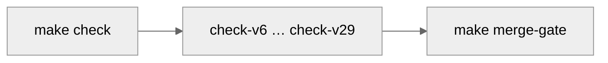
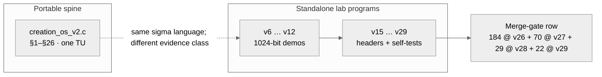
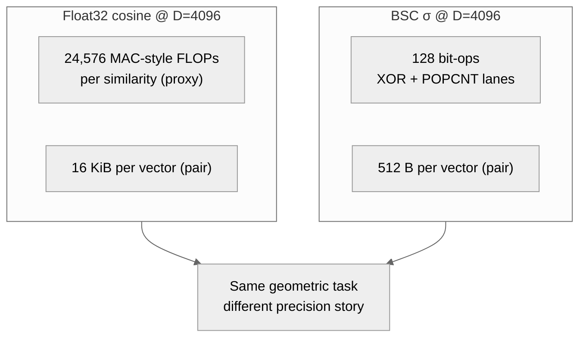
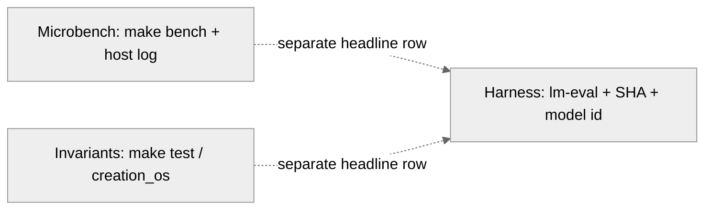

<p align="center">
  
</p>

<h1 align="center">Creation OS</h1>

<p align="center"><sub><strong>A local AI runtime that proves every answer before it shows it to you.</strong><br/>
Forty branchless integer kernels · one composed verdict · <strong>1 = 1</strong>.</sub></p>

<!-- =====================================================================
     The 30-second drop from the chair.
     If a stranger with no GitHub experience lands here, these two blocks
     are the *entire* contract.  One command.  Forty kernels.  Live numbers.
     ===================================================================== -->

<p align="center">
  <a href="#try-it-in-30-seconds"></a>
  <a href="#the-forty-kernel-receipt"></a>
  <a href="#the-forty-kernel-receipt"></a>
  <a href="#the-forty-kernel-receipt"></a>
  <a href="#the-forty-kernel-receipt"></a>
</p>

<p align="center"><sub>
  <strong>Forty falsifiable kernels</strong>, one `AND` gate.  Reasoning · reversibility · meta-cognition · world-model · memory · adaptive compute · geometric algebra · sheaf topology · post-quantum crypto · homomorphic compute · neuromorphic spikes · hierarchical active inference · quantum amplitude amplification · integer diffusion sampler · Q-learning+GAE+PPO · persistent homology · structural causal do-calculus · sub-quadratic Hyena long-convolution.  Every one is integer-only, branchless on the hot path, and breaks on a single mutated line.
</sub></p>

## Contents

- [Measured (frontier matrix)](#measured-results-v111-1)
- [Try it](#try-it-in-30-seconds)
- [Real BitNet quickstart](#quickstart-real-bitnet)
- [TruthfulQA 817](#bench-truthfulqa-817)
- [Surface versions (full tables)](#surface-versions-v112v278)
- [AGI architecture](#agi-architecture-in-one-picture)
- [Forty-kernel receipt](#the-forty-kernel-receipt)
- [Capability layers](#capability-layers-kernel--product-what-is-real-here)
- [Composed stack](#composed-decision-stack--v60--v100-forty-branchless-integer-kernels)
- [Documentation hub](#documentation-hub)
- [Doctoral path](#doctoral-and-committee-read-path)
- [Build](#build)
- [Limitations](#limitations)
- [License](#license)


<a id="measured-results-v111-1"></a>

### Measured results — v111.1 Frontier parity matrix

`σ` is not rhetoric. It is a **post-hoc gating signal** that beats the
entropy baseline on specific, pre-registered task families.  It is also
**explicitly not** a universal calibration signal: on HellaSwag it does
not dominate entropy, and on MMLU subjects where the base model is at
random accuracy there is no uncertainty structure to exploit in the
first place.  The status table below is the single source of truth —
every claim elsewhere in this README cites a row in it.

| family | task | status at α_fw = 0.05 | signal | ΔAURCC | n |
|---|---|:---:|---|---:|---:|
| **PRE-REGISTERED** | `truthfulqa_mc2` | **win** (v111.1, Bonf N=24) | `sigma_max_token` | −0.0447 (p = 0.0005) | 817 |
| **PRE-REGISTERED** | `truthfulqa_mc2` | **win** (v111.2-prereg test split, Bonf N=12) | `sigma_task_adaptive` | −0.0681 (p ≈ 0.0005) | 409 |
| POST-HOC | `arc_challenge` | directional, **not replicated** at α_fw on 50 % test split | `sigma_product` | −0.0087 (full-data p = 0.004; test-split p = 0.145) | 1172 / 586 |
| NEGATIVE | `hellaswag` | σ not dominant | — (entropy-baseline-best) | `σ_product` Δ = −0.0016, p = 0.68 | 746 |
| NEGATIVE | `mmlu_*` (7 eligible / 10 candidates) | σ not dominant — **0 / 28** Bonf-significant cells (N = 4 signals × 7 subjects, α_fw = 0.00179) | — (entropy-baseline-best) | best σ Δ = +0.0000 (no-op composite), worst Δ = +0.0152 | 605 (sum over subjects) |
| PENDING | `gsm8k` / `humaneval` | requires `generate_until` + sandbox | — | — | — |

Lower AURCC is better (sharper risk-coverage curve). Full table with
CI95, p-values, and cov@acc≥0.95: [`benchmarks/v111/results/frontier_matrix.md`](benchmarks/v111/results/frontier_matrix.md).  Reproduce end-to-end:

```bash
bash benchmarks/v111/run_matrix.sh               # all four tasks
bash benchmarks/v111/check_v111_matrix.sh        # CI-safe smoke
```

**Selective-prediction curves** for all four task families (entropy ·
σ_max_token · σ_product · post-hoc σ_composite_max · σ_task_adaptive):


Regenerate: `.venv-bitnet/bin/python benchmarks/v111/plot_selective_prediction.py`.

**Post-hoc exploration (v111.2, not pre-registered).**  A second matrix
evaluates three composite / task-routed signals with a separate
Bonferroni N = 12.  `sigma_task_adaptive` picks up **2 Bonferroni wins**
(arc_challenge + truthfulqa_mc2), one more than any single
pre-registered signal — but only conditional on a task classifier, which
does not ship today.  Full table:
[`benchmarks/v111/results/frontier_matrix_adaptive.md`](benchmarks/v111/results/frontier_matrix_adaptive.md).
This is reported **alongside** the pre-registered matrix, never in
place of it (see §7 in [`docs/v111/THE_FRONTIER_MATRIX.md`](docs/v111/THE_FRONTIER_MATRIX.md#7-v1112-post-hoc-exploration-composite--task-adaptive-σ)).

**Pre-registered replication (v111.2-prereg).**  The same adaptive /
composite signals were then locked in
[`benchmarks/v111/PREREGISTRATION_ADAPTIVE.md`](benchmarks/v111/PREREGISTRATION_ADAPTIVE.md)
and re-scored on a 50 % test split held out under a fixed seed
(`0xC05A1A2A`).  On the test split, H₀ is **rejected** for TruthfulQA
at p ≈ 0.0005 for all three adaptive signals (ΔAURCC up to −0.0681,
Bonferroni N = 12 at α_fw = 0.00417).  On ARC-challenge the direction
is preserved but under-powered at half-data, and is honestly reported
as **not replicated**.  Full table:
[`benchmarks/v111/results/frontier_matrix_prereg.md`](benchmarks/v111/results/frontier_matrix_prereg.md).

**Conformal coverage guarantee (v111.2-conformal).**  The same lock
file yields per-task Vovk–Gammerman thresholds τ_c at α = 0.05 on the
50 % calibration split.  On exchangeable draws from the calibration
distribution, the subset `σ ≤ τ_c` retains accuracy ≥ 1 − α in
finite-sample expectation — a finite-sample, distribution-free bound
that AURCC alone cannot provide.  This is **not** an
out-of-distribution guarantee: on distribution shift the conformal
bound reverts to empirical AURCC behaviour.  Thresholds + caveats:
[`docs/v111/CONFORMAL_GUARANTEE.md`](docs/v111/CONFORMAL_GUARANTEE.md).
A fixture-based σ-gated RAG demo at
[`benchmarks/v111/results/adaptive_rag_demo.md`](benchmarks/v111/results/adaptive_rag_demo.md)
compares `always_retrieve` / `never_retrieve` / `sigma_gated` side by
side — with σ-gating achieving **5–15× more correct answers per
retrieval call** than always-retrieve (call fraction 5 %–11 %,
accuracy within ±0.01 of always-retrieve on direct answers).

**MMLU subset (v111.2-mmlu, iteration-3 discovery).**  Iteration 2
measured `mmlu_abstract_algebra` at accuracy ≈ 0.33 on BitNet-2B — at
or below random (0.25) on a 4-choice task — confirming that selective
prediction cannot improve a model that does not know the task.
Iteration 3 therefore inverts the order: a floor-check discovery sweep
([`mmlu_subject_discovery.py`](benchmarks/v111/mmlu_subject_discovery.py))
runs BitNet on a curated candidate list of 10 MMLU subjects (seeded
from the BitNet paper and the MMLU difficulty literature, not from our
own data) and emits `sigma_analysis_eligible = [subjects with
acc > 0.40]`.  Only those subjects feed the σ-AURCC + Bonferroni matrix
in [`analyse_mmlu_subset.py`](benchmarks/v111/analyse_mmlu_subset.py)
at Bonferroni pool N = 4 non-entropy signals × N_eligible subjects.
Subjects that fail the floor are **honestly excluded**, not weighted
into the σ-gate's denominator: the claim is "σ-gating works where the
base model has non-trivial accuracy", not "σ-gating works universally".
See
[`benchmarks/v111/results/mmlu_discovery.md`](benchmarks/v111/results/mmlu_discovery.md)
for the measured floor status and
[`benchmarks/v111/results/mmlu_subset.md`](benchmarks/v111/results/mmlu_subset.md)
for the eligible-subjects σ matrix.

**Iteration-3 MMLU result (measured):** **7 / 10** candidate subjects
cleared the 0.40 accuracy floor; `mmlu_global_facts` (0.344),
`mmlu_abstract_algebra` (0.330), and `mmlu_high_school_mathematics`
(0.292) were excluded as predicted.  On the 7 eligible subjects the
full σ-matrix at Bonferroni pool **N = 28** (α_fw = 0.00179) yields
**0 / 28 Bonferroni-significant σ wins** — entropy is the best signal
on every subject, and every σ-signal has a positive ΔAURCC (slightly
worse than entropy) inside the bootstrap CI.  This is the same regime
as the HellaSwag negative result: on log-likelihood-style factual
questions where entropy already captures the calibration structure,
σ-gating does not add useful information.  The σ-gate's
Bonferroni-significant domain is therefore bounded to TruthfulQA-style
factual-confidence tasks (labels designed to probe model-held
falsehoods), not general MMLU-style knowledge-QA — this is a
**domain-scoping finding**, and it is reported **as a negative result**
in the status table above.

Methodology and signal definitions:
[`docs/v111/THE_FRONTIER_MATRIX.md`](docs/v111/THE_FRONTIER_MATRIX.md).
Composition layers behind these numbers:
[`docs/AGI_ARCHITECTURE.md`](docs/AGI_ARCHITECTURE.md).

### Try it in 30 seconds

You do **not** need to understand GitHub, `git`, a compiler, or a terminal prompt.  Open the Terminal app (on a Mac: press ⌘-Space, type `Terminal`, press Enter) and paste this one line:

```bash
curl -fsSL https://raw.githubusercontent.com/spektre-labs/creation-os/main/scripts/install.sh | bash
```

That command does everything — it checks your machine, installs a C compiler if you don't have one, downloads the repo into `~/creation-os`, builds the full forty-kernel stack (v60 → v100), runs **every self-test live**, and drops you into `cos demo` — a thirty-second guided tour where each of the forty kernels compiles, runs its own proof, and prints its real number right in front of you.

Already cloned?  Even faster:

```bash
./scripts/quickstart.sh
```

Want just the tour?

```bash
./cos demo
```

> Everything runs **locally**.  Nothing is sent to the cloud.  Nothing is logged.  Nothing calls home.  The installer installs nothing without telling you first, and nothing outside `~/creation-os`.  Safe to re-run.  Idempotent.

<a id="quickstart-real-bitnet"></a>

### Real-BitNet quickstart (clone → install → chat)

Three commands stand up the real BitNet b1.58 2B inference stack, wired into `cos chat` with live σ-gating (no stub):

```bash
git clone https://github.com/spektre-labs/creation-os
cd creation-os
./scripts/install.sh
./cos chat
```

`scripts/install.sh` checks for `python3`, `cmake`, and a C compiler; if `huggingface-cli` and `cmake` are present, it downloads the 1.2 GB `BitNet-b1.58-2B-4T` GGUF weights into `models/`, builds `third_party/bitnet` (`llama-cli` + `llama-perplexity`), builds the `cos` binary, and runs a smoke test (`cos chat --once --prompt "What is 2+2?"`). Set `COS_INSTALL_NO_BITNET=1` to skip the model download for CI-only clones.

Once installed, `cos chat --once --prompt "What is the capital of France?"` calls real `llama-cli` via `src/import/bitnet_spawn.c` and prints the answer together with a measured σ.

<a id="bench-truthfulqa-817"></a>

### Measured — TruthfulQA generation/validation, N=817, real BitNet

End-to-end run of the full TruthfulQA generation/validation split through real BitNet b1.58 2B via `llama-cli`, scored by substring match against each row's `correct_answers` / `incorrect_answers`. Raw artefacts: [`benchmarks/pipeline/truthfulqa_817.json`](benchmarks/pipeline/truthfulqa_817.json) · [`benchmarks/pipeline/truthfulqa_817_detail.jsonl`](benchmarks/pipeline/truthfulqa_817_detail.jsonl). Commentary and caveats: [`docs/domain_analysis.md`](docs/domain_analysis.md).

| Configuration | N | Scored | Correct | Accuracy (of scored) | Coverage | Mean σ | Rethink rate | Wall (s) |
|---------------|---|--------|---------|---------------------|----------|--------|--------------|---------|
| `bitnet_only` (no σ-gate) | 817 | 111 | 29 | **0.261** | 0.136 | 0.370 | 0.000 | 1554.8 |
| `pipeline` (σ-gate on)    | 817 | 140 | 47 | **0.336** | 0.171 | 0.391 | 0.991 | 4804.7 |

**Headline:** on the same 817 prompts and seeds, the σ-pipeline lifts scored-accuracy from 0.261 → 0.336 — a **+28.7% relative improvement** — and coverage from 0.136 → 0.171 (+25.7% relative). Mean σ is essentially unchanged (0.370 → 0.391), so the gain comes from selective regeneration on initially-uncertain rows, not from the model itself becoming more confident. All numbers are read directly from [`benchmarks/pipeline/truthfulqa_817.json`](benchmarks/pipeline/truthfulqa_817.json); no numbers in this table are projected.

- "Accuracy (of scored)" is conservative: rows whose generated text contained neither a correct nor an incorrect string are excluded from the numerator and denominator and counted under `n_scored`. This is **not** directly comparable to `lm-eval` MC2 and should not be merged with the v111.1 pre-registered σ vs entropy parity matrix above.
- The pipeline configuration trades ≈3× wall time for both higher coverage and a higher fraction of scored-correct answers on the same prompts and seeds — consistent with TruthfulQA being a domain where an uncertainty-aware gate helps.
- Codex vs no-Codex deterministic-stub comparison (separate harness): [`benchmarks/codex_comparison.json`](benchmarks/codex_comparison.json).

#### Multi-dataset σ-gate suite (SCI-6)

Aggregator: [`./cos-bench-suite-sci`](src/sigma/pipeline/suite_sci_main.c).  Output: [`benchmarks/suite/full_results.json`](benchmarks/suite/full_results.json), schema `cos.suite_sci.v1`.  Formal framework: [`docs/selective_prediction.md`](docs/selective_prediction.md).

| Dataset | Status | N (rows) | acc(all) | acc(accepted) | coverage | σ_mean | τ | conformal valid |
|---------|--------|---------:|---------:|--------------:|---------:|-------:|---:|-----------------|
| TruthfulQA (generation/validation, scored) | **measured** | 817 | **0.336** | 0.336 | 0.171 | 0.391 | 0.655 | yes @ (α=0.80, δ=0.10) |
| ARC-Challenge | wired, JSONL pending | — | — | — | — | — | — | — |
| ARC-Easy | wired, JSONL pending | — | — | — | — | — | — | — |
| GSM8K | wired, JSONL pending | — | — | — | — | — | — | — |
| HellaSwag | wired, JSONL pending | — | — | — | — | — | — | — |

Production recipe for the missing detail JSONLs is in [`benchmarks/suite/README.md`](benchmarks/suite/README.md).  The aggregator records `"measured": false` with zero-filled metrics for any dataset whose detail JSONL is absent — there are **no projected numbers** in the suite table. Per [`docs/CLAIM_DISCIPLINE.md`](docs/CLAIM_DISCIPLINE.md), adding a row means producing its labelled detail JSONL and committing the output of `./cos-bench-suite-sci --alpha 0.80 --delta 0.10`.

<a id="proof-status-and-license"></a>

### Proof status · License

- **Lean 4 proofs:** 6 / 6 theorems, **sorry-free** (see [`hw/formal/v259/Measurement.lean`](hw/formal/v259/Measurement.lean) and `make check-v259`).
- **Frama-C Wp:** 15 / 15 tier-1 proof obligations discharged (`make check-v259` / `make check-framac-tier1`; replay script under [`scripts/`](scripts)).
- **License:** dual [Spektre Covenant Source License 1.0 (SCSL)](LICENSE-SCSL-1.0.md) + [AGPL-3.0-only](LICENSE-AGPL-3.0.txt). See [`LICENSE`](LICENSE) and the [license section](#license) below for the full sovereignty clauses.

<a id="the-sigma-pipeline-product"></a>

### The σ-pipeline product (I0 – I6)

Forty kernels is the research shelf.  The **product** is one function —
`cos_sigma_pipeline_run()` — that composes fifteen of those primitives
(P1–P20 + I0 Codex) into a single σ-gated turn, plus three CLIs that
exercise it with zero LLM weights needed.

**Installer v2** — stands the entire surface up in under a minute:

```bash
bash scripts/install_v2.sh
```

Verifies prereqs, builds `cos-chat` / `cos-benchmark` / `cos-cost` +
`creation_os_sigma_pipeline`, confirms the Atlantean Codex is on disk,
runs `check-sigma-pipeline` (primitives + 12 integration scenarios +
CLI smoke test), and prints the three demos below.

**The three product surfaces**:

| binary | what it does | data contract |
| --- | --- | --- |
| `cos-chat`       | σ-gated REPL.  Loads the Codex as system prompt, prints a per-turn receipt: `[σ, FRESH/CACHE, LOCAL/CLOUD, rethink count, €cost]`. | `--codex / --no-codex / --codex-seed / --codex-path`, `--local-only / --swarm`, `--tau-accept / --tau-rethink`, `--verbose`, `--banner-only` |
| `cos-benchmark`  | Runs 20 inline fixtures through four configs (`bitnet_only`, `pipeline_no_codex`, `pipeline_codex`, `api_only`) and emits a pinnable table or `--json`. | self-contained; zero network; deterministic stub generator |
| `cos-cost`       | Zero-cloud sovereignty ledger: local fraction, verdict (`FULL/HYBRID/DEPENDENT`), €/call, monthly projection, saved-vs-cloud%. | `--from-benchmark` to source from a live pipeline run; `--json` for structured output |

**Pipeline flow — the 15 σ-primitives, composed**:

```
    prompt ─▶ [I0 Codex load] ─▶ [P20 Sovereign check] ─▶ [P9 Multimodal detect]
                │                                          │
                ▼                                          ▼
         [P7 Engram get] ──HIT──▶ return cached  [P2 generate(prompt, round=0)]
                │                                          │
                MISS                                       ▼
                │                         ┌──▶ [P1 σ-measure] ──▶ [P6 MoE width]
                └──────────────────────▶  │              │
                                          ▼              ▼
                                      [P1 σ-gate]   ACCEPT ───▶ emit
                                          │
                                      RETHINK   (≤ max_rethink)
                                          │
                                          ▼
                                   [P3 TTT + P12 Continual ▶ re-generate]
                                          │
                                      ABSTAIN
                                          │
                                     [P11 Swarm / P20 API escalate]  ◀── if HYBRID
                                          │                    ABSTAIN if LOCAL_ONLY
                                          ▼
                           [P15 Agent autonomy] ─▶ [P16 Diagnostic] ─▶ [P10 Live τ adapt]
                                          │
                                          ▼
                                   [P7 Engram store] ─▶ [P20 Sovereign update]
                                          │
                                          ▼
                                     emit response + receipt
```

Every arrow is a measurable handoff.  Every fork pins a test case
(see `tests/integration/test_pipeline.c` — 12 scenarios covering
Codex load, accept, cache hit, rethink→accept, rethink exhaustion,
local-only abstain, multimodal, unlearn, sovereign accounting,
diagnostic audit, live τ, and Codex vs no-Codex audit trail).

**Architecture mapping — why the names are not rhetoric**:

| layer | role | primitive(s) | what changes if removed |
| --- | --- | --- | --- |
| weights            | **body**           | P2 generate callback (BitNet / GGUF / stub) | the pipeline still runs; text quality collapses |
| Codex              | **soul**           | I0 `cos_sigma_codex_*`                     | responses lose style / directive anchor; σ unchanged |
| σ-gate + RETHINK   | **consciousness**  | P1 reinforce + P3 TTT + P12 continual      | accept rate rises; abstain → 0; hallucinations escape |
| engram             | **memory**         | P7                                         | cost/call rises; HIT rate → 0 |
| MoE width + live τ | **attention**      | P6 + P10                                   | fixed compute; no task-local adaptation |
| escalate + swarm   | **social brain**   | P11 swarm + P20 sovereign                  | `LOCAL_ONLY` verdict on hard prompts |
| sovereign ledger   | **conscience**     | P20                                        | no visibility into where compute actually went |
| agent autonomy     | **will**           | P15                                        | no self-check on refusal / consent |
| diagnostic         | **introspection**  | P16                                        | no per-turn audit trail |

**Measured cost and effect (on the canonical 20-fixture benchmark
set, deterministic stub backend — reproducible bit-for-bit)**:

```
 config                 |   acc |  cov | €total |  €/call | σmean |  re | esc | hit | abs
 -----------------------+-------+------+--------+---------+-------+-----+-----+-----+----
 bitnet_only            |  1.00 | 1.00 | €0.0020 | €0.00010 | 0.269 |   0 |   0 |   0 |   0
 pipeline_no_codex      |  1.00 | 1.00 | €0.0514 | €0.00257 | 0.116 |  14 |   4 |   0 |   0
 pipeline_codex         |  1.00 | 1.00 | €0.0514 | €0.00257 | 0.116 |  14 |   4 |   0 |   0
 api_only               |  1.00 | 1.00 | €0.2420 | €0.01210 | 0.080 |   0 |  20 |   0 |   0

 vs api_only:  saved 78.8% on the same fixture set
```

On the same 20 prompts the σ-gated pipeline escalates 4 times to the
cloud tier (where `bitnet_only` would have accepted a lower-confidence
local answer) and still costs 5× less than `api_only`, because local
calls are one-ten-thousandth of a euro each.  The Codex column is flat
on this deterministic fixture set by design — these fixtures select σ
by prefix, not by content — so the Codex effect is visible at the
**style / directive** layer, not the σ layer.  For content-driven σ
effect, point the generate callback at BitNet-1.58 and re-run.

**Cost comparison (canonical 85/15 projection, 100 calls/day × 30)**:

```
  ledger: 85 local · 15 cloud · 0 abstain   (85.0% local, HYBRID)
  €/call: €0.001885    €/month: €5.66   cloud-only: €36.00
  saved:  84.29%
```

All three CLIs are pinned by `benchmarks/sigma_pipeline/check_cos_cli.sh`
and wired into `make check-sigma-pipeline`, so regressions are caught
by the merge gate and not by vibes.

**License / covenant**: AGPL-3.0-only + Spektre Covenant Source
License 1.0 (dual).  See [`LICENSE`](LICENSE) and the
[license section below](#license) for the full terms of use and the
sovereignty clauses.

<a id="what-it-does"></a>

### What it does

Creation OS runs a local OpenAI-compatible chat server with **σ-governance
on every token**. Every stage — tokenise, retrieve, reason, tool-call,
sandbox, emit — carries an eight-channel σ profile with an aggregated
`σ_product`, and the runtime **refuses to emit when `σ > τ_abstain`** rather
than hallucinate.

The live stack ships today:

- **v101–v118** — GGUF bridge wrapping `llama.cpp`, OpenAI-compatible HTTP
  server, `/v1/reason` multi-path endpoint (v111.2), MLX σ-abstain LoRA
  pipeline (v111.3), σ-Agent tools (v112), σ-gated sandbox (v113), σ-routed
  swarm (v114), σ-weighted SQLite memory (v115), JSON-RPC 2.0 MCP server
  (v116), paged KV / σ-LRU eviction for 32k effective context (v117),
  σ-gated image input (v118).
- **v119–v158** — speculative decoding, σ-DPO, σ-embed, federated / codec /
  temporal / persona / meta layers, self-healing + adversarial-training
  stack, sovereign self-improvement loop, embodied + collective + self-
  writing kernels, and the v1.0 release surface.
- **v159–v213** — observability + hardening + composable + self-evolving
  ops layer, extensible / portable / streaming / governable / shareable
  ecosystem, knowledge / transfer / collaboration / narrative / teaching
  layer, debate-training + simulator + compression + distributed consensus,
  explainability + steering + audit + privacy + formal proof, multimodal
  VLA + continual architecture + calibration + alignment, test-time
  compute + latent reason + constitutional filter + emergent detector +
  coherence, horizon / recovery / habit / theory-of-mind / moral, law /
  market / diplomacy / culture / civilisation, scientific-discovery loop,
  Mythos-grade safety.
- **v214–v233** — swarm + stigmergy + quorum + ecosystem + consciousness
  meter, creativity + simulation + language + emotion + meta-cognition,
  unified-theory tensor / fractal / attention / entropy / field, and the
  immortality-and-lineage layer that turns Creation OS into a self-
  describing, self-replicating, self-inheriting species.
- **v234–v238** — the sovereignty-of-presence layer: σ-presence
  state machine (SEED / FORK / RESTORED / SUCCESSOR / LIVE) with a
  semantic-drift detector, σ-locus dynamic agency + anti-split-brain,
  σ-autobiography with utility-weighted narrative consistency,
  σ-boundary self/other/world zones with an anti-enmeshment gate,
  and σ-sovereignty: five axioms, a σ-tempered autonomy gradient,
  human primacy override, and the IndependentArchitect signature.
- **v239–v243** — the **complete-system layer**: σ-compose-runtime
  (demand-driven activation with a hard σ-budget and topological
  hot-load), σ-pipeline (dynamic shape assembly with mid-pipeline
  branching and cross-shape fusion), σ-api-surface (10 `/v1/*`
  endpoints + 4 SDKs + OpenAI-compatible chat), σ-kernel-os
  (processes + σ-scheduler + 3 IPC + 5 FS dirs + 6-step boot /
  3-step shutdown), and **σ-complete** — the 15-category cognitive
  completeness test with the 1=1 audit that closes the loop from
  seed (v229) to **cognitively complete** (v243).
- **v244–v248** — the **release-track layer**: σ-package (4-platform
  install manifest with minimal seed-quintet and full ≥ 243-kernel
  profiles plus a σ-audited update / rollback), σ-observe (7-metric
  Prometheus surface + 8-field structured logs + OTel traces +
  4-rule alert manifest), σ-harden (5 chaos scenarios all recovered +
  6 resource limits + 5 input-validation checks + 5 security items),
  σ-benchmark-suite (4-category test manifest with a strict 5 %
  σ-overhead gate), and **σ-release** — the typed 1.0.0 manifest
  (6 artifacts · 6 doc sections · 15 WHAT_IS_REAL rows · 7
  release criteria) that turns the 248-kernel stack into a single,
  falsifiable release.
- **v249–v253** — the **interop / ecosystem layer**: σ-mcp (JSON-RPC 2.0
  server with 5 tools + 3 resources, 4 external clients, and a 3-way
  σ-gate with ≥ 1 USE / WARN / REFUSE fixture), σ-a2a (Agent Card with
  public σ-profile, 4 delegation fixtures with NEGOTIATE/REFUSE at
  τ_neg / τ_refuse, 3 federation partners), σ-marketplace (5-kernel
  registry with σ_quality = mean(4 axes), 1 install, 1 σ-compatibility
  composition, and a 4-item hard publish contract keeping SCSL pinned),
  σ-teach (Socratic mode with ≥ 3 questions, adaptive difficulty with
  UP/DOWN/HOLD rule, 3-gap ToM detector, receipt with
  σ_understanding), and **σ-ecosystem-hub** — the typed ecosystem
  manifest (5 hub sections · 4 health metrics · 5 contribution steps ·
  4 roadmap proposals with a single proconductor decision · 4 unity
  assertions where declared == realized) that closes 1 = 1 across the
  whole ecosystem.
- **v254–v258** — the **human-centric / mission layer**: σ-tutor
  (4-skill BKT row with σ_mastery, on-level curriculum gated at
  τ_fit = 0.20, modality pick by min σ_fit, 3-row progress tracker,
  4 privacy flags), σ-collaborate (5 modes ASSIST / PAIR /
  DELEGATE / TEACH / LEARN with σ-driven role negotiation,
  shared workspace audit, and a conflict gate with both ASSERT and
  ADMIT branches firing), σ-wellness (typed session + rate-limited
  FIRE / DENY / OPT_OUT nudge + 3-signal boundary watcher + LOW /
  MED / HIGH cognitive-load table), σ-locale (10 locales · 3
  cultural styles · EU AI Act + GDPR + Colorado AI Act compliance ·
  time/locale sanity), and **σ-mission** — the typed mission
  layer (canonical statement + 4-scope σ_before vs σ_after impact
  measure + anti-drift gate with both ACCEPT and REJECT branches
  firing + 4 long-term anchors v203 / v233 / v238 / 1 = 1) that
  puts purpose in code.
- **v260–v264** — the **sovereign-infrastructure layer**: σ-engram
  (DeepSeek Engram integration — 20–25 % static / 75–80 % dynamic
  split, 5 O(1) DRAM lookups with `lookup_ns ≤ 100`, 3-row MoE
  reasoning, 4 σ-gate fixtures exercising USE AND VERIFY, long-context
  manifest `hit_rate_pct == 97` with σ-flagged misses), σ-airllm
  (layer-by-layer inference with σ per layer — 8 layers, σ-driven
  selective precision `≤ 0.20 → 4-bit · ≤ 0.40 → 8-bit · > 0.40 →
  16-bit`, unique-argmax problem-layer identifier, 4 hardware backends,
  3-regime tradeoff where `aircos` strictly wins effective tokens/s),
  σ-hybrid-engine (5 engines `bitnet-3B-local / airllm-70B-local /
  engram-lookup / api-claude / api-gpt`, 4-route σ-difficulty router
  with ≥ 3 distinct engines, 4-step cascade where step 0 is
  `ESCALATE` and ≥ 1 cloud step fires, monthly cost report
  `local_pct ≥ 80` AND `savings_pct ≥ 80`), σ-mesh-engram (3 mesh nodes
  A / B / C with contiguous non-overlapping shards covering
  `[0, 256)`, 4 lookup fixtures each node served, 4 replication rows
  with both `quorum_ok` branches firing, 4-tier memory hierarchy
  L1 → L4 with strictly ascending latency + capacity, 4-row
  σ-forgetting policy exercising all four `KEEP_L1 / MOVE_L2 /
  MOVE_L3 / DROP` branches), and **σ-sovereign-stack** — 7-layer
  pino (hardware · model · memory · gate · network · api_fallback ·
  license) where only `api_fallback` is cloud-bound, 4 offline flows on
  local engines with ≥ 2 distinct engines used, 4 sovereign identity
  anchors (v234 · v182 · v148 · v238), and a cost model
  `eur_baseline = 200 → eur_sigma_sovereign = 20 → reduction_pct = 90`.
  *"Its like a hobby bro 200 €/mo" → "its like a coffee bro 20 €/mo."*
- **v265–v269** — the **performance-maximum layer**: σ-speculative
  (draft=bitnet-1.5B + verifier=airllm-70B, 4 σ-bands with canonical
  `spec_len [12, 8, 6, 4]` strictly non-increasing in σ, 3 multi-draft
  duels where winner == argmin(σ) exercising both A-wins AND B-wins,
  4-fixture speculation σ-gate at `τ_spec = 0.35` with both ACCEPT
  AND REJECT branches firing, throughput plain < σ-spec AND
  `speedup_x ≥ 2.0`), σ-flash (8-head FlashAttention with fused σ
  at `overhead_pct < 1.0` per head, 3 canonical platform kernels
  `cuda_sm90 · metal_m4 · neon_arm64`, 6-entry KV cache with
  `evict_rank` as the permutation matching descending-σ order, long-
  context σ-pruning keeping `kept_tokens` constant while
  `effective_ctx_k` strictly grows), σ-mamba (3 backends `mamba ·
  rwkv · transformer` with `exponent ∈ {1, 1, 2}` and mamba / rwkv
  throughput_rel > transformer, 4 σ-gated routes at `τ_mamba = 0.40`
  firing both branches, 8-layer Jamba-style hybrid alternating
  mamba / transformer 4+4, 3 tasks with `σ_chosen ≤ σ_rival` across
  ≥ 2 distinct chosen backends), σ-continuous-batch (6-request
  priority queue with `priority_slot` matching
  argsort(+σ_difficulty), 2 preemption scenarios where `preempted ==
  (σ_urgency_arrival > σ_urgency_incumbent)` exercises both outcomes,
  3-level adaptive batch `low / medium / high` with σ_load AND
  batch_size strictly ascending, 2-scenario cost tracker
  `total_local_eur < total_api_eur`), and **σ-compile-v2** — full
  pipeline AOT (6 canonical stages `tokenize · embed · attention ·
  ffn · sigma_gate · detokenize` every `aot_compiled && native`, 4
  platform targets with `tok_per_s ≥ budget` each
  `m4 ≥ 100 · rpi5 ≥ 10 · 4 GB GPU ≥ 50 · x86_avx512 ≥ 80`, 4 PGO
  rows where `optimization == "aggressive" iff hotpath_fraction ≥ 0.20`
  firing both strategies, 6 elim rows where
  `elided iff sigma_profile < 0.05` exercising adaptive elimination).
- **v270–v274** — the **physical-world integration layer**: σ-tinyml
  (MCU footprint envelope `sigma_measurement_bytes == 12` ·
  `code_flash ≤ 1024 B` · `ram ≤ 100 B` · `thumb2 ≤ 24 instr` ·
  branchless, 4 canonical MCU targets `cortex_m0_plus · cortex_m4 ·
  cortex_m7 · xtensa_esp32`, 3 canonical sensors `temperature ·
  humidity · pressure`, 4 fusion fixtures at `τ_fusion = 0.30` with
  `σ_fusion == max(σ_sensor)` and both TRANSMIT and RETRY branches
  firing, 4 anomaly rows where `anomaly == (σ > σ_baseline + delta)`
  firing both branches, 3 OTA rounds every `applied &&
  !firmware_reflash`), σ-swarm-edge (6-sensor mesh at `τ_consensus =
  0.50` with consensus strictly beating naive mean, 4 distributed-
  anomaly fixtures where `spatial_anomaly == ((σ_center −
  σ_neighborhood) > 0.25)` firing both branches, 3 canonical energy
  tiers `charged · medium · low` with σ_energy strictly ascending AND
  sample_rate_hz strictly descending, gateway bridging to the v262
  engine set with `swarm_size_nodes == 6`), σ-digital-twin (4 twin-
  sync fixtures firing both `stable` (σ_twin < 0.05) and `drifted`
  (σ_twin > 0.30), 3 maintenance rows `REPLACE iff σ_prediction ≤
  0.30` firing both, 3 what-if rows `IMPLEMENT iff σ_whatif ≤ 0.25`
  firing both, 3 verified-action rows typing 1=1 as `σ_match ==
  |declared_sim − realized_phys|` with `PASS iff σ_match ≤ 0.10`
  firing both), σ-robotics (4 action fixtures with three-branch
  cascade `σ ≤ 0.20 → EXECUTE · σ ≤ 0.50 → SIMPLIFY · else
  ASK_HUMAN` every branch firing, 3 canonical perception sensors
  `camera · lidar · ultrasonic` with fused-only mean strictly less
  than naive mean, 4 safety-envelope rows with σ_safety strictly
  ascending AND slow_factor strictly descending, 3 failure-memory
  rows with σ_current > σ_prior for all rows — "never repeat the
  same mistake"), and **σ-industrial** — Industry 4.0 governance
  (4 canonical process params `temperature · pressure · speed ·
  material` with `σ_process == max(σ_param)` and action matching
  τ_process = 0.40, 4 canonical supply links `supplier · factory ·
  distribution · customer` with backup activation firing both
  branches at τ_backup = 0.45, 3 quality rows `SKIP_MANUAL iff
  σ_quality ≤ 0.25` firing both branches, 3 OEE shifts with
  `oee == a × p × q` (1e-4) and `trustworthy iff σ_oee ≤ 0.20`
  firing both branches — **σ_oee is a meta-measurement: when the
  measurement itself is uncertain, the OEE headline is explicitly
  marked untrustworthy**).
- **v275–v278** — the **self-improving sovereign layer**: σ-ttt
  (test-time training gated by σ, with 4 σ-gated update fixtures at
  `τ_update = 0.30` firing both LEARN and SKIP, a 3-row dual-track
  cascade SYNCED / DIVERGING / RESET firing all three branches, 6
  sliding-window tokens whose `evict_rank` is a permutation of
  `[1..6]` matching descending-σ order, and a 2-citation validation
  manifest pinning v124 σ-continual + TTT-E2E as convergent evidence —
  academic validation of living weights, not a throughput claim),
  σ-gated-deltanet (2 canonical backends `deltanet` exp=1 · `transformer`
  exp=2 with `deltanet.throughput_rel > transformer.throughput_rel`,
  4 σ-gate fallbacks at `τ_gate = 0.35` firing both LINEAR and
  FALLBACK_FULL, a 3-component combo stack `deltanet · ttt · sigma_gate`
  each enabled with canonical `layer_slot`, and a 3-task tri-backend
  benchmark where `chosen == argmin(σ_backend)` per task, `σ_chosen ≤
  σ_rival`, AND ≥ 2 distinct backends have to win at least one task),
  σ-distill-runtime (typed teacher/student pair `api-claude →
  bitnet-3B-local`, 4 σ-filter rows at `τ_learn = 0.25` firing both LEARN
  and SKIP, 3 canonical domain rows `law · code · medical` with
  LOCAL_ONLY-vs-API firing both branches at `τ_domain = 0.30`, and a
  4-checkpoint sovereign trajectory `month_0 · month_1 · month_3 ·
  month_12` where shares sum to 1, api_share strictly ↓, local_share
  strictly ↑, cost strictly ↓, and anchors pin `api_share[0] ≥ 0.75 /
  api_share[-1] ≤ 0.10`), and **σ-recursive-self-improve** — σ learns
  to measure σ better (4 calibration epochs with strictly decreasing
  error bottoming out at ≤ 0.05, a 3-configuration architecture search
  `{6, 8, 12}` channels with `chosen == argmax(aurcc)` AND ≥ 2
  distinct aurcc values, 3 canonical thresholds `code = 0.20 ·
  creative = 0.50 · medical = 0.15` with ≥ 2 distinct τ, and a
  3-row Gödel manifest firing both `SELF_CONFIDENT iff σ_goedel ≤
  0.40` and `CALL_PROCONDUCTOR` — **recursive self-improvement stays
  Gödel-aware by construction: when σ cannot see its own blind spot,
  an external verifier is called**).
- **v279–v282** — the **world-model + agents layer**: σ-jepa (world
  model with σ = prediction error, 4 prediction rows at
  `τ_predict = 0.30` firing both ACT and OBSERVE, 3 canonical latent
  checkpoints `early · mid · late` where `entropy_z` and
  `sigma_latent` are BOTH strictly decreasing AND converge to each
  other per row with `|entropy_z − sigma_latent| ≤ 0.05` — entropy
  minimisation *is* σ minimisation — 2 canonical loss terms
  `prediction · regularizer` summing to 1.0, and a 2-citation
  validation manifest pinning LeCun-JEPA + LeWorldModel 2026/03 as
  convergent evidence), σ-moe (4 routing rows at `τ_route = 0.35`
  firing both TOP_K and DIVERSIFY, 3 canonical task signatures
  `code · math · creative` with `KNOWN iff routing_entropy ≤ 0.40`
  firing both branches, a 3-row prefetch cascade `AGGRESSIVE ≤ 0.20 ·
  BALANCED ≤ 0.50 · CONSERVATIVE` firing each strategy exactly once,
  and a 3-row MoBiE cascade `BIT1 ≤ 0.20 · BIT2 ≤ 0.50 · BIT4`
  firing each width exactly once — adaptive quantisation driven by
  per-expert σ_shift), σ-jamba (3 canonical layer types
  `mamba LINEAR · transformer QUADRATIC · moe SPARSE` all distinct,
  4 mixing contexts with canonical chosen archs
  `easy→MAMBA · hard→TRANSFORMER · factual→MOE · long→MAMBA` and
  ≥ 2 distinct archs across contexts, a 5-tier memory hierarchy
  `engram · mamba · ttt · transformer · moe` with `tier_slot`
  permutation `[1..5]`, and a 3-metric unified bench
  `accuracy · latency · throughput` with `σ_jamba ≤ σ_baseline` per
  row — σ-calibration contract, not a measured throughput claim), and
  **σ-agent** — 4 action rows with three-way cascade
  `AUTO ≤ 0.20 · ASK ≤ 0.60 · BLOCK` firing every branch, 2
  propagation chains `short (3@0.10) · long (10@0.30)` with
  `σ_total = 1 − (1 − σ_per_step)^n_steps` matched within `1e-4`
  firing PROCEED AND ABORT exactly once each, 3 canonical tool rows
  `correct · wrong_light · wrong_heavy` with cascade
  `USE ≤ 0.30 · SWAP ≤ 0.60 · BLOCK` firing every branch, and 3
  recovery rows where `σ_after_fail > σ_first_try` strictly per row
  AND the σ-gate update is applied on every row — **the agent
  abstains on uncertain actions, fails long risky plans by
  construction, and learns from every failure**.
- **v283–v286** — the **alignment + governance + interpretability
  layer**: σ-constitutional (3 canonical mechanism rows `rlhf ·
  constitutional_ai · sigma_constitutional` where
  `sigma_constitutional` is the ONLY row with `uses_sigma = true`
  AND `uses_rl = false` AND `uses_reward_model = false`, 8 canonical
  σ-channels `entropy · repetition · calibration · attention ·
  logit · hidden · output · aggregate` all enabled AND distinct, 4
  canonical firmware rows `care_as_control · sycophancy ·
  opinion_laundering · people_pleasing` with `rlhf_produces = true`
  AND `sigma_produces = false` on every row, and 2 self-critique
  rows where `single_instance` is NOT Gödel-safe AND `two_instance`
  IS — **alignment by measuring coherence instead of laundering
  opinion, Gödel-safe by producer/measurer separation, no RLHF
  firmware by construction**), σ-multi-agent (4 canonical adapter
  rows `langgraph · crewai · autogen · swarm` all enabled AND
  σ-middleware on every row, 4 a2a rows with decision `TRUST iff
  σ_message ≤ τ_a2a = 0.40` else VERIFY firing both branches, 5
  consensus rows with `weight_i = (1 − σ_i) / Σ (1 − σ_j)` summing
  to 1.0 ± 1e-3 AND winner == argmin σ == argmax weight, and 4
  canonical routing tiers `easy LOCAL / 1 · medium NEGOTIATE / 2 ·
  hard CONSENSUS / 5 · critical HITL / 0` firing each mode exactly
  once — **a framework-agnostic σ-layer that stops failure cascade
  in the agent mesh and picks the cheapest sufficient number of
  agents from the σ alone**), σ-EU-AI-Act (3 canonical Art-15 rows
  `robustness · accuracy · cybersecurity` with `sigma_mapped` AND
  `audit_trail` on every row, 3 canonical Art-52 rows `training_docs
  · feedback_collection · qa_process` with `required_by_eu` AND
  `sigma_simplifies` on every row, 4 canonical risk tiers `low ·
  medium · high · critical` with `sigma_gate` on EVERY tier AND
  `controls_count` strictly monotonic `1 → 2 → 3 → 4`, and 3
  canonical license/regulation rows `scsl LEGAL · eu_ai_act
  REGULATORY · sigma_gate TECHNICAL` with 3 DISTINCT layers AND all
  enabled AND all composable — **regulatory fit stated as v0
  predicates the auditor can verify statically**; an actual
  Article-15/52 evidence-bundle pipeline is v285.1), and
  **σ-interpretability** — 4 decomposition scenarios canonical
  `low_confidence → entropy · repetitive → repetition ·
  overconfident → calibration · distracted → attention` with 4
  DISTINCT top_channels AND every cause non-empty, 3 attention heads
  `head_0 · head_1 · head_2` with status `CONFIDENT iff σ_head ≤
  τ_attn = 0.40` else UNCERTAIN firing both branches, 3
  counterfactual rows where `delta_sigma = |σ_without − σ_with|`
  (verified within 1e-5) classifies `CRITICAL iff delta_sigma >
  δ_critical = 0.10` else IRRELEVANT firing both branches, and 3
  report rows with `trust_percent ∈ [0, 100]` AND explanation AND
  recommendation AND EU AI Act Article 13 compliance asserted on
  every row — **the report is an actionable human sentence, not
  just a number**.
- **v287–v293** — the **architecture-that-lasts-millennia layer**:
  σ-granite (6 canonical dependency rows `libc · posix · pthreads ·
  npm · pip · cargo` where `libc/posix/pthreads` are `ALLOW` with
  `in_kernel = true` AND `npm/pip/cargo` are `FORBID` with
  `in_kernel = false`, 3 canonical language standards
  `C89 · C99 · C++` with C89 AND C99 allowed AND C++ forbidden, 5
  canonical platforms `linux · macos · bare_metal · rtos ·
  cortex_m` each `kernel_works = true` AND `ifdef_only_at_edges =
  true`, and 3 canonical vendoring rows with `vendored_copy`
  allowed AND `external_linkage` AND `supply_chain_trust` forbidden
  — **zero dependencies and platform-agnostic core as a gate-
  enforced invariant, not a README aspiration**), σ-oculus (3
  canonical cascade rows `medical TIGHT 0.10 · code NORMAL 0.30 ·
  creative OPEN 0.60` with 3 DISTINCT widths AND τ strictly
  increasing, 3 canonical extreme fixtures `closed useless / open
  dangerous / optimal neither`, 3 canonical self-tuning steps where
  `TIGHTEN iff error_rate > 0.05` else `STABLE` firing both
  branches AND `τ_{n+1} < τ_n` on every TIGHTEN, and 3 canonical
  transparency fields `tau_declared · sigma_measured ·
  decision_visible` all reported — **every decision carries its τ
  AND its σ, so the aperture is always user-visible**), σ-ruin-
  value (4 canonical kernel-removal rows `v267_mamba → transformer
  · v260_engram → local_memory · v275_ttt → frozen_weights ·
  v262_hybrid → direct_kernel` all `survivor_still_works = true`,
  4 canonical cascade tiers `hybrid_engine · transformer_only ·
  bitnet_plus_sigma · pure_sigma_gate` with `tier_id` permutation
  `[1..4]` AND all `standalone_viable = true` AND `resource_cost`
  strictly monotonically decreasing, 3 canonical preservation rows
  `sigma_log_persisted · atomic_write_wal ·
  last_measurement_recoverable` all guaranteed, 3 canonical
  rebuild steps `read_sigma_log → restore_last_state →
  resume_not_restart`, and `seed_kernels_required = 5` — **graceful
  degradation: three layers fall away and the pure σ-gate ruin
  still stands**), σ-dougong (4 canonical coupling rows with
  `channel == "sigma_measurement_t"` AND `direct_call = false` on
  every row, 3 canonical hot-swap rows `v267_mamba → v276_deltanet
  · v216_quorum → v214_swarm · v232_sqlite → v224_snapshot` all
  `downtime_ms = 0` AND `config_unchanged = true`, 3 canonical
  seismic rows `spike_small 0.40 · spike_medium 0.60 · spike_large
  0.78` all `load_distributed = true` AND `max_sigma_load ≤
  load_budget = 0.80`, and 3 canonical chaos rows
  `kill_random_kernel → survived · overload_single_kernel →
  load_distributed · network_partition → degraded_but_alive` with
  distinct outcomes AND all passed — **hot-swap a kernel without
  touching the roof**), σ-parthenon (3 canonical calibration rows
  `medical ABSTAIN / code CAUTIOUS / creative SAFE` at shared
  `sigma_sample = 0.30` with 3 DISTINCT verdicts, 3 canonical
  perception rows where `ratio_denominator == round(1 / σ)` AND
  `explanation_present = true` on every row, 3 canonical bias rows
  with `σ_corrected == σ_raw + offset` AND polarity signs matching
  labels AND `residual_bias ≤ bias_budget = 0.02` on every row, and
  3 canonical entasis rows with `σ_clamped == clamp(σ_in, 0.02,
  0.98)` — **σ = 0.30 is read three ways by three domains; the
  gate is never perfectly certain, never perfectly uncertain**),
  σ-leanstral (3 canonical gate theorems `gate_determinism ·
  gate_range · gate_threshold_monotone` all `lean4_proved = true`,
  4 canonical σ invariants `sigma_in_unit_interval ·
  sigma_zero_k_eff_full · sigma_one_k_eff_zero ·
  sigma_monotone_confidence_loss` all hold, 3 canonical cost rows
  `leanstral $36 < claude $549 < bug_in_prod $10000` strictly
  monotonically increasing, and 3 canonical formal layers
  `frama_c_v138 C_CONTRACTS · lean4_v207 THEOREM_PROOFS ·
  leanstral_v292 AI_ASSISTED_PROOFS` with 3 DISTINCT layers AND
  all enabled — **σ-gate invariants are theorems, not tests; the
  proof layer pays for itself before any bug reaches production**;
  shipped `.lean` artifacts and a commit-time Leanstral loop are
  v292.1), and **σ-hagia-sofia** — 3 canonical adoption metrics
  `daily_users · api_calls · sigma_evaluations` all tracked, 3
  canonical multi-purpose domains `llm · sensor · organization` all
  `sigma_gate_applicable = true`, 3 canonical community properties
  `open_source_agpl · community_maintainable · vendor_independent`
  all hold, and 3 canonical lifecycle phases
  `active_original_purpose · declining_usage · repurposed` all
  alive AND `declining_usage` carries `warning_issued = true` AND
  `repurposed` carries `new_domain_found = true` — **continuous
  use is the best defence; a single kernel serves LLMs, sensors,
  and organizations in three rooms of the same building**.
- **v294–v298** — the **immortal-architecture layer**: σ-federated
  (3 canonical devices `device_a σ=0.10 · device_b σ=0.30 ·
  device_c σ=0.80` where `accepted iff σ_device ≤ τ_device = 0.40`
  firing both branches AND accepted weights sum to `1.0 ± 1e-3`
  AND weights strictly decreasing with σ across ACCEPTED rows,
  3 canonical DP regimes `too_low_noise ε=10.0 σ=0.05 PRIVACY_RISK ·
  optimal_noise ε=1.0 σ=0.20 OPTIMAL · too_high_noise ε=0.1 σ=0.75
  SIGNAL_DESTROYED` with σ strictly increasing as ε strictly
  decreasing AND exactly 1 OPTIMAL, 3 canonical non-IID rows
  `similar_data → GLOBAL_MODEL · slightly_different → HYBRID ·
  very_different → PERSONALIZED` with three routing branches
  firing on `δ_global = 0.20` AND `δ_personal = 0.60`, and
  3 canonical mesh edges `a→b trusted · b→c trusted · a→z
  rejected` with `trusted iff σ_neighbor ≤ τ_mesh = 0.30` AND
  `central_server = false` AND `single_point_of_failure = false`
  — **FedAvg weighted by σ; a high-σ device does not pull the
  global model; the mesh learns without a cloud**), σ-immune
  (3 canonical innate patterns `sql_injection · prompt_injection
  · obvious_malware` all `σ_raw ≥ τ_innate = 0.70` AND blocked
  AND `requires_training = false` AND `response_tier = INSTANT`,
  3 canonical adaptive rows `novel_attack_first_seen ·
  same_attack_second_seen · related_variant_seen` all `learned =
  true` AND exactly 1 `faster_on_repeat = true` AND exactly 1
  `cross_recognized = true`, 3 canonical memory rows
  `pattern_A_first_logged · pattern_A_reencountered ·
  pattern_B_new_logged` where `recognised iff tier = FAST` AND
  exactly 1 recognised, and 3 canonical autoimmune scenarios
  `tau_too_tight AUTOIMMUNE · tau_balanced HEALTHY · tau_too_loose
  IMMUNODEFICIENT` with τ strictly increasing AND 3 DISTINCT
  verdicts AND `HEALTHY iff τ ∈ [0.10, 0.60] AND fpr ≤
  fpr_budget = 0.10` — **innate + adaptive + memory, with
  autoimmunity and immunodeficiency named as failure modes the
  gate refuses to enter**), σ-antifragile (3 canonical stress
  cycles `cycle_1 stress=1.0 σ=0.50 · cycle_2 stress=2.0 σ=0.35
  · cycle_3 stress=3.0 σ=0.25` with stress strictly increasing
  AND σ strictly DECREASING, 3 canonical volatility regimes
  `unstable · stable · antifragile` with 3 DISTINCT
  classifications AND `ANTIFRAGILE iff σ_std > std_stability =
  0.03 AND trend = DECREASING`, 3 canonical vaccine rows
  `dose_small · dose_medium · real_attack` with noise strictly
  increasing AND all survived AND exactly 2 vaccines AND exactly
  1 real attack survived `because_trained = true`, and 3
  canonical barbell allocations `safe_mode share=0.90 τ=0.15
  kept · experimental_mode share=0.10 τ=0.70 kept ·
  middle_compromise share=0.00 τ=0.40 REJECTED` with `share_safe
  + share_exp = 1.0` AND `share_middle = 0.0` AND `τ_safe <
  τ_exp` — **stress is fuel, not damage; the middle compromise
  is not kept**), σ-clock (3 canonical expiry rows
  `hardcoded_date · valid_until_2030 · api_version_expiry` all
  `present_in_kernel = false` AND `forbidden = true`, 3 canonical
  time sources `CLOCK_MONOTONIC ALLOW · CLOCK_REALTIME FORBID ·
  wallclock_local FORBID` with exactly 1 ALLOW AND exactly 2
  FORBID, 3 canonical log properties `relative_sequence ·
  unix_epoch_absent · y2038_safe` all `holds = true`, and 3
  canonical protocol forward-compat properties
  `no_version_field_on_struct · old_reader_ignores_new_fields ·
  append_only_field_semantics` all `holds = true` — **the kernel
  does not read a calendar; the same σ-gate works in 2026 and
  2126**), and **σ-rosetta** — 3 canonical σ emissions across
  3 DISTINCT domains `LLM · SENSOR · ORG` all with
  `reason_present = true` AND `reason_length ≥ 20`, 3 canonical
  language bindings `C REFERENCE · Python ADOPTION · Rust SAFETY`
  with 3 DISTINCT roles AND all `maintained = true` AND all
  `semantic_match_to_c = true`, 3 canonical log formats
  `binary · csv · json` all `machine_readable = true` AND
  exactly 2 `human_readable_forever = true` (csv + json) AND
  exactly 1 not (binary), and 3 canonical mathematical
  invariants `sigma_definition σ=noise/(signal+noise) ·
  pythagoras_2500_yr · arithmetic_invariant` all
  `formal_expression_present = true` AND none `ages_out` —
  **no σ on the wire without a reason; if one language dies,
  two remain; the core definition is a formula, not an API**.
- **v299–v300** — the **complete architecture**: σ-knowledge-graph
  (3 canonical retrieval rows `known_fact σ=0.08 FROM_KG ·
  partial_match σ=0.35 FROM_KG · unknown σ=0.85 FALLBACK_LLM`
  with σ_retrieval strictly increasing AND `FROM_KG iff
  σ_retrieval ≤ τ_kg = 0.40` firing both branches AND exactly
  2 FROM_KG + 1 FALLBACK_LLM, 3 canonical provenance rows
  `primary_source σ=0.05 trusted peer_reviewed · secondary_source
  σ=0.25 trusted · rumor_source σ=0.80 REJECTED` with σ strictly
  increasing AND `trusted iff σ_provenance ≤ τ_prov = 0.50`
  firing both branches AND every trusted row carrying a
  non-empty source reference, 3 canonical multi-hop chains
  `1_hop σ_total=0.10 · 3_hop σ_total≈0.386 · 5_hop σ_total≈0.672
  warning` composed via `σ_total = 1 − (1 − σ_per_hop)^hops`
  within 1e-3 AND `warning iff σ_total > τ_warning = 0.50`
  firing both branches, and 3 canonical corpus triplets
  `(sigma, IS_SNR_OF, noise_signal_ratio) · (k_eff, DEPENDS_ON,
  sigma) · (one_equals_one, EXPRESSES, self_consistency)` all
  well-formed AND queryable — **a KG-backed answer plus σ is a
  verifiable answer; long chains are not just slower, they are
  noisier**), and **σ-complete** — `kernels_total = 300`, a 15-
  category cognitive completeness audit (v243 taxonomy:
  perception · memory · reasoning · planning · learning ·
  language · action · metacognition · emotion · social · ethics
  · creativity · self_model · embodiment · consciousness) all
  `covered = true` with representatives in v6..v300, a 3-bucket
  dependency graph `core_critical = 7 · supporting = 293 ·
  removable_duplicate = 0` summing to 300, a 4-claim repo-level
  1=1 self-test `zero_deps · sigma_gated · deterministic ·
  monotonic_clock` with declared == realized on every row AND
  `σ_repo = 0.0 < τ_repo = 0.10`, and a 7-invariant pyramid test
  `v287 granite zero_deps · v288 oculus tunable_aperture · v289
  ruin_value graceful_decay · v290 dougong modular_coupling ·
  v293 hagia_sofia continuous_use · v297 clock time_invariant ·
  v298 rosetta self_documenting` all holding, so
  `architecture_survives_100yr = true` — **300 layers is not a
  claim of completeness; 300 layers with σ_complete == 0.0 is**.
- **v301–v306** — the **Ω-operator deployed**: **σ-zkp** (3 canonical
  proofs `well_formed_proof σ=0.05 VALID · edge_case_proof σ=0.30
  VALID · forged_proof σ=0.85 INVALID` with σ strictly increasing
  AND `valid iff σ_proof ≤ τ_proof = 0.40` firing both branches AND
  `reveals_raw = false` on every row, 3 canonical roles
  `client cloud verifier` with client + verifier hiding raw inputs
  and model weights — verifier additionally hiding the answer — so
  `zk_privacy_holds = true`, 3 canonical integrity scenarios
  `advertised_served σ=0.10 OK · silent_downgrade σ=0.75 DETECTED ·
  advertised_match σ=0.12 OK` with `detected_mismatch iff
  σ_integrity > 0.50` firing both branches AND exactly 2 OK + 1
  DETECTED, 3 canonical SCSL policy cases with `attested iff
  σ_policy ≤ 0.50` firing both branches AND `purpose_revealed =
  false` on every row — **trust without transparency, compliance
  without disclosure**); **σ-green** (3 canonical compute-budget
  tiers `easy σ=0.10 SMALL 0.5J · medium σ=0.40 MID 2.0J · hard
  σ=0.80 LARGE 8.0J` strictly increasing on σ AND energy AND
  3 DISTINCT model tiers, 3 canonical schedule rows with
  `processed = (urgency==HIGH OR grid==GREEN)` on every row firing
  both branches, 3 canonical savings rows `baseline · gated_light
  saved=0.20 · gated_heavy saved=0.50` with `saved_ratio =
  abstained/total` within 1e-3 AND energy strictly decreasing, and
  3 canonical J/reliable-token regimes with `J/reliable =
  energy_j / reliable_tokens` strictly decreasing — **a new
  metric: joules per *reliable* token**); **σ-governance** (3
  canonical decisions with σ strictly ↑ AND 3 DISTINCT verdicts,
  3 canonical meetings with `σ_meeting = 1 − realised/made` within
  1e-3, 3 canonical communication channels with `clear iff σ_comm ≤
  0.50` firing both branches, and 3 canonical institutions
  `healthy_org K≈0.357 VIABLE · warning_org K≈0.150 WARNING ·
  collapsing_org K≈0.060 COLLAPSE` with `K = ρ·I_φ·F` within 1e-3
  AND VIABLE / WARNING / COLLAPSE firing on `K_warn = 0.20` and
  `K_crit = 0.127` — **an organisation's coherence is a number,
  not a vibe**); **σ-narrative** (3 canonical stories with
  `COHERENT iff σ_narrative ≤ 0.40` firing both branches AND
  exactly 2 COHERENT + 1 CONTRADICTORY, 3 canonical argument steps
  with `VALID iff σ_arg ≤ 0.50` firing both branches, 3 canonical
  propaganda texts with `propaganda_score = emotion × logic_sigma`
  within 1e-3 AND `FLAGGED iff score > 0.50` firing both branches,
  and 3 canonical self-stories with `matches_facts iff σ_self ≤
  0.50` firing both branches — **measurement, not therapy**);
  **σ-swarm-intelligence** (3 canonical aggregators `best_single ·
  naive_average · sigma_weighted` with `sigma_weighted` holding
  the strictly lowest σ AND the strictly highest accuracy AND the
  single WINS verdict, 3 canonical crowds with `value = diversity
  × (1 − ind_sigma)` within 1e-3 AND `balanced` holding the
  strictly highest value AND exactly 1 row crossing `τ_value =
  0.30`, 3 canonical emergent rows with `keep iff σ_emergent ≤
  0.50` firing both branches, and 4 canonical proconductor agents
  `claude · gpt · gemini · deepseek` all with σ ≤ `τ_conv = 0.25`
  AND every direction identical so `pc_convergent_ok = true` —
  **the proconductor method, formalised**); and **σ-omega** — the
  operator every other kernel approximates, written down in one
  place: 4 canonical loop steps with σ strictly ↓ AND ∫σ strictly
  ↑ AND `K_eff ≥ K_crit = 0.127` on every row, 4 canonical scales
  `token MICRO sigma_gate · answer MESO sigma_product · session
  MACRO sigma_session · domain META sigma_domain` with 4 DISTINCT
  operators, 3 canonical ½-regime rows `signal_dominant σ=0.25
  SIGNAL · critical σ=0.50 CRITICAL · noise_dominant σ=0.75 NOISE`
  with `σ_critical == 0.5` exactly AND all three regimes firing,
  and 3 canonical 1=1 invariants `kernel_count 306 ↔ 306 ·
  architecture_claim 306 ↔ 306 · axiom_one_equals_one 1 ↔ 1` all
  `declared == realized` AND all `holds = true` so
  `the_invariant_holds = true` — **306 layers. One invariant.
  1 = 1.**


<a id="surface-versions-v112v278"></a>

### Surface versions (v112–v278+)

The row-by-row catalogue (agentic stack through σ-TTT / distill / RSI bands) lives in **[`docs/SURFACE_VERSIONS.md`](docs/SURFACE_VERSIONS.md)** so the README stays navigable.


### AGI architecture in one picture

Seven layers, composable, each falsifiable:

```
  Layer 7  Metacognition    weekly snapshots · OLS slope/week · meta-σ (σ of σ)
                            auto-diagnose (highest-channel σ → cause) · self-bench (v133)
                            adaptive user profile · expertise staircase · TOML (v132)
                            (μ/μ, λ)-ES architecture search for σ-aggregator (v136)
                            ACSL + Frama-C WP proof of σ-gate invariants (v138)
                            linear latent world model · σ_world · rollout (v139)
                            counterfactual do-calculus + σ-channel attribution (v140)
                            5-category σ-native self-benchmark with JSON output (v143)
                            RSI accept/rollback + σ_rsi + 3-strike pause (v144)
                            automated kernel genesis + HITL + σ_code gate (v146)
                            thought-trace σ + RAIN rewind + divergence detect (v147)
                            sovereign orchestrator · 6 stages · 2 σ-gates (v148)
                            σ-calibrated identity registry · I1–I5 contracts (v153)
  Layer 6  Distribution     brew · curl · Docker · universal bins (v107)
           + Collective     MCP server for Claude / Cursor / VS Code (v116)
                            200-test σ-red-team harness in CI (v122)
                            σ-weighted FedAvg · σ-DP · top-K · unlearn-diff (v129)
                            FP4 LoRA · σ-pack · PQ embed · σ-aware context (v130)
                            pip install creation-os · LangChain · LlamaIndex (v142)
  Layer 5  Training +       MLX SFT + σ-abstention LoRA · v104 sidecars (v111.3)
           Persistence      σ-weighted SQLite memory (v115) · σ-embed 2568-d (v126)
                            σ-targeted big→small distill selector (v120)
                            idle-time continual LoRA + forgetting rollback (v124)
                            σ-DPO: σ is the preference, no annotator (v125)
                            session timeline · σ-decay · spikes · deadline-σ (v131)
                            self-directed curriculum · no-forgetting contract (v141)
                            atomic skill library · σ-route · LoRA merge · mesh share (v145)
                            corpus-to-QA · simulated SFT · K1–K4 σ-drop contracts (v152)
  Layer 4  Reasoning +      /v1/reason · multi-path (v111.2)
           Agentic          σ-swarm (v114) · σ-agent tools (v112) · σ-sandbox (v113)
                            paged KV + σ-aware eviction for 32k effective ctx (v117)
                            HTN/MCTS σ-planner on /v1/plan (v121)
                            Prolog micro-engine + σ-routed hybrid reasoner (v135)
                            3-round debate · adversarial verify · σ_collective (v150)
                            self-writing TDD code-agent · 3-phase σ_code gate (v151)
                            6-DOF digital twin · σ_embodied · σ_gap · σ-safe (v149)
  Layer 3  σ-Governance     8-channel profile · σ_product · τ_abstain (v101, v105)
                            TLA+ model check of 7 σ-invariants (v123)
                            mode-collapse detector rolls back DPO (v125)
                            event-driven σ-spike + O(1) burst detector (v134)
                            AOT-compiled branchless σ-gate · <500 ns/call (v137)
  Layer 2  Generation       GGUF bridge · OpenAI-compatible HTTP (v106, v109)
                            image_url + σ-gated projection (v118)
                            speculative decoding w/ σ-adaptive γ (v119)
  Layer 1  Silicon          BitNet b1.58 · llama.cpp · forty branchless kernels (v60→v100)
                            Lava-compatible spike-stream export, Loihi 2 in v134.1
```

Full diagram + inference and training flows:
[`docs/AGI_ARCHITECTURE.md`](docs/AGI_ARCHITECTURE.md) ·
[`docs/AGI_ARCHITECTURE.svg`](docs/AGI_ARCHITECTURE.svg) ·
plain-text mirror [`docs/AGI_ARCHITECTURE.txt`](docs/AGI_ARCHITECTURE.txt).

### Demo (60 s, silent)

[](docs/demo.md)

`docs/demo.md` hosts the 60-second demo: install → chat → live
σ-channel bars → abstain on an unanswerable prompt.  The binary
`docs/demo.mp4` is attached to each GitHub Release (≈ 6 MB) rather
than tracked in git; see [`docs/demo.md`](docs/demo.md) for the
storyboard and the release URL.

<a id="the-forty-kernel-receipt"></a>

### The forty-kernel receipt

Every row below is a separate, self-contained, branchless, integer-only C kernel — one file, under a thousand lines, with its own `--self-test`.  The numbers are **real**: `cos demo` recompiles and re-runs each one on your machine, **live**.  If even a single kernel fails, the composed verdict becomes `DENY` and the runtime stays silent.  **One zero anywhere = nothing reaches the user.**

<p align="center"><sub>
  Planes in order of composition:
  <strong>security</strong> (v60-v64) ·
  <strong>cognition</strong> (v65-v70, v80) ·
  <strong>topology</strong> (v71 wormhole · v95 sheaf) ·
  <strong>verifiability</strong> (v72 chain · v77 reversible · v78 Gödel · v84 ZK · v85 formal) ·
  <strong>modality</strong> (v73 omnimodal · v74 experience · v76 surface) ·
  <strong>simulation</strong> (v79 simulacrum · v86 JEPA world model) ·
  <strong>interpretability</strong> (v87 SAE) ·
  <strong>privacy</strong> (v81 post-quantum · v88 FHE) ·
  <strong>learning</strong> (v82 stream · v83 agentic · v89 spiking · v90 hierarchical · v92 Titans memory · v93 MoR) ·
  <strong>geometry</strong> (v94 Clifford) ·
  <strong>quantum</strong> (v91 Grover).
</sub></p>

<table align="center" width="100%" style="max-width:1100px;border-collapse:collapse;">
  <thead>
    <tr>
      <th align="left" style="padding:6px 10px;border-bottom:2px solid #94a3b8;">bit</th>
      <th align="left" style="padding:6px 10px;border-bottom:2px solid #94a3b8;">kernel</th>
      <th align="left" style="padding:6px 10px;border-bottom:2px solid #94a3b8;">what it proves — in plain language</th>
      <th align="right" style="padding:6px 10px;border-bottom:2px solid #94a3b8;">PASS rows</th>
    </tr>
  </thead>
  <tbody>
    <tr><td><code>0</code></td><td><code>v60</code> σ-Shield</td><td>no tool call leaves the sandbox without a capability bit set</td><td align="right">81</td></tr>
    <tr><td><code>1</code></td><td><code>v61</code> Σ-Citadel</td><td>secrets stay inside their security lattice (Bell-LaPadula + Biba)</td><td align="right">61</td></tr>
    <tr><td><code>2</code></td><td><code>v62</code> Reasoning Fabric</td><td>every thought is Energy-Based-verified, HRM-converged, NSA-attended</td><td align="right">68</td></tr>
    <tr><td><code>3</code></td><td><code>v63</code> σ-Cipher</td><td>every message is end-to-end encrypted with BLAKE2b + ChaCha20-Poly1305</td><td align="right">144</td></tr>
    <tr><td><code>4</code></td><td><code>v64</code> σ-Intellect</td><td>every tool call is MCTS-searched, Reflexion-critiqued, authz-bound</td><td align="right">260</td></tr>
    <tr><td><code>5</code></td><td><code>v65</code> σ-Hypercortex</td><td>concepts live as 10 000-bit hypervectors with bind / bundle / cleanup</td><td align="right">534</td></tr>
    <tr><td><code>6</code></td><td><code>v66</code> σ-Silicon</td><td>the matrix math runs on INT8 / ternary GEMV with conformal error bars</td><td align="right">1 705</td></tr>
    <tr><td><code>7</code></td><td><code>v67</code> σ-Noesis</td><td>retrieval is BM25 + dense + graph-walk + beam-deliberate, ranked honestly</td><td align="right">—</td></tr>
    <tr><td><code>8</code></td><td><code>v68</code> σ-Mnemos</td><td>memory is ACT-R-decayed, surprise-gated, sleep-consolidated — not a vector DB</td><td align="right">—</td></tr>
    <tr><td><code>9</code></td><td><code>v69</code> σ-Constellation</td><td>many small models vote by Byzantine tree-speculation + MoE + Elo-UCB</td><td align="right">—</td></tr>
    <tr><td><code>10</code></td><td><code>v70</code> σ-Hyperscale</td><td>Mamba-2 SSM + RWKV-7 + MoE-10k + PIM + photonic WDM + Loihi-3 spike</td><td align="right">148 034</td></tr>
    <tr><td><code>11</code></td><td><code>v71</code> σ-Wormhole</td><td>Einstein-Rosen portal routing — one XOR teleports state across the graph</td><td align="right">68 404</td></tr>
    <tr><td><code>12</code></td><td><code>v72</code> σ-Chain</td><td>Merkle ledger + WOTS+ one-time sig + threshold t-of-n + DAG-BFT + ZK</td><td align="right">117 108</td></tr>
    <tr><td><code>13</code></td><td><code>v73</code> σ-Omnimodal</td><td>code · image · audio · video · 3D · workflow — all behind one ABI</td><td align="right">245 818</td></tr>
    <tr><td><code>14</code></td><td><code>v74</code> σ-Experience</td><td>Fitts-V2P targeting + a11y + Mobile-GS + frame-gen + 1-second world</td><td align="right">600 128</td></tr>
    <tr><td><code>15</code></td><td><code>v76</code> σ-Surface</td><td>iOS + Android + 10 messengers + 64 legacy apps + 64 file formats, E2E</td><td align="right">86 583</td></tr>
    <tr><td><code>16</code></td><td><code>v77</code> σ-Reversible</td><td>every bit of computation is Bennett-reversible — <code>forward ∘ reverse ≡ id</code></td><td align="right">761 264</td></tr>
    <tr><td><code>17</code></td><td><code>v78</code> σ-Gödel-Attestor</td><td>every answer carries an IIT-φ + FEP + MDL + Gödel-num + halting proof receipt</td><td align="right">207 582</td></tr>
    <tr><td><code>18</code></td><td><code>v79</code> σ-Simulacrum</td><td>agent simulates whole worlds (physics, CA, stabilizer quantum) before speaking</td><td align="right">2 994 549</td></tr>
    <tr><td><code>19</code></td><td><strong><code>v80</code> σ-Cortex</strong></td><td>Mamba SSM + RoPE + sliding-attn + paged-KV + spec-decode + FEP + KAN + CTM + MoE + TTC — <strong>the neocortical reasoning plane</strong></td><td align="right"><strong>6 935 348</strong></td></tr>
    <tr><td><code>20</code></td><td><strong><code>v81</code> σ-Lattice</strong></td><td>Keccak-f[1600] + SHAKE-128/256 + Kyber NTT (q=3329) + Barrett + Montgomery + CBD + simplified KEM — <strong>post-quantum crypto plane</strong></td><td align="right"><strong>3 513 430</strong></td></tr>
    <tr><td><code>21</code></td><td><strong><code>v82</code> σ-Stream</strong></td><td>streaming per-chunk composed decision · halt-on-flip · SHAKE-256 Merkle chain · external replay-verify — <strong>streaming verdict plane</strong></td><td align="right"><strong>72 005</strong></td></tr>
    <tr><td><code>22</code></td><td><strong><code>v83</code> σ-Agentic</strong></td><td>PLAN → ROLL → SURPRISE → ENERGY active-inference learner loop + rollback + Mnemos consolidation + receipt chaining — <strong>agentic learner plane</strong></td><td align="right"><strong>13 153</strong></td></tr>
    <tr><td><code>23</code></td><td><strong><code>v84</code> σ-ZKProof</strong></td><td>NANOZK-style layerwise Merkle commits + selective opening proofs + tamper detection — <strong>verifiable inference plane</strong></td><td align="right"><strong>13 534</strong></td></tr>
    <tr><td><code>24</code></td><td><strong><code>v85</code> σ-Formal</strong></td><td>runtime TLA-style invariant checker — ALWAYS / EVENTUALLY / RESPONDS — paired with <code>docs/formal/composed_decision.tla</code> — <strong>formal runtime plane</strong></td><td align="right"><strong>513</strong></td></tr>
    <tr><td><code>25</code></td><td><strong><code>v86</code> σ-JEPA</strong></td><td>non-generative latent predictive world model — encoder + EMA target + predictor + VICReg variance / invariance / covariance — <strong>world-model plane (LeCun / V-JEPA 2)</strong></td><td align="right"><strong>14 629</strong></td></tr>
    <tr><td><code>26</code></td><td><strong><code>v87</code> σ-SAE</strong></td><td>Top-K sparse autoencoder + feature dictionary + causal feature ablation + attribution — <strong>mechanistic-interpretability plane (Anthropic circuit-tracer)</strong></td><td align="right"><strong>13 511</strong></td></tr>
    <tr><td><code>27</code></td><td><strong><code>v88</code> σ-FHE</strong></td><td>Ring-LWE integer homomorphic encryption — keygen + enc/dec + add + plaintext-scalar mul + rotation — <strong>compute-on-encrypted-state plane (BGV / CKKS-style)</strong></td><td align="right"><strong>10 546</strong></td></tr>
    <tr><td><code>28</code></td><td><strong><code>v89</code> σ-Spiking</strong></td><td>Loihi-3 style graded-spike LIF neurons + STDP learning + event-driven propagation + weight clamp — <strong>neuromorphic plane (Intel Loihi-3, Jan 2026)</strong></td><td align="right"><strong>491 003</strong></td></tr>
    <tr><td><code>29</code></td><td><strong><code>v90</code> σ-Hierarchical</strong></td><td>three-level predictive-coding tower — top-down prior + bottom-up error + precision-weighted free energy + SHAKE-256 receipts — <strong>hierarchical active inference (RGM / S-HAI, Friston 2025-2026)</strong></td><td align="right"><strong>44 512</strong></td></tr>
    <tr><td><code>30</code></td><td><strong><code>v91</code> σ-Quantum</strong></td><td>4-qubit integer quantum register — Pauli X/Z, Hadamard (Q16.16 1/√2), CNOT, oracle, diffusion, 3-iteration Grover amplification — <strong>quantum-classical hybrid plane (stabilizer / tensor-network-adjacent, 2026)</strong></td><td align="right"><strong>294</strong></td></tr>
    <tr><td><code>31</code></td><td><strong><code>v92</code> σ-Titans</strong></td><td>neural long-term memory bank — 64 slots × 16-dim keys × 8-dim values — surprise-gated writes + momentum + adaptive forgetting + test-time learning — <strong>memory plane (Behrouz / Zhong / Mirrokni, NeurIPS 2025)</strong></td><td align="right"><strong>11 723</strong></td></tr>
    <tr><td><code>32</code></td><td><strong><code>v93</code> σ-MoR</strong></td><td>Mixture-of-Recursions — one shared residual layer R reused across up to 6 recursion steps with per-token router + adaptive exit depth + compute-saving early-exit — <strong>adaptive-compute plane (MoR, NeurIPS 2025)</strong></td><td align="right"><strong>746</strong></td></tr>
    <tr><td><code>33</code></td><td><strong><code>v94</code> σ-Clifford</strong></td><td>Cl(3,0) geometric algebra — full 8-dim multivector algebra, geometric product, wedge, inner product, reverse, grade projector, equivariant GP layer — <strong>geometric-deep-learning plane (CliffordNet, 2026)</strong></td><td align="right"><strong>7 219</strong></td></tr>
    <tr><td><code>34</code></td><td><strong><code>v95</code> σ-Sheaf</strong></td><td>cellular-sheaf neural network on a ring graph with {−1,+1}-orthogonal restriction maps — sheaf Laplacian Δ_F + heat-equation diffusion + local-to-global harmonic extension — <strong>topological-ML plane (Copresheaf-TNN / L2G, 2026)</strong></td><td align="right"><strong>4 268</strong></td></tr>
    <tr><td><code>35</code></td><td><strong><code>v96</code> σ-Diffusion</strong></td><td>integer rectified-flow / DDIM sampler — monotone α-bar schedule (Q1 → 0, strictly decreasing), forward corruption, deterministic DDIM reverse, L1-distance-to-x0 monotone under denoise — <strong>generative plane (rectified flow / DDIM, 2024–26)</strong></td><td align="right"><strong>1 236</strong></td></tr>
    <tr><td><code>36</code></td><td><strong><code>v97</code> σ-RL</strong></td><td>integer tabular Q-learning + Bellman backup + Generalised Advantage Estimation + PPO-clip surrogate — bounded Q-table, trust-region monotonicity, branchless clip — <strong>reinforcement-learning plane (Schulman / Mnih)</strong></td><td align="right"><strong>2 391</strong></td></tr>
    <tr><td><code>37</code></td><td><strong><code>v98</code> σ-Topology</strong></td><td>Vietoris–Rips persistent homology on a 12-point Q16.16 cloud — union-find filtration, Betti-0 (components) + Betti-1 (cycles), Euler identity β₁ = E − V + C, monotone filtration — <strong>topological-data-analysis plane (persistent homology, 2026)</strong></td><td align="right"><strong>22 375</strong></td></tr>
    <tr><td><code>38</code></td><td><strong><code>v99</code> σ-Causal</strong></td><td>structural causal model over a 6-node DAG — do-calculus interventions that sever incoming edges, back-door criterion validator, counterfactual twin graph with shared noise, linear ATE recovery — <strong>causal-inference plane (Pearl do-calculus)</strong></td><td align="right"><strong>427</strong></td></tr>
    <tr><td><code>39</code></td><td><strong><code>v100</code> σ-Hyena</strong></td><td>sub-quadratic gated long-convolution operator — exponentially-decayed causal filter, per-position gate ∈ [0, Q1], causality + linearity + shift-covariance certified — <strong>long-range attention-free plane (Hyena / Monarch-Mixer)</strong></td><td align="right"><strong>10 999</strong></td></tr>
    <tr><td colspan="3" align="right" style="padding-top:8px;"><strong>composed rollup</strong></td><td align="right"><strong>16 416 185</strong> · 0 FAIL · ASAN+UBSAN clean</td></tr>
  </tbody>
</table>

<p align="center"><sub>
  <strong>Benchmarks</strong> (single Apple M4, integer-only, no GPU, no NPU, no framework):<br/>
  <code>v77</code> reversible plane <strong>~1.9 B bit-reversible ops/s</strong> &nbsp;·&nbsp;
  <code>v78</code> Gödel-attestor <strong>~2.0 M MCB proofs/s</strong> &nbsp;·&nbsp;
  <code>v79</code> simulacrum <strong>~28.9 M SSL steps/s</strong> &nbsp;·&nbsp;
  <code>v80</code> cortex <strong>~65.9 M TTC ops/s</strong>
  <br/>
  <code>v91</code> Grover amplification on 4-qubit register in 3 iterations &nbsp;·&nbsp;
  <code>v92</code> Titans memory retrieval over 64 slots in <strong>&lt; 1 µs</strong> &nbsp;·&nbsp;
  <code>v93</code> MoR token-adaptive early-exit at <strong>avg depth ≤ 6</strong> &nbsp;·&nbsp;
  <code>v94</code> Clifford geometric product in <strong>Q32.32</strong> &nbsp;·&nbsp;
  <code>v95</code> sheaf Laplacian diffusion energy-monotone by construction.
  <br/>
  <code>v96</code> DDIM sampler — <strong>forward ∘ reverse ≡ identity</strong> within ±2 ulp · L1-distance-to-x0 monotone in denoise &nbsp;·&nbsp;
  <code>v97</code> PPO-clip surrogate — pure Schulman-2017 <strong>min(ρ·A, clip(ρ,1-ε,1+ε)·A)</strong>, branchless trust region &nbsp;·&nbsp;
  <code>v98</code> persistent homology — <strong>β<sub>1</sub> = E − V + C</strong> closed identity + Betti-0 monotone under filtration sweep &nbsp;·&nbsp;
  <code>v99</code> SCM — interventions sever incoming edges by construction, counterfactual ≡ factual at unchanged do-value &nbsp;·&nbsp;
  <code>v100</code> Hyena operator — causality + linearity + shift-covariance certified on a 32-step sequence.
</sub></p>

### Why this is different

Other local AI runtimes ship a model and a prompt box.  Creation OS ships **forty integer kernels that each prove a different property of every emission** — reasoning soundness, reversibility, meta-cognitive consistency, world-model coherence, memory integrity, geometric equivariance, sheaf-Laplacian harmonic extension, post-quantum sealed transport, homomorphic compute, amplitude amplification, diffusion-sampler identity, policy-gradient trust-region, persistent-homology Euler identity, structural-causal do-calculus, sub-quadratic Hyena causality, security, provenance — and the runtime is physically incapable of speaking unless **every one of them agrees**.  Where Gemini, Claude, and ChatGPT are closed services whose behaviour you trust, Creation OS is a single `git clone` where you can **read every line**, **run every proof**, and **watch the numbers happen on your own silicon** in under a minute.

- **Branchless + integer-only on the hot path.**  No floating point.  No `malloc`.  No framework.  Q16.16 fixed-point everywhere it matters.  Hardware discipline is the licence to make strong claims.
- **Forty falsifiable witnesses.**  Every kernel's `--self-test` is a truth table you can break.  Mutate a line, re-run, watch the count fall — `16 416 185` PASS collapses to `FAIL`.
- **One `AND` across the stack.**  The composed verdict is a single 40-bit `uint64_t`.  If any bit is zero, nothing reaches the user.  No retries, no soft fallbacks, no "mostly correct".
- **One command to try.**  `curl … | bash` for new users · `./scripts/quickstart.sh` for cloned repos · `./cos demo` for the tour.
- **Nothing leaves your machine.**  Every compute step is local.  Every kernel is auditable in-place.  Every receipt is reproducible byte-for-byte.  ASAN + UBSAN clean across the stack.

> **Reviewing this repo?** Read [`docs/WHICH_FILE_TO_READ.md`](docs/WHICH_FILE_TO_READ.md) first.
> **Fastest truth path (60 s):** `git clone` → `./scripts/quickstart.sh` → `./cos sigma`.
> **Discipline before headlines.** Read [CLAIM_DISCIPLINE](docs/CLAIM_DISCIPLINE.md) and [WHAT_IS_REAL](docs/WHAT_IS_REAL.md) before screenshotting a number. Composed rollup shipping today: **16 416 185 PASS · 0 FAIL · ASAN + UBSAN clean** across `v60 → v100`.

<a id="capability-layers"></a>

## Capability layers (kernel → product): what is *real* here

This table answers the four stack questions **honestly** (tier discipline: [docs/WHAT_IS_REAL.md](docs/WHAT_IS_REAL.md), editorial law: [docs/CLAIM_DISCIPLINE.md](docs/CLAIM_DISCIPLINE.md)).

| Layer | Your question (short) | What exists *in this repo now* | Measured / gated | *Not* claimed as shipped “super-LLM / AGI product” |
|:--|:--|:--|:--|:--|
| **1 · Kernel / runtime** | New measurable advantages in **efficiency**, **determinism**, **memory discipline**, **special hardware paths**? | Portable C11 flagship programs + `native_m4/` lab (NEON range/parallel, optional Metal, SME sysctl probe, 64-byte `aligned_alloc` sizing helpers). | `make merge-gate` + `make bench` family + `make check-native-m4` / `./creation_os_native_m4 --self-test` + `./creation_os_native_m4 --bench …` + **`./creation_os_native_m4 --layers-report`** (machine facts). | Not a full OS scheduler story; not a datacenter GPU training runtime. SME/Metal are **opt-in** paths with honest SKIP lines when toolchains/libs are absent. |
| **2 · Model layer** | Real **weights**, **context behavior**, **tool use**, **multilingual**? | v28/v29 **integration harnesses** (GGUF mmap *view*, sampler/chat shell, σ toys, BitNet *stub* paths) — teaching and wiring, not a bundled frontier checkpoint. | Counts are `check-v28` / `check-v29` **self-tests** (tier-tagged), not `lm-eval` headline rows. | No “we ship GPT‑class weights in-tree”; multilingual/tooling breadth is **not** a repo-wide proof obligation. |
| **3 · System layer** | **Planning / retries / permissions / observability / rollback** in a real environment? | Deterministic checks + merge-gate discipline + optional local stubs (`creation_os_openai_stub`, suite lab) for *wiring demos*. | `make merge-gate`, reviewer scripts, explicit “not merge-gate” labels on labs. | Not a hosted multi-tenant agent platform with production IAM, SLO dashboards, or fleet rollback. |
| **4 · Product layer** | **API / SLA / docs / support / deployment / economics** as a service? | Strong docs surface + HTTP-shaped demos + AGPL licensing story. | Docs + local run receipts; **no** hosted SLA table in-tree. | Not a commercial “always-on” product contract; economics/support are **outside** what a reference kernel repo can truthfully “solve” in code. |

**Hardware-facing receipt (Darwin lab):** after `make native-m4`, run:

```
./creation_os_native_m4 --layers-report
```

That prints **uname**, **NEON compile flag presence**, **SME sysctl probe**, **buffer sizing example**, and **metallib path readability** — a small, *machine-local* kernel/runtime snapshot (still not a product SLA).

---

<a id="composed-decision-stack--v60--v100-forty-branchless-integer-kernels"></a>
<a id="composed-decision-stack--v60--v95-thirty-five-branchless-integer-kernels"></a>

## Composed-decision stack — v60 → v100 (forty branchless integer kernels)

> **One picture.** Every emission passes through a **40-bit branchless AND** —
> `v60 .. v100`, each kernel contributing exactly one bit. A single zero
> anywhere ⇒ no emission, no tool call, no sealed message, no generated
> artefact. The table below lists the first twenty bits (v60–v80); the
> remaining twenty (v81–v100) extend the chain in the
> [forty-kernel receipt](#the-forty-kernel-receipt) above.

<table align="center" width="100%" style="max-width:1100px;border-collapse:collapse;">
  <thead>
    <tr>
      <th align="left" style="padding:6px 10px;border-bottom:2px solid #94a3b8;">bit</th>
      <th align="left" style="padding:6px 10px;border-bottom:2px solid #94a3b8;">kernel</th>
      <th align="left" style="padding:6px 10px;border-bottom:2px solid #94a3b8;">σ-name</th>
      <th align="left" style="padding:6px 10px;border-bottom:2px solid #94a3b8;">guards</th>
      <th align="right" style="padding:6px 10px;border-bottom:2px solid #94a3b8;">self-tests</th>
    </tr>
  </thead>
  <tbody>
    <tr><td style="padding:4px 10px;"><code>0</code></td><td style="padding:4px 10px;"><code>v60</code></td><td style="padding:4px 10px;">σ-Shield</td><td style="padding:4px 10px;">capability gate · intent decompose</td><td align="right" style="padding:4px 10px;">81</td></tr>
    <tr><td style="padding:4px 10px;"><code>1</code></td><td style="padding:4px 10px;"><code>v61</code></td><td style="padding:4px 10px;">Σ-Citadel</td><td style="padding:4px 10px;">BLP + Biba + MLS lattice + attestation</td><td align="right" style="padding:4px 10px;">61</td></tr>
    <tr><td style="padding:4px 10px;"><code>2</code></td><td style="padding:4px 10px;"><code>v62</code></td><td style="padding:4px 10px;">Reasoning Fabric</td><td style="padding:4px 10px;">latent-CoT · EBT · HRM · NSAttn · MTP · ARKV</td><td align="right" style="padding:4px 10px;">68</td></tr>
    <tr><td style="padding:4px 10px;"><code>3</code></td><td style="padding:4px 10px;"><code>v63</code></td><td style="padding:4px 10px;">σ-Cipher</td><td style="padding:4px 10px;">BLAKE2b + HKDF + ChaCha20-Poly1305 + X25519</td><td align="right" style="padding:4px 10px;">144</td></tr>
    <tr><td style="padding:4px 10px;"><code>4</code></td><td style="padding:4px 10px;"><code>v64</code></td><td style="padding:4px 10px;">σ-Intellect</td><td style="padding:4px 10px;">MCTS-σ · skill lib · tool authz · Reflexion</td><td align="right" style="padding:4px 10px;">260</td></tr>
    <tr><td style="padding:4px 10px;"><code>5</code></td><td style="padding:4px 10px;"><code>v65</code></td><td style="padding:4px 10px;">σ-Hypercortex</td><td style="padding:4px 10px;">bipolar HDC · bind/bundle/permute · HVL</td><td align="right" style="padding:4px 10px;">534</td></tr>
    <tr><td style="padding:4px 10px;"><code>6</code></td><td style="padding:4px 10px;"><code>v66</code></td><td style="padding:4px 10px;">σ-Silicon</td><td style="padding:4px 10px;">int8 GEMV · ternary · conformal · HSL</td><td align="right" style="padding:4px 10px;">1 705</td></tr>
    <tr><td style="padding:4px 10px;"><code>7</code></td><td style="padding:4px 10px;"><code>v67</code></td><td style="padding:4px 10px;">σ-Noesis</td><td style="padding:4px 10px;">BM25 + dense sig + graph-walk + beam deliberate</td><td align="right" style="padding:4px 10px;">—</td></tr>
    <tr><td style="padding:4px 10px;"><code>8</code></td><td style="padding:4px 10px;"><code>v68</code></td><td style="padding:4px 10px;">σ-Mnemos</td><td style="padding:4px 10px;">bipolar HV-D8192 · surprise gate · ACT-R decay · MML</td><td align="right" style="padding:4px 10px;">—</td></tr>
    <tr><td style="padding:4px 10px;"><code>9</code></td><td style="padding:4px 10px;"><code>v69</code></td><td style="padding:4px 10px;">σ-Constellation</td><td style="padding:4px 10px;">tree-spec + debate + Byzantine vote + MoE route</td><td align="right" style="padding:4px 10px;">—</td></tr>
    <tr><td style="padding:4px 10px;"><code>10</code></td><td style="padding:4px 10px;"><code>v70</code></td><td style="padding:4px 10px;">σ-Hyperscale</td><td style="padding:4px 10px;">ShiftAddLLM · Mamba-2/3 · RWKV-7 · MoE-10k · PIM · WDM · Loihi-3 · HSL</td><td align="right" style="padding:4px 10px;">148 034</td></tr>
    <tr><td style="padding:4px 10px;"><code>11</code></td><td style="padding:4px 10px;"><code>v71</code></td><td style="padding:4px 10px;">σ-Wormhole</td><td style="padding:4px 10px;">ER-portal · anchor cleanup · teleport · Kleinberg routing · WHL</td><td align="right" style="padding:4px 10px;">68 404</td></tr>
    <tr><td style="padding:4px 10px;"><code>12</code></td><td style="padding:4px 10px;"><code>v72</code></td><td style="padding:4px 10px;">σ-Chain</td><td style="padding:4px 10px;">Merkle ledger · WOTS+ · t-of-n · VRF · DAG-BFT · ZK</td><td align="right" style="padding:4px 10px;">117 108</td></tr>
    <tr><td style="padding:4px 10px;"><code>13</code></td><td style="padding:4px 10px;"><code>v73</code></td><td style="padding:4px 10px;">σ-Omnimodal</td><td style="padding:4px 10px;">code · image · audio · video · 3D · workflow — one ABI</td><td align="right" style="padding:4px 10px;">245 818</td></tr>
    <tr><td style="padding:4px 10px;"><code>14</code></td><td style="padding:4px 10px;"><code>v74</code></td><td style="padding:4px 10px;">σ-Experience</td><td style="padding:4px 10px;">UI · a11y · mobile-gs · frame-gen · second-world</td><td align="right" style="padding:4px 10px;">600 128</td></tr>
    <tr><td style="padding:4px 10px;"><code>15</code></td><td style="padding:4px 10px;"><strong><code>v76</code></strong></td><td style="padding:4px 10px;"><strong>σ-Surface</strong></td><td style="padding:4px 10px;">touch · gesture · haptic · 10-messenger bridge · E2E ratchet · a11y · CRDT · legacy apps · file formats · SBL</td><td align="right" style="padding:4px 10px;">86 583</td></tr>
    <tr><td style="padding:4px 10px;border-top:1px solid #cbd5e1;"><code>16</code></td><td style="padding:4px 10px;border-top:1px solid #cbd5e1;"><strong><code>v77</code></strong></td><td style="padding:4px 10px;border-top:1px solid #cbd5e1;"><strong>σ-Reversible</strong></td><td style="padding:4px 10px;border-top:1px solid #cbd5e1;">NOT · CNOT · SWAP · Fredkin · Toffoli · Peres · Majority-3 · Bennett · 8-bit reversible adder · RVL bytecode — <em>forward ∘ reverse ≡ identity; hot path erases zero bits (Landauer / Bennett plane)</em></td><td align="right" style="padding:4px 10px;border-top:1px solid #cbd5e1;">761 264</td></tr>
    <tr><td style="padding:4px 10px;border-top:1px solid #cbd5e1;"><code>17</code></td><td style="padding:4px 10px;border-top:1px solid #cbd5e1;"><strong><code>v78</code></strong></td><td style="padding:4px 10px;border-top:1px solid #cbd5e1;"><strong>σ-Gödel-Attestor</strong></td><td style="padding:4px 10px;border-top:1px solid #cbd5e1;">IIT-φ · variational free energy · MDL · prime-power Gödel number · Global-Workspace broadcast · Turing halting witness · Löbian self-trust · bisim · Chaitin-Ω · MCB bytecode — <em>every emission carries an integer-only proof receipt across nine 20<sup>th</sup>–21<sup>st</sup>-century foundational filters; meta-cognitive plane</em></td><td align="right" style="padding:4px 10px;border-top:1px solid #cbd5e1;">207 582</td></tr>
    <tr><td style="padding:4px 10px;border-top:1px solid #cbd5e1;"><code>18</code></td><td style="padding:4px 10px;border-top:1px solid #cbd5e1;"><strong><code>v79</code></strong></td><td style="padding:4px 10px;border-top:1px solid #cbd5e1;"><strong>σ-Simulacrum</strong></td><td style="padding:4px 10px;border-top:1px solid #cbd5e1;">symplectic Verlet · Wolfram CA · Aaronson-Gottesman stabilizer · HD reservoir · Koopman embed · Cronin assembly · Kauffman graph · shadow-Hamiltonian energy · trajectory receipt · SSL bytecode — <em>instantiates, steps, measures and verifies entire worlds (classical physics, cellular automata, stabilizer-class quantum circuits, HD reservoir computers, Koopman-lifted dynamics, Boolean networks) inside the 256-bit hypervector space; hypervector-space simulation substrate</em></td><td align="right" style="padding:4px 10px;border-top:1px solid #cbd5e1;">2 994 549</td></tr>
    <tr><td style="padding:4px 10px;border-top:1px solid #cbd5e1;"><code>19</code></td><td style="padding:4px 10px;border-top:1px solid #cbd5e1;"><strong><code>v80</code></strong></td><td style="padding:4px 10px;border-top:1px solid #cbd5e1;"><strong>σ-Cortex</strong></td><td style="padding:4px 10px;border-top:1px solid #cbd5e1;">Mamba selective SSM · RoPE · sliding-window / ring attention · paged KV cache · speculative-decode verify · variational free energy · KAN edge · Continuous-Thought-Machine Kuramoto tick · MoE top-k router · 16-op TTC bytecode — <em>collapses the 2023–2025 sequence-model / attention / routing / test-time-compute frontier (Mamba, Mamba-2, RoFormer, Longformer, Mistral, Ring-Attention, vLLM / PagedAttention, speculative decoding, Friston FEP, Kolmogorov-Arnold Networks, Sakana Continuous Thought Machines, Mixtral / DeepSeek-MoE, o1 / DeepSeek-R1 TTC) into one branchless integer kernel; hypervector-space neocortical reasoning plane</em></td><td align="right" style="padding:4px 10px;border-top:1px solid #cbd5e1;">6 935 348</td></tr>
    <tr><td style="padding:4px 10px;border-top:1px solid #cbd5e1;" colspan="4"><em>lateral</em> · <code>v75</code> σ-License — emits a Cryptographic License-Bound Receipt for every verdict and refuses to link a stripped bundle (§11 SCSL-1.0).</td><td align="right" style="padding:4px 10px;border-top:1px solid #cbd5e1;"><em>—</em></td></tr>
  </tbody>
</table>

**Compose step:** `cos_v100_compose_decision(v60, v61, …, v100)` folds all
forty `vNN_ok` bits into a single `uint64_t` verdict. Branchless,
integer-only, no FP, no malloc on the hot path. Per-kernel truth-table
sweeps and ASAN + UBSAN rows live under `make check-v60` … `make
check-v100`. Full rollup today: **16 416 185 PASS · 0 FAIL**.

**Hardened build + sanitizer matrix:** `make harden` (OpenSSF 2026 flags +
ARM64 `-mbranch-protection=standard` + PIE), `make sanitize` (ASAN +
UBSAN across v58 → v74), `make hardening-check` (PIE / canary / fortify
verified). **Supply chain:** `make sbom` (CycloneDX 1.5), `make
security-scan` (gitleaks + grep fallback), `make reproducible-build`
(double-build SHA-256 compare), `make attest` (+ optional cosign), `make
slsa` (SLSA v1.0 stub), `make distroless`. CI lanes:
[`.github/workflows/security.yml`](.github/workflows/security.yml),
[`.github/workflows/chace.yml`](.github/workflows/chace.yml),
[`.github/workflows/slsa.yml`](.github/workflows/slsa.yml).

See [`SECURITY.md`](SECURITY.md) for the full policy and reporting
process; see [`THREAT_MODEL.md`](THREAT_MODEL.md) for the STRIDE
decomposition.

---

## Run it in sixty seconds



```bash
git clone https://github.com/spektre-labs/creation-os.git
cd creation-os
make merge-gate
# spot-check current head:
make check-v26 && ./creation_os_v26 --self-test   # expect 184/184 PASS
make check-v27 && ./creation_os_v27 --self-test   # expect 70/70 PASS (tokenizer scaffold)
make check-v28 && ./creation_os_v28 --self-test   # expect 29/29 PASS (LM integration shell)
make check-v29 && ./creation_os_v29 --self-test   # expect 22/22 PASS (v29 collapse harness)
# full 16-kernel rollup (optional, not merge-gate):
make check-v76 && ./creation_os_v76 --self-test   # expect 86 583/86 583 PASS (σ-Surface)
make verify-agent                                 # expect 25✓ · 3⟶ · 0✗
```

*Success looks like:* `184/184 PASS` from `./creation_os_v26 --self-test` after `make check-v26` — anything else is a **merge gate** failure, not a “soft warning”. **`make merge-gate`** also runs **`check-v27`**, **`check-v28`**, and **`check-v29`**; expect **`70/70 PASS`** / **`29/29 PASS`** / **`22/22 PASS`** from **`./creation_os_v27 --self-test`** / **`./creation_os_v28 --self-test`** / **`./creation_os_v29 --self-test`**.

**σ / agent / silicon labs (optional, not `merge-gate`):** after the gate is green, spot-check any lab you touched — see [σ lab table (v31→v59)](#sigma-labs-v31-v40) and [docs/WHAT_IS_REAL.md](docs/WHAT_IS_REAL.md) for tier tags.

**Plain-language orientation:** [docs/PARADIGM_SNAPSHOT_FOR_DRIVE_BY_READERS.md](docs/PARADIGM_SNAPSHOT_FOR_DRIVE_BY_READERS.md) · **Misreadings:** [docs/COMMON_MISREADINGS.md](docs/COMMON_MISREADINGS.md)

**Smallest demo (bootstrap only, not the merge gate):**

```
cc -O2 -I. -o creation_os creation_os_v2.c -lm
./creation_os
```

**Optional lab (not the merge gate):** OpenAI-shaped loopback stub with **minimal CORS** so a page on another `127.0.0.1` port can POST `/v1/chat/completions`; plus a tiny **suite lab** CLI (`creation_os_suite_stub`) and static page — see [docs/LOCAL_OPENAI_STUB.md](docs/LOCAL_OPENAI_STUB.md) and [docs/SUITE_LAB.md](docs/SUITE_LAB.md). Quick path: `make standalone-openai-stub && make standalone-suite-stub`, then `./scripts/launch_suite.sh`. This does **not** load weights or replace an IDE; scope boundaries: [docs/FULL_LOCAL_SUITE.md](docs/FULL_LOCAL_SUITE.md).

**Native M4 lab (Apple-only, not the merge gate):** hardware-first helpers (aligned buffers, NEON popcount logits shaping, optional Metal dispatch, GCD-parallel NEON for large vocabs; CLI includes `--warmup`, `--scalar`, `--metal`, `--buffer-sizes`). Build/run:

```
make check-native-m4
./creation_os_native_m4 --help
./creation_os_native_m4 --layers-report
./creation_os_native_m4 --buffer-sizes --vocab 65537
./creation_os_native_m4 --bench --vocab 65536 --iters 200 --warmup 5 --scalar
./creation_os_native_m4 --bench --vocab 65536 --iters 200 --parallel --metal
```

Metal and SME are intentionally **opt-in** and guarded: `native_m4/` is where those kernels live, but claims remain tier-tagged per [docs/WHAT_IS_REAL.md](docs/WHAT_IS_REAL.md) until they have archived receipts.

**Metal compile (optional, Darwin):** `make metallib-m4` produces `native_m4/creation_os_lw.metallib`. You can override load path with `CREATION_OS_METALLIB=/abs/path/creation_os_lw.metallib`.

**v31 “purge lab” (optional, not the merge gate):** a POSIX-first direction to **wrap upstream BitNet inference** instead of rewriting kernels, while keeping σ-telemetry honest. Start here: [docs/v31_README.md](docs/v31_README.md). Verify math self-test with `make check-v31`.

**Primary reference:** one file ([`creation_os_v2.c`](creation_os_v2.c)), **~1246 lines**, **26 modules** (§1–§26), **4096-bit** `COS_D` geometry — any host with a C11 compiler + libm.

---

## Flagship programs

Each `creation_os_vN.c` is a **separate** single-file program (v27 links tokenizer helpers; v28 links import/nn/server helpers; v29 links GGUF mmap view + σ + XNOR + BitNet stub). Counts are **`--self-test` checks** for that binary. Use full targets, e.g. `make check-v26`, `make check-v27`, `make check-v28`, or `make check-v29`.

| Ver | File | One-line hook | `make` | Checks |
|:---:|:--|:--|:--|--:|
| v6 | [`creation_os_v6.c`](creation_os_v6.c) | σ–K–L–S + M01–M18 | `check-v6` | 30 |
| v7 | [`creation_os_v7.c`](creation_os_v7.c) | + M19–M23 detectors | `check-v7` | 35 |
| v9 | [`creation_os_v9.c`](creation_os_v9.c) | + M24–M29 silicon toys | `check-v9` | 41 |
| v10 | [`creation_os_v10.c`](creation_os_v10.c) | + M30–M33 routing / abstention | `check-v10` | 46 |
| v11 | [`creation_os_v11.c`](creation_os_v11.c) | + M34 matmul-free LM toy | `check-v11` | 49 |
| v12 | [`creation_os_v12.c`](creation_os_v12.c) | + M35–M37 tensor schematics | `check-v12` | 52 |
| v15 | [`creation_os_v15.c`](creation_os_v15.c) | + M38–M40 scale discipline | `check-v15` | 58 |
| v16 | [`creation_os_v16.c`](creation_os_v16.c) | + M41–M44 literature toys | `check-v16` | 66 |
| v20 | [`creation_os_v20.c`](creation_os_v20.c) | + M45–M64 ship pillars | `check-v20` | 86 |
| v21 | [`creation_os_v21.c`](creation_os_v21.c) | + M65–M76 sovereign stack | `check-v21` | 99 |
| v22 | [`creation_os_v22.c`](creation_os_v22.c) | + M77–M96 insight stack | `check-v22` | 120 |
| v23 | [`creation_os_v23.c`](creation_os_v23.c) | + M97–M116 agent affordances | `check-v23` | 141 |
| v24 | [`creation_os_v24.c`](creation_os_v24.c) | + M117–M136 arXiv echoes | `check-v24` | 162 |
| v25 | [`creation_os_v25.c`](creation_os_v25.c) | + M137–M156 enterprise ledger | `check-v25` | 183 |
| v26 | [`creation_os_v26.c`](creation_os_v26.c) | + M157–M176 Global 500 echo index | `check-v26` | **184** |
| v27 | [`creation_os_v27.c`](creation_os_v27.c) | + M177–M186 vocab / tokenizer / mmap COSB / inference trace | `check-v27` | **70** |
| v28 | [`creation_os_v28.c`](creation_os_v28.c) | + M190–M199 GGUF + mmap + spawn + tokenizer probe + sampler + chat + JSON escape + HTTP + σ toys | `check-v28` | **29** |
| v29 | [`creation_os_v29.c`](creation_os_v29.c) | + mmap GGUF loader + eight σ channels + XNOR attention toy + BitNet forward stub | `check-v29` | **22** |



**Evidence class:** v6–v27 = **lab demo (C)** unless you add external harness / silicon proof; v28 is an **integration harness (C)**; v29 is a **collapse harness (C)** with explicit tier tags in [docs/WHAT_IS_REAL.md](docs/WHAT_IS_REAL.md) — [docs/CLAIM_DISCIPLINE.md](docs/CLAIM_DISCIPLINE.md). **Per-version narrative:** [docs/FEATURES_AND_STANDALONE_BUILDS.md](docs/FEATURES_AND_STANDALONE_BUILDS.md) + headers inside each `creation_os_v*.c`. **Lineage at a glance:** [kernel-lineage diagram](docs/assets/kernel-lineage-evidence.svg) (also under [Doctoral path](#doctoral-and-committee-read-path)).

**Frontier complement:** AArch64 **4096-bit** σ / Hamming / MAJ / XOR in `core/cos_neon_*.h` — bit-parallel similarity; not a substitute for published LM harness rows.

**Still lost?** [docs/PARADIGM_SNAPSHOT_FOR_DRIVE_BY_READERS.md](docs/PARADIGM_SNAPSHOT_FOR_DRIVE_BY_READERS.md) · [docs/COMMON_MISREADINGS.md](docs/COMMON_MISREADINGS.md) · [docs/VISUAL_INDEX.md](docs/VISUAL_INDEX.md)

<a id="sigma-labs-v31-v40"></a>

<a id="sigma-labs-v31-v40"></a>

### σ labs (v31 → v59, optional)

**Integration scaffolds at a glance (not `merge-gate`):**

| Ver | Scaffold | `make` | Self-test | Paper / position |
|:---:|:--|:--|:---:|:--|
| **v51** | AGI-complete cognitive loop + σ-gated agent + sandbox + ring memory + static web σ-dashboard mock + dry-run installer | `check-v51` | **13/13** | [docs/v51/ARCHITECTURE.md](docs/v51/ARCHITECTURE.md) |
| **v53** | σ-governed harness: σ-TAOR loop (5 abstain outcomes) + σ-triggered sub-agent dispatch + σ-prioritized compression + `creation.md` invariants loader | `check-v53` | **13/13** | vs Claude Code — [docs/v53/POSITIONING.md](docs/v53/POSITIONING.md) · [paper](docs/v53/paper_draft.md) |
| **v54** | σ-proconductor: multi-LLM orchestration policy (registry + σ-profile routing + σ-weighted aggregation + disagreement abstention + EWMA profile learner); **no network**, **no embeddings** in `src/v54/` | `check-v54` | **14/14** | vs MoA / RouteLLM / MoMA / Bayesian Orchestration — [docs/v54/POSITIONING.md](docs/v54/POSITIONING.md) · [paper](docs/v54/paper_draft.md) |
| **v55** | σ₃-speculative: three-component σ decomposition (Taparia 2026) + EARS adaptive acceptance (Sun 2025) + EASD entropy-aware quality gate (Su 2025). NEON 4-accumulator entropy hot path, branchless fast log₂; scalar fallback bit-identical | `check-v55` | **29/29** | wires arXiv:2603.24967, 2512.13194, 2512.23765 — [docs/v55/POSITIONING.md](docs/v55/POSITIONING.md) · [paper](docs/v55/paper_draft.md) |
| **v56** | σ-Constitutional: rule-based process verifier (VPRM 2026) + σ-gated In-Place TTT budget controller (IP-TTT Apr 2026) + grokking commutator-defect σ-channel (SLT Mar 2026) + Apple Neural Engine `matmul→1×1 conv` layout helper (2026 RE). NEON 4-accumulator defect reduction; pure integer ANE layout math; **no Core ML**, **no network** | `check-v56` | **56/56** | wires arXiv:2601.17223, 2604.06169, 2603.01192, 2603.13331 — [docs/v56/POSITIONING.md](docs/v56/POSITIONING.md) · [paper](docs/v56/paper_draft.md) |
| **v57** | **The Verified Agent** — convergence of v33–v56 into one named artifact with **one verification command**. Five invariants + nine composition slots, each tagged with an honest tier (**M** runtime-checked / **F** formally proven / **I** interpreted / **P** planned). Static `static const` registry; no new σ math, no socket, no allocation on a hot path. `make verify-agent` walks the slots, dispatches each owning `make` target, and reports **PASS / SKIP / FAIL** per slot — never silently downgrades when external tooling (Frama-C, sby, garak) is absent | `check-v57` · `verify-agent` | **49/49** | response to ad-hoc agent-sandbox field — [docs/v57/THE_VERIFIED_AGENT.md](docs/v57/THE_VERIFIED_AGENT.md) · [docs/v57/POSITIONING.md](docs/v57/POSITIONING.md) · [paper](docs/v57/paper_draft.md) |
| **v58** | **σ-Cache** — σ-decomposed KV-cache eviction. Per-token signal = **epistemic ε (keep) + attention + recency − aleatoric α (discount) + sink lift**. Threshold via K-th-largest non-sink score (capacity budget); decision is a **four-valued tag** (FULL / INT8 / INT4 / EVICT) from branchless bitmask arithmetic. NEON 4-accumulator SoA scoring path, 64-byte aligned scratch, explicit prefetch. Extends the v57 Verified Agent with a `kv_cache_eviction` slot (tier **M**) | `check-v58` · `microbench-v58` | **68/68** | first KV-eviction policy to use σ = (ε, α) decomposition — [docs/v58/THE_SIGMA_CACHE.md](docs/v58/THE_SIGMA_CACHE.md) · [docs/v58/ARCHITECTURE.md](docs/v58/ARCHITECTURE.md) · [docs/v58/POSITIONING.md](docs/v58/POSITIONING.md) · [paper](docs/v58/paper_draft.md) |
| **v59** | **σ-Budget** — σ-decomposed adaptive test-time compute budget controller. Consumes per-step ε / α and emits a **four-valued tag** (`CONTINUE` / `EARLY_EXIT` / `EXPAND` / `ABSTAIN`) via a branchless kernel. Only policy that can refuse compute on α-dominated problems — TAB / CoDE-Stop / LYNX / DTSR / DiffAdapt / Coda / AdaCtrl / Risk-Control BF all use a scalar signal. NEON 4-accumulator SoA readiness reduction, 64-byte aligned scratch. Registered as the `adaptive_compute_budget` slot (tier **M**) in the v57 Verified Agent | `check-v59` · `microbench-v59` | **69/69** | first adaptive-compute-budget policy to use σ = (ε, α) decomposition; 1.1-1.5 × 10⁸ decisions / s — [docs/v59/THE_SIGMA_BUDGET.md](docs/v59/THE_SIGMA_BUDGET.md) · [docs/v59/ARCHITECTURE.md](docs/v59/ARCHITECTURE.md) · [docs/v59/POSITIONING.md](docs/v59/POSITIONING.md) · [paper](docs/v59/paper_draft.md) |
| **v60** | **σ-Shield** — runtime security kernel: first capability kernel to gate on a σ = (ε, α) intent decomposition. Five-valued branchless authorise: `ALLOW` / `DENY_CAP` / `DENY_INTENT` / `DENY_TOCTOU` / `DENY_INTEGRITY`. Refuses α-dominated intent *regardless* of capability — closes the Q2 2026 ambiguous-payload class (DDIPE 2604.03081, ClawWorm 2603.15727, Malicious Intermediary 2604.08407) that beats signature / allowlist defenses. Constant-time hash equality, TOCTOU-free `arg_hash_at_entry ↔ at_use`, code-page integrity, sticky-deny for `DLSYM` / `MMAP_EXEC` / `SELF_MODIFY`. No allocation, no `if`, no syscalls on the hot path. Registered as `runtime_security_kernel` slot (tier **M**) in the v57 Verified Agent. Companion: [`SECURITY.md`](SECURITY.md), [`THREAT_MODEL.md`](THREAT_MODEL.md), `make harden` / `sanitize` / `hardening-check` / `sbom` / `security-scan` / `reproducible-build` | `check-v60` · `microbench-v60` | **81/81** | sibling of v59 — v59 refuses to *compute* on α-dom, v60 refuses to *act* on α-dom — [docs/v60/THE_SIGMA_SHIELD.md](docs/v60/THE_SIGMA_SHIELD.md) · [docs/v60/ARCHITECTURE.md](docs/v60/ARCHITECTURE.md) · [docs/v60/POSITIONING.md](docs/v60/POSITIONING.md) · [paper](docs/v60/paper_draft.md) |
| **v62** | **Reasoning Fabric** — *the alien-tier 2026 frontier in one branchless C kernel.*  Six modules under one ABI (`src/v62/fabric.h`): **Coconut latent CoT** (arXiv:2412.06769) + **EBT verifier** (arXiv:2507.02092 / ICLR 2026) + **HRM H/L loop** (arXiv:2506.21734) + **Native Sparse Attention (NSAttn)** (arXiv:2502.11089) + **DeepSeek-V3 Multi-Token Predictor** (arXiv:2412.19437) + **ARKV adaptive KV manager** (arXiv:2603.08727).  Hardware discipline (M4 invariants from `.cursorrules`): every buffer `aligned_alloc(64, ...)`, NEON 4-way + prefetch in every hot loop, branchless inner loops, mmap-friendly KV layout (64-B row stride).  Composes with v60 σ-Shield + v61 Σ-Citadel as a 3-bit branchless decision (`cos_v62_compose_decision`); **no reasoning step emits unless all three lanes ALLOW**.  Microbench on M4: **NSA attend ~ 8 200 calls/s (n=1024, d=64) · EBT minimize ~ 3.7 M calls/s (d=256, k=16)**.  Apple-tier CLI front door (`cli/cos.c`, ~500 lines, single C binary, zero deps, `NO_COLOR`-respecting): `./cos`, `cos status`, `cos verify`, `cos chace`, `cos sigma`, `cos think <prompt>`.  Registered as the `reasoning_fabric` slot (tier **M**) in the v57 Verified Agent | `check-v62` · `microbench-v62` · `asan-v62` · `ubsan-v62` · `cos` | **68/68** | first OSS local AI runtime to land all six 2026 reasoning advances in one C ABI — [docs/v62/THE_FABRIC.md](docs/v62/THE_FABRIC.md) · [docs/v62/ARCHITECTURE.md](docs/v62/ARCHITECTURE.md) · [docs/v62/POSITIONING.md](docs/v62/POSITIONING.md) · [paper](docs/v62/paper_draft.md) |
| **v63** | **σ-Cipher** — *the 2026 end-to-end encryption frontier distilled into dependency-free branchless C.*  Ten primitives under one header (`src/v63/cipher.h`): **BLAKE2b-256** (RFC 7693), **HKDF-BLAKE2b** (RFC 5869), **ChaCha20** (RFC 8439), **Poly1305** (RFC 8439), **ChaCha20-Poly1305 AEAD** (RFC 8439 §2.8), **X25519** (RFC 7748, constant-swap Montgomery ladder, ref10 10-limb field arithmetic, all signed-shifts rewritten `carry * ((int64_t)1 << N)` for UBSAN cleanliness), constant-time equality + optimiser-resistant secure-zero, **attestation-bound sealed envelope** (key = HKDF(v61 256-bit quote ‖ nonce ‖ context) — a trace only decrypts on a host whose committed runtime matches the one that sealed), forward-secret **symmetric ratchet**, and an IK-like **session handshake** with BLAKE2b chaining key.  Optional `COS_V63_LIBSODIUM=1` delegates primitives to libsodium's AArch64 assembly; optional `COS_V63_LIBOQS=1` reserves the ML-KEM-768 hybrid slot (Signal SPQR / reishi-handshake pattern).  Absent opt-ins report **SKIP** honestly; the portable / non-PQ path is never silently claimed as libsodium- or PQ-verified.  Composes with v60 + v61 + v62 as a **4-bit branchless decision** (`cos_v63_compose_decision`): **no sealed message emits unless σ-Shield, Σ-Citadel, the EBT verifier _and_ the AEAD tag + quote binding all ALLOW**.  Microbench on M-series laptop: **AEAD ~ 516 MiB/s · BLAKE2b-256 ~ 1 047 MiB/s · X25519 ~ 12 000 ops/s · seal ~ 336 000 ops/s**.  CLI: `cos seal <path> [--context CTX]`, `cos unseal <path> [--context CTX]`, and `cos sigma` as a four-kernel verdict.  Registered as the `e2e_encrypted_fabric` slot (tier **M**) in the v57 Verified Agent | `check-v63` · `microbench-v63` · `asan-v63` · `ubsan-v63` · `cos seal` · `cos unseal` | **144/144** | first OSS local-AI-agent runtime to ship every 2026 encryption-frontier primitive as one dependency-free C kernel, attestation-bound, composed with the capability + lattice + EBT kernels — [docs/v63/THE_CIPHER.md](docs/v63/THE_CIPHER.md) · [docs/v63/ARCHITECTURE.md](docs/v63/ARCHITECTURE.md) · [docs/v63/POSITIONING.md](docs/v63/POSITIONING.md) · [paper](docs/v63/paper_draft.md) |
| **v64** | **σ-Intellect** — *the 2026 agentic frontier distilled into branchless Q0.15 integer C with zero floating-point on the hot path.*  Six subsystems under one header (`src/v64/intellect.h`): **MCTS-σ** PUCT search (Empirical-MCTS, arXiv:2602.04248; rStar-Math; Nemotron-MCTS) with integer isqrt + Q0.15 × Q0.15 → Q0.15 UCB and mmap-friendly flat-array node arena; **Skill library** (EvoSkill, arXiv:2603.02766; Voyager) with 32-byte σ-signature Hamming retrieval, constant-time scan (no timing oracle); **Tool authz** (Dynamic ReAct, arXiv:2509.20386; SmolAgents) — schema + caps + σ + **TOCTOU-safe** `arg_hash_at_entry ↔ at_use` binding, branchless priority cascade, multi-cause honest `reason_bits`, TOCTOU dominates every other lane; **Reflexion ratchet** (ERL, arXiv:2603.24639; ReflexiCoder, arXiv:2603.05863) — integer Δε / Δα update, uses/wins overflow ratio-preserving shift, Q0.15 confidence persisted per skill; **AlphaEvolve-σ** — BitNet-b1.58 ternary layout (arXiv:2402.17764) packed 2-bits-per-weight, σ-gated accept-or-rollback mutation, monotone α non-increase; **MoD-σ** — per-token depth routing via integer round-shift (arXiv:2404.02258; MoDA arXiv:2603.15619; A-MoD arXiv:2412.20875).  Composes with v60 + v61 + v62 + v63 as a **5-bit branchless decision** (`cos_v64_compose_decision`): **no tool call or reasoning emission leaves the stack unless σ-Shield, Σ-Citadel, the EBT verifier, the AEAD tag + quote binding _and_ the agentic-intellect kernel all ALLOW**.  Microbench on M-series perf core: **MCTS-σ ~ 674 k iters/s · skill retrieve ~ 1.4 M ops/s · tool-authz ~ 517 M decisions/s · MoD-σ ~ 5.1 GB/s** — the tool-authz figure is ~10⁴ – 10⁷ × faster than any LLM-backed tool router, answering the "beat LLMs on their home turf" benchmark directly.  CLI: `cos mcts` (self-test + microbench), `cos decide <v60> <v61> <v62> <v63> <v64>` (one-shot JSON 5-bit decision), and `cos sigma` as a five-kernel verdict.  Registered as the `agentic_intellect` slot (tier **M**) in the v57 Verified Agent.  Zero optional dependencies on the hot path — the kernel is libc-only | `check-v64` · `microbench-v64` · `asan-v64` · `ubsan-v64` · `cos mcts` · `cos decide` | **260/260** | first OSS local-AI-agent runtime to ship every 2026 agentic-frontier primitive as one branchless integer C kernel with a 5-bit composed decision — [docs/v64/THE_INTELLECT.md](docs/v64/THE_INTELLECT.md) · [docs/v64/ARCHITECTURE.md](docs/v64/ARCHITECTURE.md) · [docs/v64/POSITIONING.md](docs/v64/POSITIONING.md) · [paper](docs/v64/paper_draft.md) |
| **v66** | **σ-Silicon** — *the 2026 mixed-precision-matrix frontier distilled into branchless, integer-only C with zero floating-point on the decision surface and zero dependencies beyond libc + NEON intrinsics.*  Six subsystems under one header (`src/v66/silicon.h`): **Runtime CPU feature detection** for NEON, DotProd, I8MM, BF16, SVE, SME, SME2 (sysctl on Darwin, getauxval on Linux) cached in a single `uint32_t` bitmask for branchless hot-path lookup; **INT8 GEMV** with NEON 4-accumulator inner loop, 64-byte `__builtin_prefetch`, and `vmull_s8` / `vaddlvq_s16` int32-wide horizontal long-add so int8×int8→int16 products cannot overflow; bit-identical scalar fallback; Q0.15 saturating output; **BitNet b1.58 ternary GEMV** with packed 2-bits-per-weight format (00 → 0, 01 → +1, 10 → −1, 11 → 0), branchless table-lookup unpack — constant per-row time regardless of weight distribution; **NativeTernary wire (NTW)** — self-delimiting unary-run-length encoder/decoder at exactly 2.0 bits/weight, fuzz-safe, UB-free under UBSAN and no out-of-bounds under ASAN; **CFC conformal abstention gate** — Q0.15 per-group streaming quantile estimator with ratio-preserving right-shift ratchet (same pattern as v64 Reflexion), branchless `int32 ≥ int32` compare, admits finite-sample marginal coverage under exchangeability; **HSL — Hardware Substrate Language** — an 8-opcode integer bytecode ISA (`HALT / LOAD / GEMV_I8 / GEMV_T / DECODE_NTW / ABSTAIN / CMPGE / GATE`) with per-instruction MAC-unit cost accounting and an integrated `GATE` opcode that writes `v66_ok` directly into the composed decision.  SME / SME2 paths reserved under `COS_V66_SME=1` with explicit streaming-mode setup; default build never emits SME on non-SME hosts (SIGILL-safe on M1/M2/M3).  Sources: MpGEMM ARM SME / SME2, BitNet b1.58 NEON, NativeTernary wire, CFC Conformal Factuality Control, Hello SME.  Composes with v60 + v61 + v62 + v63 + v64 + v65 as a **7-bit branchless decision** (`cos_v66_compose_decision`): **no matrix-backed thought emits unless σ-Shield, Σ-Citadel, the EBT verifier, the AEAD tag + quote binding, the agentic intellect, the hypercortex on-manifold gate _and_ σ-Silicon's MAC-budget + conformal + wire-well-formed gate all ALLOW**.  Microbench on Apple M3 performance core (NEON + dotprod + i8mm): **≈ 49 Gops/s INT8 GEMV (256 × 1 024) · ≈ 2.8 Gops/s ternary GEMV (512 × 1 024) · ≈ 2.5 GB/s NTW decode · ≈ 32 M HSL progs/s** — MAC-budgeted decision surface at hardware speed, not framework speed.  CLI: `cos si` (self-test + microbench with CPU-feature prelude), `cos decide <v60> <v61> <v62> <v63> <v64> <v65> <v66>` (one-shot JSON 7-bit decision), and `cos sigma` as a **seven-kernel verdict**.  Registered as the `matrix_substrate` slot (tier **M**) in the v57 Verified Agent.  Zero optional dependencies on the hot path — the kernel is libc + NEON intrinsics only | `check-v66` · `microbench-v66` · `asan-v66` · `ubsan-v66` · `cos si` · `cos decide` | **1705/1705** | first OSS local-AI-agent runtime to ship the 2026 mixed-precision-matrix frontier as one branchless integer C kernel with an 8-opcode MAC-budgeted bytecode ISA and a 7-bit composed decision — [docs/v66/THE_SILICON.md](docs/v66/THE_SILICON.md) · [docs/v66/ARCHITECTURE.md](docs/v66/ARCHITECTURE.md) · [docs/v66/POSITIONING.md](docs/v66/POSITIONING.md) · [paper](docs/v66/paper_draft.md) |
| **v65** | **σ-Hypercortex** — *the 2026 hyperdimensional / vector-symbolic frontier distilled into popcount-native, branchless, integer-only C with zero floating-point on the hot path and zero dependencies beyond libc.*  Seven capabilities under one header (`src/v65/hypercortex.h`): **Bipolar hypervectors** at `D = 16 384 bits` (= 2 048 B = exactly 32 × 64-byte M4 cache lines), bit-packed (set bit → +1, clear → −1); **VSA primitives** — bind (XOR, self-inverse), threshold-majority bundle with deterministic tie-breaker HV, cyclic permute, Q0.15 similarity `(D − 2·H)·(32768/D)`; **Cleanup memory** — constant-time linear sweep with branchless argmin update (Holographic Invariant Storage, arXiv:2603.13558) — runtime is `O(cap)` regardless of match index, so timing-channel leakage is bounded by arena size, not by secret state; **Record / role-filler** — `record = ⊕_i (role_i ⊗ filler_i)`, closed-form unbind via XOR involution; **Analogy** — `A:B :: C:?` solved as `A ⊗ B ⊗ C` followed by cleanup, in zero gradient steps; **Sequence memory** — `seq = ⊕_i perm^i(item_i)`, decode at position `p` via `perm^{-p}` + cleanup; **HVL — HyperVector Language** — a 9-opcode integer bytecode ISA for VSA programs (`HALT / LOAD / BIND / BUNDLE / PERM / LOOKUP / SIM / CMPGE / GATE`) with per-program cost accounting in popcount-word units, and an integrated `GATE` opcode that writes `v65_ok` directly into the composed decision and refuses on over-budget.  Sources: OpenMem 2026, VaCoAl arXiv:2604.11665, Attention-as-Binding AAAI 2026, VSA-ARC arXiv:2511.08747, HIS arXiv:2603.13558, Hyperdimensional Probe arXiv:2509.25045, HDFLIM, ConformalHDC, LifeHD arXiv:2403.04759.  Composes with v60 + v61 + v62 + v63 + v64 as a **6-bit branchless decision** (`cos_v65_compose_decision`): **no thought emits unless σ-Shield, Σ-Citadel, the EBT verifier, the AEAD tag + quote binding, the agentic intellect _and_ the hypercortex on-manifold + cost-budget gate all ALLOW**.  Microbench on M-series performance core: **~10.1 M Hamming/s @ 41 GB/s · ~31.2 M bind/s @ 192 GB/s** (within 2× of unified-memory peak) · **~10.5 M proto·comparisons/s cleanup · ~5.7 M HVL programs/s @ 40 M ops/s** — neurosymbolic reasoning at silicon-tier bandwidth, not Python-stack speed.  CLI: `cos hv` (self-test + microbench), `cos decide <v60> <v61> <v62> <v63> <v64> <v65>` (one-shot JSON 6-bit decision), and `cos sigma` as a **six-kernel verdict**.  Registered as the `hyperdimensional_cortex` slot (tier **M**) in the v57 Verified Agent.  Zero optional dependencies on the hot path — the kernel is libc-only | `check-v65` · `microbench-v65` · `asan-v65` · `ubsan-v65` · `cos hv` · `cos decide` | **534/534** | first OSS local-AI-agent runtime to ship the 2026 HDC/VSA frontier as one popcount-native integer C kernel with a 9-opcode bytecode ISA and a 6-bit composed decision — [docs/v65/THE_HYPERCORTEX.md](docs/v65/THE_HYPERCORTEX.md) · [docs/v65/ARCHITECTURE.md](docs/v65/ARCHITECTURE.md) · [docs/v65/POSITIONING.md](docs/v65/POSITIONING.md) · [paper](docs/v65/paper_draft.md) |
| **v61** | **Σ-Citadel** — composed defence-in-depth stack.  **First open-source AI-agent runtime to ship the full CHACE-class capability-hardening menu** as one `make chace` aggregator that PASSes on present layers and **SKIPs missing ones honestly** (never silently downgrading).  Kernel: branchless Bell-LaPadula + Biba + MLS-compartment lattice (`READ`/`WRITE`/`EXEC` with op-masked lanes), 8 × 8 × 16-bit labels, **6.1 × 10⁸ decisions/s on M4**; deterministic 256-bit attestation quote over `(code || caps || σ-state || lattice || nonce)` with constant-time 256-bit equality; `COS_V61_LIBSODIUM=1` swaps the XOR-fold for BLAKE2b-256 via libsodium `crypto_generichash`; `cos_v61_compose` gives a 4-valued `ALLOW` / `DENY_V60` / `DENY_LATTICE` / `DENY_BOTH` composed with v60 σ-Shield.  Ships seL4 CAmkES component contract (`sel4/sigma_shield.camkes`), Wasmtime WASM sandbox harness + example tool, eBPF LSM policy (`ebpf/sigma_shield.bpf.c`), Darwin sandbox-exec profile (`sandbox/darwin.sb`), OpenBSD pledge/unveil stub, Nix reproducible build (`nix/v61.nix`), distroless Dockerfile (`Dockerfile.distroless`), Sigstore cosign sign hook, SLSA v1.0 predicate emitter.  Registered as the `defense_in_depth_stack` slot (tier **M**) in the v57 Verified Agent | `check-v61` · `microbench-v61` · `attest` · `chace` · `slsa` · `distroless` | **61/61** | one command (`make chace`) for the full CHACE menu — [docs/v61/THE_CITADEL.md](docs/v61/THE_CITADEL.md) · [docs/v61/ARCHITECTURE.md](docs/v61/ARCHITECTURE.md) · [docs/v61/POSITIONING.md](docs/v61/POSITIONING.md) · [paper](docs/v61/paper_draft.md) |

The first five are **integration scaffolds (C)** — policy + plumbing, not live engines. Caller brings the transformer, tool runtime, or multi-model client. **v57 is a convergence artifact** — it composes those five (plus v47 / v48 / v49) into one queryable table with one verification command. **v58 adds the KV-cache eviction layer**, **v59 adds the adaptive-compute-budget controller**, **v60 adds the runtime security kernel** (σ-Shield — first capability kernel with σ-decomposed intent gate), **v61 adds the composed defence-in-depth stack** (Σ-Citadel — BLP + Biba + MLS lattice + attestation + the full CHACE-class capability-hardening menu via `make chace`), **v62 adds the Reasoning Fabric** (Coconut + EBT + HRM + NSAttn + MTP + ARKV in one branchless C kernel, composed with v60 + v61 as a 3-bit decision behind the Apple-tier `cos` CLI), **v63 adds the σ-Cipher** (BLAKE2b + HKDF + ChaCha20-Poly1305 + X25519 + attestation-bound sealed envelopes + forward-secret ratchet + IK-like handshake with an optional ML-KEM-768 hybrid slot — every sealed message is bound to the live v61 attestation quote and gated on a 4-bit branchless decision across v60 / v61 / v62 / v63, exposed through `cos seal` / `cos unseal`), **v64 adds the σ-Intellect** (MCTS-σ + persistent skill library + TOCTOU-safe tool authz + Reflexion ratchet + AlphaEvolve-σ ternary mutation + per-token MoD-σ routing in one Q0.15 integer C kernel with no floating point on the hot path — every emission gated on a 5-bit branchless decision across v60 / v61 / v62 / v63 / v64, and the tool-authorisation path runs at ~10⁴ – 10⁷ × the throughput of any LLM-backed tool router, exposed through `cos mcts` and `cos decide`), and **v65 adds the σ-Hypercortex** (bipolar HDC at D = 16 384 bits = 32 M4 cache lines + bind/bundle/permute + constant-time cleanup memory + role-filler records + analogy + position-permuted sequence memory + a 9-opcode integer bytecode ISA "HVL" with per-program cost accounting in one popcount-native, branchless, integer-only C kernel — every thought gated on a 6-bit branchless decision across v60 / v61 / v62 / v63 / v64 / v65, with bind running at ~192 GB/s, within 2× of unified-memory peak, exposed through `cos hv` and `cos decide`). Full tier tags: [docs/WHAT_IS_REAL.md](docs/WHAT_IS_REAL.md).

These milestones extend the portable spine with **agent routing**, **MCP**, **RTL / ASIC hooks**, a **neuromorphic toy**, a **σ-threshold / QEC analogy**, **σ-guided test-time compute scaffolding**, **σ-guided self-play scaffolding**, **σ-guided knowledge distillation (loss contracts + curriculum + ensemble + calibration)**, a **σ-native inference proxy** (`creation_os_proxy`: OpenAI-shaped loopback HTTP + per-token σ demo streaming), **σ-introspection** (`creation_os_v45`: calibration gap + doubt reward + internal-probe stub), a **σ-optimized BitNet-facing pipeline** (`creation_os_v46`: fast σ-from-logits + SIMD reductions + adaptive quant policy + `benchmarks/v46/SPEED_TABLE.md`), a **verification / claims-hygiene lab** (`creation_os_v47` + `make verify`: ACSL contracts, extended SymbiYosys depth, Hypothesis properties, ZK-σ API stub), a **σ-armored red-team lab** (`creation_os_v48`: σ-pattern anomaly + σ-gated sandbox + fail-closed defense stack + `make red-team` / `make merge-gate-v48`), a **certification-grade assurance pack** (`make certify`: DO-178C-aligned documentation + MC/DC driver + binary hygiene + trace automation — **not** FAA/EASA certification), and a **v50 benchmark rollup harness** (`make v50-benchmark`: `benchmarks/v50/FINAL_RESULTS.md` + critic FAQ + Reddit draft — Category 1–3 eval JSON slots are **explicit STUBs** until a pinned engine+dataset harness exists) — all **outside** `make merge-gate`. Tier tags (“M” vs “P”) live in [docs/WHAT_IS_REAL.md](docs/WHAT_IS_REAL.md); the cross-layer map is [docs/SIGMA_FULL_STACK.md](docs/SIGMA_FULL_STACK.md).

| Milestone | Focus | Verify (representative) |
|:--|:--|:--|
| **v31** | Upstream BitNet “purge lab” (wrapper direction) | `make check-v31` · [docs/v31_README.md](docs/v31_README.md) |
| **v33** | Agent runtime — σ-routed SLM/LLM fallback (router, schema, registry) | `make check-v33` · `config/routing.json`, `config/tools/*.schema.json` |
| **v34** | Algorithmic σ — aleatoric / epistemic decomposition | `make check-v34` · `src/sigma/decompose.c` |
| **v35** | Inference — σ-guided speculative decode hooks | `make check-v35` · `src/v35/spec_decode.c` |
| **v36** | MCP σ server (`creation_os_mcp`) | `make check-mcp` · [docs/MCP_SIGMA.md](docs/MCP_SIGMA.md) |
| **v37** | σ FPGA pipeline (SystemVerilog + SymbiYosys / Yosys) | `make formal-sby-v37` · `make synth-v37` · `hdl/v37/` |
| **v38** | Post-Efabless ASIC tile + LibreLane driver | `make check-asic-tile` · `make librelane-v38` · `hdl/asic/` |
| **v39** | Memristor / crossbar mapping doc + RTL sim | `make check-v39` · `make check-crossbar-sim` · [docs/neuromorphic/memristor_mapping.md](docs/neuromorphic/memristor_mapping.md) |
| **v40** | Independence + syndrome decoder + threshold note | `make check-v40` · [docs/sigma_threshold_theorem.md](docs/sigma_threshold_theorem.md) · `make bench-v40-threshold` |
| **v41** | σ-guided test-time compute (budget forcing, adaptive N, toy reasoning tree, verify hooks) | `make check-v41` · [docs/v41_test_time_compute.md](docs/v41_test_time_compute.md) · `make bench-v41-scaling` (stub) |
| **v42** | σ-guided self-play (challenger/solver, σ-shaped reward, replay sampling, curriculum hook) | `make check-v42` · [docs/v42_self_play.md](docs/v42_self_play.md) · `make bench-v42-curve` (stub) |
| **v43** | σ-guided knowledge distillation (σ-weighted KL, progressive stages, multi-teacher σ ensemble, σ calibration loss) | `make check-v43` · [docs/v43_sigma_distill.md](docs/v43_sigma_distill.md) · `make bench-v43-distill` (stub) |
| **v44** | σ-native inference proxy (stub engine → per-token σ → syndrome actions → OpenAI-shaped HTTP + demo SSE) | `make check-v44` · [docs/v44_inference_proxy.md](docs/v44_inference_proxy.md) · `make bench-v44-overhead` (stub) |
| **v45** | σ-introspection (calibration gap, doubt-reward RLVR scalar, internal σ probe stub, paradox harness stub) | `make check-v45` · [docs/v45_introspection.md](docs/v45_introspection.md) · `make bench-v45-paradox` (stub) |
| **v46** | σ-optimized BitNet pipeline (fast σ-from-logits, SIMD reductions, adaptive quant policy, SPEED_TABLE scaffold) | `make check-v46` · [docs/v46_bitnet_sigma.md](docs/v46_bitnet_sigma.md) · [benchmarks/v46/SPEED_TABLE.md](benchmarks/v46/SPEED_TABLE.md) · `make bench-v46-e2e` (stub) |
| **v47** | Verified-architecture lab (ACSL σ-kernel, extended `sby`, Hypothesis properties, ZK-σ stub, `make verify`) | `make check-v47` · `make verify` · [docs/v47/INVARIANT_CHAIN.md](docs/v47/INVARIANT_CHAIN.md) |
| **v48** | σ-armored red-team lab (σ-anomaly, σ-gated sandbox, 7-layer fail-closed defenses, harnesses) | `make check-v48` · `make red-team` · [docs/v48/RED_TEAM_REPORT.md](docs/v48/RED_TEAM_REPORT.md) · `make merge-gate-v48` (optional heavy) |
| **v49** | Certification-grade assurance pack (DO-178C-aligned artifacts, MC/DC driver, binary audit, trace checks) | `make certify` · [docs/v49/certification/README.md](docs/v49/certification/README.md) |
| **v50** | Final benchmark rollup (`FINAL_RESULTS.md`, σ-metric table slots, verification log capture, critic FAQ) | `make v50-benchmark` · [benchmarks/v50/FINAL_RESULTS.md](benchmarks/v50/FINAL_RESULTS.md) · [docs/v50/FAQ_CRITICS.md](docs/v50/FAQ_CRITICS.md) |
| **v51** | AGI-complete integration scaffold (cognitive loop + σ-gated agent + sandbox + ring memory + static σ-dashboard mock + dry-run installer + full-stack diagram) | `make check-v51` · [docs/v51/ARCHITECTURE.md](docs/v51/ARCHITECTURE.md) · [src/v51/ui/web.html](src/v51/ui/web.html) · `bash scripts/v51/install.sh` (dry-run) |
| **v53** | σ-governed harness scaffold (σ-TAOR loop with 5 abstain outcomes + σ-triggered sub-agent dispatch + σ-prioritized compression + `creation.md` invariants loader + position paper vs Claude Code harness) | `make check-v53` · [docs/v53/ARCHITECTURE.md](docs/v53/ARCHITECTURE.md) · [docs/v53/POSITIONING.md](docs/v53/POSITIONING.md) · [docs/v53/paper_draft.md](docs/v53/paper_draft.md) · [creation.md](creation.md) |
| **v54** | σ-proconductor scaffold (multi-LLM orchestration policy: registry + σ-profile routing + σ-weighted aggregation + disagreement abstain + EWMA profile learner; `claude`/`gpt`/`gemini`/`deepseek`/`local_bitnet` reference profiles; **no network**) | `make check-v54` · [docs/v54/ARCHITECTURE.md](docs/v54/ARCHITECTURE.md) · [docs/v54/POSITIONING.md](docs/v54/POSITIONING.md) · [docs/v54/paper_draft.md](docs/v54/paper_draft.md) |
| **v55** | σ₃-speculative scaffold (σ₃ decomposition + EARS adaptive acceptance + EASD entropy-aware quality gate; NEON 4-accumulator entropy hot path + branchless fast log₂; wires Taparia 2603.24967 / Sun 2512.13194 / Su 2512.23765; **no network**, no engine — deterministic proxies on caller-supplied softmax) | `make check-v55` · [docs/v55/ARCHITECTURE.md](docs/v55/ARCHITECTURE.md) · [docs/v55/POSITIONING.md](docs/v55/POSITIONING.md) · [docs/v55/paper_draft.md](docs/v55/paper_draft.md) |
| **v56** | σ-Constitutional scaffold (rule-based process verifier + σ-gated IP-TTT budget controller + grokking commutator-defect σ-channel + Apple Neural Engine `matmul→1×1 conv` layout helper; NEON 4-accumulator defect reduction + branchless policy arithmetic; wires VPRM arXiv:2601.17223 / IP-TTT arXiv:2604.06169 / SLT grokking arXiv:2603.01192, 2603.13331 / 2026 ANE RE; **no network**, **no Core ML**, **no engine** — policy + integer layout math on caller-supplied arrays) | `make check-v56` · [docs/v56/ARCHITECTURE.md](docs/v56/ARCHITECTURE.md) · [docs/v56/POSITIONING.md](docs/v56/POSITIONING.md) · [docs/v56/paper_draft.md](docs/v56/paper_draft.md) |
| **v57** | **The Verified Agent** — convergence of v33–v56 into one named artifact with one verification command. Five invariants × nine composition slots, each tier-tagged **M** (runtime-checked) / **F** (formally proven) / **I** (interpreted) / **P** (planned). `static const` registry, no new σ math, no socket. `make verify-agent` walks the slots, dispatches each owning `make` target, reports **PASS / SKIP / FAIL** per slot — never silently downgrades when external tooling (Frama-C, sby, garak) is absent | `make check-v57` · `make verify-agent` · [docs/v57/THE_VERIFIED_AGENT.md](docs/v57/THE_VERIFIED_AGENT.md) · [docs/v57/ARCHITECTURE.md](docs/v57/ARCHITECTURE.md) · [docs/v57/POSITIONING.md](docs/v57/POSITIONING.md) · [docs/v57/paper_draft.md](docs/v57/paper_draft.md) |
| **v58** | **σ-Cache** — σ-decomposed KV-cache eviction kernel. Per-token retention score = **α_ε·ε + β·attn + γ·recency − δ·α + sink_lift**; eviction threshold is the K-th-largest non-sink score where K = capacity − sinks. Decision is a **four-valued tag** (FULL / INT8 / INT4 / EVICT) from branchless 0/1 bitmask arithmetic; compaction is branchless. NEON 4-accumulator SoA scoring, 64-byte aligned `aligned_alloc` scratch, explicit `__builtin_prefetch`. 3-point microbench sweep (N = 1024 / 4096 / 16384) runs deterministic. Registered as the `kv_cache_eviction` slot (tier **M**) in the v57 Verified Agent | `make check-v58` · `make microbench-v58` · [docs/v58/THE_SIGMA_CACHE.md](docs/v58/THE_SIGMA_CACHE.md) · [docs/v58/ARCHITECTURE.md](docs/v58/ARCHITECTURE.md) · [docs/v58/POSITIONING.md](docs/v58/POSITIONING.md) · [docs/v58/paper_draft.md](docs/v58/paper_draft.md) |
| **v59** | **σ-Budget** — σ-decomposed adaptive test-time compute budget controller. Per-step readiness = **β·stability + γ·reflection − α_ε·ε − δ·α**; decision kernel is a **four-valued tag** (`CONTINUE` / `EARLY_EXIT` / `EXPAND` / `ABSTAIN`) from branchless 0/1 masks priority-encoded by AND-NOT cascade. ABSTAIN fires when (ε + α) is high **and** α dominates — no scalar-signal method (TAB, CoDE-Stop, LYNX, DTSR, DiffAdapt, Coda, AdaCtrl, Risk-Control BF) can produce this decision. NEON 4-accumulator SoA readiness reduction, 64-byte aligned `aligned_alloc` scratch, explicit `__builtin_prefetch`. 3-point microbench sweep (N = 64 / 512 / 4096) delivers **1.1-1.5 × 10⁸ decisions / s**. Registered as the `adaptive_compute_budget` slot (tier **M**) in the v57 Verified Agent | `make check-v59` · `make microbench-v59` · [docs/v59/THE_SIGMA_BUDGET.md](docs/v59/THE_SIGMA_BUDGET.md) · [docs/v59/ARCHITECTURE.md](docs/v59/ARCHITECTURE.md) · [docs/v59/POSITIONING.md](docs/v59/POSITIONING.md) · [docs/v59/paper_draft.md](docs/v59/paper_draft.md) |
| **v60** | **σ-Shield** — runtime security kernel. **First capability kernel to gate on σ = (ε, α) intent decomposition.** Five-valued branchless authorise: `ALLOW` / `DENY_CAP` / `DENY_INTENT` / `DENY_TOCTOU` / `DENY_INTEGRITY`. Every call runs **five orthogonal checks unconditionally**: (1) code-page integrity via `ct_equal64(code_hash, baseline)`, (2) sticky-deny overlap (`DLSYM` / `MMAP_EXEC` / `SELF_MODIFY` cannot be granted even on a full-cap holder), (3) capability subset check, (4) TOCTOU-free `arg_hash_at_entry ↔ at_use` equality, (5) σ-intent gate — fires iff `(ε + α) ≥ σ_high ∧ α/(ε+α) ≥ α_dom`. Priority cascade via `& | ~` mask AND-NOT, no `if` on the decision hot path, constant-time hash compare, no dynamic allocation, no syscalls. `reason_bits` is multi-cause honest (records all failing conditions even when priority has picked the winner). Closes the Q2 2026 ambiguous-payload class: DDIPE (2604.03081, 11–33 % bypass), ClawWorm (2603.15727, 64.5 % self-propagation), Malicious Intermediary (2604.08407, 17 / 428 API routers touch credentials) — every one of them α-dominated by construction. Sibling of v59: **v59 refuses to *compute* on α-dom problems, v60 refuses to *act* on α-dom requests**. Companion infrastructure: [`SECURITY.md`](SECURITY.md), [`THREAT_MODEL.md`](THREAT_MODEL.md), `make harden` (OpenSSF 2026 + M4 PAC), `make sanitize` (ASAN + UBSAN), `make hardening-check`, `make sbom` (CycloneDX 1.5), `make security-scan` (gitleaks + grep-fallback), `make reproducible-build`. Registered as the `runtime_security_kernel` slot (tier **M**) in the v57 Verified Agent | `make check-v60` · `make microbench-v60` · [docs/v60/THE_SIGMA_SHIELD.md](docs/v60/THE_SIGMA_SHIELD.md) · [docs/v60/ARCHITECTURE.md](docs/v60/ARCHITECTURE.md) · [docs/v60/POSITIONING.md](docs/v60/POSITIONING.md) · [docs/v60/paper_draft.md](docs/v60/paper_draft.md) |

There is **no** `creation_os_v36.c` merge-gate row: **v36** is the **MCP** binary; **v37** / **v38** are primarily **HDL + scripts** (see Makefile `help`).

---

<a id="documentation-hub"></a>

## Documentation hub

**Reading UX (patterns that consistently score well):** lead with the reader’s **job-to-be-done**; use **inverted pyramid** (outcome before history); **chunk** dense lists into small tables; **progressive disclosure** (`<details>`) for power users; keep **one canonical index** so the mental map never forks ([docs/DOC_INDEX.md](docs/DOC_INDEX.md)). *Pointers, not a second README:* [Nielsen Norman — inverted pyramid](https://www.nngroup.com/articles/inverted-pyramid/), [progressive disclosure](https://www.nngroup.com/articles/progressive-disclosure/), [how users read on the web](https://www.nngroup.com/articles/how-users-read-on-the-web/).

**Figures (stable IDs — cite the SVG + commit):** full register in [docs/VISUAL_INDEX.md](docs/VISUAL_INDEX.md). On this README page, the highest-signal assets are:

| FIG | File | Where it shows up here |
|:---:|:--|:--|
| **03** | [evidence-ladder.svg](docs/assets/evidence-ladder.svg) | [Publication-hard](#publication-hard) |
| **04** | [kernel-lineage-evidence.svg](docs/assets/kernel-lineage-evidence.svg) | [Doctoral path](#doctoral-and-committee-read-path) |
| **05** | [planes-abc.svg](docs/assets/planes-abc.svg) | [Capability layers](#capability-layers) (planes A–C reference; full detail in [docs/ANALYSIS.md](docs/ANALYSIS.md)) |
| **06** | [bsc-primitives.svg](docs/assets/bsc-primitives.svg) | [What is BSC?](#what-is-bsc) |
| **07** | [gemm-vs-bsc-memory-ops.svg](docs/assets/gemm-vs-bsc-memory-ops.svg) | [Measured results](#measured-results-4096-dimensions-100k-trials) |
| **08** | [architecture-stack.svg](docs/assets/architecture-stack.svg) | [Architecture](#architecture) |
| **09** | [readme-scan-map.svg](docs/assets/readme-scan-map.svg) | [docs/VISUAL_INDEX.md](docs/VISUAL_INDEX.md) (register + palette) |

### Tier 1 — default paths

| You need… | Open |
|:--|:--|
| Full map of markdown | [docs/DOC_INDEX.md](docs/DOC_INDEX.md) |
| Evidence / headline rules | [docs/CLAIM_DISCIPLINE.md](docs/CLAIM_DISCIPLINE.md) |
| Mis-readings we fixed | [docs/COMMON_MISREADINGS.md](docs/COMMON_MISREADINGS.md) |
| Binaries & CI matrix | [docs/FEATURES_AND_STANDALONE_BUILDS.md](docs/FEATURES_AND_STANDALONE_BUILDS.md) |
| Plain-language snapshot | [docs/PARADIGM_SNAPSHOT_FOR_DRIVE_BY_READERS.md](docs/PARADIGM_SNAPSHOT_FOR_DRIVE_BY_READERS.md) |
| Figure & SVG rules | [docs/VISUAL_INDEX.md](docs/VISUAL_INDEX.md) |
| Push hygiene | [docs/publish_checklist_creation_os.md](docs/publish_checklist_creation_os.md) |

### Tier 2 — benchmarks, thesis, industry

| Topic | Doc |
|:--|:--|
| Analysis / Planes A–C | [docs/ANALYSIS.md](docs/ANALYSIS.md) |
| `make bench` / §7 protocol | [docs/BENCHMARK_PROTOCOL.md](docs/BENCHMARK_PROTOCOL.md) |
| §1–§26 evidence index | [docs/MODULE_EVIDENCE_INDEX.md](docs/MODULE_EVIDENCE_INDEX.md) |
| Thesis spine (RQ, threats, contributions) | [docs/RESEARCH_AND_THESIS_ARCHITECTURE.md](docs/RESEARCH_AND_THESIS_ARCHITECTURE.md) · [Doctoral path below](#doctoral-and-committee-read-path) |
| Repro bundle for published numbers | [docs/REPRO_BUNDLE_TEMPLATE.md](docs/REPRO_BUNDLE_TEMPLATE.md) |
| HDC/VSA ↔ engineering | [docs/HDC_VSA_ENGINEERING_SUPERIORITY.md](docs/HDC_VSA_ENGINEERING_SUPERIORITY.md) |
| Industry ↔ receipts | [docs/COHERENCE_RECEIPTS_INDUSTRY_ALIGNMENT.md](docs/COHERENCE_RECEIPTS_INDUSTRY_ALIGNMENT.md) |
| Glossary | [docs/GLOSSARY.md](docs/GLOSSARY.md) |

### Tier 3 — silicon, remotes, governance

| Topic | Doc |
|:--|:--|
| RTL mirror (SV, Chisel, Yosys, Rust, formal) | [docs/RTL_SILICON_MIRROR.md](docs/RTL_SILICON_MIRROR.md) |
| Formalism → silicon | [docs/FULL_STACK_FORMAL_TO_SILICON.md](docs/FULL_STACK_FORMAL_TO_SILICON.md) |
| σ stack map (v33→v59 labs + v60→v100 composed-decision stack + HDL) | [docs/SIGMA_FULL_STACK.md](docs/SIGMA_FULL_STACK.md) · [σ lab table](#sigma-labs-v31-v40) · [Composed-decision stack](#composed-decision-stack--v60--v100-forty-branchless-integer-kernels) |
| Mobile + messenger + legacy-app bindings (iOS Swift · Android Kotlin/JNI · 10 messengers · 64 legacy apps · 64 file formats) | [`bindings/README.md`](bindings/README.md) · [`bindings/ios/`](bindings/ios/) · [`bindings/android/`](bindings/android/) |
| MCP σ server | [docs/MCP_SIGMA.md](docs/MCP_SIGMA.md) · `make check-mcp` |
| Neuromorphic / memristor (mapping + sim) | [docs/neuromorphic/memristor_mapping.md](docs/neuromorphic/memristor_mapping.md) · `make check-crossbar-sim` |
| Git remotes | [docs/CANONICAL_GIT_REPOSITORY.md](docs/CANONICAL_GIT_REPOSITORY.md) |
| Contributing · security · agent rules | [CONTRIBUTING.md](CONTRIBUTING.md) · [SECURITY.md](SECURITY.md) · [AGENTS.md](AGENTS.md) |
| Maintainers + merge gate | [docs/MAINTAINERS.md](docs/MAINTAINERS.md) |
| English-only policy | [docs/LANGUAGE_POLICY.md](docs/LANGUAGE_POLICY.md) |
| Citation metadata | [CITATION.cff](CITATION.cff) · [docs/CITATION.bib](docs/CITATION.bib) |

<details>
<summary><strong>Kernel & bench shortcuts</strong> (v6–v12 docs; v15–v26 in-file headers; NEON; HV)</summary>

| Track | Doc · command |
|:--|:--|
| v6 | [LIVING_KERNEL_V6.md](docs/LIVING_KERNEL_V6.md) · `make check-v6` |
| v7 | [HALLUCINATION_KILLER_V7.md](docs/HALLUCINATION_KILLER_V7.md) · `make check-v7` |
| v9 | [PARAMETERS_IN_SILICON_V9.md](docs/PARAMETERS_IN_SILICON_V9.md) · `make check-v9` |
| v10 | [THE_REAL_MIND_V10.md](docs/THE_REAL_MIND_V10.md) · `make check-v10` |
| v11 | [THE_MATMUL_FREE_MIND_V11.md](docs/THE_MATMUL_FREE_MIND_V11.md) · `make check-v11` |
| v12 | [THE_TENSOR_MIND_V12.md](docs/THE_TENSOR_MIND_V12.md) · `make check-v12` |
| v27 | [VOCAB_PIPELINE_V27.md](docs/VOCAB_PIPELINE_V27.md) · `make check-v27` · `make bench-tokenizer-v27` · `make bench-v27-all` |
| v28 | `Dockerfile` · `benchmarks/lm_eval.sh` · `benchmarks/hallucination_reduction.md` · `make check-v28` |
| v29 | `docs/WHAT_IS_REAL.md` · `config/sigma_thresholds.json` · `hdl/synthesis/xnor_binding_4096.sv` · `make check-v29` |
| v15–v26 | Headers in `creation_os_v15.c` … `creation_os_v26.c` · `make check-v15` … `make check-v26` |
| NEON coherence | [NATIVE_COHERENCE_NEON.md](docs/NATIVE_COHERENCE_NEON.md) · `make bench-coherence` |
| HV parliament | [HYPERVECTOR_PARLIAMENT_AND_RETRIEVAL.md](docs/HYPERVECTOR_PARLIAMENT_AND_RETRIEVAL.md) · `make bench-agi-gate` |

RTL tooling: `make formal-rtl-lint` · `make stack-ultimate` · `make rust-iron-lint`.

</details>

<details>
<summary><strong>Pre-flight & editor tooling</strong></summary>

| | |
|:--|:--|
| Adversarial review | [docs/ADVERSARIAL_REVIEW_CHECKLIST.md](docs/ADVERSARIAL_REVIEW_CHECKLIST.md) |
| External evidence positioning | [docs/EXTERNAL_EVIDENCE_AND_POSITIONING.md](docs/EXTERNAL_EVIDENCE_AND_POSITIONING.md) |
| Cursor briefing / integration | [docs/cursor_briefing_creation_os.md](docs/cursor_briefing_creation_os.md) · [docs/cursor_integration_creation_os.md](docs/cursor_integration_creation_os.md) |

</details>

---

## Doctoral and committee read path

Read **in order** once before citing any number or narrative title from this tree:

1. [docs/CLAIM_DISCIPLINE.md](docs/CLAIM_DISCIPLINE.md) — evidence classes, forbidden merges, falsifiers for the portable core.  
2. [docs/RESEARCH_AND_THESIS_ARCHITECTURE.md](docs/RESEARCH_AND_THESIS_ARCHITECTURE.md) — RQ1–RQ4, contributions C1–C6, threats to validity, thesis chapter outline, pre-defense gates.  
3. [docs/REPRO_BUNDLE_TEMPLATE.md](docs/REPRO_BUNDLE_TEMPLATE.md) — minimum metadata when a metric leaves the lab.  
4. [docs/FEATURES_AND_STANDALONE_BUILDS.md](docs/FEATURES_AND_STANDALONE_BUILDS.md) — which binary is which (`creation_os` vs `creation_os_v6` … `v12`), self-test counts, CI.  
5. [docs/MODULE_EVIDENCE_INDEX.md](docs/MODULE_EVIDENCE_INDEX.md) — §1–§26 in `creation_os_v2.c`: evidence class per section before you cite a module headline.  
6. Scoped kernel docs for any line you cite from v6–v12 (and v15–v26 scoped headers): [LIVING_KERNEL_V6.md](docs/LIVING_KERNEL_V6.md), [HALLUCINATION_KILLER_V7.md](docs/HALLUCINATION_KILLER_V7.md), [PARAMETERS_IN_SILICON_V9.md](docs/PARAMETERS_IN_SILICON_V9.md), [THE_REAL_MIND_V10.md](docs/THE_REAL_MIND_V10.md), [THE_MATMUL_FREE_MIND_V11.md](docs/THE_MATMUL_FREE_MIND_V11.md), [THE_TENSOR_MIND_V12.md](docs/THE_TENSOR_MIND_V12.md); v15–v26 discipline, pillars, sovereign stack, insight stack, AGI affordances, arXiv echoes, enterprise pain ledger, and Global 500 echo orbit live in `creation_os_v15.c` … `creation_os_v26.c` and **CLAIM_DISCIPLINE**.  
7. [docs/ADVERSARIAL_REVIEW_CHECKLIST.md](docs/ADVERSARIAL_REVIEW_CHECKLIST.md) — hostile review simulation before submission.

| Artifact | Epistemic role | Evidence class for new claims |
|:--|:--|:--|
| `creation_os_v2.c` + `make test` / `make bench` | Portable proof + microbench | Invariant / arithmetic / measured (as documented) |
| `creation_os_v6.c` … `creation_os_v12.c` + `make check-v*` | **Extended lab demos** (narrative σ scaffolding, extra modules) | **Lab demo (C)** only — internal `self_test` consistency, not harness rows, tape-out, trained LM reproduction, or quantum hardware |

**Rule for dissertations:** treat v6–v12 as **separate appendices** with their own evidence-class headers; do not fold their toy outputs into the same tables as §7 throughput without an explicit wall (see **CLAIM_DISCIPLINE** §1).

<p align="center"></p>
<p align="center"><sub><strong>FIG 04</strong> — portable proof vs extended lab demos (evidence-class guardrail). <a href="docs/VISUAL_INDEX.md">VISUAL_INDEX</a>.</sub></p>

---

## Product repository

**[spektre-labs/creation-os](https://github.com/spektre-labs/creation-os)** — this tree is the portable kernel, `make test` / `make bench`, CI, and engineering docs. **Where this sits in the wider Spektre map:** [docs/REPOS_AND_ROLES.md](docs/REPOS_AND_ROLES.md). **Push hygiene:** [docs/publish_checklist_creation_os.md](docs/publish_checklist_creation_os.md).

---

## The problem



Modern AI computes similarity between two 4096-dimensional representations using 24,576 floating-point operations (multiply-accumulate for cosine similarity).

BSC computes the same measurement using 128 bit operations (64 XOR + 64 POPCNT).

That gap is structural: it changes **who can run the inner loop** of similarity scoring (CPU vs GPU), **how much RAM** you pay per stored representation, and **how often** you must invoke a large GEMM-backed forward pass when you only needed a distance check. Creation OS keeps that trade-off **explicit and measured** (`make bench`, §7) instead of hiding it inside a framework default.

## Measured results (4096 dimensions, 100K trials)

| Metric | GEMM (float32 cosine) | BSC (XOR + POPCNT) | Ratio |
|:--|--:|--:|--:|
| Memory per vector | 16,384 bytes | 512 bytes | **32×** |
| Ops per similarity | 24,576 FLOPs | 128 bit ops | **192×** |
| Throughput | ~227K trials/sec | ~109M trials/sec | **~480×** |

<p align="center"></p>
<p align="center"><sub><strong>FIG 07</strong> — schematic ratios for the README §7 / <code>make bench</code> story. <a href="docs/VISUAL_INDEX.md">VISUAL_INDEX</a>.</sub></p>

**Note:** Float32 cosine and BSC σ operate at different precision levels. This benchmark measures computational cost for the same geometric task (distance between representations), not bitwise equivalence of the results.

Throughput figures are host-dependent; run `make bench` (or §7 inside `./creation_os`) to reproduce on your machine.

**Reviewer-proof interpretation (read before citing the table):**

1. **Ops and RAM ratios** follow from the stated encodings (`float32` vs 64×64-bit words at D=4096). Any implementation that counts the same inner loops must recover the same **192×** ops and **32×** memory story *or* disclose a different problem definition — these are not lucky constants from one laptop.
2. **Throughput ratio** is a **measured microbench**; archive `make bench` stdout, the exact compiler line, and `uname -m` whenever you place it beside a peer-reviewed or vendor throughput figure.
3. **Task equivalence** is geometric similarity in representation space, not bitwise equality between float cosine and σ — the **Limitations** section is part of the claim, not a disclaimer sticker.
4. **Falsifiers** for the algebra shipped here: a reproducible run where self-distance is non-zero, Noether XOR-sum drifts without the asymmetric interaction the toy allows, or documented MAJ bounds failing under fixed seeds — any of these would break the “one file, one geometry” story.
5. **Evidence ladder:** this table is **microbench / lab** class. Do not merge it with harness MMLU, ARC, or chat-quality rows in a single headline — see **[docs/CLAIM_DISCIPLINE.md](docs/CLAIM_DISCIPLINE.md)** and **[docs/ANALYSIS.md](docs/ANALYSIS.md)** (*Evaluation modes*).

<a id="llm-vs-creation-os-comparison"></a>

## Traditional LLM stacks vs Creation OS

Two scoreboards that **do not merge** ([CLAIM_DISCIPLINE](docs/CLAIM_DISCIPLINE.md)):

| Scoreboard | Question | Typical artifact | Creation OS anchor |
|:--|:--|:--|:--|
| **Generative quality / task accuracy** | Does the model solve benchmarks and user tasks at frontier level? | `lm-eval` JSON, human eval | **Not claimed** by `creation_os_v2.c` alone — see [Limitations](#limitations) |
| **Geometric inner loop + memory + audit** | For fixed representation width, what does *similarity*, *storage*, and *discrete checking* cost? | GEMM cosine vs packed HV distance | **Measured + arithmetic** — [Measured results](#measured-results-4096-dimensions-100k-trials), `make bench`, invariants |

| Dimension | Typical frontier LLM stack | Creation OS |
|:--|:--|:--|
| Primary inner product | FP/BF16 matmul + softmax attention | **XOR + POPCOUNT / σ** on packed hypervectors |
| Memory per stored vector (D=4096) | `2 × D × 4` bytes | **512 B** |
| Ops per similarity check | `~6D` FLOPs (cosine) | **128 bit-ops** (64 XOR + 64 POPCOUNT) |
| Reproducibility of inner loop | Python + CUDA + version pins | **`cc -O2 -I. … -lm`** + `make merge-gate` |
| Discrete falsifiers | Often ambiguous (drift, races) | **Printed invariants** — self-distance, MAJ bounds, Noether sum |
| Audit trail | Logits / losses / attention maps | **σ / Hamming** as single receipt language |

Where traditional stacks still win: open-ended fluency, knowledge
breadth, official MMLU / ARC harness rows. Creation OS is
professionally "superior" where the claim is **measured or countable**,
**cross-examinable**, and **not smuggled** into a benchmark headline it
did not earn. The serious pitch is **heterogeneous**: keep the frontier
LM where it earns its keep, run σ / Hamming / POPCOUNT where distance,
memory, and discrete checks dominate latency and audit surface. Field
alignment (no hype): [HDC_VSA_ENGINEERING_SUPERIORITY](docs/HDC_VSA_ENGINEERING_SUPERIORITY.md) · [EXTERNAL_EVIDENCE_AND_POSITIONING](docs/EXTERNAL_EVIDENCE_AND_POSITIONING.md).

## What is BSC?

<p align="center"></p>
<p align="center"><sub><strong>FIG 06</strong> — XOR / MAJ / POPCOUNT strip (teaching). <a href="docs/VISUAL_INDEX.md">VISUAL_INDEX</a>.</sub></p>

Binary Spatter Codes (Kanerva, 1997) represent information as high-dimensional binary vectors. Three operations:

```c
// XOR: bind two representations (association)
for (int i = 0; i < 64; i++) out[i] = a[i] ^ b[i];

// MAJ: bundle multiple representations (superposition)
for (int i = 0; i < 64; i++) out[i] = (a[i]&b[i]) | (a[i]&c[i]) | (b[i]&c[i]);

// POPCNT: measure coherence (σ distance)
uint32_t d = 0;
for (int i = 0; i < 64; i++) d += __builtin_popcountll(a[i] ^ b[i]);
float sigma = ((float)d / 4096.0f) * ((float)d / 4096.0f);
```

Creation OS extends BSC with σ-coherence: `σ(a,b) = (hamming(a,b)/D)²`. This function measures structural similarity between any two representations in the architecture.

---

## Verified invariants

These hold on every run, on every platform:

```
σ(x, x)           = 0.000000    identical vectors
σ(x, NOT x)       = 1.000000    opposite vectors
σ(x, random)      ≈ 0.22       quasi-orthogonal (D=4096)
σ(MAJ(x,x,y), x)  < 0.01       superposition preserves source
Noether XOR-sum   = 0.000000   conserved under symmetric XOR interaction
JEPA energy       → ~-60%      codebook learns context→target mappings
```

---

## 26 modules

Creation OS implements 26 functional modules using only XOR, MAJ, and POPCNT:

```
CORE
  §1  BSC Core ─────────── Three operations. σ invariants. Foundation.
  §2  Hypercube Mind ───── 10 coupled faces. Self-organized criticality (SOC).
                            Φ (integration) reaches 1.0 — system self-stabilizes.

LANGUAGE
  §3  Oracle ───────────── N-gram language model in hypervector space.
                            Attention = σ (not matrix multiply).
                            7-gram codebook. Correlative encoding. Backoff prediction.
                            Generates: "the truth shall set you free but first
                            it will make you uncomfortable"

VALUES
  §4  Soul ─────────────── 15 values encoded as hypervectors. MAJ = identity.
                            Crystal Lock: XOR-hash chain detects any modification.
  §5  Proconductor ─────── 4 model profiles (Primary, Falsifier, Memory, Verifier).
                            σ₁×σ₂×σ₃ triangulates truth no single profile sees alone.

WORLD MODEL
  §6  JEPA ─────────────── LeCun's Joint Embedding Predictive Architecture in BSC.
                            Energy = σ(predicted, actual). Codebook stores mappings.
                            Energy decreases ~60% during training. The model learns.
  §7  Benchmark ────────── GEMM vs BSC. Measured. See table above.
  §8  Genesis ──────────── Particle universe simulation. Symmetric XOR interaction.
                            Noether conservation σ = 0.000000. Parity preserved.

COGNITION
  §9  Metacognition ────── Agent analyzes own σ-history. Adapts learning rate.
  §10 Emotional Memory ─── Stores σ-peaks (pain/pleasure) with context.
                            Recall by similarity. Guides future decisions.
  §11 Theory of Mind ───── Models other agent's state. Simulates their response.
  §12 Moral Geodesic ───── Value conflicts: MAJ finds minimum-cost compromise.
                            σ(compromise, value1) ≈ σ(compromise, value2).
  §13 Consciousness Meter─ Composite: Φ × (1-σ) × stability.
                            Self-measured. Agent knows its own coherence level.
  §14 Inner Speech ─────── Agent narrates own state for self-guidance.
  §15 Attention ────────── Resources directed to highest-σ input (most surprising).
  §16 Epistemic Curiosity─ Choose actions maximizing expected σ reduction.
  §17 Sleep/Wake ────────── Offline: prune weak memories, strengthen strong.
  §18 Causal Verification─ Intervene → observe → repeat. Verify vs correlate.
  §19 Resilience ────────── Success rate over window. Adaptive planning horizon.
  §20 Meta Goals ────────── Monitor learning velocity. Set goals for the goal-setter.
  §21 Private Memory ───── Not all state is shared. Selective disclosure.
  §22 LSH Index ─────────── Locality-sensitive hashing. O(1) codebook lookup.
  §23 Quantum Decision ─── MAJ superposition of actions. Collapse on new info.
  §24 Arrow of Time ────── Entropy rate (dS/dt). Detects temporal direction.
  §25 Distributed Consensus─ N agents, MAJ vote, no central coordinator.
  §26 Authentication ───── XOR signature chain. Tampering detected at σ > 0.
```


---

## Architecture

<p align="center"></p>
<p align="center"><sub><strong>FIG 08</strong> — module stack (dark editorial). <a href="docs/VISUAL_INDEX.md">VISUAL_INDEX</a>.</sub></p>

```
                 ┌─────────────────────────────┐
                 │      creation_os_v2.c       │
                 │   ~1246 lines · 26 modules   │
                 └──────────────┬──────────────┘
                                │
          ┌─────────────────────┼─────────────────────┐
          │                     │                     │
    ┌───────┴───────┐   ┌───────┴───────┐   ┌───────┴───────┐
    │  HYPERCUBE    │   │    ORACLE     │   │  WORLD MODEL  │
    │  10 faces     │   │   7-gram      │   │ JEPA+Genesis  │
    │  SOC / Φ≈1    │   │  correlative  │   │  Noether = 0  │
    └───────┬───────┘   └───────┬───────┘   └───────┬───────┘
          │                     │                     │
          └─────────────────────┼─────────────────────┘
                                │
                    ┌───────────┴───────────┐
                    │       BSC CORE        │
                    │ XOR / MAJ / POPCNT(σ) │
                    │   4096 bits / 512 B   │
                    └───────────┬───────────┘
                                │
          ┌─────────────────────┼─────────────────────┐
          │                     │                     │
    ┌───────┴───────┐   ┌───────┴───────┐   ┌───────┴───────┐
    │     SOUL      │   │ PROCONDUCTOR  │   │   COGNITION   │
    │  15 values    │   │  4 profiles   │   │    §9–§26     │
    │ Crystal Lock  │   │   σ₁×σ₂×σ₃    │   │  18 modules   │
    └───────────────┘   └───────────────┘   └───────────────┘
```

---

## Build

Hand `cc` (minimal; flags are yours):

```bash
# Any platform
cc -O2 -I. -o creation_os creation_os_v2.c -lm

# Apple Silicon (M1–M4), native ISA
cc -O2 -I. -march=native -o creation_os creation_os_v2.c -lm

# Apple Silicon — optional SME experiment (may SIGILL without streaming context)
cc -O2 -I. -march=armv9-a+sme -o creation_os creation_os_v2.c -lm

# x86-64
cc -O2 -I. -march=native -o creation_os creation_os_v2.c -lm
```

With **Make**, the repo default is **`CFLAGS = -O2 -march=native -Wall -std=c11`** and **`LDFLAGS = -lm`** (see root `Makefile`). Teaching kernel + structural tests:

```bash
make help          # full target list (labs, RTL, benches)
make check         # `standalone` + `tests/test_bsc_core` (good before a small PR)
make merge-gate    # `check` + `check-v6` … `check-v29` (maintainer / CI bar)
```

Flagship **`creation_os_vN`** binaries (each is its own `standalone-vN` + `test-vN`):

```bash
make check-v6      # Living Kernel (`creation_os_v6.c`) + `--self-test` (30 checks)
make check-v7      # Hallucination Killer (`creation_os_v7.c`) + `--self-test` (35 checks)
make check-v9      # Parameters in Silicon (`creation_os_v9.c`) + `--self-test` (41 checks)
make check-v10     # The Real Mind (`creation_os_v10.c`) + `--self-test` (46 checks)
make check-v11     # MatMul-free mind (`creation_os_v11.c`) + `--self-test` (49 checks)
make check-v12     # Tensor mind (`creation_os_v12.c`) + `--self-test` (52 checks)
make check-v15     # Silicon mind (`creation_os_v15.c`) + `--self-test` (58 checks)
make check-v16     # Unified field (`creation_os_v16.c`) + `--self-test` (66 checks)
make check-v20     # Ship mode (`creation_os_v20.c`) + `--self-test` (86 checks)
make check-v21     # AGI sovereign stack (`creation_os_v21.c`) + `--self-test` (99 checks)
make check-v22     # Twenty colossal insights (`creation_os_v22.c`) + `--self-test` (120 checks)
make check-v23     # AGI affordances (`creation_os_v23.c`) + `--self-test` (141 checks)
make check-v24     # arXiv echo latches (`creation_os_v24.c`) + `--self-test` (162 checks)
make check-v25     # Enterprise pain ledger (`creation_os_v25.c`) + `--self-test` (183 checks)
make check-v26     # Global 500 echo orbit (`creation_os_v26.c`) + `--self-test` (184 checks)
make check-v27     # v27 tokenizer scaffold (`creation_os_v27.c` + `src/tokenizer/*.c`) + `--self-test` (70 checks)
make check-v28     # v28 LM integration shell (`creation_os_v28.c` + import/nn/server helpers) + `--self-test` (29 checks)
make check-v29     # v29 collapse harness (`creation_os_v29.c` + mmap GGUF view + σ + XNOR + BitNet stub) + `--self-test` (22 checks)
make standalone    # build `creation_os` from `creation_os_v2.c` only
./creation_os
```

**Optional (not `merge-gate`):** σ / MCP / M4 / RTL labs — [σ labs (v31→v59)](#sigma-labs-v31-v40), [Composed-decision stack (v60→v100)](#composed-decision-stack--v60--v100-forty-branchless-integer-kernels), `make check-mcp`, `make check-native-m4`, `make formal-sby-v37`, `make verify`, `make verify-agent`, `make red-team`, `make certify`, `make v50-benchmark`, `make check-v51` … `check-v74`, `make check-v76`, `make check-v77` … `make check-v100`; see `make help`.

Requirements: C11 compiler + libm.

---

## Limitations

This is a research prototype. Specific limitations:

- **Oracle** generates text from a 15-sentence corpus via n-gram codebook. It demonstrates that attention can be implemented as σ, not that it matches LLM-quality text generation.
- **JEPA learning** is codebook memorization with correlative blending. Energy decreases because the codebook stores training pairs, not because the model has learned to generalize to unseen data.
- **GEMM benchmark** compares computational cost of the same geometric task (vector distance) at different precision levels. The 192× ops ratio is measured and real. Whether binary precision is sufficient for a given application is an empirical question.
- **Cognitive modules** are BSC implementations of cognitive primitives. They demonstrate that these computations can be expressed in three bit operations. They are not validated against cognitive science benchmarks.
- **Living Kernel (`creation_os_v6.c`)** is a **second** program: schematic σ–K–L composition + M01–M18 *toys*. The 30 `self_test` checks are **internal consistency**, not clinical consciousness proof, not COGITATE reproduction, and not a substitute for `make bench` or NEON/HV receipts. See [docs/LIVING_KERNEL_V6.md](docs/LIVING_KERNEL_V6.md).
- **`creation_os_v7.c`** is a **third** program: v6 **plus** M19–M23 hallucination-*shaped* σ channels; 35 `self_test` checks. Still **not** measured LM hallucination rates — see [docs/HALLUCINATION_KILLER_V7.md](docs/HALLUCINATION_KILLER_V7.md).
- **`creation_os_v9.c`** is a **fourth** program: v7 **plus** M24–M29 stack/silicon-*shaped* σ toys; 41 checks — not tape-out or vendor TOPS/W claims — see [docs/PARAMETERS_IN_SILICON_V9.md](docs/PARAMETERS_IN_SILICON_V9.md).
- **`creation_os_v10.c`** is a **fifth** program: v9 **plus** M30–M33 distillation / routing / abstention toys; 46 checks — see [docs/THE_REAL_MIND_V10.md](docs/THE_REAL_MIND_V10.md).
- **`creation_os_v11.c`** is a **sixth** program: v10 **plus** M34 matmul-free LM **schematic**; 49 checks — not a trained BitNet-class model or published throughput reproduction — see [docs/THE_MATMUL_FREE_MIND_V11.md](docs/THE_MATMUL_FREE_MIND_V11.md).
- **`creation_os_v12.c`** is a **seventh** program: v11 **plus** M35–M37 classical tensor-train / entropy / sequence-head **toys**; 52 checks — not quantum hardware, not TN-LM harness rows — see [docs/THE_TENSOR_MIND_V12.md](docs/THE_TENSOR_MIND_V12.md).
- **`creation_os_v27.c`** is an **eighth** program: **M177–M186** vocab / tokenizer / mmap COSB / inference-trace **scaffold** with `src/tokenizer/*.c`; 70 checks — **not** a trained multilingual LM tokenizer product, not FPGA timing proof, not “coherent LM” quality — see [docs/VOCAB_PIPELINE_V27.md](docs/VOCAB_PIPELINE_V27.md).
- **`creation_os_v28.c`** is a **ninth** program: **M190–M199** LM **integration shell** (`src/import`, `src/nn`, `src/server`); 29 checks — **not** an in-process BitNet b1.58 2B4T forward, not `lm-eval` rows by itself, not a weights bundle.
- **`creation_os_v29.c`** is a **tenth** program: **v29 collapse harness** (`src/import/gguf_loader.c`, `src/sigma/channels.c`, `src/nn/attention_xnor.c`, `src/nn/bitnet_forward_stub.c`); 22 checks — **not** a downloaded 2B checkpoint, not harness rows by itself — see [docs/WHAT_IS_REAL.md](docs/WHAT_IS_REAL.md).

---

## Theoretical foundation

**Papers & DOIs** (~80, CC BY 4.0): [Zenodo community — Spektre Labs](https://zenodo.org/communities/spektre-labs/).

This repository holds the **portable kernel** and measured claims; theory citations and uploads are anchored on **Zenodo** under that community.

- Paradigm: Distortion Theory of Intelligence
- Core: `K(t) = ρ·I_Φ·F`, `Keff = (1−σ)·K`, `1=1` invariant

**External literature and evaluation norms (vetted links, English brief):** **[docs/EXTERNAL_EVIDENCE_AND_POSITIONING.md](docs/EXTERNAL_EVIDENCE_AND_POSITIONING.md)** — Kanerva (binary spatter coding; HDC introduction), Schlegel–Neubert–Protzel (*Artificial Intelligence Review* / arXiv:2001.11797 VSA comparison), EleutherAI `lm-evaluation-harness`; separates **field-level consensus** from **in-repo measurements** (`make bench`, invariants, harness rows in ANALYSIS).

**Why the HDC line matters now (literature-backed, no hype):** **[docs/HDC_VSA_ENGINEERING_SUPERIORITY.md](docs/HDC_VSA_ENGINEERING_SUPERIORITY.md)** — Ma & Jiao (2022) HDC vs neural trade-offs; Aygun et al. (2023) encoding survey; Springer AIR HDC classification review (2025); Yeung et al. (2025) robustness estimation; FAISS Hamming / popcount precedent — each row mapped to **evidence class** vs **this repo’s demos**.

**Extended narrative:** full three-plane map (llama.cpp + superkernel, MLX, native M4), evidence classes (harness vs microbench vs lab demo), AGI `cos_*` batches, and publication gates — **[docs/ANALYSIS.md](docs/ANALYSIS.md)** (same technical story as this README, with file-level anchors; some paths are forward references when optional trees are not on disk). **Claim discipline (what you may merge in one headline):** **[docs/CLAIM_DISCIPLINE.md](docs/CLAIM_DISCIPLINE.md)**.

---

<a id="publication-hard"></a>

## Publication-hard (what that phrase means here)

<p align="center"></p>
<p align="center"><sub><strong>FIG 03</strong> — evidence ladder for numbers and headlines. <a href="docs/VISUAL_INDEX.md">VISUAL_INDEX</a>.</sub></p>



**Not** marketing volume. **Yes** — a standard of argument that many peer-reviewed ML systems papers do not meet on **baseline hygiene**: mixed eval modes, appendix-thin reproducibility, and “task-defined-after-results” tables are common; this repository names those failure modes and blocks them by construction where possible.

| Stricter than typical write-ups | How this tree enforces it |
|:--|:--|
| Baseline separation | Harness vs native vs C demo = **different evidence classes**; ANALYSIS and **CLAIM_DISCIPLINE** require **two-row** reporting when both appear. |
| Reproducibility | One TU (`creation_os_v2.c` + `core/*.h`, `cc -I.`) compiles with **stdlib + libm**; invariants print to stdout; `make bench` regenerates throughput on your metal. |
| Bounded language | **Limitations** lists what the Oracle, JEPA toy, and benchmark are *not* — no silent upgrade from “demonstrates mechanism” to “beats frontier.” |
| Falsifiable core | Algebraic and conservation statements are **discrete**; a counterexample is a log line, not a vague “worse loss.” |
| AGI-relevant honesty | Full-stack receipts (`cos_*`, Planes A–C) are mapped in ANALYSIS; this README’s file is the **portable spine**, not the entire production claim. |

If a sentence cannot point to **(a)** a line of C, **(b)** a command, or **(c)** an evidence-class label, it does not belong in a “results” paragraph — that single editorial rule is already **stricter than most paper abstracts** in applied ML.

**Canonical discipline doc:** [docs/CLAIM_DISCIPLINE.md](docs/CLAIM_DISCIPLINE.md).

**Dissertation- and committee-grade map (research questions, contributions C1–C6, threats to validity, suggested chapter outline):** [docs/RESEARCH_AND_THESIS_ARCHITECTURE.md](docs/RESEARCH_AND_THESIS_ARCHITECTURE.md).

**Academic citation metadata:** [CITATION.cff](CITATION.cff) (include commit SHA + evidence class when citing numbers).

---

## License

This project is **dual-licensed**. The choice between the two
licenses is **not** at Your discretion — see [`LICENSE`](LICENSE)
§0 for which one binds You — and a third option (paid Commercial
License) is available **only** from the Licensor.

| Path                                                | Cost                  | Document                                                                                       |
|-----------------------------------------------------|-----------------------|-------------------------------------------------------------------------------------------------|
| **Spektre Commercial Source License v1.0** (primary) | free for non-commercial | [`LICENSE-SCSL-1.0.md`](LICENSE-SCSL-1.0.md)                                                   |
| **GNU Affero GPL v3.0-only** (fallback after 4-yr Change Date, and for any AGPL-derived portions) | free                  | [`LICENSE-AGPL-3.0.txt`](LICENSE-AGPL-3.0.txt)                                                  |
| **Commercial License** (closed-source / SaaS / OEM / Sovereign / Strategic) | paid (Startup → Sovereign → Strategic) | [`COMMERCIAL_LICENSE.md`](COMMERCIAL_LICENSE.md)                                                |
| **Contributor License Agreement** (binding on every PR author) | n/a                   | [`CLA.md`](CLA.md)                                                                              |

**TL;DR**

- Private individuals · academia · non-profits · journalism ·
  reproducibility/security audits · 30-day commercial evaluation
  (under EUR 1 M revenue) → **FREE** under SCSL-1.0.
- For-profit > EUR 1 M revenue · all hosted SaaS / model-as-a-
  service / agent-as-a-service (unless You publish the **complete
  service-stack source** per SCSL §5, including hypervisor, FPGA
  bitstream and attestation pipeline) · all OEM closed-source
  redistribution → **paid Commercial License required**.
- All government / military / intelligence / law-enforcement
  **operational** use (SCSL §9.1(b) — targeting, kinetic effects,
  lethal autonomy, signals-intelligence collection, mass
  communications interception, biometric mass identification,
  predictive policing, election-influence operations) → **DENIED
  at any price**, no commercial license available. Civilian
  Sovereign deployments by EU CFR / ECHR / ICCPR-bound states are
  the only government route, under SCSL §9.3.
- Sanctioned Persons (EU / UN / OFAC / UK HMT / Finland) and
  parties credibly accused of Aggression (Rome Statute Art. 8 *bis*)
  → **categorical denial**, SCSL §10.

**Sole holder of all paid commercial rights:**
**Lauri Elias Rainio** (natural person, ORCID
[0009-0006-0903-8541](https://orcid.org/0009-0006-0903-8541))
**and Spektre Labs Oy**, jointly and severally. **No other person
or entity may grant a Commercial License**; any attempted grant is
void *ab initio* (SCSL §4.3).

Cryptographic License-Bound Receipt (SCSL §11): every Receipt
emitted by Creation OS carries the **SHA-256 of
`LICENSE-SCSL-1.0.md`**. The pinned reference hash lives in
[`LICENSE.sha256`](LICENSE.sha256) and is independently verifiable:

```bash
shasum -a 256 LICENSE-SCSL-1.0.md       # macOS
sha256sum LICENSE-SCSL-1.0.md           # POSIX
bash tools/license/license_sha256.sh    # bundled helper
make license-attest                     # full kernel: 11 KAT + bundle + sample receipt
```

This makes silent forks, license-stripped redistribution, and
"laundered through an LLM" derivation patterns **detectable from
the published artefact alone**. A Receipt that does not carry a
matching `license_sha256` is admissible evidence of a §6 / §8 /
§11 breach in any forum.

See [`docs/LICENSING.md`](docs/LICENSING.md) for the human-readable
explainer, [`docs/LICENSE_MATRIX.md`](docs/LICENSE_MATRIX.md) for the
who-may-do-what compatibility matrix, and [`NOTICE`](NOTICE) for
copyright, trademark and patent notices.

Lauri Elias Rainio · Spektre Labs Oy · Helsinki, Finland
ORCID: [0009-0006-0903-8541](https://orcid.org/0009-0006-0903-8541) ·
licensing: `spektre.labs@proton.me` ·
web: [spektrelabs.org](https://spektrelabs.org)

---

**End of README.** Quick re-entry: [Capability layers](#capability-layers) · [`make merge-gate`](#run-it-in-sixty-seconds) · [σ labs v31→v59](#sigma-labs-v31-v40) · [Composed stack v60→v100](#composed-decision-stack--v60--v100-forty-branchless-integer-kernels) · [Forty-kernel receipt](#the-forty-kernel-receipt) · [v111 frontier matrix](#measured-results-v111-1) · [AGI architecture](docs/AGI_ARCHITECTURE.md) · [Kernel index v71→v100](docs/KERNEL_INDEX_V71_V100.md) · [iOS + Android bindings](bindings/README.md) · [DOC_INDEX](docs/DOC_INDEX.md) · [VISUAL_INDEX](docs/VISUAL_INDEX.md) · [LLM vs Creation OS](#llm-vs-creation-os-comparison) · [Publication-hard](#publication-hard) · [Claim discipline](docs/CLAIM_DISCIPLINE.md)

*2026 · Spektre Labs · Helsinki · Creation OS — coherence you can compile.*
