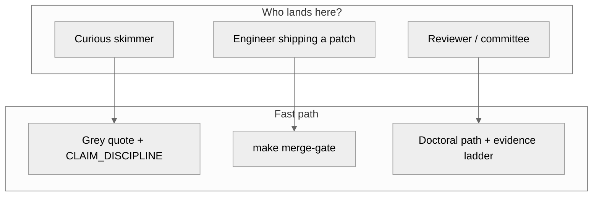
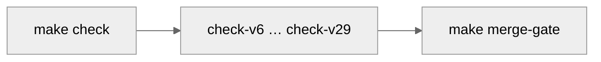
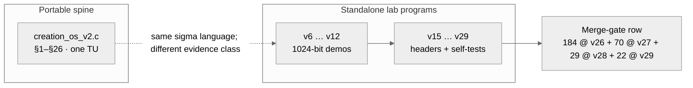
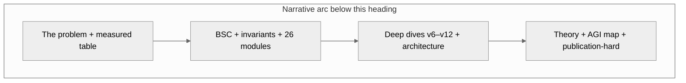
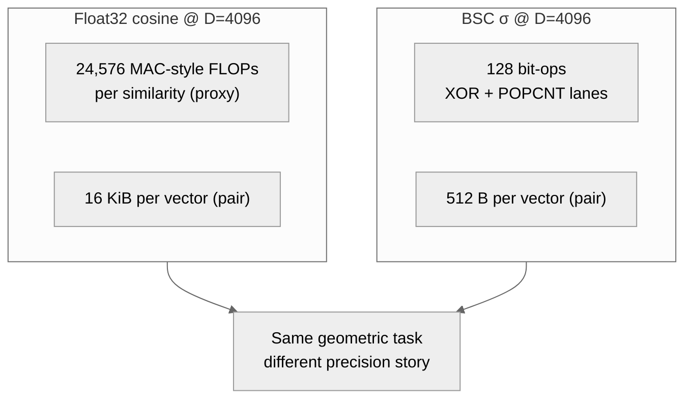
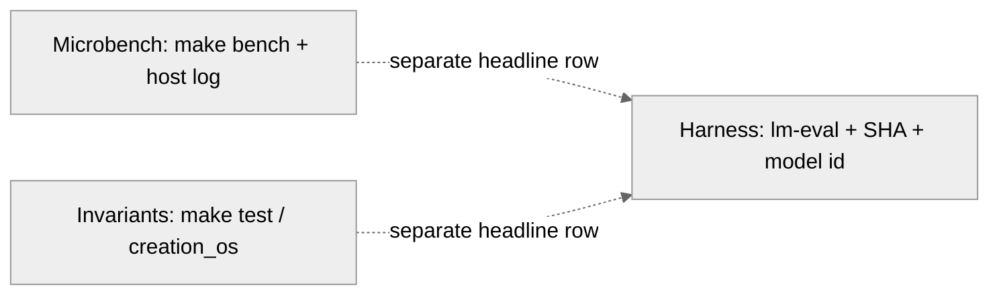

<p align="center">
  
</p>

<h1 align="center">Creation OS</h1>

<p align="center"><sub><strong>Orient first</strong> — what · where · when · why · how</sub></p>

<table align="center" width="100%" style="max-width:1100px;border-collapse:separate;border-spacing:0 10px;">
  <thead>
    <tr>
      <th align="left" width="18%" style="border-bottom:2px solid #94a3b8;padding:6px 10px;">What</th>
      <th align="left" width="20%" style="border-bottom:2px solid #94a3b8;padding:6px 10px;">Where</th>
      <th align="left" width="18%" style="border-bottom:2px solid #94a3b8;padding:6px 10px;">When</th>
      <th align="left" width="22%" style="border-bottom:2px solid #94a3b8;padding:6px 10px;">Why</th>
      <th align="left" width="22%" style="border-bottom:2px solid #94a3b8;padding:6px 10px;">How</th>
    </tr>
  </thead>
  <tbody>
    <tr>
      <td valign="top" style="padding:10px 12px;border-radius:10px 0 0 10px;background:linear-gradient(180deg,#f8fafc,#eef2ff);border:1px solid #e2e8f0;border-right:0;">Portable C11 “living kernel”: <code>BSC</code> geometry, <code>σ</code> as a first-class signal, deterministic <code>--self-test</code> programs — plus opt-in labs (OpenAI-shaped stub, suite stub, Apple <code>native_m4/</code>), <strong>σ/agent v33–v51</strong> (router, decompose, spec decode, MCP, FPGA/ASIC RTL, neuromorphic toy, threshold story, verification/red-team/cert/benchmark rollup, integration scaffold — tier-tagged in <a href="docs/WHAT_IS_REAL.md"><code>WHAT_IS_REAL</code></a>).</td>
      <td valign="top" style="padding:10px 12px;background:linear-gradient(180deg,#f8fafc,#eef2ff);border-top:1px solid #e2e8f0;border-bottom:1px solid #e2e8f0;">Canonical tree: <a href="https://github.com/spektre-labs/creation-os"><code>spektre-labs/creation-os</code></a>. Teaching spine: <a href="creation_os_v2.c"><code>creation_os_v2.c</code></a> + <a href="core/"><code>core/*.h</code></a>. Review map: <a href="docs/WHICH_FILE_TO_READ.md"><code>docs/WHICH_FILE_TO_READ.md</code></a>.</td>
      <td valign="top" style="padding:10px 12px;background:linear-gradient(180deg,#f8fafc,#eef2ff);border-top:1px solid #e2e8f0;border-bottom:1px solid #e2e8f0;">Before a PR / publish: <code>make merge-gate</code>. When touching a flagship slice: matching <code>make check-vN</code> + <code>./creation_os_vN --self-test</code>.</td>
      <td valign="top" style="padding:10px 12px;background:linear-gradient(180deg,#f8fafc,#eef2ff);border-top:1px solid #e2e8f0;border-bottom:1px solid #e2e8f0;">Keep evidence classes honest (lab demo vs harness vs product). Read <a href="docs/CLAIM_DISCIPLINE.md">CLAIM_DISCIPLINE</a> + tier tags in <a href="docs/WHAT_IS_REAL.md">WHAT_IS_REAL</a> before screenshotting a headline.</td>
      <td valign="top" style="padding:10px 12px;border-radius:0 10px 10px 0;background:linear-gradient(180deg,#f8fafc,#eef2ff);border:1px solid #e2e8f0;border-left:0;">Fastest truth path: clone → <code>make merge-gate</code> → spot-check <code>make check-v26 && ./creation_os_v26 --self-test</code> (expect <code>184/184 PASS</code>). Visual receipts index: <a href="docs/VISUAL_INDEX.md">VISUAL_INDEX</a>.</td>
    </tr>
  </tbody>
</table>

<p align="center">
  <a href="#contents"></a>
  <a href="#run-it-in-sixty-seconds"></a>
  <a href="docs/WHICH_FILE_TO_READ.md"></a>
  <a href="docs/VISUAL_INDEX.md"></a>
</p>

> **Reviewing this repo?** Read **[`docs/WHICH_FILE_TO_READ.md`](docs/WHICH_FILE_TO_READ.md)** first.

<p align="center">
  <strong>Coherence you can compile.</strong><br/>
  <sub>Binary Spatter Codes · σ as a first-class signal · portable C11 · no framework on the teaching kernel</sub><br/>
  <sub>Figures are first-class receipts too — palette + embedding rules live in <a href="docs/VISUAL_INDEX.md">VISUAL_INDEX</a>.</sub>
</p>

<p align="center"><sub><strong>Navigate:</strong> <a href="#contents">Contents</a> · <a href="#capability-layers">Capability layers</a> · <a href="#readme-scan-map-fig-09">Scan map (FIG 09)</a> · <a href="#run-it-in-sixty-seconds">Sixty seconds</a> · <a href="#sigma-labs-v31-v40">σ labs (v31–v51)</a> · <a href="#documentation-hub">Doc hub</a> · <a href="#publication-hard">Publication-hard</a></sub></p>

> **MCP product hook:** `creation_os_mcp` is an **MCP server** that exposes σ measurement + abstention helpers (`measure_sigma`, `should_abstain`, `sigma_report`) to **any MCP-capable client** — see `docs/MCP_SIGMA.md` and `config/claude_desktop_config.json` (copy the `mcpServers` block into your client; repo-local `.cursor/` is gitignored).

> **If you read nothing else:** a **C11 reference kernel** for **BSC** and a **coherence (σ) story** you can **build, run, and falsify**. Maintainer / CI bar is **`make merge-gate`** (`make check` + **`make check-v6` … `make check-v29`** — flagship v6–v29 only). **Optional σ labs (not merge-gate):** `make check-v31` · `check-v33` · `check-v34` · `check-v35` · `check-v39` · `check-v40` · `check-v41` · `check-v42` · `check-v43` · `check-v44` (alias `check-proxy`) · `check-v45` · `check-v46` · `check-v47` · `check-v48`; MCP (**v36**, `make check-mcp`); FPGA / formal (**v37**, `make formal-sby-v37` · `make synth-v37`); ASIC tile (**v38**, `make check-asic-tile` · `make librelane-v38`); neuromorphic toy (**v39**, `make check-crossbar-sim`); threshold story (**v40**, `make bench-v40-threshold`); test-time compute scaffold (**v41**, `make bench-v41-scaling` stub); self-play scaffold (**v42**, `make bench-v42-curve` stub); σ-guided distillation math (**v43**, `make bench-v43-distill` stub); σ-native inference proxy (**v44**, `make bench-v44-overhead` stub); σ-introspection lab (**v45**, `make bench-v45-paradox` stub); σ-optimized BitNet pipeline (**v46**, `make bench-v46-e2e` stub); verified-architecture lab (**v47**, `make verify` / `make check-v47`); σ-armored red-team lab (**v48**, `make red-team` / `make check-v48` / `make merge-gate-v48`); certification-grade assurance pack (**v49**, `make certify`: DO-178C-aligned docs + MC/DC driver + binary hygiene + trace checks — **not** FAA/EASA certification); **v50** final benchmark rollup (`make v50-benchmark`: `benchmarks/v50/FINAL_RESULTS.md` + explicit STUB JSON slots until an engine+dataset harness is pinned — see [docs/v50/FAQ_CRITICS.md](docs/v50/FAQ_CRITICS.md)); **v51** AGI-complete integration scaffold (`make check-v51`: six-phase cognitive loop + σ-gated agent + sandbox + ring memory; `scripts/v51/install.sh` is a safe **dry-run** — no network, no `/usr/local/bin` writes; `src/v51/ui/web.html` is a static σ-dashboard mock); **v53** σ-governed harness scaffold (`make check-v53`: σ-TAOR loop with 5 abstain outcomes + σ-triggered sub-agent dispatch + σ-prioritized compression + `creation.md` invariants loader; structural critique of the Claude Code harness, not a coding agent — see [docs/v53/POSITIONING.md](docs/v53/POSITIONING.md) and [docs/v53/paper_draft.md](docs/v53/paper_draft.md)). Full layer map: [docs/SIGMA_FULL_STACK.md](docs/SIGMA_FULL_STACK.md). Flagship **`./creation_os_v26 --self-test`** prints **184/184** internal consistency checks (**lab demo (C)** class — not an `lm-eval` harness row); **`./creation_os_v27 --self-test`** adds the **vocab / tokenizer scaffold** (**70** checks — still **lab demo (C)**); **`./creation_os_v28 --self-test`** adds an **LM integration shell** (**29** checks — **integration harness (C)**, not an in-process BitNet-2B forward); **`./creation_os_v29 --self-test`** adds a **v29 collapse harness** (**22** checks — mmap GGUF view + σ channels + XNOR toy + BitNet stub; tier tags in [docs/WHAT_IS_REAL.md](docs/WHAT_IS_REAL.md)). This is **not** a chat product, **not** an LM leaderboard dump, and **not** magic — read [**CLAIM_DISCIPLINE**](docs/CLAIM_DISCIPLINE.md) before you screenshot a table.

<table align="center">
  <tbody>
    <tr>
      <td align="center"><a href="https://github.com/spektre-labs/creation-os"></a></td>
      <td align="center"></td>
      <td align="center"></td>
    </tr>
    <tr>
      <td align="center" colspan="2"></td>
      <td align="center"><a href="docs/DOC_INDEX.md"></a></td>
    </tr>
  </tbody>
</table>

<p align="center"><sub>Figure palette &amp; SVG rules: <a href="docs/VISUAL_INDEX.md">docs/VISUAL_INDEX.md</a></sub></p>

<a id="capability-layers"></a>

## Capability layers (kernel → product): what is *real* here

This table answers the four stack questions **honestly** (tier discipline: [docs/WHAT_IS_REAL.md](docs/WHAT_IS_REAL.md), editorial law: [docs/CLAIM_DISCIPLINE.md](docs/CLAIM_DISCIPLINE.md)).

| Layer | Your question (short) | What exists *in this repo now* | Measured / gated | *Not* claimed as shipped “super-LLM / AGI product” |
|:--|:--|:--|:--|:--|
| **1 · Kernel / runtime** | New measurable advantages in **efficiency**, **determinism**, **memory discipline**, **special hardware paths**? | Portable C11 flagship programs + `native_m4/` lab (NEON range/parallel, optional Metal, SME sysctl probe, 64-byte `aligned_alloc` sizing helpers). | `make merge-gate` + `make bench` family + `make check-native-m4` / `./creation_os_native_m4 --self-test` + `./creation_os_native_m4 --bench …` + **`./creation_os_native_m4 --layers-report`** (machine facts). | Not a full OS scheduler story; not a datacenter GPU training runtime. SME/Metal are **opt-in** paths with honest SKIP lines when toolchains/libs are absent. |
| **2 · Model layer** | Real **weights**, **context behavior**, **tool use**, **multilingual**? | v28/v29 **integration harnesses** (GGUF mmap *view*, sampler/chat shell, σ toys, BitNet *stub* paths) — teaching and wiring, not a bundled frontier checkpoint. | Counts are `check-v28` / `check-v29` **self-tests** (tier-tagged), not `lm-eval` headline rows. | No “we ship GPT‑class weights in-tree”; multilingual/tooling breadth is **not** a repo-wide proof obligation. |
| **3 · System layer** | **Planning / retries / permissions / observability / rollback** in a real environment? | Deterministic checks + merge-gate discipline + optional local stubs (`creation_os_openai_stub`, suite lab) for *wiring demos*. | `make merge-gate`, reviewer scripts, explicit “not merge-gate” labels on labs. | Not a hosted multi-tenant agent platform with production IAM, SLO dashboards, or fleet rollback. |
| **4 · Product layer** | **API / SLA / docs / support / deployment / economics** as a service? | Strong docs surface + HTTP-shaped demos + AGPL licensing story. | Docs + local run receipts; **no** hosted SLA table in-tree. | Not a commercial “always-on” product contract; economics/support are **outside** what a reference kernel repo can truthfully “solve” in code. |

**Hardware-facing receipt (Darwin lab):** after `make native-m4`, run:

```
./creation_os_native_m4 --layers-report
```

That prints **uname**, **NEON compile flag presence**, **SME sysctl probe**, **buffer sizing example**, and **metallib path readability** — a small, *machine-local* kernel/runtime snapshot (still not a product SLA).

---

<a id="contents"></a>

## Contents

| I want to… | Jump to |
|:--|:--|
| **Run CI locally / ship a PR** | [Sixty seconds](#run-it-in-sixty-seconds) · [Build](#build) · [Contributing](CONTRIBUTING.md) |
| **Understand the product story** | [At a glance](#at-a-glance) · [Flagship table](#flagship-programs) · [LLM architecture (our stack)](#creation-os-llm-architecture-our-stack-and-tiers) · [The problem](#the-problem) · [Measured results](#measured-results-4096-dimensions-100k-trials) · [LLM stacks vs Creation OS](#llm-vs-creation-os-comparison) |
| **Not mis-cite a headline** | [Claim discipline](docs/CLAIM_DISCIPLINE.md) · [Common misreadings](docs/COMMON_MISREADINGS.md) · [Doctoral path](#doctoral-and-committee-read-path) |
| **Silicon / RTL / formal** | [RTL silicon mirror](docs/RTL_SILICON_MIRROR.md) · [Full stack map](docs/FULL_STACK_FORMAL_TO_SILICON.md) · [σ full stack (v33–v40)](docs/SIGMA_FULL_STACK.md) |
| **σ threshold / QEC analogy (theory)** | [docs/sigma_threshold_theorem.md](docs/sigma_threshold_theorem.md) · `make check-v40` · `make bench-v40-threshold` (stub until harness) |
| **What is “M” vs “P” here?** | [docs/WHAT_IS_REAL.md](docs/WHAT_IS_REAL.md) — always read before citing FPGA/ASIC/neuromorphic headlines |
| **Local OpenAI-shaped stub (tool wiring)** | [LOCAL_OPENAI_STUB.md](docs/LOCAL_OPENAI_STUB.md) · CORS + `OPTIONS` for local-origin browser checks · [`vscode-extension/setup_continue.md`](vscode-extension/setup_continue.md) |
| **Optional suite lab (honest scope)** | [SUITE_LAB.md](docs/SUITE_LAB.md) · `make standalone-suite-stub` · `./scripts/launch_suite.sh` (stub + static `suite_lab.html`; not merge-gate) |
| **Native M4 (hardware-first lab)** | `make check-native-m4` · `make bench-native-m4` · `./creation_os_native_m4 --layers-report` · NEON + GCD + optional Metal/SME in `native_m4/` |
| **v31 “purge lab” (optional upstream wrapper)** | [v31_README.md](docs/v31_README.md) · `make check-v31` · [WHAT_IS_REAL_v31.md](docs/WHAT_IS_REAL_v31.md) |
| **σ labs v33–v51 (router, MCP, RTL, ASIC, neuro, threshold, test-time compute, self-play, KD, proxy, introspection, BitNet σ, verification stack, red team, certification pack, benchmark rollup, integration scaffold)** | [σ lab table](#sigma-labs-v31-v40) · [SIGMA_FULL_STACK.md](docs/SIGMA_FULL_STACK.md) · [MCP_SIGMA.md](docs/MCP_SIGMA.md) |
| **“Full suite” expectations vs repo** | [FULL_LOCAL_SUITE.md](docs/FULL_LOCAL_SUITE.md) |
| **Multi-repo / canonical Git** | [REPOS_AND_ROLES](docs/REPOS_AND_ROLES.md) · [CANONICAL_GIT_REPOSITORY](docs/CANONICAL_GIT_REPOSITORY.md) |
| **Find the right doc** | [Documentation hub](#documentation-hub) · [DOC_INDEX](docs/DOC_INDEX.md) |
| **Agents / contributors / security** | [AGENTS.md](AGENTS.md) · [CONTRIBUTING.md](CONTRIBUTING.md) · [SECURITY.md](SECURITY.md) · [MAINTAINERS](docs/MAINTAINERS.md) |

**Long-form anchors (this page):** [Capability layers](#capability-layers) · [FIG 09 scan map](#readme-scan-map-fig-09) · [Doc hub](#documentation-hub) · [σ labs v31–v51](#sigma-labs-v31-v40) · [LLM vs Creation OS](#llm-vs-creation-os-comparison) · [BSC](#what-is-bsc) · [Invariants](#verified-invariants) · [26 modules](#26-modules) · [v6](#living-kernel-v6) · [v7](#hallucination-killer-v7) · [v9](#parameters-in-silicon-v9) · [v10](#the-real-mind-v10) · [v11](#the-matmul-free-mind-v11) · [v12](#the-tensor-mind-v12) · [v27 tokenizer](#v27-tokenizer) · [v28 LM integration](#v28-lm-integration) · [v29 collapse harness](#v29-collapse-harness) · [LLM architecture](#creation-os-llm-architecture-our-stack-and-tiers) · [Architecture](#architecture) · [Limitations](#limitations) · [Why this wins](#why-this-wins-where-it-matters-engineering-not-slogans) · [Theory](#theoretical-foundation) · [AGI map](#agi-map-how-this-file-relates-to-the-full-stack) · [Publication-hard](#publication-hard) · [License](#license)

<a id="readme-scan-map-fig-09"></a>

### Readme scan map (FIG 09)

<p align="center"></p>

<p align="center"><sub><strong>FIG 09</strong> — how this page is read: outcome first, then scannable tables and diagrams, then deep sections. SVG follows <code>prefers-color-scheme</code> for GitHub light/dark. Register and palette: <a href="docs/VISUAL_INDEX.md">VISUAL_INDEX</a>.</sub></p>

---

## At a glance



**Three sentences, one geometry:** attention-style similarity becomes **σ / Hamming / POPCOUNT** on packed hypervectors — one receipt language from **microbench** (`make bench`) through **native NEON** (`core/cos_neon_*.h`) and **deterministic `check-v6` … `check-v29` self-tests** (`creation_os_v6.c` … `creation_os_v29.c`). The teaching spine stays **one TU**: `creation_os_v2.c` + `core/*.h`, **stdlib + libm only**.

<p align="center">
  <a href="#agi-map-how-this-file-relates-to-the-full-stack" title="Planes A–C — AGI map section"></a><br/>
  <sub><strong>FIG 05 · Planes A–C</strong> (teaching · llama/MLX · native M4) — detail and receipts in <a href="docs/ANALYSIS.md">ANALYSIS.md</a> and <a href="#agi-map-how-this-file-relates-to-the-full-stack">AGI map</a> below.</sub>
</p>

| Quick visual (FIG) | What it is for |
|:--|:--|
| **03** [Evidence ladder](docs/assets/evidence-ladder.svg) | Where a **number** is allowed to sit (arithmetic → measured → harness / lab demo) — pairs with [CLAIM_DISCIPLINE](docs/CLAIM_DISCIPLINE.md); [rendered below](#publication-hard). |
| **06** [BSC primitives](docs/assets/bsc-primitives.svg) | XOR → MAJ → POPCOUNT / σ strip — same story as [What is BSC?](#what-is-bsc). |
| **07** [GEMM vs BSC bars](docs/assets/gemm-vs-bsc-memory-ops.svg) | **32×** / **192×** shape at D=4096 — same table as [Measured results](#measured-results-4096-dimensions-100k-trials). |

---

## Run it in sixty seconds



```bash
git clone https://github.com/spektre-labs/creation-os.git
cd creation-os
make merge-gate
# spot-check current head:
make check-v26 && ./creation_os_v26 --self-test   # expect 184/184 PASS
make check-v27 && ./creation_os_v27 --self-test   # expect 70/70 PASS (tokenizer scaffold)
make check-v28 && ./creation_os_v28 --self-test   # expect 29/29 PASS (LM integration shell)
make check-v29 && ./creation_os_v29 --self-test   # expect 22/22 PASS (v29 collapse harness)
```

*Success looks like:* `184/184 PASS` from `./creation_os_v26 --self-test` after `make check-v26` — anything else is a **merge gate** failure, not a “soft warning”. **`make merge-gate`** also runs **`check-v27`**, **`check-v28`**, and **`check-v29`**; expect **`70/70 PASS`** / **`29/29 PASS`** / **`22/22 PASS`** from **`./creation_os_v27 --self-test`** / **`./creation_os_v28 --self-test`** / **`./creation_os_v29 --self-test`**.

**σ / agent / silicon labs (optional, not `merge-gate`):** after the gate is green, spot-check any lab you touched — see [σ lab table (v31–v51)](#sigma-labs-v31-v40) and [docs/WHAT_IS_REAL.md](docs/WHAT_IS_REAL.md) for tier tags.

**Plain-language orientation:** [docs/PARADIGM_SNAPSHOT_FOR_DRIVE_BY_READERS.md](docs/PARADIGM_SNAPSHOT_FOR_DRIVE_BY_READERS.md) · **Misreadings:** [docs/COMMON_MISREADINGS.md](docs/COMMON_MISREADINGS.md)

**Smallest demo (bootstrap only, not the merge gate):**

```
cc -O2 -I. -o creation_os creation_os_v2.c -lm
./creation_os
```

**Optional lab (not the merge gate):** OpenAI-shaped loopback stub with **minimal CORS** so a page on another `127.0.0.1` port can POST `/v1/chat/completions`; plus a tiny **suite lab** CLI (`creation_os_suite_stub`) and static page — see [docs/LOCAL_OPENAI_STUB.md](docs/LOCAL_OPENAI_STUB.md) and [docs/SUITE_LAB.md](docs/SUITE_LAB.md). Quick path: `make standalone-openai-stub && make standalone-suite-stub`, then `./scripts/launch_suite.sh`. This does **not** load weights or replace an IDE; scope boundaries: [docs/FULL_LOCAL_SUITE.md](docs/FULL_LOCAL_SUITE.md).

**Native M4 lab (Apple-only, not the merge gate):** hardware-first helpers (aligned buffers, NEON popcount logits shaping, optional Metal dispatch, GCD-parallel NEON for large vocabs; CLI includes `--warmup`, `--scalar`, `--metal`, `--buffer-sizes`). Build/run:

```
make check-native-m4
./creation_os_native_m4 --help
./creation_os_native_m4 --layers-report
./creation_os_native_m4 --buffer-sizes --vocab 65537
./creation_os_native_m4 --bench --vocab 65536 --iters 200 --warmup 5 --scalar
./creation_os_native_m4 --bench --vocab 65536 --iters 200 --parallel --metal
```

Metal and SME are intentionally **opt-in** and guarded: `native_m4/` is where those kernels live, but claims remain tier-tagged per [docs/WHAT_IS_REAL.md](docs/WHAT_IS_REAL.md) until they have archived receipts.

**Metal compile (optional, Darwin):** `make metallib-m4` produces `native_m4/creation_os_lw.metallib`. You can override load path with `CREATION_OS_METALLIB=/abs/path/creation_os_lw.metallib`.

**v31 “purge lab” (optional, not the merge gate):** a POSIX-first direction to **wrap upstream BitNet inference** instead of rewriting kernels, while keeping σ-telemetry honest. Start here: [docs/v31_README.md](docs/v31_README.md). Verify math self-test with `make check-v31`.

**Primary reference:** one file ([`creation_os_v2.c`](creation_os_v2.c)), **~1246 lines**, **26 modules** (§1–§26), **4096-bit** `COS_D` geometry — any host with a C11 compiler + libm.

---

## Flagship programs

Each `creation_os_vN.c` is a **separate** single-file program (v27 links tokenizer helpers; v28 links import/nn/server helpers; v29 links GGUF mmap view + σ + XNOR + BitNet stub). Counts are **`--self-test` checks** for that binary. Use full targets, e.g. `make check-v26`, `make check-v27`, `make check-v28`, or `make check-v29`.

| Ver | File | One-line hook | `make` | Checks |
|:---:|:--|:--|:--|--:|
| v6 | [`creation_os_v6.c`](creation_os_v6.c) | σ–K–L–S + M01–M18 | `check-v6` | 30 |
| v7 | [`creation_os_v7.c`](creation_os_v7.c) | + M19–M23 detectors | `check-v7` | 35 |
| v9 | [`creation_os_v9.c`](creation_os_v9.c) | + M24–M29 silicon toys | `check-v9` | 41 |
| v10 | [`creation_os_v10.c`](creation_os_v10.c) | + M30–M33 routing / abstention | `check-v10` | 46 |
| v11 | [`creation_os_v11.c`](creation_os_v11.c) | + M34 matmul-free LM toy | `check-v11` | 49 |
| v12 | [`creation_os_v12.c`](creation_os_v12.c) | + M35–M37 tensor schematics | `check-v12` | 52 |
| v15 | [`creation_os_v15.c`](creation_os_v15.c) | + M38–M40 scale discipline | `check-v15` | 58 |
| v16 | [`creation_os_v16.c`](creation_os_v16.c) | + M41–M44 literature toys | `check-v16` | 66 |
| v20 | [`creation_os_v20.c`](creation_os_v20.c) | + M45–M64 ship pillars | `check-v20` | 86 |
| v21 | [`creation_os_v21.c`](creation_os_v21.c) | + M65–M76 sovereign stack | `check-v21` | 99 |
| v22 | [`creation_os_v22.c`](creation_os_v22.c) | + M77–M96 insight stack | `check-v22` | 120 |
| v23 | [`creation_os_v23.c`](creation_os_v23.c) | + M97–M116 agent affordances | `check-v23` | 141 |
| v24 | [`creation_os_v24.c`](creation_os_v24.c) | + M117–M136 arXiv echoes | `check-v24` | 162 |
| v25 | [`creation_os_v25.c`](creation_os_v25.c) | + M137–M156 enterprise ledger | `check-v25` | 183 |
| v26 | [`creation_os_v26.c`](creation_os_v26.c) | + M157–M176 Global 500 echo index | `check-v26` | **184** |
| v27 | [`creation_os_v27.c`](creation_os_v27.c) | + M177–M186 vocab / tokenizer / mmap COSB / inference trace | `check-v27` | **70** |
| v28 | [`creation_os_v28.c`](creation_os_v28.c) | + M190–M199 GGUF + mmap + spawn + tokenizer probe + sampler + chat + JSON escape + HTTP + σ toys | `check-v28` | **29** |
| v29 | [`creation_os_v29.c`](creation_os_v29.c) | + mmap GGUF loader + eight σ channels + XNOR attention toy + BitNet forward stub | `check-v29` | **22** |



**Evidence class:** v6–v27 = **lab demo (C)** unless you add external harness / silicon proof; v28 is an **integration harness (C)**; v29 is a **collapse harness (C)** with explicit tier tags in [docs/WHAT_IS_REAL.md](docs/WHAT_IS_REAL.md) — [docs/CLAIM_DISCIPLINE.md](docs/CLAIM_DISCIPLINE.md). **Per-version narrative:** [docs/FEATURES_AND_STANDALONE_BUILDS.md](docs/FEATURES_AND_STANDALONE_BUILDS.md) + headers inside each `creation_os_v*.c`. **Lineage at a glance:** [kernel-lineage diagram](docs/assets/kernel-lineage-evidence.svg) (also under [Doctoral path](#doctoral-and-committee-read-path)).

**Frontier complement:** AArch64 **4096-bit** σ / Hamming / MAJ / XOR in `core/cos_neon_*.h` — bit-parallel similarity; not a substitute for published LM harness rows.

**Still lost?** [docs/PARADIGM_SNAPSHOT_FOR_DRIVE_BY_READERS.md](docs/PARADIGM_SNAPSHOT_FOR_DRIVE_BY_READERS.md) · [docs/COMMON_MISREADINGS.md](docs/COMMON_MISREADINGS.md) · [docs/VISUAL_INDEX.md](docs/VISUAL_INDEX.md)

<a id="sigma-labs-v31-v40"></a>

### σ labs (v31–v51, optional)

These milestones extend the portable spine with **agent routing**, **MCP**, **RTL / ASIC hooks**, a **neuromorphic toy**, a **σ-threshold / QEC analogy**, **σ-guided test-time compute scaffolding**, **σ-guided self-play scaffolding**, **σ-guided knowledge distillation (loss contracts + curriculum + ensemble + calibration)**, a **σ-native inference proxy** (`creation_os_proxy`: OpenAI-shaped loopback HTTP + per-token σ demo streaming), **σ-introspection** (`creation_os_v45`: calibration gap + doubt reward + internal-probe stub), a **σ-optimized BitNet-facing pipeline** (`creation_os_v46`: fast σ-from-logits + SIMD reductions + adaptive quant policy + `benchmarks/v46/SPEED_TABLE.md`), a **verification / claims-hygiene lab** (`creation_os_v47` + `make verify`: ACSL contracts, extended SymbiYosys depth, Hypothesis properties, ZK-σ API stub), a **σ-armored red-team lab** (`creation_os_v48`: σ-pattern anomaly + σ-gated sandbox + fail-closed defense stack + `make red-team` / `make merge-gate-v48`), a **certification-grade assurance pack** (`make certify`: DO-178C-aligned documentation + MC/DC driver + binary hygiene + trace automation — **not** FAA/EASA certification), and a **v50 benchmark rollup harness** (`make v50-benchmark`: `benchmarks/v50/FINAL_RESULTS.md` + critic FAQ + Reddit draft — Category 1–3 eval JSON slots are **explicit STUBs** until a pinned engine+dataset harness exists) — all **outside** `make merge-gate`. Tier tags (“M” vs “P”) live in [docs/WHAT_IS_REAL.md](docs/WHAT_IS_REAL.md); the cross-layer map is [docs/SIGMA_FULL_STACK.md](docs/SIGMA_FULL_STACK.md).

| Milestone | Focus | Verify (representative) |
|:--|:--|:--|
| **v31** | Upstream BitNet “purge lab” (wrapper direction) | `make check-v31` · [docs/v31_README.md](docs/v31_README.md) |
| **v33** | Agent runtime — σ-routed SLM/LLM fallback (router, schema, registry) | `make check-v33` · `config/routing.json`, `config/tools/*.schema.json` |
| **v34** | Algorithmic σ — aleatoric / epistemic decomposition | `make check-v34` · `src/sigma/decompose.c` |
| **v35** | Inference — σ-guided speculative decode hooks | `make check-v35` · `src/v35/spec_decode.c` |
| **v36** | MCP σ server (`creation_os_mcp`) | `make check-mcp` · [docs/MCP_SIGMA.md](docs/MCP_SIGMA.md) |
| **v37** | σ FPGA pipeline (SystemVerilog + SymbiYosys / Yosys) | `make formal-sby-v37` · `make synth-v37` · `hdl/v37/` |
| **v38** | Post-Efabless ASIC tile + LibreLane driver | `make check-asic-tile` · `make librelane-v38` · `hdl/asic/` |
| **v39** | Memristor / crossbar mapping doc + RTL sim | `make check-v39` · `make check-crossbar-sim` · [docs/neuromorphic/memristor_mapping.md](docs/neuromorphic/memristor_mapping.md) |
| **v40** | Independence + syndrome decoder + threshold note | `make check-v40` · [docs/sigma_threshold_theorem.md](docs/sigma_threshold_theorem.md) · `make bench-v40-threshold` |
| **v41** | σ-guided test-time compute (budget forcing, adaptive N, toy reasoning tree, verify hooks) | `make check-v41` · [docs/v41_test_time_compute.md](docs/v41_test_time_compute.md) · `make bench-v41-scaling` (stub) |
| **v42** | σ-guided self-play (challenger/solver, σ-shaped reward, replay sampling, curriculum hook) | `make check-v42` · [docs/v42_self_play.md](docs/v42_self_play.md) · `make bench-v42-curve` (stub) |
| **v43** | σ-guided knowledge distillation (σ-weighted KL, progressive stages, multi-teacher σ ensemble, σ calibration loss) | `make check-v43` · [docs/v43_sigma_distill.md](docs/v43_sigma_distill.md) · `make bench-v43-distill` (stub) |
| **v44** | σ-native inference proxy (stub engine → per-token σ → syndrome actions → OpenAI-shaped HTTP + demo SSE) | `make check-v44` · [docs/v44_inference_proxy.md](docs/v44_inference_proxy.md) · `make bench-v44-overhead` (stub) |
| **v45** | σ-introspection (calibration gap, doubt-reward RLVR scalar, internal σ probe stub, paradox harness stub) | `make check-v45` · [docs/v45_introspection.md](docs/v45_introspection.md) · `make bench-v45-paradox` (stub) |
| **v46** | σ-optimized BitNet pipeline (fast σ-from-logits, SIMD reductions, adaptive quant policy, SPEED_TABLE scaffold) | `make check-v46` · [docs/v46_bitnet_sigma.md](docs/v46_bitnet_sigma.md) · [benchmarks/v46/SPEED_TABLE.md](benchmarks/v46/SPEED_TABLE.md) · `make bench-v46-e2e` (stub) |
| **v47** | Verified-architecture lab (ACSL σ-kernel, extended `sby`, Hypothesis properties, ZK-σ stub, `make verify`) | `make check-v47` · `make verify` · [docs/v47/INVARIANT_CHAIN.md](docs/v47/INVARIANT_CHAIN.md) |
| **v48** | σ-armored red-team lab (σ-anomaly, σ-gated sandbox, 7-layer fail-closed defenses, harnesses) | `make check-v48` · `make red-team` · [docs/v48/RED_TEAM_REPORT.md](docs/v48/RED_TEAM_REPORT.md) · `make merge-gate-v48` (optional heavy) |
| **v49** | Certification-grade assurance pack (DO-178C-aligned artifacts, MC/DC driver, binary audit, trace checks) | `make certify` · [docs/v49/certification/README.md](docs/v49/certification/README.md) |
| **v50** | Final benchmark rollup (`FINAL_RESULTS.md`, σ-metric table slots, verification log capture, critic FAQ) | `make v50-benchmark` · [benchmarks/v50/FINAL_RESULTS.md](benchmarks/v50/FINAL_RESULTS.md) · [docs/v50/FAQ_CRITICS.md](docs/v50/FAQ_CRITICS.md) |
| **v51** | AGI-complete integration scaffold (cognitive loop + σ-gated agent + sandbox + ring memory + static σ-dashboard mock + dry-run installer + full-stack diagram) | `make check-v51` · [docs/v51/ARCHITECTURE.md](docs/v51/ARCHITECTURE.md) · [src/v51/ui/web.html](src/v51/ui/web.html) · `bash scripts/v51/install.sh` (dry-run) |
| **v53** | σ-governed harness scaffold (σ-TAOR loop with 5 abstain outcomes + σ-triggered sub-agent dispatch + σ-prioritized compression + `creation.md` invariants loader + position paper vs Claude Code harness) | `make check-v53` · [docs/v53/ARCHITECTURE.md](docs/v53/ARCHITECTURE.md) · [docs/v53/POSITIONING.md](docs/v53/POSITIONING.md) · [docs/v53/paper_draft.md](docs/v53/paper_draft.md) · [creation.md](creation.md) |

There is **no** `creation_os_v36.c` merge-gate row: **v36** is the **MCP** binary; **v37** / **v38** are primarily **HDL + scripts** (see Makefile `help`).

---

<a id="documentation-hub"></a>

## Documentation hub

**Reading UX (patterns that consistently score well):** lead with the reader’s **job-to-be-done**; use **inverted pyramid** (outcome before history); **chunk** dense lists into small tables; **progressive disclosure** (`<details>`) for power users; keep **one canonical index** so the mental map never forks ([docs/DOC_INDEX.md](docs/DOC_INDEX.md)). *Pointers, not a second README:* [Nielsen Norman — inverted pyramid](https://www.nngroup.com/articles/inverted-pyramid/), [progressive disclosure](https://www.nngroup.com/articles/progressive-disclosure/), [how users read on the web](https://www.nngroup.com/articles/how-users-read-on-the-web/).

**Figures (stable IDs — cite the SVG + commit):** full register in [docs/VISUAL_INDEX.md](docs/VISUAL_INDEX.md). On this README page, the highest-signal assets are:

| FIG | File | Where it shows up here |
|:---:|:--|:--|
| **03** | [evidence-ladder.svg](docs/assets/evidence-ladder.svg) | [Publication-hard](#publication-hard) |
| **04** | [kernel-lineage-evidence.svg](docs/assets/kernel-lineage-evidence.svg) | [Doctoral path](#doctoral-and-committee-read-path) |
| **05** | [planes-abc.svg](docs/assets/planes-abc.svg) | [At a glance](#at-a-glance) · [AGI map](#agi-map-how-this-file-relates-to-the-full-stack) (single render; link under AGI map) |
| **06** | [bsc-primitives.svg](docs/assets/bsc-primitives.svg) | [What is BSC?](#what-is-bsc) |
| **07** | [gemm-vs-bsc-memory-ops.svg](docs/assets/gemm-vs-bsc-memory-ops.svg) | [Measured results](#measured-results-4096-dimensions-100k-trials) |
| **08** | [architecture-stack.svg](docs/assets/architecture-stack.svg) | [Architecture](#architecture) |
| **09** | [readme-scan-map.svg](docs/assets/readme-scan-map.svg) | [Contents / scan map](#readme-scan-map-fig-09) |

### Tier 1 — default paths

| You need… | Open |
|:--|:--|
| Full map of markdown | [docs/DOC_INDEX.md](docs/DOC_INDEX.md) |
| Evidence / headline rules | [docs/CLAIM_DISCIPLINE.md](docs/CLAIM_DISCIPLINE.md) |
| Mis-readings we fixed | [docs/COMMON_MISREADINGS.md](docs/COMMON_MISREADINGS.md) |
| Binaries & CI matrix | [docs/FEATURES_AND_STANDALONE_BUILDS.md](docs/FEATURES_AND_STANDALONE_BUILDS.md) |
| Plain-language snapshot | [docs/PARADIGM_SNAPSHOT_FOR_DRIVE_BY_READERS.md](docs/PARADIGM_SNAPSHOT_FOR_DRIVE_BY_READERS.md) |
| Figure & SVG rules | [docs/VISUAL_INDEX.md](docs/VISUAL_INDEX.md) |
| Push hygiene | [docs/publish_checklist_creation_os.md](docs/publish_checklist_creation_os.md) |

### Tier 2 — benchmarks, thesis, industry

| Topic | Doc |
|:--|:--|
| Analysis / Planes A–C | [docs/ANALYSIS.md](docs/ANALYSIS.md) |
| `make bench` / §7 protocol | [docs/BENCHMARK_PROTOCOL.md](docs/BENCHMARK_PROTOCOL.md) |
| §1–§26 evidence index | [docs/MODULE_EVIDENCE_INDEX.md](docs/MODULE_EVIDENCE_INDEX.md) |
| Thesis spine (RQ, threats, contributions) | [docs/RESEARCH_AND_THESIS_ARCHITECTURE.md](docs/RESEARCH_AND_THESIS_ARCHITECTURE.md) · [Doctoral path below](#doctoral-and-committee-read-path) |
| Repro bundle for published numbers | [docs/REPRO_BUNDLE_TEMPLATE.md](docs/REPRO_BUNDLE_TEMPLATE.md) |
| HDC/VSA ↔ engineering | [docs/HDC_VSA_ENGINEERING_SUPERIORITY.md](docs/HDC_VSA_ENGINEERING_SUPERIORITY.md) |
| Industry ↔ receipts | [docs/COHERENCE_RECEIPTS_INDUSTRY_ALIGNMENT.md](docs/COHERENCE_RECEIPTS_INDUSTRY_ALIGNMENT.md) |
| Glossary | [docs/GLOSSARY.md](docs/GLOSSARY.md) |

### Tier 3 — silicon, remotes, governance

| Topic | Doc |
|:--|:--|
| RTL mirror (SV, Chisel, Yosys, Rust, formal) | [docs/RTL_SILICON_MIRROR.md](docs/RTL_SILICON_MIRROR.md) |
| Formalism → silicon | [docs/FULL_STACK_FORMAL_TO_SILICON.md](docs/FULL_STACK_FORMAL_TO_SILICON.md) |
| σ stack map (v33–v51 labs + HDL) | [docs/SIGMA_FULL_STACK.md](docs/SIGMA_FULL_STACK.md) · [σ lab table](#sigma-labs-v31-v40) |
| MCP σ server | [docs/MCP_SIGMA.md](docs/MCP_SIGMA.md) · `make check-mcp` |
| Neuromorphic / memristor (mapping + sim) | [docs/neuromorphic/memristor_mapping.md](docs/neuromorphic/memristor_mapping.md) · `make check-crossbar-sim` |
| Git remotes | [docs/CANONICAL_GIT_REPOSITORY.md](docs/CANONICAL_GIT_REPOSITORY.md) |
| Contributing · security · agent rules | [CONTRIBUTING.md](CONTRIBUTING.md) · [SECURITY.md](SECURITY.md) · [AGENTS.md](AGENTS.md) |
| Maintainers + merge gate | [docs/MAINTAINERS.md](docs/MAINTAINERS.md) |
| English-only policy | [docs/LANGUAGE_POLICY.md](docs/LANGUAGE_POLICY.md) |
| Citation metadata | [CITATION.cff](CITATION.cff) · [docs/CITATION.bib](docs/CITATION.bib) |

<details>
<summary><strong>Kernel & bench shortcuts</strong> (v6–v12 docs; v15–v26 in-file headers; NEON; HV)</summary>

| Track | Doc · command |
|:--|:--|
| v6 | [LIVING_KERNEL_V6.md](docs/LIVING_KERNEL_V6.md) · `make check-v6` |
| v7 | [HALLUCINATION_KILLER_V7.md](docs/HALLUCINATION_KILLER_V7.md) · `make check-v7` |
| v9 | [PARAMETERS_IN_SILICON_V9.md](docs/PARAMETERS_IN_SILICON_V9.md) · `make check-v9` |
| v10 | [THE_REAL_MIND_V10.md](docs/THE_REAL_MIND_V10.md) · `make check-v10` |
| v11 | [THE_MATMUL_FREE_MIND_V11.md](docs/THE_MATMUL_FREE_MIND_V11.md) · `make check-v11` |
| v12 | [THE_TENSOR_MIND_V12.md](docs/THE_TENSOR_MIND_V12.md) · `make check-v12` |
| v27 | [VOCAB_PIPELINE_V27.md](docs/VOCAB_PIPELINE_V27.md) · `make check-v27` · `make bench-tokenizer-v27` · `make bench-v27-all` |
| v28 | `Dockerfile` · `benchmarks/lm_eval.sh` · `benchmarks/hallucination_reduction.md` · `make check-v28` |
| v29 | `docs/WHAT_IS_REAL.md` · `config/sigma_thresholds.json` · `hdl/synthesis/xnor_binding_4096.sv` · `make check-v29` |
| v15–v26 | Headers in `creation_os_v15.c` … `creation_os_v26.c` · `make check-v15` … `make check-v26` |
| NEON coherence | [NATIVE_COHERENCE_NEON.md](docs/NATIVE_COHERENCE_NEON.md) · `make bench-coherence` |
| HV parliament | [HYPERVECTOR_PARLIAMENT_AND_RETRIEVAL.md](docs/HYPERVECTOR_PARLIAMENT_AND_RETRIEVAL.md) · `make bench-agi-gate` |

RTL tooling: `make formal-rtl-lint` · `make stack-ultimate` · `make rust-iron-lint`.

</details>

<details>
<summary><strong>Pre-flight & editor tooling</strong></summary>

| | |
|:--|:--|
| Adversarial review | [docs/ADVERSARIAL_REVIEW_CHECKLIST.md](docs/ADVERSARIAL_REVIEW_CHECKLIST.md) |
| External evidence positioning | [docs/EXTERNAL_EVIDENCE_AND_POSITIONING.md](docs/EXTERNAL_EVIDENCE_AND_POSITIONING.md) |
| Cursor briefing / integration | [docs/cursor_briefing_creation_os.md](docs/cursor_briefing_creation_os.md) · [docs/cursor_integration_creation_os.md](docs/cursor_integration_creation_os.md) |

</details>

---

## Doctoral and committee read path

Read **in order** once before citing any number or narrative title from this tree:

1. [docs/CLAIM_DISCIPLINE.md](docs/CLAIM_DISCIPLINE.md) — evidence classes, forbidden merges, falsifiers for the portable core.  
2. [docs/RESEARCH_AND_THESIS_ARCHITECTURE.md](docs/RESEARCH_AND_THESIS_ARCHITECTURE.md) — RQ1–RQ4, contributions C1–C6, threats to validity, thesis chapter outline, pre-defense gates.  
3. [docs/REPRO_BUNDLE_TEMPLATE.md](docs/REPRO_BUNDLE_TEMPLATE.md) — minimum metadata when a metric leaves the lab.  
4. [docs/FEATURES_AND_STANDALONE_BUILDS.md](docs/FEATURES_AND_STANDALONE_BUILDS.md) — which binary is which (`creation_os` vs `creation_os_v6` … `v12`), self-test counts, CI.  
5. [docs/MODULE_EVIDENCE_INDEX.md](docs/MODULE_EVIDENCE_INDEX.md) — §1–§26 in `creation_os_v2.c`: evidence class per section before you cite a module headline.  
6. Scoped kernel docs for any line you cite from v6–v12 (and v15–v26 scoped headers): [LIVING_KERNEL_V6.md](docs/LIVING_KERNEL_V6.md), [HALLUCINATION_KILLER_V7.md](docs/HALLUCINATION_KILLER_V7.md), [PARAMETERS_IN_SILICON_V9.md](docs/PARAMETERS_IN_SILICON_V9.md), [THE_REAL_MIND_V10.md](docs/THE_REAL_MIND_V10.md), [THE_MATMUL_FREE_MIND_V11.md](docs/THE_MATMUL_FREE_MIND_V11.md), [THE_TENSOR_MIND_V12.md](docs/THE_TENSOR_MIND_V12.md); v15–v26 discipline, pillars, sovereign stack, insight stack, AGI affordances, arXiv echoes, enterprise pain ledger, and Global 500 echo orbit live in `creation_os_v15.c` … `creation_os_v26.c` and **CLAIM_DISCIPLINE**.  
7. [docs/ADVERSARIAL_REVIEW_CHECKLIST.md](docs/ADVERSARIAL_REVIEW_CHECKLIST.md) — hostile review simulation before submission.

| Artifact | Epistemic role | Evidence class for new claims |
|:--|:--|:--|
| `creation_os_v2.c` + `make test` / `make bench` | Portable proof + microbench | Invariant / arithmetic / measured (as documented) |
| `creation_os_v6.c` … `creation_os_v12.c` + `make check-v*` | **Extended lab demos** (narrative σ scaffolding, extra modules) | **Lab demo (C)** only — internal `self_test` consistency, not harness rows, tape-out, trained LM reproduction, or quantum hardware |

**Rule for dissertations:** treat v6–v12 as **separate appendices** with their own evidence-class headers; do not fold their toy outputs into the same tables as §7 throughput without an explicit wall (see **CLAIM_DISCIPLINE** §1).

<p align="center"></p>
<p align="center"><sub><strong>FIG 04</strong> — portable proof vs extended lab demos (evidence-class guardrail). <a href="docs/VISUAL_INDEX.md">VISUAL_INDEX</a>.</sub></p>

---

## Product repository

**[spektre-labs/creation-os](https://github.com/spektre-labs/creation-os)** — this tree is the portable kernel, `make test` / `make bench`, CI, and engineering docs. **Where this sits in the wider Spektre map:** [docs/REPOS_AND_ROLES.md](docs/REPOS_AND_ROLES.md). **Push hygiene:** [docs/publish_checklist_creation_os.md](docs/publish_checklist_creation_os.md).



---

## The problem



Modern AI computes similarity between two 4096-dimensional representations using 24,576 floating-point operations (multiply-accumulate for cosine similarity).

BSC computes the same measurement using 128 bit operations (64 XOR + 64 POPCNT).

That gap is structural: it changes **who can run the inner loop** of similarity scoring (CPU vs GPU), **how much RAM** you pay per stored representation, and **how often** you must invoke a large GEMM-backed forward pass when you only needed a distance check. Creation OS keeps that trade-off **explicit and measured** (`make bench`, §7) instead of hiding it inside a framework default.

## Measured results (4096 dimensions, 100K trials)

| Metric | GEMM (float32 cosine) | BSC (XOR + POPCNT) | Ratio |
|:--|--:|--:|--:|
| Memory per vector | 16,384 bytes | 512 bytes | **32×** |
| Ops per similarity | 24,576 FLOPs | 128 bit ops | **192×** |
| Throughput | ~227K trials/sec | ~109M trials/sec | **~480×** |

<p align="center"></p>
<p align="center"><sub><strong>FIG 07</strong> — schematic ratios for the README §7 / <code>make bench</code> story. <a href="docs/VISUAL_INDEX.md">VISUAL_INDEX</a>.</sub></p>

**Note:** Float32 cosine and BSC σ operate at different precision levels. This benchmark measures computational cost for the same geometric task (distance between representations), not bitwise equivalence of the results.

Throughput figures are host-dependent; run `make bench` (or §7 inside `./creation_os`) to reproduce on your machine.

**Reviewer-proof interpretation (read before citing the table):**

1. **Ops and RAM ratios** follow from the stated encodings (`float32` vs 64×64-bit words at D=4096). Any implementation that counts the same inner loops must recover the same **192×** ops and **32×** memory story *or* disclose a different problem definition — these are not lucky constants from one laptop.
2. **Throughput ratio** is a **measured microbench**; archive `make bench` stdout, the exact compiler line, and `uname -m` whenever you place it beside a peer-reviewed or vendor throughput figure.
3. **Task equivalence** is geometric similarity in representation space, not bitwise equality between float cosine and σ — the **Limitations** section is part of the claim, not a disclaimer sticker.
4. **Falsifiers** for the algebra shipped here: a reproducible run where self-distance is non-zero, Noether XOR-sum drifts without the asymmetric interaction the toy allows, or documented MAJ bounds failing under fixed seeds — any of these would break the “one file, one geometry” story.
5. **Evidence ladder:** this table is **microbench / lab** class. Do not merge it with harness MMLU, ARC, or chat-quality rows in a single headline — see **[docs/CLAIM_DISCIPLINE.md](docs/CLAIM_DISCIPLINE.md)** and **[docs/ANALYSIS.md](docs/ANALYSIS.md)** (*Evaluation modes*).

---

<a id="llm-vs-creation-os-comparison"></a>

## Traditional LLM stacks vs Creation OS (bounded engineering comparison)

This section answers a professional question: **where does a bit-geometry / σ-first stack legitimately beat a typical “large transformer + framework + runtime” path**, and where does it **not** try to compete? The bar is not louder marketing — it is **separate scoreboards**, **named evidence classes**, and **falsifiers** you can run locally ([CLAIM_DISCIPLINE](docs/CLAIM_DISCIPLINE.md)).

### Two scoreboards (do not merge them)

| Scoreboard | Question it answers | Typical artifact | Creation OS anchor in this tree |
|:--|:--|:--|:--|
| **Generative quality / task accuracy** | Does the model solve benchmarks and user tasks at frontier level? | `lm-eval` JSON, human eval, product metrics | **Not claimed** by `creation_os_v2.c` or the Oracle/JEPA toys alone — see [Limitations](#limitations) |
| **Geometric inner loop + memory + audit** | For a **fixed** representation width, what does *similarity*, *storage*, and *discrete checking* cost? | GEMM cosine vs packed HV distance | **Measured + arithmetic** — [Measured results](#measured-results-4096-dimensions-100k-trials), `make bench`, invariants |

**Professional superiority (the defensible kind)** is about **not mixing those scoreboards in one sentence**, shipping **receipts** for the second, and wiring the first only when a harness row exists — [ANALYSIS](docs/ANALYSIS.md) (*Evaluation modes*), [EXTERNAL_EVIDENCE_AND_POSITIONING](docs/EXTERNAL_EVIDENCE_AND_POSITIONING.md).

### Side-by-side: systems properties

| Dimension | Typical frontier LLM stack | Creation OS map (this README + Planes A–C in ANALYSIS) | Why the comparison is fair / bounded |
|:--|:--|:--|:--|
| **Primary inner product** | FP/BF16 matmuls + softmax attention over learned embeddings | **XOR + POPCOUNT / σ** on packed hypervectors for the *same geometric “who is close to whom” job* at stated `D` | Same *task class* (distance / coherence), **different precision** — note on [Measured results](#measured-results-4096-dimensions-100k-trials) |
| **Memory per stored vector (4096-d task shape)** | `2 × D × 4` bytes for FP32 pair participation in cosine-style scoring | **512 B** for the packed layout used here | **Arithmetic** from declared encodings |
| **Ops proxy per similarity (stated model)** | ~`6D` multiply-add style FLOPs for cosine (as documented in this README) | **128 bit-ops** (64 XOR + 64 POPCOUNT lanes at `D=4096`) | **Arithmetic** op-count story; throughput is **measured** |
| **Throughput @ inner loop** | Dominated by memory bandwidth + GEMM kernels on GPU/AMX | **~10⁸+ trials/sec class** on CPU for the microbench configuration — run `make bench` | **Measured** — host-dependent; archive flags + `uname` for any external cite |
| **Reproducibility of “it works”** | Often a stack of Python, CUDA/cuDNN, custom ops, version pins | **`cc -O2 -I. … -lm`** for the teaching kernel; `make merge-gate` for maintainer bar | **Repository reality** — see [Run it in sixty seconds](#run-it-in-sixty-seconds) |
| **Discrete falsifiers** | Failures can be ambiguous (numerical drift, nondeterminism, distributed race) | **Printed invariants** — self-distance, MAJ bounds, Noether sum under stated toy rules | **Verified** class for the portable core — [Verified invariants](#verified-invariants) |
| **Audit trail for coherence** | Logits, losses, attention maps (continuous, high-dimensional) | **σ / Hamming** as a **single receipt language** across kernel, codebook, gates | **Design contract** — [Why this wins where it matters](#why-this-wins-where-it-matters-engineering-not-slogans), [AGI map](#agi-map-how-this-file-relates-to-the-full-stack) |
| **Dependency / supply chain** | Heavy runtime + kernels + often cloud | **stdlib + libm** for the portable TU; native headers for NEON path | **Deployment surface** — not a claim about model *quality* |
| **Where LLMs are unambiguously ahead** | Open-ended generation, broad world knowledge, SOTA on harnesses after large-scale training | This tree **demonstrates mechanism + cost shape**; headline LM scores require **harness** artifacts | **Forbidden merge** without two-row reporting — [CLAIM_DISCIPLINE §2](docs/CLAIM_DISCIPLINE.md) |

### Where Creation OS is structurally strong (and how we say it without hype)

1. **Cost of geometry at the inner loop.** For the **4096-bit BSC layout** and the **float32 cosine proxy** documented above, the **192×** ops-ratio and **32×** RAM-ratio are not marketing adjectives — they are **counting statements** anyone can re-derive from `D` and word width. That is the sense in which the approach is **“superior” on silicon per distance check**: fewer joules and bytes for the *declared* similarity primitive, before you spend a full forward pass.

2. **Priority order that matches real autonomy economics.** Lookup / kernel / cheap structure first, **transformer last** — the same pattern described for heterogeneous dispatch in the broader Creation OS story ([AGI map](#agi-map-how-this-file-relates-to-the-full-stack)). Traditional stacks often invert that priority because the embedding model is the only hammer.

3. **Professional epistemology.** The repository **names forbidden merges** (microbench × MMLU, toy oracle × chat quality, v6–v12 self_test × frontier LM claims) and ships **[docs/CLAIM_DISCIPLINE.md](docs/CLAIM_DISCIPLINE.md)** as the **editorial law**. That is a **quality bar** many industrial LLM write-ups do not meet: one headline number, one evidence class.

4. **Composition under one algebra.** Twenty-six cognitive modules in **one** small C program built from **three** bit primitives is not “we beat GPT”; it is **a proof of compositional discipline** — you can reason about interactions without a second hidden stack ([26 modules](#26-modules)).

5. **Field alignment without over-claiming.** Hypervector / HDC lines and Hamming ANN precedent are mapped to evidence class in **[docs/HDC_VSA_ENGINEERING_SUPERIORITY.md](docs/HDC_VSA_ENGINEERING_SUPERIORITY.md)** — literature for *why the engineering story is timely*, separate from *what this git SHA proves tonight*.

### Where traditional LLM stacks still win (say this out loud)

- **Open-ended fluency and knowledge breadth** after large-scale pretraining and RLHF-style alignment.
- **Official benchmark rows** (MMLU, ARC, …) that require **harness** archives, not `--self-test` greens.
- **Ecosystem velocity** (fine-tuning recipes, quantization, serving frameworks) around matmul-first models.

None of the above negates the **inner-loop** and **receipt** advantages — it **bounds** them. The serious pitch is **heterogeneous**: keep the frontier LM where it earns its keep, and run **σ / Hamming / POPCOUNT** where distance, memory, and discrete checks dominate latency and audit surface.

### Decision lens (for architects, not cheerleaders)

| If your bottleneck is… | Favor… | Receipt to demand |
|:--|:--|:--|
| **Per-token matmul energy** on edge / embedded | Bit-parallel similarity + small-footprint C | `make bench`, `core/cos_neon_*.h` notes in ANALYSIS |
| **Audit / safety case** needing discrete checks | Invariants + tamper-sensitive chains + σ-gates | `./creation_os` invariant block; CLAIM_DISCIPLINE |
| **Highest-quality long-form chat** | Frontier transformer + harnessed eval | Archived `lm-eval` + model id |
| **“One geometry” across tools** | σ as first-class signal end-to-end | [Why this wins where it matters](#why-this-wins-where-it-matters-engineering-not-slogans) |

**Bottom line:** Creation OS is **professionally “superior”** where the claim is **measured or countable**, **cross-examinable**, and **not smuggled** into a benchmark headline it did not earn. That restraint is itself the **quality moat**.

---

## What is BSC?

<p align="center"></p>
<p align="center"><sub><strong>FIG 06</strong> — XOR / MAJ / POPCOUNT strip (teaching). <a href="docs/VISUAL_INDEX.md">VISUAL_INDEX</a>.</sub></p>

Binary Spatter Codes (Kanerva, 1997) represent information as high-dimensional binary vectors. Three operations:

```c
// XOR: bind two representations (association)
for (int i = 0; i < 64; i++) out[i] = a[i] ^ b[i];

// MAJ: bundle multiple representations (superposition)
for (int i = 0; i < 64; i++) out[i] = (a[i]&b[i]) | (a[i]&c[i]) | (b[i]&c[i]);

// POPCNT: measure coherence (σ distance)
uint32_t d = 0;
for (int i = 0; i < 64; i++) d += __builtin_popcountll(a[i] ^ b[i]);
float sigma = ((float)d / 4096.0f) * ((float)d / 4096.0f);
```

Creation OS extends BSC with σ-coherence: `σ(a,b) = (hamming(a,b)/D)²`. This function measures structural similarity between any two representations in the architecture.

---

## Verified invariants

These hold on every run, on every platform:

```
σ(x, x)           = 0.000000    identical vectors
σ(x, NOT x)       = 1.000000    opposite vectors
σ(x, random)      ≈ 0.22       quasi-orthogonal (D=4096)
σ(MAJ(x,x,y), x)  < 0.01       superposition preserves source
Noether XOR-sum   = 0.000000   conserved under symmetric XOR interaction
JEPA energy       → ~-60%      codebook learns context→target mappings
```

---

## 26 modules

Creation OS implements 26 functional modules using only XOR, MAJ, and POPCNT:

```
CORE
  §1  BSC Core ─────────── Three operations. σ invariants. Foundation.
  §2  Hypercube Mind ───── 10 coupled faces. Self-organized criticality (SOC).
                            Φ (integration) reaches 1.0 — system self-stabilizes.

LANGUAGE
  §3  Oracle ───────────── N-gram language model in hypervector space.
                            Attention = σ (not matrix multiply).
                            7-gram codebook. Correlative encoding. Backoff prediction.
                            Generates: "the truth shall set you free but first
                            it will make you uncomfortable"

VALUES
  §4  Soul ─────────────── 15 values encoded as hypervectors. MAJ = identity.
                            Crystal Lock: XOR-hash chain detects any modification.
  §5  Proconductor ─────── 4 model profiles (Primary, Falsifier, Memory, Verifier).
                            σ₁×σ₂×σ₃ triangulates truth no single profile sees alone.

WORLD MODEL
  §6  JEPA ─────────────── LeCun's Joint Embedding Predictive Architecture in BSC.
                            Energy = σ(predicted, actual). Codebook stores mappings.
                            Energy decreases ~60% during training. The model learns.
  §7  Benchmark ────────── GEMM vs BSC. Measured. See table above.
  §8  Genesis ──────────── Particle universe simulation. Symmetric XOR interaction.
                            Noether conservation σ = 0.000000. Parity preserved.

COGNITION
  §9  Metacognition ────── Agent analyzes own σ-history. Adapts learning rate.
  §10 Emotional Memory ─── Stores σ-peaks (pain/pleasure) with context.
                            Recall by similarity. Guides future decisions.
  §11 Theory of Mind ───── Models other agent's state. Simulates their response.
  §12 Moral Geodesic ───── Value conflicts: MAJ finds minimum-cost compromise.
                            σ(compromise, value1) ≈ σ(compromise, value2).
  §13 Consciousness Meter─ Composite: Φ × (1-σ) × stability.
                            Self-measured. Agent knows its own coherence level.
  §14 Inner Speech ─────── Agent narrates own state for self-guidance.
  §15 Attention ────────── Resources directed to highest-σ input (most surprising).
  §16 Epistemic Curiosity─ Choose actions maximizing expected σ reduction.
  §17 Sleep/Wake ────────── Offline: prune weak memories, strengthen strong.
  §18 Causal Verification─ Intervene → observe → repeat. Verify vs correlate.
  §19 Resilience ────────── Success rate over window. Adaptive planning horizon.
  §20 Meta Goals ────────── Monitor learning velocity. Set goals for the goal-setter.
  §21 Private Memory ───── Not all state is shared. Selective disclosure.
  §22 LSH Index ─────────── Locality-sensitive hashing. O(1) codebook lookup.
  §23 Quantum Decision ─── MAJ superposition of actions. Collapse on new info.
  §24 Arrow of Time ────── Entropy rate (dS/dt). Detects temporal direction.
  §25 Distributed Consensus─ N agents, MAJ vote, no central coordinator.
  §26 Authentication ───── XOR signature chain. Tampering detected at σ > 0.
```

---

## Living Kernel (v6)

[`creation_os_v6.c`](creation_os_v6.c) is a **separate** single-file program: a **coherence composition kernel** (σ, `K`, `K_eff`, Lagrangian `L`, action `S`) with **M01–M18** modules that name real research threads (RDP, RLHF tax, RAIN-style rewind, test-time reduction, weight-space merge, SBIP-shaped boundary, …) at **schematic** fidelity. It uses a **1024-bit** packed BSC layout here — not the **4096-bit** `COS_D` / `creation_os_v2.c` geometry.

**Why keep it:** it is **hard in the engineering sense** — thirty **deterministic** `self_test` checks (`make check-v6`) that lock the algebra and toy gates without pretending to be a harness or a paper reproduction. It complements the **measured** microbench path (`make bench`) and the **native** NEON / parliament paths documented under *Frontier complement*.

**Discipline:** treat v6 like §2–§26 demos for citations: **lab demo / schematic** unless you add external evidence per [CLAIM_DISCIPLINE.md](docs/CLAIM_DISCIPLINE.md). Full map and non-claims: **[docs/LIVING_KERNEL_V6.md](docs/LIVING_KERNEL_V6.md)**.

---

## Hallucination Killer (v7)

[`creation_os_v7.c`](creation_os_v7.c) is the **v6 scaffold plus M19–M23**: anchor-token polarization, faithful vs hallucinatory association ratio, calibration / bluff σ, context-rot with abstention dampening, and a **representation-space** JEPA–Oracle toy (`sigma_oracle`). Same **1024-bit** packed BSC and same evidence class as v6 — **not** a replacement for frontier hallucination benchmarks.

**Verify:** `make check-v7` (35 tests). **Doc:** [docs/HALLUCINATION_KILLER_V7.md](docs/HALLUCINATION_KILLER_V7.md).

---

## Parameters in Silicon (v9)

[`creation_os_v9.c`](creation_os_v9.c) is the **v7 scaffold plus M24–M29**: neuromorphic event toy, CIM `σ_transfer` schematic, memory-wall fraction, BNN XNOR-style toy, illustrative “silicon compiler” LUT/energy placeholders, and a heterogeneous compute routing table. Same evidence class as v6/v7 — **schematic C**, not verified RTL or foundry results.

**Verify:** `make check-v9` (41 tests). **Doc:** [docs/PARAMETERS_IN_SILICON_V9.md](docs/PARAMETERS_IN_SILICON_V9.md).

---

## The Real Mind (v10)

[`creation_os_v10.c`](creation_os_v10.c) is the **v9 scaffold plus M30–M33**: a toy distillation curve, two-vector prototypical classification, a fixed specialist-routing table, and a max-σ gate that chooses generate vs abstain. Same evidence class as v6–v9 — internal `self_test` algebra, not frontier LM scores.

**Verify:** `make check-v10` (46 tests). **Doc:** [docs/THE_REAL_MIND_V10.md](docs/THE_REAL_MIND_V10.md).

---

## The MatMul-free mind (v11)

[`creation_os_v11.c`](creation_os_v11.c) is the **v10 scaffold plus M34**: a ternary weight **accumulation** path (no dense matmul in this toy), one element-wise MLGRU-style recurrence over the hidden vector, and fixed illustrative `power_watts` / `tokens_per_sec` fields for narrative alignment with edge-power storylines. Same evidence class as v6–v10 — internal `self_test` algebra, not a trained matmul-free LM or vendor silicon proof.

**Verify:** `make check-v11` (49 tests). **Doc:** [docs/THE_MATMUL_FREE_MIND_V11.md](docs/THE_MATMUL_FREE_MIND_V11.md).

---

## The Tensor mind (v12)

[`creation_os_v12.c`](creation_os_v12.c) is the **v11 scaffold plus M35–M37**: a capped-bond **MPS-style** contraction toy, a normalized-entropy readout on a singular-value vector (named “entanglement” **metaphorically**), and a tiny TN sequence head over a uniform log-probability prior. Same evidence class as v6–v11 — **not** a quantum device claim, not a trained TN-LM, not calibrated area-law physics.

**Verify:** `make check-v12` (52 tests). **Doc:** [docs/THE_TENSOR_MIND_V12.md](docs/THE_TENSOR_MIND_V12.md).

---

<a id="v27-tokenizer"></a>

## Creation OS v27 (vocab / tokenizer scaffold)

[`creation_os_v27.c`](creation_os_v27.c) is a **separate** flagship binary plus tokenizer sources under [`src/tokenizer/`](src/tokenizer/) — **Tier-1 BPE stand-in + optional COSB mmap table**, **Tier-2 byte codebook + XOR / MAJ sliding bundle**, **Tier-3 base-27 literal codec (+ optional Rust staticlib)**, `--inference "…"` JSON trace, and **70** deterministic `self_test` checks. **Evidence class:** **lab demo (C)** — not a trained multilingual LM tokenizer artifact, not FPGA closure, not `lm-eval` rows.

**Verify:** `make check-v27` · **Roadmap vs shipped:** [docs/VOCAB_PIPELINE_V27.md](docs/VOCAB_PIPELINE_V27.md) · **Microbenches:** `make bench-tokenizer-v27` · `make bench-v27-all` · **Formal (optional):** `make formal-sby-tokenizer`

---

<a id="v28-lm-integration"></a>

## Creation OS v28 (LM integration shell)

[`creation_os_v28.c`](creation_os_v28.c) wires a **portable integration shell** for “full LM pipeline” work without pretending the merge gate downloads multi‑GB weights:

- **GGUF:** minimal v3 reader + tensor-data base offset + tiny writer fixture (`src/import/gguf_parser.c`)
- **mmap I/O:** `cos_gguf_mmap_read_at` for aligned tensor blob reads (`src/import/gguf_mmap.c`, POSIX)
- **External engine:** `posix_spawnp` stdout capture via `CREATION_OS_BITNET_CPP` (+ optional stdin / extra argv envs; `src/import/bitnet_spawn.c`)
- **Toy GEMV:** `cos_nn_toy_linear_f32` uses **NEON + four accumulators + prefetch** on AArch64 (`src/nn/transformer_stub.c`)
- **tokenizer.json:** vocab entry counter for HF-style `model.vocab` maps (`src/import/tokenizer_json.c`, `--tokenizer-stats`)
- **Sampling:** temperature / top‑k / top‑p (`src/nn/sampler.c`) — **64B-aligned** scratch buffers; **AArch64 NEON** max-reduction on logits before softmax
- **Chat framing:** small Llama‑3‑style text template (`src/nn/chat_template.c`)
- **σ abstention toy:** entropy gate on **toy logits** (not model logits unless you plug a real engine)
- **HTTP:** loopback **OpenAI-shaped** `POST /v1/chat/completions` + `GET /health` with JSON escaping (`src/server/http_chat.c` + `src/server/json_esc.c`, POSIX)
- **CLI alias:** `make cos_lm` copies `creation_os_v28` → `cos_lm`
- **Docker:** root `Dockerfile` builds `creation_os_v28` (weights must be mounted/supplied out-of-band)
- **Harness hooks:** `benchmarks/lm_eval.sh`, `benchmarks/hallucination_reduction.md`

**Third-party weights (example target):** Microsoft’s **BitNet b1.58 2B4T** GGUF releases on Hugging Face (MIT). Use official artifacts + `bitnet.cpp` for matched numerics; cite upstream in any publication-facing materials.

**Verify:** `make check-v28`

---

<a id="v29-collapse-harness"></a>

## Creation OS v29 (collapse harness)

[`creation_os_v29.c`](creation_os_v29.c) is a **merge-gate-safe** “collapse harness” scaffold: **real C plumbing**, **explicit non-claims** for anything that still requires external weights / harness / P&R.

- **GGUF mmap view:** `gguf_load` / `gguf_free` (`src/import/gguf_loader.c`) — tensor bytes are **views into the mmap** (POSIX); Windows self-test skips the mmap path but keeps the same check count.
- **σ channels:** eight scalar signals + `sigma_abstain_gate` (`src/sigma/channels.c`)
- **XNOR attention toy:** `attention_xnor` (`src/nn/attention_xnor.c`)
- **BitNet forward stub:** deterministic logits for plumbing tests (`src/nn/bitnet_forward_stub.c`)
- **Thresholds file:** [`config/sigma_thresholds.json`](config/sigma_thresholds.json) (JSON numbers; gate wiring in-tree is still minimal)
- **Benchmark stubs:** `benchmarks/truthfulqa_sigma.sh`, `benchmarks/attention_ab.sh` (SKIP until harness + weights exist)
- **FPGA smoke (optional):** `hdl/synthesis/xnor_binding_4096.sv` + `hdl/synthesis/synth_yosys.sh` (Yosys `stat` if installed)

**Truth pass:** [docs/WHAT_IS_REAL.md](docs/WHAT_IS_REAL.md) · **Verify:** `make check-v29`

---

<a id="creation-os-llm-architecture-our-stack-and-tiers"></a>

## Creation OS LLM architecture (our stack and tiers)

This section is the **single map** for “our LLM story” in **this repository**: what is **shipped as C**, what is **wired for external engines**, and what stays **honestly out-of-tree** (weights, `lm-eval` archives, P&R). It is written to pair with the **evidence ladder** ([FIG 03](#publication-hard)) and [docs/CLAIM_DISCIPLINE.md](docs/CLAIM_DISCIPLINE.md).

### What landed recently (v27 → v29 + optional σ spine), in one view

| Layer | What it is | Where it lives | Merge gate |
|:--|:--|:--|:--|
| **Text boundary + tokenizer scaffold** | Tiered tokenizer story (BPE stand-in, byte codebook / XOR–MAJ bundles, optional COSB mmap table, inference trace JSON) | [`creation_os_v27.c`](creation_os_v27.c) + [`src/tokenizer/`](src/tokenizer/) | `make check-v27` (**70**) |
| **LM integration shell** | GGUF v3 subset + **tensor-data base** + **mmap reads**; **external engine** stdout capture (`CREATION_OS_BITNET_CPP` + optional stdin/extra argv); **tokenizer.json** vocab counting (`--tokenizer-stats`); **sampling** (temperature / top‑k / top‑p) with **64B-aligned** buffers + **AArch64 NEON** max-reduction; **Llama‑3-ish chat framing**; **loopback HTTP** (`/v1/chat/completions`, `/health`) with **JSON escaping**; **σ toy** on logits; **`make cos_lm`** alias; Docker image builds **v28** without bundling weights | [`creation_os_v28.c`](creation_os_v28.c) + [`src/import/`](src/import/) + [`src/nn/`](src/nn/) + [`src/server/`](src/server/) | `make check-v28` (**29**) |
| **Collapse harness (LM “hard parts” without lying)** | **mmap GGUF tensor views** (no multi‑GB `malloc` memcpy); **eight σ scalar channels** + abstention gate on **real-shaped logits**; **XNOR / Hamming-style attention toy** for alternative similarity geometry; **BitNet-shaped forward stub** (deterministic logits for plumbing); **threshold JSON**; **benchmark shell stubs** + optional **Yosys** SV smoke | [`creation_os_v29.c`](creation_os_v29.c) + [`src/import/gguf_loader.c`](src/import/gguf_loader.c) + [`src/sigma/channels.c`](src/sigma/channels.c) + [`src/nn/attention_xnor.c`](src/nn/attention_xnor.c) + [`config/sigma_thresholds.json`](config/sigma_thresholds.json) + [`hdl/synthesis/`](hdl/synthesis/) | `make check-v29` (**22**) |
| **σ / agent / silicon labs (v31–v51)** | MCP server, σ decomposition + spec hooks, router/schema, `σ_hardware` + crossbar SV sim, RTL σ-pipeline + ASIC tile drivers, independence / syndrome / threshold story, **σ-guided test-time compute** scaffold, **σ-guided self-play** scaffold, **σ-guided distillation** scaffold, **σ-native inference proxy** (`creation_os_proxy`), **σ-introspection** (`creation_os_v45`), **σ-optimized BitNet pipeline** (`creation_os_v46`), **verification stack** (`creation_os_v47`, `make verify`), **red-team stack** (`creation_os_v48`, `make red-team`), **certification pack** (`make certify`), **v50 benchmark rollup** (`make v50-benchmark`), **v51 integration scaffold** (`creation_os_v51`, `make check-v51`), **v53 σ-governed harness scaffold** (`creation_os_v53`, `make check-v53`; structural critique of the Claude Code harness — see `creation.md`, `docs/v53/POSITIONING.md`, `docs/v53/paper_draft.md`) | [`#sigma-labs-v31-v40`](#sigma-labs-v31-v40) · [docs/SIGMA_FULL_STACK.md](docs/SIGMA_FULL_STACK.md) | **Not** `merge-gate` — `make check-v31`, `check-v33` … `check-v48`, `check-v51`, `check-v53`, `check-mcp`, HDL targets in `make help` |
| **OpenAI-shaped localhost stub (optional)** | Loopback-only **`/v1/models`**, **`/v1/chat/completions`**, **`/v1/completions`** + **`GET /health`**; deterministic stub strings; **no SSE streaming** (`stream:true` → **501**) | [`creation_os_openai_stub.c`](creation_os_openai_stub.c) + [`docs/LOCAL_OPENAI_STUB.md`](docs/LOCAL_OPENAI_STUB.md) + [`vscode-extension/setup_continue.md`](vscode-extension/setup_continue.md) | `make check-openai-stub` (**5**; **not** part of `merge-gate`) |

For a **tier-tagged** “what is real vs imported vs not claimed” table, see [docs/WHAT_IS_REAL.md](docs/WHAT_IS_REAL.md).

### How we think about “our LLM” (three planes, one discipline)

- **Plane A — portable spine (this repo’s merge gate):** `creation_os_v2.c` + `core/*.h` teach the **BSC / σ algebra** with **stdlib + libm only**. Standalone programs **v6–v29** are **separate binaries** that extend the same *receipt language* (σ, POPCOUNT/Hamming, abstention patterns) with increasing **integration surface** — still mostly **lab / harness plumbing classes**, not a productized chat server mandate.
- **Plane B — MLX / Python paths (extended checkout):** described in [docs/ANALYSIS.md](docs/ANALYSIS.md) and the **AGI map** below — these are **not required** to pass `make merge-gate` here, but they are where full transformer forward passes typically live in practice.
- **Plane C — native M4 / heterogeneous dispatch (extended checkout):** NEON/SME/Metal/CoreML style composition appears in project rules and native trees; **this README’s merge gate** intentionally stays **portable C11** unless a target is explicitly optional.

**Discipline (why this is “its own level” without magic):**

1. **Claims are typed:** internal consistency checks (**lab demo**), integration shells (**integration / collapse harness**), and future **harness rows** are not interchangeable in prose — see [docs/CLAIM_DISCIPLINE.md](docs/CLAIM_DISCIPLINE.md).
2. **σ is structural, not decorative:** v28 adds σ on **logits-shaped toys** and serving boundaries; v29 adds **multi-channel σ readouts** and a real abstention **gate API** on the same numeric types you would feed from a real LM.
3. **Weights meet memory honestly:** v28/v29 prefer **mmap views** and **small verified fixtures** in the merge gate, instead of pretending CI clones multi‑GB checkpoints.
4. **Hot paths respect silicon habits where we touch them:** AArch64 NEON for toy GEMV / logit max reduction + aligned scratch in v28; extended “all units at once” composition remains **documented** primarily outside this portable gate ([docs/ANALYSIS.md](docs/ANALYSIS.md), [docs/RTL_SILICON_MIRROR.md](docs/RTL_SILICON_MIRROR.md)).
5. **Alternative attention geometry is first-class as an experiment hook:** the **XNOR/BSC-style** attention path in v29 exists to make “softmax vs POPCOUNT-like similarity” a **testable fork**, not a tweet — optional SV/Yosys smoke is intentionally small and local.

**Non-goals (still true):** this repository does **not** ship a full in-process **BitNet b1.58 2B4T** forward in portable C as the merge-gate default; it **does** ship the **interfaces + receipts** that let you bolt one on without confusing “compiled” with “evaluated on TruthfulQA”.

---

## Architecture

<p align="center"></p>
<p align="center"><sub><strong>FIG 08</strong> — module stack (dark editorial). <a href="docs/VISUAL_INDEX.md">VISUAL_INDEX</a>.</sub></p>

```
                 ┌─────────────────────────────┐
                 │      creation_os_v2.c       │
                 │   ~1246 lines · 26 modules   │
                 └──────────────┬──────────────┘
                                │
          ┌─────────────────────┼─────────────────────┐
          │                     │                     │
    ┌───────┴───────┐   ┌───────┴───────┐   ┌───────┴───────┐
    │  HYPERCUBE    │   │    ORACLE     │   │  WORLD MODEL  │
    │  10 faces     │   │   7-gram      │   │ JEPA+Genesis  │
    │  SOC / Φ≈1    │   │  correlative  │   │  Noether = 0  │
    └───────┬───────┘   └───────┬───────┘   └───────┬───────┘
          │                     │                     │
          └─────────────────────┼─────────────────────┘
                                │
                    ┌───────────┴───────────┐
                    │       BSC CORE        │
                    │ XOR / MAJ / POPCNT(σ) │
                    │   4096 bits / 512 B   │
                    └───────────┬───────────┘
                                │
          ┌─────────────────────┼─────────────────────┐
          │                     │                     │
    ┌───────┴───────┐   ┌───────┴───────┐   ┌───────┴───────┐
    │     SOUL      │   │ PROCONDUCTOR  │   │   COGNITION   │
    │  15 values    │   │  4 profiles   │   │    §9–§26     │
    │ Crystal Lock  │   │   σ₁×σ₂×σ₃    │   │  18 modules   │
    └───────────────┘   └───────────────┘   └───────────────┘
```

---

## Build

Hand `cc` (minimal; flags are yours):

```bash
# Any platform
cc -O2 -I. -o creation_os creation_os_v2.c -lm

# Apple Silicon (M1–M4), native ISA
cc -O2 -I. -march=native -o creation_os creation_os_v2.c -lm

# Apple Silicon — optional SME experiment (may SIGILL without streaming context)
cc -O2 -I. -march=armv9-a+sme -o creation_os creation_os_v2.c -lm

# x86-64
cc -O2 -I. -march=native -o creation_os creation_os_v2.c -lm
```

With **Make**, the repo default is **`CFLAGS = -O2 -march=native -Wall -std=c11`** and **`LDFLAGS = -lm`** (see root `Makefile`). Teaching kernel + structural tests:

```bash
make help          # full target list (labs, RTL, benches)
make check         # `standalone` + `tests/test_bsc_core` (good before a small PR)
make merge-gate    # `check` + `check-v6` … `check-v29` (maintainer / CI bar)
```

Flagship **`creation_os_vN`** binaries (each is its own `standalone-vN` + `test-vN`):

```bash
make check-v6      # Living Kernel (`creation_os_v6.c`) + `--self-test` (30 checks)
make check-v7      # Hallucination Killer (`creation_os_v7.c`) + `--self-test` (35 checks)
make check-v9      # Parameters in Silicon (`creation_os_v9.c`) + `--self-test` (41 checks)
make check-v10     # The Real Mind (`creation_os_v10.c`) + `--self-test` (46 checks)
make check-v11     # MatMul-free mind (`creation_os_v11.c`) + `--self-test` (49 checks)
make check-v12     # Tensor mind (`creation_os_v12.c`) + `--self-test` (52 checks)
make check-v15     # Silicon mind (`creation_os_v15.c`) + `--self-test` (58 checks)
make check-v16     # Unified field (`creation_os_v16.c`) + `--self-test` (66 checks)
make check-v20     # Ship mode (`creation_os_v20.c`) + `--self-test` (86 checks)
make check-v21     # AGI sovereign stack (`creation_os_v21.c`) + `--self-test` (99 checks)
make check-v22     # Twenty colossal insights (`creation_os_v22.c`) + `--self-test` (120 checks)
make check-v23     # AGI affordances (`creation_os_v23.c`) + `--self-test` (141 checks)
make check-v24     # arXiv echo latches (`creation_os_v24.c`) + `--self-test` (162 checks)
make check-v25     # Enterprise pain ledger (`creation_os_v25.c`) + `--self-test` (183 checks)
make check-v26     # Global 500 echo orbit (`creation_os_v26.c`) + `--self-test` (184 checks)
make check-v27     # v27 tokenizer scaffold (`creation_os_v27.c` + `src/tokenizer/*.c`) + `--self-test` (70 checks)
make check-v28     # v28 LM integration shell (`creation_os_v28.c` + import/nn/server helpers) + `--self-test` (29 checks)
make check-v29     # v29 collapse harness (`creation_os_v29.c` + mmap GGUF view + σ + XNOR + BitNet stub) + `--self-test` (22 checks)
make standalone    # build `creation_os` from `creation_os_v2.c` only
./creation_os
```

**Optional (not `merge-gate`):** σ / MCP / M4 / RTL labs — [σ labs (v31–v51)](#sigma-labs-v31-v40), `make check-mcp`, `make check-native-m4`, `make formal-sby-v37`, `make verify`, `make red-team`, `make certify`, `make v50-benchmark`, `make check-v51`, `make check-v53`, etc.; see `make help`.

Requirements: C11 compiler + libm.

---

## Limitations

This is a research prototype. Specific limitations:

- **Oracle** generates text from a 15-sentence corpus via n-gram codebook. It demonstrates that attention can be implemented as σ, not that it matches LLM-quality text generation.
- **JEPA learning** is codebook memorization with correlative blending. Energy decreases because the codebook stores training pairs, not because the model has learned to generalize to unseen data.
- **GEMM benchmark** compares computational cost of the same geometric task (vector distance) at different precision levels. The 192× ops ratio is measured and real. Whether binary precision is sufficient for a given application is an empirical question.
- **Cognitive modules** are BSC implementations of cognitive primitives. They demonstrate that these computations can be expressed in three bit operations. They are not validated against cognitive science benchmarks.
- **Living Kernel (`creation_os_v6.c`)** is a **second** program: schematic σ–K–L composition + M01–M18 *toys*. The 30 `self_test` checks are **internal consistency**, not clinical consciousness proof, not COGITATE reproduction, and not a substitute for `make bench` or NEON/HV receipts. See [docs/LIVING_KERNEL_V6.md](docs/LIVING_KERNEL_V6.md).
- **`creation_os_v7.c`** is a **third** program: v6 **plus** M19–M23 hallucination-*shaped* σ channels; 35 `self_test` checks. Still **not** measured LM hallucination rates — see [docs/HALLUCINATION_KILLER_V7.md](docs/HALLUCINATION_KILLER_V7.md).
- **`creation_os_v9.c`** is a **fourth** program: v7 **plus** M24–M29 stack/silicon-*shaped* σ toys; 41 checks — not tape-out or vendor TOPS/W claims — see [docs/PARAMETERS_IN_SILICON_V9.md](docs/PARAMETERS_IN_SILICON_V9.md).
- **`creation_os_v10.c`** is a **fifth** program: v9 **plus** M30–M33 distillation / routing / abstention toys; 46 checks — see [docs/THE_REAL_MIND_V10.md](docs/THE_REAL_MIND_V10.md).
- **`creation_os_v11.c`** is a **sixth** program: v10 **plus** M34 matmul-free LM **schematic**; 49 checks — not a trained BitNet-class model or published throughput reproduction — see [docs/THE_MATMUL_FREE_MIND_V11.md](docs/THE_MATMUL_FREE_MIND_V11.md).
- **`creation_os_v12.c`** is a **seventh** program: v11 **plus** M35–M37 classical tensor-train / entropy / sequence-head **toys**; 52 checks — not quantum hardware, not TN-LM harness rows — see [docs/THE_TENSOR_MIND_V12.md](docs/THE_TENSOR_MIND_V12.md).
- **`creation_os_v27.c`** is an **eighth** program: **M177–M186** vocab / tokenizer / mmap COSB / inference-trace **scaffold** with `src/tokenizer/*.c`; 70 checks — **not** a trained multilingual LM tokenizer product, not FPGA timing proof, not “coherent LM” quality — see [docs/VOCAB_PIPELINE_V27.md](docs/VOCAB_PIPELINE_V27.md).
- **`creation_os_v28.c`** is a **ninth** program: **M190–M199** LM **integration shell** (`src/import`, `src/nn`, `src/server`); 29 checks — **not** an in-process BitNet b1.58 2B4T forward, not `lm-eval` rows by itself, not a weights bundle — see [#v28-lm-integration](#v28-lm-integration).
- **`creation_os_v29.c`** is a **tenth** program: **v29 collapse harness** (`src/import/gguf_loader.c`, `src/sigma/channels.c`, `src/nn/attention_xnor.c`, `src/nn/bitnet_forward_stub.c`); 22 checks — **not** a downloaded 2B checkpoint, not harness rows by itself — see [#v29-collapse-harness](#v29-collapse-harness).

---

## What this demonstrates

1. **Transformer attention can be implemented as σ** — no matrix multiply required for the similarity computation at the core of attention.
2. **JEPA-style world models work in BSC** — energy-based learning where energy = σ.
3. **Noether conservation holds under symmetric XOR** — a formal invariant, not an approximation.
4. **26 cognitive primitives fit in one ~1.25k-line C file** (`creation_os_v2.c` as of this tree) — the algebra is compact.
5. **The entire architecture runs on any hardware** — no GPU, no framework, no dependencies.
6. **Living Kernel v6** packages cross-domain σ narratives (alignment, RDP, rewind, ghost boot) behind one **executable** gate — useful for thesis structure and for separating *proved in this file* from *cited externally* ([LIVING_KERNEL_V6.md](docs/LIVING_KERNEL_V6.md)).
7. **Hallucination Killer v7** adds **five** more σ-shaped readouts (anchors, association, bluff, context rot, JEPA–Oracle) on the same deterministic gate ([HALLUCINATION_KILLER_V7.md](docs/HALLUCINATION_KILLER_V7.md)).
8. **Parameters in Silicon v9** extends the same gate with M24–M29 stack- and silicon-shaped σ toys ([PARAMETERS_IN_SILICON_V9.md](docs/PARAMETERS_IN_SILICON_V9.md)).
9. **The Real Mind v10** adds M30–M33 distillation, few-shot distance, swarm routing, and max-σ abstention schematics ([THE_REAL_MIND_V10.md](docs/THE_REAL_MIND_V10.md)).
10. **The MatMul-free mind v11** adds M34 — a ternary accumulation + MLGRU **toy** forward path with zero `sigma_matmul` in this file’s definition of “no matmul” ([THE_MATMUL_FREE_MIND_V11.md](docs/THE_MATMUL_FREE_MIND_V11.md)).
11. **The Tensor mind v12** adds M35–M37 — MPS contraction, entropy readout, and sequence-head **schematics** on classical `double` math only ([THE_TENSOR_MIND_V12.md](docs/THE_TENSOR_MIND_V12.md)).
12. **Tokenizer / vocab pipeline v27** ships a **real tokenizer scaffold** (BPE stand-in + byte bundles + optional COSB mmap + inference trace) as **lab demo (C)** — not a shipped multilingual LM tokenizer product ([VOCAB_PIPELINE_V27.md](docs/VOCAB_PIPELINE_V27.md)).
13. **LM integration shell v28** ships **GGUF + mmap I/O + sampling + HTTP + JSON escape + external engine hook** as **integration harness (C)** — merge-gate safe without downloading weights ([§ v28](#v28-lm-integration)).
14. **Collapse harness v29** ships **mmap tensor views + eight σ channels + XNOR attention toy + BitNet forward stub + tier table** as **collapse harness (C)** — explicit about what is still external ([§ v29](#v29-collapse-harness), [WHAT_IS_REAL.md](docs/WHAT_IS_REAL.md)).

---

## Theoretical foundation

**Papers & DOIs** (~80, CC BY 4.0): [Zenodo community — Spektre Labs](https://zenodo.org/communities/spektre-labs/).

This repository holds the **portable kernel** and measured claims; theory citations and uploads are anchored on **Zenodo** under that community.

- Paradigm: Distortion Theory of Intelligence
- Core: `K(t) = ρ·I_Φ·F`, `Keff = (1−σ)·K`, `1=1` invariant

**External literature and evaluation norms (vetted links, English brief):** **[docs/EXTERNAL_EVIDENCE_AND_POSITIONING.md](docs/EXTERNAL_EVIDENCE_AND_POSITIONING.md)** — Kanerva (binary spatter coding; HDC introduction), Schlegel–Neubert–Protzel (*Artificial Intelligence Review* / arXiv:2001.11797 VSA comparison), EleutherAI `lm-evaluation-harness`; separates **field-level consensus** from **in-repo measurements** (`make bench`, invariants, harness rows in ANALYSIS).

**Why the HDC line matters now (literature-backed, no hype):** **[docs/HDC_VSA_ENGINEERING_SUPERIORITY.md](docs/HDC_VSA_ENGINEERING_SUPERIORITY.md)** — Ma & Jiao (2022) HDC vs neural trade-offs; Aygun et al. (2023) encoding survey; Springer AIR HDC classification review (2025); Yeung et al. (2025) robustness estimation; FAISS Hamming / popcount precedent — each row mapped to **evidence class** vs **this repo’s demos**.

**Extended narrative:** full three-plane map (llama.cpp + superkernel, MLX, native M4), evidence classes (harness vs microbench vs lab demo), AGI `cos_*` batches, and publication gates — **[docs/ANALYSIS.md](docs/ANALYSIS.md)** (same technical story as this README, with file-level anchors; some paths are forward references when optional trees are not on disk). **Claim discipline (what you may merge in one headline):** **[docs/CLAIM_DISCIPLINE.md](docs/CLAIM_DISCIPLINE.md)**.

---

<a id="why-this-wins-where-it-matters-engineering-not-slogans"></a>

## Why this wins where it matters (engineering, not slogans)

**One geometry for coherence.** In the Creation OS map (see ANALYSIS), σ / Hamming / POPCOUNT is the same language for kernel state, GDA codebooks, oracle prediction, JEPA energy, and native receipt fields. That reduces “coherence as vibes across ten tools” to **one measurable quantity** you can gate on before spending GPU on a full forward pass.

**Cost shape.** The reference benchmark is explicit: for the **same 4096-bit task shape**, the GEMM path pays **24,576 multiply-add style FLOPs** in the proxy used here; the BSC path pays **128 bit-ops** (XOR + POPCOUNT per word lane). Memory drops **32×** for the two vectors in the **§7 / `make bench` microbench** pair buffers (`16 KiB` vs `512 B`). Throughput gap is **measured** (`make bench`); the headline **192×** ops and **32×** RAM are **not** host-dependent — they come from the chosen `D` and `W`.

**Checkable structure.** §8 shows XOR-sum conservation after symmetric interactions; §4 / §26 show tamper sensitivity on identity chains. That is a different failure mode than silent numeric drift in an unconstrained float pipeline: you get **discrete, replayable** violations.

**Deployment surface.** `creation_os_v2.c` plus **`core/*.h`** (same tree; `cc … -I.`) is **stdlib + libm only** — no framework, no CUDA graph, no Python import tax for the teaching kernel. NEON hypervector ops live in headers; the same algebra wires into native / MLX / llama paths in extended checkouts.

**AGI-relevant boundary.** This single file does **not** claim benchmark parity with frontier chat models. It **does** show that a broad slice of cognitive primitives (metacognition, ToM, moral compromise, consensus, sleep consolidation, …) can live in **one** small C program built only from XOR / MAJ / POPCOUNT — which is the point of the **26-module** layout: **composition under one algebra**, not a second hidden stack.

---

## AGI map (how this file relates to the full stack)

<p align="center"><sub><strong>FIG 05</strong> — same <a href="docs/assets/planes-abc.svg">planes-abc.svg</a> as under <a href="#at-a-glance">At a glance</a> (kept once above the fold to avoid duplicate renders).</sub></p>

The public **`creation_os_v2.c`** kernel is the **pedagogical spine** (Plane “teaching”: one TU, LOCs quoted in this README).

The **production** Creation OS stack (Planes A–C in ANALYSIS) adds, without replacing the algebra:

| Plane | Role (summary) |
|:--|:--|
| **A — llama.cpp + superkernel** | GEMM inference stays here; SK8 superkernel + GDA bridge steer logits and masks with σ / Hamming paths. |
| **B — MLX / Python** | Orchestration, receipts, harness vs native evaluation modes, ARC / policy tooling. |
| **C — native M4 dylib** | NEON σ batches, optional Metal living weights, dispatcher — `cos_agi*` / `cos_mega*` style primitives for receipts and audits. |

**Evidence discipline (from ANALYSIS):** never mix **harness table scores** with **`./creation_os` demo output** in one headline number. Report **two rows** — official harness vs internal native — when comparing to published LLM tables.

**Why that matters for AGI work:** long-horizon autonomy needs **contracts** (what was measured, on what hardware, with what receipt). A bit-geometry first pipeline gives you a place to attach those contracts **before** the expensive forward pass — the same design move as “lookup / kernel / transformer last” in Creation OS dispatch rules.

---

## Paradigm shift (what changes — quoted discipline)

From the analysis doc: the repository **does not** claim that 4096 bits replace QFT or that MMLU moves without harness runs. **What changes** is engineering + epistemology:

| Dimension | Typical LLM-only story | Creation OS map |
|:--|:--|:--|
| Unit of measure | Loss / logits scattered | **σ / Hamming** one receipt language |
| Priority | “Call the big model first” | **Cheap structure first** (LSH, codebook, σ gates) then generation |
| AGI primitives | Float Python only | **Native `cos_agi*` / `cos_mega*`** plus optional **4096-bit HV receipts** for audit (`cos_agi_hv_*` family in full tree) |

This README’s benchmark table is the **microbench / lab** class; cite it as such next to any frontier row.

---

## Road from this README to production receipts

1. Run **`make test`** and **`make bench`**; archive stdout if you publish numbers.  
2. Read **ANALYSIS** sections *Parity program* and *Evaluation modes* before claiming MMLU / ARC parity.  
3. Use **`creation_os_v2.c`** as the **portable** artifact for “here is the algebra”; use **Planes A–C** for “here is how it wraps real inference.”  
4. Keep **AGPL + dual license** on shipped sources; commercial path stays in `COMMERCIAL_LICENSE.md`.

---

<a id="publication-hard"></a>

## Publication-hard (what that phrase means here)

<p align="center"></p>
<p align="center"><sub><strong>FIG 03</strong> — evidence ladder for numbers and headlines. <a href="docs/VISUAL_INDEX.md">VISUAL_INDEX</a>.</sub></p>



**Not** marketing volume. **Yes** — a standard of argument that many peer-reviewed ML systems papers do not meet on **baseline hygiene**: mixed eval modes, appendix-thin reproducibility, and “task-defined-after-results” tables are common; this repository names those failure modes and blocks them by construction where possible.

| Stricter than typical write-ups | How this tree enforces it |
|:--|:--|
| Baseline separation | Harness vs native vs C demo = **different evidence classes**; ANALYSIS and **CLAIM_DISCIPLINE** require **two-row** reporting when both appear. |
| Reproducibility | One TU (`creation_os_v2.c` + `core/*.h`, `cc -I.`) compiles with **stdlib + libm**; invariants print to stdout; `make bench` regenerates throughput on your metal. |
| Bounded language | **Limitations** lists what the Oracle, JEPA toy, and benchmark are *not* — no silent upgrade from “demonstrates mechanism” to “beats frontier.” |
| Falsifiable core | Algebraic and conservation statements are **discrete**; a counterexample is a log line, not a vague “worse loss.” |
| AGI-relevant honesty | Full-stack receipts (`cos_*`, Planes A–C) are mapped in ANALYSIS; this README’s file is the **portable spine**, not the entire production claim. |

If a sentence cannot point to **(a)** a line of C, **(b)** a command, or **(c)** an evidence-class label, it does not belong in a “results” paragraph — that single editorial rule is already **stricter than most paper abstracts** in applied ML.

**Canonical discipline doc:** [docs/CLAIM_DISCIPLINE.md](docs/CLAIM_DISCIPLINE.md).

**Dissertation- and committee-grade map (research questions, contributions C1–C6, threats to validity, suggested chapter outline):** [docs/RESEARCH_AND_THESIS_ARCHITECTURE.md](docs/RESEARCH_AND_THESIS_ARCHITECTURE.md).

**Academic citation metadata:** [CITATION.cff](CITATION.cff) (include commit SHA + evidence class when citing numbers).

---

## License

**AGPL-3.0** — Open source. Modifications must be shared under same terms.

**Commercial license** available for proprietary use without AGPL obligations — see `COMMERCIAL_LICENSE.md`.

Lauri Elias Rainio · Spektre Labs · Helsinki  
ORCID: [0009-0006-0903-8541](https://orcid.org/0009-0006-0903-8541)

---

**End of README.** Quick re-entry: [Contents](#contents) · [`make merge-gate`](#run-it-in-sixty-seconds) · [σ labs v31–v51](#sigma-labs-v31-v40) · [DOC_INDEX](docs/DOC_INDEX.md) · [VISUAL_INDEX](docs/VISUAL_INDEX.md) · [LLM vs Creation OS](#llm-vs-creation-os-comparison) · [FIG 09 scan map](#readme-scan-map-fig-09) · [Publication-hard](#publication-hard) · [Claim discipline](docs/CLAIM_DISCIPLINE.md)

*2026 · Spektre Labs · Helsinki*
