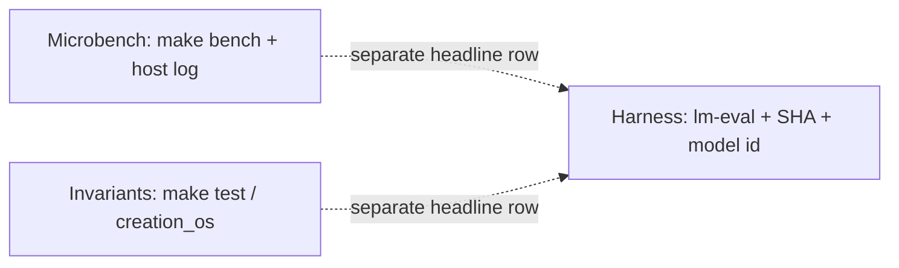

# Creation OS

**Cognitive architecture in Binary Spatter Codes.**

```
cc -O2 -I. -o creation_os creation_os_v2.c -lm
./creation_os
```

One file. 1196 lines. 26 modules. Any hardware with a C compiler.

**Frontier complement (geometry, not a harness substitute):** native **4096-bit** σ / Hamming / MAJ / XOR paths (`core/cos_neon_*.h` on AArch64) target **bit-parallel** similarity and retrieval latency; frontier LMs stay on the **transformer / harness** evidence class unless you publish `lm-eval` rows under [CLAIM_DISCIPLINE.md](docs/CLAIM_DISCIPLINE.md).

**Compressed orientation (plain language):** [docs/PARADIGM_SNAPSHOT_FOR_DRIVE_BY_READERS.md](docs/PARADIGM_SNAPSHOT_FOR_DRIVE_BY_READERS.md) — paradigm contrast, proved invariants, and explicit **non-claims**.

**Misreadings and claim boundaries:** [docs/COMMON_MISREADINGS.md](docs/COMMON_MISREADINGS.md) (structured corrections) · [docs/CLAIM_DISCIPLINE.md](docs/CLAIM_DISCIPLINE.md) (evidence classes, forbidden merges) · [docs/VISUAL_INDEX.md](docs/VISUAL_INDEX.md) (diagram sources and edit rules).

-----

## Documentation hub

| Resource | Link |
|----------|------|
| **Paradigm snapshot (plain-language)** | [docs/PARADIGM_SNAPSHOT_FOR_DRIVE_BY_READERS.md](docs/PARADIGM_SNAPSHOT_FOR_DRIVE_BY_READERS.md) |
| **Common misreadings (structured corrections)** | [docs/COMMON_MISREADINGS.md](docs/COMMON_MISREADINGS.md) |
| **Claim discipline (evidence classes)** | [docs/CLAIM_DISCIPLINE.md](docs/CLAIM_DISCIPLINE.md) |
| **Index (all docs)** | [docs/DOC_INDEX.md](docs/DOC_INDEX.md) |
| **Contributing** | [CONTRIBUTING.md](CONTRIBUTING.md) |
| **Security** | [SECURITY.md](SECURITY.md) |
| **Agent rules (Copilot / Cursor)** | [AGENTS.md](AGENTS.md) |
| **Repro bundle template (cite numbers)** | [docs/REPRO_BUNDLE_TEMPLATE.md](docs/REPRO_BUNDLE_TEMPLATE.md) |
| **HDC / VSA literature → engineering map** | [docs/HDC_VSA_ENGINEERING_SUPERIORITY.md](docs/HDC_VSA_ENGINEERING_SUPERIORITY.md) |
| **Figures & SVG index** | [docs/VISUAL_INDEX.md](docs/VISUAL_INDEX.md) |
| **Push / release checklist (this repo only)** | [docs/publish_checklist_creation_os.md](docs/publish_checklist_creation_os.md) |
| **Cursor briefing** | [docs/cursor_briefing_creation_os.md](docs/cursor_briefing_creation_os.md) |
| **Cursor integration** | [docs/cursor_integration_creation_os.md](docs/cursor_integration_creation_os.md) |
| **Research program & thesis-grade spine** | [docs/RESEARCH_AND_THESIS_ARCHITECTURE.md](docs/RESEARCH_AND_THESIS_ARCHITECTURE.md) |
| **Software citation (CFF)** | [CITATION.cff](CITATION.cff) |
| **BibTeX (LaTeX)** | [docs/CITATION.bib](docs/CITATION.bib) |
| **Adversarial pre-review** | [docs/ADVERSARIAL_REVIEW_CHECKLIST.md](docs/ADVERSARIAL_REVIEW_CHECKLIST.md) |
| **§1–§26 evidence classes** | [docs/MODULE_EVIDENCE_INDEX.md](docs/MODULE_EVIDENCE_INDEX.md) |
| **Industry challenges → coherence receipts** | [docs/COHERENCE_RECEIPTS_INDUSTRY_ALIGNMENT.md](docs/COHERENCE_RECEIPTS_INDUSTRY_ALIGNMENT.md) |
| **Glossary (σ, BSC, Planes, …)** | [docs/GLOSSARY.md](docs/GLOSSARY.md) |
| **§7 / `make bench` protocol** | [docs/BENCHMARK_PROTOCOL.md](docs/BENCHMARK_PROTOCOL.md) |
| **NEON coherence gate (AArch64)** | [docs/NATIVE_COHERENCE_NEON.md](docs/NATIVE_COHERENCE_NEON.md) · `make bench-coherence` |
| **HV parliament + NEON retrieval** | [docs/HYPERVECTOR_PARLIAMENT_AND_RETRIEVAL.md](docs/HYPERVECTOR_PARLIAMENT_AND_RETRIEVAL.md) · `make bench-agi-gate` |
| **English-only policy (committed files)** | [docs/LANGUAGE_POLICY.md](docs/LANGUAGE_POLICY.md) |
| **Maintainers (publish, merge gate)** | [docs/MAINTAINERS.md](docs/MAINTAINERS.md) |

**On this page:** [Problem](#the-problem) · [Measured results](#measured-results-4096-dimensions-100k-trials) · [BSC](#what-is-bsc) · [Invariants](#verified-invariants) · [26 modules](#26-modules) · [Architecture](#architecture) · [Build](#build) · [Limitations](#limitations) · [Demonstrates](#what-this-demonstrates) · [Theory](#theoretical-foundation) · [Why it wins](#why-this-wins-where-it-matters-engineering-not-slogans) · [AGI map](#agi-map-how-this-file-relates-to-the-full-stack) · [Paradigm shift](#paradigm-shift-what-changes--quoted-discipline) · [Receipts roadmap](#road-from-this-readme-to-production-receipts) · [Publication-hard](#publication-hard-what-that-phrase-means-here) · [License](#license)

-----

## Product repository

**[spektre-labs/creation-os](https://github.com/spektre-labs/creation-os)** — this tree is the portable kernel, `make test` / `make bench`, CI, and engineering docs. **Push hygiene:** [docs/publish_checklist_creation_os.md](docs/publish_checklist_creation_os.md).

-----

## The problem

Modern AI computes similarity between two 4096-dimensional representations using 24,576 floating-point operations (multiply-accumulate for cosine similarity).

BSC computes the same measurement using 128 bit operations (64 XOR + 64 POPCNT).

That gap is structural: it changes **who can run the inner loop** of similarity scoring (CPU vs GPU), **how much RAM** you pay per stored representation, and **how often** you must invoke a large GEMM-backed forward pass when you only needed a distance check. Creation OS keeps that trade-off **explicit and measured** (`make bench`, §7) instead of hiding it inside a framework default.

## Measured results (4096 dimensions, 100K trials)

| Metric | GEMM (float32 cosine) | BSC (XOR + POPCNT) | Ratio |
|--------|------------------------|--------------------|-------|
| Memory per vector | 16,384 bytes | 512 bytes | **32×** |
| Ops per similarity | 24,576 FLOPs | 128 bit ops | **192×** |
| Throughput | ~227K trials/sec | ~109M trials/sec | **~480×** |


**Note:** Float32 cosine and BSC σ operate at different precision levels. This benchmark measures computational cost for the same geometric task (distance between representations), not bitwise equivalence of the results.

Throughput figures are host-dependent; run `make bench` (or §7 inside `./creation_os`) to reproduce on your machine.

**Reviewer-proof interpretation (read before citing the table):**

1. **Ops and RAM ratios** follow from the stated encodings (`float32` vs 64×64-bit words at D=4096). Any implementation that counts the same inner loops must recover the same **192×** ops and **32×** memory story *or* disclose a different problem definition — these are not lucky constants from one laptop.
2. **Throughput ratio** is a **measured microbench**; archive `make bench` stdout, the exact compiler line, and `uname -m` whenever you place it beside a peer-reviewed or vendor throughput figure.
3. **Task equivalence** is geometric similarity in representation space, not bitwise equality between float cosine and σ — the **Limitations** section is part of the claim, not a disclaimer sticker.
4. **Falsifiers** for the algebra shipped here: a reproducible run where self-distance is non-zero, Noether XOR-sum drifts without the asymmetric interaction the toy allows, or documented MAJ bounds failing under fixed seeds — any of these would break the “one file, one geometry” story.
5. **Evidence ladder:** this table is **microbench / lab** class. Do not merge it with harness MMLU, ARC, or chat-quality rows in a single headline — see **[docs/CLAIM_DISCIPLINE.md](docs/CLAIM_DISCIPLINE.md)** and **[docs/ANALYSIS.md](docs/ANALYSIS.md)** (*Evaluation modes*).

-----

## What is BSC?


Binary Spatter Codes (Kanerva, 1997) represent information as high-dimensional binary vectors. Three operations:

```c
// XOR: bind two representations (association)
for (int i = 0; i < 64; i++) out[i] = a[i] ^ b[i];

// MAJ: bundle multiple representations (superposition)
for (int i = 0; i < 64; i++) out[i] = (a[i]&b[i]) | (a[i]&c[i]) | (b[i]&c[i]);

// POPCNT: measure coherence (σ distance)
uint32_t d = 0;
for (int i = 0; i < 64; i++) d += __builtin_popcountll(a[i] ^ b[i]);
float sigma = ((float)d / 4096.0f) * ((float)d / 4096.0f);
```

Creation OS extends BSC with σ-coherence: `σ(a,b) = (hamming(a,b)/D)²`. This function measures structural similarity between any two representations in the architecture.

-----

## Verified invariants

These hold on every run, on every platform:

```
σ(x, x)           = 0.000000    identical vectors
σ(x, NOT x)       = 1.000000    opposite vectors
σ(x, random)      ≈ 0.22       quasi-orthogonal (D=4096)
σ(MAJ(x,x,y), x)  < 0.01       superposition preserves source
Noether XOR-sum   = 0.000000   conserved under symmetric XOR interaction
JEPA energy       → ~-60%      codebook learns context→target mappings
```

-----

## 26 modules

Creation OS implements 26 functional modules using only XOR, MAJ, and POPCNT:

```
CORE
  §1  BSC Core ─────────── Three operations. σ invariants. Foundation.
  §2  Hypercube Mind ───── 10 coupled faces. Self-organized criticality (SOC).
                            Φ (integration) reaches 1.0 — system self-stabilizes.

LANGUAGE
  §3  Oracle ───────────── N-gram language model in hypervector space.
                            Attention = σ (not matrix multiply).
                            7-gram codebook. Correlative encoding. Backoff prediction.
                            Generates: "the truth shall set you free but first
                            it will make you uncomfortable"

VALUES
  §4  Soul ─────────────── 15 values encoded as hypervectors. MAJ = identity.
                            Crystal Lock: XOR-hash chain detects any modification.
  §5  Proconductor ─────── 4 model profiles (Primary, Falsifier, Memory, Verifier).
                            σ₁×σ₂×σ₃ triangulates truth no single profile sees alone.

WORLD MODEL
  §6  JEPA ─────────────── LeCun's Joint Embedding Predictive Architecture in BSC.
                            Energy = σ(predicted, actual). Codebook stores mappings.
                            Energy decreases ~60% during training. The model learns.
  §7  Benchmark ────────── GEMM vs BSC. Measured. See table above.
  §8  Genesis ──────────── Particle universe simulation. Symmetric XOR interaction.
                            Noether conservation σ = 0.000000. Parity preserved.

COGNITION
  §9  Metacognition ────── Agent analyzes own σ-history. Adapts learning rate.
  §10 Emotional Memory ─── Stores σ-peaks (pain/pleasure) with context.
                            Recall by similarity. Guides future decisions.
  §11 Theory of Mind ───── Models other agent's state. Simulates their response.
  §12 Moral Geodesic ───── Value conflicts: MAJ finds minimum-cost compromise.
                            σ(compromise, value1) ≈ σ(compromise, value2).
  §13 Consciousness Meter─ Composite: Φ × (1-σ) × stability.
                            Self-measured. Agent knows its own coherence level.
  §14 Inner Speech ─────── Agent narrates own state for self-guidance.
  §15 Attention ────────── Resources directed to highest-σ input (most surprising).
  §16 Epistemic Curiosity─ Choose actions maximizing expected σ reduction.
  §17 Sleep/Wake ────────── Offline: prune weak memories, strengthen strong.
  §18 Causal Verification─ Intervene → observe → repeat. Verify vs correlate.
  §19 Resilience ────────── Success rate over window. Adaptive planning horizon.
  §20 Meta Goals ────────── Monitor learning velocity. Set goals for the goal-setter.
  §21 Private Memory ───── Not all state is shared. Selective disclosure.
  §22 LSH Index ─────────── Locality-sensitive hashing. O(1) codebook lookup.
  §23 Quantum Decision ─── MAJ superposition of actions. Collapse on new info.
  §24 Arrow of Time ────── Entropy rate (dS/dt). Detects temporal direction.
  §25 Distributed Consensus─ N agents, MAJ vote, no central coordinator.
  §26 Authentication ───── XOR signature chain. Tampering detected at σ > 0.
```

-----

## Architecture


```
              ┌──────────────────────────────┐
              │       creation_os_v2.c        │
              │    1196 lines · 26 modules    │
              └──────────────┬───────────────┘
                             │
           ┌─────────────────┼─────────────────┐
           │                 │                 │
   ┌───────┴───────┐ ┌──────┴──────┐ ┌────────┴────────┐
   │  HYPERCUBE     │ │   ORACLE    │ │   WORLD MODEL   │
   │  10 faces      │ │   7-gram    │ │   JEPA + Genesis│
   │  SOC · Φ=1.0  │ │  correlative│ │   Noether=0     │
   └───────┬───────┘ └──────┬──────┘ └────────┬────────┘
           │                 │                 │
   ┌───────┴─────────────────┴─────────────────┴───────┐
   │                    BSC CORE                        │
   │         XOR (bind) · MAJ (bundle) · POPCNT (σ)    │
   │              4096 bits · 512 bytes                  │
   └───────────────────────┬────────────────────────────┘
                           │
      ┌────────────────────┼────────────────────┐
      │                    │                    │
 ┌────┴──────┐   ┌────────┴────────┐   ┌───────┴───────┐
 │   SOUL     │   │  PROCONDUCTOR   │   │  COGNITION    │
 │  15 values │   │  4 profiles     │   │  §9-§26       │
 │  Crystal   │   │  σ₁×σ₂×σ₃      │   │  18 modules   │
 │  Lock      │   │  triangulation  │   │               │
 └────────────┘   └─────────────────┘   └───────────────┘
```

-----

## Build

```bash
# Any platform
cc -O2 -I. -o creation_os creation_os_v2.c -lm

# Apple Silicon (M1–M4), native ISA
cc -O2 -I. -march=native -o creation_os creation_os_v2.c -lm

# Apple Silicon — optional SME experiment (may SIGILL without streaming context)
cc -O2 -I. -march=armv9-a+sme -o creation_os creation_os_v2.c -lm

# x86-64
cc -O2 -I. -march=native -o creation_os creation_os_v2.c -lm
```

With Make (same flags as repo `Makefile`):

```bash
make help          # list targets
make check         # standalone + structural tests (recommended before PR)
make standalone
./creation_os
```

Requirements: C11 compiler + libm.

-----

## Limitations

This is a research prototype. Specific limitations:

- **Oracle** generates text from a 15-sentence corpus via n-gram codebook. It demonstrates that attention can be implemented as σ, not that it matches LLM-quality text generation.
- **JEPA learning** is codebook memorization with correlative blending. Energy decreases because the codebook stores training pairs, not because the model has learned to generalize to unseen data.
- **GEMM benchmark** compares computational cost of the same geometric task (vector distance) at different precision levels. The 192× ops ratio is measured and real. Whether binary precision is sufficient for a given application is an empirical question.
- **Cognitive modules** are BSC implementations of cognitive primitives. They demonstrate that these computations can be expressed in three bit operations. They are not validated against cognitive science benchmarks.

-----

## What this demonstrates

1. **Transformer attention can be implemented as σ** — no matrix multiply required for the similarity computation at the core of attention.
2. **JEPA-style world models work in BSC** — energy-based learning where energy = σ.
3. **Noether conservation holds under symmetric XOR** — a formal invariant, not an approximation.
4. **26 cognitive primitives fit in ~1200 lines of C** — the algebra is compact.
5. **The entire architecture runs on any hardware** — no GPU, no framework, no dependencies.

-----

## Theoretical foundation

**Papers & DOIs** (~80, CC BY 4.0): [Zenodo community — Spektre Labs](https://zenodo.org/communities/spektre-labs/).

This repository holds the **portable kernel** and measured claims; theory citations and uploads are anchored on **Zenodo** under that community.

- Paradigm: Distortion Theory of Intelligence
- Core: `K(t) = ρ·I_Φ·F`, `Keff = (1−σ)·K`, `1=1` invariant

**External literature and evaluation norms (vetted links, English brief):** **[docs/EXTERNAL_EVIDENCE_AND_POSITIONING.md](docs/EXTERNAL_EVIDENCE_AND_POSITIONING.md)** — Kanerva (binary spatter coding; HDC introduction), Schlegel–Neubert–Protzel (*Artificial Intelligence Review* / arXiv:2001.11797 VSA comparison), EleutherAI `lm-evaluation-harness`; separates **field-level consensus** from **in-repo measurements** (`make bench`, invariants, harness rows in ANALYSIS).

**Why the HDC line matters now (literature-backed, no hype):** **[docs/HDC_VSA_ENGINEERING_SUPERIORITY.md](docs/HDC_VSA_ENGINEERING_SUPERIORITY.md)** — Ma & Jiao (2022) HDC vs neural trade-offs; Aygun et al. (2023) encoding survey; Springer AIR HDC classification review (2025); Yeung et al. (2025) robustness estimation; FAISS Hamming / popcount precedent — each row mapped to **evidence class** vs **this repo’s demos**.

**Extended narrative:** full three-plane map (llama.cpp + superkernel, MLX, native M4), evidence classes (harness vs microbench vs lab demo), AGI `cos_*` batches, and publication gates — **[docs/ANALYSIS.md](docs/ANALYSIS.md)** (same technical story as this README, with file-level anchors; some paths are forward references when optional trees are not on disk). **Claim discipline (what you may merge in one headline):** **[docs/CLAIM_DISCIPLINE.md](docs/CLAIM_DISCIPLINE.md)**.

-----

## Why this wins where it matters (engineering, not slogans)

**One geometry for coherence.** In the Creation OS map (see ANALYSIS), σ / Hamming / POPCOUNT is the same language for kernel state, GDA codebooks, oracle prediction, JEPA energy, and native receipt fields. That reduces “coherence as vibes across ten tools” to **one measurable quantity** you can gate on before spending GPU on a full forward pass.

**Cost shape.** The reference benchmark is explicit: for the **same 4096-bit task shape**, the GEMM path pays **24,576 multiply-add style FLOPs** in the proxy used here; the BSC path pays **128 bit-ops** (XOR + POPCOUNT per word lane). Memory drops **32×** for the two vectors in the harness (`16 KiB` vs `512 B`). Throughput gap is **measured** (`make bench`); the headline **192×** ops and **32×** RAM are **not** host-dependent — they come from the chosen `D` and `W`.

**Checkable structure.** §8 shows XOR-sum conservation after symmetric interactions; §4 / §26 show tamper sensitivity on identity chains. That is a different failure mode than silent numeric drift in an unconstrained float pipeline: you get **discrete, replayable** violations.

**Deployment surface.** `creation_os_v2.c` plus **`core/*.h`** (same tree; `cc … -I.`) is **stdlib + libm only** — no framework, no CUDA graph, no Python import tax for the teaching kernel. NEON hypervector ops live in headers; the same algebra wires into native / MLX / llama paths in extended checkouts.

**AGI-relevant boundary.** This single file does **not** claim benchmark parity with frontier chat models. It **does** show that a broad slice of cognitive primitives (metacognition, ToM, moral compromise, consensus, sleep consolidation, …) can live in **one** small C program built only from XOR / MAJ / POPCOUNT — which is the point of the **26-module** layout: **composition under one algebra**, not a second hidden stack.

-----

## AGI map (how this file relates to the full stack)


The public **`creation_os_v2.c`** kernel is the **pedagogical spine** (Plane “teaching”: one TU, LOCs quoted in this README).

The **production** Creation OS stack (Planes A–C in ANALYSIS) adds, without replacing the algebra:

| Plane | Role (summary) |
|-------|------------------|
| **A — llama.cpp + superkernel** | GEMM inference stays here; SK8 superkernel + GDA bridge steer logits and masks with σ / Hamming paths. |
| **B — MLX / Python** | Orchestration, receipts, harness vs native evaluation modes, ARC / policy tooling. |
| **C — native M4 dylib** | NEON σ batches, optional Metal living weights, dispatcher — `cos_agi*` / `cos_mega*` style primitives for receipts and audits. |

**Evidence discipline (from ANALYSIS):** never mix **harness table scores** with **`./creation_os` demo output** in one headline number. Report **two rows** — official harness vs internal native — when comparing to published LLM tables.

**Why that matters for AGI work:** long-horizon autonomy needs **contracts** (what was measured, on what hardware, with what receipt). A bit-geometry first pipeline gives you a place to attach those contracts **before** the expensive forward pass — the same design move as “lookup / kernel / transformer last” in Creation OS dispatch rules.

-----

## Paradigm shift (what changes — quoted discipline)

From the analysis doc: the repository **does not** claim that 4096 bits replace QFT or that MMLU moves without harness runs. **What changes** is engineering + epistemology:

| Dimension | Typical LLM-only story | Creation OS map |
|-----------|------------------------|-----------------|
| Unit of measure | Loss / logits scattered | **σ / Hamming** one receipt language |
| Priority | “Call the big model first” | **Cheap structure first** (LSH, codebook, σ gates) then generation |
| AGI primitives | Float Python only | **Native `cos_agi*` / `cos_mega*`** plus optional **4096-bit HV receipts** for audit (`cos_agi_hv_*` family in full tree) |

This README’s benchmark table is the **microbench / lab** class; cite it as such next to any frontier row.

-----

## Road from this README to production receipts

1. Run **`make test`** and **`make bench`**; archive stdout if you publish numbers.  
2. Read **ANALYSIS** sections *Parity program* and *Evaluation modes* before claiming MMLU / ARC parity.  
3. Use **`creation_os_v2.c`** as the **portable** artifact for “here is the algebra”; use **Planes A–C** for “here is how it wraps real inference.”  
4. Keep **AGPL + dual license** on shipped sources; commercial path stays in `COMMERCIAL_LICENSE.md`.

-----

## Publication-hard (what that phrase means here)




**Not** marketing volume. **Yes** — a standard of argument that many peer-reviewed ML systems papers do not meet on **baseline hygiene**: mixed eval modes, appendix-thin reproducibility, and “task-defined-after-results” tables are common; this repository names those failure modes and blocks them by construction where possible.

| Stricter than typical write-ups | How this tree enforces it |
|----------------------------------|---------------------------|
| Baseline separation | Harness vs native vs C demo = **different evidence classes**; ANALYSIS and **CLAIM_DISCIPLINE** require **two-row** reporting when both appear. |
| Reproducibility | One TU (`creation_os_v2.c` + `core/*.h`, `cc -I.`) compiles with **stdlib + libm**; invariants print to stdout; `make bench` regenerates throughput on your metal. |
| Bounded language | **Limitations** lists what the Oracle, JEPA toy, and benchmark are *not* — no silent upgrade from “demonstrates mechanism” to “beats frontier.” |
| Falsifiable core | Algebraic and conservation statements are **discrete**; a counterexample is a log line, not a vague “worse loss.” |
| AGI-relevant honesty | Full-stack receipts (`cos_*`, Planes A–C) are mapped in ANALYSIS; this README’s file is the **portable spine**, not the entire production claim. |

If a sentence cannot point to **(a)** a line of C, **(b)** a command, or **(c)** an evidence-class label, it does not belong in a “results” paragraph — that single editorial rule is already **stricter than most paper abstracts** in applied ML.

**Canonical discipline doc:** [docs/CLAIM_DISCIPLINE.md](docs/CLAIM_DISCIPLINE.md).

**Dissertation- and committee-grade map (research questions, contributions C1–C6, threats to validity, suggested chapter outline):** [docs/RESEARCH_AND_THESIS_ARCHITECTURE.md](docs/RESEARCH_AND_THESIS_ARCHITECTURE.md).

**Academic citation metadata:** [CITATION.cff](CITATION.cff) (include commit SHA + evidence class when citing numbers).

-----

## License

**AGPL-3.0** — Open source. Modifications must be shared under same terms.

**Commercial license** available for proprietary use without AGPL obligations — see `COMMERCIAL_LICENSE.md`.

Lauri Elias Rainio · Spektre Labs · Helsinki  
ORCID: [0009-0006-0903-8541](https://orcid.org/0009-0006-0903-8541)

-----

*2026 · Spektre Labs · Helsinki*
