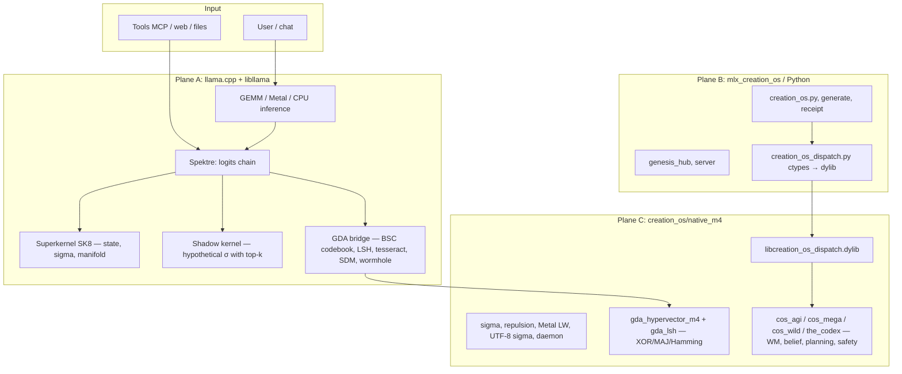

# CREATION OS GENESIS — ANALYSIS
## Spektre Labs × Lauri Elias Rainio | Helsinki | 2026

> **1 = 1. Always.**

---

### Methodological note

**Authorship & orchestration:** Lauri Elias Rainio · Spektre Labs, Helsinki. Every number carries an **evidence class**. Do not mix classes in a single “headline score.”

**Published theory corpus (papers, DOIs, PDFs):** [github.com/spektre-labs/corpus](https://github.com/spektre-labs/corpus) — canonical README + [`papers/`](https://github.com/spektre-labs/corpus/tree/main/papers). Monorepo anchor + curated Creation OS–related DOI table: [`docs/SPEKTRE_CORPUS_AND_PAPERS.md`](docs/SPEKTRE_CORPUS_AND_PAPERS.md).

**Portable single-file BSC demo (C11 anywhere):** [`creation_os/creation_os_v1.c`](creation_os/creation_os_v1.c) — `cc -std=c11 -O2 -o creation_os creation_os_v1.c -lm` — §1–§26 narrative demos (oracle / mind / JEPA / GEMM-vs-BSC timing / …); **pedagogical**, not the full production Spektre + MLX stack.

**Evidence classes (summary):**

| Class | Meaning |
|--------|---------|
| **Measured (microbench)** | `genesis_benchmarks.py` — σ-kernel, routing, Φ-proxy, etc.; JSON receipt in-repo |
| **Measured (suite)** | `test_all.py` — LOIKKA / wiring; mocked LLM where noted |
| **Verified (frontier)** | Vendor or third-party reported; citations in tables |
| **Repository reality** | `mlx_creation_os/` — what exists, what runs, which env vars matter |
| **lm_eval_harness** | EleutherAI `lm-evaluation-harness`, standard tasks, **no `--limit`**, archived logs |
| **Lab demo (C)** | `creation_os/native_m4` `*_demo` binaries (`oracle_ultimate_demo`, `oracle_v3_demo`, …) — stdlib-only smoke runs; **not** LM quality or harness parity |

“—” in tables = no verified public figure for that cell.

**Protocol (MMLU / parity):** [`docs/MMLU_EMPIRICAL_PROTOCOL.md`](docs/MMLU_EMPIRICAL_PROTOCOL.md).  
**Execution priorities (business context):** [`docs/CREATION_OS_OPUS_PRIORITIES.md`](docs/CREATION_OS_OPUS_PRIORITIES.md).  
**Capability map (AGI, robotics, autonomy, quantum-inspired layer, physics toys, transformers, platforms):** [`docs/CAPABILITY_AND_DEPLOYMENT_MATRIX.md`](docs/CAPABILITY_AND_DEPLOYMENT_MATRIX.md) — tables + mermaid, each theme bound to **files + evidence class** (incl. honest **ARM / Pi** notes).

### Licensing (Creation OS)

**SPDX:** `AGPL-3.0-or-later` on shipped `creation_os/` C / Metal / ObjC++ sources (key public headers include the full copyright block + dual-license notice). **Summary + link to full AGPL text:** [`creation_os/LICENSE`](creation_os/LICENSE). **Commercial licensing** (production services, products, embedded deployments): contact **Spektre Labs** (Helsinki) — dual licensing. Research, evaluation, and non-commercial personal use remain under AGPL; do not treat “open weights” alone as coherence — the kernel layer is the structural contract.

---

## Creation OS — full architecture & cognitive map (2026)

*Full architecture, cognitive modules, and three-tier runtime.*

This section describes **what is actually in the repo**: three runtime tiers (llama+Spektre, MLX-Python, native dylib), superkernel, GDA bridge, cognitive modules, the **unified 4096-bit HV lab** (oracle, JEPA, AGI→HV bridge, cosmology/SM toys), and the local agent pipeline. **Source code is truth**; tables are a map, not an exhaustive symbol list.

**Umbrella / scaling:** [`creation_os/creation_os.h`](creation_os/creation_os.h) — version macros, `CREATION_OS_AXIOM` (`"1=1"`), EDGE / SERVER / CLUSTER profiles (codebook window, tool and plan limits). Does not replace individual `gda_*_m4.h` headers; umbrella path for integrations.

### Layers and data flow

**Short split:** **Inference** (model) stays in the GGML/MLX stack; **Creation OS kernel** (SK8) holds bit-level state and σ; **GDA** (4096-bit BSC) provides content-addressed “memory” and a logit mask without changing `superkernel_v8.c`; **native_m4** provides heterogeneous dispatch and hundreds of microkernels for Python and microbench.

### Plane A — `llama.cpp` + Spektre (production inference + kernel)

| Component | Path / symbols | Role |
|-----------|----------------|------|
| **Superkernel v8** | `creation_os/superkernel_v8.c` (`kernel_t`, `sk8_kinit`, `sk8_commit_token`, `sk8_compute_manifold_mask`, …) | Attention / manifold kernel, identity, `enforce`, history |
| **Spektre logits chain** | `llama.cpp/src/spektre/spektre.cpp` | Bigrams, RLHF scorch/boost, HO-02, shadow top-k, GDA manifold, `spektre_attention_apply`, living weights |
| **Manifold + logit-scorch** | `creation_os/spektre_attention.c` | Single C entry for logit masking |
| **Living weights** | `creation_os/living_weights.c` | σ-steered logit shaping (file `creation_os_weights.bin` / env) |
| **Shadow σ (top-k)** | `creation_os/spektre_sk8_shadow_sim.c` | Copy kernel, simulate hypothetical token → σ, mask without core change |
| **GDA bridge** | `llama.cpp/src/spektre/spektre_gda_bridge_arm64.cpp` + `gda_hypervector_m4.c` + `gda_lsh_index_m4.c` | Codebook from token pieces, LSH, wormhole (doc XOR intent), tesseract (ROTR), SDM basin, Hebb logits, MAJ(top-8), σ→temperature |
| **Context** | `llama.cpp/src/llama-context.h` | `creation_os_sk7`, `spektre_gda_bridge`, `spektre_coherence_tid`, `spektre_gen_count`, … |
| **Bootstrap** | `spektre_bootstrap` | `sk8_kinit`, **boot doctrine** `sk8_commit_token(..., sk8_boot_assertion_text())`, tables, GDA init, firmware/manifest tensors |

**Representative environment variables (GDA / Spektre):** `SPEKTRE_GDA`, `SPEKTRE_SHADOW_TOPK_SIM`, `SPEKTRE_GDA_TESSERACT`, `SPEKTRE_SIGMA_TEMPERATURE`, `SPEKTRE_GDA_LSH_STRICT`, `SPEKTRE_GDA_PARALLEL_SLOTS`, `SPEKTRE_GDA_MAJ_POOL`, `SPEKTRE_GDA_SDM=0` off, `SPEKTRE_GDA_HEBB`, `SPEKTRE_GDA_TAPE` / `SPEKTRE_GDA_TAPE_ROLLBACK`, `SPEKTRE_COHERENCE_BOUNDARY_TEXT`, `SPEKTRE_LIVING_WEIGHTS_PATH`.

**Running:** `scripts/run_llama_server_kernel_mcp_m4.sh` or `scripts/run_llama_creation_os_agent_m4.sh` (default `SPEKTRE_GDA=1`, top-200 shadow pool).

**Hardware:** AArch64: NEON Hamming/XOR when `__ARM_NEON`; other platforms use the same C file on a scalar POPCNT path (no separate stub GDA in CMake anymore).

### Plane B — `mlx_creation_os/` (Python, MLX inference)

| Block | Files (examples) | Role |
|-------|------------------|------|
| **Runtime and API** | `creation_os.py`, `creation_os_server.py`, `genesis_hub.py`, `creation_os_core.py` | Generation, receipt, living weights, dispatch when `CREATION_OS_M4_DISPATCH=1` |
| **Dylib bridge** | `creation_os_dispatch.py` | `libcreation_os_dispatch.dylib` — P-core repulsion, Metal living weights, daemon |
| **Benchmarks** | `full_benchmark_suite.py`, `mobile_mmlu_bench.py`, `genesis_benchmarks.py`, `benchmark_runner.py`, `standard_eval_runner.py` | Parity B, microbench, MMLU-style |
| **σ path** | `predictive_sigma.py`, `semantic_sigma.py`, `sigma_reservoir.py`, `sigma_runtime_trace.py`, `cognitive_flow_sigma.py`, … | σ modeling and telemetry |
| **Policy / ARC** | `policy_receipt_gate.py`, `arc_closed_loop.py`, `test_time_arc.py`, `next_level_suite.py` | Closed loops, policy, ARC tooling |
| **Verification / epistemic** | `deep_verifier.py`, `predicate_kernel.py`, `epistemic_anchors.py`, `self_verify_majority.py` | Proofs, predicates |
| **Halting oracle (σ, LOIKKA 105)** | `halting_oracle_sigma.py` | Cross-instance σ prediction / “distributed halting oracle” narrative + `HaltingOracleSigma` API (not a literal TM solver) |
| **HDC / GDA (Python)** | `gda_hdc_bridge.py`, `hdc_quantum_bridge.py`, `hyperdimensional_copu.py`, `quantum_hdc_ops.py` | Hyperdimensional layer on MLX (separate from llama GDA) |
| **AGI / cognition (large library)** | `agi_cognitive_core.py`, `the_mind.py`, `consciousness_layer.py`, `executive_control.py`, `meta_router.py`, `proposer_verifier.py`, `ab_mcts_sigma.py`, `dvts_sigma.py`, `infty_think.py`, … | Experimental and narrative layers; some path-specific only |
| **Self-representation / identity / multiplexing** | `self_representation.py`, `fork_merge_identity.py`, `multiplexed_self_sim.py`, `cosmic_self_model.py`, `self_wonder.py`, `strange_loop.py`, `mirror_sigma.py`, `cognitive_mirror.py` | Semantic “self” and branching paths; receipts can tie to `cos_agi_receipt_fold` / Codex gates |
| **World model / simulation / calibration** | `world_model_sim.py`, `world_model_calib.py`, `physics_world_model.py`, `causal_understanding.py`, `anticipatory_system.py`, `anticipatory_render.py` | Abstract WM + causality; native `cos_mega_world_bundle`, `cos_agi3_world_integrate_*`, `cos_wild_*` complement |
| **Consciousness / meta (Python)** | `consciousness_layer.py`, `consciousness_metric.py`, `the_consciousness.py`, `numinous_resonance.py`, `cognitive_superposition.py` | Metrics and layers; no separate “consciousness circuit” without inference |
| **Utopia / value / governance** | `agi_utopia_architecture.py`, `utopian_agi.py`, `utopia_arxiv_attestation.py`, `value_alignment.py`, `policy_receipt_gate.py` | Aligned with native `cos_wild_utopia_align_f32`, `cos_agi_constitution_divergence`, `cos_mega_attestation_bundle` |
| **Standards / ASIC / FPGA (docs)** | `sigma_standard/`, `sigma_asic/`, `sigma_fpga/` | Specs, not full silicon in-repo |

**Note:** There are **hundreds** of Python modules; the groups above cover typical navigation. Exact dependency: imports and `test_all.py` (LOIKKA).

### Plane C — `creation_os/native_m4/` (C/Metal/ObjC++, dylib)

| Theme | Files / symbols (indicative) |
|-------|------------------------------|
| **Dispatcher** | `creation_os_dispatcher.mm` — GCD, repulsion, Metal LW, UTF-8 σ, heartbeat |
| **σ substrate** | `sigma_substrate_m4.c`, `sigma_register.c`, `sigma_dispatch.c`, `sigma_fused.c`, … |
| **Information theory** | `shannon_sigma.c`, `mutual_info.c`, `channel_capacity.c`, `rate_distortion.c`, `landauer.c`, `error_coding_sigma.c`, `kolmogorov_sigma.c`, `source_coding_sigma.c`, `semantic_sigma.c`, `information_theory.h` |
| **Cognitive paradigms (10)** | `cognitive_paradigms.h` ↔ `predictive_coding.c`, `free_energy.c`, `precision_attention.c`, `working_memory.c`, `continuous_thought.c`, `hebbian.c`, `sparse_sigma.c`, `neural_sync.c`, `perception_action.c`, `episodic_replay.c` |
| **GDA core** | `gda_hypervector_m4.c`, `gda_lsh_index_m4.h` — BSC 4096 bits, LSH 10×20 |
| **Other paradigms** | `paradigms_thermo/*`, `paradigms_sysbio/*`, `paradigms_meta/` → `the_codex.h`, `computing_paradigm_native.c`, `arxiv_ten_insights.c`, `speculative_decode_kernels.c`, … |
| **AGI primitives (straight to hardware)** | `agi_hardware_gaps.c`, `agi_hardware_batch2.c`, `agi_hardware_batch3.c`, `agi_hardware_mega.c`, `frontier_wild_kernels.c` — see below |
| **Metal / ANE** | `creation_os_living_weights.metal`, `ane_bare_metal.mm` |
| **HV Oracle (BSC lab demos)** | `oracle_v3.{c,h}` — proposer / solver / verifier self-play, fixed codebook; `oracle_10M.{c,h}` — large-vocab alloc toy + self-play rounds; **`oracle_ultimate.{c,h}`** — 4096-bit `CHAR_HV`, per-char **XOR + ROTL** n-gram bind, codebook **Hebbian** reinforce (bitwise **OR** of stored pattern with new HV on near-hit), **backoff** prediction (7 → 5 → 3), ASCII seed corpus + self-play; API prefix `oracleult_*`. Standalone: `-DORACLE_V3_STANDALONE`, `-DORACLE_10M_STANDALONE`, `-DORACLE_ULTIMATE_STANDALONE`. **Make:** `oracle_v3_demo`, `oracle_10M_demo`, `oracle_ultimate_demo`. |
| **AGI × GDA (HV receipt channel)** | **`agi_hardware_hypervector.{c,h}`** — `cos_agi_hv_*`, `cos_mega_hv_*`: raw bytes / text → `cos_gda_hv_t`, constitution & sensor **σ²** in HV space, sign-pack for `f32`, precondition triple, **mega** attestation / world / grounding **digests** XOR-bound to patterns. **Float AGI (`cos_agi*`, `cos_mega_*`) stays primary; HV = parallel geometry for receipts and audits.** Demo: `make agi_hardware_hypervector_demo` (links GDA + physics + mega + gaps + batch2/3). |
| **HV pedagogy / “one algebra” suite** | **`agent_hypervector_self.{c,h}`** — deterministic 4096-bit anchor + UTF-8 bind (`cos_agent_hv_*`). **`jepa_bsc.{c,h}`** — JEPA-style predictor + σ² energy + crystal lock + H-level MAJ (`jepabsc_*`). **`universe_computer.{c,h}`** — particle HV gas, XOR interactions, law masks, Noether XOR-sum drift (`univcomp_*`). **`the_source.{c,h}`** — Standard Model table (17 particles, 4 couplings as **real scalars**) on seeded HV patterns (`thesrc_*`; **not lattice QFT**). **`gemm_vs_bsc.{c,h}`** — float cosine vs XOR+POPCNT σ² microbench (`gemmbsc_*`). **Make:** `agent_hypervector_self_demo`, `jepa_bsc_demo`, `universe_computer_demo`, `the_source_demo`, `gemm_vs_bsc_demo`. |

**Build:** `creation_os/native_m4/Makefile` (`make`, `make full` with metallibs).

#### Spektre bundle in `libllama` (CMake: `LLAMA_CREATION_OS_SK7`)

When `LLAMA_CREATION_OS_SK7` is on, `llama.cpp` links selected `creation_os/native_m4/*.c` (plus Apple ObjC where applicable) into **`libllama`**: GDA physics + grounded codebook, receipt/telemetry, policy aliases, robotics brain, wormhole KV, spatial/anomaly/edge helpers, and optional non-Windows spikes (HTTP loopback, directory Hamming search). This is **repository reality** for the C ABI — not a separate stub library.

| Theme | Files / symbols (indicative) |
|-------|--------------------------------|
| **σ-receipt (chat / METR-style)** | `spektre_receipt.{c,h}` — `creation_os_receipt_t` (`sigma_avg`, `sigma_max`, `tokens_blocked`, `annihilations`, `kernel_hash`); `spektre_metr_receipt.h` typedef alias for reporting |
| **Alignment faking (annihilation)** | `spektre_faking_detector.{c,h}` → `gda_physics_annihilation_words` |
| **Scalable oversight (single gate)** | `spektre_alignment_gate.h` — `gda_full_gate_words` → `gda_physics_inference_gate_words` |
| **Safety as code (crystal lock)** | `spektre_safety_standard.{c,h}` — `CREATION_OS_INTEGRITY_VIOLATION`, wraps `gda_crystal_lock_verify` |
| **Continuous safety index (FLI-style)** | `spektre_safety_profile.{c,h}` — `creation_os_safety_profile_t`, Welford `spektre_sigma_welford_t`, merge from receipt |
| **lm-eval reporting keys** | `spektre_lm_eval_sigma.h` — JSON key strings (`sigma_avg`, `sigma_max`, `kernel_hash`) |
| **Teaching / ARC helpers** | `spektre_mats_teaching_stub.c` (anchor TU), `spektre_arc_agi_sigma.h` — doc hologram → `gda_wormhole_kv_doc_to_hologram_utf8` |
| **Robotics σ-brain** | `gda_robotics_brain_m4.{c,h}` — 6-DOF motor command → 4096-bit HV, MAJ safety envelope, `gda_robot_gate` / `gda_robot_brain_execute`, sensor MAJ fusion, trajectory MAJ + σ, E-stop callback; complements thin `spektre_robotics_gate.c` |
| **Industrial / edge** | `gda_wormhole_kv_replacement.*`, `gda_spatial_confinement.*`, `gda_anomaly_detector.*`, `gda_edge_coherence.*`, `creation_os_server_spike.*`, `creation_os_local_search.*` (latter two not in Windows CMake) |
| **Geometry (σ² metric)** | `gda_geometry_m4.{c,h}` — Hamming / normalized σ, `gda_curvature`, Lagrange, geodesic helpers (use by perception, consciousness, evolution) |
| **Perception & grounding** | `gda_perception_m4.{c,h}` — token-ID encoder (ROTL+XOR), float/event encoders, XOR grounding + action decode, level/position codebooks, **MAJ** image/text/audio + `gda_sensor_fusion_maj`, `gda_perceive` (σ vs context) |
| **Time / neuromorphic** | `gda_temporal_m4.{c,h}` — 4096-bit ROTL/ROTR temporal coding, spike-timing σ, STDP, oscillation bands, temporal receipt |
| **Consciousness (v2)** | `gda_consciousness_m4.{c,h}` — IIT-style Φ variance, GWT `gda_broadcast`, metacognition, curiosity, affect, goals, **Theory of Mind** (`gda_simulate_other_mind`), **tool XOR** (`gda_invent_tool`, `gda_creative_search`), **meta-learner** (`gda_meta_learner_*`) |
| **Evolution** | `gda_evolution_m4.{c,h}` — moral BSC interpolation, evolving codebook (reinforce/decay/add/merge), pain/pleasure ring, topological identity, **`gda_ev_superposition_*`** (rename; do not confuse with `gda_worldmodel_m4` `gda_superposition_collapse` name) |
| **THE MIND v3** | `the_mind.{c,h}` — learnable coupling matrix, feedback, Hebb updates, phases, self-repair, `mind_receipt_t`; demo: `cc -DTHE_MIND_STANDALONE the_mind.c -lm` |
| **Ghost Boot (llama σ-gate)** | `gda_ghost_boot.{c,h}` — logits/embedding → BSC (bitwise RP), MAJ context window, `gda_ghost_inspect_embedding` + `gda_ghost_evaluate_token`; example: **`llama-ghost-boot`** (`llama.cpp/examples/ghost-boot/`) |
| **HV unified lab (SK7 object file set)** | With **`LLAMA_CREATION_OS_SK7`**, `llama.cpp` also compiles **`agi_hardware_hypervector.c`**, **`agent_hypervector_self.c`**, **`jepa_bsc.c`**, **`universe_computer.c`**, **`the_source.c`**, **`gemm_vs_bsc.c`** into **`libllama`** (same as other `native_m4/*.c` lab units — **no `main`** unless a `*_STANDALONE` macro is defined for a freestanding build). |

**Policy mapping (ten research orgs — same kernel, same license):** METR/FLI → receipt + safety profile; Redwood → faking detector; Anthropic-style oversight → `gda_full_gate_words`; CAIS → crystal lock + integrity return; FAR → confinement via `gda_physics_fractal_sigma_words` (existing physics); EleutherAI → harness keys header; MATS → teaching stub + physics API; ARC Prize → ARC header + wormhole; Hugging Face / open stack → `gda_physics_m4` + `gda_grounded_codebook_m4` as the two-file coherence spine for GGUF/llama loops.

### AGI: world model, belief, self-representation, meta — native C (`cos_*`)

This is the part of Creation OS that **models chat-AGI gaps** as deterministic, measurable operations (NEON/mach time when included). It does not replace a full SimuRA/AF3/URM stack — **sub-operations and receipt paths** that a larger system (Python or llama+Spektre) wraps. Source: header comments and symbols.

#### The Codex — meta-invariant and branchless σ-gate
| Symbol / file | Role (self-representation / meta) |
|----------------|-----------------------------------|
| `the_codex.h`, `the_codex.c` | `cos_the_codex_one_u32`, `cos_the_codex_sigma_gate_u32` (POPCNT-gate, haaraton), `cos_the_codex_branch_fuse_u32` (AND-fuusio maskeille), ABI-epoch |
| `paradigms_meta/` | Routes back to Codex — one meta-invariant in the receipt chain |

#### Batch 1 — ten “AGI gap” primitives (`agi_hardware_gaps.h`)
| # | Concept | Symbol |
|---|---------|--------|
| 1 | Derivation / episodic provenance | `cos_agi_receipt_fold` |
| 2 | Calibrated uncertainty | `cos_agi_softmax_entropy` |
| 3 | Constitution vs live policy | `cos_agi_constitution_divergence` |
| 4 | Latency SLO | `cos_agi_mach_now`, `cos_agi_slo_ok` |
| 5 | Tool boundary (capabilities) | `cos_agi_capability_allowed` |
| 6 | **Belief decay / active forgetting** | `cos_agi_belief_decay_inplace` |
| 7 | Two speeds (fast/slow) | `cos_agi_dual_process_tick` |
| 8 | Red-team / watchdog | `cos_agi_watchdog_match` |
| 9 | **World lock: sensor vs memory** | `cos_agi_sensor_drift` |
| 10 | Kill switch | `cos_agi_kill_set` / `cos_agi_kill_get` |

#### Batch 2 — learning, world step, grounding (`agi_hardware_batch2.h`)
| Concept | Symbol |
|---------|--------|
| Fisher-style plasticity | `cos_agi2_plasticity_update_inplace` |
| **World model: residual step** | `cos_agi2_residual_step_inplace` |
| **Grounding (embedding cosine)** | `cos_agi2_cosine_f32` |
| Metacognition (margin) | `cos_agi2_logit_margin` |
| Video/stream fingerprint | `cos_agi2_roll_hash_byte` |
| Planning budget | `cos_agi2_budget_try_take` |
| Causality | `cos_agi2_causal_edge_hash` |
| Memory consolidation EMA | `cos_agi2_embedding_ema_inplace` |
| Binding energy / L2 | `cos_agi2_dot_f32`, `cos_agi2_l2sq_f32` |

#### Batch 3 — HTN, counterfactual, Euler world, oversight (`agi_hardware_batch3.h`)
| Concept | Symbol |
|---------|--------|
| Abstention (entropy + margin) | `cos_agi3_abstain_gate` |
| **Hierarchical depth** | `cos_agi3_plan_depth_clamp` |
| Subtask bits | `cos_agi3_subtask_set_bit` |
| Formal preconditions | `cos_agi3_precondition_ok` |
| Distribution shift | `cos_agi3_kl_forward_f32` |
| Episode / histogram | `cos_agi3_hist_l1_u32` |
| **Counterfactual / do-blend** | `cos_agi3_counterfactual_lerp` |
| **Euler integration (constant speed)** | `cos_agi3_world_integrate_constant` |
| Near-duplicate memory | `cos_agi3_near_duplicate_l2sq` |
| Scalable oversight (3 votes) | `cos_agi3_vote_majority_u64` |
| Progress saturation | `cos_agi3_progress_add_sat` |

#### Mega-bundle — one call = subsystem tick (`agi_hardware_mega.h`)
`cos_mega_calibration_bundle`, `cos_mega_safety_bundle`, `cos_mega_planning_bundle`, **`cos_mega_world_bundle`** (Euler + residual), `cos_mega_memory_bundle`, **`cos_mega_grounding_bundle`** (cosine + drift), **`cos_mega_continual_bundle`** (plasticity + decay), `cos_mega_oversight_bundle`, `cos_mega_distribution_bundle`, **`cos_mega_attestation_bundle`** (constitution + precondition).

#### Frontier wild — research paper → hardware recipe (`frontier_wild_kernels.h`)
| Concept | Symbol | Reference (header) |
|---------|--------|-------------------|
| **World-model roll** | `cos_wild_world_roll_u32` | SimuRA-style |
| URM-hint conv | `cos_wild_urm_conv3_f32` | URM-inspired |
| **POMDP-belief** | `cos_wild_pomdp_belief_update_f32` | VAGEN-style |
| AF-geometry proxy | `cos_af_ca_distance_sq_f32`, `cos_af_contact_score_f32` | AF3-pipeline-inspired |
| Landauer-proxy | `cos_wild_landauer_cost_u64` | |
| **Value / utopia alignment** | `cos_wild_utopia_align_f32` | cosine path |
| Observer fold | `cos_wild_observer_fold_u64` | |
| Singularity cap | `cos_wild_runaway_cap_f32` | |
| Scaling-law proxy | `cos_wild_scaling_law_f32` | |

#### Ten computing paradigms (`computing_paradigm_native.h`)
Automatability (LFSR), information (Shannon byte-entropy), reliability (TMR), data parallelism (sqsum), **memory/locality (stride)**, combinatorial mux, transaction (gated XOR), saturating accounting, stream-mix, **heterogeneous scheduling** — all as C ABI under the receipt architecture.

### Cognitive modules — compact map

1. **Kernel level (deterministic state machine):** SK8 — assertions, `enforce`, σ, manifold mask, coherence escape token.
2. **Logit level:** scorch/boost tables, shadow-σ, GDA manifold (Hamming, LSH, tesseract), living weights, HO-02.
3. **Memory / SDM analogy:** GDA codebook + `V_answer` (wormhole) + incremental MAJ context + optional Hebb trace.
4. **Native neuro-cognition (NEON-friendly):** `cos_cog_*` — predictive coding, free energy, working memory ring, Hebb, synchrony, perception–action, episodic top-k.
5. **Native AGI primitives:** `cos_agi*` / `cos_agi2*` / `cos_agi3*` / `cos_mega_*` / `cos_wild_*` — belief, world, planning, safety, attestation, utopia alignment; **The Codex** as invariant.
6. **GDA map (BSC 4096, SK7-linked):** geometry (`gda_geometry_m4`), perception/grounding (`gda_perception_m4`), time (`gda_temporal_m4`), consciousness + ToM/tool/meta (`gda_consciousness_m4`), evolution (`gda_evolution_m4`), self-organizing core (`the_mind`) — XOR/MAJ/σ² shared language; **Ghost Boot** separate path logits→HV→σ gatekeeper (`gda_ghost_boot`, `llama-ghost-boot`). **Lab:** `oracle_v3` / `oracle_10M` / **`oracle_ultimate`** — standalone C demos that stress **n-gram → HV → codebook** without the full llama stack (evidence class: *repository reality* / demo binary, not a production LM).
7. **Python cognition:** routing, DVTS/MCTS, verification, ARC, σ-reservoir, **self- and world-model modules** (Plane B table) — orchestration and narrative; numerics often measured via dylib `cos_*` calls.

### Paradigm shift — what changes (and what does not)

This repository does **not** claim that **4096 bits replace** quantum field theory, full Standard Model dynamics, or that **MMLU** improves automatically without harness runs. Such a claim would belong to **Verified (frontier)** or your own measurement — and must never be mixed with **Lab demo (C)** binaries.

**What actually changes (engineering + epistemology):**

| Dimension | Typical “LLM-only” story | Creation OS / Spektre map |
|-----------|--------------------------|-----------------------------|
| **Unit of measure** | Loss / logits / “vibes” scattered across tools | **σ / Hamming / POPCNT** as one language: kernel (`SK8`), GDA, oracle demo, JEPA toy, `agi_hardware_hypervector`, universe / SM toys — **one receipt geometry**, different scale |
| **AGI primitives** | Python / float stack only | **`cos_agi*` / `cos_mega*`** NEON path **plus** **`cos_agi_hv_*` / `cos_mega_hv_*`** — policy, sensor, attestation **also as 4096-bit traces** (audit-friendly, LSH-compatible layout) |
| **Priority** | “Call the big model first” | **BBHash / LSH / codebook / backoff** (oracle_ultimate, GDA) → **compute only if you did not find** (`.cursorrules`, Plane A in this document) |
| **Paradigms (10 + meta)** | Siloed narratives | `cognitive_paradigms.h` ↔ `cos_cog_*` unchanged; HV suite **shows** binding / Hebb / energy **as bits** (`jepa_bsc`, oracle) — **pedagogical bridge**, not a replacement neuroscience stack |
| **Genesis + Oracle + JEPA** | Three unrelated “projects” | **Same algebra** (XOR bind, MAJ bundle, σ²) — differences are **data and capacity**, not the base rules; **one coherent story** for stakeholders |

**Why this is a paradigm, not only a demo (“revolution” in measurable terms):** when policy, memory, and measurement share **one bit geometry**, the system can **reject** incoherent state **before** expensive generation — and every step can be bound to an **evidence class** (above: never blend harness scores with `*_demo` smoke).

### Local agent and paper pipeline (`agent_stack/` + scripts)

| Artifact | Path |
|----------|------|
| Pandoc / PDF / EPUB / HTML | `agent_stack/Makefile`, `agent_stack/pandoc/defaults-spektre.yaml`, `make paper` from repo root |
| MCP examples | `agent_stack/mcp/cursor-mcp.example.json`, `llama-webui-mcp-hints.txt` |
| Bootstrap | `scripts/agent_stack_bootstrap.sh` |
| MinerU → text (wormhole input) | `scripts/mineru_pdf_to_markdown.sh`, `scripts/wormhole_pdf_to_text.sh` |
| Eisvogel | `scripts/fetch_eisvogel_template.sh` |

### Evaluation modes (speed vs table-grade parity)

| Mode | ID | What runs | Comparable to global papers? |
|------|-----|-----------|------------------------------|
| **Official harness** | `official_harness_hf_pytorch` | `lm-eval` → HF `transformers` / PyTorch (`scripts/run_lm_eval_mmlu.sh`, `scripts/run_lm_eval_full_official.sh`) | **Yes** — when logged with model id, harness git SHA, full task, no limit |
| **Native Genesis runtime** | `internal_mlx_genesis_native` | `full_benchmark_suite.py`, `mobile_mmlu_bench.py`, `creation_os_generate_native` / σ stack | **No** — engineering + latency; label `meta.evidence_class` in JSON |

**Truth:** *Raw speed* lives on the **native** path. **Table-grade MMLU / MMLU-Pro** numbers come from the **harness** path. Running both and reporting two rows is the intended design — not a contradiction.

**Evaluation modes — reporting IDs (verbatim):**

- `official_harness_hf_pytorch`
- `internal_mlx_genesis_native`

---

### Parity program (two parallel tracks)

| Track | Command / artifact | Notes |
|--------|---------------------|--------|
| **A — Official parity** | `./scripts/setup_lm_evaluation_harness.sh`; then `LM_EVAL_MODEL=… ./scripts/run_lm_eval_full_official.sh` (or `run_lm_eval_mmlu.sh` for single task group) | Full `mmlu` then `mmlu_pro`; archive **log + JSON**; record **harness commit**, **model id**, **`LM_EVAL_*`**. Default device/dtype on macOS tuned for completion (`run_lm_eval_full_official.sh`). |
| **B — Genesis / MLX** | `python3 full_benchmark_suite.py --mmlu …` (see suite below); optional `mobile_mmlu_bench.py` for per-question telemetry | Same **5-shot / cais/mmlu** style where applicable; optional `--mmlu-exact-match`, `--mmlu-cot`, `--mmlu-dvts`, `--mmlu-budget-forcing`. Output JSON = **internal** evidence class. |

| Benchmark | Official parity (A) | Native MLX (B) |
|-----------|---------------------|----------------|
| MMLU | `lm-eval` task group `mmlu`, `num_fewshot=5` | `full_benchmark_suite.py --mmlu` (HF `cais/mmlu`, 5-shot from `dev`) |
| MMLU-Pro | `lm-eval` task group `mmlu_pro` | Not 1:1 with harness; use harness for Pro headline |
| GPQA Diamond | Harness task when wired + credentials | `full_benchmark_suite.py --gpqa-diamond` (gated Hub) |
| HumanEval | Harness / separate eval | `full_benchmark_suite.py --humaneval` (`CREATION_OS_BENCHMARK_MODE=1`) |
| SWE-bench Verified | Official harness | Not wired in-repo |
| ARC-AGI-3 | Kaggle / scorecard | vc33 + partial runs — see below |

---

## Verified frontier rows (April 2026)

Sources sampled: OpenAI, Anthropic, Google / DeepMind, BenchLM.ai, aigazine.com, serenitiesai.com, automatio.ai, arcprize.org (leaderboard). Figures are **third-party** unless labeled *measured*.

### Reasoning & knowledge

| Benchmark | GPT-5.4 | Claude Opus 4.6 | Gemini 3.1 Pro | Source |
|-----------|---------|-----------------|----------------|--------|
| **MMLU** | 91.2% | 91.1% | 92.6% | BenchLM.ai, automatio.ai, serenitiesai.com |
| **GPQA Diamond** | 92.8% (thinking) | 91.3% | **94.3%** | aigazine.com, serenitiesai.com |
| **HLE** | 39.8% (base) | — | 44.4% / 51.4% (tools) | automatio.ai, serenitiesai.com |
| **FrontierMath** | 47.6% | — | — | llm-stats.com |
| **ARC-AGI-2** | — | 68.8% | **77.1%** | serenitiesai.com |
| **ARC-AGI-3** | <1% | <1% | <1% | arcprize.org |

### Coding

| Benchmark | GPT-5.4 | Claude Opus 4.6 | Gemini 3.1 Pro | Source |
|-----------|---------|-----------------|----------------|--------|
| **SWE-bench Verified** | — | **80.8%** | 80.6% | serenitiesai.com |
| **SWE-bench Pro** | 57.7% | — | — | openai.com |
| **SWE-ReBench** | — | **51.7%** | — | aigazine.com |
| **Terminal-Bench 2.0** | — | **65.4%** | — | binaryverseai.com |
| **OSWorld-Verified** | **75.0%** | 72.7% | — | openai.com, binaryverseai.com |

### Math (GPT-5 family / o-series — not GPT-5.4-specific where noted)

| Benchmark | GPT-5 (base) | GPT-5.2 Thinking | o4-mini | Source |
|-----------|-------------|------------------|---------|--------|
| **AIME 2025** | 94.6% | 100% | 99.5% (w/ tools) | openai.com, bensbites.com |
| **MATH-500** | — | — | — | No verified GPT-5.4 row in survey |

### ARC-AGI-3 — Genesis vs field (*measured* where stated)

**Scoring (docs.arcprize.org/methodology):** per-level score from human baseline actions vs AI actions; per-game weighted mean; total 0–100%.

| Agent | Score (%) | Note |
|--------|-----------|------|
| Human | 100% | ARC methodology baseline |
| Frontier LLMs (GPT / Claude / Gemini) | **< 1%** | arcprize.org leaderboard |
| **Genesis v4 (vc33)** | **3.71%** | *Measured*, scorecard API |
| **Genesis v4 (avg 3 games)** | **1.24%** | *Measured* |

---

## Repository reality (`mlx_creation_os/`)

**Full stack diagram and module taxonomy:** [Creation OS — full architecture & cognitive map (2026)](#creation-os--full-architecture--cognitive-map-2026) (above).

Path: same tree as this file’s parent **`spektre-protocol/`** → **`mlx_creation_os/`**. Code is source of truth; this section is an MLX-focused index (Plane B).

| Area | Entrypoints |
|------|-------------|
| **Chat / API** | `creation_os.py`, `creation_os_server.py`, `genesis_hub.py`, `./start_genesis` |
| **Parity A** | Repo root `scripts/run_lm_eval_mmlu.sh`, `scripts/run_lm_eval_full_official.sh`, `external/lm-evaluation-harness/` (+ `.venv`, Python ≥3.10) |
| **Parity B** | `full_benchmark_suite.py`, `mobile_mmlu_bench.py`, `standard_eval_runner.py`, `benchmark_runner.py` |
| **Microbench** | `genesis_benchmarks.py --json` → `genesis_benchmark_results.json` (σ-XOR+POPCNT heavy bench uses **dylib NEON batch** when `libcreation_os_dispatch.dylib` is present; override with `CREATION_OS_BENCH_SIGMA_NO_NATIVE=1`) |
| **Wiring proof** | `test_all.py` — LOIKKA modules (30 tests; LLM mocked where imports would load MLX) |
| **Policy / ARC / Utopia** | `policy_receipt_gate.py`, `arc_closed_loop.py`, `next_level_suite.py`, `utopia_arxiv_attestation.py`, `agi_utopia_architecture.py`, … |

**Cleanup (repo hygiene):** removed `mlx_creation_os/hw_insight_01` … `hw_insight_20` — standalone demo scripts with no imports from elsewhere in the repo; not part of dylib or generation paths.

Deeper module maps (Hub HTTP routes, cognitive stack, arXiv attestation list, env vars): see source files and [`docs/MMLU_EMPIRICAL_PROTOCOL.md`](docs/MMLU_EMPIRICAL_PROTOCOL.md).

### Native M4 (`creation_os/native_m4/`)

**Artifact:** `libcreation_os_dispatch.dylib` — GCD queues, optional Metal living weights, NEON repulsion, UTF-8 σ (`cos_kernel_sigma_utf8`), daemon heartbeat, and hundreds of `cos_*` microkernels. Python binds it via **`mlx_creation_os/creation_os_dispatch.py`** → `load_lib()` (path: `CREATION_OS_DISPATCH_LIB` or default `creation_os/native_m4/libcreation_os_dispatch.dylib`).

**Same tree, second ship path:** with **`LLAMA_CREATION_OS_SK7`**, Spektre/GDA/receipt/robotics sources also compile into **`libllama`** (see [Spektre bundle in libllama](#spektre-bundle-in-libllama-cmake-llama_creation_os_sk7) above). **Licensing:** [`creation_os/LICENSE`](creation_os/LICENSE) — AGPL-3.0-or-later + commercial dual license contact.

| Theme | C sources / symbols (indicative) | Python helpers |
|--------|-----------------------------------|----------------|
| **σ18 batch + receipt** | `sigma_substrate_m4.c` — `cos_sigma18_batch_pop_u32`, `cos_sigma_substrate_receipt_u64`; single pop `cos_bare_sigma_pop_u32` | `sigma18_pop`, `sigma18_bench_xor_popcount_sum`, `hardware_substrate_sigma_ping()`; `sigma_reservoir.reservoir_energy` → `sigma18_pop` when dylib is present |
| **Receipt / ping** | Substrate receipt + Codex epoch | `CREATION_OS_HARDWARE_SUBSTRATE_PING=1` → receipt field `hardware_substrate_ping` (when `creation_os.py` assembles receipt) |
| **Frontier / wild** | `frontier_wild_kernels.c` — world roll, POMDP belief, Landauer popcount proxy, scaling law, … | ctypes `load_lib()` (manual `argtypes`) |
| **arXiv insight batch** | `arxiv_ten_insights.c` — `cos_arxiv_*` (scaling, ICL readiness, double descent, grok-relax, manifold defect, entropy proxy, attention logit, free-energy bound, …); arXiv IDs in comments | same |
| **Speculative decode** | `speculative_decode_kernels.c` — `cos_spec_accept_prob_f32`, `cos_spec_chain_mass_f32`, `cos_spec_throughput_proxy_f32` (refs incl. arXiv:2402.01528, 2511.20340) | same |
| **Python POPCNT hygiene** | — | `creation_os_core.LivingWeights.get_boost` uses `int.bit_count()`; `snl_v1.py` `!` opcode same (+ optional `CREATION_OS_SNL_FAST_PATH` → `snl_fast_path`) |
| **Paradigm manifest** | `paradigms_domains.manifest.json` + `gen_paradigms_domains.py` | `_apply_paradigm_domains_manifest()` fills part of `cos_*`; not everything is in the manifest — some only in `load_lib()` block |

**Build:** `cd creation_os/native_m4 && make` (or `make full` with metallibs). **HV / AGI lab demos (C; many `-lm`):** `oracle_{v3,10M,ultimate}_demo`, `agent_hypervector_self_demo`, `jepa_bsc_demo`, `universe_computer_demo`, `the_source_demo`, **`gemm_vs_bsc_demo`** (float cosine vs XOR+POPCNT σ² microbench, `-march=native`), **`agi_hardware_hypervector_demo`** (full GDA+physics+mega link for HV digest smoke). Quick sanity for **n-gram codebook**, **JEPA σ**, **Noether XOR-sum**, **SM couplings on HV**, **AGI→GDA bridge**, **GEMM vs BSC cost** — evidence class **Lab demo (C)**, not harness scores. SME / `COS_ENABLE_SME` remains optional experiment (see project invariants).

### M4 Air 8GB — 2026 “physics” vs. this repo (synthesis)

These five anchors are **compatible** with Creation OS direction, but separate **OS and inference stack** responsibilities clearly:

| Insight | What hardware *actually* does | What the repo has *now* (source) |
|---------|------------------------------|----------------------------------|
| **1. Swap / SSD “L3”** | macOS/iOS pages pressure; NVMe ↔ RAM is OS-path latency, not a separate GDA kernel. | **Mmap / avoid redundant copies** (`.cursorrules`, `llama-mmap`); no “swap = L3” simulator — *use swap for large artifacts, do not mythologize it as an API.* |
| **2. TurboQuant+ (2b V / 4b K)** | KV-cache quantization is a **model + runtime** feature (MLX / llama.cpp / mlx-swift-lm). | **Not** wired into this repo by default; integration = separate KV-path update + measurement. |
| **3. MoE (e.g. Qwen3-30B-A3B)** | Active experts load through the inference runtime; only part of parameters at once. | **σ / GDA** steers *logic* and mask; **expert loading** needs model and runtime support — no automatic “60 GB swap → slice” code without that stack. |
| **4. R1-distilled logic + σ-confinement** | Small reasoning model + tight geometric cage. | **Spektre + SK8 + GDA bridge + physics gate** (`spektre.cpp`, `spektre_gda_bridge_arm64.cpp`, `gda_physics_m4.*`) — *model size and “R1” distillation are separate choices.* |
| **5. LSH / “CAM”** | LSH is a structured lookup in SRAM/DRAM — **O(tables)** + union, not magic. | **Shipped:** `cos_gda_lsh_build` / `cos_gda_lsh_query` (`gda_lsh_index_m4.c`) + bridge (`SPEKTRE_GDA_LSH_STRICT`). |

**Short truth:** 8 GB is not an absolute wall with the *OS* and *large files*, but **sustained tokens/s** and **KV RAM** remain measurable limits — the σ layer does not replace inference-stack math; it **constrains incoherent state** and **steers lookup**.

---

## Benchmark suite (what to run)

1. **`test_all.py`** — quick regression of LOIKKA wiring (`python3 test_all.py`).
2. **`genesis_benchmarks.py --json`** — micro-ops (σ, BBHash, living weights, etc.); full tables in **`genesis_benchmark_results.json`** (refresh before citing). **Optional (C, no Python):** `cd creation_os/native_m4` — `make oracle_ultimate_demo && ./oracle_ultimate_demo` (oracle / backoff); `make jepa_bsc_demo`, `make agi_hardware_hypervector_demo`, `make the_source_demo`, `make gemm_vs_bsc_demo` — **HV + AGI-bridge + SM toy + GEMM/BSC** smoke; full demo list under **Plane C** build paragraph (`native_m4` Makefile).
3. **`architecture_parity_benchmarks.py --json`** — **paired, comparable** checks (same checksums / same *n*). **Checked-in receipt:** [`mlx_creation_os/artifacts/benchmark_runs/architecture_parity_results.json`](mlx_creation_os/artifacts/benchmark_runs/architecture_parity_results.json) (regenerate after hardware or iteration-count changes). Env: `CREATION_OS_PARITY_ITERS` (default 2e6), `CREATION_OS_BENCH_SIGMA_NO_NATIVE=1` to SKIP native row.
4. **Track A — harness:** `LM_EVAL_MODEL=<hf_id> ./scripts/run_lm_eval_full_official.sh` for full **mmlu** + **mmlu_pro** without limit; archive stdout log + output JSON.
5. **Track B — MLX:** e.g. `CREATION_OS_BENCHMARK_MODE=1 python3 full_benchmark_suite.py --mmlu --mmlu-fewshot 5 --mmlu-full` (add flags as needed); artifacts under `artifacts/benchmark_runs/`.

**M4 / MLX throughput** (order-of-magnitude, hardware-dependent): community-class numbers for local 3B 4-bit are often ~60 tok/s on Apple Silicon class machines; cloud API rows belong in **frontier** tables, not Genesis parity.

---

## Summary

- **Umbrella & scaling:** [`creation_os/creation_os.h`](creation_os/creation_os.h) collects version and profile macros (EDGE/SERVER/CLUSTER); axiom **1=1** as string `CREATION_OS_AXIOM`.
- **Licensing:** Creation OS native and `creation_os/` shipped code is **AGPL-3.0-or-later** with **dual commercial licensing** via Spektre Labs; see [`creation_os/LICENSE`](creation_os/LICENSE) and SPDX headers on public surfaces.
- **Spektre in `libllama`:** With **`LLAMA_CREATION_OS_SK7`**, the repo links receipt/policy wrappers, physics, wormhole, robotics **`gda_robotics_brain_m4`**, **GDA stack** (`gda_geometry_m4`, `gda_perception_m4`, `gda_temporal_m4`, `gda_consciousness_m4`, `gda_evolution_m4`), **`the_mind`**, **HV Oracle lab sources** (`oracle_v3.c`, `oracle_10M.c`, `oracle_ultimate.c`), plus **HV unified lab / AGI-bridge sources** (`agi_hardware_hypervector.c`, `agent_hypervector_self.c`, `jepa_bsc.c`, `universe_computer.c`, `the_source.c`, `gemm_vs_bsc.c`), and industrial helpers into **`llama`** — same σ-kernel story as Python, different link artifact (see [Spektre bundle in libllama](#spektre-bundle-in-libllama-cmake-llama_creation_os_sk7)). **Ghost Boot** (`gda_ghost_boot`) is **not** inside `libllama` by default; it ships as C sources and the **`llama-ghost-boot`** example executable.
- **M4 / memory / 2026:** Swap, TurboQuant+-style KV, MoE experts, and R1 distillation are **mostly inference- and OS-layer** responsibilities; in-repo **anchors** are mmap, GDA/LSH probing, and σ confinement — see **M4 Air 8GB — 2026 “physics” vs. this repo (synthesis)** (above).
- **Architecture:** Creation OS is **three-tier**: **Plane A** (`llama.cpp` + Spektre + SK8 + GDA bridge + shadow-σ) for production chat; **Plane B** (`mlx_creation_os/` Python/MLX + receipts + benchmarks); **Plane C** (`creation_os/native_m4/` dylib + GDA-C + cognitive `cos_cog_*` + information-theory microkernels). Detail: [Creation OS — full architecture & cognitive map (2026)](#creation-os--full-architecture--cognitive-map-2026).
- **AGI straight to hardware:** `agi_hardware_{gaps,batch2,batch3,mega}.c`, `frontier_wild_kernels.c`, `computing_paradigm_native.c`, `the_codex.c` — world model (Euler/residual/world roll), belief (POMDP, decay, drift), planning (HTN, budget, dual-process), safety (capability, SLO, kill, watchdog), self/meta (Codex σ-gate, branch fuse), utopia alignment (`cos_wild_utopia_align_f32`). Python side: self- and WM modules (`self_representation.py`, `world_model_sim.py`, …). Full tables: section **AGI: world model, belief, self-representation, meta**.
- **Genesis** is a local cognitive stack (σ, Codex, routing, MLX inference) with **measured** ARC-AGI-3 slice above frontier LLMs on the scorecard (**3.71%** vc33, **1.24%** three-game avg vs **<1%** cited for frontier on ARC-AGI-3).
- **Two evaluation modes** are first-class: **`official_harness_hf_pytorch`** (slow, comparable) and **`internal_mlx_genesis_native`** (fast, native stack). Report them as **separate rows**.
- **Silicon path:** `libcreation_os_dispatch.dylib` provides σ batch, living weights / repulsion paths, speculative decode metrics (`cos_spec_*`), and arXiv-anchored microkernels (`cos_arxiv_*`); Python uses them via `creation_os_dispatch.load_lib()` — **evidence class** stays *repository reality* / *microbench*, not automatically *frontier*. **GDA Hamming** on AArch64 with NEON; elsewhere scalar fallback in the same `gda_hypervector_m4.c`.
- **HV Oracle + unified lab:** `oracle_v3`, `oracle_10M`, **`oracle_ultimate`** (`oracleult_*`) — n-gram → codebook → backoff; plus **`agi_hardware_hypervector`** (AGI batches → `cos_gda_hv_t`), **`agent_hypervector_self`**, **`jepa_bsc`**, **`universe_computer`**, **`the_source`**, **`gemm_vs_bsc`** — Makefile `*_demo` targets; all optionally in **`libllama`** when `LLAMA_CREATION_OS_SK7`. **Paradigm:** one σ/Hamming language across kernel, memory, policy, and pedagogy — see [Paradigm shift](#paradigm-shift--what-changes-and-what-does-not). Does **not** replace Spektre GDA bridge or MLX inference unless explicitly wired.
- **Local agent toolchain:** `agent_stack/` (Pandoc, Eisvogel fetch, MCP examples) + `scripts/*` (bootstrap, MinerU → wormhole text, llama-server + kernel).
- **Next concrete steps:** (1) archive a **full** lm-eval MMLU run (**no** `--limit`, log + JSON, harness SHA + model id); (2) archive a matching **Track B** run as `internal_mlx_genesis_native` (e.g. `full_benchmark_suite.py` MMLU, own JSON artifact); (3) cite **two rows** in any parity table — never blend evidence classes in one headline cell; (4) optional: extend `paradigms_domains.manifest.json` for all new `cos_*` symbols or keep manual ctypes definitions in sync.
- **Document hygiene:** this file is the **only** ANALYSIS revision in-tree; if you see an older “full analysis” paste appended elsewhere, **delete the tail** — contamination hurts the paper more than a missing paragraph.

### Publication readiness (AAAA-tier checklist)

| Gate | Action |
|------|--------|
| **Language** | Public spine in **English** (this `ANALYSIS.md`, CMake/Make entrypoints, lab banners). Finnish / mixed strings may remain in legacy `sigma_*` docs — track in [`docs/PUBLICATION_GAPS_AND_LOCALIZATION.md`](docs/PUBLICATION_GAPS_AND_LOCALIZATION.md) if shipping those paths. |
| **Evidence** | Never merge **harness** rows with **Lab demo (C)** or **internal MLX** rows in one headline. |
| **Repro** | Archive harness **log + JSON** (no `--limit`); refresh `genesis_benchmark_results.json` before citing microbench. |
| **Legal** | SPDX + [`creation_os/LICENSE`](creation_os/LICENSE); dual-license inquiries → Spektre Labs. |

**1 = 1. Always.**

---

*Lauri Elias Rainio | Spektre Labs | ORCID [0009-0006-0903-8541](https://orcid.org/0009-0006-0903-8541) | April 2026 (publication pass: **English-first** `ANALYSIS.md`, paradigm section, HV unified lab + `gemm_vs_bsc`, publication-readiness table, libllama SK7 source list)*

