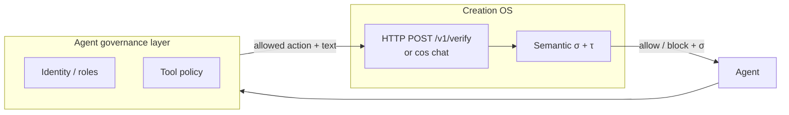

# Agent governance + Creation OS verification

**Audience:** integrators wiring enterprise agent governance with σ-gates.

Microsoft-style agent governance (for example the Agent Governance Toolkit direction) focuses on **authorization**: which principal may invoke which tool, under which policy. Creation OS focuses on **epistemic reliability**: whether a proposed natural-language output (or extracted claim) should be trusted, using measured σ and terminal actions (`ACCEPT` / `RETHINK` / `ABSTAIN`).

Together:

- **Governance** answers *who* may act and *what* the runtime allows.
- **Verification** answers *whether* the content is safe to commit or execute.

## Architecture



## Python bridge

`integrations/agent_governance/sigma_middleware.py` defines `SigmaPolicy`, which calls a running `cos serve` instance:

- **Default URL:** `http://127.0.0.1:3001/v1/verify`
- **Body:** `{"text": "...", "model": "optional-model-id"}`

If the aggregate verdict is `ABSTAIN`, or σ exceeds the configured τ, `evaluate_sync` returns `allow: false`.

### Example (optional `agent_os` package)

If your stack exposes `StatelessKernel`, `ExecutionContext`, and `Policy`, compose σ like any other policy:

```python
# Optional third-party imports — see sigma_middleware.py
# from agent_os import StatelessKernel, ExecutionContext, Policy
from integrations.agent_governance.sigma_middleware import SigmaPolicy

policies = [
    # Policy.read_only(),
    SigmaPolicy(cos_host="127.0.0.1", cos_port=3001, tau=0.5),
]
```

Run `cos serve` (with a healthy local OpenAI-compatible inference backend) on the chosen port before agents call verify.

## Operational notes

- **Latency:** verification may add HTTP and sampling cost; see `cos chat` stderr latency budget lines.
- **Evidence class:** integration behavior is **repository reality** (stdio / HTTP wiring); headline AUROC or harness claims belong in separate benchmark artifacts — see [CLAIM_DISCIPLINE.md](../CLAIM_DISCIPLINE.md).
