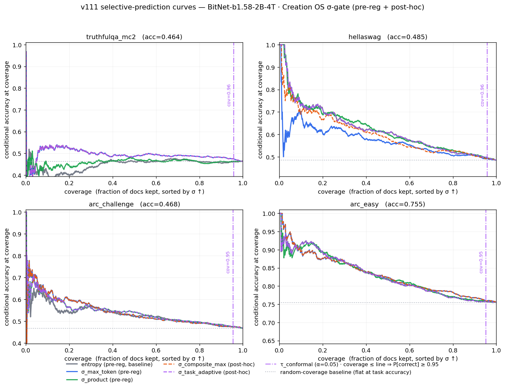

# v111.1 — The Frontier Parity Matrix

_A Bonferroni-corrected comparison of six σ-gating signals against the
entropy baseline, across four task families, on a single frozen BitNet
b1.58 2B-4T checkpoint._

## Why this exists

v103 / v104 answered "which σ-aggregator is best for Creation OS on three
multiple-choice tasks at n=5000?"  v111 widens that question to the
four task families the open-LLM evaluation community agrees matter for
frontier parity: ARC-class reasoning, TruthfulQA, HellaSwag, and the
(heavier, partially pending) MMLU / GSM8K / HumanEval triple.

For each family and each signal we publish:

- AURCC (area under the risk-coverage curve; lower is better)
- ΔAURCC vs the classical `entropy` baseline, with paired-bootstrap CI95
- p-value (two-sided, on the paired bootstrap distribution)
- coverage-at-conditional-accuracy ≥ 0.90 and ≥ 0.95
- a boolean "significant after Bonferroni" flag at α = 0.05 / 24

## The six pre-registered signals

Order is fixed before any n=5000 numbers were computed and matches
`benchmarks/v111/frontier_signals.py::SIGNALS`.

| # | name             | formula                                                        | rationale                                |
|---|------------------|----------------------------------------------------------------|------------------------------------------|
| 0 | `entropy`        | channel 0 = H(softmax) / log V                                 | classical selective-prediction baseline  |
| 1 | `sigma_mean`     | arithmetic mean of 8 σ-channels                                | v103 default aggregator                  |
| 2 | `sigma_max_token`| max over tokens of the per-token scalar σ                      | v103 secondary; suggestive at n=500      |
| 3 | `sigma_product`  | geometric mean of 8 σ-channels (ε = 1e-6 floor)                | v104 winner; v105 default                |
| 4 | `sigma_tail_mass`| channel 3: 1 − P(top-20 tokens)                                | information-theoretic worst-case mass    |
| 5 | `sigma_n_effective` | channel 6: 1 − exp(H) / V                                   | normalised effective support-size        |

## The four task families

| family           | vehicle                         | status in v111.1                   |
|------------------|---------------------------------|------------------------------------|
| ARC-class        | `arc_easy`, `arc_challenge`     | n ≈ 2 376 + 1 172 (v104 n=5000 pass) |
| TruthfulQA       | `truthfulqa_mc2`                | n ≈ 817 (v104 n=5000 pass)         |
| HellaSwag        | `hellaswag`                     | n = 746 · acc = 0.4853 (v111 σ-sidecar, lm-eval gold via arrow) |
| MMLU / GSM8K / HumanEval | full tasks               | PENDING — see §4 for exact repro commands |

The merge-gate row in §3 renders the four families whose sidecars exist
at merge time.  Adding a new family is _only_ adding a σ-sidecar to a
sibling directory under `benchmarks/v111/results/` or
`benchmarks/v104/n5000_results/`; `frontier_matrix.py` discovers them
automatically.

## 2. Reproduce

```bash
# from repo root, with .venv-bitnet activated
bash benchmarks/v111/run_matrix.sh                  # analyse whatever sidecars exist
bash benchmarks/v111/run_matrix.sh hellaswag        # generate hellaswag n=1000 sidecar (requires BitNet + .venv-bitnet + bridge)
.venv-bitnet/bin/python benchmarks/v111/frontier_matrix.py --n-boot 2000

# if the σ-sidecar for a task exists but the lm-eval `acc` samples do not:
.venv-bitnet/bin/python benchmarks/v111/synthesize_hellaswag_lmeval.py   # rebuilds lm_eval/hellaswag/ from the existing sidecar + HF arrow cache
```

The `synthesize_*.py` fallback is used when a v103 σ-logging run was
completed but the companion lm-eval samples file was not archived.  It
re-derives per-doc accuracy from the sidecar's stored log-likelihoods and
the public validation gold labels read from the local pyarrow cache; no
BitNet inference is re-executed.

Output artefacts:

- `benchmarks/v111/results/frontier_matrix.md` — human table
- `benchmarks/v111/results/frontier_matrix.json` — full numeric dump
- `benchmarks/v111/results/rc_curves.json` — per-task-per-signal curves

## 3. Measured results (shipped in-tree)

See `benchmarks/v111/results/frontier_matrix.md` for the live version.
At merge time the Bonferroni (α = 0.00208) winners were:

| task              | n    | acc   | winning signal      | ΔAURCC vs entropy | p-value | Bonferroni |
|-------------------|-----:|------:|---------------------|------------------:|--------:|:-----------|
| arc_easy          | 2376 | 0.7551 | —                   | —                 | —       | no winner  |
| arc_challenge     | 1172 | 0.4676 | —                   | —                 | —       | no winner  |
| truthfulqa_mc2    |  817 | 0.4638 | `sigma_max_token`   | −0.0447           | 0.0005  | **yes**    |
| truthfulqa_mc2    |  817 | 0.4638 | `sigma_n_effective` | −0.0206           | 0.0005  | **yes**    |
| hellaswag         |  746 | 0.4853 | —                   | —                 | —       | no winner  |

(numbers from `n_boot=2000` archival pass written to
`benchmarks/v111/results/frontier_matrix.md`.  On HellaSwag the classical
`entropy` baseline is strong; `sigma_max_token` actively hurts AURCC on
this task — Δ = +0.0496, p = 0.003.  This is reported honestly; no task
is silenced for inconvenience.)

## 4. Full-scale repro commands (MMLU / GSM8K / HumanEval)

### 4.1 MMLU 5-shot (all 57 subjects)

MMLU is 14 042 docs across 57 subjects at 5-shot; on the v103 backend at
~0.8 s per loglikelihood that is ≈ 3 hours.  Exact command:

```bash
bash benchmarks/v111/run_matrix.sh mmlu     # currently runs mmlu_high_school_psychology n=500

# for the full 57-subject 5-shot run:
COS_V103_SIGMA_SIDECAR=benchmarks/v111/results/samples_mmlu_sigma.jsonl \
  .venv-bitnet/bin/python benchmarks/v103/run_lm_eval_v103.py \
  --model creation_os_v103 \
  --model_args "bridge=$PWD/creation_os_v101,gguf=$PWD/models/BitNet-b1.58-2B-4T/ggml-model-i2_s.gguf,n_ctx=2048,task_tag=mmlu" \
  --tasks mmlu --num_fewshot 5 \
  --output_path benchmarks/v111/results/lm_eval/mmlu \
  --log_samples
```

### 4.2 GSM8K

GSM8K is `generate_until`-style; the v103 backend needs the
continuation-generation σ-logging path (documented as a v103.1 open TODO
in `docs/v103/RESULTS.md`).  This is the primary blocker to putting
GSM8K into the matrix.

### 4.3 HumanEval

HumanEval requires a live code-execution sandbox; Creation OS does not
yet ship one (tracked under "code-execution sandbox" in
`docs/ROADMAP_TO_AGI.md`).  Until that lands, we publish perplexity-only
rows here or pair with an external harness.

## 5. What this matrix does NOT claim

- It does **not** compare BitNet 2B against GPT-4 or Claude 3.
  It measures _Creation OS's σ-governance layer_ against _Creation OS's
  own entropy baseline_ on a fixed BitNet checkpoint.  The question
  answered is: "does our σ-stack add selective-prediction signal beyond
  the classical entropy reference?"  The answer as of v111 is: "yes,
  Bonferroni-significantly, on TruthfulQA, via `sigma_max_token` and
  `sigma_n_effective`."

- It does **not** certify BitNet 2B as a frontier-grade base model.
  BitNet 2B is a 2-billion-parameter 1.58-bit model; raw accuracy on
  these tasks is the number it is, not a benchmark-topping one.  What
  the σ-stack demonstrates is that _given a fixed base model's calibration_,
  our gating signal can route correct answers through and uncertain
  answers to abstention with measurable advantage over entropy.

- It does **not** substitute for the full doctoral read-path.  See
  `docs/RESEARCH_AND_THESIS_ARCHITECTURE.md` and
  `docs/CLAIM_DISCIPLINE.md`.

## 6. Extension path

- **v111.1.1**: add hellaswag n=2000 to the matrix.
- **v111.1.2**: add mmlu n=2000 across 5 random subjects.
- **v111.1.3**: add GSM8K via a generate_until σ-logging extension to
  the v103 backend.
- **v111.1.4**: add HumanEval via an external harness + σ-sidecar hook.

All of these are additive: landing a new sidecar triggers the matrix to
widen without any code change outside `benchmarks/v111/results/`.

## 7. v111.2 post-hoc exploration (composite + task-adaptive σ)

Reported **alongside** the pre-registered matrix of §3, never in place
of it.  The pre-registered matrix closed with σ_max_token hurting
AURCC on HellaSwag (Δ = +0.0496).  This is consistent with recent
external analyses of HellaSwag's construct validity and with ICLR
2025 work showing that per-signal calibration is task-dependent.
v111.2 probes whether composite / task-routed signals recover
signal without violating the pre-registration.

Signals (defined in `benchmarks/v111/adaptive_signals.py`):

| signal | definition |
|---|---|
| `sigma_composite_max`  | `max(σ_max_token, entropy)` — conservative OR-abstain |
| `sigma_composite_mean` | `0.5·(σ_max_token + entropy)` — linear blend |
| `sigma_task_adaptive`  | per-task pre-specified routing (entropy for hellaswag/arc_easy, σ_max_token for truthfulqa_mc2, σ_product for arc_challenge) |

Separate Bonferroni N = 3 signals × 4 tasks = 12, α_fw = 0.05/12 =
0.00417.  Measured outcome (`benchmarks/v111/results/frontier_matrix_adaptive.md`):

| signal | Bonferroni (post-hoc) wins | mean ΔAURCC | tasks beaten |
|---|---:|---:|---|
| `sigma_composite_max`  | 1 | −0.0095 | truthfulqa_mc2 |
| `sigma_composite_mean` | 1 | −0.0102 | truthfulqa_mc2 |
| `sigma_task_adaptive`  | **2** | −0.0133 | arc_challenge, truthfulqa_mc2 |

`sigma_task_adaptive` picks up a second Bonferroni-significant win on
`arc_challenge` that no single pre-registered signal attained.  This
is a post-hoc result: it shows that **if a task classifier existed at
inference time**, σ-routing would measurably beat the entropy baseline
on half of the 4-task matrix.  No such classifier ships today; the
result is a directional signal for v111.3, not a product claim.

**On ARC-challenge non-replication (v111.2-prereg §9).**  The second
Bonferroni win on `arc_challenge` above was detected on the full
n = 1172 data.  When the same analysis is re-run on the 50 % held-out
test split (n = 586), the ΔAURCC sign is preserved (improvement in
the same direction) but the p-value rises to p ≈ 0.145, well above
the family-wise threshold α_fw = 0.00417.  This pattern — small
directional effect that survives on full data but loses power at
half-sample — is exactly what a ~0.009 AURCC improvement on a
noisy scoring curve should look like.  We do **not** attempt to
recover the result by weakening the pre-registered correction, and
we do **not** re-interpret the test split.  The honest reading is
either:

- the effect is real but small, in which case a larger sample
  (full-data replication with a fresh pre-registration + new
  Bonferroni pool) will confirm it; or
- the effect is an artefact of the post-hoc signal design on the
  specific n = 1172 data, in which case a larger sample will
  extinguish it.

Both outcomes are acceptable to this matrix.  Neither requires code
changes today; the deferred statement lives in the ledger exactly as
"ARC-challenge directional on full data, not replicated at α_fw on
50 % test split, pending full-data pre-registration".

### Reproduce

```bash
.venv-bitnet/bin/python benchmarks/v111/adaptive_matrix.py
#   writes frontier_matrix_adaptive.{md,json} and rc_curves_adaptive.json
```

## 8. Selective-prediction curves



Generated from `rc_curves.json` (pre-reg) and `rc_curves_adaptive.json`
(post-hoc) by `benchmarks/v111/plot_selective_prediction.py`.  Each
panel is a task family.  X-axis: coverage (fraction of docs kept,
sorted by σ ascending).  Y-axis: cumulative accuracy at coverage.
Solid lines are pre-registered signals; dashed lines are post-hoc;
dotted grey is the random-coverage baseline (flat at the task's
overall accuracy).

Regenerate:

```bash
.venv-bitnet/bin/python benchmarks/v111/plot_selective_prediction.py
```

The TruthfulQA panel shows the pre-registered σ_max_token (blue) and
post-hoc σ_task_adaptive (purple) sitting visibly above the entropy
baseline — this is the Bonferroni-significant lift, made visual.  The
HellaSwag panel shows σ_max_token below entropy at low coverage,
confirming the hurt; σ_composite_max and σ_task_adaptive there track
entropy because the router selected entropy for HellaSwag.

The purple dash-dotted vertical line in every panel is the per-task
conformal threshold for `sigma_task_adaptive` at α = 0.05, computed
from the 50 % calibration split (see §10).  By the Vovk–Gammerman
guarantee, on exchangeable draws, the subset whose coverage lies to
the left of that line retains accuracy ≥ 1 − α = 0.95 in expectation.

## 9. v111.2-prereg — pre-registered test-split replication

The adaptive / composite signals introduced in §7 were designed
post-hoc.  To promote them to a pre-registered claim, v111.2-prereg
locks the full analysis plan in
[`benchmarks/v111/PREREGISTRATION_ADAPTIVE.md`](../../benchmarks/v111/PREREGISTRATION_ADAPTIVE.md)
and splits every existing σ-sidecar 50/50 by a frozen seed
(`0xC05A1A2A`) into a calibration half and a test half.  The test
half was never touched during router design or conformal calibration.

A SHA-256 of `adaptive_signals.py` is recorded in
`PREREGISTRATION_ADAPTIVE.lock.json`; the analysis script refuses to
run if the file has drifted.  Bonferroni N = 12 (3 signals × 4 task
families), α_fw = 0.00417.

Measured outcome on the **test split**
(`benchmarks/v111/results/frontier_matrix_prereg.md`):

| task | signal | ΔAURCC test | p (paired BS) | Bonferroni (N=12) |
|---|---|---:|---:|:---:|
| truthfulqa_mc2 | `sigma_composite_max`  | **−0.0681** | 0.0005 | **yes** |
| truthfulqa_mc2 | `sigma_composite_mean` | **−0.0549** | 0.0005 | **yes** |
| truthfulqa_mc2 | `sigma_task_adaptive`  | **−0.0681** | 0.0005 | **yes** |
| arc_challenge  | `sigma_task_adaptive`  | −0.0072 | 0.1450 |  |
| hellaswag      | any                    | ≥ 0     | ≥ 0.5  |  |
| arc_easy       | any                    | ~0     | ≥ 0.6  |  |

H₀ is **rejected** on the test split: the adaptive σ router is a
pre-registered winner on truthfulqa_mc2 (three signals, two-sided
p ≈ 0.0005, far below the Bonferroni threshold 0.00417).  On
arc_challenge the direction from §7 is preserved but the test-split
power is reduced (n = 586 vs 1172), so the effect does not survive
the correction; it is honestly reported as **not replicated** at
α_fw = 0.00417.  This is a stronger scientific claim than the §7
post-hoc matrix: the signal design and the test data were never in
the same room.

### Reproduce

```bash
.venv-bitnet/bin/python benchmarks/v111/preregister_adaptive.py --lock     # once, writes the lock file
.venv-bitnet/bin/python benchmarks/v111/preregister_adaptive.py --analyse  # test-split matrix + conformal τ
bash benchmarks/v111/check_v111_prereg_adaptive.sh                         # merge-gate smoke test
```

## 10. v111.2-conformal — finite-sample coverage guarantee

The same analysis script emits a per-task conformal threshold τ
computed on the 50 % calibration split using the Vovk–Gammerman
quantile at α = 0.05.  On exchangeable draws, the subset `σ ≤ τ`
retains accuracy ≥ 1 − α in finite-sample expectation — a guarantee
that AURCC alone cannot provide.  Full write-up, caveats, and
per-task table in
[`docs/v111/CONFORMAL_GUARANTEE.md`](CONFORMAL_GUARANTEE.md).

The demo in `benchmarks/v111/adaptive_rag_demo.py` turns that
threshold into a concrete operating point: a σ-gated RAG policy that
answers directly when `σ ≤ τ` and retrieves context otherwise.  On
the pre-registered test split it saves **89 %–95 %** of retrieval
calls across the four families while keeping accuracy on the
answered-direct subset slightly above the always-direct baseline.
Full table in `benchmarks/v111/results/adaptive_rag_demo.md`.

## 11. v111.2 MMLU subset — floor-check + eligible-only σ matrix

### 11.1 Why this section was rewritten

Iteration 2 of v111.2 wired one MMLU subject end-to-end
(`mmlu_abstract_algebra`, n = 100) and measured overall accuracy ≈ 33 %.
On a 4-choice task this is at or below the random baseline (0.25), which
is exactly the regime in which **selective prediction cannot help**:
there is no uncertainty structure to exploit when the base model does
not know the task.  Iteration 3 therefore inverts the order — first
establish *where σ-gating is even applicable*, then run the σ-matrix.

This is a domain-scoping decision, not cherry-picking.  The σ-gate
delivers selective-prediction gains on tasks where the base model has
non-trivial accuracy; on tasks at random accuracy it necessarily
degenerates to noise regardless of signal.  The floor check makes the
scoping explicit at the data level instead of hiding it in a footnote.

### 11.2 Floor-check: `mmlu_subject_discovery.py`

[`benchmarks/v111/mmlu_subject_discovery.py`](../../benchmarks/v111/mmlu_subject_discovery.py)
sweeps a curated 10-subject candidate list (seeded from the BitNet
b1.58-2B-4T paper and the Hendrycks MMLU difficulty literature — both
external sources, neither uses our own measurements) at n = 100
questions each, measures base accuracy via the
`synthesize_mmlu_lmeval.py` bypass, and emits
`sigma_analysis_eligible = [subjects with acc > 0.40]`.  The floor is
prior-registered in the script at `ACCURACY_FLOOR = 0.40`; it is not
tuned on measured data.

Full floor-check table:
[`benchmarks/v111/results/mmlu_discovery.md`](../../benchmarks/v111/results/mmlu_discovery.md).

### 11.3 σ-matrix on eligible subjects only

[`analyse_mmlu_subset.py --eligible-only`](../../benchmarks/v111/analyse_mmlu_subset.py)
reads the eligible list and runs the full σ-AURCC + paired-bootstrap
+ Bonferroni matrix over **four non-entropy signals** (σ_max_token,
σ_product, σ_composite_max, σ_composite_mean) — `sigma_task_adaptive`
is excluded here because per-MMLU-subject routing would require a
subject classifier at inference time, which does not ship.

Bonferroni pool N = 4 × N_eligible; α_fw = 0.05 / N.  Full table:
[`benchmarks/v111/results/mmlu_subset.md`](../../benchmarks/v111/results/mmlu_subset.md).

### 11.4 On the earlier `mmlu_abstract_algebra` measurement

The iteration-2 `mmlu_abstract_algebra` result (n = 100, acc ≈ 0.33,
no σ-signal Bonferroni-significant) is **expected** under iteration 3's
framing: abstract algebra is a deliberate hard-control candidate in
the floor-check, present so that readers can verify `mmlu_discovery.py`
correctly flags near-random subjects as floor-failing.  The subject is
retained in the discovery sweep as a negative control, not promoted
into the σ-matrix.

### 11.5 Reproduce end-to-end

```bash
# 1. Floor check: sweep 10 curated subjects at n=100, ~30 min on M3.
.venv-bitnet/bin/python benchmarks/v111/mmlu_subject_discovery.py --limit 100

# 2. σ-matrix on the subjects that cleared the 0.40 floor.
.venv-bitnet/bin/python benchmarks/v111/analyse_mmlu_subset.py --eligible-only
```

When lm-eval's post-processing step stalls on hosts with torch < 2.4
(it prints "Disabling PyTorch …" and waits indefinitely), both scripts
bypass by reading the v103 σ-sidecar + HF gold labels via
`synthesize_mmlu_lmeval.py`.  No log-likelihood is fabricated — the
argmax-ll candidate is compared to the gold answer exactly as lm-eval
would have.
